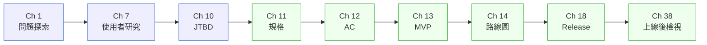
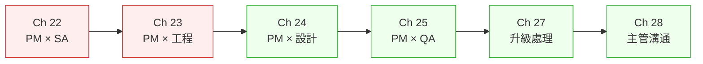
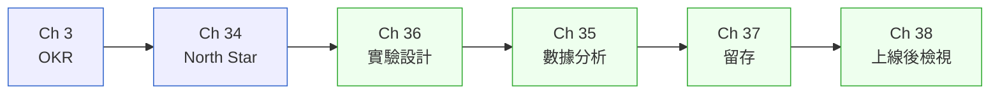
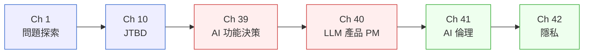

# 如何使用本書

## 章節解剖:每一章在做什麼

每章的六個段落不是格式規定,是一套思考順序。你可以根據自己的狀況選擇進入點。

| 段落 | 標籤 | 用途 | 跳過的代價 |
|---|---|---|---|
| **§X.1 冷觀察** | TENSE | 定錨你為什麼需要這一章 | 框架會懸空,不知道「在哪種現場用」 |
| **§X.2 真問題** | STEADY | 釐清表面需求背後的真實結構 | 可能把框架用在錯誤的問題上 |
| **§X.3 決策框架** | COACHING | 可抄走的判斷工具 | 這就是你來這章要拿的東西 |
| **§X.4 踩坑** | CONSTRUCTIVE | 告訴你這個決策最容易在哪裡爆 | 你會重複別人踩過的地雷 |
| **§X.5 交付** | CONSTRUCTIVE | 空白模板 + 填好範例 | 框架停在腦子裡,沒有落地 |
| **§X.6 Recap** | — | 三分鐘複習摘要 | — |

**急用時的進入策略**：直接跳 §X.3 拿框架,再看 §X.5 的填好範例理解用法。等有時間再回去讀 §X.1 理解脈絡。

---

## 五條閱讀路徑

根據你現在面對的任務,選一條路徑進入:

| 路徑 | 適用情境 | 章節序列 | 預估時間 |
|---|---|---|---|
| **A 路徑** | 剛接手新 PM 職位,需要建立基礎節奏 | Ch 6 → 1 → 2 → 5 → 11 → 16 → 17 → 28 | 3–4 天 |
| **B 路徑** | 要規劃一個新功能,從探索到規格 | Ch 1 → 7 → 10 → 11 → 12 → 13 → 14 → 18 → 38 | 4–5 天 |
| **C 路徑** | 跨職能協作卡住,PM 與工程/設計/QA 有摩擦 | Ch 22 → 23 → 24 → 25 → 27 → 28 | 2 天 |
| **D 路徑** | 指標混亂,不知道在衡量什麼 | Ch 3 → 34 → 36 → 35 → 37 → 38 | 2 天 |
| **E 路徑** | 需要交付 AI 相關功能,首次接觸 LLM 產品決策 | Ch 1 → 10 → 39 → 40 → 41 → 42 | 3 天 |

### 路徑 A — 新 PM 起步路線

### 路徑 B — 功能規劃全流程

### 路徑 C — 跨職能摩擦排除

### 路徑 D — 指標重建

### 路徑 E — AI 功能交付

---

## 最小可行閱讀:只有兩小時,讀哪幾章

根據你當下的危機,選對應的四章組合:

| 你的危機 | 優先讀這四章 |
|---|---|
| 下週要跟 CXO 報 roadmap,不知道怎麼說 | Ch 14、Ch 3、Ch 28、Ch 5 |
| 功能上線了但沒人用,要做 post-mortem | Ch 38、Ch 34、Ch 2、Ch 37 |
| 工程師說「你的規格不夠清楚」 | Ch 11、Ch 12、Ch 22、Ch 4 |
| 被要求接一個 AI 功能但不知從哪裡開始 | Ch 39、Ch 1、Ch 11、Ch 41 |
| 剛接手別人的產品,要快速建立脈絡 | Ch 6、Ch 2、Ch 34、Ch 29 |

---

## 如何使用 §X.5 模板

每章的 §X.5 分兩部分:

**§X.5 交付清單**：列出這個決策場景裡應該產出的 artifact。告訴你「做完這章,桌上應該有什麼」。

**§X.5.1 範例**：一份真實填好的範例。不是通用範本,是針對那一章場景填入的具體內容。

使用方式：
1. 先看填好的範例,確認你理解這份 artifact 在解決什麼問題。
2. 複製空白模板,把範例裡的虛構資訊換成你的真實情境。
3. 進 PRD 或週會之前,用欄位註解做一次自我檢核——缺的欄位就是你還沒想清楚的地方。

模板不是要你填滿每一格。空著的格子是對話起點,不是失格的證據。

---

## 與 SA/SD Playbook 的關係

本書每章末尾都有「SA/SD 對照」區塊,指向 SA/SD Playbook 對應章節。這兩本書的分工是:

| 角度 | PM Playbook | SA/SD Playbook |
|---|---|---|
| 回答的問題 | WHY 做、WHAT 做到什麼程度 | HOW 實作、哪些系統約束決定邊界 |
| 主要讀者 | PM、PO、產品相關利害關係人 | SA、RD、架構師、Tech Lead |
| 使用時機 | 探索階段、規格制定、決策對齊 | 設計階段、技術評估、架構決策 |

**最典型的使用場景**：PM 用本書的 Ch 11（規格）寫出功能規格後,把 SA/SD 對照連結交給 SA,SA 用 SA/SD Playbook 的 Ch 4（需求工程）接手做技術需求轉換——雙方說的話在同一個對照表裡。

如果你的團隊 PM 和 SA 都在讀,每章末的對照區塊就是跨角色的共同語言入口。如果你一個人要兼兩個角色,兩本書的對應章節建議一起讀。

---

下一站:[Ch 1 — Problem Discovery：從需求洪流到有效問題](../part-01-foundation/ch-01-problem-discovery.md)。
