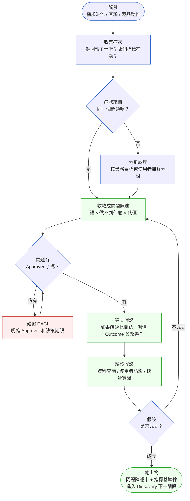
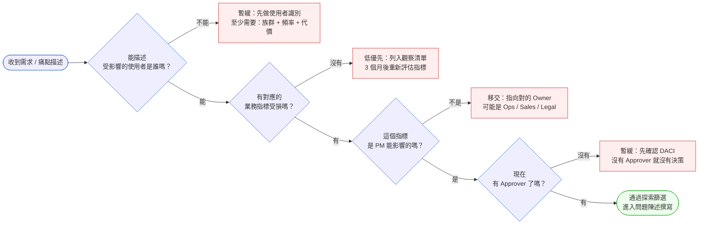

# 第 1 章 | Problem Discovery：從需求洪流到有效問題

> **前置閱讀**：無（本章為起點）
> **下游章節**：[Ch 2　Stakeholder Mapping](./ch-02-stakeholder-mapping.md) ⸺ 問題確認後，才知道該約誰
> **SA/SD 對照**：[SA/SD Ch 4 需求工程基礎](../../book/part-01-foundations/ch-04-requirements-engineering.md) ⸺ SA 視角關注需求的可實作性與完整性；本章關注的是在進入需求工程前，如何確認問題本身是否值得解決。

---

## §1.1 冷觀察

季度規劃第五天早上九點，Loopline 的 PM 收到一份合併後的需求清單。郵件主旨只有兩個字：「請排序」。

Sales 說：通知功能太弱，客戶流失。CS 說：工單流程太複雜，排隊等待時間翻倍。CEO 說：競品剛出了 AI 摘要，我們要跟上。工程師說：技術債太重，繼續加功能會出事。設計師說：介面已經無法再塞東西了。

清單上一共 50 條。每一條旁邊都標了「P1」。

PM 把清單貼到 Notion，花了三天按照「衝擊 × 工程成本」排序，跑了一輪 RICE 評分（一種以觸及人數、影響、信心、工作量計算優先序的評分法），開了兩場對齊會議，把清單縮到 12 條，然後放進了 Sprint 1（為期兩週的開發衝刺）。

Sprint 1 結束，工程師交付了通知功能的新版設計、工單流程的欄位重整、以及一個 AI 摘要的初版 Demo。

沒有任何一條需求的完成，讓 Loopline 的核心指標移動。

三週後，CEO 在週會上問了一句話，沒有人答得上來：「我們到底在解決誰的什麼問題？」

沉默持續了大概四十秒。

PM 低頭看著那份 12 條清單，意識到一件事：這 12 條，沒有一條是「問題」。它們全是解決方案的描述——被客訴催出來的、被競品嚇出來的、被技術債壓出來的解決方案。沒有任何一條回答了「誰，做不到什麼，代價是什麼」這個最基本的問句。

那場沉默，才是 Loopline 真正的 Sprint 1 交付物。

---

## §1.2 真問題

把 Loopline 的狀況拆開來看，問題不在於 50 條需求「太多」，而在於那份清單從頭到尾沒有一條是問題——全是解決方案的映射。

這個混淆發生在三個層次：

### 表面需求（What）

「通知功能太弱」是一個觀察，不是問題陳述。觀察可以對應的解決方案有幾十種：推播通知、信件摘要、Slack 整合、週報、每次行動後的確認彈窗……。沒有問題的定義，解決方案的選擇只是賭博。

「競品出了 AI 摘要」是恐慌，不是需求。競品做的事，可能解決的是他們客戶的問題，不一定是 Loopline 客戶的問題。跟著競品跑，解決的是 PM 的焦慮，不是使用者的困境。

### 業務目標（Why）

往下一層，真正要問的是：**這個觀察背後，什麼業務指標在受損？**

CS 說「排隊等待時間翻倍」——背後的業務問題可能是工單解決率下降、客戶 NPS（淨推薦值，衡量客戶推薦意願的指標）滑落、或是 CS 人力瓶頸。三個方向，對應的解決方案完全不同。如果是 NPS 問題，也許需要的不是流程重整，而是主動通知客戶進度；如果是人力瓶頸，也許需要的是 triage（工單分流，將進入的請求依類型與急迫性歸類派發）自動化，而不是欄位調整。

不問「Why」，只回應「What」，把工程師的時間花在了症狀上，而不是病因上。

### 決策瓶頸（Who × When）

再往下一層，才是最常被忽略的：**誰必須做這個決定？這個決定有期限嗎？**

Loopline 的需求清單，沒有任何一條指出「這個決定的 Approver 是誰」。通知功能的優先順序，是 Sales Leader 能批的？還是需要 CPO 定調？競品跟隨策略，是 PM 可以自行決定的範疇嗎？

沒有 Approver，決策就會在「對齊會議」裡循環——每個人都同意，沒有人負責。

---

### Outputs / Outcomes / Impact 的混淆

Loopline 的 Sprint 1 完成了三個 **Outputs**：通知 UI、工單欄位、AI 摘要 Demo。

但沒有移動任何一個 **Outcome**：沒有提高使用者回應通知的比率，沒有縮短工單解決時間，沒有讓使用者真正用到 AI 摘要。

更遠的 **Impact** 更沒有觸及：客戶流失率沒有改善，工單積壓沒有減少，競品的差距感知沒有縮小。

這三層的混淆，是需求洪流的根因。每一個利害關係人，都在以自己想要的 Output，替代他真正在乎的 Outcome。PM 的工作，不是幫這些 Output 排序——而是強迫所有人回到「我們原本想移動的，是哪一個 Outcome？」這個問題上。

---

### DACI：誰負責這個決策？

問題探索本身也是一個需要明確 Owner 的決策。在 Loopline 的案例裡，問題定義的責任從來沒有被指定出去：

| 角色 | Loopline 的現狀 | 應有的狀態 |
|------|-----------------|------------|
| **Driver**（推動決策） | PM 被動彙整清單 | PM 主動提出「問題陳述草稿」 |
| **Approver**（最終拍板） | 沒有人被明確指定 | CPO 或 CEO 點頭確認問題定義 |
| **Contributor**（提供輸入） | Sales / CS / 工程師各說各話 | 每個人提供的是「現象描述」，不是解決方案 |
| **Informed**（被通知結果） | 沒有人知道問題陳述何時定案 | 所有 Contributor 在問題定義凍結後收到通知 |

問題探索不只是研究工作，它是一個需要 Approver 的決策。沒有 Approver，探索可以無限延伸，或者更危險的情況——在沒有人察覺的情況下悄悄跳過。

---

## §1.3 決策框架

### 圖 A — Problem Discovery 漏斗：症狀 → 問題 → 假設 → 驗證



漏斗有三個容易掉落的缺口：第一個在「症狀收斂」——症狀描述各不相同，但根因可能是同一個，跳過收斂直接列解決方案，就是 Loopline 的狀況。第二個在「DACI 確認」——問題陳述草稿完成，卻沒有人拍板，探索就會在循環裡空轉。第三個在「假設驗證」——驗證結果說不成立，卻因為壓力跳過，繼續往下走，是最貴的浪費。

---

### 圖 B — 問題探索判斷樹：這個需求，值得繼續嗎？



這棵決策樹的核心原則：**一個需求在進入問題陳述之前，必須通過四個檢查點**。任何一個答案是「不能 / 沒有 / 不是」，都不代表這個需求不重要，而是代表它還沒準備好被解決。

---

### 決策表：需求信號來源 × 處理方式

| 信號來源 | 觸發條件（範例） | 推薦做法 | PM 關注點 | 常見錯誤 |
|----------|------------------|----------|-----------|----------|
| **Sales 回報** | 「客戶說功能 X 不好用」 | 先問「哪幾個客戶、用在什麼場景」；確認是個案還是模式 | 銷售動機可能是短期關單，而非長期產品方向 | 把 Sales 的緊迫感直接轉成 Sprint 優先順序 |
| **CS 工單** | 工單量上升 15%+ 或特定類型集中爆發 | 工單做聚類分析，找重複模式；訪談 2–3 個真實使用者 | 工單反映的是使用者的痛，但不一定指向正確的解方 | 直接把工單類型當功能需求 |
| **競品動態** | 競品發布新功能、獲得媒體報導 | 先問「這個功能解決的，是我們客戶的問題嗎？」 | 競品跟隨策略保護市場感知，但消耗工程資源 | 沒有驗證直接抄競品功能點 |
| **CEO / 高層指令** | 「我想要 X 功能」 | 確認 Why：這個請求背後的業務目標是什麼？ | 高層視角廣但脈絡少；需要把指令轉成問題陳述再確認 | 把高層指令當已驗證問題直接排入 Roadmap |
| **資料異常** | DAU 下降、轉換漏斗特定步驟流失暴增 | 優先——資料是最冷靜的信號；向下鑽取找觸發點 | 資料顯示症狀，不顯示原因；需要配合使用者訪談 | 只看數字、不問「為什麼」就決策 |

---

### If-Then 框架：問題探索篩選矩陣

在實際工作中，問題探索常卡在「這個需求值不值得花時間研究」的第一個判斷。以下矩陣幫助快速分類：

**維度 1：緊迫性**（指標目前是否在惡化？）
**維度 2：使用者規模**（受影響的使用者佔總用戶的比例）

| | 使用者規模：小（< 10%） | 使用者規模：中（10–40%） | 使用者規模：大（> 40%） |
|---|---|---|---|
| **緊迫：指標在惡化** | 快速確認：是個案還是早期信號？| 立即探索：分配 1–2 天做訪談 | 停下手邊工作：這是現在最重要的事 |
| **不緊迫：指標穩定** | 觀察清單：3 個月後重評 | 排入下季探索計畫 | 下個 PI（Program Increment，跨團隊的規劃週期，通常 8–12 週）的優先探索項 |

**If-Then 條件動作規則：**

- **If** 信號來自多個不同來源（Sales + CS + 資料）→ **Then** 極可能是真實問題，提高探索優先順序
- **If** 只有一個來源回報 → **Then** 先做快速驗證（訪談 2 人）再決定是否展開完整探索
- **If** 已有競品解決方案存在 → **Then** 先問「競品的解法是否適合我們的使用者族群」，而不是直接採納
- **If** Approver 無法在 1 週內確認 → **Then** 視為決策流程問題，升級給 PM 的主管，而不是等待
- **If** 假設驗證失敗兩次 → **Then** 重新回到問題陳述層，不要在假設層打轉

---

## §1.4 踩坑清單

**反模式：解決方案清單偽裝成需求清單**

現象：需求清單上的每一條，都是「加 X 功能」「改 Y 流程」「和 Z 競品一樣」。沒有任何一條描述的是使用者的困境或指標的惡化。

根因：收集需求的人（Sales、CS、PM 自己）在描述需求時，跳過了「問題是什麼」，直接說出了「解決方案是什麼」。這是人類語言的自然傾向——大腦更容易描述解法，而不是問題本身。

> 修正方向：收到任何需求描述時，先強制回答「這解決的是誰的什麼問題？如果不解決，這個人的哪個指標會惡化？」。不能回答的，退回到問題探索，而不是直接排期。

---

**反模式：RICE 分數替代問題定義**

現象：PM 熟練地跑完 RICE 評分（Reach × Impact × Confidence ÷ Effort），排出優先順序，然後交給工程師開始做。整個過程流暢，但沒有任何人確認：那 12 條「高分需求」，解決的是真實的使用者問題嗎？

根因：RICE 是在問題清楚的前提下，幫助排序的工具。把它用在問題還沒定義清楚的場景，等於用很精確的計算，解答一個錯誤的問題。

> 修正方向：RICE 分數計算之前，先完成問題陳述卡（見 §1.5）。沒有問題陳述的需求，不進入 RICE 計算。

---

**反模式：「我們等 Sprint 結束再來看看使用者反應」**

現象：功能開發前沒有驗證問題，交付後才開始觀察指標。三週後，指標沒動，沒有人能說清楚是功能設計問題、還是問題定義錯誤。

根因：把使用者驗證放在交付之後，是把「驗證成本」外包給了工程師——一個兩天可以用訪談驗證的假設，變成了兩週 sprint 的賭注。

> 修正方向：問題假設驗證應該在進入 sprint 之前。至少兩個使用者的定性訪談，或一個快速的資料查詢，就可以判斷假設是否成立。這不是研究員的工作，是 PM 在問題探索階段的基本職責。

---

**反模式：等到「需求對齊會議」才開始討論問題定義**

現象：PM 把問題定義的討論放在會議裡，結果會議變成了多方立場的拉鋸，每個人都說「我的需求最重要」，最後的結論是「都重要，都做」。

根因：問題定義需要非同步的資料收集和獨立思考，不適合用會議做第一輪討論。把它放進會議，等於用群體壓力取代了問題分析。

> 修正方向：PM 先獨立完成問題陳述草稿，帶著草稿進會議，討論的是「這個定義對不對」，而不是「問題是什麼」。草稿存在，能讓對話變得具體，而不是各說各話。

---

**反模式：問題探索結束後沒有明確的凍結點**

現象：探索持續進行，新的訪談結果不斷加入，問題陳述不斷修改，沒有任何一個時間點被宣佈為「問題定義已凍結，進入 Discovery 下一階段」。

根因：問題探索的開放性，很容易讓 PM 陷入「再收集一點資料就更確定了」的迴圈。這在心理上是合理的，在時間上是災難性的。

> 修正方向：問題探索設定時間盒（time-box，預先固定的探索時段，時間到就收斂決策）：1–2 週。時間結束，Approver 確認問題陳述，正式凍結。後續新資料可以進入下個探索週期，不影響當前週期的決策。

---

**反模式：把「想要新功能」當成問題信號**

現象：Sales 轉達客戶回饋「希望能有 X 功能」，PM 把這條需求直接進 Backlog，開始討論設計方案。三個月後功能上線，客戶沉默——因為他真正的困境是不知道現有功能怎麼用，而不是功能不存在。

根因：功能請求是客戶對自身困境的「自診斷」，不是問題本身。客戶不了解產品的全貌，他說的解法往往是他能想像到的那一個，不是最合適的那一個。PM 把自診斷當問題接收，就跳過了「困境是什麼」這一層。

> 修正方向：收到功能請求，第一個問題不是「這個功能怎麼做」，而是「他現在用什麼方式在解決這件事？」。如果答案是「他根本不知道現有功能可以做到」，問題在 onboarding 或文件，不在功能開發。訪談兩個提出同樣請求的客戶，通常就能分辨。

---

**反模式：把 bug 回報當成功能需求**

現象：客戶在 CS 工單裡說「步驟三一直出錯，可以改成讓我直接跳過嗎？」。PM 把「跳過步驟三」當成一條需求排進 Sprint，工程師做完上線，客戶說體驗更差了。

根因：bug 回報裡夾帶的「建議解法」，是客戶在受挫當下能想到的應急方法，不是他真正需要的體驗。「讓我跳過」的背後，可能是步驟三的說明不清楚、可能是步驟三的前置條件沒被滿足、也可能是流程本身設計錯誤。接受客戶的解法建議，等於讓客戶做了產品決策，而他沒有足夠的系統視角做這個決定。

> 修正方向：收到帶有解法的 bug 回報，先把解法拆掉，還原成「客戶在哪個步驟、遇到什麼阻礙、代價是什麼」。用這個問題陳述去查根因，再決定解法。客戶說的解法可以作為候選方案之一，但不是起點。

---

## §1.5 交付清單 ⸺ 一頁式問題陳述卡模板

問題陳述卡是問題探索階段唯一必交的 artifact。一頁，六個欄位，強制讓寫卡的人回答「誰、做不到什麼、代價是什麼、我們怎麼知道有沒有解決」。

````markdown
# 問題陳述卡（Problem Statement Card）
> 版本:v0.1 | 撰寫日期:YYYY-MM-DD | 擁有人:{名字}

### 1. 問題描述（一句話）
{受影響的使用者族群}，在{情境/場景}中，做不到{具體動作或決策}，導致{可量化的代價或痛點}。

### 2. 受影響使用者
- 族群：{描述}
- 規模估計：{涵蓋總用戶的 X%，或每週 N 個使用者遭遇此問題}
- 資料來源：{工單 / 訪談 / 資料查詢}

### 3. 業務指標（Outcome）
- 主指標：{目前數值 → 目標數值}
- 觀察期間：{X 週 / 月}
- 護欄指標（不能惡化的指標）：{描述}

### 4. 現有解法 & 為什麼不夠
{使用者目前怎麼繞過這個問題？為什麼這個繞路方式不能接受？}

### 5. 我們的假設
如果我們解決 {問題描述}，{主指標} 將在 {X 週} 內改善 {Y%}，因為 {邏輯}。

### 6. DACI
- Driver：{PM 姓名}
- Approver：{具名，不能是「待確認」}
- Contributor：{工程師 / 設計師 / 資料分析師}
- Informed：{Sales Lead / CS Lead}

### 7. 探索截止日期
{問題定義預計凍結日期}：____
凍結後的下一步：{進入 Discovery / 需要更多驗證 / 暫緩}
````

把它存在 `docs/product/problem-statements/`，跟程式碼同 repo，跟 README 同層。

這張卡設計的邏輯：欄位 1 強制語法（誰 × 做不到什麼 × 代價），讓問題描述不能只是「功能 X 很弱」；欄位 5 強制假設邏輯，讓 PM 在探索前先說清楚「解決這個問題，對哪個指標有什麼預期效果」。欄位 6 的 DACI，讓這張卡從分析工具變成決策工具。

### §1.5.1 範例：Loopline 問題陳述卡 ⸺ CS 工單積壓問題

Loopline 的 PM 回到那場沉默之後，從 CS 工單裡找到了第一個可以真正被定義的問題：工單解決率在過去六週下滑了 23%，而資料顯示 60% 的積壓工單，其實在等的不是 CS 的回應，而是使用者自己的確認。

````markdown
# 問題陳述卡 — Loopline × CASE-SAS-101
> 版本:v0.1 | 撰寫日期:2026-02-15 | 擁有人:Jess Lin（PM）

### 1. 問題描述（一句話）
<!-- 為什麼這欄：「誰 × 做不到什麼 × 代價」三件套，沒有這一句，
     後面的假設和指標都會在「我們大概想解決這個方向」的霧裡。 -->
Loopline 企業方案使用者（Workspace Admin），在處理跨團隊工單流程時，
無法即時確認哪些工單在等自己回應，導致工單平均解決時間從 4.2 天拉長至 6.8 天，
且 CS 人工催促成本每週超過 18 小時。

### 2. 受影響使用者
- 族群：Workspace Admin（企業方案，200 人以上帳戶）
<!-- 為什麼這欄：不指定族群，解決方案設計就沒有對象，會變成「所有人都要用的功能」，結果誰都用不好。 -->
- 規模估計：佔全部 Workspace Admin 的 34%（約 420 個帳戶），每週至少遭遇一次此問題
- 資料來源：工單類型聚類分析（2026 Q1）+ 4 次使用者訪談

### 3. 業務指標（Outcome）
- 主指標：工單平均解決時間（Mean Time to Resolution，MTTR）
  目前：6.8 天 → 目標：4.5 天 以內（回到六週前水準）
- 觀察期間：8 週
- 護欄指標：CS 主動聯繫率不增加（目前 2.3 次/工單）

### 4. 現有解法 & 為什麼不夠
使用者目前依賴 email 通知，但 email 在多工單場景下訊號雜亂；
Workspace Admin 反映每天收到 20+ 封工單相關信，
95% 是不需要本人行動的狀態更新，真正需要行動的通知被淹沒。
<!-- 為什麼這欄：解釋「現有解法為什麼不夠」是為了確認這個問題沒有被已有功能覆蓋，
     避免做出與既有解法重複但更差的版本。 -->

### 5. 我們的假設
如果 Workspace Admin 能在一個集中視圖看到「等待本人行動的工單清單」，
工單 MTTR 將在 8 週內縮短至 4.5 天以內，
因為目前積壓原因的 60% 是等待 Admin 確認，而非等待 CS 處理。

### 6. DACI
- Driver：Jess Lin（PM）
- Approver：VP of Product（Michael Chen）
- Contributor：後端工程師（工單通知模組）、設計師、資料分析師
- Informed：CS Lead、Sales Lead（企業方案業務）

### 7. 探索截止日期
凍結日期：2026-06-17（2 週探索時間盒）
凍結後的下一步：進入 Discovery — 設計「待我行動」工單視圖的使用者驗證
````

這張卡讓 Loopline 從「50 條都是 P1」變成了「一個有 Approver、有指標、有假設的問題」。工程師看到這張卡，知道要驗證的不是「通知功能好不好看」，而是「積壓工單的 60% 假設成立嗎」。

---

## §1.6 Recap

讀完本章，你應該已經能做到：

- [ ] 區分「解決方案描述」和「問題陳述」，把收到的需求清單轉換成可驗證的問題假設
- [ ] 用三層拆解（What → Why → Who × When）找到需求背後的業務目標和決策瓶頸
- [ ] 明確 Outputs / Outcomes / Impact 的差異，在問題陳述中指向正確的 Outcome 指標
- [ ] 完成 DACI 識別，確認問題探索階段有具名的 Approver 和凍結時間點
- [ ] 填出一張問題陳述卡，讓「問題是什麼」在進入 Discovery 前就有共識

如果先挑一項做，建議是**填出 Loopline 案例的問題陳述卡**，用自己手邊最近一個「感覺說不清楚的需求」替換案例內容——寫不出「問題描述（一句話）」欄位的那一刻，就是本章最核心的洞察真正發生的時候。

---

## Cross-References

- **下一章**：[Ch 2　Stakeholder Mapping](./ch-02-stakeholder-mapping.md) ⸺ 問題陳述卡完成後，才知道哪些 Stakeholder 需要被納入 DACI
- **強連結**：[Ch 5　Prioritization Frameworks](./ch-05-prioritization.md) ⸺ 問題定義清楚後，才能讓優先排序工具（RICE、MoSCoW）發揮作用
- **強連結**：[Ch 10　Jobs-to-be-Done](../part-02-discovery/ch-10-jtbd.md) ⸺ JTBD 是深化問題探索的下一層工具，適合問題陳述卡完成後進一步挖掘「使用者在完成什麼任務」
- **SA/SD 對照**：[SA/SD Ch 4 需求工程基礎](../../book/part-01-foundations/ch-04-requirements-engineering.md) ⸺ SA 在需求工程中關注功能性與非功能性需求的可實作性；本章的問題陳述卡，是 SA 能收到「品質夠好、可以著手實作」的需求輸入的前提條件
- **SA/SD 對照**：[SA/SD Ch 3 專案啟動與利害關係人分析](../../book/part-01-foundations/ch-03-project-initiation.md) ⸺ SA 視角的 Stakeholder 分析關注技術決策的批准鏈；PM 的 DACI 則關注問題定義的決策責任歸屬
