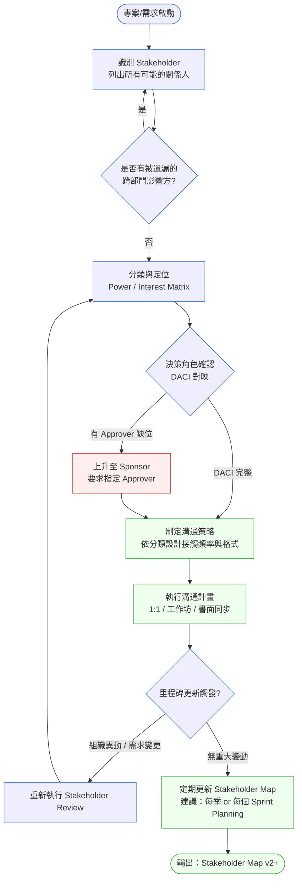
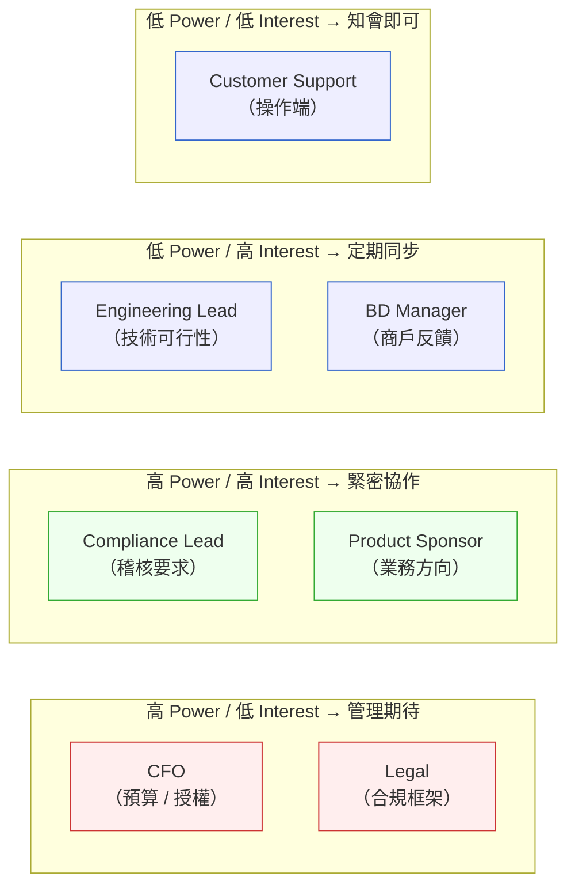
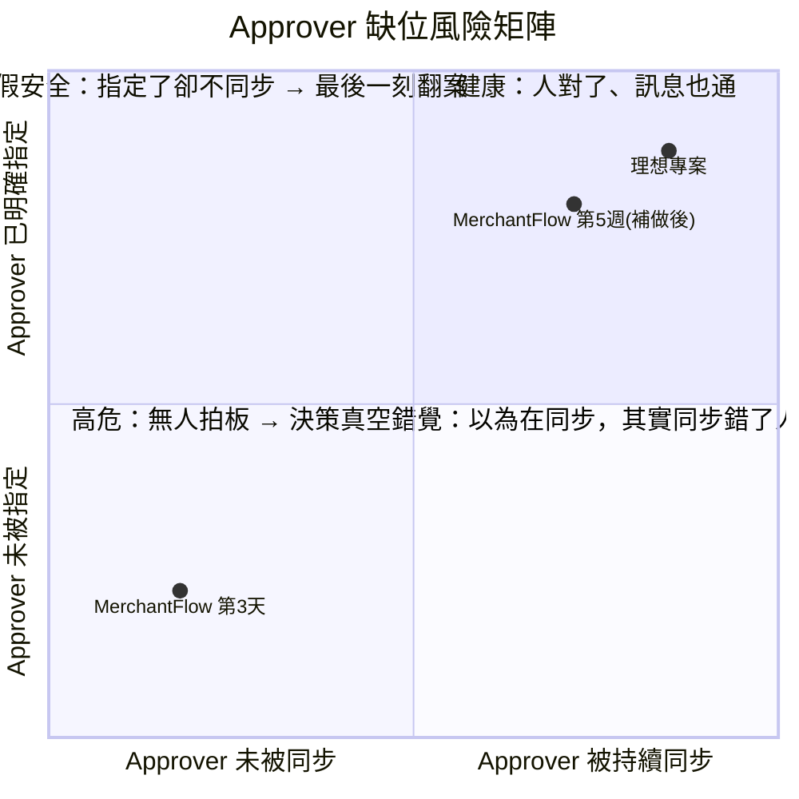

# 第 2 章 | Stakeholder Mapping：誰在乎這件事？誰說了算？

> **前置閱讀**：[Ch 1 — Problem Discovery：從需求洪流到有效問題](./ch-01-problem-discovery.md)
> **下游章節**：[Ch 3 — Product Vision & OKR：為什麼要做這件事](./ch-03-product-vision-okr.md)
> **SA/SD 對照**：[SA/SD 第 3 章 — 專案啟動、可行性研究與利害關係人分析](../../book/part-01-foundations/ch-03-project-initiation.md) ⸺ SA 視角關注 stakeholder 如何影響系統邊界與技術可行性；本章關注 stakeholder 的決策權重與政治動態，以及 PM 如何在多方張力下推動決策。
> **SA/SD 對照**：[SA/SD 第 4 章 — 需求工程基礎](../../book/part-01-foundations/ch-04-requirements-engineering.md) ⸺ SA 視角關注需求的可實作性與完整性；本章關注需求的來源、優先順序背後的政治性，以及誰說了算。

---

## §2.1 冷觀察

季度規劃會議的第三天下午，MerchantFlow 的 PM Vanessa Chen 站在白板前，把新版 KYC（Know Your Customer，了解你的客戶）流程的 roadmap（產品路線圖）走了一遍。

三個月的準備。Compliance（法遵）主管說要。Engineering Lead（工程主管）說能做。Sprint（衝刺迭代）排好了。第一個 KYC 驗證 API 已經寫到第三天。

> 「法務已經 sign off（簽核）了嗎？」

問話的是坐在右邊角落的 CFO（財務長）Daniel Lim。他從頭到尾沒有翻過一頁會議資料，直到這一句。

Vanessa 愣了一下：「我們跟 Compliance 對過……」

> 「Compliance 是 Compliance。法務是法務。這兩個在 KYC 的問題上，立場不一樣。一個怕被稽核開單，一個怕被告。你要我從哪個角度幫你背書？」

那場會議沒有結論。Vanessa 走出會議室，在走廊上接到 Engineering Lead 的訊息：「sprint 要怎麼辦？API 我們已經在切了。」

她靠在牆上，腦袋裡閃過的不是「Daniel 怎麼突然冒出來」，而是三個月前那個她跳過的步驟——kickoff（啟動會議）那天，她手上有一張白紙，本來想把「這件事到底誰要點頭」畫一遍，但 Compliance 已經把需求講得那麼清楚、deadline（截止期限）又那麼明確，她想：「都這麼清楚了，先把 spec（規格）開出來比較實在。」那張白紙後來被她拿去寫待辦清單了。

那是這整件事裡，唯一一個她事後反覆回想的決定。不是法務太晚出現——是她從來沒有在他們該被問到的時候，去問他們。

CASE-FIN-101 的背景是這樣的：MerchantFlow 是一家處理 B2B 支付清算的金融科技公司，客戶是中型電商平台。他們的 KYC 流程已經跑了三年沒改過，但監管環境在 2025 年第二季出現了新的 AML（Anti-Money Laundering，反洗錢）指引，需要在六個月內更新流程。

這個需求表面上很清晰。Compliance 說要改。Regulatory（監管端）說有 deadline。

但 Vanessa 沒有問到一個問題：**誰有權決定「改到什麼程度」？**

法務擔心的是過度收集個資的合規風險。Compliance 擔心的是 AML 稽核的曝險。Business Development（業務拓展，以下簡稱 BD）擔心的是新流程讓商戶 onboarding（開戶導入）時間從三天變成七天、商戶流失率上升。CFO 擔心的是整個 KYC 改版涉及的授權範圍和法律責任歸屬——簽下去的是他，被告的時候站在最前面的也是他。

這四個人，沒有一個人的關切是錯的。但他們沒有坐在同一張桌子上，而 Vanessa 也沒有意識到需要把他們拉到同一張桌子上。她以為自己的工作是「把 Compliance 的需求變成可執行的 roadmap」，但她真正該先做的工作，是「搞清楚這個需求要幾個人點頭才算數」。

Sprint 那週，Engineering 已經開始寫第一個 KYC 驗證 API。

法務在第五週出現了。那時候，已經慢了五週。

---

## §2.2 真問題

把 MerchantFlow 的狀況拆開來看，表面上是「沒有事先對齊法務」。但這只是現象，不是根因。

### 表面需求（What）

Vanessa 收到的需求是：「KYC 流程需要在六個月內更新，符合新的 AML 指引。」

這句話看起來完整，但它藏了三個沒有被問出來的問題：

- 「更新」的邊界在哪？是只改驗證邏輯，還是連商戶 onboarding 介面一起動？
- 誰的 AML 指引？是本地監管機關的，還是 MerchantFlow 所有市場的交集版本？
- 六個月後如果沒做完，誰承擔什麼後果？

這三個問題沒有答案，需求就沒有被真正定義。而值得注意的是：這三個問題沒有一個是 Compliance 能單獨回答的。第一個要 Legal 一起界定範圍，第二個要 Legal 跨市場確認，第三個是 CFO 的責任歸屬問題。換句話說，**需求本身就已經在告訴你誰應該在桌上**——只是 Vanessa 沒有把它讀成 stakeholder（利害關係人）的訊號。

### 業務目標（Why）

KYC 改版的 Outcomes（成果）目標，在 Compliance 和 BD 眼中是完全不同的東西：

| 視角 | Outcomes 目標 | Impact（影響）期待 |
|------|--------------|------------|
| Compliance | 稽核通過，zero finding（零缺失） | 監管風險降低 |
| BD | 商戶 onboarding time ≤ 3 天 | 商戶流失率不上升 |
| Legal | 授權文件鏈完整，無個資過收 | 法律訴訟風險降低 |
| CFO | 預算使用合理，範疇有邊界 | 財務可預測性 |

四個 Outcomes，四個 Impact。這不是目標太多的問題——這是還沒有人把它們攤開來對照過、看衝突在哪。

Vanessa 的 roadmap 只回應了 Compliance 的 Outcomes，但沒有處理 BD 和 Legal 的 Outcomes 衝突。最尖銳的衝突藏在這裡：Compliance 想多收資料（降低稽核曝險），Legal 想少收資料（降低個資過收的法律風險）。這兩個 Outcomes 在 KYC 欄位設計上是**直接對撞**的，而 Vanessa 的 roadmap 預設了 Compliance 那一邊，等於替 Legal 做了一個她無權做的決定。

### 決策瓶頸（Who × When）

這才是核心問題所在。

在 MerchantFlow 的組織結構裡，KYC 改版橫跨了四個部門的職責範圍。但沒有一個人被明確授權「拍板定案」。Compliance 可以說要改，但改到哪個版本、哪個 feature set（功能集合）是 acceptable（可接受）的，需要法務、BD 和 CFO 都點頭。

這個決策缺少一個 DACI（Driver / Approver / Contributor / Informed）結構：

| 角色 | 在 MerchantFlow 的情況 |
|------|----------------------|
| **D** Driver（推動者）| Vanessa ✅ 有 |
| **A** Approver（拍板者）| ❌ 沒有人被指定 |
| **C** Contributor（貢獻者）| Compliance / Engineering ✅ 有 |
| **I** Informed（被通知者）| Legal / CFO ❌ 被降格成 Informed，但實際上應該是 Approver |

法務在第五週出現，不是因為 Vanessa 忘記知會他們；是因為他們從來沒有被邀請進決策鏈。他們是 Approver，卻被放在 Informed 的位置。

### 決策瓶頸識別清單

「沒有 Approver」這件事，往往不是赤裸裸地擺在那裡——它藏在一些日常徵兆裡。下面是 PM 可以拿來自我檢查的清單，每一條都對應 MerchantFlow 當時其實已經出現、但被忽略的訊號：

| 徵兆 | 在 MerchantFlow 當時的對應 | 它真正代表什麼 |
|------|--------------------------|----------------|
| 需求由一個部門提出，但成敗影響到三個以上部門 | Compliance 提出，影響 Legal / BD / CFO | 提出者 ≠ 拍板者，Approver 還沒被定位 |
| 你能說出誰會「不開心」，但說不出誰能「喊停」 | 知道 BD 會抱怨 onboarding 變慢，但不知道誰能否決方案 | Veto（否決權）方未被識別 |
| roadmap 裡有一個假設「某部門應該會 OK」 | 假設 Legal 會接受 Compliance 的範圍 | 你正在替一個 Approver 做決定 |
| 有 deadline，但沒有人對「沒做到」負最終責任 | 六個月 deadline，但責任歸屬模糊 | 決策真空，事故發生時會變成互相指責 |
| 簽約 / 預算 / 法律文件需要某人簽名，但他不在你的同步名單上 | CFO 要簽授權，但只在季度會議才看到方案 | 高 Power（決策影響力）方被排除在決策鏈外 |

只要中了其中兩條，就代表這個專案的決策鏈是不完整的，需要在開 sprint 之前先補。

### Stakeholder Mapping 的啟動時機判斷表

「我應該什麼時候做 stakeholder mapping？」——答案不是「每個專案都做一遍」（那會變成形式），而是「當下列任一觸發條件出現時，主動做」。這張表的目的是讓 PM 不必靠直覺判斷，而有可援引的觸發點：

| 觸發條件 | 為什麼是觸發點 | 該做到什麼程度 |
|----------|----------------|----------------|
| **需求來自跨部門**（提出者與受影響方不同部門） | 跨部門 = 多個 Outcomes 可能衝突 = 多個潛在 Approver | 完整 Power/Interest 分類 + DACI |
| **涉及合規 / 法務 / 風控** | 這類部門通常有 Veto，且常被誤放在 Informed | 必須明確點出 Legal 是 Approver 還是 Contributor |
| **有預算授權 / 簽約動作** | 出錢或簽名的人一定是高 Power，無論他多「不關心細節」 | 把授權方拉進 DACI 的 Approver 欄並排定期同步 |
| **kickoff 前**（任何專案，預設動作） | 此時改決策鏈成本最低，越往後越貴 | 至少畫第一版 Power/Interest，標出未知的 Approver |
| **里程碑觸發**（scope 變更、組織異動、進入新市場） | 決策鏈會隨組織與範疇改變而失效 | 重做 DACI，確認 Approver 是否換人 |

MerchantFlow 的需求**同時命中前三條**：跨部門、涉及合規/法務、需要 CFO 的預算與授權簽核。三條全中，卻一條都沒觸發 Vanessa 去做 mapping——這就是為什麼這個案例值得拆解。它不是一個罕見的失誤，而是一個「徵兆全都在，但沒有人把它當訊號」的典型。

### Outputs / Outcomes / Impact 的混淆

Vanessa 量的是 Outputs（產出）：KYC API 寫了幾個 endpoint（端點）、新的驗證邏輯覆蓋了幾條規則。

她需要量的是 Outcomes：商戶 onboarding 的完成率有沒有下降？稽核文件的完整性是否達到 Compliance 的接受標準？

而 Impact 的問題——AML 合規風險實際上降低了嗎？——在六個月 deadline 之前，沒有人問。

Stakeholder mapping 解決的正是這個問題。不是識別所有人讓他們都滿意，而是**在需求定義前，先搞清楚誰說了算、誰在哪個 Outcomes 上有否決權**。

---

## §2.3 決策框架

### 圖 A — Stakeholder Mapping 工作流程



這張流程圖的觸發點是「專案或需求啟動」，但實務上，第一次做 stakeholder mapping 應該在你打開任何 spec 之前。這個流程在 MerchantFlow 的狀況下，省掉了就是法務在第五週出現的原因。注意流程裡那個紅色節點：當你發現 Approver 缺位時，正確動作不是自己挑一個人當 Approver，而是**上升到 Sponsor（發起人/出資方）要求他指定**——這個區別後面會再強調。

---

### 核心工具一：Power / Interest Matrix

Stakeholder 的分類從來不是一次就定案的，但從 Power（決策影響力）和 Interest（對此專案的關注程度）兩個維度，可以拉出第一版地圖：



MerchantFlow 的問題在圖上一目了然：CFO 和 Legal 被放在「知會即可」的象限，實際上他們在「高 Power / 低 Interest」——不關注細節，但對最終方案有否決權。判斷一個 stakeholder 該放哪個象限時，PM 最常犯的錯是**用「他平常出席嗎」來估 Power**。出席頻率反映的是 Interest，不是 Power。一個從不參加你站會、卻能讓專案停擺的人，Power 是最高的。

---

### 核心工具二：決策框架表

| 情境 / 觸發條件 | 推薦做法 | PM 關注點 | 常見錯誤 |
|----------------|---------|----------|---------|
| **需求來源是單一部門** | 主動問：「哪些部門的工作會被這個改動影響？」 | 有沒有跨部門的 Approver 被排除在外 | 假設 Compliance 說可以 = 所有人說可以 |
| **有人在 Kickoff 之後才出現** | 立即做 DACI 重映射，確認他們的決策角色 | 他們進來是要 Approve、Contribute 還是只是 Inform？ | 把遲到的 stakeholder 當成「麻煩製造者」而非訊號 |
| **兩個 stakeholder 的 Outcomes 互相衝突** | 上升到共同的 Sponsor，要求明確的優先順序 | 哪個 Outcome 的成敗對公司的 Impact 更大 | 自行排優先順序、事後被否決 |
| **組織架構異動（併購、重組）** | 重新執行 stakeholder mapping，不沿用上一版 | 新的決策鏈是否有新的 Approver 或 Veto 方 | 繼續對原 stakeholder 同步，訊息落空 |
| **跨公司 / 跨監管市場的專案** | 每個市場的 Approver 分開列，不合併成一個「Legal」欄位 | 各市場的監管 Outcomes 是否可以用同一個方案覆蓋 | 把「本地 Legal 點頭」等同於「所有市場都 OK」 |

這張表的用法不是查答案，而是**先定位你在哪一行**。你的專案此刻的觸發條件是哪一個，決定了你接下來該關注什麼、該避開哪個陷阱。同一個專案在不同階段可能落在不同行——kickoff 時是第一行，scope 擴大時變第三行，進入新市場時變第五行。

---

### 核心工具三：DACI 對映表（Stakeholder × 決策角色）

DACI 不是一個靜態的頭銜，而是**針對特定決策事項的角色對映**。同一個人在不同決策上可能同時是 Approver 和 Contributor。

```
一個簡單的判斷方式：
- 如果沒有他點頭，這件事不能往前走 → Approver
- 如果他的意見不被採納，他會有正式反對行動（升級、延遲簽署）→ Approver（不是 Contributor）
- 如果他只是「希望知道結果」→ Informed
```

以 MerchantFlow 的 KYC 改版為例，DACI 應該長這樣：

| 決策事項 | Driver | Approver | Contributor | Informed |
|---------|--------|----------|-------------|---------|
| KYC scope 確認 | Vanessa（PM） | CFO + Legal | Compliance, BD | Engineering |
| 技術方案選型 | Engineering Lead | Vanessa | Architecture, DBA | Compliance |
| 商戶 onboarding 流程變更 | BD Manager | Vanessa + CFO | UX, Engineering | Customer Support |
| AML 文件規格 | Compliance Lead | Legal | Vanessa | BD |

每一欄都要能填進真實的人名，不能是「TBD」或部門名稱。「Approver 是 Legal 部門」是一個危險的答案——這代表你不知道具體誰在那個部門能拍板。

一個重要的判準在第一行：為什麼 KYC scope 的 Approver 是「CFO + Legal」兩個人，而不是其中一個？因為這個決策同時涉及**法律責任**（過收個資被告，由 Legal 承擔）和**財務授權**（改版範疇與預算，由 CFO 簽核）——這是兩種本質不同的風險，不能由同一個人代表。當一個決策需要兩個 Approver 時，PM 的工作就多了一項：在他們之間有衝突時，把分歧帶到他們共同的上級去裁決，而不是自己選一邊。

---

### 圖 C — Approver 缺位風險矩陣

決策角色不只有「有沒有指定」這一個維度。即使你填了 Approver，還要看這個 Approver 是不是真的在場、訊息有沒有真的傳到。下面這張矩陣把「Approver 是否被指定」和「Approver 是否被持續同步」交叉起來，幫 PM 判斷自己此刻落在哪個風險區：



這張圖把 MerchantFlow 的軌跡標了出來：第三天時它落在左下的「高危」區——沒有指定 Approver，也沒有同步任何高 Power 方；補做 Stakeholder Map 之後，它移動到右上接近「健康」的位置。

PM 最容易低估的是**右下角的「假安全」區**：你在 DACI 表上填了 Approver 的人名，於是覺得這件事處理好了，但你從來沒有真的把方案送到他面前、給他說不的機會。填名字只是必要條件，不是充分條件。一個被指定卻從不被同步的 Approver，跟沒有 Approver 的風險是一樣的——差別只在於，前者你還誤以為自己是安全的。

---

### If-Then 框架：何時啟動 Stakeholder Mapping 更新

Stakeholder Map 不是做完一次就算數。下面是觸發重新執行的條件判斷：

- **If** 有新的跨部門需求出現 → **Then** 重新做一次 Power / Interest Matrix，確認是否有新的高 Power 方
- **If** 有 stakeholder 的職位異動（升遷、離職、部門合併） → **Then** 重新確認 DACI，尤其是 Approver 是否換人
- **If** 需求範疇擴大超過原始 scope 的 30% → **Then** 回到 Kickoff 前的清單，問：「哪些人現在應該從 Contributor 升為 Approver？」
- **If** 超過兩個 sprint 沒有更新 Stakeholder Map → **Then** 在下一個 Sprint Planning 前，花 30 分鐘走一遍目前的 map 是否還準確
- **If** 有人開始在 Slack 上「突然關心」你的 roadmap 進度 → **Then** 這通常是他們的 interest 升高的訊號，主動安排 1:1 確認他們的角色

---

## §2.4 踩坑清單

**反模式一：把「Compliance 說可以」當成最終授權**

現象：PM 拿到 Compliance 的 sign-off 就開始排 sprint，法務或財務在後期出現並要求修改。

根因：Compliance 的職責邊界通常是「監管規則的解讀」，不包含「法律責任的承擔」和「財務授權」。這三件事在大型金融機構通常是分開的部門、分開的決策鏈，而且彼此的利益並不完全一致——Compliance 傾向「多收資料、降低稽核曝險」，Legal 傾向「少收資料、降低個資過收的訴訟風險」，CFO 傾向「範疇有邊界、預算可預測」。當 PM 把這三個角色壓縮成「合規這邊都 OK」一句話時，等於假設了三個利益其實互相拉扯的部門意見一致。更深一層的根因是：PM 通常會找「最容易接觸、最早回應、講話最有條理」的那個部門當代表，而 Compliance 剛好就是最早把需求講清楚的人——於是「最早講話的人」被誤當成「能拍板的人」。

> 修正方向：在需求 kickoff 前，畫出完整的 DACI 表，明確列出哪些決策需要多個部門的 Approver 共同點頭。遇到跨部門的合規性需求，預設答案是「需要多個 Approver」，而不是「Compliance 說了算」。

---

**反模式二：Stakeholder Map 只在專案啟動時做一次**

現象：六個月後專案中期，發現一開始定義的 stakeholder 有人離職、有人轉部門，但 PM 還在對著舊名單同步。

根因：Stakeholder Map 被當成可交付的 artifact（做完打勾），而不是持續維護的活文件。這個誤解的來源很具體——大多數團隊把 stakeholder mapping 排在專案啟動的「文件產出階段」，跟 PRD（產品需求文件）、kickoff deck 放在一起，一旦進入開發迭代，這份文件就再也沒有被任何流程觸碰過。沒有人擁有「維護它」的責任，因為它的所有權在心智模型裡屬於「啟動階段」，而啟動階段已經結束了。更深的問題是：組織的決策鏈是**動態**的，但 Stakeholder Map 被當成**靜態**的——人會升遷、離職、轉組，部門會重組、合併，預算審批層級會隨公司規模改變。一份三個月前正確的 map，今天可能有一半的 Approver 已經不在那個位子上，而 PM 卻仍在對著它安排 1:1（一對一會議）、發週報，訊息全部落在空位子上。

> 修正方向：把 Stakeholder Map 的更新加進 Sprint Retrospective（衝刺回顧）的清單中。每季固定走一遍：誰的角色變了？有沒有新的高 Power 方進入？更新不需要很正式，一個 15 分鐘的非同步審查就夠。

---

**反模式三：用職稱代替人名填 DACI**

現象：DACI 表的 Approver 欄寫著「Legal 部門」「高階主管」，沒有具體的人名。

根因：PM 不確定具體誰有決策權，或者不想製造對立，所以用組織頭銜模糊帶過。但這個「模糊」不是中性的——它是一種風險的延遲承認。當你寫「Legal 部門」時，你其實在對自己說「我晚點再去搞清楚是誰」，而這個「晚點」往往就拖到了出事的那一刻。更隱蔽的根因是組織政治：在很多公司裡，逼問「這件事到底誰說了算」會碰觸到部門間的權力邊界——可能那個部門內部自己都還沒講清楚誰能代表，PM 一問就等於替他們揭開了一個沒人想處理的問題。於是用「部門名稱」當 Approver，成了一種對所有人都方便的政治妥協：沒有人被點名要負責，也沒有人需要面對「我其實沒有權限拍這個板」的尷尬。代價是，當決策真的需要被拍板時，這個欄位是一張空頭支票——你以為背後有人，其實背後是一個沒有臉的部門。

> 修正方向：每一個 Approver 欄位都要求填入能收到 Slack 訊息的真實人名。如果不確定，就往上問 Sponsor：「這件事誰說了算？」用組織頭銜填 DACI 表，等於把問題往後延。

---

**反模式四：把 Interest 低的 stakeholder 直接排除聯繫**

現象：PM 認為 CFO 不關心這個功能細節，就一直沒有安排過 1:1 或書面同步。CFO 在 quarterly review（季度檢視）上第一次看到這個方案，當場提出重大異議。

根因：Interest 低不等於 Power 低。「他不關心細節」不代表「他對最終方向沒有否決權」。PM 會做這個錯誤推論，是因為日常工作裡 Interest 高的人佔據了你絕大部分的注意力——Compliance 每天找你、Engineering 每天在群組裡問問題，這些人很「吵」，於是你的時間自然流向他們。而高 Power / 低 Interest 的人很「安靜」，安靜到你會誤以為他們不在乎，進而誤以為他們不重要。但 Power 的本質是**否決的能力**，跟參與的頻率無關。CFO 不出現在你的 daily standup（每日站會），不是因為他不在乎結果，而是因為他在等一個「值得他出手的時間點」——而那個時間點，往往就是方案已經成形、要簽字的時候。如果你在那之前完全沒給過他說話的機會，他唯一能行使 Power 的方式，就是在最後一刻喊停。換句話說，**零接觸不是替高 Power 方節省時間，而是把他們的否決全部累積到最危險的一刻才引爆**。

> 修正方向：高 Power / 低 Interest 的 stakeholder，對應的溝通策略是「定期用一頁摘要同步進度，讓他有機會說不，而不是讓他在最後一刻才看到」。異步的書面更新往往就夠了，不需要每週開會；但完全不同步，就是在為驚喜製造條件。

---

**反模式五：Stakeholder 分析只在 B2C 功能上做，B2B 就略過**

現象：團隊對 ToC（面向消費者）的功能會做使用者訪談和 stakeholder 分析，但 B2B 的平台功能因為「客戶只有幾家，跟他們喝個咖啡就好」而跳過正式分析。

根因：B2B 的 stakeholder 結構通常比 B2C 更複雜——一個客戶端可能同時有採購、財務、技術整合、法務、終端使用者等多個 stakeholder，而且他們的利益不一定一致。喝咖啡的對象通常是「跟你關係最好的那個窗口」，但那個窗口往往不是合約的拍板者，更不是出事時要負責的人。B2B 的決策鏈藏在客戶的組織內部，你看不到，而你的單一窗口也未必願意告訴你他其實做不了主。

> 修正方向：B2B 的 stakeholder mapping 更需要正式化，因為每個客戶代表的金額更大、替換成本更高。對每個重要客戶，維護一份內部的 stakeholder map，記錄誰有技術決策權、誰有合約決策權、誰是實際使用者。

---

## §2.5 交付清單 ⸺ 一頁式 Stakeholder Map 模板

以下是本章的核心 artifact：一頁式 Stakeholder Map，包含 Power / Interest 分類、DACI 對映和溝通計畫三個部分。

````markdown
# Stakeholder Map — {專案名稱}
版本：v{N}｜更新日期：{YYYY-MM-DD}｜負責 PM：{姓名}

---

### 1. Stakeholder 清單與分類

| 姓名 / 角色 | 部門 | Power（高/中/低） | Interest（高/中/低） | 象限 | 備註 |
|------------|------|-------------------|----------------------|------|------|
| {姓名}     | {部門} | {高/中/低}       | {高/中/低}           | {見下} | {異動風險 / 立場傾向} |

象限說明：
- 高 Power × 高 Interest → 緊密協作（Manage Closely）
- 高 Power × 低 Interest → 管理期待（Keep Satisfied）
- 低 Power × 高 Interest → 定期同步（Keep Informed）
- 低 Power × 低 Interest → 知會即可（Monitor）

---

### 2. DACI 對映表

| 決策事項 | Driver | Approver（必填人名） | Contributor | Informed |
|---------|--------|----------------------|-------------|---------|
| {決策 1} | {PM 名} | {人名（不接受部門名稱）} | {名單} | {名單} |

---

### 3. 溝通計畫

| Stakeholder | 溝通頻率 | 格式 | 負責人 | 最近一次同步 |
|-------------|---------|------|--------|-------------|
| {姓名}      | {每週 / 每兩週 / 每月} | {1:1 / 書面摘要 / 工作坊} | {PM 或代理} | {日期} |

---

### 4. 更新觸發清單

- [ ] 有新的跨部門需求出現
- [ ] 任何 Approver 的職位異動
- [ ] 需求範疇擴大超過 30%
- [ ] 上次更新距今超過 6 週
````

把它存在 `docs/stakeholder/`，跟程式碼同 repo，跟 README 同層。

這份模板的三個部分是有順序的：先識別分類，再定義決策角色，最後才排溝通節奏。順序反過來（先排會議再想誰應該在）是大多數 PM 的預設路徑，也是 MerchantFlow 狀況的起點。

---

### §2.5.1 範例：MerchantFlow KYC 改版第一週的 Stakeholder Map

Vanessa 在 kickoff 後重新補做了這份 map，時間點是法務出現之後的第一個週一。這是她補做的版本——不是最好的版本，是最真實的版本。

````markdown
# Stakeholder Map — MerchantFlow KYC 改版（AML 合規升級）
<!-- 為什麼這欄：版本號和日期讓三個月後的人能看出這份 map 是否過期；
     缺少版本號的 map 最後會變成「以為是最新的，其實是第一稿」。 -->
版本：v1.1（補做版）｜更新日期：2025-09-12｜負責 PM：Vanessa Chen

---

### 1. Stakeholder 清單與分類

| 姓名 / 角色         | 部門        | Power | Interest | 象限         | 備註                                         |
|---------------------|-------------|-------|----------|--------------|----------------------------------------------|
| Daniel Lim（CFO）   | Finance     | 高    | 低       | 管理期待     | 需要季度書面摘要；對 scope creep 敏感        |
| Rachel Ho（Legal）  | Legal       | 高    | 低       | 管理期待     | KYC 個資收集範圍需要她點頭；v1.0 漏列       |
<!-- 為什麼這欄：Rachel 原本不在清單裡，被漏列的原因是「以為 Compliance = Legal」；
     補進來之後，她的 Power 欄位讓整個 DACI 表的 Approver 欄位立刻變了。 -->
| Kevin Tan（Compliance Lead）| Risk | 高  | 高       | 緊密協作     | AML 要求的原始提出者；每週 1:1               |
| Sophia Wu（BD Manager）| Business Dev| 中  | 高       | 定期同步     | 商戶 onboarding 時間是她的 KPI              |
| Jason Park（Engineering Lead）| Engineering | 中 | 高    | 定期同步     | 技術可行性評估主要來源                       |
| Amy Chen（UX Lead） | Design      | 低    | 中       | 知會即可     | KYC 表單介面更新時拉入                       |

---

### 2. DACI 對映表

| 決策事項               | Driver  | Approver                  | Contributor              | Informed               |
|------------------------|---------|---------------------------|--------------------------|------------------------|
| KYC 收集欄位範圍       | Vanessa | Rachel Ho + Kevin Tan     | Jason Park               | Daniel Lim             |
<!-- 為什麼 Rachel Ho 必須是 Approver 而不是 Contributor：個資過收的法律責任由 Legal
     承擔，出事時被告的是公司、扛責的是法務。Contributor 的意見可以被否決，但
     Rachel 若不被採納會發起正式反對（延遲簽署 / 升級），這正是 Approver 的定義。
     原本只有 Kevin 在 Approver 欄；Rachel 進來後這一行整個重排，因為法律責任和
     稽核要求是兩件事，不能由同一個人拍板。 -->
| AML 文件格式規格       | Kevin Tan | Rachel Ho               | Vanessa, Jason           | Sophia Wu              |
| 商戶 onboarding 流程   | Sophia Wu | Vanessa + Daniel Lim     | Amy Chen, Jason          | Kevin Tan              |
<!-- 為什麼這欄：onboarding 流程變更牽動商戶體驗（Sophia 的 KPI）也牽動成本與授權
     邊界（Daniel 的責任），所以 Approver 是 PM + CFO 雙簽，避免 PM 獨自替財務拍板。 -->
| 技術架構選型           | Jason Park | Vanessa                 | Engineering Team         | Kevin Tan              |

---

### 3. 溝通計畫

| Stakeholder    | 頻率       | 格式         | 負責人  | 最近同步   |
|----------------|------------|--------------|---------|------------|
| Daniel Lim     | 每月       | 一頁書面摘要 | Vanessa | 2025-09-15 |
<!-- 為什麼 CFO 是月度而非週度：他是高 Power / 低 Interest，要的是「方向沒跑偏 +
     有機會在簽字前說不」，不是迭代細節。週度同步會被他當噪音、反而降低他點開的機率；
     月度一頁摘要剛好踩在「他願意讀」與「來得及在季度會議前喊停」之間。 -->
| Rachel Ho      | 每兩週     | 書面 Q&A     | Vanessa | 2025-09-13 |
<!-- 為什麼 Legal 是兩週而非月度：她是 Approver 且 v1.0 漏列過，欄位範圍仍在收斂，
     比 CFO 需要更密的確認節奏，但又不到每週開會的程度——書面 Q&A 讓她能異步回覆。 -->
| Kevin Tan      | 每週       | 1:1 會議     | Vanessa | 2025-09-12 |
| Sophia Wu      | 每兩週     | Sprint Review | Vanessa | 2025-09-10 |
| Jason Park     | 每週       | Slack + 週報 | Vanessa | 2025-09-12 |

---

### 4. 更新觸發清單

- [x] 有新的跨部門需求出現（Rachel Ho 加入）
- [ ] 任何 Approver 的職位異動
- [ ] 需求範疇擴大超過 30%
- [ ] 上次更新距今超過 6 週
````

這份 map 是補做的，代表它已經慢了五週。但從補做的那一刻起，它把「法務在第五週出現」這件事，從意外事件轉成了可管理的風險。Stakeholder Map 沒辦法讓所有人都同意，但它能確保正確的人在正確的時間點被問到正確的問題。

---

## §2.6 Recap

讀完本章，你應該已經能做到：

- [ ] 在任何需求 kickoff 之前，畫出第一版 Power / Interest Matrix，識別高 Power 方是否有人被漏列
- [ ] 用啟動時機判斷表，辨認出「跨部門 / 涉及合規法務 / 有預算授權」這三個必須主動做 mapping 的觸發點
- [ ] 為每一個跨部門決策事項，填出能對應到真實人名的 DACI 表，Approver 欄不接受部門名稱
- [ ] 區分 Compliance、Legal 和 Finance 在不同決策事項上的角色差異，不把「Compliance 說可以」視為最終授權
- [ ] 用 Approver 缺位風險矩陣判斷自己落在「高危 / 假安全 / 健康」哪個區，避免「填了名字就以為安全」
- [ ] 把 Stakeholder Map 的更新觸發條件列入日常工作節奏，而不是只在 kickoff 時做一次
- [ ] 對高 Power / 低 Interest 的 stakeholder，設計異步書面同步而不是零接觸

如果先挑一項做，建議是「補出 DACI 表的 Approver 欄，逼自己填進人名」——這一件事能把最多的隱性風險逼出水面，而且在任何規模的專案都能做，不需要額外工具。下一個需求進到你手上時，別急著開 spec：先拿一張白紙，把「這件事到底誰說了算」畫出來。Vanessa 當年沒做的那一步，你現在就能做，而且只要五分鐘。

---

## Cross-References

- **前一章**：[Ch 1 — Problem Discovery：從需求洪流到有效問題](./ch-01-problem-discovery.md) ⸺ 建立 PM 視角的基礎定位
- **下一章**：[Ch 3 — Product Vision & OKR：為什麼要做這件事](./ch-03-product-vision-okr.md) ⸺ 在 stakeholder 對映清楚之後，才能有效排優先序
- **SA/SD 強連結**：[SA/SD 第 3 章 — 專案啟動與利害關係人分析](../../book/part-01-foundations/ch-03-project-initiation.md) ⸺ SA 視角的 stakeholder 分析關注系統邊界與需求完整性；PM 視角關注決策鏈與政治動態
- **SA/SD 強連結**：[SA/SD 第 4 章 — 需求工程基礎](../../book/part-01-foundations/ch-04-requirements-engineering.md) ⸺ 需求的可實作性判斷，建立在誰說了算已經釐清的前提上
- **延伸閱讀**：[SA/SD 第 36 章 — 治理架構](../../book/part-06-engineering/ch-36-governance-architecture.md) ⸺ 組織層級的決策架構設計，是 DACI 在系統治理層面的延伸
