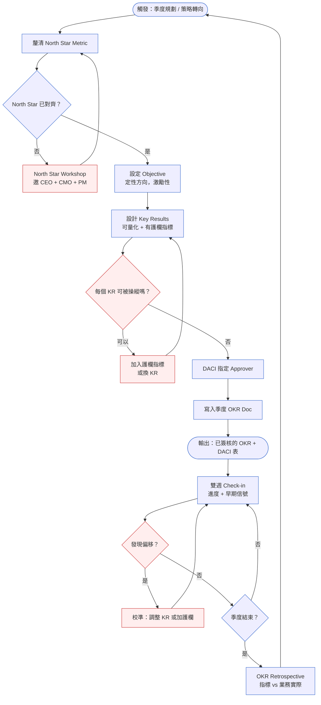
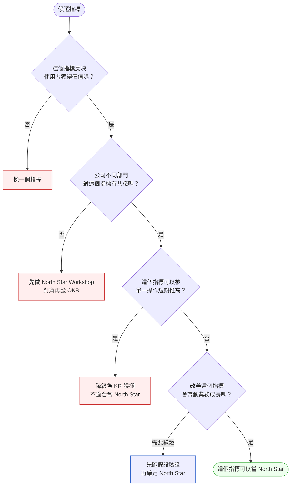

# 第 3 章 | Product Vision & OKR：為什麼要做這件事

> **前置閱讀**：[Ch 1 — 為什麼需要 PM Playbook](./ch-01-problem-discovery.md)、[Ch 2 — PM 的角色定位與決策責任](./ch-02-stakeholder-mapping.md)
> **下游章節**：[Ch 4 — Discovery：從模糊到可行動](./ch-04-requirements-lifecycle.md)、[Ch 6 — PM 的日常節奏](./ch-06-pm-daily-rhythm.md)
> **SA/SD 對照**：[SA/SD 第 3 章 — 專案啟動、可行性研究與利害關係人分析](../../book/part-01-foundations/ch-03-project-initiation.md) ⸺ SA 視角關注專案可行性與系統邊界；本章關注產品方向的決策正當性與衡量方式。
> **SA/SD 對照**：[SA/SD 第 4 章 — 需求工程基礎](../../book/part-01-foundations/ch-04-requirements-engineering.md) ⸺ SA 視角關注需求的可實作性；本章關注需求的優先順序與其背後的策略邏輯。

---

## §3.1 冷觀察

Q3 快結束的那個周四，下午三點，OKR（目標與關鍵結果，Objectives and Key Results）Review 開始。

ShopFlow 的 PM——叫他 Derek 吧——站在白板前，投出一張結果圖。結帳轉換率：目標 15%，實際 17.3%。超標。他說「我們 Q3 超預期完成目標」，停頓，等掌聲。

沒有掌聲。

CMO 翻開下一張投影片。NPS（淨推薦值，Net Promoter Score）趨勢線，Q3 直墜 12 點。客服工單裡排名第一的投訴標題，一字不改：「為什麼沒有稍後購買了？」

那個功能，Derek 在八週前的 sprint（衝刺）規劃裡，以「干擾轉換漏斗」為由靜默下架。沒有通知任何人。沒有對照指標。沒有下架後的追蹤。只有一張 Jira ticket，狀態欄寫著 Done。

CTO 開口，聲音不大：「所以我們達成的，是哪個目標？」

Derek 沒有答上來。

會議室安靜了大概十五秒。在那十五秒裡，所有人盯著同一件事：一個 OKR 達成了，但它量的不是真正要改善的東西。轉換率之所以上升，是因為有人拆掉了讓使用者「暫時離開而非永久放棄」的安全出口，把路逼到只剩結帳或關掉頁面兩條。這招有效——就像把後門焊死，店裡的人確實會停留更久。

OKR Review 提前散場。CEO 在走廊上撂下一句：「指標達成，不等於方向正確。下一季的 OKR，誰來告訴我怎麼寫？」

沒有人接話。因為房間裡沒有一個人說得出，ShopFlow 真正的 North Star（北極星指標）是什麼。（案例：CASE-ECM-101）

---

## §3.2 真問題

把 Derek 的問題拆開來看，表面看起來是「OKR 指標選錯了」，但實際上發生了三層不同的事情。

### 表面需求（What）：轉換率需要提升

Q3 開始時，ShopFlow 的結帳轉換率在業界均值之下，電商業務壓力大，「提升轉換率」看起來是合理的方向。這個 What 本身沒有問題。

問題在於沒有人問下一個問題：用什麼方式提升，算做到了什麼？

### 業務目標（Why）：指標達成 ≠ 業務健康

區分三個層次有助於看清這個問題：

| 層次 | 在 ShopFlow 的對應 | 實際量到的 |
|---|---|---|
| **Outputs**（做了什麼） | 移除「稍後購買」、簡化結帳流程 | 功能下架，sprint velocity 正常 |
| **Outcomes**（使用者行為改變了嗎） | 轉換率 +17.3%，但 NPS -12 | 強制轉換 ≠ 主動購買意願提升 |
| **Impact**（業務指標） | 季度 GMV（商品交易總額，Gross Merchandise Value）短期持平，次季留存待觀察 | 留存率、回購率尚未納入追蹤 |

Derek 量的是 Outputs（功能下架）帶出的短期 Outcomes（轉換率），但 ShopFlow 真正想改善的是 Impact（長期健康的購買行為）。這三層沒有對齊，OKR 就成了一個可以被操縱的遊戲。

這件事其實是一個更深的設計問題：**當 Key Result 可以用降低品質來達成，就需要護欄指標（guardrail metrics）**。沒有護欄指標的 OKR，只是壓力下的指標遊戲。

### 決策瓶頸（Who × When）：誰應該在什麼時候拍板這件事

下架「稍後購買」功能是一個有業務影響的決策，但它在一個 sprint 規劃會議裡，由 Derek 一個人決定了。沒有 CMO 輸入（購買意願資料），沒有 CS 輸入（客服工單預警），沒有 CEO 或業務主管的 Approver 確認。

DACI（Driver-Approver-Contributor-Informed，決策角色分工框架）從來沒有被設定：

| 角色 | 應有的人 | 實際發生的 |
|---|---|---|
| Driver（推動決策） | PM（Derek） | Derek（有發生） |
| Approver（最終拍板） | VP Product 或 CMO | 沒有人 |
| Contributor（提供輸入） | 設計師、CS、數據分析師 | 沒有人被問到 |
| Informed（通知結果） | CMO、客服主管 | Q3 結束才知道 |

決策瓶頸不是 Derek 的能力問題，而是 ShopFlow 沒有一個機制讓「有業務影響的產品決策」自動觸發對應層級的核准流程。

收束這個段落的問題是：**ShopFlow 原本想改善的是 Outcomes（使用者願意購買），還是 Impact（長期 GMV 成長）？他們量的又是哪個？**

兩個問題的答案不同，導致 OKR 設計完全不同。這是 North Star 缺席的代價。

---

## §3.3 決策框架

### 為什麼 North Star 必須在 OKR 之前

Derek 的 Q3 問題表面上是「KR 選錯了」，但更深一層的原因是：ShopFlow 沒有一個所有人都認同的 North Star，所以沒有人能在當下判斷「結帳轉換率 +17.3%」是好事還是壞事。

這就是 North Star 存在的理由：**它是評判所有 KR 好壞的唯一基準。**

沒有 North Star 時，各個團隊的 KR 可以分別往「對的方向」移動，但整體業務仍往錯的方向走——因為每個 KR 拉的是不同的繩子，沒有一條主繩定方向。具體來說：

- Checkout 團隊的 KR 是「結帳轉換率 +15%」→ 達成了
- Growth 團隊的 KR 是「新用戶獲取 +20%」→ 達成了
- 但兩個 KR 都沒有問：這些轉換和新用戶，30 天後還在嗎？

North Star 的作用是讓所有人在季初就先對「什麼叫做業務真的變好了」達成共識，然後每個 KR 才能被評判：「這個 KR 移動的方向，會讓 North Star 往好的方向走嗎？」

沒有這個共識，OKR 的季末 review 就只剩下數字比較，沒有方向判斷。Derek 站在白板前，報告「超標達成」，卻答不上 CTO 那句「我們達成的，是哪個目標？」——就是因為這個共識從來不存在。

**所以正確的順序是**：先對齊 North Star → 再設 Objective → 再設 KR → 最後加護欄指標。每一層都對上一層負責，North Star 是整條鏈的起點。

---

### 圖 A — OKR 設定循環工作流程

OKR 設定不是季初填一張表、季末看結果的儀式。它是一個循環，每個環節都有觸發條件、輸入與輸出。



這張圖有兩個關鍵決策點值得停下來看：

**決策點 G（KR 是否可被操縱）**：這是 Derek 的案子出問題的地方。「結帳轉換率 +15%」是可被操縱的 KR，因為它不排除「強制轉換」這條路徑。在這個節點加入護欄指標（如 NPS ≥ 前期、稍後購買使用率）可以封掉捷徑。

護欄指標的門檻要怎麼定才算有效？光是知道「需要護欄」並不夠，門檻過寬等於沒有護欄，門檻過嚴則每週都在誤報。實務上有三個基準可以組合使用：

第一，**從歷史基線推導下限**。護欄被觸發的條件是：指標低於「變更上線前一週均值」的幅度，超過該指標正常週間波動的一個標準差。以 NPS 為例，若歷史週間波動約 ±3 點，則基線均值減 5 點可設為初始警戒線——5 點超出正常波動，不是雜訊。

第二，**不對稱成本測試**。若這個 KR 的目標增益是 X%，護欄門檻應設在「一旦跌破，所損失的業務價值超過 X% 增益帶來的收益」這個位置。換句話說，護欄要能在增益被侵蝕殆盡之前就發出信號。

第三，**連續兩次 check-in 才觸發升級**。單一數據點可能是統計噪音，連續兩個雙週 check-in 都在下限以外，才視為真正的偏移需要決策介入。

回到 ShopFlow 的案例：第 2 週 check-in 時，NPS 已從基線跌落 12 點，遠超正常週間波動。如果當時有定義「NPS 低於基線 5 點且連續兩次 check-in」即為護欄觸發，Derek 的團隊就會在第 4 週前收到升級信號，而不是等到季末 NPS 崩潰才復盤。

**決策點 M（Check-in 發現偏移）**：大多數 OKR 問題在雙週 check-in 時已有早期信號，但如果 check-in 只是「進度匯報」而非「信號偵測」，偏移會被壓到季末才爆。

---

### 圖 B — North Star 判斷樹

設定 OKR 之前，North Star 必須先定清楚。這張圖協助判斷一個候選指標是否適合當 North Star。



North Star 指標的常見誤區是把「業務指標」直接當 North Star。例如 GMV、DAU（日活躍使用者，Daily Active Users）、MAU（月活躍使用者，Monthly Active Users）都可以被短期操縱（促銷衝 GMV、推播衝 DAU），因此通常不適合單獨作為 North Star，而是配套指標。更好的候選通常是反映使用者真實獲得價值的行為指標，例如「完成首次採購的 7 日留存率」或「回購率 ≥ 2 次的活躍買家比例」。

---

### 先行指標 vs. 落後指標：Check-in 時看什麼

North Star 通常是**落後指標（Lagging Indicator）**：它反映過去四到八週的行為積累，季末才能確認移動方向。一個常見問題是：等到落後指標出現問題，調整已經太晚了。

解法是在 KR 設計時，為每個落後指標配對一個**先行指標（Leading Indicator）**，讓 PM 在 Week 4 就能看到預警信號：

| 落後指標（季末確認） | 對應先行指標（每週/每兩週確認） | 觀察頻率 |
|---|---|---|
| 30 日回購率（North Star） | Day-1 NPS、首購完成率 | 每週 |
| 結帳轉換率（KR） | 購物車放棄頁停留時間、稍後購買使用率 | 每兩週 |
| 客服工單投訴量（護欄） | CSAT（客戶滿意度）、當週新增特定類工單數 | 每週 |

**Check-in 時的正確問法**：「先行指標往對的方向走了嗎？」先行指標沒動，落後指標就不會動；先行指標反方向走，就是校準時機，不是季末再驚訝的理由。

---

### Committed vs. Aspirational OKR：你寫的是哪一種？

在 Google、Stripe 的 OKR 實踐中，KR 被分為兩種類型，混淆兩者會造成嚴重的心理安全問題：

| 類型 | 定義 | 達成標準 | 適合情境 |
|---|---|---|---|
| **Committed OKR** | 承諾型——必須達成，未達成要追責 | 100%（允許 ±5%） | 路線圖依賴、跨團隊鎖定資源、契約承諾 |
| **Aspirational OKR** | 拉伸型——70% 達成即為成功 | 70% = 正常；100% = 設太低了 | 探索性目標、創新方向、學習型任務 |

Derek 的 Q3 問題有一個隱藏維度：**轉換率 KR 被當作 Committed OKR 執行，但當初設定時是 Aspirational 的心態**。這種混淆讓他在壓力下把捷徑（移除功能）合理化為「達成承諾」。

設計 OKR 時，在 KR 旁邊明確標記類型：

```
KR 1：結帳流程完成率 +8%   [Committed]   ← 工程排期已鎖定，跨部門依賴
KR 2：首購 30 日回購率 +3pp [Aspirational] ← 探索性，70% 達成即正確方向
```

---

### OKR 節奏選擇：不同組織型態的週期

並非所有組織都適合標準的季度（13 週）OKR 節奏。節奏設錯，OKR 就變成官僚儀式：

| 組織型態 | 推薦節奏 | 觸發校準的情境 | 注意事項 |
|---|---|---|---|
| **早期新創（< 30 人）** | 6 週 Sprint OKR | 假設被推翻、客戶回饋大幅偏離 | 節奏快，North Star 需要更穩定，不能每次都改 |
| **成長期中型（30–300 人）** | 季度（13 週） | 競品重大動作、外部法規改變 | 標準節奏，本章所有框架默認適用 |
| **企業型（> 300 人）** | 年度 + 季度雙軌 | 年度目標不變，季度 KR 可校準 | PM 的季度 OKR 需對齊年度策略目標 |
| **危機模式（任何規模）** | 週 OKR | 用戶大量流失、主力功能故障、融資失敗 | 護欄指標更重要，避免「救火指標」被操縱 |

**何時在季中重設 OKR（Re-baseline）**：

OKR 不是不能改，但「改得隨便」比「不改」更危險，因為它摧毀了 OKR 的公信力。以下是可接受的 re-baseline 觸發條件：

- 外部觸發：法規新規生效、競品推出直接競爭功能、宏觀環境（如市場收縮）
- 內部觸發：核心假設被數據推翻（如「稍後購買功能使用率 < 5%」代表功能本身假設錯誤）
- 護欄觸發：護欄指標連續兩次 check-in 突破底線，且 KR 目標本身是原因

**不可接受的 re-baseline**：因為達不到目標而改目標。這不是校準，是掩蓋問題。

Re-baseline 必須由 DACI 的 Approver 確認，並在 OKR 文件中記錄「原始目標 / 修改日期 / 修改原因 / 新目標」，讓 retrospective 時能回溯決策脈絡。

---

### OKR 情境決策表

不同情境下，OKR 的設計方式與 PM 的關注點不同：

| 情境 / 觸發條件 | 推薦做法 | PM 關注點 | 常見錯誤 |
|---|---|---|---|
| 產品初期，North Star 未定 | 先做 North Star Workshop，OKR 延後一週設 | 確保 CEO + CMO 都進了房間 | 直接設 KR 跳過 North Star 對齊 |
| 成長期，KR 設計有壓力 | 每個 KR 配一個護欄指標 | 護欄指標不能被同一個行動同向推動 | 護欄指標選用和 KR 高度相關的副指標（形同沒有護欄） |
| 外部環境變化（法規、競品） | 觸發 OKR 校準，不等季末 | 校準紀錄與 Approver 確認都要存檔 | 私下調整 KR 而不更新 DACI |
| 跨部門 Objective（PM + Eng + Design） | DACI 必須跨角色明確，Driver 唯一 | Driver 不能是兩個人 | 兩個 Driver 互相等待，沒人推進 |
| OKR 達成但業務感受不佳 | 觸發 OKR Retrospective，比對 Outputs / Outcomes / Impact | 確認量的層次和原本想改善的層次是否一致 | 只慶祝達成，沒有反思指標設計 |

---

### OKR 向下傳遞：公司 → 團隊 → Sprint

OKR 寫得好，如果工程師不知道它對 sprint 意味著什麼，它就是牆上的裝飾品。傳遞的責任在 PM，不在工程師「自己去想」。

**傳遞邏輯（三層展開）**：

```
公司 Objective：讓買家信任 ShopFlow 的購買決策
    └─ 公司 KR：首購 30 日回購率 +3pp

    團隊 Objective（Checkout PM）：讓猶豫的買家感到被尊重
        └─ 團隊 KR 1：結帳完成率 +8%（護欄：稍後購買使用率 ≥ 12%）
        └─ 團隊 KR 2：結帳後 7 日 NPS ≥ +5

        Sprint Goal（Week 1-2）：恢復稍後購買功能並觀察早期使用率
            └─ Story 1：稍後購買功能重上架（定義完成：A/B test 啟動）
            └─ Story 2：使用率追蹤事件植入（Analytics 確認數據流入）
            └─ 早期信號：Day-3 使用率 ≥ 8%（低於此值 → 下個 Sprint 改 UX）
```

傳遞的關鍵動作：在每個 Sprint Planning 開始時，用一句話說明「這個 Sprint 的目標對哪個 KR 有貢獻、預期移動多少」。工程師知道方向，做取捨時才不會找 PM 問「這個要不要做」。

---

### 跨領域護欄指標範例

不同產業有不同的護欄設計邏輯。以下三個案例說明護欄指標如何在非電商場景應用：

**案例 A（SaaS / B2B）**：公司 OKR 是「Logo 成長 +40%」

- 推動 Logo 成長的常見捷徑：降價、放寬試用、降低合約門檻
- 缺少護欄後果：新 Logo 進來，但 NRR（淨收入留存率，Net Revenue Retention）跌破 100%，代表老客流失速度比新客快，公司實際在收縮
- 護欄指標：`NRR ≥ 100%`（Logo 成長不得以放棄現有客戶為代價）

**案例 B（Fintech / 金融科技）**：OKR 是「用戶利潤貢獻 +15%」

- 推動利潤貢獻的捷徑：調高手續費、壓低風控成本（放寬審核標準）
- 缺少護欄後果：利潤短期上升，但逾期率（delinquency rate）攀升，監管風險積累
- 護欄指標：`逾期率 ≤ 上季基準 +0.5pp`、`監管合規成本不得下降`

**案例 C（Healthcare SaaS / 醫療）**：OKR 是「患者預約完成率 +20%」

- 捷徑：縮短預約流程（跳過確認步驟），推播頻率提高
- 缺少護欄後果：預約完成率上升，但取消率也上升（患者點確認但沒打算出現），醫師時間浪費
- 護欄指標：`預約取消率 ≤ 基準 -5%`、`患者到診率 ≥ 75%`

規律是相同的：找到「達成 KR 最簡單但最有害的捷徑」，然後用護欄把它封住。

---

### If-Then 框架：設計 KR 的五個判斷

這組 if-then 不是要給你「正確的 KR」，而是給你五道自問——在 KR 寫下來之前，逐條過一遍，自己就能判斷它撐不撐得住：

- **If** KR 只反映 Outputs（交付了什麼） → **Then** 它量的是執行效率，不是業務成果。往 Outcomes 層轉換。
- **If** KR 可以透過降低其他體驗指標來達成 → **Then** 它缺少護欄指標。至少配一個方向相反的保護指標。
- **If** KR 的基準線（baseline）不清楚 → **Then** 季末無法判斷是否真的改善了。先在 OKR 文件中填入過去三個月的現況數值。
- **If** KR 的 Approver 欄位是空的或是「TBD」（待確認，To Be Determined） → **Then** 這個決策沒有責任人。DACI 的 Approver 必須是具名個人，不能是「團隊」。
- **If** Objective 讀起來像一個執行任務（「完成 X 功能」） → **Then** 它不是 Objective，而是 Output。Objective 應該描述一個希望達到的狀態或改變（「讓初次購買者對結帳流程感到可信任」）。

把這五道自問套回 Derek 的 Q3，會看得很清楚：「結帳轉換率 +15%」——第一問就過關（是 Outcomes，不是 Outputs），但第二問當場卡住，因為它可以靠拆掉「稍後購買」來達成，缺一個方向相反的護欄。光是第二問，就足以擋下整季的事故。換句話說，這五道題不需要你判斷得多漂亮，只要任何一題答不出來，那個 KR 就還沒準備好寫進文件。

---

## §3.4 踩坑清單

以下是在 OKR 設定循環中最常見的 PM 反模式，每一個在現場都很難即時察覺，因為它們在當下看起來很合理。

**反模式：North Star 缺席，直接跳 KR**

現象：PM 在季度規劃第一天就開始討論 KR 要設多少，沒有任何關於「我們今年的核心成長驅動是什麼」的對話。OKR 文件在三小時內寫完，CEO 簽名，關房門。

根因：設 North Star 需要 CEO、CMO、Product 三方對齊，這個對話通常有衝突、耗時，所以容易被跳過。

> 修正方向：把 North Star Workshop 排進季度規劃前一週，獨立出來。這個會議的輸出是「一張便利貼」：一句話描述我們要改善的使用者行為，和一個可量化的代理指標。有了這張便利貼，後面的 KR 設計才有基準。

---

**反模式：KR 沒有護欄指標，被單點操縱**

現象：OKR 季末達成，但業務感受是「有什麼地方不對」。回頭看，某個 KR 的達成路徑是犧牲了另一個未被量到的指標。

根因：KR 選的是可以被單一行動短期推高的指標，而沒有設定「我們不希望什麼發生」的護欄。

> 修正方向：在 KR 設計階段，問一個問題：「這個 KR 有沒有辦法用降低品質或使用者體驗的方式達成？」如果有，就要加入相反方向的護欄指標，例如「在結帳轉換率提升的同時，NPS 不得低於前期 -5 點」。

**護欄門檻怎麼設：不是拍腦袋，是看歷史波動**

「NPS 不得低於前期 -5 點」這個數字不是憑感覺訂的。設定護欄門檻有三個步驟：

**步驟一：看過去 3–6 個月的自然波動幅度**

指標在沒有主動干預的情況下，本來就會上下浮動。護欄門檻必須設在「自然波動範圍之外」，否則每週都在觸發警報，護欄就失去意義。

| 指標 | 過去 6 個月自然波動 | 護欄門檻建議 |
|---|---|---|
| NPS（季度均值） | ±4 點 | 單季下滑 > 5 點 → 觸發檢討 |
| 結帳轉換率 | ±0.8pp | 連續兩週下滑 > 1pp → 觸發追查 |
| 稍後購買使用率 | ±2% | 跌破 10%（絕對值）→ 觸發 UX 問題排查 |

**步驟二：區分「觸發追查」和「觸發停止」兩個層次**

護欄不是開關，是分級的：

- **黃燈**：超過自然波動，但尚未確認是 KR 的行動造成的 → 調查原因，不停止執行
- **紅燈**：超過 2× 自然波動，或連續兩次 check-in 都在黃燈 → Approver 介入，決定是否調整 KR

**步驟三：排除外部因素再判斷**

護欄觸發時，先問三個問題再決定是否行動：

- 同期有沒有大規模促銷或外部事件影響整體指標？（排除季節性）
- 競品有沒有同期動作讓使用者比較敏感？（排除市場干擾）
- 這個波動是單點還是連續？（單點不行動，連續兩次才升級）

三個問題都排除了，護欄觸發才歸因到 KR 的執行行動上。

---

**反模式：DACI 的 Approver 是「待確認」或「老闆」**

現象：OKR 文件裡 Approver 欄位寫著「Leadership」或「待確認」，或者口頭說「老闆同意的」但沒有具名記錄。季中決策改變時，找不到可以拍板的人。

根因：指定具名 Approver 意味著要去談責任邊界，這個對話不舒服，所以被模糊化處理。

> 修正方向：Approver 必須是一個有名字的人，在 OKR 文件上簽或是在 Slack 上有一條「我確認這個 Objective 的方向」的紀錄。如果找不到願意當 Approver 的人，這個 Objective 不應該出現在 OKR 裡。

---

**反模式：Check-in 變成進度報告，不做信號偵測**

現象：雙週 check-in 時，PM 的報告格式是「進度：75%，預計如期完成」。早期異常信號（如護欄指標開始下滑）沒有人提出，直到季末才發現偏移。

根因：check-in 被設計成「向上匯報」的節奏，而不是「早期預警」的機制。PM 有動機報喜不報憂，直到無法迴避。

> 修正方向：把 check-in 的格式改成三欄：「KR 進度 / 護欄指標現況 / 最近兩週最擔心的一件事」。最後一欄讓提早暴露問題變成常態，而不是失職的信號。

以下是一個 25 分鐘的 Check-in 樣版議程，可直接複製使用：

| 時間 | 議題 | 產出 |
|---|---|---|
| 0–5 分 | KR 進度更新（每個 KR 一句話） | 現況數值 vs 目標 |
| 5–10 分 | 護欄指標健康度（紅 / 黃 / 綠） | 護欄狀態表 |
| 10–20 分 | 「最擔心的一件事」討論 | 待處理風險清單 |
| 20–25 分 | 決定：繼續 / 調整 / 升級討論 | 決議 + Approver 確認 |

護欄指標跌破底線時，不是「繼續觀察」就能應付的。需要在這 25 分鐘內決定：是 KR 設計問題（改護欄定義）、執行問題（加快行動）、還是假設失效（觸發 re-baseline）。把這個決定推到下次 check-in，代價是兩週的延誤。

---

**反模式：Committed 和 Aspirational OKR 混在一起，全部用同一標準衡量**

現象：工程師有一個拉伸型 KR 達到 72%，PM 在 retrospective 時說「沒達成」。工程師覺得委屈——他確實比任何人都努力。

根因：OKR 設定時沒有區分 Committed 和 Aspirational，所有 KR 都被默認為「必須 100%達成」。

> 修正方向：在 OKR 文件中為每個 KR 標記類型（Committed / Aspirational）。Aspirational KR 的 retrospective 問題不是「為什麼沒達成」，而是「我們學到了什麼讓我們到達 72%？為什麼不是 85%？」兩個問題完全不同的後果。

---

**反模式：Objective 寫成執行任務清單**

現象：Objective 欄位寫的是「完成 v2.0 結帳改版」「推出稍後購買 2.0 功能」。這些是 Outputs，不是 Objective。季末功能上線，但沒有人知道要看什麼指標來判斷成功。

根因：用任務語言描述方向，因為任務可以被勾掉、有完成感，而「改善狀態」的語言比較抽象、難以確認完成。

> 修正方向：Objective 用「我們希望在季末達到什麼狀態」的語法來寫。例如：「讓猶豫中的買家有充分的信心決定是否購買」。這個狀態不容易造假，KR 則是用來量化「信心提升」的代理指標。

---

## §3.5 交付清單 ⸺ 一頁式 OKR 設計卡模板

這張卡的目的是在 OKR 設定過程中，讓 PM 在一頁內完整記錄一個 Objective 的決策脈絡：為什麼選這個方向、怎麼量、誰負責、護欄在哪裡。季末 retrospective 時拿出來對照，可以快速判斷哪個環節出問題。

````markdown
# OKR 設計卡
> 版本:v0.1 | 撰寫日期:YYYY-MM-DD | 擁有人:{名字}

### 0. North Star 確認
- 本季 North Star Metric：{指標名稱與定義}
- 目前數值（baseline）：{具體數字 + 來源}
- 這個 Objective 如何改善 North Star：{一句話說明連結}

### 1. Objective
{定性方向，一句話，描述希望在季末達到的狀態。禁止使用任務語法（完成 X 功能）}

### 2. Key Results（最多 3 個）
<!-- 為什麼這欄：KR 必須量化且有明確 baseline，沒有 baseline 就無法判斷是否改善。
     Confidence 欄：H = 路徑清晰，執行風險低；M = 假設待驗證；L = 需要新能力或資源 -->
| KR | 類型 | 目標值 | Baseline | 信心度 | 護欄指標 | 護欄目標 |
|----|------|--------|----------|--------|----------|----------|
| {KR 1} | Committed | {目標} | {現況} | H/M/L | {護欄指標名稱} | {不得低於 / 不得高於} |
| {KR 2} | Aspirational | {目標} | {現況} | H/M/L | {護欄指標名稱} | {不得低於 / 不得高於} |
| {KR 3} | Committed | {目標} | {現況} | H/M/L | （選填） | — |

### 3. 先行指標追蹤
<!-- 落後指標季末才出現，先行指標讓你在 Week 4 就看到預警 -->
| 落後指標（KR） | 對應先行指標 | 觀察頻率 | Week 4 預警門檻 |
|----------------|------------|---------|----------------|
| {KR 1} | {先行指標} | 每週 | {低於此值代表偏軌} |
| {KR 2} | {先行指標} | 每兩週 | {低於此值代表偏軌} |

### 4. DACI
<!-- 為什麼這欄：Approver 必須具名；沒有具名 Approver 代表這個 Objective 沒有人真正負責方向。 -->
- Driver：{PM 姓名}
- Approver：{具名個人，不能是「團隊」或「TBD」}
- Contributors：{工程師、設計師、數據分析師等}
- Informed：{季末通知即可的 stakeholder}

### 5. 決策假設與風險
<!-- 為什麼這欄：記錄「這個方向成立的前提條件」，校準或 retrospective 時可以對照假設是否仍然成立。 -->
- 核心假設：{如果 {X 發生}，則 {Y 會改善}}
- 若假設失效的早期信號：{什麼情況出現代表需要校準}
- 校準觸發條件：{護欄指標跌破 / check-in 連續兩週 X}
- Re-baseline 觸發：{外部觸發條件：法規 / 競品 / 宏觀；或假設被推翻}

### 6. 里程碑
| 時間點 | 預期進度 | 觀察先行指標 | Check-in 重點 |
|--------|----------|------------|--------------|
| Week 4 |  | {先行指標名稱} | {看什麼信號} |
| 季末 | 100% | — | OKR Retrospective |
````

把它存在 `docs/product/okr/`，跟程式碼同 repo，跟 README 同層。

這張卡填完大約需要 90 分鐘，通常在 OKR 設定會議後的隔天完成比較準確，因為現場決策剛做完後細節最清晰。

### §3.5.1 範例：ShopFlow Q4 OKR 設計卡（事後補寫版）

Derek 的 Q3 事故之後，ShopFlow 的 CPO 要求所有季度 OKR 在設定時都填這張卡。這是 Q4 第一個 Objective 的填好版本，它試圖修正 Q3 犯下的問題。

````markdown
# OKR 設計卡 — ShopFlow Q4 Objective 1
> 版本:v0.1 | 撰寫日期:2026-02-15 | 擁有人:Derek Chen（PM, Checkout）

### 0. North Star 確認
<!-- 為什麼這欄：ShopFlow Q3 的問題就是 North Star 沒有對齊，導致 KR 被誤設。
     這一欄逼所有人在設 KR 前先確認方向。 -->
- 本季 North Star Metric：「完成首次購買後 30 日內回購的買家比例」
- 目前數值（baseline）：21.3%（Q3 末，數據來源：Data Platform 儀表板）
- 這個 Objective 如何改善 North Star：讓買家在第一次結帳時建立對平台的信任，
  使他們有意願在 30 日內再次購買，而非因強制轉換而完成交易但不再回來。

### 1. Objective
讓猶豫中的買家在結帳階段感到被尊重，而非被迫決定，以建立長期回購意願。

### 2. Key Results
<!-- 為什麼這欄：Q3 的 KR 可以透過移除功能來達成，沒有護欄。
     Q4 每個 KR 都配了一個方向相反的護欄指標，封住捷徑。
     Confidence：H=執行路徑清晰，M=假設待驗證，L=有外部依賴 -->
| KR | 類型 | 目標值 | Baseline | 信心度 | 護欄指標 | 護欄目標 |
|----|------|--------|----------|--------|----------|----------|
| 結帳流程完成率（不含強制） | Committed | +8% | 54.2% | H | 稍後購買功能使用率 | ≥ 12%（不得低於） |
| 結帳後 7 日 NPS | Committed | ≥ +5 vs Q3 | 38 分 | M | 客服工單：流程投訴類 | 不得超過 Q3 均值 |
| 首購 → 30 日回購率 | Aspirational | +3 pp | 21.3% | L | 結帳轉換率（不能為代價） | 不得低於 Q3 末 -2 pp |

### 3. 先行指標追蹤
| 落後指標（KR） | 對應先行指標 | 觀察頻率 | Week 4 預警門檻 |
|----------------|------------|---------|----------------|
| 30 日回購率 | Day-1 NPS、稍後購買功能使用率 | 每週 | 使用率 < 8% → 下 Sprint 改 UX |
| 結帳後 7 日 NPS | CSAT 評分、客服工單新增速率 | 每週 | CSAT < 4.0 → 立刻開 UX 問題排查 |
| 結帳流程完成率 | 購物車放棄頁停留時間 | 每兩週 | 停留時間 > Q3 均值 +20% → 流程可能有摩擦點 |

### 4. DACI
<!-- 為什麼這欄：Q3 的 Approver 欄位從來沒有被設定，導致下架決策沒有人拍板。 -->
- Driver：Derek Chen（PM, Checkout）
- Approver：Amy Liu（VP Product）
- Contributors：Checkout Engineering Lead、UX Research、CS Ops Lead、Data Analyst
- Informed：CMO、客服主管（季末 OKR Retrospective 前通知）

### 5. 決策假設與風險
- 核心假設：如果「稍後購買」功能恢復且流程更順暢，首購買家的 30 日回購率會提升
- 若假設失效的早期信號：稍後購買使用率 ≥12% 但回購率在 Week 6 仍無改善信號
- 校準觸發條件：任一護欄指標連續兩次 check-in 低於目標，或 NPS 單週跌超過 5 點
- Re-baseline 觸發：若競品在 Q4 推出 Buy-Now-Pay-Later 功能，回購假設需重新評估

### 6. 里程碑
| 時間點 | 預期進度 | 觀察先行指標 | Check-in 重點 |
|--------|----------|------------|--------------|
| Week 4 | 功能恢復上線 | 稍後購買使用率（目標 8%+） | 使用率是否達門檻 |
| Week 8 | KR 進度 50% | NPS 趨勢 + CSAT | 護欄是否健康；回購率早期信號 |
| 季末 | 100% | — | 對照 North Star：30 日回購率是否移動 |
````

這張卡的核心改變是：KR 不再孤立存在，每個 KR 旁邊都站著一個護欄、一個先行指標、一個類型標記。Derek 的 Q3 案子說明的是，沒有護欄的 KR 最終量的是 PM 的創造力，不是使用者的真實改善。

---

## §3.6 Recap

讀完本章，你應該已經能做到：

- [ ] 在設定 OKR 前，先確認 North Star Metric 是否已對齊，並有 baseline 數值
- [ ] 為每個關鍵 KR 配對一個方向相反的護欄指標，封住單點操縱的捷徑
- [ ] 在 KR 旁邊標記 Committed 或 Aspirational，讓 retrospective 問對問題
- [ ] 為每個落後指標（KR）配一個先行指標，讓 Check-in 在 Week 4 就看到偏移信號
- [ ] 用 Outputs / Outcomes / Impact 三層框架，確認 KR 量的是「使用者行為改變」而非「功能交付」
- [ ] 在 DACI 中明確填入具名 Approver，讓每個有業務影響的產品決策都有責任人
- [ ] 把 Check-in 格式改為 25 分鐘三段式，從「進度匯報」升級為「早期信號偵測 + 當場決策」
- [ ] 用 OKR 傳遞模板，讓工程師的 Sprint Goal 能連結到具體 KR

如果先挑一項做，從「為現有的每個 KR 加上一個護欄指標」開始。這個動作不需要重開 OKR 對齊會議，今天下午就能做完，卻能立刻把 OKR 從「可被操縱」變成「有底線」。Derek 在 Q3 缺的就是這一條護欄——而你現在已經知道它該長什麼樣、該擺在哪裡。下一張 OKR，你會比走進那間會議室的人都更清楚自己在量什麼。

---

## Cross-References

- **前置章節**：[Ch 2 — PM 的角色定位與決策責任](./ch-02-stakeholder-mapping.md) ⸺ 本章的 DACI 框架建立在 Ch 2 的決策責任基礎上
- **下一章**：[Ch 4 — Discovery：從模糊到可行動](./ch-04-requirements-lifecycle.md) ⸺ North Star 和 Objective 確認之後，Discovery 是把方向轉換為可驗證假設的下一步
- **強連結**：[Ch 34 — North Star Metric](../part-06-metrics/ch-34-north-star.md) ⸺ 本章介紹 North Star 的選擇邏輯；Ch 34 深入護欄指標設計與指標樹結構
- **SA/SD 對照**：[SA/SD 第 3 章 — 專案啟動、可行性研究與利害關係人分析](../../book/part-01-foundations/ch-03-project-initiation.md) ⸺ SA 視角關注系統邊界確認與技術可行性；本章關注的是在技術可行性討論開始之前，「為什麼要做這件事」是否已有正當性基礎
- **SA/SD 對照**：[SA/SD 第 4 章 — 需求工程基礎](../../book/part-01-foundations/ch-04-requirements-engineering.md) ⸺ SA 用需求工程確保可實作性；PM 用 OKR 確保需求有業務目標支撐，兩者在 Discovery 階段交匯

<!-- PROPOSED-REFS
cases:
  - id: CASE-ECM-101
    title: "ShopFlow 的 OKR 悖論：指標達成，使用者流失"
    domain: ecommerce
    chapters: [ch-03]
    anonymized: true
    summary: |
      虛構電商 ShopFlow：Q3 OKR 目標是「結帳轉換率提升 15%」，達成了。
      但同期 NPS 下降 12 點，因為 PM 移除了「稍後購買」功能以強迫轉換。
      用於展示「指標可以被操縱；OKR 需要配套護欄指標」。
-->
