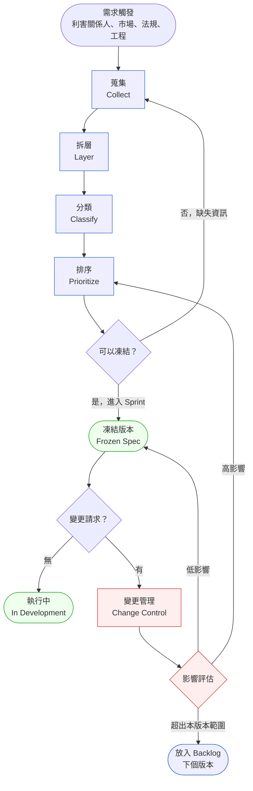
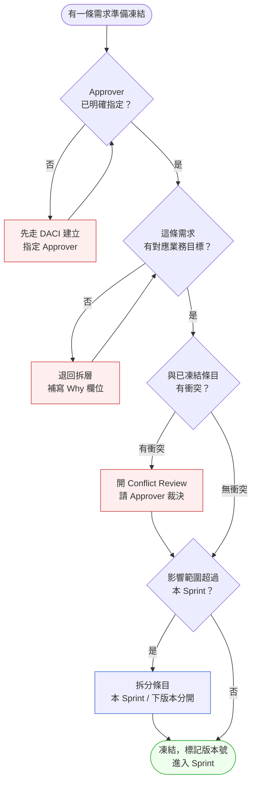

# 第 4 章 | Requirements Lifecycle：需求的生命週期

> **前置閱讀**：[Ch 3 Product Vision & OKR：為什麼要做這件事](./ch-03-product-vision-okr.md) — 沒有清楚的 Why，需求拆層會失去錨點。
> **下游章節**：[Ch 5 Prioritization Frameworks：MoSCoW 之外的選擇](./ch-05-prioritization.md) — 需求凍結之後才能有效排序。
> **SA/SD 對照**：[SA/SD Ch 4 需求工程基礎](../../book/part-01-foundations/ch-04-requirements-engineering.md) — SA 視角關注需求的功能分解與可追蹤矩陣；本章關注需求在組織政治中的凍結時機與變更管理。

---

## §4.1 冷觀察

CareTrack 是一間虛構的醫療 SaaS 公司，產品是給診所用的照護追蹤系統。

Sprint 12 的最後一天，工程師 Jun 打開需求文件的版本比較，看到 v12 和 v1 差了四十七個修改。沒有一條有說明理由。

「這條改掉是因為什麼？」

PM 打開 Slack，往前找了三週的訊息。臨床顧問說要改，所以就改了。那在 v3 又改回來？因為那時候 Sales 帶了一個大客戶進來說要舊做法。v7 又改？那時候法規部門出現了。

六個月，十二個版本，沒有任何一條需求有「為什麼」的記錄。

Sprint 12 的 demo 展示給三位利害關係人：醫院 IT 主管、臨床顧問、產品長。三個人對著同一個功能，說出了三種不同的期待。

「這不是我當初說的那個邏輯。」臨床顧問說。

「但你上週確認過了。」PM 說。

「我確認的是截圖，不是這個。」

那場 demo 提前結束。沒有人生氣，但沒有人做任何決定。工程師回去等，PM 重新約會議，利害關係人說「再想想」。

Sprint 13 的 planning 被推遲了兩週。

這樣的場景在醫療 SaaS 的前期迭代裡反覆出現，不是因為需求本身複雜，而是因為沒有一個人知道需求的「當前有效版本」是什麼——更沒有人知道什麼時候這個版本算定案。

CareTrack 的問題不是需求太多，也不是溝通太少。是需求從來沒有走完一個完整的生命週期。

---

## §4.2 真問題

把 CareTrack 的情況拆開來看，表面上是「spec 一直在改」，但真正的問題分成三層。

### 表面需求（What）

每次修改都有一個局部合理的理由：臨床顧問有臨床依據，Sales 帶來的客戶反饋有市場依據，法規部門的要求有合規依據。每個 stakeholder 都說得通，沒有人在說謊。

問題是，這些修改進來的時候，沒有人問：「這個改動跟我們的業務目標方向一致嗎？」也沒有人問：「這個改動跟已經凍結的部分有沒有矛盾？」

### 業務目標（Why）

CareTrack v1 的產品目標是：讓診所能在三分鐘內完成一次照護記錄更新，並讓後端系統自動同步 HL7（醫療資訊交換標準格式）給轉診醫院。

Outcomes（成果，使用者行為的改變）是：護理師的記錄時間從八分鐘降到三分鐘。

Impact（影響，對業務或外部世界的最終效果）是：轉診延遲從平均 4.2 小時降到 2 小時以內，降低醫療風險並提高診所的轉診接受率。

當需求開始漂移，這個目標從來沒有被重新拿出來對照過。v7 加進來的法規欄位需要護理師多填三個欄位，但沒有人評估這對「三分鐘完成記錄」的 Outcomes 有什麼影響。

Outputs（產出，我們做了哪些功能）被當作交付物，Outcomes（成果，使用者行為是否真的改變）被遺忘了。

### 決策瓶頸（Who × When）

這才是 CareTrack 真正卡住的地方：從來沒有人被指定為需求的最終核准者。

臨床顧問有意見，但他不是拍板的人。Sales 帶反饋進來，但他不負責交付。法規部門說要加欄位，但沒有人知道這個需求是否要進 Sprint 12 或 Sprint 16。

PM 在中間，但沒有決策授權——有的只是整合責任。

DACI（Driver 推動者、Approver 核准者、Contributor 貢獻者、Informed 知會者的決策角色框架）缺位的後果不是決策錯誤，而是決策延遲。每一個「再想想」都讓 spec 多漂移一週。

真正在處理的問題是：這個組織沒有「誰說了算、什麼時候算定案」的共識，所以需求沒有辦法從「討論中」進入「凍結」。

解法對應診斷，缺一不可。What / Why / Who×When 的三層拆解，是對「表面需求不斷漂移」的直接解方：它強迫每條進來的需求在接觸 spec 之前，先被錨定到一個業務目標——沒有 Why 就沒有凍結資格，而 Who×When 則把「誰的意見算數、什麼時候算定案」從隱性的組織默契，變成明文寫進追蹤卡的欄位。DACI 則是對「決策瓶頸」的結構性修復：它在任何凍結動作發生之前，就預先指定了 Approver——不是「之後再確認誰拍板」，而是「還沒有 Approver 就不進凍結流程」。這個前置動作讓 CareTrack 的「再想想」迴圈有了出口：Approver 明確，「再想想」就變成「Approver 的書面確認在幾號前到」，模糊的等待變成有名字、有日期的決策閘門。§4.3 的框架就從這兩個診斷結論出發，給出可以直接複製的流程與決策規則。

---

## §4.3 決策框架

### 圖 A — 需求生命週期工作流程

需求從出現到被正式管理，中間走過六個站。每一站都有觸發條件、動作、輸出物。



六個站的說明：

| 站 | 動作 | 輸入 | 輸出 | 常見失敗點 |
|---|---|---|---|---|
| **蒐集** | 記錄原始需求，不過濾 | Stakeholder 訪談、票單、郵件 | 原始需求清單 | 沒記錄來源，無法溯源 |
| **拆層** | 對應到 What / Why / Who×When | 原始需求 | 三層分析表 | 只記 What，跳過 Why |
| **分類** | 功能 / 非功能 / 合規 / 假設 | 三層分析表 | 分類標籤 | 把假設當成需求 |
| **排序** | 依業務目標權重排序 | 分類後清單 | 優先順序清單 | 由工程難度決定而非業務價值 |
| **凍結** | 指定有效版本，標記變更門檻 | 排序後清單 + DACI 確認 | Frozen Spec v{N} | Approver 未明確確認就推進 |
| **變更管理** | 評估影響、決定進版或放 Backlog | 變更請求 + Frozen Spec | 更新版本或 Backlog 條目 | 每次變更都直接改 spec，不走評估 |

### 圖 B — 凍結決策樹

需求要不要凍結、何時凍結，這張決策樹給出標準判斷路徑。



判斷一條需求是否走完凍結流程，看它能不能回答三個問題：Approver 是誰、業務目標是哪條、版本號是幾。少一個，就還沒準備好進 Sprint。

### 決策表 — 常見情境的推薦做法

| 情境/觸發條件 | 推薦做法 | PM 關注點 | 常見錯誤 |
|---|---|---|---|
| 新 stakeholder 加入，提出舊需求的相反意見 | 先做影響評估，再決定是否開 Conflict Review | 這個人是 DACI 裡的哪個角色？ | 直接接受修改，不評估衝突 |
| 法規部門在 Sprint 中途要求加欄位 | 評估影響，若高影響則下 Sprint 排入，不中途插入 | 合規截止日是什麼時候？這個 Sprint 能不能跳過？ | 緊急感驅動，直接改 spec 破壞凍結狀態 |
| 工程師說「這樣實作成本高，可以改嗎？」 | 開具體的替代方案討論，評估 Outcomes 是否等效 | 業務 Outcomes 是否能在替代方案中達成？ | 以技術可行性取代業務判斷，PM 不參與決策 |
| 客戶反饋說功能不好用，要求修改已凍結的 spec | 判斷是 Outcomes 問題還是 UI 問題；Outcomes 問題進 roadmap，UI 問題考慮補丁 | 這條反饋代表多少比例的使用者行為？ | 所有客戶反饋都進 Sprint，不過濾 |
| Sprint 結束前 PM 還沒拿到 Approver 確認 | 需求不進入 Sprint，先鎖 Backlog | 是 Approver 缺席還是資訊不夠？ | 預設 Approver 沒反應就等於同意 |
| 需求在 Backlog 停留超過三個 Sprint | 重新確認業務目標是否還有效 | 這條需求的 Why 還存在嗎？ | 讓舊需求一直留在 Backlog，佔用討論頻寬 |

### If-Then 框架：需求進入 Sprint 的決策規則

需求從 Backlog 進入 Sprint 前，PM 需逐條確認以下觸發條件：

- **If** 需求的 Why 欄位未填或只寫「改善體驗」等模糊詞 → **Then** 推回需求方，要求補連結業務指標的 Why，不排入本 Sprint
- **If** Approver 尚未指定或在 Sprint planning 前仍未書面確認 → **Then** 需求鎖在 Backlog，不進 Sprint，並主動聯繫 Approver 確認排期
- **If** 需求與已凍結條目存在未解衝突 → **Then** 先開 Conflict Review，由 Approver 裁決後才可排入
- **If** 需求在 Backlog 停留超過三個 Sprint → **Then** 重新確認業務目標是否仍有效；Why 已失效則直接關閉，不繼續佔用討論頻寬
- **If** 收到緊急請求要求插隊進 Sprint → **Then** 要求請求方說明影響的業務指標和時限，並評估是否需要排除現有條目以維持 Sprint 容量
- **If** Approver 在 Sprint 中途提出需求修改 → **Then** 判斷是 Outcomes 問題還是實作細節；Outcomes 問題退回需求生命週期起點，細節問題記錄為下一版本候選

這些規則的目的不是阻擋需求，而是強迫「進 Sprint 前的對話」——讓問題在開發前暴露，而不是在 Demo 當天。

### DACI 在需求生命週期的配置

需求凍結的核心依賴是 DACI 清晰。在醫療 SaaS 的場景下，一個常見的配置是：

| 角色 | 負責人 | 需求生命週期中的動作 |
|---|---|---|
| **Driver** | PM | 推動需求從蒐集走到凍結；協調 Conflict Review |
| **Approver** | Product Director 或 Clinical Lead（依需求類型） | 書面確認 Frozen Spec 版本號；凍結後才能修改 |
| **Contributor** | 工程師、設計師、法規顧問、臨床顧問 | 提供技術可行性、UI 評估、合規意見 |
| **Informed** | Sales、客戶成功、執行層 | 在凍結版本發布後被通知；不在決策迴路中 |

Approver 應該明確點名，不要停在「待確認」——點名得越清楚，凍結就越站得住腳。在 CareTrack 的例子裡，臨床需求的 Approver 和合規需求的 Approver 是不同人，PM 需要維護兩張 DACI 表，依需求類型分流。

---

## §4.4 踩坑清單

**反模式：把 Stakeholder 確認當作凍結**

現象：PM 在 Slack 請示了三個人，三個人都回了「OK」，需求就進 Sprint 了。兩週後，其中一個人說「我當時確認的是截圖，不是邏輯」。

根因：確認截圖和確認行為邏輯是兩件事。視覺呈現一致不等於功能預期一致。「OK」這個字沒有版本號，沒有範圍定義。

> 修正方向：凍結動作必須包含版本號和確認範圍的明確說明。Approver 確認的對象是「Frozen Spec v5 第 3.2 節，照護記錄更新的欄位順序與同步邏輯」，不是一張截圖。

---

**反模式：緊急感覆蓋流程**

現象：法規部門在 Sprint 10 中途出現，說有一個合規欄位必須在「本季度上線」。PM 立刻改了 spec，工程師重排 Sprint。上線後，這個欄位的實作邏輯和原本的資料模型有衝突，修復花了兩個 Sprint。

根因：「必須這季度」是截止日，不是「必須在這個 Sprint 中途插入」的理由。緊急感讓人跳過影響評估，把一個可以排到下個 Sprint 的需求，用破壞流程的方式塞進去。

> 修正方向：在收到緊急請求時，先問截止日的確切日期。如果截止日在下個 Sprint 結束前，就排下個 Sprint。如果截止日在本 Sprint 結束前，才考慮中途插入——但必須做完整的影響評估，並且有 Approver 書面授權插入。

---

**反模式：版本漂移不記因**

現象：需求從 v1 改到 v12，每次都有合理的局部理由，但沒有任何一條記錄改動原因。六個月後，沒有人知道為什麼 v1 的設計被推翻了，也無法判斷 v12 是否比 v1 更接近業務目標。

根因：PM 把 spec 文件當作「當前狀態記錄」，而不是「決策歷程記錄」。每次改動都覆蓋前版，沒有保留 diff 和 rationale。

> 修正方向：每次修改 Frozen Spec，都附一行改動理由和 Approver 簽核記錄。格式不需要複雜：「v8 → v9：加入 HL7 同步欄位，因應北部醫院網絡合規要求，Approver: Clinical Lead，2025-11-14」，一行就夠。

---

**反模式：把所有 Stakeholder 都設為 Contributor**

現象：需求 review 會議有七個人，每個人都有意見，沒有人是最後拍板的。PM 說「那我們下週再確認一下」，下週又來了兩個新意見。

根因：DACI 裡的 Approver 角色被分散或空缺。當每個人都是 Contributor，等同於沒有人負責決定。

> 修正方向：每類需求（功能需求、非功能需求、合規需求）必須各有一個且只有一個 Approver。如果找不到 Approver，這條需求就還沒準備好被討論——要先找到 Approver，再開需求討論會。

---

**反模式：Backlog 成為需求墳場**

現象：Backlog 裡有三十條「之後有空再做」的需求，其中有些是一年前的，有些業務背景早已改變，但沒有人去清理。每次 Sprint planning 都要在這堆舊需求裡找方向。

根因：需求進了 Backlog 就沒有後續的生命週期管理。Backlog 被當作儲存空間，不是決策佇列。

> 修正方向：每個 Backlog 條目都應有「最後確認日期」和「業務目標連結」。每三個 Sprint 做一次 Backlog refinement，主動問：「這條的 Why 還存在嗎？」超過兩個版本沒有被排序的需求，標記為 Archived，不再佔用討論頻寬。

---

## §4.5 交付清單 ⸺ 一頁式需求生命週期追蹤卡模板

每條進入正式流程的需求，維護一張追蹤卡：

````markdown
需求追蹤卡 (Requirement Lifecycle Card)
> 版本:v0.1 | 撰寫日期:YYYY-MM-DD | 擁有人:{名字}

需求 ID:         {REQ-NNN}
版本:            {vN}
最後更新:        {YYYY-MM-DD}

── 蒐集 ─────────────────────────────
來源:            {Stakeholder / 票單連結 / 會議記錄連結}
原始描述:        {原文，不過濾}

── 拆層 ─────────────────────────────
What:            {具體功能描述}
Why:             {對應業務目標，需含可量化指標}
Who×When:        {誰必須決定 × 決策截止日}

── 分類 ─────────────────────────────
類型:            {功能 / 非功能 / 合規 / 假設}
影響範圍:        {前端 / 後端 / 資料模型 / 合規文件 / 其他}

── DACI ──────────────────────────────
Driver:          {PM 姓名}
Approver:        {點名，不得為「待確認」}
Contributors:    {逗號分隔列表}
Informed:        {逗號分隔列表}

── 排序 ─────────────────────────────
業務優先度:      {高 / 中 / 低}
Why 清晰度分數:  {1–3}
Approver 狀態分: {1–3}
衝突狀態分數:    {1–3}
總分:            {3–9}，進 Sprint 門檻 ≥ 7

── 凍結 ─────────────────────────────
凍結版本:        {Frozen Spec vN}
Approver 確認:   {姓名 + 日期 + 確認範圍說明}
凍結狀態:        {未凍結 / 凍結中 / 已執行 / 已驗收}

── 變更歷程 ─────────────────────────
{v1 → v2：原因 + Approver + 日期}
{v2 → v3：原因 + Approver + 日期}
````

> 把它存在 `docs/requirements/`，跟程式碼同 repo，跟 README 同層。

這張卡的核心價值在「變更歷程」欄：每一次修改都有一行 rationale，六個月後任何人都能看懂這條需求為什麼長成現在這樣。

### §4.5.1 範例：CareTrack 照護記錄更新需求（REQ-074）

CareTrack Sprint 12 demo 失敗的元凶是 REQ-074 的版本漂移——凍結從來沒有發生過。補卡從 v9 開始，把 v1–v8 的漂移因素一次補齊。

````markdown
需求追蹤卡 (Requirement Lifecycle Card)
> 版本:v0.1 | 撰寫日期:2026-02-15 | 擁有人:PM Wang

需求 ID:         REQ-074
<!-- 為什麼這欄：ID 讓 Slack、Jira、spec 文件能三點定位；沒有 ID
     等於每次討論都在猜「你說的是哪條需求」。 -->
版本:            v9
最後更新:        2025-11-18

── 蒐集 ─────────────────────────────
來源:            臨床顧問 Chen 2025-05-20 會議紀錄 / Slack #product-hcr
原始描述:        「護理師每次更新照護記錄要填八個欄位，有些欄位不相干，
                 建議合併或隱藏不必要的欄位」

── 拆層 ─────────────────────────────
What:            照護記錄更新頁面：欄位精簡為 5 個必填 + 2 個條件顯示
Why:             Outcomes 目標：護理師記錄時間 ≥ 8 分鐘 → ≤ 3 分鐘；
<!-- 為什麼這欄：沒有這個數字，v7 加入的法規欄位（+3 個欄位）就沒有
     辦法被客觀評估是否與 Outcomes 方向矛盾。 -->
                 Impact 目標：轉診延遲從 4.2h 降至 ≤ 2h
Who×When:        Clinical Lead 必須在 Sprint 12 planning（2025-11-01）前確認
                 法規欄位的必填範圍

── 分類 ─────────────────────────────
類型:            功能（主）+ 合規（次，法規欄位子集）
影響範圍:        前端（表單 UI）/ 後端（HL7 同步邏輯）/ 合規文件（欄位清單）

── DACI ──────────────────────────────
Driver:          PM Wang
Approver:        Clinical Lead Dr. Chen（功能需求）/ Compliance Officer Liu（合規子集）
<!-- 為什麼這欄：兩個 Approver 因需求類型不同而分流；若只設一人，
     合規欄位的決策會被臨床判斷蓋過，反之亦然。 -->
Contributors:    工程師 Jun、設計師 Mei、HL7 整合顧問
Informed:        Sales、Customer Success、CTO

── 排序 ─────────────────────────────
業務優先度:      高
Why 清晰度分數:  3（明確連結 Outcomes 指標）
Approver 狀態分: 3（Dr. Chen 已於 2025-11-15 書面確認 v9）
衝突狀態分數:    2（法規子集待 Compliance Officer 確認，預計 2025-11-20）
總分:            8，可進 Sprint，法規子集於 planning 前補齊

── 凍結 ─────────────────────────────
凍結版本:        Frozen Spec v9，第 2.3–2.5 節
Approver 確認:   Dr. Chen，2025-11-15，確認範圍：欄位清單 + 條件顯示邏輯
                 Compliance Officer Liu，2025-11-20（待確認），範圍：HL7 必填欄位
凍結狀態:        凍結中（法規子集待確認）

── 變更歷程 ─────────────────────────
v1 → v3：加入「照護計畫關聯欄位」，來源 Sales 客戶反饋，
         Approver Dr. Chen 口頭確認（無書面），2025-06-10
v3 → v5：移除照護計畫欄位，臨床顧問說原始設計更直觀，
         Approver 未指定，直接改 spec，2025-07-22
         ← 這條是漂移根源：Approver 缺位
v5 → v7：加入三個法規欄位，法規部門緊急要求，無影響評估，
         Approver 未確認，2025-09-14
         ← 此修改使護理師填寫時間從 3 分鐘退回 6 分鐘，違反 Outcomes 目標
v7 → v9：重新評估法規欄位，與 Compliance Officer 確認最小必填集，
         欄位從 3 個降為 1 個必填 + 2 個條件顯示，
         Approver Dr. Chen + Compliance Officer Liu（確認中），2025-11-15
````

補完這張卡，工程師 Jun 知道了：Sprint 12 demo 失敗不是因為他實作錯了，而是 v7 的修改破壞了 Outcomes 目標，而這件事在 v7 合入時從來沒有被評估過。需求追蹤卡的「變更歷程」欄，能把這種隱性代價顯性化。

---

## §4.6 Recap

讀完本章，你應該已經能做到：

- [ ] 畫出一條需求從蒐集到凍結的六站流程，並說出每站的輸出物
- [ ] 用 What / Why / Who×When 三層拆解一條模糊需求，找出決策瓶頸
- [ ] 替本 Sprint 的每條需求配置 DACI，明確點名 Approver
- [ ] 用三維評分（Why 清晰度 + Approver 狀態 + 衝突狀態）判斷需求是否可以凍結
- [ ] 維護一張包含變更歷程的需求追蹤卡，讓六個月後的人能還原決策脈絡

如果先挑一項做，建議是 ⸺ 替當前 Sprint 的所有需求補寫「Why」欄位，並點名 Approver。這兩件事做完，凍結流程的其他部分自然會跟上。

---

## Cross-References

- **上一章**：[Ch 3 Product Vision & OKR](./ch-03-product-vision-okr.md) ⸺ 業務目標是需求拆層的錨點，沒有 Vision 就無法驗證 Why 欄位
- **下一章**：[Ch 5 Prioritization Frameworks](./ch-05-prioritization.md) ⸺ 需求凍結後，下一步是排序；凍結前排序是在沙丘上蓋房子
- **強連結**：[Ch 11 Writing Specs That Engineers Trust](../part-02-discovery/ch-11-executable-specs.md) ⸺ 凍結後的 spec 如何寫得讓工程師相信
- **強連結**：[Ch 12 Acceptance Criteria](../part-02-discovery/ch-12-acceptance-criteria.md) ⸺ 凍結版本的驗收標準如何定義
- **SA/SD 對照**：[SA/SD Ch 4 需求工程基礎](../../book/part-01-foundations/ch-04-requirements-engineering.md) ⸺ SA 視角關注需求的功能分解與可追蹤矩陣；本章關注需求在組織政治中的凍結時機與變更管理

<!-- PROPOSED-REFS
cases:
  - id: CASE-HCR-103
    title: "CareTrack 需求漂移：六個月後沒人記得當初為什麼這樣寫"
    domain: healthcare
    chapters: [ch-04]
    anonymized: true
    summary: |
      虛構醫療 SaaS CareTrack：需求在三個 stakeholder 間漂移，
      每週 spec 被修改一次，六個月後工程師發現 v1 和 v12 差異巨大，
      卻沒有任何變更理由記錄。用於展示需求生命週期管理的必要性。
-->
