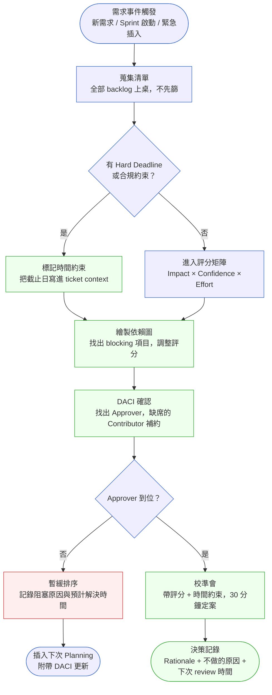
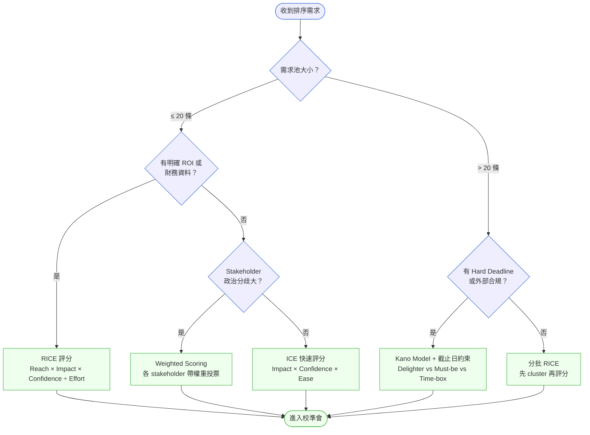

# 第 5 章 | Prioritization Frameworks：MoSCoW 之外的選擇

> **前置閱讀**：[Ch 4 Requirements Lifecycle：需求的生命週期](./ch-04-requirements-lifecycle.md)
> **下游章節**：[Ch 6 PM 的日常節奏：每日、每週、每月的工作週期](./ch-06-pm-daily-rhythm.md)
> **SA/SD 對照**：[SA/SD Ch 4 需求工程基礎](../../book/part-01-foundations/ch-04-requirements-engineering.md)
> ⸺ SA 視角關注需求的可實作性與完整性；本章關注需求的排序、政治性，以及「不做」的決策如何被記錄與承擔。

---

## §5.1 冷觀察

CareRoute 的 Sprint Review 開到第十二分鐘，PM 林佳蓉把投影片翻到第三頁，會議室的空氣就變了。

畫面上是一張 Jira roadmap，橫跨三個 sprint，顏色分得很整齊：Must Have 紅色、Should Have 橙色、Could Have 黃色。MoSCoW（Must / Should / Could / Won't）矩陣，三個月前她花了半天跟五個 stakeholder 對齊的結果。她當時以為那半天是把問題談清楚了。

醫院 IT 主任陳建宏盯著螢幕，沒看她。

> 「護理長那邊說，藥單列印的格式問題沒修。這個——應該是 Must Have 吧？」

林佳蓉的手指停在觸控板上。她查了一下：藥單列印格式，Sprint 3，Should Have。是她三個月前親手標的。

「沒排進來，評分的時候工程那邊說依賴排班模組先上——」

> 「那排班模組什麼時候上？」

沉默。排班模組在 Sprint 4，Could Have。

三個月前那場對齊會，護理部沒有代表到場。藥單格式問題是護理長後來在一封 email 裡提的，林佳蓉把它加進 backlog，標成 Should Have，因為當時沒有人告訴她「哪個科室每天要印幾百張藥單」。

IT 主任繼續：「CareRoute 下個月要交 JCI 認證的文件，這個格式不對的話，稽核員進來會直接扣分。」

林佳蓉翻回第一頁。JCI 認證這件事，在三個月前的對齊會裡從來沒有人提起過。

Sprint 3 完成率 89%，按任何計量標準都算成功的一個 sprint。但走出會議室的時候，林佳蓉手裡那份「成功」的報告一點重量都沒有——她知道下週的 sprint planning 要從頭重做一遍。不是因為工程出了問題，是因為這張 MoSCoW 矩陣從一開始就在認真地、整齊地、用三種顏色，回答一個沒有人正確描述過的問題。

---

## §5.2 真問題

把 CareRoute 的案例拆開來看，會發現林佳蓉面對的不是「MoSCoW 填錯了」的問題。

### 表面需求（What）

護理長要藥單格式正確。IT 主任要 JCI 認證通過。工程師要排班模組先上。每個人說的都是真的，每個需求單看都合理。

問題是 MoSCoW 假設 stakeholder 在填框格的時候已經知道所有背景脈絡。在醫療機構這種場景，「背景脈絡」往往存在於不在場的人身上——夜班護理長、法務合規專員、外部稽核員——而他們通常不會主動出現在 sprint planning。

### 業務目標（Why）

CareRoute 真正的目標是通過 JCI 認證，同時讓護理端滿意。這兩件事的優先順序，在三個月前的對齊會裡，沒有人說清楚。

JCI 認證有截止日期。護理端的滿意沒有。但截止日期沒有寫進任何一張 Jira ticket 的 context 欄位。這是 **Outputs/Outcomes/Impact** 三層斷裂的典型現象：

| 層次 | 在 CareRoute 的樣子 | 斷裂點 |
|---|---|---|
| **Outputs** | Sprint 完成 89%，功能按計劃交付 | 有量到 |
| **Outcomes** | 護理端實際操作流程改善了嗎？ | 從未定義量測方式 |
| **Impact** | JCI 認證通過？護理留任率？ | 沒有人把這條線拉回 ticket |

林佳蓉量的是 Outputs，但她的 stakeholder 在意的是 Impact。MoSCoW 在這個層次是個 Outputs 分類工具，它沒有辦法幫你問出 Outcomes 和 Impact 的問題。

> **關鍵取捨**：排序的本質不是「先做哪個功能」，而是「先移動哪個指標」。PM 不能只看 Outputs，因為 89% 的 sprint 完成率對 stakeholder 毫無意義——他要的是 12 月認證通過。一旦排序停在 Outputs 層，PM 就是在用「交付了多少」回答一個「改變了什麼」的問題；表格再整齊，量的也是錯的東西。所有排序框架（RICE、ICE、Kano⋯⋯）都只在「你已經知道要量哪個 Outcome」的前提下才有效。

> **排序前自我檢查：你的 Hard Deadline 已經消失了嗎？**
>
> 在進入校準會之前，先對照以下信號——若有兩條以上成立，你的排序輸入已經有盲點，現在修正比 sprint review 上補救便宜得多：
>
> - Jira backlog 裡所有 ticket 的截止日欄位空白，或一律填成 sprint 結束日
> - 對齊會議程沒有「時間約束」或「合規截止日」這個項目
> - Stakeholder 談需求用「這個比較重要」，而不是「這個有 deadline」
> - 沒有任何一張 ticket 的 context 欄位連結到認證、合規或客戶承諾里程碑
> - 團隊成員說不出「最晚哪一天必須開工」才能趕上外部截止日

### 決策瓶頸（Who × When）

「藥單格式」這個需求，誰說了算？

護理長說它重要。IT 主任說它重要。但他們是在 sprint 3 結束之後才說的。

真正的決策瓶頸是：**認證截止日倒推的 Hard Deadline，從來沒有被翻譯成優先順序的約束條件**。

在 DACI（Driver / Approver / Contributor / Informed）的框架下，這個決策的結構本來應該是：

| 角色 | 在 CareRoute 的理想情況 | 實際情況 |
|---|---|---|
| **D Driver** | PM 林佳蓉推動排序決策 | 有，但缺資訊 |
| **A Approver** | IT 主任拍板 Must Have 範圍 | 沒有明確拍板 |
| **C Contributor** | 護理長、合規部、工程 TL | 護理長缺席對齊會 |
| **I Informed** | 前線護士、供應商稽核窗口 | 從未被 loop in |

DACI 沒有跑起來，所以 MoSCoW 填的是「有參加會議的人的優先序」，不是「業務目標的優先序」。

換句話說，這不是框架選錯了——是在選框架之前，有三個問題沒有先回答：

1. 這件事的硬截止日是什麼時候？
2. 最終拍板的人是誰？
3. 有沒有「不在場的 stakeholder」需要先去約？

### 依賴關係如何扭曲排序

CareRoute 案例還有一個很容易被忽略的問題：藥單格式依賴排班模組，排班模組依賴 API 整合。這條依賴鏈在 MoSCoW 表上完全看不出來。

當評分框架假設所有需求都是獨立的，依賴關係就會在執行期爆炸。排班模組排在 Sprint 4 Could Have，意味著藥單格式即使排進 Sprint 3，也會因為前置項目不到位而卡住——評分結果和實際可交付順序不一致。

這是「依賴扭曲」反模式：高分項目因為 blocking 項目未完成而無法交付，最終耗費 sprint capacity 卻產出零成果。

---

## §5.3 決策框架

### 圖 A — 優先順序作業流程



流程有五個容易被跳過的節點。**蒐集清單**不能省：在校準會之前先篩會把隱性需求擋在門外（CareRoute 的藥單格式就是這樣消失的）。**繪製依賴圖**要在評分之後、校準會之前跑，否則高分項目可能因 blocking 項目未完成而白排。**DACI 確認**必須在評分之前跑，否則評分的基準會因人而異。**校準會**要帶數字進去，不能只帶故事。**決策記錄**要寫「不做的原因」，這是三個月後 sprint review 上回溯責任的唯一依據。

---

### 評分框架的前提：先確認「重要性的輸入」

§5.2 說的是一件事：**重要性不是人說了算，而是由業務目標、時間約束和依賴關係共同決定的。** MoSCoW 的失敗不在框架本身，在於它沒有要求你先回答這三個問題就開始填表。

RICE、ICE、Weighted Scoring——所有評分框架都有同一個前提條件：在你拿起評分表之前，以下三件事必須已經釐清：

| 前提 | 釐清方式 | 若跳過的後果 |
|---|---|---|
| **Hard Deadline 是否存在** | 把截止日寫進 ticket context，不靠記憶 | 緊急但不重要的事會被系統性高估，重要但不急的事持續被推後 |
| **Approver 是誰** | DACI 確認，Approver 必須在校準會出席 | 評分結果可能在拍板那刻被推翻，評分工作白費 |
| **依賴關係是否清楚** | 畫依賴圖，找出 blocking 項目 | 高分需求因前置項目未完成而無法交付，sprint 空轉 |

這三件事是評分的**輸入**，不是評分的**副產品**。CareRoute 的問題不是 MoSCoW 評分打錯，是評分前沒有人問「JCI 截止日是什麼時候」「護理長為什麼不在場」「藥單格式依賴什麼先完成」。換了 RICE 也一樣會錯——用數字精確地回答一個錯誤的問題，只是讓錯誤看起來更可信。

**評分框架解決的問題是：在前提已知的情況下，如何把多個需求放在同一把尺上比較。** 它不解決前提本身。

只有當這三個前提確認之後，才進入框架選擇。

---

### 圖 B — 框架選擇決策樹



決策樹的出口都是「進入校準會」，不是直接產出最終排序。沒有任何一個框架可以在填完表格之後自動決定優先序——校準會是不可省略的人工確認步驟。

---

### 框架情境選擇 2×2 矩陣

除了決策樹，以下矩陣幫助 PM 按照「團隊規模 × 需求波動性」快速選框架與 review 節奏：

| | **需求穩定**（季度變動少） | **需求波動**（每週都有新插入） |
|---|---|---|
| **小型團隊**（≤ 8 人） | RICE + 月度 review | ICE + 每週 backlog 整理 |
| **大型 / 跨職能團隊** | Weighted Scoring + PI Planning 節奏 | Kano + Daily Standup 優先序確認 |

> 選錯節奏比選錯框架更傷：用月度 review 管理高波動需求，結果是框架正確、反應速度錯誤，緊急插入沒有處理機制，最後靠口頭約定決定排序，決策記錄是空的。

---

### 框架比較決策表

| 情境 / 觸發條件 | 推薦框架 | PM 關注點 | 常見錯誤 |
|---|---|---|---|
| 需求池 < 20 條，有商業指標（DAU、轉換率） | **RICE**（Reach × Impact × Confidence ÷ Effort） | Confidence 評分要問「這個數字從哪來」 | Reach 用「感覺多少人用」而非真實資料 |
| 需求池 > 20 條，需要快速收斂 | **ICE 快速評分** | Impact 與 Ease 的量表要提前統一，不然比的不是同一件事 | 每人心裡 1–10 分的標準不同，表面對齊實際不同 |
| 多個 stakeholder 分歧，政治敏感 | **Weighted Scoring** | 各方的權重設定要公開，不要事後再改 | 把權重設計成讓自己的選項贏的樣子 |
| 有外部合規 / 截止日（如 JCI、GDPR、稽核） | **Kano + 時間約束** | 先問「截止日倒推，最晚哪天要開工」；Must-be 項目不評分，直接排 | 把合規需求放進 MoSCoW 的 Must Have，但沒有時間約束，等到快到期才發現工期不夠 |
| 季度 Roadmap 規劃，需要跨 sprint 排序 | **RICE + OKR 映射**（OKR：目標與關鍵結果，Objectives and Key Results） | 每條需求必須對應到至少一個 OKR Key Result（KR，關鍵結果）；對應不到的需求要問「為什麼做」 | 功能排進來是因為 VP 說重要，但沒有對應的 KR，等到 OKR review 才發現兜不起來 |

---

### If-Then 框架：RICE 評分

RICE 計算式：`Score = (Reach × Impact × Confidence) ÷ Effort`

在帶進校準會之前，以下條件判斷可以避免最常見的填表陷阱：

- **If** Reach 的資料來源是「工程師/PM 的直覺」 → **Then** 把 Confidence 降至 0.5（中性保守值），並在 ticket 上標記「需要驗證」
- **If** Impact 評分是 3 分（最高） → **Then** 要求填寫者說出「如果做了，哪個指標在幾週內會有多少變化」；說不出來，改回 2 分
- **If** Effort 評估是工程 TL 口頭給的 → **Then** 接受，但在 ticket 附上估算假設（依賴項 / 技術風險等級），校準會上讓工程確認一次
- **If** 同一個 sprint 內有兩條需求 RICE 分數相差 < 5% → **Then** 不比分數，改看「哪條有 Hard Deadline」；有截止日的優先，都沒有的看哪條解除更多下游 blocking

---

### 依賴關係評分調整

評分框架假設需求獨立，但現實裡依賴關係很常見。處理方式：

1. 在評分後、校準會前，畫出需求間的依賴圖（單向箭頭，A 需要 B 先完成）
2. 對 **blocking 項目**（被多條高分需求依賴的）套用評分乘數：`調整分數 = 原始分數 × (1 + 0.15 × 依賴它的高優先需求數量)`
3. 對 **被 blocking 項目**（自己依賴尚未完成的前置項目），在評分旁標記「阻塞中」，不排入當前 sprint，除非前置項目已確認在同 sprint 完成

**CareRoute 的正確操作**：排班模組應該因為「藥單格式依賴它」且「藥單格式對 JCI 認證有 Hard Deadline 約束」，在評分階段就獲得乘數調整，直接置頂。不是因為誰說它重要，而是因為依賴圖顯示它是關鍵路徑。

> 依賴圖不需要複雜工具。一張 A4 白板加上方框和箭頭，校準會前 15 分鐘畫出來，足以暴露所有隱性排序衝突。

---

### 校準會主持人操作指引

校準會不是需求審查會，它是「帶著數字，30 分鐘做一次最終確認」的決策節點。

**三個必要輸入：**
1. 評分後的需求清單（已跑完 RICE / ICE / Weighted Scoring，含依賴調整）
2. 更新後的 DACI（Approver 一定要到場）
3. 時間約束清單（截止日、依賴項、已知風險）

**會議節奏（30 分鐘）：**

| 時段 | 內容 | 主持人動作 |
|---|---|---|
| 0–5 min | 確認 Approver 在場；念出本次排序的業務目標 | 若 Approver 缺席，宣布暫緩，記錄原因 |
| 5–15 min | 逐條確認前 5 高分需求，詢問「有沒有新資訊改變評分」 | 不接受「感覺」，要求說出新的數字或截止日 |
| 15–25 min | 確認排掉的前 3 條需求，詢問 Approver「是否同意排掉理由」 | 若不同意，記錄分歧點，Approver 給出具體替代理由，PM 更新評分 |
| 25–30 min | Approver 口頭確認最終排序；PM 宣告下次 review 時間 | 拍板必須在 30 分鐘內完成；若超時，自動 defer 爭議項目到下次 |

**分歧處理規則（Approver 與評分結果不一致時）：**
- 若 Approver 提出的異議有新的量化資訊（截止日、新的用戶數據），更新評分，重新排序
- 若 Approver 的異議只是「感覺不對」，主持人問：「什麼資訊會讓你改變想法？」並記錄該條件——這是下次 review 的觀察指標
- 若分歧無法在 5 分鐘內解決，爭議項目自動 defer，不阻塞其他項目定案

**遠端 / 非同步執行的調整：**
- 提前 24 小時寄出評分清單，要求 Approver 在會前標記異議
- 會議只用 10 分鐘 Q&A + 20 分鐘決策；Approver 不能即時參與者可在 48 小時內用 Confluence comment 非同步拍板
- 超過 48 小時無回應，Driver（PM）依評分結果暫定排序，並在決策記錄標注「Approver 未回應，PM 代決，待確認」

---

**校準會的輸出只有兩種：**
- **確認排序** → 寫進決策記錄，附 Rationale
- **暫緩排序** → 寫明阻塞原因 + 下次 review 時間（不能是「待確認」）

決策記錄不是議事錄。它要回答三個問題：

1. 這次排進來的是什麼，理由是什麼？
2. 這次排掉的是什麼，理由是什麼？
3. 這個決定三個月後若被質疑，誰來負責解釋？

---

### Backlog 定期 Review 節奏

排序不是一次性決定。需求的重要性會隨時間改變，blocking 項目會完成，截止日會出現。沒有 review 機制，初始排序會在兩週後失效，但沒有人知道。

**每週 Backlog 整理 Checklist（10–15 分鐘，PM 獨立完成）：**

- [ ] 有沒有新的 Hard Deadline 浮出水面（客戶承諾、合規通知、外部事件）？
- [ ] 上週有沒有 blocking 項目完成，解除了哪些 deferred 需求的排序阻塞？
- [ ] 有沒有新增的緊急插入需求？（若有，走 §5.4 的中途插入流程，不直接修改排序）
- [ ] Approver 有沒有異動（職位變更、專案重組）？DACI 需要更新嗎？
- [ ] deferred 需求裡有沒有因為市場或業務變化而應該重新評估的？

**每雙週校準會前，額外確認：**
- 上次決策記錄的「下次 review 時機」有沒有到期或觸發？
- 排入 sprint 的需求，有沒有評分假設已經失效（Confidence 來源的資料更新了）？

> 這份 checklist 放在 Confluence sprint page 的固定區塊。每週更新，不需要開會。有觸發項目才召集相關人。

---

### 怎麼知道排序在發揮作用

排序框架做了，但好不好用？以下三個指標告訴你：

| 指標 | 定義 | 健康範圍 |
|---|---|---|
| **高優先項目命中率** | 排進 sprint 的前三高分需求，季度末時有多少比例達到預期 Outcome | > 70%（若低於此，評分假設可能系統性失準） |
| **決策到交付的 Lead Time** | 從校準會拍板到功能上線的中位時間（天） | 與 sprint 週期對齊；超過 2× sprint 長度代表執行有阻塞 |
| **Stakeholder 透明度滿意度** | 季度 stakeholder 回顧中，對「為什麼這個功能沒做」的解釋滿意度（1–5 分） | ≥ 3.5（量測工具：季度 retro 的簡短問卷） |

這三個指標不需要額外工具。前兩個在 Jira 可以查，第三個在季度 retro 時問一次。

---

## §5.4 踩坑清單

**反模式：MoSCoW 作為溝通工具，而非決策工具**

現象：開了半天的 MoSCoW 對齊會，Everyone nods，表格填好，三個月後 sprint review 上被質疑「這個怎麼是 Should Have」。

根因：MoSCoW 的四個分類沒有量化基準。「Must Have」對工程師可能是「不做系統會壞」，對 PM 可能是「業務最重要」，對 VP 可能是「我說要做的」。同一個框格，三種語意，對齊會根本沒有對齊。

> 修正方向：把 MoSCoW 的每個分類加上可驗證的定義。例如：Must Have = 「這個 sprint 不做，認證 / 合規 / 上線計劃直接失敗」；Should Have = 「不做 NPS 會掉，但不影響上線」。讓填表者用這個定義重新對一次。

---

**反模式：評分後直接排序，跳過校準會**

現象：RICE 分數跑出來，PM 直接更新 Jira 優先序，發給工程師開始 sprint。三週後才發現兩條需求的依賴關係沒有被處理，高分項目反而卡住低分項目。

根因：評分是個人 / 小組行為，校準是跨角色確認。RICE 分數計算正確，不代表依賴關係、技術風險、人力時序都對齊了。

> 修正方向：評分結果永遠帶進校準會，即使「大家應該都同意」。校準會可以只有 30 分鐘，但不能省。依賴圖在校準會開始前畫好，讓工程 TL 確認。

---

**反模式：把 Impact 和 Urgency 混在一起**

現象：「這個需求很緊急，所以 RICE Impact 打最高分。」緊急的事被系統性地高估，重要但不緊急的策略型需求連續被推後。

根因：Impact 是「做了之後對業務目標的貢獻」；Urgency 是「有沒有截止日壓力」。混在一起，緊急但低 Impact 的需求會排掉高 Impact 但不急的需求，roadmap 逐漸變成救火清單。

> 修正方向：在評分矩陣裡把 Urgency 獨立出來，作為「截止日約束」欄位（而非 Impact 的一部分）。截止日有 Hard Deadline 的，直接置頂，不參與 RICE 排名競爭。

---

**反模式：Sprint 中途插入需求，不留記錄**

現象：Sprint 進行到第二週，客戶 A 緊急要求功能 X。PM 直接在 Jira 把 X 加進 sprint，跟工程 TL 口頭確認，其他人不知道有什麼被推後了。Sprint review 上發現原本排好的需求 Y 沒完成，沒有人知道原因。

根因：中途插入沒有正式流程，被推後的項目沒有記錄。三週後沒有人記得「Y 是因為 X 插入而 defer 的」，只記得「Y 又沒完成」。

> 修正方向：任何 sprint 中途插入都要走一個 5 分鐘的迷你 DACI check：
> 1. Approver 確認插入（不能是 PM 自己拍板）
> 2. 明確說出「X 替換掉的是什麼」
> 3. 在決策記錄追加一行：「插入原因、替換項目、通知對象」
> 沒有完成這三步，不算正式插入，工程師不動 sprint 排序。

---

**反模式：決策記錄只寫「做了什麼」，不寫「為什麼不做另一個」**

現象：季度 review，VP 翻出三個月前的 backlog，問「這個功能當時為什麼沒排進來」。PM 翻 Jira comment，找不到任何紀錄。

根因：決策紀錄通常只記 acceptance，不記 rejection。三個月後的人看不到當時的考量，只能重新爭論。

> 修正方向：每次校準會產出一份決策記錄，明確列出「這次排掉的前三條需求及原因」。格式不用複雜，一行一條就夠。

---

**反模式：Stakeholder 排序，而非業務排序**

現象：需求的優先序跟著 stakeholder 的職級走。VP 說要做，Must Have；工程師說不急，推後。結果 roadmap 是組織權力圖，不是業務目標地圖。

根因：在沒有評分基準的情況下，「誰說了算」的預設答案是「職級最高的人」。這讓 PM 失去了排序的話語權，也讓業務目標失去了被翻譯的機會。

> 修正方向：在 DACI 確認時，明確區分 Approver（拍板）和 Contributor（影響但不拍板）。Contributor 的輸入進入評分，但不直接決定排序。最終排序的 Rationale 要對應到 OKR 或業務指標，不是對應到「誰支持這個功能」。

---

## §5.5 交付清單 ⸺ 一頁式需求排序決策記錄

本章交付物包括以下四件，按使用順序排列：

1. **需求排序決策記錄模板**（§5.5 主交付物）⸺ 一頁式空白模板，每個 sprint / planning cycle 填一份，記錄「排進來的」與「排掉的」。
2. **框架選擇決策表 + 2×2 情境矩陣**（§5.3）⸺ 依需求池大小、是否有 ROI 資料、是否有 Hard Deadline，對應到 RICE / ICE / Weighted Scoring / Kano 的查表卡；含團隊規模 × 波動性的節奏選擇。
3. **RICE 評分 If-Then 卡 + 依賴調整規則**（§5.3）⸺ 填表時防呆的條件判斷，與 blocking 項目的評分乘數方法。
4. **校準會主持人操作指引 + Backlog 定期 Review Checklist**（§5.3）⸺ 30 分鐘校準會的節奏、分歧處理規則、遠端執行調整；含每週 10 分鐘 backlog 整理 checklist。

主交付物的空白模板與填好範例如下。

### §5.5 模板 ⸺ 一頁式「需求排序決策記錄」

下面是一份可以在校準會後 10 分鐘填完的決策記錄模板。每個 sprint / planning cycle 一份，存進 Confluence / Notion 並連結到對應的 Jira sprint。

````markdown
### 排序決策記錄 — {產品名稱} Sprint {N} / {日期}

> 版本:v0.1 | 撰寫日期:YYYY-MM-DD | 擁有人:{名字}

### 本次決策背景
- 範圍：{本次排序的需求池大小，共 N 條}
- 使用框架：{RICE / ICE / Weighted Scoring / Kano + 時間約束}
- DACI：Driver: {PM 名字} | Approver: {姓名職稱} | Contributors: {名單} | Informed: {名單}
- 校準會時間：{日期} {時長}
- 本次依賴圖是否更新：{是 / 否，若是，附連結}

### 排入本次 Sprint 的需求（按優先序）
| 需求名稱 | 評分 / 依據 | 對應 OKR/KR | 排入理由 |
|---|---|---|---|
| {需求 1} | RICE: {分數} | {KR 編號} | {一句話} |
| {需求 2} | RICE: {分數} | {KR 編號} | {一句話} |

### 排掉的前三條需求（及原因）
| 需求名稱 | 評分 / 依據 | 排掉原因 | 下次 review 時機 |
|---|---|---|---|
| {需求 A} | RICE: {分數} | {一句話} | {日期 / 觸發條件} |
| {需求 B} | RICE: {分數} | {一句話} | {日期 / 觸發條件} |
| {需求 C} | RICE: {分數} | {一句話} | {日期 / 觸發條件} |

### 時間約束
- Hard Deadline 項目：{有的話列出，附截止日}
- 合規 / 外部依賴：{有的話列出}

### Sprint 中途插入紀錄（若有）
| 插入需求 | 替換項目 | Approver 確認 | 通知對象 |
|---|---|---|---|
| {若無，保留此表但填「無」} | | | |

### 排序成效回顧（下次 Review 時填）
- 高優先項目命中率：{N/3 或 N/5 達到預期 Outcome}
- Lead Time：{從拍板到上線，中位天數}
- 透明度滿意度：{季度 retro 分數，1–5}

### 下次排序 Review 時間
{日期，不能是「待定」}
````

這份模板故意很短。三個月後被質疑決策的時候，Approver 的名字和「排掉原因」這兩欄是回溯責任的核心，其他欄位是為了讓那兩欄有上下文。「Sprint 中途插入紀錄」和「排序成效回顧」是本次加入的兩個新欄位：前者是中途插入反模式的直接防護，後者是讓排序過程自我校正的唯一機制。

### §5.5.1 範例：CareRoute 醫療系統 Sprint 3 後補決策記錄

Sprint 3 結束那天的 review，林佳蓉在會議室裡補了一份當初沒做的記錄——用它來回溯，而不是用來辯解。這是那份記錄長什麼樣子：

````markdown
### 排序決策記錄 — CareRoute Sprint 3 補錄 / 2025-11-14

> 版本:v0.1 | 撰寫日期:2026-02-15 | 擁有人:林佳蓉(PM)

### 本次決策背景
<!-- 為什麼這欄：讓三個月後的人知道當時的資訊不對稱在哪裡，
     否則「為什麼沒排進來」只能靠記憶回答。 -->
- 範圍：當時需求池 34 條（補錄：實際應為 36 條，護理端 2 條未被帶入）
- 使用框架：MoSCoW（補錄：未加量化定義，各 stakeholder 解讀不同）
- DACI：Driver: 林佳蓉(PM) | Approver: 陳建宏(IT主任) ← 補錄時才確認
         Contributors: 工程TL 張俊豪、UI 設計師王雅文
         Informed: 護理部主任（補錄：原對齊會未通知）
- 校準會時間：2025-08-20（補錄：護理部未出席）
- 本次依賴圖是否更新：否（補錄：當時未繪製，藥單格式對排班模組的依賴隱性存在）

### 排入 Sprint 3 的需求（按優先序）
| 需求名稱 | 評分 / 依據 | 對應 OKR/KR | 排入理由 |
|---|---|---|---|
| 排班模組 API 整合 | MoSCoW: Must Have | OKR1-KR2 系統整合完成度 | 工程依賴項，後續功能 blocking |
| 病歷搜尋效能優化 | MoSCoW: Must Have | OKR1-KR3 P95 查詢 < 2s | 已達成 SLA 門檻要求 |
| 出院通知推播 | MoSCoW: Should Have | OKR2-KR1 護理滿意度 | PM 判斷中優先，護理端有需求 |

### 排掉的前三條需求（及原因）
<!-- 為什麼這欄：不做的決定跟做的決定一樣需要被記錄，
     三個月後被問起來的通常是這裡而不是上面那張表。 -->
| 需求名稱 | 評分 / 依據 | 排掉原因 | 下次 review 時機 |
|---|---|---|---|
| 藥單列印格式修正 | MoSCoW: Should Have | 排班模組未上、依賴項阻塞 | Sprint 4 啟動時（補錄：應為 Sprint 3 Must Have，因 JCI 認證截止日；若有依賴圖，排班模組評分應獲乘數調整，此項目可跟進排入） |
| 護理站藥品核對介面 | MoSCoW: Could Have | 工程估算超出 sprint capacity | 下季度規劃重新評估 |
| 批次匯入病歷掃描檔 | MoSCoW: Could Have | 無工程 TL 確認的工時估算 | 待 SA 完成規格後再排 |

### 時間約束
<!-- 為什麼這欄：截止日約束是唯一能讓 MoSCoW 的 Must Have 有客觀依據的東西，
     不寫進來，Must Have 就只是「感覺重要」。 -->
- Hard Deadline 項目：JCI 認證文件提交 2025-12-01（補錄：對齊會當時無人揭露）
- 合規 / 外部依賴：藥單格式必須符合 JCI Medication Management 標準 3.2.1

### Sprint 中途插入紀錄
| 插入需求 | 替換項目 | Approver 確認 | 通知對象 |
|---|---|---|---|
| 無 | — | — | — |

### 排序成效回顧（Sprint 3 結束時補填）
- 高優先項目命中率：2/3（排班模組和病歷搜尋完成；出院推播未完成）
- Lead Time：平均 19 天（拍板到上線）
- 透明度滿意度：未量測（補錄：應在 Sprint review 前問 Approver）

### 下次排序 Review 時間
2025-11-21（Sprint 4 Planning，藥單格式需重新評估為 Must Have）
````

這份補錄的意義不是懲罰誰，而是建立一個機制：下次季度規劃，「JCI 截止日」這個約束條件會在清單蒐集階段就被問出來，「排班模組是否阻塞下游高優先需求」會在依賴圖繪製時被看見，而不是在 sprint review 現場才浮出水面。

---

## §5.6 Recap

讀完本章，你應該已經能做到：

- [ ] 在選擇排序框架之前，先確認三件事：Hard Deadline、Approver 是誰、有沒有缺席的 Contributor
- [ ] 用 RICE 或 ICE 評分，並區分 Impact（業務貢獻）與 Urgency（時間壓力），不讓緊急事項系統性壓過重要事項
- [ ] 評分後繪製依賴圖，對 blocking 項目套用評分乘數，讓評分結果反映實際可交付順序
- [ ] 用「團隊規模 × 需求波動性」矩陣選擇框架與 review 節奏，而非用同一套節奏管理所有場景
- [ ] 在每次 sprint planning 前跑一次 30 分鐘的校準會，帶著數字與更新的 DACI 進場；分歧時問「什麼資訊會讓你改變想法」
- [ ] 任何 sprint 中途插入都走 5 分鐘 DACI check + 決策記錄追加，不做口頭約定
- [ ] 寫出一份包含「排掉的需求及原因」與「中途插入紀錄」的決策記錄，讓三個月後的質疑有地方回溯
- [ ] 每季度用三個指標回顧排序是否發揮作用：高優先項目命中率、Lead Time、Stakeholder 透明度滿意度

如果先挑一項做，建議是寫出第一份決策記錄的「排掉原因」那一欄 ⸺ 這一欄是最常被省略的，也是日後最多衝突的起點。一旦有了這個習慣，其他框架的細節就有地方落地。

下一次季度規劃，你不會再被一張整齊的 MoSCoW 矩陣騙過去：在挑框架之前，你會先把那三個問題問出口——硬截止日、拍板的人、缺席的 Contributor——然後畫出依賴圖，再才開始排序。這一步現在就可以做，不必等到下一場 sprint review 才在現場補課。

---

## Cross-References

- **前一章**：[Ch 4 Requirements Lifecycle：需求的生命週期](./ch-04-requirements-lifecycle.md) ⸺ 需求如何產生、如何進入 backlog，是排序的上游
- **下一章**：[Ch 6 PM 的日常節奏：每日、每週、每月的工作週期](./ch-06-pm-daily-rhythm.md) ⸺ 校準會如何嵌入日常工作節奏；每週 backlog checklist 的執行時機
- **強連結**：[Ch 14 Product Roadmap：承諾的邊界](../part-03-planning/ch-14-product-roadmap.md) ⸺ 排序的輸出最終要上 roadmap，roadmap 的邊界影響哪些需求值得被評分
- **強連結**：[Ch 33 Saying No：拒絕的技術](../part-05-decisions/ch-33-saying-no.md) ⸺ 決策記錄的「排掉原因」是 Saying No 的書面版本
- **SA/SD 對照**：[SA/SD Ch 4 需求工程基礎](../../book/part-01-foundations/ch-04-requirements-engineering.md) ⸺ SA 用需求工程確保需求的完整性與可實作性；本章關注排序的政治性與決策責任
