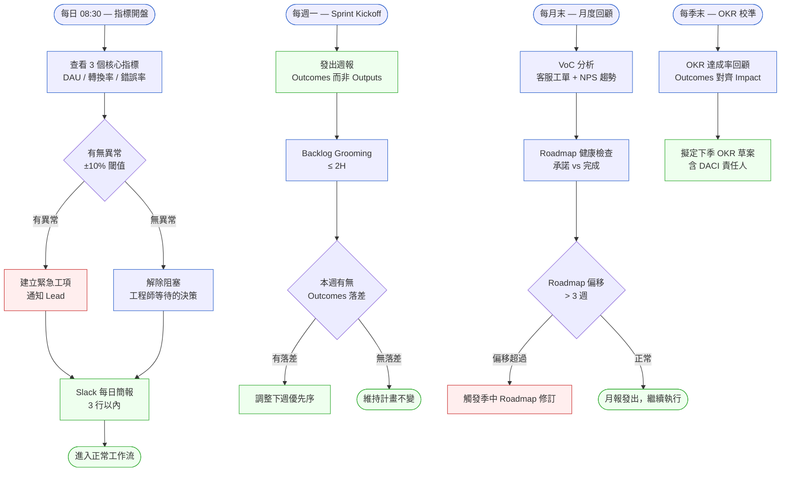
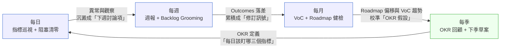
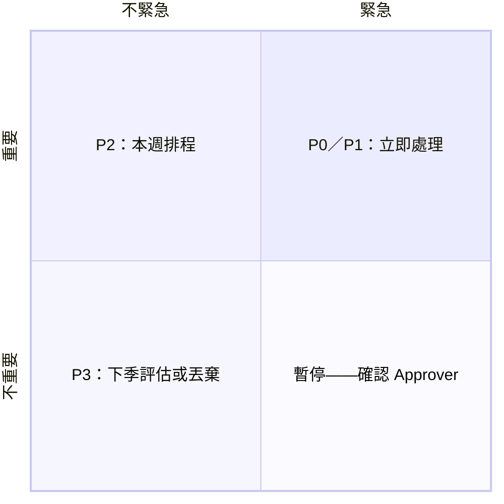
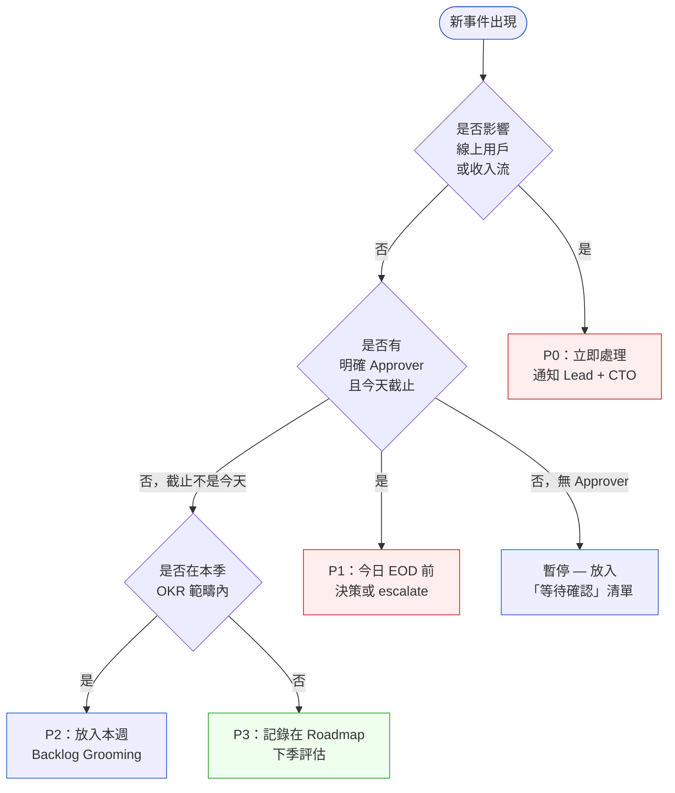

# 第 6 章 | PM 的日常節奏：每日、每週、每月的工作週期

> **前置閱讀**：[Ch 3 Product Vision & OKR](./ch-03-product-vision-okr.md)、[Ch 5 Prioritization Frameworks](./ch-05-prioritization.md)
> **下游章節**：[Ch 9 VoC Loop](../part-02-discovery/ch-09-voc-feedback-loop.md)、[Ch 20 Sprint Ceremonies for PM](../part-03-planning/ch-20-sprint-ceremonies.md)
> **SA/SD 對照**：[SA/SD Ch 2 SDLC 與方法論演進](../../book/part-01-foundations/ch-02-sdlc-evolution.md)
> ⸺ SA 視角關注 SDLC 的流程選擇與 Tempo 對齊；本章關注 PM 在這個節奏中如何判斷每天要做什麼、哪些事可以等到週五、哪些事到月底才到期。

---

## §6.1 冷觀察

季度規劃第三天，UrbanCart 的 PM Iris 把那份 roadmap 印出來放在桌上。

十八頁。Q3 有十四個功能要做。她知道其中三個互相依賴，知道有兩個要等 Legal 核准，知道工程側的 capacity 會在八月中因為有人去度假而少掉兩個人。她都知道。

但那天 CTO 問她：「上週的下單流失率為什麼在 iOS 17.6 升級後跳了 2.3 個百分點？」

她不知道。

不是沒有數據。那份 Amplitude 看板就開著，她每天都打開，但每天打開只是確認昨天沒有異常，不是找問題。那個 2.3% 的跳升，從第一天就在那裡——已經在那裡五天了。她不知道，是因為她沒有一個機制逼自己每天有意義地看那些數字。

兩天後，Sprint 被緊急插入一個「iOS 相容性修復」工項。原本 Q3 的第一個優先項——購物車推薦演算法改版——被往後推了三週。那三週的損失按照 Iris 自己的試算，大約是 NT$140 萬的預期轉換收益。

這不是工程品質問題。也不是 iOS 的問題。

這是 PM 節奏問題：沒有每日巡視的機制，緊急事件就會變成奇襲。被奇襲的代價不是當天的工時，是對 roadmap 的傷害。

UrbanCart（CASE-ECM-103）是一家虛構的台灣電商平台，SKU 數 12 萬，日均訂單約 8,500 筆，三名 PM 負責不同品類。Iris 管的是消費性電子。這個案例會貫穿整章。

---

## §6.2 真問題

把 Iris 的問題拆開來看，它有三層。

### 表面需求（What）

Iris 需要一個「更有效的工作方式」。這是她自己說的，問題診斷到這裡就停了。

大部分時間管理工具賣的都是這個層次的答案：Todo List、Time blocking、GTD 系統。這些工具不是沒用，但它們解決的是「我要做什麼事」的問題，不是「我要在什麼時間做什麼」的問題。

### 業務目標（Why）

真正在處理的問題是：**PM 的注意力沒有跟著業務時間軸走**。

指標有週期性。DAU 巡視是每日的事；Backlog 整理是每週的事；VoC（Voice of Customer）分析是每月的事；OKR 校準是每季的事。這四個週期的輸入、產出、決策責任人都不一樣——但大部分 PM 把它們混在同一個看板裡，結果是每件事都做得半吊子。

更關鍵的混淆在 Outputs（產出）/ Outcomes（行為改變）/ Impact（業務影響）三層：

| 層次 | 問題 | UrbanCart 的現況 |
|---|---|---|
| **Outputs** | 我們做了什麼？ | 每週有新功能，release note 很厚 |
| **Outcomes** | 使用者行為改變了嗎？ | iOS 流失率跳 2.3%，五天無人察覺 |
| **Impact** | 業務指標移動了嗎？ | Q3 GMV 目標能否達到？沒有人能即時回答 |

Iris 每天看的是 Output（功能有沒有上線、sprint 有沒有完成），但 CTO 問的是 Impact（GMV、轉換率）。這中間差了 Outcomes 的層，而 Outcomes 是需要每日監控才能早期發現的。

### 決策瓶頸（Who × When）

節奏問題的根本是**決策責任沒有時間定錨**。

Iris 知道她負責推動決策（Driver），但她不清楚每一類決策的 Approver 是誰、截止時間是什麼。結果是：緊急事件出現時，她被迫當 Approver，但她沒有足夠的資訊做出好的決策——因為每日監控的空缺，讓她在「需要判斷的那一刻」反而是資訊最不足的人。

標準 DACI 給了你一張角色地圖：誰推動、誰核准、誰貢獻、誰知會。這張地圖解決了「誰該做」的問題，但沒有回答「誰該在什麼時間點之前做完」。沒有截止節點，每個角色的義務就是開放式的——Driver 知道自己要推動，Approver 知道自己要核准，但在第一天、第二天、第四天，誰都不算逾期。

Iris 的案例把這個漏洞放大了：iOS 異常在第一天就可見，但沒有任何一條 DACI 條目說「PM 身為每日指標異常的 Approver，必須在當天 EOD 前做出決策」。每一天的不作為，在當天都是個別合理的——畢竟沒有截止線被穿越。緊急程度的感知，只有在第五天 CTO 從外部喊出來之後才突然成立。這就是缺乏「截止節點」欄位的本質後果：緊急程度不由事件本身的嚴重性決定，而由誰喊得最大聲決定。下表的「截止節點」欄不是裝飾性的補充，它是讓角色義務從「理論上存在」變成「實際上可追蹤」的關鍵介入。

這是 DACI 框架（Driver 推動者／Approver 核准者／Contributor 貢獻者／Informed 知會者，一種決策角色分工模型）沒有時間軸版本的後果：

| 決策類型 | Driver | Approver | 截止節點 |
|---|---|---|---|
| 每日指標異常處理 | PM | PM（需時效） | 當天 EOD |
| Sprint 優先序調整 | PM | Engineering Lead | Sprint Planning |
| Roadmap 季度修訂 | PM | CPO / CTO | 季度規劃會前 48H |
| 預算影響 > NT$500K 的決策 | PM | CEO / CFO | 下次週會前 |

缺乏時間定錨，每一件事的緊急程度都靠「誰喊得最大聲」來決定。

---

## §6.3 決策框架

PM 的工作節奏不是「更認真工作」，是**讓不同頻率的事在對的時間框裡被處理**。以下框架分四個時間層：每日、每週、每月、每季。

### 圖 A — PM 日常節奏工作流程圖



每個時間層的觸發點、核心動作、輸出物（brief / 週報 / 月報 / OKR 草案）都有明確的接棒人。工作流的設計原則：**PM 的工作是「在對的時間把對的資訊交到對的人手上」，不是「比別人更努力盯著 dashboard」**。

---

### 圖 B — 四個時間層的回授關係

上面四條工作流不是平行獨立的——它們彼此餵養。每日的觀察沉澱成每週的決策，每週的落差累積成每月的修訂訊號，每月的趨勢校準每季的 OKR；而每季的 OKR 又反過來定義了每日該盯哪三個指標。這是一個閉環，不是四條平行線：



這個閉環解釋了 §6.1 裡 Iris 的真正失敗：她有每日的「動作」（打開 dashboard），但那個動作沒有出口——它不流向每週的決策。一個沒有下游的每日巡視，本質上等於沒有巡視。判斷自己的節奏是否成立，最快的檢驗就是問：**我每日看到的東西，會在哪一個會議裡變成決策？** 答不出來，那一層就是空轉。

---

### 圖 C — 緊急 × 重要 象限

Eisenhower 矩陣把所有事件先分成四格，讓 PM 在看決策流程之前先確認自己站在哪個象限：



> 第四象限（緊急但不重要）最容易被 PM 默默接走——它看起來很急，但背後往往缺少 Approver。放入「等待確認」清單，不要自己決定。

---

### 圖 D — 決策優先序狀態圖

當多件事同時出現，PM 需要一個「先處理哪個」的判斷邏輯：



這個決策樹處理的是「緊急 vs 重要」的分類問題，但它加了一個關鍵分支：**沒有明確 Approver 的事情不要自己決定，放入「等待確認」清單，追到有人認領為止**。

PM 最常見的過載不是「事情太多」，而是「太多事情沒有 Approver，PM 默默接了」。

---

### 決策表：四個時間層的工作地圖

| 時間層 | 觸發條件 | 推薦做法 | PM 核心關注點 | 常見錯誤 |
|---|---|---|---|---|
| **每日** | 08:30 開盤 | 3 指標巡視 + 阻塞清單 | 指標有無異常（±10%） | 只看有沒有「完成工項」，忽略 Outcomes 指標 |
| **每日** | 有人在 Slack 問「這個怎麼辦」 | 判斷是 PM 決策還是轉派 | DACI 中 PM 是 D 還是 C | 預設「問我的我就回答」，成為所有決策的 Approver |
| **每週** | Sprint Planning 前 | Backlog Grooming ≤ 2H | 每個工項有無清楚的 Acceptance Criteria（驗收準則） | Grooming 開成需求說明會，超過 2H |
| **每週** | Sprint 結束 | 週報發 Outcomes，不發 Outputs | 本週指標有無移動 | 週報列完成功能清單，沒有指標數字 |
| **每月** | 月末 | VoC 分析 + Roadmap 健康檢查 | NPS 趨勢、客服工單分類 | VoC 收集後沒有 action item，淪為裝飾性報告 |
| **每月** | Roadmap 偏移 > 3 週 | 觸發季中修訂，不是默默追趕 | 偏移原因是技術債還是需求變動 | 沉默吸收偏移，到季末才說「追不上了」 |
| **每季** | OKR 週期結束 | 達成率回顧 + 下季草案 | Outcomes 是否對應到 Impact | OKR 寫的是 Output（「推出 X 功能」），不是 Outcome |

---

### If-Then 框架：每日指標異常的即時判斷

在 UrbanCart 案例中，Iris 面對的是「指標異常但不知道嚴不嚴重」的情境。以下是一個可以直接套用的判斷框：

- **If** 轉換率下滑 > 5%，持續 > 2 天 → **Then** 建立 P0 工項，通知 Engineering Lead + CTO，今日 EOD 前確認根因假說（不是確認根因）
- **If** 轉換率下滑 2–5%，來源單一（如特定 OS / 裝置）→ **Then** 建立 P1 工項，放入本週 Sprint，明日 Standup 前確認工程師是否接手
- **If** 轉換率下滑 < 2%，趨勢持平（非加速）→ **Then** 記錄在每週週報的「觀察」欄，下次 Backlog Grooming 討論是否需要調查
- **If** DAU 上升但轉換率同步下滑 → **Then** 這是質量問題（流量來源改變），觸發 UTM 追蹤分析，不是功能 bug 流程

「根因假說」和「確認根因」是不同的截止點。在 P0 狀況下，要求當天有假說（PM 可以做到），不要求有確定答案（工程師需要時間）。把這兩個截止點搞混，會讓 PM 在 EOD 前發出「我們不知道原因」的訊息，讓 CTO 覺得沒有人在處理。

---

### PM 為什麼要看這些指標？

一個常見的誤解是：指標掉了是 RD 的問題，PM 只負責排優先序。

這個邊界在「bug 還沒發生」時成立，在「指標已經異常」之後就不成立了。轉換率掉 2.3% 有三種可能的根因：

1. **技術問題**——RD 上版後某個路徑壞了（這才是 RD 的事）
2. **產品決策問題**——某個流程被改動了，使用者卡住（這是 PM 的事）
3. **外部環境問題**——競品促銷、季節性波動、流量來源變化（這是 PM 需要判讀的事）

三種根因需要三種不同的應對方式，但只有 PM 同時掌握「產品改了什麼」和「外部發生了什麼」這兩層上下文。RD 能告訴你程式有沒有問題，但他不知道上週競品是否剛發佈了促銷活動，也不知道這個月的流量來源是否已從 SEO 轉向付費廣告。

**PM 看指標，不是為了搶 RD 的工作，而是為了在三種根因裡做第一道分類。** 分錯類，工程團隊就會花一週找一個根本不存在的 bug。

---

### 如何判斷「掉多少才值得關注」？

掉 0.5% 和掉 2.3% 都是「掉了」，但不能用同一套應對方式處理。問題是：如何區分訊號和雜訊？有三個工具可以疊加使用：

**1. 設定基準線與閾值（而不是看絕對數字）**

不要問「轉換率是 3.1%，高不高？」而是問「轉換率相對於我設定的基準線，偏移了多少？」

| 指標 | 基準線（近 30 天均值） | 黃燈閾值 | 紅燈閾值 |
|---|---|---|---|
| 轉換率 | 3.2% | ±0.3pp（約 ±10%） | ±0.6pp（約 ±20%） |
| DAU | 12,000 | ±1,200（±10%） | ±2,400（±20%） |
| 結帳完成率 | 78% | ±5pp | ±10pp |

閾值不是永久固定的。每季 OKR 校準時，同步更新基準線。

**2. 排除已知的季節性與外部因素（對照組思維）**

看到異常之前，先問三個問題：

- **同期對比**：去年同一週，這個指標在哪裡？（排除季節性）
- **同業對比**：競品的公開數據或行業報告，這段時間有沒有整體下滑？（排除景氣）
- **流量來源對比**：DAU 構成有沒有改變？（SEO 流量通常轉換率低於直接流量）

如果三個問題都指向「外部因素」，這件事不進 Sprint，進 §6.5 的觀察紀錄欄，下個月再看趨勢。如果只有一個問題能解釋，就繼續往下查。

**3. 看持續時間，不看單點**

單日波動幾乎都是雜訊。判斷的基準是：

- **1 天**：記錄，不行動
- **2 天連續**：建假說，通知相關人
- **3 天連續**：無論幅度大小，排入本週 Backlog

Iris 的 2.3% 掉了五天無人察覺，問題不是「2.3% 夠不夠大」——問題是**第二天就該有人知道**，而不是等到第五天。

---

## §6.4 踩坑清單

以下五個反模式在 PM 日常節奏中出現頻率最高。它們的共同特徵是：**單獨看每一個都不大，累積兩個月後 roadmap 就爛了**。

---

**反模式：Dashboard 巡視變成「確認沒有爆炸」**

現象：每天打開 Amplitude，看兩秒，沒有紅字就關掉，心裡覺得做了每日巡視。
根因：巡視缺乏「基準線 + 閾值」定義。當你不知道「正常」長什麼樣，你就只能辨認「爆炸」，辨認不了「緩慢惡化」。

> 修正方向：為每個核心指標設定週期性基準線（如「本月目標：iOS 轉換率 ≥ 3.2%，±10% 觸發追查」）。基準線放在看板旁邊，不是放在腦子裡。

---

**反模式：週報變成功能發布清單**

現象：週報列了「本週完成：購物車 A/B test 上線、推薦 API 修復、iOS 相容性 patch」，沒有一個 Outcome 數字。
根因：把 Outputs 當 Outcomes 報告，是因為 Outputs 容易量化（做了或沒做），Outcomes 需要等待觀察期（上線後 3-7 天才能看到數字）。

> 修正方向：週報格式切換為「上線了什麼（Output）→ 預期改變什麼（Outcome 假說）→ 下週回報數字」的三行結構。就算 Outcome 還沒出來，寫出假說就已經建立了追蹤責任。

---

**反模式：Backlog Grooming 開成需求說明會**

現象：Grooming 預定 1 小時，最後開了 2.5 小時，討論了第一個 story 就沒時間了，後面七個 story 原封不動進 Sprint Planning。
根因：PM 在 Grooming 前沒有預先完成 story 的初稿，把「Writing」和「Grooming」的工作混在一個會議做。

> 修正方向：Grooming 前 PM 必須完成「一句話 user story + Draft Acceptance Criteria + 估算依據」，進會議只做澄清，不做創作。超過 2H 立刻切場，未討論的 story 移至下次。

---

**反模式：VoC 是月底的儀式，不是資訊源**

現象：每個月整理一次客服工單，整理完發給 PD Team，沒有人認領 action item，下個月再整理一次。
根因：VoC 被設計成「報告型」任務（輸出是文件），而不是「決策型」任務（輸出是工項或否定工項）。

> 修正方向：VoC 分析輸出格式改為「前三名痛點 + 每個痛點的「進/不進/等待」決策 + 決策者是誰（DACI Approver）」。文件沒有決策欄位，就等於沒有 VoC 流程。

---

**反模式：OKR 季度結束只做達成率計算，不做因果分析**

現象：Q3 OKR 達成 70%，寫了一份季報，Q4 OKR 繼續訂。沒有人問「那 30% 的落差，是因為需求預測錯了、工程有阻塞、還是 OKR 本來就訂太高？」
根因：季度回顧被當成「打分數」的時間點，不是「調整下季決策框架」的時間點。

> 修正方向：季度回顧必須有「三件最重要的非預期事件 + 它們對下季 roadmap 的含義」。沒有這三件事的季報，是死亡的季報。

---

## §6.5 交付清單 ⸺ 一頁式 PM 節奏卡模板

以下模板用於快速建立個人工作節奏，從第一週開始使用，第四週後調整。

````markdown
# PM 節奏卡 — {PM 姓名} / {產品名稱} / {季度}
> 版本:v0.1 | 撰寫日期:YYYY-MM-DD | 擁有人:{名字}

### 每日（10 分鐘）
核心指標：
  1. {指標名稱}：目標 {值}，閾值 ±
  3. {指標名稱}：目標 {值}，閾值 ±{%}

阻塞清單（每日清零）：
  - [ ] {等待決策的事項}：Approver 是 {誰}，截止 {時間}

每日 EOD 三行簡報：
  - 今天移動了什麼：
  - 明天需要什麼：
  - 有無升級的事：

### 每週（Sprint 週期）
週報格式：
  - 本週 Output（完成工項）：
  - 本週 Outcome（指標變化）：
  - 下週假說（預期改變什麼）：

Backlog Grooming（{每週幾，時長 ≤ 2H}）：
  - 進入 Grooming 前 PM 須完成：一句 story + Draft AC + 估算依據

### 每月
VoC 分析（{每月幾號，時長 ≤ 3H}）：
  - 輸入：客服工單分類 + NPS 分數
  - 輸出：前三痛點 + 進/不進/等待 + Approver

Roadmap 健康檢查：
  - 偏移是否 > 3 週：{是/否}
  - 若是：觸發季中修訂，通知 {CPO/CTO}

### 每季
OKR 回顧（Sprint +1 週）：
  - 達成率：
  - 三件非預期事件：
  - 含義（對下季 roadmap）：

下季 OKR 草案（{截止日}）：
  - KR 格式：Outcome 而非 Output
  - DACI Approver 欄位必填
````

把它存在 `docs/pm-rhythm/`，跟程式碼同 repo，跟 README 同層。

節奏卡的作用不是讓你有更多事情要做，是讓你在「下一件事是什麼」這個問題上不需要重新思考。

---

### §6.5.1 範例：UrbanCart Iris 的 Q3 節奏卡

Iris 在 iOS 流失率事件後重建了自己的工作節奏。這是她 Q3 第二個月的節奏卡片段：

````markdown
# PM 節奏卡 — Iris Chen / UrbanCart 消費電子 / 2026-Q3
> 版本:v0.1 | 撰寫日期:2026-02-15 | 擁有人:Iris Chen（PM）

### 每日（10 分鐘）
核心指標：
<!-- 為什麼這欄：三個指標對應 Outputs / Outcomes / Impact；
     少任何一層，都只有局部能見度。-->
  1. iOS 轉換率：目標 3.2%，閾值 ±0.16%（即 ±5%）
  2. 訂單完成率（下單到付款）：目標 91%，閾值 ±2%
  3. 當日 GMV 進度：目標達日均值 NT$2.4M，閾值 -15%

阻塞清單（每日清零）：
<!-- 為什麼這欄：工程師等待 PM 決策是最昂貴的等待；
     這個清單讓「等待」變成可見資訊，而不是 Slack 裡消失的對話。-->
  - [ ] iOS hotfix 上 TestFlight：等 QA 確認，截止今日 15:00，Approver：Iris
  - [ ] 推薦 AB test 對照組定義：等 Data 給基準，截止明日 EOD，Approver：Data Lead

每日 EOD 三行簡報（Slack #pm-daily）：
  - 今天移動了什麼：iOS hotfix 進 TestFlight，QA 啟動迴歸
  - 明天需要什麼：Data 給 AB test 基準值，否則 AB config 無法設定
  - 有無升級的事：無

### 每週（週一–週五，Sprint W）
週報格式（發出對象：Engineering Lead、CPO、CTO）：
  - 本週 Output：iOS 17.6 相容性修復上線、購物車 CTA 文案微調
<!-- 為什麼這欄：Output 列出，是為了讓工程師看到工作被記錄；
     但 Approver 真正要看的是下面兩行。-->
  - 本週 Outcome：iOS 轉換率從 2.98% 回到 3.19%（目標 3.2%）
  - 下週假說：推薦 AB test 啟動後，預期消費電子品類加購率提升 0.4%

Backlog Grooming（週三 14:00-16:00，由 Iris 主持）：
<!-- 為什麼這欄：Grooming 的「進場前完成 Draft」紀律，是讓會議不超時的關鍵；
     會議內的拆解、估算、承諾機制，見 Ch 20 §20.2 的 Grooming 與 Planning 分場設計。-->
  - Grooming 前 Iris 完成：Story Draft 8 張（含 AC + 估算依據）
  - 本週帶進 Grooming：7 張（1 張退回待補 story）

### 每月
VoC 分析（每月 25 日，時長 ≤ 2.5H）：
  - 輸入：本月客服工單 312 件（前三類：退貨流程複雜、搜尋結果不準、配送通知缺失）
<!-- 為什麼這欄：工單分類對應的是使用者實際痛點，
     沒有這欄的 VoC 只是數字，不是行動依據。
     工單分類到痛點主題的歸納方法，見 Ch 9 §9.3 VoC Loop 的編碼流程。-->
  - 輸出：
    · 退貨流程：進 Q3 Backlog（Approver: Iris，第 8 週）
    · 搜尋結果：不進，交由 Search Team（已通知）
    · 配送通知：等待，待 Logistics API 升級後評估

Roadmap 健康檢查（6 月 25 日）：
  - 偏移：是（購物車推薦演算法改版，從第 4 週推至第 7 週）
  - 原因：iOS 緊急修復吸收 1.5 個工程師-週
  - 行動：Q3 月報加入「已調整項目」段，下週告知 CTO

### 每季
（Q3 回顧於 9/26 執行，此處略）
````

iOS 事件後，Iris 花了兩天時間把節奏卡建起來。第三週，她是那個先注意到 AB test 流量分配異常的人——比 Data Team 早了半天。節奏卡不保證沒有突發事件，但它讓「要注意什麼」變成一件不需要每天重新想的事。

---

## §6.6 Recap

讀完本章，你應該已經能做到：

- [ ] 區分每日（指標巡視）、每週（週報/Backlog）、每月（VoC/Roadmap）、每季（OKR）四個時間層的工作類型，不把它們混在同一個看板
- [ ] 為每個核心指標設定基準線與閾值，讓每日巡視從「確認沒有爆炸」升級為「早期偵測緩慢惡化」
- [ ] 在每週週報中用「Output → Outcome 假說 → 下週回報」三行結構，建立 Outcomes 追蹤的節奏
- [ ] 辨識 DACI 中「沒有 Approver 的事項」，把它們放入「等待確認」清單，而非默默自己拍板
- [ ] 用節奏卡讓「下一件事是什麼」成為不需要重新思考的問題

PM 節奏的價值，在 Iris 的案例裡看得最清楚：不是讓你少做事，而是讓你在對的時間做對的事——讓緊急事件從奇襲變成可辨識的信號，讓 roadmap 的偏移在三週內被發現，而不是在季末才算清楚代價。回到第一頁那個 2.3% 的跳升：問題從來不是 Iris 沒看到數字，而是她沒有一個讓數字流向決策的節奏。現在你有了這個節奏卡——明早 08:30，把你的三個指標寫上去，閉環就從那一刻開始轉動。

---

## Cross-References

- **前一章**：[Ch 5 Prioritization Frameworks](./ch-05-prioritization.md) ⸺ 優先序框架決定了什麼進 Backlog；本章的節奏讓 Backlog 有固定的維護週期
- **下一章**：[Ch 7 User Research for PM](../part-02-discovery/ch-07-user-research.md) ⸺ 每月 VoC 分析需要有系統的研究方法支撐
- **強連結**：[Ch 9 VoC Loop](../part-02-discovery/ch-09-voc-feedback-loop.md) ⸺ 月度 VoC 的具體執行流程
- **強連結**：[Ch 20 Sprint Ceremonies for PM](../part-03-planning/ch-20-sprint-ceremonies.md) ⸺ 每週 Backlog Grooming 的深度執行指引
- **強連結**：[Ch 38 Post-Launch Review](../part-06-metrics/ch-38-post-launch-review.md) ⸺ 季度 OKR 回顧的指標分析框架
- **SA/SD 對照**：[SA/SD Ch 2 SDLC 與方法論演進](../../book/part-01-foundations/ch-02-sdlc-evolution.md) ⸺ SA 視角的 Business/Decision/Release/Feedback 四個 Tempo；本章是 PM 視角對同一問題的操作性回答

<!-- PROPOSED-REFS
cases:
  - id: CASE-ECM-103
    title: "UrbanCart 消費電子 PM 節奏重建"
    domain: ecommerce
    chapters: [ch-06]
    anonymized: true
    summary: |
      虛構台灣電商 UrbanCart，SKU 數 12 萬，日均訂單 8,500 筆，三名 PM 分管品類。
      消費電子 PM Iris Chen 因缺乏每日指標巡視機制，iOS 17.6 升級導致轉換率下滑
      2.3% 五天無人察覺，緊急 Sprint 插入造成 Q3 購物車推薦演算法改版延後三週，
      預估損失 NT$140 萬轉換收益。用於展示 PM 日常節奏缺口如何將技術事件轉化為
      roadmap 損失，以及如何透過四層時間框架（每日/每週/每月/每季）建立可操作的
      工作節奏。
-->
