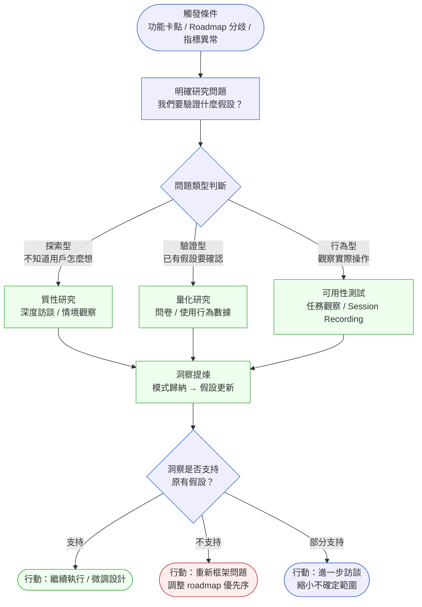
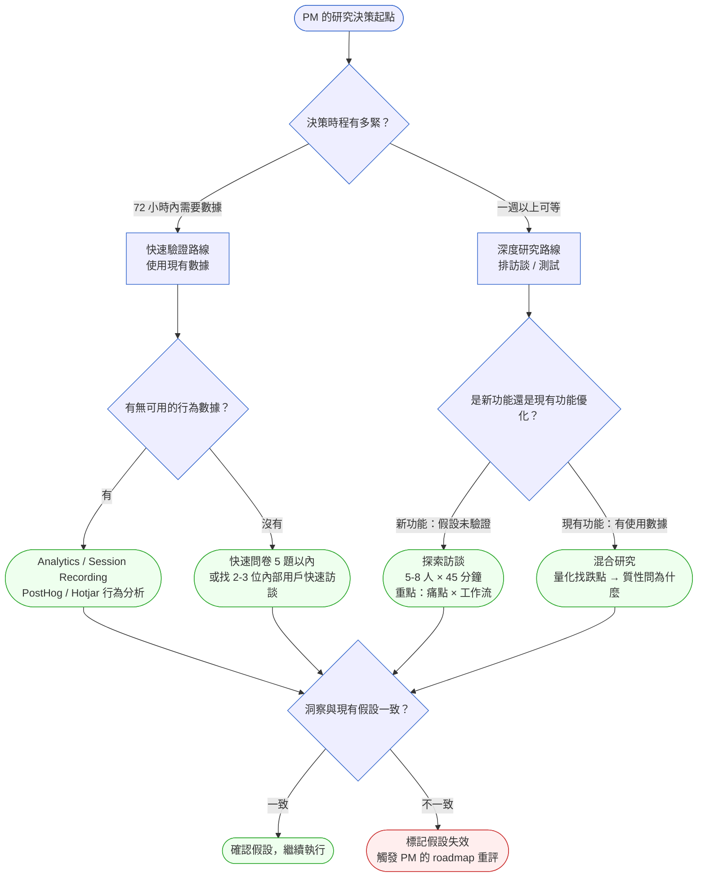
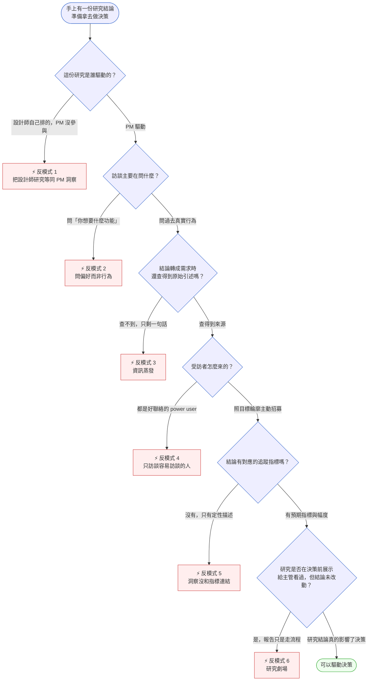

# 第 7 章 | User Research for PM（PM 的用戶研究）：研究不是設計師的事

> **前置閱讀**：[Ch 4　Requirements Lifecycle：需求的生命週期](../part-01-foundation/ch-04-requirements-lifecycle.md)、[Ch 6　PM 的日常節奏](../part-01-foundation/ch-06-pm-daily-rhythm.md)
> **下游章節**：[Ch 8　Competitive Intelligence](./ch-08-competitive-intelligence.md)、[Ch 10　Jobs-to-be-Done](./ch-10-jtbd.md)
> **SA/SD 對照**：[SA/SD Ch 4 需求工程基礎](../../book/part-01-foundations/ch-04-requirements-engineering.md)、[SA/SD Ch 7 物件導向分析](../../book/part-02-analysis/ch-07-object-oriented-analysis.md)
> ⸺ SA 視角關注需求的可實作性（邊界、介面、一致性）；本章關注需求的有效性（這個假設現在還成立嗎？）。

---

## §7.1 冷觀察

季度 sprint review（衝刺檢視會議）結束，會議室的人散得差不多了。工程主管 Leo 沒走，他在門口堵住正要離開的 PM Vivian，手機螢幕亮著一張折線圖。

「表單精靈，上線三週。」他把螢幕轉向她，「你知道用戶在哪一步消失嗎？」

Vivian 知道數字。第二步，跳出率 68%，今天早上的 Slack 報表她掃過。她張嘴想答，Leo 已經接著問下去。

「我不是問數字。」他說，「我是問**為什麼**。」

Vivian 沒有答案。她聽見自己說：「我們……有設計師的研究報告——」

「Q3 那份？」Leo 沒有抬高音量，但每個字都壓下來，「我們砍掉三分之一欄位、重做整個 Q4，靠的就是那一份？」

那份報告是設計師 Rita 在去年 Q3 做的，訪談了 11 位用戶，結論寫得很乾脆：「用戶的主要痛點是表單欄位太多，精簡流程是首要改善方向。」產品團隊照這個結論做了精靈式引導設計，砍掉三分之一欄位。整個 Q4 的 sprint 都在執行這個方向。

上線之後，第二步的跳出率比舊版高了 22 個百分點。

當晚 Vivian 把那份報告重讀了一遍，愈讀手愈冷。訪談時間：2025 年 9 月。當時的 Formly 只有 1,200 個企業客戶，主要是中小型 SaaS 新創公司；訪談對象裡有八位是初期採用者，對產品的容忍度極高。到了 2026 年 Q1，Formly 的客群已經換了一批人——中型企業進來了，他們有完整的 IT 部門，他們最在意的根本不是「欄位少」。他們在意的是「合規欄位是否齊全」。

研究本身沒有錯。Rita 在 2025 年 9 月做的東西，在 2025 年 9 月是對的。錯的是：Vivian 把一份過期的洞察，原封不動地套在一個已經換過血的用戶群上——而她自己，在整個 Q4 沒有親手做過任何一次用戶訪談。

那份三個月前的報告，是設計師的工作成果。但拿這份報告去拍板 roadmap（產品路線圖）的人，是 PM。決策錯了，責任也是 PM 的。

---

## §7.2 真問題

Vivian 的問題表面上看是「沒有讀新研究」，把它拆開，會看到三層。

### 表面需求（What）

團隊需要用戶研究的資料來驗證功能方向。

這一層沒有人會否認。問題是「研究」被當作一個**由設計師負責輸出的交付物**，PM 的角色是「消費」這份交付物，而不是「驅動」這個研究。於是，研究週期跟不上 roadmap 週期，PM 拿著手邊最近一份報告做決策，不管它的時效性還在不在。

### 業務目標（Why）

Formly 在 2025 Q4 的 OKR（目標與關鍵成果）是「提升表單完成率」（outcome，成果）。但這個目標背後真正要的，是「擴大中型企業客群的留存率，支撐 ARR（年度經常性收入）成長」（impact，影響）。

這裡藏著一個關鍵錯誤：研究的 **Outputs（產出物）**（訪談報告、用戶引述、行為觀察）被直接接到 **Impact（影響）**（ARR 留存）上，跳過了中間的 **Outcomes（成果）**（實際的用戶行為改變）。

| 層次 | Formly 的案例 | 實際發生的事 |
|---|---|---|
| **Outputs（產出物）** | 設計師的 11 人訪談報告 | 按時交付，內容完整 |
| **Outcomes（成果）** | 使用者的表單完成行為改變 | 沒有驗證；舊用戶群數據不代表新用戶群 |
| **Impact（影響）** | 中型企業留存率上升 | 上線後 NPS 下滑，客服票量增加 |

PM 原本想改善的是 Outcomes（完成率），但她拿來驗證的卻是舊用戶群的 Outputs 結論，結果 Impact 反向移動了。

### 決策瓶頸（Who × When）

這是最常被忽略的一層。研究工作在組織裡的 DACI（決策角色分工：Driver/Approver/Contributor/Informed）通常從來沒有被明確定義：

| 角色 | 全稱 | 在研究決策中的職責 |
|---|---|---|
| **D** Driver（驅動者） | 驅動研究進行 | 應該是 PM——決定研究問題、時程與觸發條件 |
| **A** Approver（拍板者） | 最終拍板 | 應該是 PM 或 Product Lead——研究結論是否充分支持 roadmap 決策 |
| **C** Contributor（貢獻者） | 提供輸入 | 設計師（執行訪談）、工程師（技術可行性）、客成（現有用戶信號） |
| **I** Informed（被告知者） | 被通知結果 | 工程主管、行銷、Sales |

Formly 的實際狀況是：**D 和 A 都落在設計師手上**，PM 以 I 的姿態消費研究結果。當用戶群改變、研究前提失效時，沒有任何人的職責是去觸發「重新研究」——因為那個觸發責任，從來沒有被分配給 PM。

這不是 Vivian 個人怠惰，而是組織設計的結構性陷阱。絕大多數產品組織把「用戶研究」歸類在 UX／設計部門之下——職稱叫「UX Researcher」、預算掛在設計主管、研究工具的授權也由設計 lead 管理。這意味著 PM 在研究流程中擔任 Driver 的職責，從來不會被寫進職務說明、新人 onboarding 手冊、或 sprint 儀式之中；它必須由 PM 主動宣告並佔據，否則真空就會自動填入設計師。

決策瓶頸就在這裡：**PM 沒有把「研究觸發條件」納入自己的工作節奏**，把研究的 Driver 責任預設丟給了設計師。

---

## §7.3 決策框架

本節不給「該做哪種研究」的標準答案——因為情境一變，答案就變。本節給的是**判斷的結構**：當你站在某個決策壓力前，你怎麼自己推導出該做什麼。

### 圖 A：用戶研究流程

PM 做用戶研究，不是要成為研究員，而是要成為**研究問題的主人**。流程的起點是觸發條件，終點是可以驅動決策的行動。



這張圖的關鍵判斷點是：PM 的進入點是「觸發條件」，不是「研究排程」。研究不是按月計劃的例行公事；它是在特定決策壓力下被觸發的活動。當你問自己「現在該不該做研究」時，先問的不是「上次做是什麼時候」，而是「有沒有一個決策正在等這份洞察」。

---

### 圖 B：研究方法選擇決策樹

在「方法選擇」這一步，常見的錯誤是把「設計師做的訪談」等同於「所有研究」。下面這棵樹告訴你**怎麼問自己**，順著兩個問題（時程多緊、功能新舊）走，你會自己落到一個方法上：



注意這棵樹的兩個分岔點都是「問句」，不是「結論」。時程與功能新舊是你自己手上的事實，方法只是這兩個事實的自然結果。

---

### 決策表：情境 × 方法 × PM 關注點

| 情境 / 觸發條件 | 推薦做法 | PM 關注點（你該問自己的問題） | 常見錯誤 |
|---|---|---|---|
| 功能上線後使用率低、跳出率高 | 先拉 Session Recording（操作錄製）定位跌點，再針對跌點做 3-5 人訪談 | 「用戶在哪個動作停下來？」 | 直接改設計，沒有問「為什麼停」 |
| Roadmap 新功能方向有爭議 | 探索訪談（5-8 人），重點問工作流而非功能偏好 | 「用戶現在用什麼替代方案？」 | 問「你想要 X 嗎？」（確認偏誤） |
| 客群出現新細分（如 SMB 轉 Enterprise） | 對新客群做 3-5 人訪談，比較與舊客群的工作流差異 | 「舊研究的前提假設對新客群還成立嗎？」 | 把舊研究結論直接套用新客群 |
| OKR 指標下滑，原因不明 | 混合研究：量化定位哪個環節下滑，質性問影響因素 | 「指標下滑是行為問題還是期望問題？」 | 只看量化，不做定性確認 |
| 競品發布新功能，評估是否跟進 | 5-8 人訪談，問用戶對該競品功能的使用情況與評價 | 「用戶切過去用了嗎？為什麼？」 | 只看競品功能本身，不問用戶實際使用行為 |
| Sprint 規劃前，確認本季優先序 | 回顧最近 30 天的客服票、NPS 評論、支援聊天記錄 | 「最近新出現的痛點是什麼？」 | 完全依賴上一季的研究，不做現況盤點 |
| 新客群進入（B2C 消費端或電商場景） | 對新客群做分層訪談（重度 / 輕度 / 流失），比較行為模式差異 | 「這群人的使用情境跟原始用戶群有哪些本質差異？」 | 用 B2B 思維套 B2C 用戶，誤判使用頻次與情感驅動因素 |
| 高速 sprint，48-72 小時決策窗口 | 先拉現有 Analytics 定假設，再做 2-3 人快速電話訪談驗方向 | 「這個決策有沒有哪一條假設，72 小時內可以用現有數據快速否定？」 | 等完整訪談報告，錯過決策時機 |

這張表的每一欄「PM 關注點」都是一個問句——這就是重點。要練的不是記住推薦做法，而是在情境出現時，反射性地問出對的那個問題。

---

### 現代研究工具棧

很多 PM 仍然把「用戶研究」等同於「設計師的訪談記錄」，其實現場工具遠不止這些。按用途分四類，每類選一個主力工具就夠：

| 類別 | 代表工具 | PM 最常用場景 |
|---|---|---|
| **行為分析**（量化） | PostHog、Amplitude、Mixpanel | 定位跌點、漏斗追蹤、Feature Flag 實驗 |
| **Session Recording**（行為觀察） | Hotjar、FullStory、Microsoft Clarity | 看用戶實際點了什麼、卡在哪、跳出前做什麼 |
| **質性研究平台** | Dovetail、Notion AI、Reframer | 訪談記錄結構化、主題歸納、引述追蹤 |
| **快速驗證**（遠端） | Maze、UserTesting、Lyssna | 5 秒測試、可用性任務、點擊熱圖 |

工具本身解決不了「PM 沒有把研究當 Driver 責任」的問題。但正確的工具搭配可以把「研究觸發到洞察交付」的週期從兩週壓縮到 48 小時——這對 sprint 節奏很重要。

---

### If-Then 框架：研究觸發條件的 PM 判斷

研究觸發的時機是最難制度化的一件事。以下幾個 If-Then（若—則）判斷結構，是在現場比較穩的：

- **If** 功能在規劃時有任何一個假設超過 60 天未被重新驗證 → **Then** 在排入 sprint 前重做至少 3 人訪談
- **If** 客群組成改變超過 20%（如新增新行業、規模層、地區） → **Then** 為新客群重啟探索訪談，不沿用舊客群的研究結論
- **If** 洞察來源只有一種（只有訪談、或只有數據） → **Then** 強制補做另一種，才能進入 roadmap 決策
- **If** 研究可信度評分低於 5 分 → **Then** 暫緩該功能的 roadmap 排序，直到補做研究達到 5 分以上

**評分矩陣：研究結論可信度快速評估**

這張矩陣把判斷拆成五個各自可以給分的維度，讓你看清楚一份研究到底弱在哪裡：

| 評估維度 | 0 分 | 1 分 | 2 分 |
|---|---|---|---|
| 訪談對象與當前目標用戶的一致性 | 不同客群 | 部分重疊 | 高度一致 |
| 研究完成距今時間 | > 90 天 | 30-90 天 | < 30 天 |
| 樣本量 | 1-3 人 | 4-7 人 | ≥ 8 人 |
| 洞察來源多樣性 | 單一來源 | 兩種來源 | 三種以上 |
| 洞察是否與現有量化數據一致 | 矛盾 | 不確定 | 一致 |

**0-4 分**：這份研究不應該驅動重大 roadmap 決策，需補做研究。
**5-7 分**：可以驅動方向性決策，但具體設計細節需要補充驗證。
**8-10 分**：研究結論可信，直接用於決策。

Formly 的那份報告，在 2026 Q1 時的評分是：訪談對象（0）、時間（0）、樣本量（2）、來源多樣性（0）、與量化一致性（0）= **2 分**。分數本身不會替你做決定，但它讓「不該用這份報告」這件事，從直覺變成了一個你能指著說明的事實。

---

### §7.3.1 倫理與合規：啟動研究前的必查清單

這一節很多 PM 跳過，但在 SaaS、金融、醫療場景下，跳過的代價是 Legal 在最後一分鐘煞車。

以下是啟動任何用戶研究前的最小合規檢查：

| 檢查項目 | 說明 | 誰負責 |
|---|---|---|
| **用戶同意書** | 訪談前需取得錄音 / 錄影 / 引述使用的書面同意 | PM（確認流程存在）|
| **個資最小化** | 訪談記錄是否收集了超出研究問題必要的個人資訊 | PM + 研究執行者 |
| **GDPR / 個資法適用範圍** | 受訪者所在地的個資法規是否影響數據保存方式 | Legal（諮詢）|
| **敏感族群保護** | 若受訪者涉及醫療病患、未成年人、弱勢族群，需要額外的倫理審查 | PM + Legal |
| **財務 / 醫療場景的法規邊界** | Fintech / Healthcare 研究若涉及真實交易紀錄或病歷，需確認數據去識別化 | Legal（確認）|
| **訪談記錄保存期限** | 研究報告與原始訪談記錄的保存與刪除策略 | PM（確認有政策）|

最低標準：每次研究啟動前，PM 需要確認「同意書存在」和「個資不超收」這兩條。其他項目在高風險場景（金融 / 醫療 / 敏感族群）才需要 Legal 介入。

---

### §7.3.2 當主管已經「知道答案」：處理研究前的利害關係人期待

用戶研究最難的情況，不是找不到受訪者，而是「研究還沒開始，主管已經在 Slack 說結論了」。

這種情況有兩個常見來源：

**來源一：主管把先前的市場直覺或 Sales 反饋當成研究結論**
Sales 說「客戶要 X」，主管接著說「那我們做 X」。PM 此時做研究，被視為浪費時間。

**來源二：主管對結果有預設立場**，研究被當成背書工具，而非探索工具。

比較穩的處理方式：

1. **在研究啟動前，明確說「假設」而非「方向」**：把主管的立場轉換成可被驗證的假設——「您的假設是用戶需要 X，如果研究確認了這點，我們就有更強的理由推動它；如果沒有，我們可以早一步調整，省掉四個 sprint。」

2. **設定「如果假設不成立」的決策流程**：在研究啟動前就說清楚「如果研究結果和你的預期不一致，我們用什麼流程決定下一步？」讓這個問題在有數據前先變成共識。

3. **帶主管進入研究，不是帶結論給主管**：邀請主管參加一場訪談的觀察（Observer 角色）。直接聽到用戶說「不」，比 PM 轉述「用戶說不」有說服力十倍。

**什麼情況下放棄爭論、轉為記錄**：如果主管的決定是基於業務壓力或資源限制（不是因為誤解用戶），而不是基於對研究的誤讀，PM 的工作是記錄「這個決定是在研究不充分的情況下做的，已知風險是 X」，然後在上線後設計好追蹤指標，讓結果說話。

---

## §7.4 踩坑清單

下面六個反模式，從上到下大致按「離 PM 最近、最常犯」排到「最隱性、最難察覺」。先學會辨認，比學會解法更重要——下方的辨認決策樹幫你在現場快速對號入座。

### 圖 C：反模式辨認決策樹



### ⚡ 反模式 1：把設計師的研究等同於 PM 的洞察

**現象**：設計師做了一份訪談報告，PM 在 sprint planning 裡引用它支持決策，沒有質疑研究的前提是否仍然成立。

**根因**：PM 把研究視為「設計師的輸出物」，自己是消費者而非驅動者。當用戶群或市場條件改變時，沒有人的職責是重新觸發研究。

> **修正方向**：把「研究可信度評估」加入 sprint 規劃的前置流程。每次引用研究結論時，先跑一遍評分矩陣。分數低的結論，標記為「待補充」而非「已驗證」。

---

### ⚡ 反模式 2：訪談問「你想要什麼功能」

**現象**：PM 或設計師做訪談，主要問題是「如果我們做 X，你覺得有用嗎？」「你希望這個功能有什麼？」用戶說「有用」，就當作驗證。

**根因**：確認偏誤（Confirmation Bias，傾向尋找支持既有假設的證據）。用戶天生傾向同意詢問者的假設，尤其在直接對話場合。問「想要什麼」得到的是用戶的理想，不是用戶的行為。

> **修正方向**：訪談問題聚焦在「你上一次遇到這個問題是什麼時候？你當時怎麼處理的？」——讓用戶描述**過去的真實行為**，而不是**未來的假設偏好**。這個問法是 JTBD（Jobs-to-be-Done）訪談的核心操作，詳見 [Ch 10　Jobs-to-be-Done](./ch-10-jtbd.md)。

---

### ⚡ 反模式 3：研究結論轉成需求時，資訊蒸發

**現象**：訪談做完了，設計師寫了一份 8 頁報告。PM 在 sprint planning 裡把它壓縮成一行：「用戶說流程太複雜」。工程師拿到這一行時，不知道是哪個步驟複雜、哪個用戶類型反映的、複雜的定義是什麼。

**根因**：洞察在傳遞過程中失去了脈絡。PM 的「翻譯」沒有保留足夠的可追溯性。

> **修正方向**：在 User Story（用戶故事）或規格裡加入「洞察來源」欄位——「來源：2026-01 訪談，受訪者 ID U-003 和 U-007，原始引述：『我每次都要重填這個欄位因為系統會清掉上次填的』」。工程師和設計師可以回頭查，PM 自己也可以在 review 時驗證洞察是否被正確轉譯。Dovetail（研究記錄平台）能讓原始引述和 User Story 之間維持雙向連結。

---

### ⚡ 反模式 4：只訪談容易訪談的用戶

**現象**：訪談對象幾乎都是早期採用者、熟悉產品的 power user（重度使用者）、或者客成介紹的「最配合的客戶」。研究結論對這群人有效，但不代表主流用戶群。

**根因**：訪談招募走阻力最小的路徑。這讓樣本系統性偏向高投入、高滿意度、高技術能力的用戶，遮蔽了沉默的多數。

> **修正方向**：定義「目標用戶輪廓」後，主動招募符合輪廓的受訪者，而不是招募「可以聯絡到的人」。對於低活躍用戶、最近流失的用戶、從未使用某功能的用戶，尤其要納入名單。他們的不作為，往往比 power user 的建議更有信號量。UserTesting 或 Maze 的招募面板可以讓你按特定屬性篩選受訪者，省去自行招募的行政負擔。

---

### ⚡ 反模式 5：洞察沒有和指標連結，無從追蹤

**現象**：研究做完了，結論是「用戶對 onboarding（新手引導）感到困惑」。功能按研究方向修改了。三個月後，沒有人知道改動是否真的解決了問題，因為從來沒有定義「困惑被解決」的量化指標。

**根因**：研究結論停在定性描述，沒有被轉換成可追蹤的行為指標。Outputs（訪談報告）完成了，但 Outcomes（行為改變）沒有被定義。

> **修正方向**：每一條研究結論在被轉成 roadmap 項目時，必須附帶「如果這個洞察是對的，我們預期會看到什麼指標改變、幅度多少、在什麼時間框架內」。這句話寫不出來，代表洞察還沒有被充分理解。

---

### ⚡ 反模式 6：研究劇場（Research Theater）

**現象**：用戶研究做了，但它的結論從一開始就不會改變決策。PM 做研究是為了「讓主管感覺我們有做功課」，而不是為了探索未知。報告交出去，方向照舊，然後在季度回顧時以「有做研究」作為決策依據的背書。

**根因**：組織把研究當做合理化工具，而非探索工具。PM 沒有心理安全感去呈現「研究結論推翻了我們的假設」這樣的結果，因為推翻假設意味著承認季度方向需要調整。

> **修正方向**：在研究啟動前，明確寫出「如果研究結論是 A，我們做 X；如果是 B，我們做 Y」。這個預設的「如果-那麼」結構讓結論和行動之間的連結在研究開始前就透明，而不是在結果出來後才決定怎麼詮釋數據。如果你發現自己寫不出「如果是 B，我們做 Y」，代表這個研究在組織裡的真實用途是背書而非探索。

---

## §7.5 交付清單 ⸺ 一頁式研究觸發卡（Research Brief，研究簡報）模板

在每次啟動用戶研究前，PM 需要完成一份研究觸發卡。它不是一份研究計劃書，不需要方法論細節；它是 PM 用來確認「我知道我為什麼要做這個研究」的強制思考工具。

```markdown
# Research Brief
> 版本:v0.1 | 撰寫日期:YYYY-MM-DD | 擁有人:{名字}

### 觸發情境
<!-- 把觸發事件寫清楚，才能判斷是行為問題還是設計問題；
     寫不清楚這欄，研究問題通常也會偏離。 -->
- {功能 / 指標 / 事件}在 {時間} 出現了 {什麼信號}

### 我們要驗證的假設
<!-- PM 把假設明確寫出來，才能事後驗證研究是否真的回答了問題；
     模糊假設會讓訪談結論永遠「部分支持」。 -->
- 假設：{用戶 X 在情境 Y 下，因為 Z 原因，做不到 W}
- 如果假設成立，預期看到：{行為指標 / 用戶引述}
- 如果假設不成立，預期看到：{行為指標 / 用戶引述}

### 研究問題（≤ 3 個）
<!-- 多於 3 個問題的研究，通常是沒有釐清真正要決策的事情是什麼。 -->
1. {問題 1}
2. {問題 2}
3. {問題 3}

### 目標用戶輪廓
<!-- 輪廓寫越具體，越不容易落入「訪談容易訪談的人」反模式。 -->
- 客群：{企業規模 / 行業 / 角色}
- 使用狀態：{新用戶 / 活躍用戶 / 低活躍 / 近期流失}
- 樣本量：{N 人}

### 方法選擇
- [ ] 探索訪談（45 分鐘，5-8 人）
- [ ] 快速訪談（20 分鐘，3-5 人）
- [ ] 可用性測試（任務觀察 / Maze / UserTesting）
- [ ] 問卷（N = {數量}）
- [ ] 行為數據分析（來源：{PostHog / Amplitude / Hotjar}）

### 研究可信度快速評估（填完再啟動）
- 訪談對象與目標用戶一致性：{0/1/2}
- 距上次研究時間：{0/1/2}
- 樣本量：{0/1/2}
- 洞察來源多樣性：{0/1/2}
- 與現有量化數據一致性：{0/1/2}
- 合計：{X/10}（< 5 分必須補做才能進 roadmap）

### 倫理 & 合規快查
- [ ] 用戶同意書已備妥
- [ ] 個資收集已最小化（不蒐集超出研究必要的個人資訊）
- [ ] 錄音 / 錄影保存策略已確認
- [ ] 高風險場景（Fintech / Healthcare）已知會 Legal

### DACI
- Driver（觸發與追蹤）：{PM 名稱}
- Approver（研究結論決策）：{PM 或 Product Lead}
- Contributor（執行訪談）：{設計師 / 研究員}
- Informed（結論通知）：{工程主管、客成、行銷}

### 如果-那麼決策連結
<!-- 預先寫出結論和行動的對應關係，防止研究劇場（Research Theater）。 -->
- 如果假設成立 → {我們決定做 X}
- 如果假設不成立 → {我們決定做 Y}
- 如果結論是部分支持 → {我們需要再追問的問題是 Z}

### 預計交付時間
- 研究執行完成：{日期}
- 洞察報告：{日期}
- Roadmap 決策截止：{日期}
```

把它存在 `docs/research/`，跟程式碼同 repo，跟 README 同層。

這張卡的核心功能是「讓 PM 說清楚研究問題」。如果寫不出「假設」欄，代表這個研究還沒有清楚的驅動問題，不應該啟動。如果寫不出「如果-那麼決策連結」欄，代表這個研究的用途可能是背書，不是探索。

### §7.5.1 範例：Formly 補做的研究觸發卡

Formly 表單精靈上線後，Vivian 在 Leo 提問的隔天補做了這份卡。這是那張卡應該長什麼樣：

```markdown
# Research Brief
> 版本:v0.1 | 撰寫日期:2026-02-15 | 擁有人:Vivian（PM）

### 觸發情境
- 表單精靈功能（FormWizard v2）於 2026-02-01 上線，三週後第二步跳出率 68%，
  較舊版高出 22 個百分點。同期中型企業客群比例從 18% 增至 41%。

### 我們要驗證的假設
- 假設：中型企業用戶（IT 部門存在）在填寫表單第二步時，因為缺少合規欄位
  （如 GDPR 同意紀錄欄位）而無法繼續，或因不信任「精簡版」表單而放棄。
- 如果假設成立：用戶會明確提到「缺少必要欄位」或「不符合我們的合規要求」
- 如果假設不成立：用戶在第二步卡住的原因是介面操作問題，與欄位無關

### 研究問題
1. 中型企業用戶在填寫表單時，哪些欄位是他們的 must-have？
2. 他們在第二步遇到的具體障礙是什麼？
3. 他們用什麼替代方式處理表單（如果放棄了 Formly）？

### 目標用戶輪廓
- 客群：員工 200-2000 人、有 IT 部門、金融或醫療行業（高合規需求）
- 使用狀態：2025Q4-2026Q1 新簽客戶，且在 FormWizard 有跳出紀錄
- 樣本量：5 人

### 方法選擇
- [x] 快速訪談（20 分鐘，5 人）— 先問跌點行為，再問替代方案
- [x] 行為數據分析（Hotjar Session Recording — 定位跌點位置）

### 研究可信度快速評估
- 訪談對象與目標用戶一致性：2（明確指定新客群）
- 距上次研究時間：0（上次研究是 2025-09，超過 90 天）
- 樣本量：1（5 人屬於 4-7 人區間）
- 洞察來源多樣性：1（訪談 + Analytics，兩種來源）
- 與現有量化數據一致性：1（量化有跌點，質性驗證原因）
- 合計：5/10（剛好在門檻，補做前先跑這 5 人訪談）

### 倫理 & 合規快查
- [x] 用戶同意書已備妥（標準 SaaS 研究同意書，法務已核可）
- [x] 個資收集已最小化（訪談不問客戶名稱、不記錄具體公司資訊）
- [x] 錄音保存策略已確認（Dovetail，30 天後自動刪除原始錄音）
- [x] 高風險場景：訪談不涉及實際客戶數據，無需 Legal 額外介入

### DACI
- Driver：Vivian（PM）
- Approver：Vivian（需要在 sprint planning 前拍板）
- Contributor：Rita（設計師，執行訪談）；Hotjar 分析由 Vivian 自行完成
- Informed：Leo（工程主管）、客成團隊

### 如果-那麼決策連結
- 如果假設成立（缺合規欄位）→ 下個 sprint 加回被砍的欄位，改為「合規模式 / 精簡模式」切換
- 如果假設不成立（是介面問題）→ 請 Rita 針對第二步做可用性測試，查 Session Recording 確認點擊路徑
- 如果部分支持 → 兩個方向同步修，但先推介面修復（週期短），再做欄位架構調整（週期長）

### 預計交付時間
- 研究執行完成：2026-02-28
- 洞察報告：2026-03-03
- Roadmap 決策截止：2026-03-05（下次 sprint planning 前）
```

五人訪談做完後，假設獲得部分驗證：三位受訪者確實提到缺少合規欄位，但另外兩位是因為操作問題（第二步的「繼續」按鈕在手機版被鍵盤遮住）。Hotjar Session Recording 也確認了手機端的按鈕遮擋問題，在三個不同機型上可以複現。

兩個問題一起修。這張卡讓研究問題清楚了，也讓後續的設計改動有了可追蹤的根據——三週後第二步跳出率降至 41%，介面修復的貢獻（-18 個百分點）比欄位調整（-9 個百分點）還大。這個結果，如果沒有研究，Vivian 可能永遠不會知道。

---

## §7.6 Recap

讀完本章，應該已經能做到：

- [ ] 分辨研究失效的三種信號：客群改變、時間超過 60 天、前提假設被新數據推翻
- [ ] 用 Outputs / Outcomes / Impact 三層檢查研究結論是否真的連接到業務目標
- [ ] 明確自己在研究 DACI 中的 Driver 責任，不把觸發條件預設給設計師
- [ ] 在啟動研究前跑研究可信度評分，低於 5 分的結論不進 roadmap 決策
- [ ] 用研究觸發卡（Research Brief）在 20 分鐘內把研究問題說清楚
- [ ] 識別研究劇場（Research Theater）並在研究啟動前用「如果-那麼」結構預防它
- [ ] 在高速 sprint（48-72 小時窗口）下，知道哪些研究方法可以快速給出足夠的信號

這一章的 Formly 案例，最後的結局不是皆大歡喜。第二步跳出率降了，但用了三週。這三週，Vivian 沒有辦法拿回去。她做對的事，是把那張研究觸發卡加進了 sprint 規劃的前置流程——從那個 sprint 開始，每次功能排進 sprint 前，她會先問一個問題：「這個決策背後有幾分的研究支撐？」

不需要每次都等到分數滿，但需要知道地基在哪裡。知道地基在哪，才能站回駕駛座。

本章的訪談框架（問過去行為而非未來偏好）是 [Ch 10　Jobs-to-be-Done](./ch-10-jtbd.md) 的基礎操作——JTBD 把「行為背後的任務」這件事做得更系統。而研究得到的洞察如何在競品情境下被放大和驗證，見 [Ch 8　Competitive Intelligence](./ch-08-competitive-intelligence.md)。

---

## Cross-References

- **前置閱讀**：[Ch 4　Requirements Lifecycle](../part-01-foundation/ch-04-requirements-lifecycle.md) ⸺ 需求的生命週期決定了研究在哪個節點最有影響力
- **前置閱讀**：[Ch 6　PM 的日常節奏](../part-01-foundation/ch-06-pm-daily-rhythm.md) ⸺ 研究觸發條件需要嵌入週度工作節奏才能持續運作
- **下一章**：[Ch 8　Competitive Intelligence](./ch-08-competitive-intelligence.md) ⸺ 用戶研究關注現有用戶的行為；競品研究關注市場信號與替代方案
- **強連結**：[Ch 10　Jobs-to-be-Done](./ch-10-jtbd.md) ⸺ 本章的訪談框架（問過去行為而非未來偏好）是 JTBD 方法論的基礎操作
- **強連結**：[Ch 24　PM × Design](../part-04-collaboration/ch-24-pm-design.md) ⸺ 研究的 DACI 責任邊界，是 PM 與設計師協作中最常模糊的一條線
- **SA/SD 對照**：[SA/SD Ch 4 需求工程基礎](../../book/part-01-foundations/ch-04-requirements-engineering.md) ⸺ SA 關注需求的可實作性（邊界、介面、一致性）；本章關注需求的有效性（假設是否還成立）
- **SA/SD 對照**：[SA/SD Ch 7 物件導向分析](../../book/part-02-analysis/ch-07-object-oriented-analysis.md) ⸺ SA 從系統邊界出發理解用戶行為；PM 從決策壓力出發觸發用戶研究
