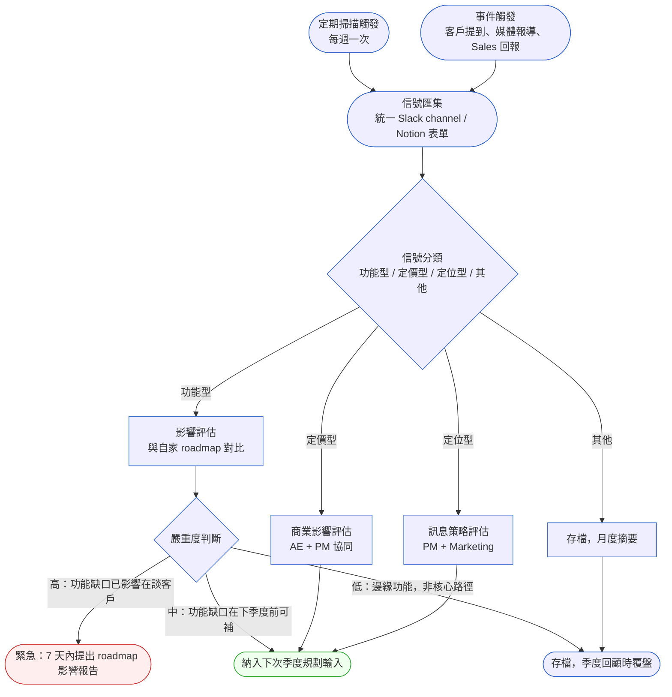
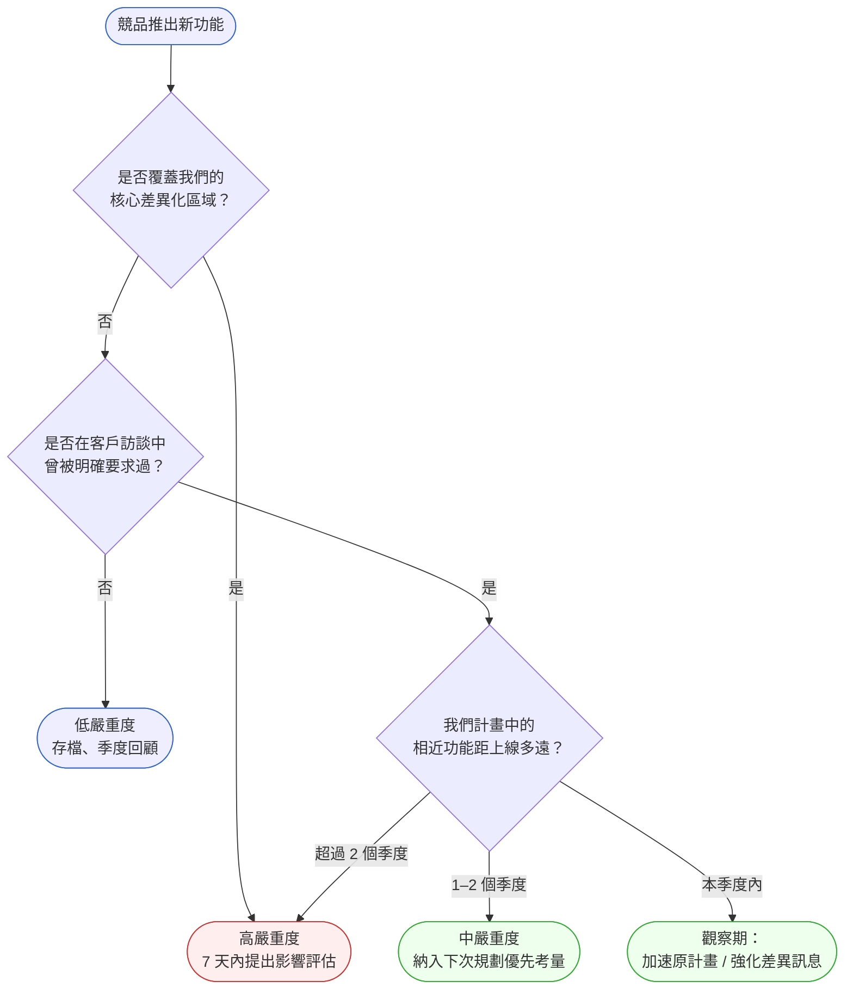

# 第 8 章 | Competitive Intelligence：競品信號到產品決策

> **前置閱讀**：[Ch 7 User Research for PM：研究不是設計師的事](./ch-07-user-research.md)
> **下游章節**：[Ch 9 VoC Loop：持續性客戶回饋管理](./ch-09-voc-feedback-loop.md)
> **PM 系列連結**：[Ch 14 Product Roadmap：承諾的邊界](../part-03-planning/ch-14-product-roadmap.md)
> **SA/SD 對照**：[SA/SD 第 3 章 專案啟動、可行性研究與利害關係人分析](../../book/part-01-foundations/ch-03-project-initiation.md)
> ⸺ SA 視角關注市場可行性作為系統邊界的輸入；本章關注競品信號如何在正確時機轉化為 roadmap 優先順序變更。

---

## §8.1 冷觀察

週一早上九點零四分，ScaleAxis 的 PM Vera 的手機亮了一下。一條 Slack 訊息，三行字，把她那天排好的工作全部推翻。

訊息來自 Enterprise（企業級）客戶 CloudNest 的 IT 總監 Raymond，語氣平靜得像在講天氣：「我們下個月要開始評估 FlowRail 的整合市集，他們上線了原生 Salesforce 和 HubSpot 的雙向同步，不需要 Zapier 中繼。你們有什麼規劃嗎？」

Vera 的第一反應不是回訊息，是去查 FlowRail 的 changelog（版本更新日誌）。她想知道這是什麼時候上線的。頁面載入的那一秒，她的胃沉了一下——發佈日期欄寫著三月初。她算了算：47 天前。

她打開自家的 roadmap（產品路線圖），找到「整合層升級」這個 Epic（史詩級需求群組）——排在下個季度，優先級 P2，估算 6 週。她把這兩個數字並排放著看了很久：對手已經跑了 47 天，而她連起跑都還沒開始。

那一週的週會，CPO 問了一句：「這個我們知道多久了？」

沒有人答得上來。

不是沒有人看到。工程師 Marcus 三週前在一個技術論壇上看到 FlowRail 整合市集的討論串，當時覺得「是個不錯的架構」，沒有特別想到要告訴 PM。設計師 Tina 在競品分析 Notion 頁面上有一欄「FlowRail 最新動態」，但上次更新是兩個月前。

銷售主管 Derek 說：「Raymond 不是第一個問的。上個月 Pinnacle Corp 的 AE 也問過，我以為 PM 知道。」

四個人各自知道一小塊，但信號從來沒有流到需要做決策的位置。

這就是競品情報系統缺位時的真實樣貌：不是敵人太強，是信號太散。監控在隨機發生，蒐集在各自為政，沒有人負責把碎片組裝成決策輸入。等到 PM 知道的時候，代價已經是 47 天的失速期，加上一個原本排 P2 的功能突然變成救火優先。

---

## §8.2 真問題

把 ScaleAxis 的狀況往下拆，問題不只是「沒有追蹤競品」。

### 表面需求（What）

PM 在季度中期發現競品發佈了重要功能，客戶開始評估切換，要求緊急調整 roadmap。

這是可見的症狀。但如果只解決「下次要更快知道」，下個季度還會發生同樣的事。

### 業務目標（Why）

競品情報的業務目標有兩層，而 ScaleAxis 把它們混淆了：

**防禦層**：及早偵測競品動作，避免功能缺口擴大到影響留存的程度。
**進攻層**：從競品的空白地帶找到差異化空間，讓 roadmap 優先順序有市場依據而非只靠內部假設。

ScaleAxis 的問題不在於沒有競品分析，而是競品分析只服務「季度規劃時的一次性快照」，不服務「持續的 roadmap 決策」。一次性快照的資訊有截止期限，47 天後就過期了。

再往深一層看：情報是否「及時到達決策者」跟「有沒有人在監控」是兩件事。Marcus 看到了，Derek 也聽到了，但這些信號沒有通道流向 Vera。組織裡的情報蒐集是分散的，但決策是集中的，中間沒有匯流機制。

### 決策瓶頸（Who × When）

這個案子的決策瓶頸很具體：

- **Who**：誰有權在季度中期調整 roadmap 優先順序？在 ScaleAxis 是 CPO 最終核准，PM 提案，Engineering 評估技術影響。
- **When**：調整 roadmap 有成本——工程師已開始 sprint，改優先順序意味著打斷正在進行的工作。這個代價的臨界點大約是「距離功能原計畫上線還有 8 週以上」，否則急插進去反而亂上加亂。

決策瓶頸的核心不是「PM 沒有情報」，而是「沒有定義：什麼程度的競品信號，觸發什麼級別的決策，在什麼時間窗口內需要定案」。

### Outputs / Outcomes / Impact

| 層次 | 現狀 | 真正需要的 |
|---|---|---|
| **Outputs** | 季度初有一份競品分析報告 | 持續更新的情報摘要（每週/雙週） |
| **Outcomes** | PM 在規劃時有競品快照 | PM 在信號出現的 7 天內知曉並能評估影響 |
| **Impact** | 避免功能缺口擴大 | Enterprise 客戶評估切換的機率降低 |

原本想改善的是 Impact（客戶留存），量到的卻是 Outputs（有沒有報告）。這個錯配讓競品情報變成一個「有做但沒用」的儀式。

### DACI（Driver / Approver / Contributor / Informed，決策責任分工）：競品信號處理的決策責任

| 角色 | 人員 | 競品情報中的責任 |
|---|---|---|
| **D** Driver | PM | 定義監控觸發條件、維護情報流程、提出 roadmap 影響評估 |
| **A** Approver | CPO | 核准 roadmap 優先順序調整（P1 以上的競品信號） |
| **C** Contributor | Sales、CS、Engineering、Design | 在各自接觸面蒐集信號，透過統一管道回報 |
| **I** Informed | Marketing、BD | 接收月度競品摘要，無需即時介入 |

這個 DACI 的重點不在誰做什麼，而在「C（貢獻者）的回報路徑必須是明確的單一管道」——否則就會重演 ScaleAxis 的情況：四個人各持一塊拼圖，但拼圖從來沒有拼在一起。

---

## §8.3 決策框架

### 圖 A — 競品情報流程



這個流程有兩個入口刻意設計成並行的：**定期掃描**是主動節奏，每週固定時間跑；**事件觸發**是被動補漏，任何人看到競品信號都能啟動。這兩條線必須都有，只靠定期掃描會錯過突發，只靠事件觸發則信號密度不穩定。

---

### 信號來源與蒐集策略

決策框架告訴你「信號進來後怎麼處理」，但更常見的卡點是「信號從哪裡來」。以下是按信號類型整理的具體來源清單，以及每個來源的時間投入估算：

| 來源 | 信號類型 | 建議工具 / 方法 | 每週時間 | 適合誰維護 |
|---|---|---|---|---|
| **競品官方 changelog / release notes** | 功能型（最直接） | RSS Feed 訂閱 + Feedly 彙整；或每週手動查 5 家主要競品頁面 | 15 分鐘 | PM |
| **Product Hunt** | 功能型、生態型 | Product Hunt 每日郵件；搜尋競品名稱關鍵字 | 5 分鐘 | PM / Growth |
| **G2 / Capterra 評論** | 客戶痛點、競品口碑 | G2 設定 Email Alert；每月查新評論變化趨勢 | 10 分鐘/月 | PM / CS |
| **技術社群（Hacker News / Reddit）** | 功能型、定位型 | HN 搜尋競品名稱；Reddit 追蹤相關 subreddit | 10 分鐘 | Engineering / PM |
| **競品 LinkedIn / Twitter** | 定位型、生態型（合作夥伴宣佈） | 追蹤競品官方帳號 + 創辦人帳號；TweetDeck 設定列表 | 5 分鐘 | Marketing / PM |
| **銷售通話記錄** | 客戶要求、Win/Loss | CRM（HubSpot/Salesforce）加「競品提及」標籤欄位；每週 AE 同步 | 30 分鐘（AE + PM）| Sales + PM |
| **Google Alerts** | 媒體報導、重大事件 | 設定競品名稱 Alert，每日 Digest 格式收 | 5 分鐘 | PM |
| **CI 工具（Crayon / Klue）** | 廣度蒐集（全品類） | 工具輸出需每週人工過篩 20 分鐘；不做過篩就是製造雜訊 | 20 分鐘（篩選） | PM |

**整體時間預算**：如果只追蹤 3–5 家主要競品，上表的「每週掃描」加起來大約 45–60 分鐘。超過這個數字通常是監控範圍太廣或過濾機制不夠，而不是競品太多。

**Win/Loss 整合是最被低估的信號來源**：每一筆輸給競品的商機，都是競品真實吸引力的直接證據，比 changelog 更有分量。建議在 CRM 中加入「輸單競品」標籤，每月 PM + Sales 對齊一次：「過去 30 天輸給 X 的原因中，有多少比例提到功能缺口？」。如果某一功能缺口連續兩個月出現在 Win/Loss 記錄裡，嚴重度自動升一級，不需要等客戶主動說。

---

### 圖 B — 競品信號的嚴重度判斷樹



判斷樹的核心邏輯是兩個問題的交叉：「這個功能有多靠近我們的核心？」加上「客戶有沒有要求過？」。一個競品功能如果既不在我們的差異化區域，客戶也從沒主動要求，優先處理它只會消耗資源；反過來，如果兩者都命中，就算排在明後年的計畫裡，也需要重新評估時程。

---

### 競品信號決策表

| 信號類型 | 觸發條件 | 推薦做法 | PM 關注點 | 常見錯誤 |
|---|---|---|---|---|
| 功能型（核心路徑） | 競品發佈與我方差異化功能重疊的能力 | 7 天內完成功能缺口分析 + roadmap 影響評估，提交 CPO | 評估「補功能」vs「強化差異」哪個更有效 | 直接加急插單，沒有評估技術成本和 sprint 干擾 |
| 功能型（邊緣路徑） | 競品功能與我方無直接重疊，但客戶曾提起 | 加入下次季度規劃的輸入清單，標記客戶需求來源 | 確認「客戶說想要」和「客戶會為此付費或留存」是否一樣 | 把「客戶提過」等同於「必須做」 |
| 定價型 | 競品調整定價（降價、改 tier 結構、免費功能） | 24 小時內通知 Sales 和 CS，48 小時內與 CPO 對齊應對訊息 | 確認對在談機會的影響範圍，優先服務高風險 account | 倉促宣布降價跟進，沒有評估毛利影響 |
| 定位型 | 競品推出新的市場訊息或重新定義品類 | 與 Marketing 對齊現有訊息策略，評估是否需要更新 messaging（市場訊息） | 釐清競品是在搶客戶還是在重新定義問題空間 | 立刻跟著調整定位訊息，導致品牌混亂 |
| 生態型 | 競品宣佈重要合作（整合、通路、戰略投資） | 評估對我方 partner 策略的影響，通知 BD | 判斷這是「封鎖我們的整合路徑」還是「拓展他們的客群」 | 忽略，等到客戶要求同等整合才開始談 |

---

### If-Then 框架：競品信號分級響應

情境判斷可以用一個簡單的評分矩陣快速完成，適合在信號進來後 30 分鐘內做初步分類。要先講清楚：這個矩陣不是替你做決定，而是逼你把「我覺得很嚴重」這種直覺拆成三個可以被質疑、被討論的維度。分數是用來開啟對話的，不是用來終結對話的——當你和 CPO 對某個信號的嚴重度判斷不同時，爭論點會自然落在「是哪一個維度的給分有出入」，而不是各說各話。

**評分維度**（各 0–3 分，滿分 9 分）：

| 維度 | 0 分 | 1 分 | 2 分 | 3 分 |
|---|---|---|---|---|
| **核心重疊度** | 完全不相關 | 邊緣相關 | 部分核心功能重疊 | 直接覆蓋核心差異化 |
| **客戶要求強度** | 沒有客戶提過 | 1–2 個客戶提過，沒有跟進 | 多個客戶提過 + 有跟進記錄 | 當前 in-flight 的 Enterprise deal 明確要求 |
| **時間急迫性** | 競品功能剛公告，尚無用戶採用跡象 | 有早期採用者，但不影響我們的市場 | 已有客戶詢問評估，或競品開始推廣 | 已有客戶告知「我們在對比測試」 |

**響應規則**：

- **If** 總分 7–9（嚴重度 HIGH）→ **Then** 在 7 天內完成影響評估報告，通知 CPO 安排緊急對齊會議
- **If** 總分 7–9 且當前有 in-flight Enterprise deal 受影響 → **Then** 評估是否需要調整當前 sprint 優先順序，最快 48 小時內回覆客戶
- **If** 總分 4–6（嚴重度 MEDIUM）→ **Then** 標記為下次季度規劃的輸入，並在月度競品摘要中詳述
- **If** 總分 4–6 且 Sales 或 CS 已收到客戶詢問 → **Then** 主動通知相關 stakeholder（Sales、CS），同步初步回應口徑
- **If** 總分 0–3（嚴重度 LOW）→ **Then** 存檔至競品資料庫，列入季度競品回顧議程

ScaleAxis 的 FlowRail 原生整合案如果跑這個評分：核心重疊度 3（直接覆蓋整合差異化）+ 客戶要求強度 2（多個客戶提過）+ 時間急迫性 2（競品已推廣，開始有詢問）= 7 分，應觸發 HIGH 響應。事實上卻因為沒有機制，信號在組織裡散落 47 天才聚焦。

---

### 競品情報的三個監控節奏

在實際執行層面，競品情報需要三個時間層次的節奏，各自服務不同的目的：

**每週掃描（30–45 分鐘）**：聚焦信號蒐集，不做深度分析。來源：競品 changelog / release notes、Product Hunt、G2 最新評論、Google Alerts、工程技術社群（Hacker News、技術 newsletter）、銷售通話記錄中的競品提及。輸出：更新共用 Notion 資料庫，標記需要跟進的條目。

**雙週情報摘要（1 小時）**：PM 彙整過去兩週的信號，做初步嚴重度評分，發給 CPO、Sales Lead、CS Lead。格式：3–5 條重要信號 + 評分 + 初步建議。目的是讓決策鏈保持同步，避免月底才有人問「這個我們知道嗎？」

**季度競品深度評析（半天）**：在季度規劃前 2 週完成。覆蓋市場定位、功能矩陣對比、定價結構、客戶評論趨勢分析、Win/Loss 統計回顧。這份報告的目的是「讓季度規劃有市場依據」，不是用來追趕競品，而是用來確認「我們選擇不做的地方，是刻意的差異化，還是眼前的盲點」。

---

### HIGH 信號的 Roadmap 接力路徑

很多 PM 填完嚴重度評估卡之後，下一步卻不清楚：這張卡要帶進哪個會議？誰來做最終決定？決定之後要留什麼記錄？

以下是 HIGH 信號從發現到 roadmap 決策的標準接力路徑：

```
信號發現（任何人）
    ↓
填寫競品信號評估卡（PM，24 小時內）
    ↓
HIGH 判定 → 通知 CPO 安排緊急對齊會議（會議最遲在信號確認後 5 個工作日內）
    ↓
緊急對齊會議（出席：PM / CPO / Engineering Lead / Sales Lead）
  議程（30 分鐘）：
    1. PM 5 分鐘說明信號評估卡內容
    2. Engineering 5 分鐘評估技術影響（加速/重排成本）
    3. Sales 5 分鐘說明 pipeline 風險
    4. 15 分鐘討論並定案：補功能 / 強化差異訊息 / 觀察等待
    ↓
決策記錄（PM 填寫，會後 24 小時內）
  格式：「決定：[加速 INT-2026-Q3] 因為 [CloudNest 在評估期 + 影響 $550K ARR]
         放棄：[原 Q3 的 FEATURE-X 推遲一個 sprint]
         負責人：Vera（功能追蹤）、Derek（客戶溝通）
         重新評估時間：2026-05-15」
    ↓
Sales / CS 取得統一客戶溝通口徑（24 小時內）
```

這個路徑的關鍵不是速度，而是「決策記錄」。沒有書面記錄的決策，三個月後沒有人記得為什麼做了那個選擇——或者更糟，每個人記得的版本不同。

> **分散式團隊注意事項**：如果團隊跨時區（例如台灣 + 美西 + 歐洲），「7 天內完成緊急對齊」的前提是有 async 決策機制。建議做法：PM 在完成評估卡後，同時在共用文件上開啟「async 決策帖」，列出三個選項（補功能 / 強化差異訊息 / 觀察等待）+ 各自的成本和風險，給 stakeholder 48 小時在文件上投票並留意見。48 小時後 PM 根據留言定案，無共識時由 CPO 最終裁定。「7 天」的承諾仍然有效，只是決策方式從同步會議改為 async 投票。

---

### 競品信號的假陽性處理

不是每個競品宣告都會落地。競品可能高調發佈功能，之後靜悄悄延遲，或功能體驗比宣傳差很多，客戶最終不採用。組織如果對每個宣告都緊急反應，情報系統很快會失去可信度——「上次大驚小怪結果沒事」——接著就沒人認真對待真正重要的信號。

**識別假陽性的三個跡象**：

1. **宣佈與 GA（正式上線）時間差超過 3 個月**：競品在 conference 上演示，但產品仍是 beta 邀請制——這是常見的市場聲量先行策略，不需要立刻調整 roadmap，但要設提醒追蹤 GA 日期。
2. **G2 / 客戶評論出現「功能不穩定 / 整合有 bug」**：宣傳完整但執行不成熟，短期內不會威脅我們的客戶——降一級處理（HIGH → MEDIUM）。
3. **3 個月後無 Sales 或 CS 回報客戶詢問**：如果高調宣佈後完全沒有任何客戶問到這個功能，很可能是競品定位沒打到我們的客群——降為 LOW，年度回顧時確認。

**防止信任侵蝕的做法**：在季度競品回顧中，加入「假陽性追蹤」環節：把當季所有 HIGH 信號列出來，對照「客戶行為有沒有實際改變」。如果某個 HIGH 信號三個月後完全沒有 customer behavior 改變，就記錄下來——這是矩陣評分需要調整的信號，不是系統的失敗，是系統在學習。

---

## §8.4 踩坑清單

**反模式：競品分析是季度儀式，不是持續流程**

現象：每次季度規劃前兩週才做競品掃描，做完就封存。平時沒有監控機制，沒有人覺得這是自己的責任。

根因：把競品情報當作「規劃的輸入文件」，而不是「持續維護的市場感知能力」。文件有截止期，能力沒有。

> 修正方向：把競品監控放進 PM 的每週節奏，哪怕每週只花 30 分鐘。信號密度比深度更重要——知道方向有變比等到看清楚全貌更有價值。

---

**反模式：每個人都在看競品，但沒有單一匯集點**

現象：工程師看技術論壇，Sales 聽客戶說，CS 看 G2 評論，設計師偶爾研究競品 UX。但這些信號沒有一個共同的管道，等 PM 需要情報時，只能靠自己搜索或開會問人。

根因：信號蒐集是分散的，但決策是集中的。沒有匯流機制，信號就在各自的工作脈絡裡消失。

> 修正方向：建立一個每個人都知道的「競品信號回報入口」——可以是 Slack channel（`#競品信號`）、Notion 表單，或簡單的 Google Form。降低回報門檻，讓「看到東西發一條訊息」成為慣例而不是義務。

---

**反模式：看到競品功能就想跟，沒有嚴重度評估**

現象：競品每推一個功能，PM 就感到壓力，把「趕緊做」的功能加進 backlog（待辦清單）。季度末回頭看，有一堆「因為競品做了所以我們也要做」的條目，但沒有一條有明確的客戶需求或業務依據。

根因：混淆了「競品在做」和「我們應該做」。競品的 roadmap 反映的是他們的策略，未必適合自己的市場定位和客群。

> 修正方向：任何因競品觸發的功能需求，在加入 backlog 之前都要回答兩個問題：「我們有客戶明確要求過嗎？」和「做這個，我們的差異化是增加還是縮小？」如果兩個都答不出來，先存檔。

---

**反模式：競品情報只往上報，不往橫向同步**

現象：PM 把競品分析做成一份漂亮的 deck，在季度規劃時給高層看。但 Sales、CS、Engineering 都不知道最新的競品狀況，所以繼續各自拼拼圖，繼續出現「我以為你知道」的狀況。

根因：把競品情報定位成「對上的匯報材料」，而不是「跨職能的共識基礎」。

> 修正方向：雙週情報摘要的收件人應該包含 Sales Lead 和 CS Lead，讓他們在面對客戶詢問時有一致的應對基礎。這不是為了讓他們做分析，而是確保信號的上下行都暢通。

---

**反模式：把 CI 工具報告當作情報本身**

現象：公司訂閱了 Crayon、Klue 或 G2 Intelligence，每週自動推送競品動態報告。PM 默認「有工具就等於有情報能力」，實際上報告堆在收件匣，沒有人閱讀、分類和評估。

根因：工具解決的是信號蒐集的廣度，不解決信號分類和決策觸發。沒有人處理信號，工具就是製造更多雜訊的機器。

> 修正方向：使用 CI 工具時，需要一個人（通常是 PM）每週花 20–30 分鐘進行「信號過篩」：工具輸出 → PM 20 分鐘過濾 → 依評分矩陣分類 → 推送給需要的人。如果跳過這個步驟，工具只是讓你看起來有在做競品分析。

---

**反模式：Win/Loss 數據與情報完全脫鉤**

現象：Sales 每月記錄輸單原因，PM 每月做競品摘要，但兩者從來不在一起對齊。結果：PM 看到競品在 G2 上被稱讚某功能，但不知道這個功能已經是過去兩季輸單的首要原因。

根因：競品情報和銷售情報是兩套系統，由不同人維護，沒有串聯機制。

> 修正方向：每月第一個週一，PM 和 Sales Lead 做 15 分鐘的「Win/Loss × 競品信號對齊」：上個月的輸單競品是哪一家？被點名的功能缺口是否已列入競品資料庫？如果沒有，立刻建立評估卡。銷售失敗比任何 changelog 更能告訴你「客戶真正在乎什麼」。

---

## §8.5 交付清單 ⸺ 一頁式競品情報卡模板

**競品信號評估卡**（每個值得追蹤的競品信號，填一張）

````markdown
### 競品信號評估卡

> 版本:v0.1 | 撰寫日期:YYYY-MM-DD | 擁有人:{PM 名字}

信號日期：{YYYY-MM-DD}
發現來源：{Slack / G2 / 客戶 / changelog / Sales Win/Loss / 其他}
競品名稱：{competitor name}
信號摘要：{一句話描述競品做了什麼}

---

### 嚴重度評分

| 維度 | 分數（0–3） | 評分依據 |
|---|---|---|
| 核心重疊度 | {0/1/2/3} | {說明} |
| 客戶要求強度 | {0/1/2/3} | {說明} |
| 時間急迫性 | {0/1/2/3} | {說明} |
| **合計** | {total} | |

**嚴重度判定**：{HIGH / MEDIUM / LOW}

---

### 影響評估（僅 MEDIUM / HIGH 填寫）

自家相關功能 / Epic：{功能名稱 or 無}
與自家計畫的時距：{本季 / 下季 / 超過 2 季 / 無計畫}
受影響的客戶 / 商機：{列舉，或「待確認」}
Win/Loss 關聯：{此信號是否出現在近期輸單原因？說明或「不適用」}
建議行動：{具體行動，含負責人與期限}

---

### DACI 確認

Driver（PM）：{name}
Approver（CPO/PM Lead）：{name，嚴重度 HIGH 時必填}
Contributor：{需要輸入的人，如 Sales / CS / Eng}
Informed：{通知即可的人}

---

### 假陽性追蹤（3 個月後填寫）

3 個月後客戶行為是否改變？{是 / 否 / 尚不確定}
實際影響程度：{高估 / 符合預期 / 低估}
學習記錄：{下次同類信號評分需要調整什麼？}

---

備註：{任何不確定或需要進一步確認的事項}
````

把它存在 `docs/competitive-intel/signal-cards/` 裡，跟程式碼同 repo，跟 README 同層。

這張卡設計成「填完即可決策」——不需要再開一個會。嚴重度 LOW 的卡直接存進 Notion 資料庫；MEDIUM 的卡附在下次雙週摘要裡；HIGH 的卡觸發與 CPO 的同步會。一張卡填寫時間控制在 15 分鐘以內，超過這個時間通常是信號本身還不夠清楚，需要先補充資訊再評分。

---

### §8.5.1 範例：ScaleAxis 的 FlowRail 整合市集信號

ScaleAxis PM Vera 在收到 Raymond 的 Slack 訊息後，當天下午填寫了這張評估卡。如果這個流程在 47 天前就存在，信號在 Marcus 第一次看到討論串時就應該觸發填寫。

````markdown
### 競品信號評估卡

> 版本:v0.1 | 撰寫日期:2026-04-10 | 擁有人:Vera Lin（PM）

<!-- 為什麼這欄:信號日期記錄原始事件時間，用來量測情報延遲，而非 PM 填卡的日期 -->
信號日期：2026-02-22（FlowRail changelog 發佈日，後補確認）
發現來源：Enterprise 客戶 Slack 訊息（CloudNest IT 總監 Raymond Chen）；
          Win/Loss 記錄確認：2026-03 Pinnacle Corp 輸單原因之一為「整合能力不足」
競品名稱：FlowRail
<!-- 為什麼這欄:一句話摘要逼填寫者把信號具體化，模糊摘要會讓收件人直接忽略 -->
信號摘要：FlowRail 發佈原生整合市集，支援 Salesforce 和 HubSpot 雙向同步，
          不需要 Zapier 中繼，Enterprise tier 內含。

---

### 嚴重度評分

| 維度 | 分數（0–3） | 評分依據 |
|---|---|---|
| 核心重疊度 | 3 | 整合能力是 ScaleAxis 目前 Enterprise 差異化的核心賣點之一 |
| 客戶要求強度 | 2 | Q1 客戶訪談中有 4 個 Enterprise 客戶明確提過原生整合需求 |
| 時間急迫性 | 2 | CloudNest 已在評估中，Sales pipeline 中另有 2 個 deal 可能受影響 |
| **合計** | 7 | |

<!-- 為什麼這欄:分類比分數更重要，HIGH/MEDIUM/LOW 決定後續走哪條處理路徑 -->
**嚴重度判定**：HIGH

---

### 影響評估

自家相關功能 / Epic：整合層升級（Epic INT-2026-Q3）
與自家計畫的時距：下個季度（Q3 2026，距今約 10 週）
受影響的客戶 / 商機：
  - CloudNest（ARR $280K，已進入評估期）
  - Pinnacle Corp（ARR $150K，Sales 上月回報客戶有詢問）
  - Q2 pipeline 中的 TechBridge deal（未成交，$120K 預估）
Win/Loss 關聯：2026-03 Pinnacle Corp 輸單原因標記「整合能力不足」——
              FlowRail 被直接點名。此信號嚴重度因此維持 HIGH（非新增風險，
              而是已發生損失的確認）。
建議行動：
  1. PM 在 7 天內完成功能缺口分析 + 影響評估報告（負責人：Vera）
  2. CPO 緊急對齊會議，評估是否將 INT-2026-Q3 提前至本季度（期限：本週五）
  3. Sales 和 CS 立即取得應對話術，處理客戶詢問（負責人：Derek，期限：明天）

---

### DACI 確認

Driver（PM）：Vera Lin
Approver（CPO）：Jason Wu（HIGH 嚴重度，需 CPO 核准 roadmap 調整）
Contributor：Derek Huang（Sales，評估 pipeline 影響）、Marcus Chen（Eng，評估 INT-2026-Q3 提前的技術成本）
Informed：Tina Wang（Design，如決定提前，需 design 資源）、Marketing 團隊

---

備註：需確認 FlowRail 整合市集的技術架構（是否為 iFrame 包裝或真正原生 API），
      可能影響我們差異化訊息的方向。Marcus 熟悉 FlowRail 技術，3 天內可提供評估。
````

這張卡填完後，Jason（CPO）看了五分鐘，當天下午就定了緊急對齊會議。原本在 47 天裡沒有發生的決策，在 24 小時內走完了。

**24 小時後——緊急對齊會議的決策記錄**（由 Vera 在會後填寫）：

```
決策記錄 | INT-2026 緊急對齊 | 2026-04-11

決定：將 INT-2026-Q3（原生整合市集 MVP）加速至 Q2 Sprint 8–9
      範圍縮減：第一版先支援 Salesforce 雙向同步，HubSpot 移至 Q3

放棄：FEATURE-X（進階搜尋過濾）推遲一個 sprint（從 Sprint 7 移至 Sprint 10）

理由：CloudNest $280K 和 TechBridge $120K 合計 $400K ARR 有即時流失風險；
      Pinnacle 已輸單，不能再讓第二個 Enterprise 帳號走同樣的路。
      Engineering 評估加速成本約 20 工時額外 overhead，可接受。

負責人：
  - Vera：更新 Epic INT-2026-Q3 範圍，通知 Engineering（今天）
  - Derek：今天給 CloudNest 和 TechBridge 的 AE 發應對話術草稿
  - Marcus：確認 Sprint 7 重排，評估 FEATURE-X 移期對其他依賴的影響（3 天內）

重新評估時間：2026-05-15（確認 CloudNest 評估結果）
```

這份決策記錄讓所有人在同一個版本上——三個月後沒有人需要憑記憶重建這個決定是怎麼做的。

#### 欄位註解參考

填寫上面這張卡時，有四個欄位最容易被填得敷衍，這裡說明它們為什麼存在、該怎麼填：

- **信號日期**：記錄的是原始信號發生的日期，不是 PM 知道的日期。兩者之間的落差就是「情報延遲」，是整個流程健康度最直接的指標。本例填 2026-02-22，但 Vera 在 2026-04-10 才知道——47 天的延遲一眼可見，變成系統改善的依據，而不是模糊的印象。
- **Win/Loss 關聯**：這欄把銷售損失和情報評估串聯起來。Pinnacle 輸單的記錄不只是歷史數據，它把原本「可能的中等風險」升級成「已發生損失的確認」。
- **嚴重度判定**：分數本身不做決策，分類才觸發行動。所以即使有了總分，仍要明確寫下 HIGH / MEDIUM / LOW。7 分的 HIGH 和 4 分的 MEDIUM 在後續處理流程上是兩條完全不同的路徑。
- **與自家計畫的時距**：「我們有在做」和「我們 10 週後才上線」是兩個截然不同的競爭位置。時距一旦超過 6 週，客戶在等待期間的決策風險就需要被主動管理，而不是假設客戶會耐心等你上線。

---

### 季度信號驗證回顧（Signal Validation Retrospective）

競品情報的學習機制建立在「驗證過去的判斷」上。每季度末（季度規劃前一週），PM 花 45 分鐘跑以下流程：

**回顧範本**（每季一次，附在季度競品深度評析報告末尾）：

| 信號 ID | 評估時判定 | 評估時預期影響 | 3 個月後實際發生 | 判斷準確度 | 調整建議 |
|---|---|---|---|---|---|
| INT-2026-Q2-001（FlowRail）| HIGH | 2 個 Enterprise deal 受影響 | CloudNest 保住，TechBridge 仍在談 | 符合預期 | 無 |
| PRC-2026-Q2-002（競品降價） | HIGH | Sales pipeline 大量流失 | 實際問詢 3 筆，無一因此離開 | 高估 | 定價型信號客戶要求強度應從 3 降至 1 的門檻提高 |
| ECO-2026-Q2-003（競品合作宣告）| MEDIUM | 封鎖整合路徑 | 合作夥伴 6 個月內無交付 | 假陽性 | 生態型信號應等待 GA 確認後才升級嚴重度 |

**三個關鍵問題**：
1. 哪些 HIGH 信號在 3 個月後確認客戶行為有改變？（這些是矩陣校準的正樣本）
2. 哪些 HIGH 信號完全沒有後續影響？（假陽性——找出評分哪個維度被高估了）
3. 有沒有 LOW 信號後來變成重要問題？（漏網魚——是否有固定來源沒有被納入掃描？）

這個回顧不是為了評估 PM 的判斷，而是為了校準評分矩陣本身。如果某一類信號持續高估或低估，矩陣就需要調整——這是情報系統成熟的標誌。

---

## §8.6 Recap

讀完本章，已經能做到：

- [ ] 區分「競品情報作為季度儀式」和「競品情報作為持續市場感知能力」的根本差異，以及為什麼後者才能防止信號延遲 47 天
- [ ] 用三層問題拆解競品情報問題：表面症狀（PM 太晚知道）→ 業務目標（防禦缺口 + 差異化定位）→ 決策瓶頸（誰、在什麼時間窗口、用什麼標準決定 roadmap 調整）
- [ ] 建立信號蒐集的具體來源清單，整合 Win/Loss 數據作為最直接的競品影響指標
- [ ] 套用評分矩陣（核心重疊度 + 客戶要求強度 + 時間急迫性）在 15 分鐘內完成信號嚴重度判定
- [ ] 識別假陽性的三個跡象，避免競品情報系統失去組織信任
- [ ] 建立三層監控節奏（每週掃描 / 雙週摘要 / 季度深度評析），讓情報流動有節奏而非依賴事件觸發
- [ ] 走完 HIGH 信號的 Roadmap 接力路徑，包含決策記錄，讓信號評估卡轉化成有書面記錄的 roadmap 決策
- [ ] 每季度跑信號驗證回顧，持續校準評分矩陣，讓情報系統隨時間變得更準確

如果現在只做一件事，就在組織內開一個共用的競品信號回報入口，今天就建、今天就告訴 Sales 和 CS。信號早已在組織裡流動，缺的從來不是情報，而是一條把它聚焦到 PM 手上的通道——你現在就能把那 47 天，縮回 7 天以內。

---

## Cross-References

- **前一章**：[Ch 7 User Research for PM：研究不是設計師的事](./ch-07-user-research.md) ⸺ 用戶研究和競品情報是市場感知的兩條線，用戶研究問「他們要什麼」，競品情報問「別人在給什麼」；兩者的輸入都會進入 §8.3 的影響評估。
- **下一章**：[Ch 9 VoC Loop：持續性客戶回饋管理](./ch-09-voc-feedback-loop.md) ⸺ 客戶聲音（VoC）是競品信號的重要來源之一，Raymond 的 Slack 訊息就是一個 VoC 觸發競品信號的典型案例；本章的信號分類機制可以和 VoC 管道整合。
- **強連結**：[Ch 14 Product Roadmap：承諾的邊界](../part-03-planning/ch-14-product-roadmap.md) ⸺ 競品情報的最終輸出是 roadmap 決策輸入；HIGH 嚴重度信號觸發的緊急 roadmap 調整，其邊界和成本在 Ch 14 會完整討論。
- **強連結**：[Ch 5 Prioritization Frameworks：MoSCoW 之外的選擇](../part-01-foundation/ch-05-prioritization.md) ⸺ 競品信號改變的不只是「要做什麼」，而是「哪個先做」；本章的嚴重度評分是 Ch 5 優先順序框架的外部輸入來源之一。
- **Win/Loss 關聯**：銷售輸單記錄是競品情報最直接的驗證來源。如果連續兩個季度的輸單記錄都指向同一個競品功能，嚴重度自動升一級，優先於任何 changelog 或 G2 評論。Sales 系統（CRM）需要有「輸單競品」欄位，才能讓這個迴路運作。
- **SA/SD 對照**：[SA/SD 第 3 章 專案啟動、可行性研究與利害關係人分析](../../book/part-01-foundations/ch-03-project-initiation.md) ⸺ SA 在可行性研究階段做市場分析，關注「外部約束是否使系統不可行」；本章關注的是「競品動作是否改變了功能的市場優先級」——前者是系統層面的靜態評估，後者是 roadmap 層面的動態決策。
- **SA/SD 對照**：[SA/SD 第 4 章 需求工程基礎](../../book/part-01-foundations/ch-04-requirements-engineering.md) ⸺ SA 從需求可實作性的角度看功能；PM 從競品差距和客戶要求的角度決定哪些需求值得進入工程。競品情報是 SA 需求工程的市場輸入層。

<!-- PROPOSED-REFS
cases:
  - id: CASE-SAS-104
    title: "ScaleAxis — 競品情報盲區導致核心功能被吃掉"
    domain: saas
    chapters: [pm-ch-08]
    summary: |
      虛構 B2B SaaS 工作流程自動化平台 ScaleAxis，在一個季度規劃週期內
      未監控到競品 FlowRail 悄悄發佈原生 API 整合市集。ScaleAxis PM 在
      季度中期才從一位 Enterprise 客戶的 Slack 訊息中得知——對方已在評估
      切換。PM 回溯發現競品發佈已 47 天，而自家 roadmap 剛好有一個類似
      功能排在下個季度。用於展示競品情報缺乏系統性監控時，信號到達 PM
      的路徑有多隨機，以及「太晚知道」的實際代價。
-->
