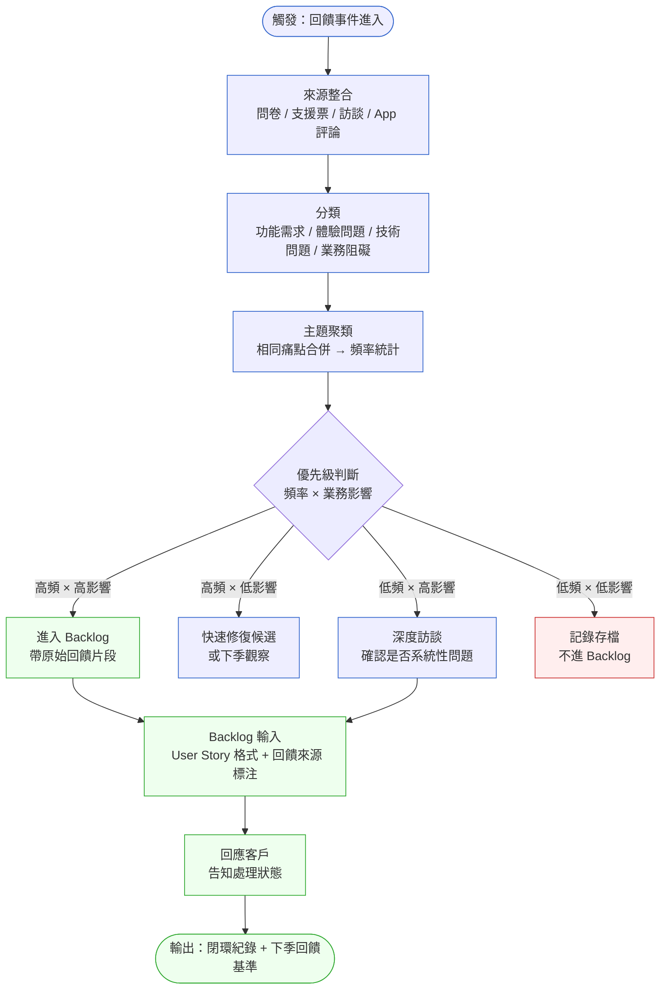
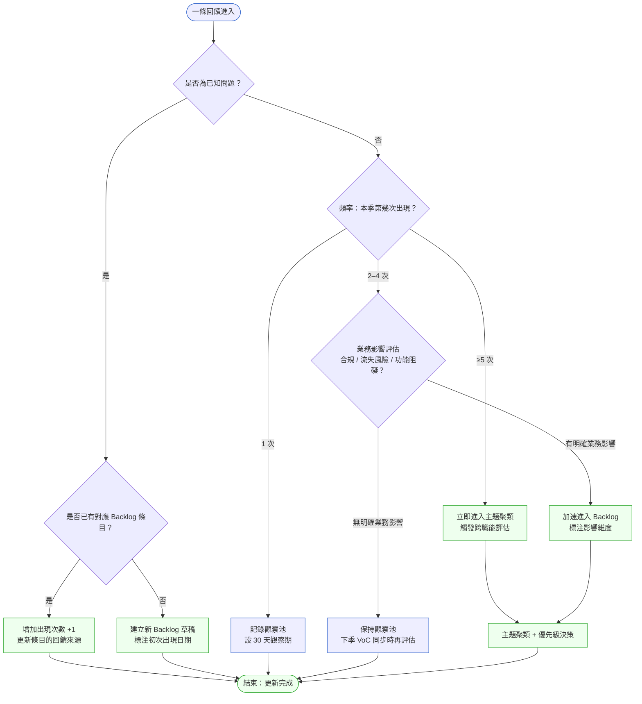

# 第 9 章 | VoC Loop：持續性客戶回饋管理

> **前置閱讀**：[Ch 7 User Research for PM](./ch-07-user-research.md) — 研究蒐集方法的基礎；[Ch 8 Competitive Intelligence](./ch-08-competitive-intelligence.md) — 外部信號的篩選邏輯
> **下游章節**：[Ch 10 Jobs-to-be-Done](./ch-10-jtbd.md) — 把 VoC 主題轉化為底層需求；[Ch 5 Prioritization Frameworks](../part-01-foundation/ch-05-prioritization.md) — 回饋進入 Backlog 後的排序
> **SA/SD 對照**：[SA/SD 第 4 章 需求工程基礎](../../book/part-01-foundations/ch-04-requirements-engineering.md) ⸺ SA 視角關注需求的可實作性與規格完整性；本章關注回饋在行動閉環中的優先順序與政治性，兩者在 Backlog 精煉會議交會。

---

## §9.1 冷觀察

季度規劃前兩天，MedNow 的 PM — 姑且叫她 Mia — 收到了一份 Google Drive 連結。

連結裡是當季 NPS 問卷的 PDF 匯出。封面寫著：**NPS: 57 / 回收率: 40%**。客戶成功（CS）主管已經在群組裡留言：「蠻不錯的，上季才 52。」

Mia 打開那份 74 頁的 PDF，想找點什麼能帶進隔天的規劃會議。第一頁是柱狀圖，橫軸是評分 1–10，縱軸是人數。第二頁開始是 open-text 的逐字稿 — 312 則，長短不一，語言夾雜英文、繁中、簡中。第 38 頁有一則讓她停下來：

> 「上傳病歷的流程每次都要點七步，我的護士已經快放棄了。」

Mia 把這一句截圖，貼到 Slack，標注工程師 Lead。回覆是三個小時後：「這是舊 UI，新版 Q2 有改。」

隔天的規劃會議，Mia 帶著截圖進場。CPO 問：「這是個案還是普遍？另外還有幾個護士在抱怨？有人統計過嗎？」

沒有人有答案。

會議在「等更多數據」的氣氛中結束。那份 PDF 又回到了 Google Drive。

---

三個月後，MedNow 在年度客戶大會上遇到了一件事。五間醫院的護理長，不約而同地提到同一個痛點：「病歷上傳的流程太繁瑣，我的團隊花大量時間在這上面。」這不是新問題。這是那 312 則逐字稿裡出現過 19 次的問題 — 只是沒有人把它算出來，更沒有人把它帶進 roadmap。

CASE-HCR-102 記錄的就是這個場景：**一個有回饋、有數據、卻沒有行動閉環的 VoC 流程**。問卷發了，分數上升了，沒有人知道下一步是什麼。

---

## §9.2 真問題

### 表面需求（What）

表面上看，MedNow 缺少的是「一個更好的 NPS 分析工具」或「一個定期檢視回饋的會議」。這是大多數團隊的第一個修正動作 — 換工具、加流程。

但換了工具之後，那 312 則逐字稿依然沒有人知道該怎麼辦。

### 業務目標（Why）

把它拆開來看，真正的業務問題有兩層：

### ��回饋蒐集與行動決策之間，缺乏轉化機制。
MedNow 每季花資源發問卷、彙整數據，但這些產出（Output）— 問卷分數、逐字稿、回收率 — 從來沒有轉化成可追蹤的成效（Outcome，如特定功能的使用率變化、客戶流失率下降）或影響（Impact，如合約續約率、客戶終身價值）。整個 VoC 流程的終點是一份報告，而不是一個決策。值得注意的是，這個斷點不是因為缺乏資料，恰恰相反 — 資料多到沒人有時間讀完 312 則逐字稿，於是大家都退回去只看封面那個分數。資料越多，轉化越懶。

### ��回饋信號缺乏分級，導致所有資訊等重要、等無人處理。
病歷上傳問題出現 19 次，跟某位客戶抱怨字體太小的問題，在同一份 PDF 裡的地位是相同的 — 都是逐字稿的一行。沒有分類、沒有頻率計算、沒有業務影響評估，PM 在這堆資訊面前無從判斷。當一切看起來同等重要時，人的本能反應是什麼都不做，等一個「更明確的信號」 — 而那個信號，往往就是三個月後客戶大會上的當面投訴。

### 決策瓶頸（Who × When）

這個問題的瓶頸不在工具，也不在數據量。瓶頸在於：**沒有人擁有把回饋轉化為行動的責任，也沒有一個固定的時間節點要求這件事發生。**

更隱蔽的是當時的利害關係人動態。CS 主管認為自己的職責是「把分數收上來、報告趨勢」，分數漲了就是交差，後續排序是 PM 的事；PM 則認為「客戶在抱怨什麼」應該由每天接觸客戶的 CS 來定義優先級。兩邊都把對方當成下一棒，於是回饋卡在交接縫裡。而真正能拍板資源的 CPO，從一開始就不在這條回饋鏈上 — 他只在季度規劃會議的最後一刻才接觸到一張截圖，自然只能問「這是個案還是普遍」，而不是做決策。當拍板者被排除在信號流之外，他能做的就只剩要求「更多數據」。

用責任分工模型 DACI（Driver / Approver / Contributor / Informed，推動者 / 拍板者 / 提供輸入者 / 被通知者）描述當時的狀態：

| 角色 | 當時的現況 | 應有的樣子 |
|---|---|---|
| **D** Driver（推動） | 無，CS 和 PM 都在等對方 | PM 負責把回饋轉化為 Backlog 條目 |
| **A** Approver（拍板） | 隱性地由 CPO 決定，但 CPO 沒被帶進回饋流程 | CPO 或 PM Lead 在固定節奏中確認優先級 |
| **C** Contributor（提供輸入） | CS 提供分數、工程師偶爾看截圖 | CS + 工程師 + 設計師在分類階段提供輸入 |
| **I** Informed（被通知） | 幾乎所有人都不知道其他人在看什麼 | 決策後，相關 stakeholder 收到更新 |

**結論**：MedNow 原本想改善的是 Outcomes（護士操作效率、客戶滿意度），但量的是 Output（NPS 分數）。當 NPS 從 52 升到 57，沒有人知道是哪個行為改變了，也沒有人知道護士的問題有沒有被解決。

這就是 VoC Loop 缺失的核心代價。

---

## §9.3 決策框架

### 圖 A — VoC 回饋循環工作流程



VoC Loop 的本質是一條**轉化管道**，不是蒐集倉。從觸發到閉環的每個步驟，都要有負責人和明確的輸出格式，否則資訊會在某個節點積壓，最終變成 PDF 裡沒人看的第 38 頁。

---

### 圖 B — 回饋優先級決策樹



這棵決策樹解決的是一個常見陷阱：PM 把「第一次看到」等同於「第一次存在」。一條新回饋進入時，先問的不是「重不重要」，而是「這是不是我還不知道的冰山一角」。

---

### 決策表 — VoC 來源整合策略

| 來源類型 | 觸發條件 | 推薦處理做法 | PM 關注點 | 常見錯誤 |
|---|---|---|---|---|
| **NPS / CSAT 問卷** | 週期性（每季或每月） | 逐字稿分類 → 主題聚類 → 頻率排序 | open-text 的主題比分數本身更重要 | 只看分數趨勢，不看逐字稿 |
| **CS 支援票** | 事件驅動（即時） | 標注問題類型 → 週更到 VoC 看板 | 高重複性票種 = 產品缺陷信號 | CS 自行解決，不回報 PM |
| **使用者訪談** | 計畫性（每月 1–2 場） | 逐字記錄 → 引用卡 → 主題分類 | 訪談選取的偏差會影響後續決策 | 只訪問最活躍用戶，忽略沉默用戶 |
| **App Store 評論 / 社群** | 持續監聽（週期抓取） | 情感分析初篩 → 關鍵字觸發人工複查 | 負面評論的爆發時間點與版本對應 | 把星等均值當 KPI，忽略一星評論的語意 |
| **銷售 / BD 帶回的聲音** | 非正式（口耳相傳） | 統一格式紀錄後才進入分類流程 | 銷售的「客戶說」不等於「所有客戶說」 | 直接把銷售聲音升格為需求，不驗證樣本量 |

---

### If-Then 框架：回饋優先級判斷

在把 VoC 主題轉換為 Backlog 優先順序時，以下條件判斷比「感覺重要」更穩定：

- **If** 主題出現頻率 ≥ 本季回饋總量的 5% → **Then** 優先進入 Backlog，附原始回饋樣本（建議 ≥3 條）
- **If** 主題涉及合規（HIPAA、個資法等） → **Then** 無論頻率，直接進入高優先級，知會法務
- **If** 主題對應客戶流失行為（CS 標注客戶已提出取消意向） → **Then** 升級為 P1，由 PM Lead 直接跟進
- **If** 主題與已上線功能相關且出現在上線後 14 天內 → **Then** 視為 launch bug，交工程師確認，不進普通 Backlog 佇列
- **If** 主題僅在特定客戶分層（如免費用戶）出現 → **Then** 分開記錄，不混入付費客戶優先級佇列
- **If** 主題出現 < 3 次且無業務影響 → **Then** 存入觀察池，不立即行動

這個框架的設計意圖是：**把「我覺得」的判斷移到框架設計階段，讓框架在執行時做決定，而不是每次都靠 PM 的直覺**。

---

### VoC 同步節奏建議

在固定節奏建立之前，VoC 流程會依賴個別 PM 的勤勉度，這是不穩定的。一個比較穩的做法是把 VoC 同步嵌入既有的 sprint 節奏：

| 頻率 | 活動 | 參與者 | 輸出 |
|---|---|---|---|
| **週** | CS 票種更新 → VoC 看板同步 | PM + CS 輪值 | 新增主題卡片 |
| **雙週** | Sprint Review 前 VoC 快閃（15 分鐘） | PM + 工程 Lead | 確認是否有回饋呼應當期 Story |
| **月** | 主題聚類 + 優先級評估 | PM + CS + Design | 更新 Backlog 候選清單 |
| **季** | 完整 VoC 分析報告 + 下季規劃輸入 | PM + CPO + CS | Q+1 roadmap 的回饋依據 |

---

## §9.4 踩坑清單

**反模式：分數即結論**

現象：NPS 從 52 升到 57，整個季度的 VoC 工作就宣告「完成」。下游沒有行動，沒有對照組，也沒有任何 Outcome 改變。

根因：KPI 設定在 Output 層（分數），而不是 Outcome 層（使用行為改變）。當分數上升，系統發出的信號是「繼續現在的做法」，但這個信號沒有告訴你為什麼上升、什麼讓它上升。

> 修正方向：在問卷設計階段就配對 follow-up 問題，例如「哪一件事改善了你的工作流程？」讓數字的移動有對應的解釋變數，而不是孤立的趨勢線。

---

**反模式：等問卷，不主動蒐集**

現象：VoC 的唯一來源是每季的 NPS 問卷。中間三個月，PM 對客戶的感受是盲的。一個重大的操作痛點可能在問卷發出的前一個月爆發，但在季度報告裡只剩淡淡的一筆。

根因：把「蒐集回饋」這件事外包給問卷這個工具，而不是建立持續性的信號接收機制。

> 修正方向：把 CS 支援票的週同步、App 評論的關鍵字監聽、每月一場 1-on-1 用戶訪談，納入 PM 的日常節奏。問卷是季度確認，不是唯一來源。

---

**反模式：銷售聲音直通 Backlog**

現象：Sales 從客戶那裡聽到一個需求，直接在 Slack 頻道說「這個功能很重要，客戶下週有會議，能趕嗎？」PM 沒有驗證，直接把這個需求推進 Sprint。

根因：銷售的資訊管道不是 VoC 系統的一部分，沒有標準化的紀錄格式，導致單點聲音被放大。

> 修正方向：設立「回饋入口」規則：所有來自銷售的客戶聲音，需透過固定格式（客戶名、場景描述、頻率估計）進入 VoC 看板，由 PM 評估後才能進入 Backlog。這不是要阻擋銷售的輸入，而是確保它能被客觀比較。

---

**反模式：分類由 CS 決定，PM 接受輸出**

現象：CS 團隊把支援票分為「技術問題」和「功能需求」，PM 每週拿到這個分類結果，直接用來做決策。

根因：分類系統反映的是 CS 的工作流程邏輯，不是產品決策邏輯。「技術問題」和「功能需求」的邊界對 PM 來說通常是模糊的，而且這兩類都可能對應 roadmap 優先級。

> 修正方向：PM 需要參與分類標準的制定，確保分類維度（如「業務阻礙」「體驗摩擦」「合規風險」）能直接對應到 Backlog 的優先級框架。CS 的分類是原始輸入，PM 的再分類才是決策輸入。

---

**反模式：回饋有入口，沒有出口通知**

現象：PM 處理了一批回饋，把高頻問題排進了下季 Sprint，但從來沒有告訴提供回饋的客戶「你說的這件事，我們排進計畫了」。

根因：VoC 流程設計只考慮了「從客戶到產品」的方向，沒有設計「從產品到客戶」的回路。

> 修正方向：在 VoC 流程末端加入「回應客戶」步驟，尤其對已確認進入 Backlog 的主題，透過 CS 通知對應客戶。這不只是禮貌，而是讓下一次問卷的 NPS 有解釋基礎 — 客戶知道自己的聲音被聽到了，才會繼續提供高品質的回饋。

---

## §9.5 交付清單 ⸺ 一頁式 VoC 主題卡模板

VoC 主題卡（VoC Theme Card）是本流程的核心交付物（artifact），把分散的逐字稿轉化為可直接進入 Backlog 精煉的結構化輸入。一張卡對應一個主題，不是一條回饋。設計重點只有一條：**頻率和業務影響分開評分**，強迫評估者區分「很多人提到」和「影響很大」 — 這兩件事不一定同時成立，都值得獨立評估。各欄位的填寫理由與判讀方式見 §9.5.2 田野註記。

````markdown
# VoC 主題卡
> 版本:v0.1 | 撰寫日期:YYYY-MM-DD | 擁有人:{名字}

主題 ID：VoC-{YYYY-Q}-{NNN}
主題名稱：{一句話描述，主語是用戶行為}
發現日期：{YYYY-MM-DD}
來源類型：{問卷 / CS 票 / 訪談 / 評論 / 銷售}

### 頻率
- 本季出現次數：{N} 次
- 涉及客戶數：{N} 家 / 個
- 首次出現日期：{YYYY-MM-DD}

### 代表性原文（≥ 2 條）
1. 「{逐字引用}」— {來源日期，不標客戶名}
2. 「{逐字引用}」— {來源日期}

### 業務影響評估
- 影響維度：{合規 / 流失風險 / 功能阻礙 / 體驗摩擦 / 其他}
- 受影響客戶分層：{付費 / 免費 / Enterprise / 全層}
- 是否有流失信號：{是 / 否 / 未確認}

### 優先級判斷
- 頻率評分（1–5）：{N}
- 業務影響評分（1–5）：{N}
- 優先級建議：{P1 立即 / P2 下季 / P3 觀察 / 存檔}

### 行動欄
- Backlog 條目連結：{連結或「待建立」}
- 負責人：{PM 名稱}
- 客戶回應狀態：{未通知 / CS 已通知 / 已發公告}

### 備註
{任何需要跨職能確認的事項}
````

把它存在 `docs/voc/`，跟程式碼同 repo，跟 README 同層。

---

### §9.5.1 範例：MedNow 病歷上傳主題卡

以下是 MedNow（CASE-HCR-102）在那次客戶大會後，補做的第一張主題卡。這張卡本來應該在問卷逐字稿分析階段就建立，但它遲了三個月。

````markdown
# VoC 主題卡
> 版本:v0.1 | 撰寫日期:2026-02-15 | 擁有人:Mia Chen（PM）

<!-- 為什麼這欄：主題名稱用「角色＋行為後果」格式，讓工程師和設計師立即定位受影響場景 -->
主題 ID：VoC-2025-Q3-019
主題名稱：護士在病歷上傳流程中遭遇過多操作步驟導致放棄
發現日期：2025-08-14（客戶大會現場口述）
<!-- 為什麼這欄：多來源並列說明信號強度，單一來源的主題可信度遠低於跨管道出現的主題 -->
來源類型：銷售 / 面對面訪談（5 位護理長）

### 頻率
- 本季出現次數：19 次（問卷逐字稿 17 次 + 訪談 2 次）
- 涉及客戶數：至少 5 家醫院（實際可能更多）
<!-- 為什麼這欄：首次出現日期揭示問題被忽略多久，本例從 07-03 到 08-14 已延誤 42 天 -->
- 首次出現日期：2025-07-03（問卷逐字稿第一筆）

### 代表性原文（≥ 2 條）
1. 「上傳病歷的流程每次都要點七步，我的護士已經快放棄了。」— 2025-07-08 NPS 逐字稿
2. 「每次更新完病歷都要重新登入確認，這個設計是為了安全嗎？感覺有點過度。」— 2025-07-21 CS 支援票
3. 「我統計過，一個護士每天大概浪費 20 分鐘在這上面。」— 2025-08-14 訪談

### 業務影響評估
- 影響維度：功能阻礙（操作效率）、潛在流失風險
- 受影響客戶分層：Enterprise（醫院）
- 是否有流失信號：未確認，但 3 位護理長提到「在評估其他系統」

### 優先級判斷
- 頻率評分（1–5）：5（本季第 19 高頻主題，Top 10%）
- 業務影響評分（1–5）：4（Enterprise 客戶 + 流失前信號）
- 優先級建議：P1 立即

### 行動欄
- Backlog 條目連結：待建立（目標本週 Sprint Refinement 前完成）
- 負責人：Mia Chen（PM）
- 客戶回應狀態：CS 已在客戶大會當場口頭告知「會跟進」，書面通知待發

### 備註
工程師 Lead 表示「新版 Q2 有改」— 需確認改動是否對應護士的實際操作路徑，
還是只改了 UI 視覺。如果是後者，用戶感受不會改變。
````

這張卡如果在七月第一週就建立，病歷上傳問題有機會在八月的 sprint 裡出現 — 而不是在客戶大會上出現。逐字稿讀了才算讀，讀了要有地方落地。

---

### §9.5.2 田野註記 ⸺ 為什麼每一欄這樣設計

模板各欄位的判讀邏輯，第一次填卡時最容易忽略：

| 欄位 | 為什麼這樣設計 |
|---|---|
| **主題 ID（季前綴 + 流水號）** | 季度前綴讓主題卡可跨季追蹤。流水號本身是一個告警數字 ⸺ 範例的 019 代表本季第 19 個主題，若前 18 個都沒有 Backlog 對應，這個數字就是在提醒你轉化管道塞住了。 |
| **主題名稱（主語是用戶角色 + 行為後果）** | 範例寫「護士…導致放棄」而非「用戶體驗不佳」。主語是「護士」幫助工程師和設計師立即定位受影響角色；「放棄」是可觀察的行為後果，不是「很煩」這種情緒描述。 |
| **首次出現日期** | 這一欄揭示問題被忽略多久。範例中從 2025-07-03 到客戶大會 2025-08-14 是 42 天延遲 ⸺ 這個數字本身就是 VoC 流程健康度的指標。 |
| **是否有流失信號** | 不是「是/否」二選一。範例填「未確認」而非「否」，是刻意保留一個觸發 CS 跟進查核的開口；填「否」會讓早期流失信號被提前關閉。 |

田野註記的價值在於：模板本身保持乾淨可複製，判讀邏輯則集中在這裡，讓第一次接手的 PM 不必從零摸索每一欄的意圖。

---

## §9.6 Recap

讀完本章，應該已經能做到：

- **識別 VoC 流程的斷點**：找出回饋在哪個步驟停止流動（通常是分類後、進入 Backlog 前的空白地帶）。
- **區分來源與頻率**：一條回饋的重量由頻率 × 業務影響決定，不由來源的職級或聲量決定。
- **建立主題卡習慣**：用一張卡聚合同主題的原始回饋，確保逐字稿有地方落地，而不是躺在 PDF 裡。
- **把 VoC 嵌入節奏**：週同步 CS 票、月評估聚類、季報告輸入規劃，讓 VoC 流程不依賴個人勤勉度。
- **設計回路，不只有入口**：告訴客戶他們的聲音去哪了，下一次他們才願意繼續說。

如果先挑一件做，建議是 ⸺ **在下次問卷逐字稿到手後，花兩小時做一次主題聚類，建三到五張主題卡**。這兩小時會改變你看 NPS 分數的方式，也會讓你在下次規劃會議裡有具體的問題可以說。

---

## Cross-References

- **前一章**：[Ch 8 Competitive Intelligence](./ch-08-competitive-intelligence.md) ⸺ 外部信號（競品動態）與內部信號（VoC）的整合判斷
- **下一章**：[Ch 10 Jobs-to-be-Done](./ch-10-jtbd.md) ⸺ 把 VoC 主題聚類後的需求，用 JTBD 框架挖掘底層動機
- **強連結**：[Ch 5 Prioritization Frameworks](../part-01-foundation/ch-05-prioritization.md) ⸺ 主題卡進入 Backlog 後的排序方法
- **強連結**：[Ch 38 Post-Launch Review](../part-06-metrics/ch-38-post-launch-review.md) ⸺ 上線後 VoC 信號的蒐集與解讀
- **SA/SD 對照**：[SA/SD 第 4 章 需求工程基礎](../../book/part-01-foundations/ch-04-requirements-engineering.md) ⸺ SA 視角關注需求的完整性與可追蹤性；本章關注回饋如何在 PM 手上轉化為有行動意義的需求輸入
- **SA/SD 對照**：[SA/SD 第 9 章 流程模型](../../book/part-02-analysis/ch-09-process-modeling.md) ⸺ SA 用流程模型描述系統行為；本章的 VoC 循環圖是 PM 視角的流程模型，兩者在需求規格制定階段交會

<!-- PROPOSED-REFS
glossary:
  - anchor: voc-loop
    name: VoC Loop（客戶回饋循環）
    body: |
      Voice of Customer Loop。指從客戶回饋蒐集到行動決策、再到通知客戶的完整循環流程。
      強調「閉環」：回饋不只是輸入，最終需要回饋到客戶端，確認行動已發生。
  - anchor: voc-theme-card
    name: VoC 主題卡（VoC Theme Card）
    body: |
      VoC 流程的核心 artifact，用於聚合同一主題的原始回饋，包含頻率、業務影響、
      優先級判斷與行動追蹤欄位。一張卡對應一個主題，不是一條回饋。
-->
