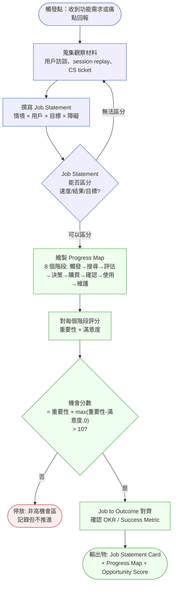
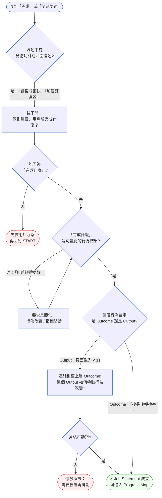
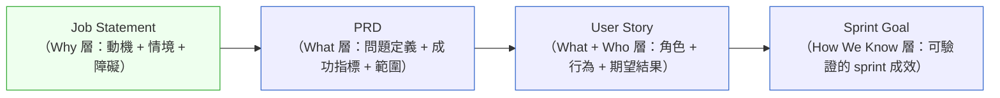

# 第 10 章 | Jobs-to-be-Done：需求背後的需求

> **前置閱讀**：[Ch 7 User Research for PM](./ch-07-user-research.md)、[Ch 9 VoC Loop](./ch-09-voc-feedback-loop.md)
> **下游章節**：[Ch 11 Writing Specs That Engineers Trust](./ch-11-executable-specs.md)、[Ch 13 MVP Design](./ch-13-mvp-design.md)
> **SA/SD 對照**：[SA/SD Ch 4 需求工程基礎](../../book/part-01-foundations/ch-04-requirements-engineering.md) ⸺ SA 視角關注需求的可實作性與一致性驗證；本章關注需求背後的動機結構與 Job（任務）的層次辨識。
> **延伸參考**：[Ch 3 Product Vision & OKR](../part-01-foundation/ch-03-product-vision-okr.md)

---

## §10.1 冷觀察

2025 年 Q2 的 sprint review（衝刺檢視會議），QuickBuy 的會議室。CTO 把投影片切到那張圖，停了一拍才開口：行動搜尋頁的 P75 搜尋回應時間，從 1.8 秒降到 0.9 秒——整整快了一倍。

掌聲很大。

三個 sprint、連續兩週的工程師加班、快取架構從頭翻修、CDN 節點臨時擴倉——這一刻全都兌現了。PM 當場把這張截圖釘上 Jira 版面頂端，標題打了一行字：「搜尋速度里程碑 ✅」。

四週後，Q2 數字出來。行動端搜尋後的轉換率：0.23%。和 Q1 一模一樣，連誤差範圍都沒走出去。

> 「速度提升了 40%，轉換率怎麼一點都沒動？」

月報會議上，CPO 把這句話丟到桌面中央。PM 張了張嘴，沒有答案。當晚回去翻 session replay（使用者操作錄影回放），一段行為反覆出現，看一次刺一次：使用者把搜尋結果第一頁滑到底，停了兩秒，關掉 app。不是嫌慢——是滑完了，仍然不知道要買什麼。

接下來的一週用戶訪談，把問題釘死了。受訪者沒有一個人說「搜尋太慢」。他們說的是另一件事：「我打開 QuickBuy，是想在下班前那三分鐘決定今晚給小孩買什麼。可我每次都搜了十幾個關鍵字、滑了半個鐘頭，最後什麼都沒買，乾脆關掉。」

速度從來不是瓶頸。決策焦慮才是。

而這個 Job（用戶想完成的任務），從頭到尾沒有出現在任何一張需求單上——因為沒有人問過那句最該問的話：「用戶打開這個 app，真正想完成的是什麼？」三個 sprint 燒完，團隊交付的，是一個「更快地」讓人無法決定的搜尋引擎。

---

## §10.2 真問題

把 QuickBuy 這個案例拆開來看，CASE-ECM-105 的失敗不是工程問題，也不是執行問題，而是一個認知層次的錯置。

### 三層拆解

### 表面需求（What）

「讓搜尋更快。」

這是使用者和 CS team（客服團隊）回報最多的聲音。每季用戶滿意度問卷裡，「搜尋速度」是前三大抱怨項之一。

### 業務目標（Why）

「提升行動端搜尋後轉換率，從 0.23% 到 0.40%。」

這是 PM 在 OKR 上寫的。但從表面需求跳到這個 OKR 時，中間有一步沒做：**搜尋速度慢，是轉換率低的真正原因嗎？**

### 決策瓶頸（Who × When）

「在 Q2 roadmap 鎖定之前，沒有人被授權停下來問這個問題。」

這才是真正的根因。PM 已經知道 OKR 目標是轉換率，也知道「搜尋速度」是表面症狀，但在 sprint 規劃時，時間壓力讓這個假設沒有被驗證就進了排期。沒有人的 DACI 角色是「暫停這個方向」。

### Outputs / Outcomes / Impact 的混淆

這個案例很典型地呈現了三個層次的錯置：

| 層次 | QuickBuy 實際發生的 | 原本應該量的 |
|---|---|---|
| **Outputs（產出）** | P75 搜尋回應時間降到 0.9 秒 | ← 確實達成 |
| **Outcomes（成效）** | 搜尋後轉換率：0.23%（無變化） | 搜尋後轉換率 ↑ |
| **Impact（影響）** | 行動端 GMV 無明顯成長 | 行動端 GMV ↑ 15% |

PM 在 sprint review 上展示了 Outputs，卻以為自己在往 Outcomes 走。這不是個人判斷失誤，而是一個框架缺口：**如果沒有一個機制把 Job Statement（任務陳述）鎖在 Outcome 層次，速度指標這類容易量化的 Output 就會自然浮上來佔據焦點。**

### JTBD 框架填補的缺口

Jobs-to-be-Done（JTBD，待完成的任務）框架的核心問題只有一個：

> 「當 {情境}，{用戶} 想要 {完成什麼}，但目前的障礙是 {什麼}。」

這個句子迫使 PM 從 Output（功能速度）跳到 Job（決策完成）。QuickBuy 的 Job 如果用這個框架寫出來：

> 「當使用者在下班後的碎片時間打開 app，想要在三分鐘內完成一個購買決策，但目前因為選項過多、沒有個人化引導而陷入選擇疲勞。」

四段式結構之所以能阻斷 Output/Outcome 混淆，關鍵在於每個填槽都迫使寫作者換一個認知位置。**「情境」槽**把 Job 錨定在一個具體的觸發時刻——「下班後短暫碎片時間」而不是「使用者使用搜尋功能時」——時刻的具體性讓描述系統功能變得語意怪異，因為系統功能不存在於某個時刻，它存在於所有時刻。**「結果」槽**要求寫出以用戶行為為單位的成果；一旦試圖填入「P75 < 1s」，這個數字的主語立刻暴露是系統而非用戶——這不是個人判斷的過濾，而是句子的語法結構把它擋掉的。**「障礙」槽**是最強的檢查點：它逼著 PM 說清楚「什麼東西擋在用戶和結果之間」，並且要能在訪談或行為數據中找到對應的證據；如果提速是解法，障礙就必須是「速度不夠快」，但 session replay 指向的是「選項過多、缺乏引導」——解法與障礙的描述對不上，矛盾立即顯現。沒有這個四格句型，「讓搜尋更快」這句話在規劃語境裡永遠停在 Output 層，因為沒有任何語法槽逼問「用戶的行為結果是什麼」或「哪個障礙還沒消除」。回到 QuickBuy：把四個槽填完之後，「搜尋速度」同時卡在「結果」與「障礙」兩槽——它不是用戶想抵達的行為結果，也不是擋住決策完成的真正障礙——框架讓誤排期在 sprint planning 鎖定之前就變得可見。

這個 Job Statement 寫出來的瞬間，「搜尋速度」的優先順序就必須被重新評估，因為它根本沒有碰到 Job 的真正障礙。

### 決策責任的缺位

DACI（Driver / Approver / Contributor / Informed 決策責任分工）在這個案例的空缺：

| 角色 | 應該是誰 | 實際發生 |
|---|---|---|
| **Driver（推動決策）** | PM | PM 推動了方案，但沒有推動假設驗證 |
| **Approver（最終拍板）** | CPO | CPO 在月報才知道結果 |
| **Contributor（提供輸入）** | UX Research、Data | UX Research 的訪談在 sprint 啟動後才安排 |
| **Informed（被通知）** | Engineering、CS | Engineering 在 sprint 開始時才知道目標是轉換率 |

當 Approver（CPO）在執行前沒有批准假設，而 Contributor（UX Research）在執行中才介入，JTBD 就退化成了一個事後解釋，而不是一個事前框架。

---

## §10.3 決策框架

### Job 的三個層次：不只有功能性需求

在提取 Job Statement 之前，先要認識 Job 本身的結構。Christensen 的原始框架把 Job 分為三個相互嵌套的層次：

| Job 層次 | 定義 | QuickBuy 例子 |
|---|---|---|
| **功能性 Job（Functional）** | 用戶想要完成的具體任務 | 在 15 分鐘內選定並下單一件商品 |
| **情感性 Job（Emotional）** | 用戶在完成任務時想要感受什麼 | 感覺自己做了一個聰明且不後悔的決定 |
| **社會性 Job（Social）** | 用戶希望在他人眼中如何被看待 | 被家人認為是一個「照顧家庭」的人 |

**PM 最常犯的錯誤**：只抓功能性 Job，忽略情感性和社會性層次。這會導致兩類問題：
1. 解法只解決了「能不能完成」，沒有解決「完成後感覺如何」——功能上線但用戶不愛用。
2. 用戶滿意度調查分數不如預期，因為 CSAT 題目衡量的是功能性完成度，沒有觸及情感焦慮。

**判斷哪個層次最關鍵的方法**：在用戶訪談中追問「如果這個問題消失了，你最想要什麼感覺？」情感性 Job 通常是轉換率卡住的真正原因——功能做到了，但焦慮沒消除。

### Job 的受眾範圍：通用型 vs 細分型

一個 Job 屬於哪種範圍，直接決定解法的定制化程度：

| 類型 | 定義 | 辨別方式 | 解法方向 |
|---|---|---|---|
| **通用型 Job** | 多數用戶在相似情境都有這個 Job | 訪談 8–10 人都出現相同行為模式 | 平台級功能、默認設定 |
| **細分型 Job** | 特定客群在特定情境才有這個 Job | 只有某個用戶段（如：親子家庭採購者）反映 | 個人化功能、可選模組 |
| **邊緣型 Job** | 少數用戶有，但重要性評分高 | 訪談覆蓋率低，但呼聲強烈 | 先調研再決定是否投入 |

QuickBuy 的「三分鐘決策」Job 屬於**細分型**：觸發條件是「碎片時間 + 模糊購買意圖」的組合，不是全部用戶都有。這意味著解法不能是改變全站搜尋邏輯，而應該是針對這個情境的分流入口（如：首頁的「快速選一件」引導流程）。

### Job 萃取工作流程



這個工作流程有三個關鍵關卡：

1. **觀察材料要在 Job Statement 之前**。直接從痛點跳到 Job Statement，容易把使用者的措辭當成 Job。「搜尋太慢」是措辭，不是 Job。
2. **Progress Map 不是功能清單**。進度地圖描述的是用戶試圖完成 Job 的整個歷程，與系統功能一對一對應的思維在這裡無效。
3. **機會分數是停損機制**。如果分數低，就停在這裡，不推進到 JAM 步驟，避免把低機會區的 Job 塞進 roadmap。

### 從訪談紀錄到 Job Statement：提取程序

這是最常被跳過、也最容易出錯的一步。以下是一段實際訪談節錄，展示如何逐步萃取：

**原始訪談片段（QuickBuy 用戶，代號 U-07，35 歲，雙薪家庭，兩個孩子）：**

> PM：「你通常什麼時候會打開 QuickBuy？」
>
> U-07：「大概下班在捷運上，或者晚上孩子睡了之後。」
>
> PM：「然後呢？你會做什麼？」
>
> U-07：「就是想說看看有沒有什麼可以買。也不是說特別缺什麼，就是……感覺應該要補貨了。」
>
> PM：「通常結果是？」
>
> U-07：「大部分都沒買。滑了一堆，然後就關掉了。不知道要買什麼。」
>
> PM：「是什麼讓你關掉的？」
>
> U-07：「就是……選太多了。每個看起來差不多，我不知道哪個比較值。然後小孩叫我，我就先去了，之後也忘了。」

**四步萃取流程：**

| 步驟 | 操作 | 從上面訪談萃取的結果 |
|---|---|---|
| **1. 辨識情境** | 找出觸發這個行為的時間、地點、前置狀態 | 下班通勤 / 睡前；手機；有模糊採購意圖但沒有具體目標 |
| **2. 辨識症狀** | 找出用戶用來描述問題的詞彙（這是措辭，不是 Job） | 「選太多了」「不知道要買什麼」「不知道哪個比較值」 |
| **3. 推論障礙** | 問：如果這個症狀消失了，用戶能完成什麼？ | 消除選擇焦慮 → 能在注意力被打斷之前完成購買決定 |
| **4. 寫 Job Statement** | 套入「情境 × 用戶 × 結果 × 障礙」公式 | 見下方 |

**萃取結果：**

> 「當在下班或睡前的短暫碎片時間打開 QuickBuy，有模糊採購意圖的家庭採購者想要在注意力被打斷之前完成一個購買決定，但目前因為選項過多且缺乏個人化比較引導，陷入選擇疲勞而放棄。」

**萃取後的驗證問題（三選一即可停止往下挖）：**

- 這個 Job 在情境消失後是否仍然存在？（如果不是，情境描述不夠具體）
- 多位用戶是否呈現相同的行為模式？（少於三位則先擴大訪談樣本）
- 障礙的消除是否能直接帶動可量化的行為改變？（無法量化則 Job 定義太模糊）

### Job 層次辨識決策樹



這棵決策樹的核心是**兩次強制停頓**：第一次在「能否回答完成什麼」，第二次在「Output 到 Outcome 的連結可否驗證」。

### 決策表：JTBD 情境對應做法

| 情境 / 觸發條件 | 推薦做法 | PM 關注點 | 常見錯誤 |
|---|---|---|---|
| **用戶明確反映特定功能缺失**（如「沒有深色模式」） | 先問：缺這個功能，用戶想完成的 Job 是什麼？ | 是否有多個用戶有相同 Job，還是只是偏好差異？ | 把偏好（preference）誤認為 Job |
| **CS ticket 量突然上升**（關鍵字：「找不到」「不知道怎麼」） | 做 Progress Map：哪個階段摩擦最大？ | 摩擦是「障礙太多」還是「目標不清楚」？ | 只修介面，沒有處理決策焦慮 |
| **競品上了新功能**（內部壓力：「我們也要做」） | 做 Job Comparison（任務對照）：競品這個功能服務的是哪個 Job？ | 我們的用戶有相同的 Job 嗎？還是不同客群？ | 功能對標而不是 Job 對標 |
| **轉換率/留存率下降，原因不明** | 用 Opportunity Score 掃全 Progress Map | 哪個階段重要性高但滿意度低？ | 直接假設某個功能是原因 |
| **新產品 / 新功能從零開始探索** | 先做 Contextual Inquiry（情境訪查），再寫 Job Statement | Job 的情境（When/Where）描述得是否具體？ | 在沒有觀察材料的情況下直接寫 Job Statement |
| **功能上線後的成效回顧 / 迭代週期啟動** | 回去重算上線前那批 Job 的機會分數，比對「預期 Outcome」vs「實際 Outcome」 | 是 Job 抓錯了，還是解法沒打中 Job 的障礙？ | 把「指標沒動」歸因於執行不力，而不回頭檢查 Job 本身是否成立 |

### Opportunity Score 評分邏輯與校準

Opportunity Score（機會分數）公式來自 Tony Ulwick 的 Outcome-Driven Innovation：

```
機會分數 = 重要性 + max(重要性 - 滿意度, 0)
```

| 重要性（1–10）| 滿意度（1–10）| 機會分數 | 解讀 |
|---|---|---|---|
| 9 | 3 | 9 + (9-3) = **15** | 高機會：重要且不滿意 |
| 9 | 8 | 9 + (9-8) = **10** | 臨界：重要但已有解法 |
| 5 | 2 | 5 + (5-2) = **8** | 中等：不夠重要即使不滿意 |
| 9 | 9 | 9 + 0 = **9** | 市場滿足：不需介入 |
| 3 | 8 | 3 + 0 = **3** | 低機會：不重要且已滿足 |

**為什麼門檻設在 ≥12？** 這個數字不是任意的——它對應的是「重要性 ≥ 8 且滿意度 ≤ 4」的組合區間。實務上這個組合代表：用戶強烈在乎、現有解法遠遠不夠，且沒有競品已滿足這個缺口。低於 12 的 Job 通常意味著要嘛重要性不夠高（低於 7，競品已在做就追不上），要嘛現有滿意度已有基本支撐（> 6，繼續優化邊際效益遞減）。**校準這個門檻的方法**：在你的產品裡找一個已知做對的功能（上線後指標確實移動），回算它的 Opportunity Score——如果低於 12，你的門檻就需要往下調。

**Opportunity Score 常見誤分陷阱：**

| 錯誤模式 | 現象 | 根因 | 修正 |
|---|---|---|---|
| **CSAT 偏高陷阱** | 滿意度評 8，但轉換率低 | CSAT 問的是「滿意嗎」而不是「能完成嗎」 | 把滿意度問題改為行為完成率：「你上次成功完成 [Job] 的時間是？」 |
| **重要性膨脹** | 受訪者把所有功能都評 9–10 | 相對重要性沒有錨點 | 加入「如果你只能保留三個功能，哪三個？」的強迫排序題 |
| **情境混淆** | 同一個功能在不同情境下評分差異極大 | 沒有控制情境變數 | 在問卷前讓受訪者先選定自己最近一次使用情境，再評分 |

**If-Then 框架：Opportunity Score 排期決策**

- **If** 機會分數 ≥ 12 → **Then** 高優先級，快速移到 JAM 步驟，確認 OKR 連結。
- **If** 機會分數 10–11 → **Then** 臨界區，先確認現有解法的真實滿意度，避免滿意度被高估。
- **If** 機會分數 < 10 → **Then** 停放。不進 roadmap，但保留在 Progress Map 中持續追蹤。
- **If** 重要性 < 5，無論滿意度多低 → **Then** 不是你的 Job，可能是邊緣客群或少數偏好。
- **If** 機會分數高但 Job Statement 無法量化 → **Then** 先做一輪驗證性訪談，再排期。

**QuickBuy 的案例回算**：「3 分鐘內完成購買決策」Job 的重要性 8.5 / 滿意度 3.2，機會分數 ≈ 13.8（高機會區）。「搜尋速度」Job 的重要性 7.0 / 滿意度 4.5，機會分數 ≈ 9.5（低於門檻）。如果這個評分在 Q1 規劃前就存在，Q2 的資源就不會投進速度優化。

### 從 Job 到執行：Job → PRD → User Story → Sprint Goal 的傳遞鏈

JTBD 最常見的斷鏈點不是分析階段，而是**從分析到執行的翻譯**。Job Statement 寫完之後，它必須以正確的形式出現在下游文件，否則工程師仍然以功能為單位思考。



**每個層次的翻譯規則：**

| 文件 | Job Statement 的哪個部分進來 | 翻譯後的形式 | QuickBuy 例子 |
|---|---|---|---|
| **PRD** | 情境 + 障礙 → 問題定義；結果 → 成功指標 | 「本 PRD 解決的問題是：[障礙]。成功標準是：[可量化結果]。」 | 問題：選擇疲勞。成功：Cart-Add Rate 0.23% → 0.45% |
| **User Story** | 用戶角色 + 功能性 Job → As / When / I want / So that | As [角色], When [情境], I want [功能動作], So that [Job 層的結果] | As 行動端採購者, When 我在碎片時間打開 app, I want 看到適合我的三個推薦組合, So that 我能在三分鐘內決定並下單 |
| **Sprint Goal** | 障礙消除 → 可觀察的 sprint 成效 | 「本 sprint 結束時，[用戶行為]應該發生改變，量化指標是：[數字]。」 | 本 sprint 結束時，搜尋後的「重複搜尋率」下降 20%，Cart-Add Rate 從 0.23% 到 0.30% |

**關鍵判斷**：Sprint Goal 不寫功能，只寫行為改變和指標。如果你的 Sprint Goal 是「完成個人化推薦模組」，它描述的是 Output；如果是「搜尋後 Cart-Add Rate 提升 30%」，它描述的是 Outcome——這是判斷 Job 有沒有真正進入執行層的最快檢查方式。

---

## §10.4 踩坑清單

**反模式：把使用者的措辭當成 Job Statement**

現象：用戶說「搜尋太慢」，PM 直接把「讓搜尋更快」寫進 OKR，三個 sprint 達成，轉換率無變化。

根因：使用者在回饋問卷或 CS ticket 中描述的是**症狀**，而症狀是最容易量化、最容易推進的東西。PM 在時間壓力下習慣抓可執行的材料，沒有往下問一層。

> 修正方向：每一條用戶回饋在進排期前，先加一個問題：「如果這個問題消失了，用戶接下來能做到什麼？」這個問題能強迫 PM 從症狀跳到 Job。

---

**反模式：Progress Map 畫成功能地圖**

現象：PM 做了「用戶旅程」，但旅程的每個節點是系統功能（搜尋頁、商品頁、購物車、結帳），而不是用戶試圖完成的動作。評估結果：哪個頁面滿意度最低，就優化哪個頁面。

根因：功能地圖是從產品出發的視角；Progress Map 是從 Job 出發的視角。前者描述「系統提供什麼」，後者描述「用戶在嘗試什麼」。兩者長得很像，容易混淆。

> 修正方向：Progress Map 的每個節點應該是用戶的動詞（「評估選項」「縮小候選範圍」「確認決策可信度」），不是系統的名詞（「商品詳情頁」「評論區」「推薦模組」）。

---

**反模式：Opportunity Score 拿來做績效排名，而非停損機制**

現象：PM 對整個 backlog 的 Job 評分後，把前五名全部推進 roadmap，因為「都有高分，都值得做」。

根因：Opportunity Score 是一個**停損工具**，目的是把低機會區的 Job 篩掉，而不是把所有高分 Job 排隊做完。即使分數都高，團隊還是需要依據資源、技術複雜度、市場時機做最終選擇。

> 修正方向：Opportunity Score 只做一件事：排除進入 roadmap 的資格。通過門檻後，排序工作交給 [Ch 5 Prioritization Frameworks](../part-01-foundation/ch-05-prioritization.md)。

---

**反模式：JTBD 變成一次性的前置研究，不回滾**

現象：PM 在產品初期做了一輪 JTBD 研究，寫了很好的 Job Statement，放進 Notion。六個月後推出功能，上線後效果不如預期，但沒有人回去更新 Job Statement 或重新評分。

根因：Job 不是靜態的。用戶情境變化（競品改變市場期望、用戶習慣遷移、外部事件），Job 的重要性和滿意度分數也會移動。把 JTBD 當成一次性工具，等於相信六個月前的快照等同今天的市場。

> 修正方向：把 Progress Map 的機會評分接進 [Ch 9 VoC Loop](./ch-09-voc-feedback-loop.md) 的季度回顧節奏。每一次 VoC 回顧，更新三到五個最關鍵 Job 的滿意度分數。

**Job 刷新建議節奏：**

| 觸發條件 | 刷新範圍 | 時間成本 |
|---|---|---|
| 每季度 VoC 回顧 | 更新前三名 Job 的滿意度分數 | 4 小時（含調查設計 + 分析） |
| 競品發布重大功能 | 重新評估受影響 Job 的重要性 | 2 小時（含 Job Comparison） |
| 功能上線後 4 週 | 比對「預期 Outcome」vs「實際 Outcome」，判斷 Job 是否成立 | 3 小時（含數據分析） |
| 用戶研究出現新的行為模式 | 重新萃取 Job Statement，評估是否有新 Job 出現 | 1 天（含訪談材料整理） |

---

**反模式：Job Statement 寫在 PM 的電腦裡，工程師從來沒看過**

現象：PM 做了完整的 JTBD 研究，Job Statement Card 格式漂亮，但在 sprint planning 時給工程師看的是 User Story，沒有帶入 Job 的脈絡。工程師在做技術決策時仍然以功能為單位思考。

根因：JTBD 如果只停留在 PM 的文件層，它影響的只有 PM 的優先順序決策，不會影響工程師的設計選擇。一個工程師如果知道 Job 是「三分鐘決策」，他在設計搜尋快取策略時可能就會多考慮「個人化推薦快取」而不只是「結果頁面快取」。

> 修正方向：把 Job Statement 寫進 Sprint Goal，而不是只放在 PRD 的背景說明段。Sprint Goal 是工程師每天最常看到的一句話。

---

**反模式：從功能驅動切換到 Job 驅動，卻沒有過渡計劃**

現象：PM 宣布「我們要用 JTBD 框架重新整理 backlog」，但工程師和設計師習慣了用 User Story 和功能規格溝通，切換後開會效率下降，大家不知道如何評估 Job 的優先順序。

根因：框架切換是一個組織變革，不只是工具替換。如果沒有共同語言和過渡期，JTBD 會被看作「PM 又引進了一個新方法論，過幾個月就會換掉」。

> 修正方向：**三步過渡法**——
> 1. **第一個 sprint**：繼續用現有 User Story 格式，但在每個 story 頂部加一行「Job: [Job Statement]」，不改流程，只加一行。
> 2. **第二到三個 sprint**：在 sprint planning 開始前花十分鐘走一次「這個 sprint 解決的 Job 是什麼？機會分數是多少？」，讓全團隊習慣這個問題。
> 3. **第四個 sprint 起**：把 Job 帶進 Sprint Goal，開始以行為改變（而非功能完成）作為 sprint 成效的主要衡量維度。

---

## §10.5 交付清單 ⸺ 一頁式 Job Statement Card 模板

每次 JTBD 萃取工作應產出以下 artifact：

- [ ] **Job Statement Card**（一張，一個 Job）
- [ ] **Progress Map**（8 階段，每格含重要性 / 滿意度評分）
- [ ] **Opportunity Score 表**（全部 Job 的彙總排序）
- [ ] **DACI 確認**（誰 Approve Job 優先順序的最終版本）

**Job Statement Card 空白模板：**

````markdown
# Job Statement Card

> 版本:v0.1 | 撰寫日期:YYYY-MM-DD | 擁有人:{名字}

### Job ID
{CASE-DOMAIN-NNN}_{JTBD-NNN}

### Job Statement
當 {情境描述}，
{用戶角色} 想要 {完成的結果（動詞+可量化標準）}，
但目前 {主要障礙}。

### Job 層次
| 層次 | 描述 |
|---|---|
| 功能性 Job | {用戶想完成的具體任務} |
| 情感性 Job | {用戶想感受什麼} |
| 社會性 Job | {用戶希望在他人眼中如何被看待（如適用）} |

### 受眾範圍
- [ ] 通用型（多數用戶在相似情境都有）
- [ ] 細分型（特定客群才有）
- [ ] 邊緣型（少數用戶，需要進一步調研）

### 觸發情境（Trigger Context）
- 時間：{何時觸發這個 Job？}
- 地點：{在哪裡？裝置？環境？}
- 前置狀態：{用戶進入這個 Job 前是什麼狀態？}

### 成功標準（Definition of Done for this Job）
- 行為改變：{用戶完成 Job 後，會做什麼不同的事？}
- 量化指標：{對應的 Outcome 指標是什麼？基線 vs 目標}

### Opportunity Score
| 評估維度 | 分數（1-10）|
|---|---|
| 重要性 | {X} |
| 目前滿意度 | {X} |
| **機會分數** | **{重要性 + max(重要性-滿意度, 0)}** |

### 下游連結
| 文件 | 連結 / 說明 |
|---|---|
| PRD | {連結或「尚未建立」} |
| Sprint Goal | {本 sprint 的成效陳述} |
| User Story | {代表性 story 的 Jira ID} |

### DACI
| 角色 | 姓名 / 職稱 |
|---|---|
| Driver | {PM 名字} |
| Approver | {CPO / 產品主管} |
| Contributor | {UX Research / Data / Engineering} |
| Informed | {CS / Sales} |

### 關聯 OKR / Outcome
{連結到哪個 OKR，預期如何影響 Outcome}

### 建立日期 / 下次回顧日期
{YYYY-MM-DD} / {下次 VoC 回顧日期，通常下一季}
````

把它存在 `docs/product/jtbd/`，跟程式碼同 repo，跟 README 同層。

---

### §10.5.1 範例 A：QuickBuy 行動端決策焦慮 Job（失敗後重建）

CASE-ECM-105 在 Q2 事後回顧時補出了這張卡片。如果這張卡在 Q1 規劃前就存在，「搜尋速度」不會是 Q2 的首要投資。

````markdown
# Job Statement Card

> 版本:v0.1 | 撰寫日期:2026-02-15 | 擁有人:Amy Chen（PM）

### Job ID
<!-- 為什麼這欄：讓這張卡可以在跨 sprint、跨季度的文件中被追蹤；
     沒有 ID 就容易在重新命名時失去歷史脈絡。 -->
CASE-ECM-105_JTBD-001

### Job Statement
<!-- 為什麼這欄：「情境 × 角色 × 結果 × 障礙」四件套缺一不可；
     少了「情境」，Job 就變成永遠成立的願望清單。 -->
當在下班後短暫的碎片時間（15 分鐘內）打開 QuickBuy，
行動端購物用戶（日常消費品採購者）想要在三分鐘內完成「今晚要買什麼」的決策，
但目前因為搜尋結果過多、缺乏個人化引導，陷入選擇疲勞而放棄。

### Job 層次
| 層次 | 描述 |
|---|---|
| 功能性 Job | 在 15 分鐘內選定並加入購物車至少一件商品 |
| 情感性 Job | 感覺自己做了一個聰明且不後悔的決定，而不是隨便亂選 |
| 社會性 Job | 被家人認為是一個有在照顧家庭日常需求的人（隱性驅動力） |

### 受眾範圍
- [ ] 通用型
- [x] 細分型（觸發條件是「碎片時間 + 模糊採購意圖」的組合，不是全部用戶都有）
- [ ] 邊緣型

細分群體：日常消費品採購者，尤其是雙薪家庭的主要採購決策者（18:00–22:30 為主要使用時段）。

### 觸發情境（Trigger Context）
- 時間：下班通勤（18:00–19:30）或家中睡前（21:00–22:30）
- 地點：行動裝置（iOS / Android），單手操作，注意力分散
- 前置狀態：用戶有模糊的採購意圖（「要補貨了」「想買個什麼犒賞一下」）
             但尚未確定具體商品

### 成功標準（Definition of Done for this Job）
- 行為改變：用戶在第一次搜尋後三分鐘內到達購物車（不跳出、不重複搜尋）
- 量化指標：行動端搜尋後購物車添加率（Cart-Add Rate）
            基線：0.23% → 目標：0.45%（Q3 末）

### Opportunity Score
<!-- 為什麼這欄：沒有這個評分，PM 容易把「聽起來重要的 Job」全部推進 roadmap；
     強制打分讓優先順序有數字依據。 -->
| 評估維度 | 分數（1-10）|
|---|---|
| 重要性 | 8.5 |
| 目前滿意度 | 3.2 |
| **機會分數** | **13.8** |

機會評分說明：8.5 + (8.5 - 3.2) = 13.8，屬於高機會區（> 12）。
對照組「搜尋速度」Job：重要性 7.0 / 滿意度 4.5 / 機會分數 9.5（低於門檻，應被停放）。

### 下游連結
| 文件 | 連結 / 說明 |
|---|---|
| PRD | docs/product/prd/q3-decision-assist.md |
| Sprint Goal | 「本 sprint 結束時，搜尋後重複搜尋率下降 20%，Cart-Add Rate 從 0.23% 到 0.30%」 |
| User Story | JIRA-1042（個人化推薦 Banner）、JIRA-1043（快速選單入口） |

### DACI
| 角色 | 姓名 / 職稱 |
|---|---|
| Driver | Amy Chen（PM） |
| Approver | David Liu（CPO） |
| Contributor | UX Research（Sophia Wang）、Data（Kevin Tsai） |
| Informed | CS Team、Marketing |

### 關聯 OKR / Outcome
Q3 OKR：「行動端 GMV 提升 20%」
關鍵結果：行動端搜尋後 Cart-Add Rate 達到 0.45%
本 Job 直接對應此 KR；「搜尋速度」優化是 Output，不是 Outcome。

### 建立日期 / 下次回顧日期
2025-07-10（Q2 事後補建） / 2025-10-01（Q4 VoC 回顧）
````

---

### §10.5.2 範例 B：SaaS 工具的 Onboarding Job（成功應用案例）

這個案例來自 CASE-SAS-116，一個 B2B 專案管理 SaaS 產品（TaskFlow），展示 JTBD 在**不同產品域**的應用，以及正確使用框架時的結果。

**背景**：TaskFlow 的 14 天試用期轉換率卡在 12%，比同類競品低 8 個百分點。初始假設是「功能不夠多」，但 PM 在做 JTBD 分析後發現問題完全不同。

**訪談萃取過程（三輪，18 位試用用戶）：**

反覆出現的行為模式：用戶在試用第三天前後放棄，而不是因為找不到功能，而是因為「不知道這個工具能幫我完成什麼」——他們看到了功能，但不知道哪個 Job 它能服務。

萃取出的 Job Statement：

> 「當新加入的試用用戶完成帳號設定後，想要在第一個工作日結束前確認『TaskFlow 能讓我的團隊比現在的工具更省力』，但目前因為 onboarding 流程是功能展示而非情境引導，用戶無法把功能對應到自己的工作場景。」

**機會分數**：重要性 9.0 / 滿意度 2.8 → 機會分數 = 9 + (9-2.8) = **15.2**（高機會）

**解法方向**（由 Job Statement 推導，不是由功能清單推導）：

| Job 的障礙 | 對應解法（從 Job 角度） | 不做什麼（功能清單思維會做的） |
|---|---|---|
| 功能展示 vs 情境引導 | Onboarding 改為「選擇你的主要使用情境」→ 展示對應的模板 | 加更多功能介紹的影片 |
| 第一天無法看到「省力」的證明 | 引導用戶在第一個工作日完成一個真實任務，並顯示完成時間 vs 舊工具估計時間 | 推廣功能試用獎勵 |

**結果（上線後 8 週）**：14 天試用期轉換率從 12% 提升到 19%，「功能覆蓋率」沒有任何變化——問題從頭到尾不是功能，是 Job 的情境引導。

這個案例和 QuickBuy 呈現了 JTBD 的兩種不同用法：QuickBuy 是**事後診斷**（發現錯了才補建）；TaskFlow 是**事前設計**（用 JTBD 決定解法方向，避免錯誤的功能投入）。兩者的 Opportunity Score 都很高，差別在 TaskFlow 的 PM 在排期前就做了 Job 層次的分析。

---

## §10.6 Recap

讀完本章，你應該已經能做到：

- [ ] 區分使用者的**措辭**（症狀）、**功能需求**（Output）與真正的 **Job**（Outcome 層次的行為目標）
- [ ] 識別 Job 的三個層次（功能性 / 情感性 / 社會性），並判斷哪個層次是解法的關鍵槓桿
- [ ] 從訪談紀錄執行四步萃取程序，把原始素材轉化為可驗證的 Job Statement
- [ ] 判斷 Job 的受眾範圍（通用型 / 細分型 / 邊緣型），並以此決定解法的定制化程度
- [ ] 用 Opportunity Score 做停損決策，並能識別評分的三個常見誤分陷阱
- [ ] 把 Job Statement 翻譯成 PRD 問題定義、User Story 的 So that 層、Sprint Goal 的行為改變陳述
- [ ] 建立 Job 刷新節奏，把 Progress Map 的季度更新接進 VoC 回顧流程
- [ ] 用三步過渡法帶領團隊從功能驅動切換到 Job 驅動，不打斷現有 sprint 節奏

回到開場那場 sprint review——團隊把搜尋做快了一倍，卻交付了一個更快讓人無法決定的引擎；差別不在執行力，而在那句沒人問出口的「用戶真正想完成的是什麼」。如果先挑一項做，就替當前最高優先的 backlog item 寫一張 Job Statement Card：不是寫 User Story，是把情境、障礙、行為改變三件套補進去。這一張卡花你三十分鐘，下一次 sprint planning，整桌的對話就會從「做什麼」移到「為什麼這個先做」——而這一次，你問得出口，也答得上來。

---

## Cross-References

- **前一章**：[Ch 9 VoC Loop：持續性客戶回饋管理](./ch-09-voc-feedback-loop.md) ⸺ VoC 的原始材料是 JTBD 觀察的輸入來源
- **下一章**：[Ch 11 Writing Specs That Engineers Trust：規格的可執行性](./ch-11-executable-specs.md) ⸺ Job Statement 是 spec 的 Why 欄位的基礎；本章 §10.3 的傳遞鏈直接連到 PRD 的問題定義結構
- **強連結**：[Ch 3 Product Vision & OKR](../part-01-foundation/ch-03-product-vision-okr.md) ⸺ Job 的 Outcome 層次對應 OKR 的 Key Result
- **強連結**：[Ch 5 Prioritization Frameworks](../part-01-foundation/ch-05-prioritization.md) ⸺ Opportunity Score 通過門檻後，排序工作交給本章的框架
- **強連結**：[Ch 13 MVP Design：最小可驗證的邊界](./ch-13-mvp-design.md) ⸺ 高機會 Job 是 MVP 範圍決策的輸入
- **SA/SD 對照**：[SA/SD Ch 4 需求工程基礎](../../book/part-01-foundations/ch-04-requirements-engineering.md) ⸺ SA 用功能性需求 / 非功能性需求框架驗證可實作性；JTBD 在 SA 工作之前，確認需求方向是否值得實作
- **SA/SD 對照**：[SA/SD Ch 7 物件導向分析](../../book/part-02-analysis/ch-07-object-oriented-analysis.md) ⸺ OOA 的 Use Case 與 JTBD 的 Job Statement 有互補關係：Job 是動機層，Use Case 是互動層
