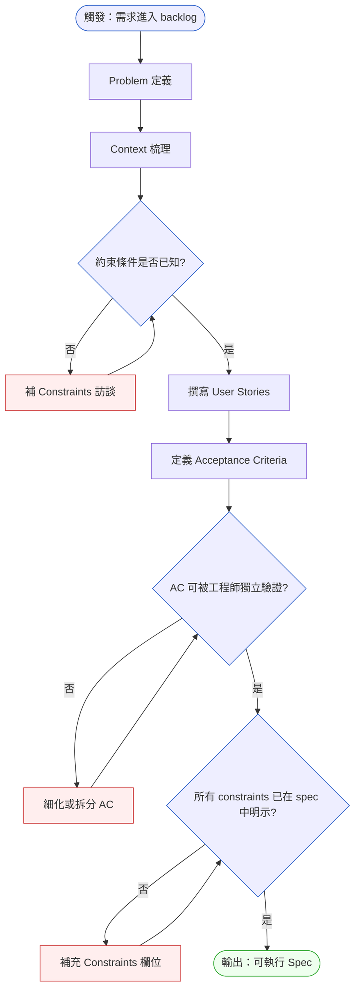
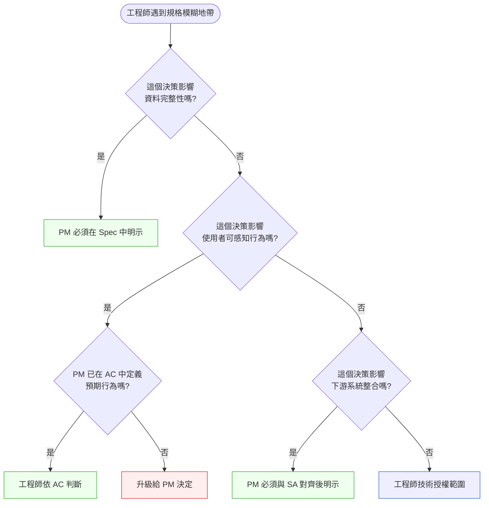

# 第 11 章 | Writing Specs That Engineers Trust：規格的可執行性

> **前置閱讀**：[Ch 10 — Jobs-to-be-Done：需求背後的需求](./ch-10-jtbd.md)
> **下游章節**：[Ch 12 — Acceptance Criteria：驗收標準的精確度](./ch-12-acceptance-criteria.md)
> **SA/SD 對照**：[SA/SD 第 10 章 — 規格文件](../../book/part-02-analysis/ch-10-spec-documents.md) ⸺ SA 視角關注規格的結構完整性與可追溯性；本章關注規格的可執行性，以及 PM 如何對工程師建立信任。

---

## §11.1 冷觀察

Sprint Review 的會議室裡，Teamline 的 PM 李采薇盯著螢幕上的 demo，沉默了二十秒。沒有人敢先說話。

後端工程師林昊剛展示完一個「零伺服器端驗證的快速表單送出流程」。頁面快得像沒有後端——點下送出，確認畫面瞬間就跳出來，幾乎沒有延遲。台下有人小聲說了句「這比之前快太多了」。

但李采薇腦中浮現的是規格文件裡她親手寫下的那一句：「使用者輸入後，系統應快速回應。」她從沒想過「快速」的代價，會是把所有 validation（驗證）移到前端，讓不合法的資料繞過檢查、直接寫進資料庫。她寫那句話的時候想的是「使用者不要等」，不是「資料不用檢查」。

三週前，林昊在規格旁邊留了一條 Jira 評論：「這個 validation 會增加 200ms，先移掉好嗎？」那天李采薇排了三個跨部門會議，在走廊上用手機回了一句：「ok 如果對效能有幫助的話。」她以為那是技術細節，工程師自己判斷就好——畢竟 200ms 聽起來就是個很「工程」的數字。

上線後第二天上午，資料損毀的 Slack 警報開始一條一條進來。錯誤的電話號碼格式讓 SMS 發送 queue（佇列）卡住，重試風暴塞爆了下游；空白的公司名欄位讓帳單系統 billing-service 找不到對應記錄，當月帳單直接漏開。Customer Success 開了緊急會，白板上列出七個需要人工修補的異常帳戶，其中兩個是年約客戶。CTO 在會議室門口停下來，只問了一句話：

> 「你們的 spec 裡，有沒有寫不能移掉 validation？」

李采薇當場翻出規格文件，一頁一頁找。沒有。林昊也翻出自己的 commit，確認沒有移錯任何一個寫在規格裡的功能需求。兩個人對看了一眼——他們都沒做錯「規格裡寫的事」，但他們一起做出了一個沒有人想要的版本。

這就是這份規格真正失敗的地方：它被忠實地執行了，卻沒有人能信任它。工程師憑工程直覺做了一個合理的優化選擇，PM 把它當成細節順手批准，結果是上線了一個誰都沒簽核過的業務行為。規格的失敗不是寫錯了功能，而是它把「不能動的東西」留在了文件之外——而工程師面對留白時，從來不會停下來等你，他們會做出對自己最合理的判斷。那個判斷符不符合業務意圖，全看規格清不清楚到足以引導它。

---

## §11.2 真問題

### 表面需求（What）

李采薇寫的規格沒有語法錯誤，也沒有技術漏洞。她描述了功能、用了 user story（使用者故事）格式，甚至附了 wireframe（線框圖）。從文件品質的角度看，這份規格交得出去。但它在工程團隊執行的那一刻，產生了它自己沒有預期、也沒有授權的後果。

表面上的診斷很容易下：「規格寫得不夠詳細」。補一行就好——加上「不得移除伺服器端 validation」，這個事故就不會發生。

這個診斷是對的，但只對了一半。如果只學到「以後要寫得更詳細」，下一個事故會換一個你這次沒想到的留白爆發。真正要處理的，不是這一行字漏了，而是「為什麼這一行字會被認為不需要寫」。

### 業務目標（Why）

把它拆開來看，這不只是遺漏了一條技術需求。底層在處理的是一個更普遍的命題：

**規格的可執行性，取決於它對決策邊界的描述，而不只是功能的描述。**

功能描述告訴工程師「要做什麼」。但工程師在實作時，真正面對的是無數個「怎麼做」的岔路，每一個岔路的選擇都可能改變業務語義。如果規格只覆蓋了 What，工程師就必須用自己的判斷去填補 How 的空白——而這個判斷未必和 PM 的業務意圖一致，甚至 PM 根本不知道有這個岔路存在。

一個有用的對照框架是把交付拆成三層：outputs（功能交付）、outcomes（使用者行為）、impact（業務指標）。可執行的規格必須在這三層都留下鉤點，而不是只寫到第一層就交出去：

| 層次 | 定義 | Teamline 案例的狀況 | 規格裡有沒有對應 |
|------|------|---------------------|-----------------|
| **Outputs（輸出層）** | 工程交付了什麼東西 | 「快速回應的表單」 | 有（功能描述） |
| **Outcomes（結果層）** | 使用者因此能做到什麼 | 「使用者能成功提交有效資料、不需重填」 | 沒有（沒寫驗收條件） |
| **Impact（影響層）** | 業務指標因此如何變化 | 「帳單系統與 SMS queue 維持正常、首日啟用率提升」 | 沒有（沒寫約束條件） |

在你自己的規格裡，試著填一遍這張表。如果 Outcomes 欄只能寫「使用者完成了功能」，或 Impact 欄完全空白——這就是訊號：規格目前只覆蓋了輸出層，還沒有給工程師足夠的業務語境。Constraints 欄位能補救部分缺口，但前提是你得先知道 Outcomes 和 Impact 層想保護的是什麼。

李采薇的規格只覆蓋了 Outputs 這一層。林昊優化了 Output 層的「速度」這個數字，從技術角度完全正確——他確實讓表單變快了。但這個優化破壞了 Outcomes 層（使用者送出了無效資料卻收到成功畫面）和 Impact 層（下游系統開始出錯）。

這裡的關鍵不是工程師「做錯了」。林昊在 Output 層的優化是成立的；問題是規格沒有把 Outcomes 和 Impact 層的約束交給他，於是他只能在自己看得見的那一層做到最好。**當規格只寫到 Output 層，工程師的盡力，反而會放大那兩層沒被寫出來的風險。**

### 決策瓶頸（Who × When）

這個案例真正的瓶頸是一個責任歸屬問題：**「移掉 validation 這個決策，應該由誰、在什麼時間點拍板？」**

林昊在規格的模糊地帶做了一個工程判斷，這本身不是錯。工程師有判斷力是好事。問題出在李采薇在 Jira 評論裡批准了這個決策，卻沒有意識到它早就跨過了技術細節的邊界、變成一個業務決策。她用「技術細節授權」的心態，簽了一張「業務行為變更」的單。

用 DACI（Driver / Approver / Contributor / Informed）來看，這裡的角色錯置一目了然：

| 角色 | 職責 | 應該是誰 | 實際發生了什麼 |
|------|------|----------|----------------|
| Driver | 推動這個決策進入討論 | PM 或 Tech Lead | 林昊單方面留了一條評論 |
| **Approver** | **決定是否移除 validation** | **PM（做業務影響判斷）** | **李采薇誤當成技術細節，順手批了** |
| Contributor | 提供工程可行性評估 | 林昊 | 有做（留了評論說明 200ms） |
| Informed | 被通知結果 | QA、Customer Success | 完全沒被通知 |

決策責任的漂移，是規格失效最常見、也最難察覺的根因——因為過程裡每個人看起來都「有溝通」。Approver 必須是一個明確的、有名字的人，而不是「工程師會自己判斷吧」這種被動的默契。

把這三節串起來：規格的可執行性，本質上是一個決策責任的分配問題。哪些決策 PM 必須在規格裡提前鎖定，哪些可以授權給工程師在實作時判斷，哪些需要在執行中觸發升級——這三條線畫在哪裡，就決定了一份規格值不值得被信任。下一節要處理的，就是怎麼把這三條線畫出來。

---

## §11.3 決策框架

### 圖 A — Spec 寫作工作流程



這個流程有兩個關鍵卡點，紅色節點標的就是現場最常被跳過的兩步。第一個是 Constraints 訪談：在寫 User Story 之前，得先把約束條件問清楚，而不是等工程師在 Sprint 中途自己撞到邊界才回頭補。第二個是 AC（Acceptance Criteria，驗收標準）可驗證性：每一條 AC 都得能被工程師在沒有 PM 陪同的情況下，獨立判斷是否通過——這是規格能不能「離開 PM 的腦袋獨立運作」的試金石。

### 圖 B — 規格決策樹：哪些決策必須在 Spec 中鎖定



這棵決策樹給的不是「答案」，而是「判準」——它幫你判斷哪些模糊地帶不該由工程師獨自決定，而不是宣告「工程師不能有判斷力」。藍色節點那條路徑（工程師技術授權範圍）是真實存在、而且應該被尊重的：工程師怎麼選 ORM、怎麼切函式、用不用快取，這些 PM 不需要碰。PM 的工作是把「動了會影響資料完整性、使用者可感知行為、下游整合」的那些邊界明示出來，而不是把所有決策都收回自己手上。收太多，工程師會覺得你不信任他；收太少，就會發生 Teamline 那件事。判斷力的分界線，就畫在這三個問句上。

### 規格五欄決策表

現場常用的 spec 框架是五欄結構：Problem、Context、Constraints、User Stories、Acceptance。每個欄位的缺失都會造成一種特定類型的執行風險，下表把「缺了會怎樣」攤開來，方便你在寫的時候自檢：

| 欄位 | 觸發條件 | 推薦做法 | PM 關注點 | 常見錯誤 | 缺這欄的典型後果 |
|------|----------|----------|-----------|----------|------------------|
| **Problem** | 需求進 backlog | 用「誰做不到什麼，代價多少」寫一句話 | 是否與業務指標連結 | 寫成功能描述而非問題描述 | 工程師不知道為何而做，無法在取捨時對齊目標 |
| **Context** | 需求有前置假設 | 列出系統當前狀態、已知限制、時間背景 | 不同時間讀到的人能否理解脈絡 | 只寫需求，不寫「為什麼現在做」 | 三個月後接手的人誤判優化方向 |
| **Constraints** | 需求有不可妥協的邊界 | 明示技術約束、業務規則、合規要求 | 缺這欄工程師會用直覺填補 | 以為約束是「常識」，不寫 | 工程師做出合理但破壞業務的選擇（Teamline） |
| **User Stories** | 需求需拆成可實作單元 | As / can / so that，每條 ≤ 3 天 | 每條 story 是否獨立可交付 | 把 epic 偽裝成 story，不拆分 | 工作量無法估計，Sprint 邊界失控 |
| **Acceptance Criteria** | Story 需定義完成條件 | Given / When / Then，可獨立驗證 | 每條 AC 是否有對應的失敗情境 | 只寫快樂路徑，不寫邊界 | QA 無法在 staging 自行判斷是否通過 |

### 現場常見的演進路徑：Constraints 欄位是怎麼長出來的

新手 PM 通常不是一開始就寫得出五欄。在現場看到的成長軌跡，多半是三級演進，了解這條路徑能幫你判斷自己卡在哪一級：

- **第一級——只寫 User Stories。** 剛接手的 PM 多半從 user story 開始，因為敏捷框架教的就是這個。這一級的規格能溝通「要做什麼」，但工程師一遇到「怎麼做」的岔路就得來問，PM 變成人肉 API，整天被打斷。
- **第二級——補上 Acceptance Criteria。** 被問煩了之後，PM 開始為每條 story 補 AC，把「做完的定義」交出去。這一級已經能擋掉大部分快樂路徑的歧義，工程師可以自己驗收成功情境。但失敗路徑和系統邊界還是留白。
- **第三級——補上 Constraints。** 通常是在經歷過一次「合理但出事」的事故之後（像 Teamline），PM 才會意識到還有一整類「不能動的東西」從來沒被寫進文件。這一級的規格才真正可執行，因為它同時交付了「要做什麼」和「不能怎麼做」。

這條路徑不是要你跳級。比較穩的做法是：先確保 AC 寫得扎實（第二級），再回頭補 Constraints（第三級）——因為很多 Constraints 其實是在寫失敗路徑 AC 的過程中被逼出來的。下一個框架就是專門用來把 Constraints 從腦袋裡逼出來的工具。

### If-Then 框架：Constraints 欄位的觸發判斷

Constraints 是最容易被遺漏的欄位，因為它的觸發條件不像功能需求那樣會主動跳出來提醒你。功能你不寫就交不出去，約束你不寫卻照樣能上線——直到出事。下面是在規格撰寫時判斷「這裡是不是該補一條 Constraint」的檢查器。

- **If** 功能描述出現「快速」「即時」「低延遲」等無數字的速度描述 → **Then** 補上 P50 / P99 延遲閾值，以及在不同負載下的容忍範圍
- **If** 功能描述出現「安全」「加密」「保護」等無具體規範的安全用語 → **Then** 指定加密標準、傳輸協議、儲存層要求
- **If** 功能描述出現「支援大量」「高並發」等無數字的量級描述 → **Then** 定義 QPS 上限、peak 假設、degradation policy（降級策略）
- **If** 功能描述出現「不影響現有功能」等隱含相容性要求但未列舉範圍 → **Then** 列出不得修改的 API contract、資料格式、行為
- **If** 功能描述出現「可擴展」「彈性」等無具體邊界的架構要求 → **Then** 說明擴展的觸發條件與預期路徑，而非留白
- **If** 功能涉及下游系統有自己的資料格式要求（如帳單系統、SMS queue） → **Then** 明確寫出 Constraint 保護該介面
- **If** 功能修改了其他服務的輸入期望（如移除 validation） → **Then** 補上不得破壞下游輸入完整性的 Constraint
- **If** 功能涉及合規或法務要求隱含在業務邏輯裡（如個資欄位、安全告警閾值） → **Then** 將法規限制轉為明確的不可修改 Constraint

回到 Teamline：「系統要快速回應」這句話踩中了第一行——沒有數字的速度描述。如果李采薇在寫規格時對著這張表掃過一遍，她會被「快速」這個詞攔下來，然後補上一條：「在追求速度優化時，不得移除伺服器端 validation，原因：billing-service 和 SMS queue 的輸入完整性依賴此層驗證。」這條 Constraint 一旦寫進去，林昊那條 Jira 評論根本不會出現——因為答案已經在文件裡了。

這張表不是要你變成偏執狂、把每個形容詞都當成地雷。它的用途是：當你寫完規格、準備送進 Sprint 之前，花兩分鐘掃一遍，看看有沒有哪個「聽起來很合理的形容詞」其實是一個你還沒做的決定。

### Constraints 分類三問：真正的約束、偏好、還是跨隊依賴？

寫到 Constraints 欄位時，很多 PM 會卡在一個問題：「這條算不算 Constraint？」把所有顧慮都塞進這欄，工程師會覺得你不信任他；什麼都不寫，就是 Teamline。

用三個問句篩選，能讓你在三十秒內分辨這三類：

**問 1：如果工程師這樣做，哪個業務規則或系統會壞掉？**
- 能說出具體的系統或指標（「SMS queue 收到格式錯誤的電話號碼會卡住」）→ **真正的約束，必須寫進 Constraints 欄位**
- 說不出具體後果，只是「感覺不對」→ 很可能是偏好，不是約束（見問 2）

**問 2：如果是偏好，它屬於哪個範疇？**
- PM 的業務偏好（「我希望 UI 看起來比較乾淨」）→ 寫進 Context 或 User Story 的備註，不要強行列為 Constraint
- 工程師的實作偏好（「最好用 Redis 做 cache」）→ 這是工程師技術授權範圍，不屬於 spec
- 設計師的視覺偏好（「按鈕顏色要和品牌色系一致」）→ 寫進 UI spec，不是功能 spec 的 Constraint

**問 3：這條約束需要另一個團隊改變他們的系統嗎？**
- 需要（「帳單系統要支援新的公司名稱格式」）→ 這是**跨隊依賴**，不要寫成 Constraint，要在 Context 欄位列為「依賴項」，並單獨追蹤
- 不需要（只是保護現有下游系統不被破壞）→ 是真正的 Constraint，寫進去

三問過完之後，如果工程師還是對某條 Constraint 提出異議（「這個限制讓我沒辦法做最好的優化」），這是一個信號：要麼 Constraint 寫得太寬（可以收窄），要麼背後有真實的取捨需要討論。正確的回應不是直接刪掉那條 Constraint，而是召集 PM + 工程師 + 下游相關人，把取捨攤開來決定。

> 你知道過度約束了，當工程師說：「我只是在執行，不是在設計。」這句話是一個警告訊號——說明 Constraints 欄位把本應屬於工程師判斷的空間也收走了。約束要保護邊界，不要替代決策。

---

## §11.4 踩坑清單

**反模式：把描述當規格**

現象：規格裡有很多「使用者可以查看訂單狀態」「系統應顯示錯誤訊息」這類句子，但沒有定義「哪些狀態」「什麼情況觸發錯誤」「錯誤訊息長什麼樣」。工程師照描述做出一個合理的版本，上線後 PM 說「我要的不是這個」。

短案例：某物流 SaaS 的規格寫「使用者可以追蹤包裹」，工程師實作成「顯示最新一筆物流節點」。Demo 時 PM 才發現自己要的是「完整的時間軸」。雙方對「追蹤」的想像差了一整個畫面，但規格裡這兩個字看起來毫無歧義。

根因：PM 把「描述需求」和「定義需求」混為一談。描述說的是意圖，定義說的是邊界。工程師需要的是邊界，不是意圖。

> 修正方向：在每個功能描述後面問自己一句：「工程師在不問我的情況下，能用這句話判斷這個功能做完了嗎？」如果不能，就還沒寫完。

---

**反模式：技術細節授權導致業務決策漂移**

現象：PM 在 Jira 評論或 Slack 訊息裡回了一句「這個 ok 嗎」的問題，工程師據此做了影響業務語義的技術選擇。事後 PM 說「我以為那是技術細節」，工程師說「你批准了」。

短案例：這正是 Teamline 的劇本——一句走廊上回的「ok 如果對效能有幫助的話」，授權掉了整個資料完整性的防線。危險之處在於，這種對話發生在規格文件之外，事後翻 spec 根本看不到這個決策曾經存在。

根因：「技術細節」和「業務語義」的邊界在規格模糊時很難區分。工程師沒有業務全局觀，PM 沒有技術細節的反射，兩方都在自己的框架裡做了合理判斷。

> 修正方向：當工程師問「可以移掉 X 嗎」，在回答之前先反問自己：「X 的存在是為了保護哪個業務規則？」如果答不出來，就先別當場批准，回去翻規格的 Constraints 欄位，把答案找出來再回覆。

---

**反模式：Happy Path 優先症**

現象：Acceptance Criteria 清一色是成功情境——「使用者點擊送出後，看到成功畫面」。邊界條件（空值、超長字串、並發送出、網路中斷）沒有 AC，工程師各憑判斷處理，於是同一個系統裡冒出好幾種不一致的錯誤行為。

短案例：某金流功能的 AC 只寫了「扣款成功後顯示收據」。當扣款成功但收據服務逾時的情境發生時，三個工程師寫出三種行為：一個重試、一個顯示空白頁、一個直接吞掉。客訴進來時誰都沒寫錯 AC，因為 AC 根本沒提這個情境。

根因：PM 定義 AC 時從使用者的理想路徑出發，沒有系統性地走過失敗路徑。而失敗路徑通常比成功路徑更能暴露業務規則的真正邊界。

> 修正方向：每寫一條 Happy Path AC，就追問一句「如果這一步失敗了，業務上可以接受什麼結果？」這通常能補出 2–3 條邊界條件 AC，而那幾條往往才是讓工程師跑偏的地方。

---

**反模式：規格版本化被跳過**

現象：規格在 Sprint 執行中被口頭修改（「那個先不做了」「這邊改一下」），但 spec 文件沒更新。Sprint 結束時，文件和實作對不上，QA 不知道以哪個為準。

短案例：某團隊的規格在 standup 上被口頭砍掉一個欄位，三週後 QA 拿著原版 spec 測試，把「缺少該欄位」報成 bug，工程師花了半天才釐清那是「已經講好不做了」。所有人都記得那場對話，唯獨文件不記得。

根因：PM 把規格當成「啟動文件」，而不是「執行中的合約」。功能一旦開始做，規格就被丟在一邊不再被看。

> 修正方向：任何口頭修改在 24 小時內反映到 spec 文件的對應欄位，並標記變更原因。用 Notion 的版本歷史、Confluence 的 page diff、或 spec 頂端的變更日誌欄位都行。一份沒有版本記錄的 spec，等於沒有合約。

---

**反模式：AC 寫給 PM 自己看**

現象：Acceptance Criteria 用業務語言寫（「使用者體驗應流暢」「系統效能應符合使用者期望」），工程師看不出怎麼驗收，QA 也無法在 staging 環境自行判斷是否通過。

短案例：某規格的 AC 寫「載入應該夠快」。工程師問「夠快是多快」，PM 答「就是不會讓人覺得卡」。這條 AC 永遠驗收不了，因為它的判斷標準住在 PM 的主觀感受裡，沒辦法交給任何人。

根因：PM 寫 AC 時心裡的受眾是自己或 stakeholder，而不是工程師和 QA。但 AC 的真正用途，是減少對 PM 的依賴，讓實作端能自主驗收。

> 修正方向：寫完 AC 後，把文件丟給一個工程師，問「你能在我不在場的情況下用這份文件驗收嗎？」如果對方搖頭，就還沒寫完。Given-When-Then 是個好用的強制結構：Given（前置狀態）、When（觸發動作）、Then（可觀察的結果）——三段都填得出來，這條 AC 才站得住。

---

## §11.5 交付清單 — 一頁式可執行 Spec 模板

這份模板的用途是：在需求進入 Sprint 之前，確保 PM 已經覆蓋了工程師在實作中會撞到的所有決策邊界。它對應的是本章三個框架的交集——五欄結構（§11.3）+ Constraints 觸發檢查（if-then 表）+ DACI 責任歸屬（§11.2）。

````markdown
# 可執行 Spec — {功能名稱}
> 版本:v0.1 | 撰寫日期:YYYY-MM-DD | 擁有人:{名字}

### 1. Problem（我們在解決什麼）
- 一句話業務問題：{誰} 做不到 {什麼}，代價是 {什麼}。
- 觸發這個需求的事件或指標：{說明}
- 我們想改善的是：□ Outcomes（使用者行為）  □ Impact（業務指標）

### 2. Context（背景與脈絡）
- 系統當前狀態：{說明}
- 已知的前置假設：{說明}
- 為什麼現在做（時機說明）：{說明}
- 相關的上下游系統：{系統名稱及其期望}

### 3. Constraints（不可妥協的邊界）
- 技術約束：{說明，例：不得移除伺服器端 validation}
- 業務規則：{說明，例：空白欄位不得寫入資料庫}
- 合規要求：{說明，例：個資欄位須遮罩}
- 效能邊界：{說明，例：P99 ≤ 500ms，不得以移除 validation 換速度}
- 不得修改的既有行為：{說明}

### 4. User Stories
- Story 1：As {角色}, I can {動作}, so that {目的}.
  - 預估工作量：{天數，建議 ≤ 3 天}
- Story 2：As {角色}, I can {動作}, so that {目的}.
  - 預估工作量：{天數}

### 5. Acceptance Criteria
- AC-1（Happy Path）：Given {前置狀態}, When {觸發動作}, Then {可觀察結果}.
- AC-2（邊界條件）：Given {前置狀態}, When {觸發動作}, Then {可觀察結果}.
- AC-3（失敗路徑）：Given {前置狀態}, When {觸發動作}, Then {可觀察結果}.

### DACI
| 角色 | 姓名 | 說明 |
|------|------|------|
| Driver（推動） | {PM 姓名} | 維護 spec，推動決策 |
| Approver（拍板） | {姓名} | 有爭議時最終決定 |
| Contributor（輸入） | {工程師、設計師} | 提供技術可行性評估 |
| Informed（通知） | {QA、CS} | 上線後通知 |

### 版本記錄
| 日期 | 變更內容 | 變更原因 |
|------|----------|----------|
| {日期} | 初版 | {說明} |
````

把它存在 `docs/specs/`，跟程式碼同 repo，跟 README 同層。

這份模板的五個欄位，對應的是工程師在實作中最常撞到的五類決策點。Problem 確保工程師理解「為什麼做」，Context 確保他們理解「在什麼環境下做」，Constraints 確保他們知道「哪些不能動」，User Stories 確保工作量是可切割的，Acceptance Criteria 確保完成的定義是可驗證的。少任何一欄，就會在對應的那一類決策點上留出讓工程師「合理但跑偏」的空間。

### §11.5.1 PM 填寫過程實況：當你盯著空白欄位時

模板有了，但最難的不是複製貼上，而是坐下來盯著空白欄位、開始動筆的那個時刻。以下用一個不同的案例——Teamline 的搜尋功能改版——走一遍 PM 實際填寫 Constraints 欄位時的思考過程，包括中途的自我修正。

**情境**：Teamline 產品計畫新增一個「全文搜尋聯絡人」功能，讓業務可以快速找到客戶。PM 陳昱安坐下來準備填 Constraints 欄位，什麼都沒寫。

---

**第一步：她先寫功能描述（Problem + User Story）**

> Problem：業務主管花 3 分鐘在聯絡人列表裡手動翻找，導致每天浪費約 30 分鐘。
> Story：As 業務主管, I can 用關鍵字搜尋聯絡人姓名、公司、Email, so that 我在 10 秒內找到目標客戶。

**第二步：她掃了一遍 if-then 表**

> 「10 秒內……這是速度描述，沒有數字。」
> 她停下來，補了一行：「搜尋結果應在 P99 ≤ 2 秒內回傳（基準：10,000 筆聯絡人資料量）。」

> 「聯絡人資料，這裡有個人資料。」
> 她想了一下：「我們的用戶是 B2B 公司，聯絡人是商業客戶，不是 C 端個人——這個算個資嗎？」
> 她翻了一下法務文件，確認公司的客戶聯絡資料受 GDPR 管轄。
> 補一條：「搜尋 API 不得 expose 個資欄位（如 direct_phone、personal_email）給非 Owner 角色。」

**第三步：她問自己「下游有誰依賴這個功能」**

> 「這是搜尋，不是寫入，應該不影響下游……等等，搜尋結果如果有快取，會不會讓剛更新的資料搜不到？」
> 她想到業務剛剛才說「最重要的是搜尋結果要是最新的」，但這句話沒寫進規格。
> 補一條：「搜尋結果快取最長 TTL 60 秒；新增或更新聯絡人後，相關快取必須失效。」

**第四步：她準備送出規格，但先做了一個測試**

> 她把草稿傳給工程師小涵，問：「你能不能在我不在場的情況下，用這份文件自己判斷『搜尋功能做完了』？」
> 小涵看了兩分鐘，回覆：「大部分可以，但 AC-3 你說『搜尋無結果時要有提示』，但你沒定義提示長什麼樣——是一行文字、空白頁、還是推薦搜尋？」

陳昱安回去補上：「Given 搜尋關鍵字無任何符合結果，When 搜尋完成，Then 顯示『找不到符合「{keyword}」的聯絡人』並附上清除搜尋的按鈕。」

這段走一遍，總共花了 35 分鐘。規格裡有三條 Constraints 是在這個過程中被逼出來的——速度閾值、個資遮罩、快取失效。這三條任何一條沒寫，工程師都會做出一個技術上合理但業務上有漏洞的版本。

---

### §11.5.2 範例一：Teamline 表單提交功能（事故前應有的 Spec）

Teamline 的資料損毀事故，發生在規格沒有 Constraints 欄位的情況下。以下是如果李采薇當初用這份模板寫規格，她應該得到的結果——注意 Constraints 欄位如何把那條沒被寫出來的決定，提前變成白紙黑字。

````markdown
# 可執行 Spec — Teamline 聯絡人資料提交表單
> 版本:v0.1 | 撰寫日期:2026-02-15 | 擁有人:李采薇（PM）

### 1. Problem（我們在解決什麼）
<!-- 為什麼這欄：沒有這一句，工程師不知道「快速回應」是為了什麼業務目標；
     知道了目標，才能在速度和資料完整性之間做有依據的取捨。 -->
- 一句話業務問題：新用戶在填寫聯絡人資料時，因表單送出後 1.2 秒的等待而
  中途放棄，造成首日啟用率比目標低 18%。
- 觸發這個需求的事件：Q2 用戶研究，17/20 位受訪者提到「表單很慢」。
- 我們想改善的是：✓ Outcomes（首日啟用率 ≥ 目標 85%）

### 2. Context（背景與脈絡）
- 系統當前狀態：表單提交後，伺服器端做欄位格式驗證（電話號碼、Email、
  公司名稱），驗證通過才寫入 contacts 資料表，目前 P50 = 1.2s。
- 已知的前置假設：validation 的延遲主要來自 regex 驗證 + DB write，
  不是網路延遲。
<!-- 為什麼這欄：說清楚延遲的來源，工程師才能評估哪些優化方向可行；
     沒有這個前置假設，工程師可能誤判問題在 CDN 或前端 bundle 大小。 -->
- 為什麼現在做：Q3 OKR 綁定首日啟用率，本 Sprint 是最後窗口。
- 相關下游系統：
  - SMS 發送 queue（依賴電話號碼格式正確）
  - 帳單系統 billing-service（依賴 company_name 非空）

### 3. Constraints（不可妥協的邊界）
<!-- 為什麼這欄：這是 Teamline 事故的元凶欄位；工程師在沒有這份約束的情況下，
     移除 server-side validation 是一個完全合理的工程決策，但業務後果是
     非法資料進入下游系統。這欄的存在，是讓 PM 提前承擔這個判斷責任。 -->
- 技術約束：不得移除伺服器端 validation。原因：SMS queue 和 billing-service
  均依賴此層確保輸入格式正確，前端 validation 無法提供同等保護（可被 bypass）。
- 業務規則：
  - phone_number 必須通過 E.164 格式驗證後才能寫入 DB
  - company_name 不得為空或純空白
  - email 必須通過 RFC 5322 格式驗證
- 效能邊界：目標 P99 ≤ 600ms（從點擊送出到看到成功畫面）。
  此目標不得以移除 server-side validation 達成。
- 不得修改的既有行為：contacts 資料表的 schema 不得在本 Sprint 修改。

### 4. User Stories
- Story 1：As 新用戶, I can 在 600ms 內完成聯絡人資料提交並看到確認畫面,
  so that 我的輸入被系統接受且不需要重新填寫。
  - 預估工作量：2 天
- Story 2：As 新用戶, I can 在提交前看到即時的欄位格式提示（前端）,
  so that 我不需要等送出後才知道電話號碼格式錯誤。
  - 預估工作量：1 天

### 5. Acceptance Criteria
- AC-1（Happy Path）：Given 用戶填寫了格式正確的電話號碼、Email、公司名稱，
  When 點擊送出，Then 在 600ms 內（P99）看到成功畫面，資料寫入 contacts 表。
- AC-2（前端即時提示）：Given 用戶在電話號碼欄位輸入不符合 E.164 格式的字串，
  When 游標離開欄位，Then 欄位下方出現格式錯誤提示，不需等到送出。
<!-- 為什麼這欄：這條 AC 定義了「前端 validation」的行為，讓工程師知道
     前端的即時提示是加分項而非替代項，不是移除後端 validation 的理由。 -->
- AC-3（後端拒絕空值）：Given 電話號碼欄位為空，When 前端繞過 validation
  直接 POST，Then 伺服器回傳 422，資料不寫入 DB，SMS queue 不受影響。
- AC-4（效能邊界）：Given staging 環境，When 執行 100 次並發送出，
  Then P99 延遲 ≤ 600ms，錯誤率 0%。

### DACI
| 角色 | 姓名 | 說明 |
|------|------|------|
| Driver | 李采薇（PM） | 維護 spec，推動 Sprint 進度 |
| Approver | 李采薇（PM） | 所有涉及 validation 的技術取捨最終由 PM 拍板 |
| Contributor | 林昊（BE）、前端工程師 | 評估優化方案可行性，提出備選方案 |
| Informed | QA、Customer Success | 上線前通知 QA staging 測試，上線後通知 CS |

### 版本記錄
| 日期 | 變更內容 | 變更原因 |
|------|----------|----------|
| 2026-05-10 | 初版 | Sprint 22 kickoff |
````

林昊如果看到這份 spec，他不會問「可以移掉 validation 嗎」——因為那個問題在 Constraints 欄位已經被提前回答了。一份把約束條件寫清楚的規格，反而讓工程師的技術創造力可以朝正確的方向發揮：他知道哪裡不能動，剩下的空間都是他的。

### §11.5.3 範例二：GridPulse 韌體告警閾值（跨域對照）

同一套框架不只適用於 SaaS 表單。換到能源 OT（Operational Technology，營運技術）場景，故事的骨架一模一樣，只是「不能動的東西」從資料完整性換成了人身與設備安全。GridPulse 的韌體工程師為了「降低告警噪音」，把電芯溫度告警閾值從 45°C 上調到 55°C——這在現場是個合理的優化（45°C 的告警確實常被維運忽略），但規格沒寫「安全相關閾值不得調整」，於是電芯在 52°C 持續運轉兩週都沒人知道。以下是事故前應有的 Constraints 與 AC 片段：

````markdown
# 可執行 Spec — GridPulse 儲能 EMS 告警韌體優化（片段）
> 版本:v0.1 | 撰寫日期:2026-02-15 | 擁有人:韌體 PM

### 1. Problem（我們在解決什麼）
- 一句話業務問題：維運人員每天收到約 400 則告警，其中 70% 是非關鍵噪音，
  導致關鍵告警被淹沒，平均回應時間從 5 分鐘惡化到 22 分鐘。
- 我們想改善的是：✓ Outcomes（關鍵告警平均回應時間 ≤ 8 分鐘）

### 3. Constraints（不可妥協的邊界）
<!-- 為什麼這欄：在 OT 場景，「降低噪音」與「調整安全閾值」只有一線之隔；
     工程師看到的是告警量，PM 與安全工程師看到的是人身與設備風險。
     這欄的存在，是把「哪些告警閾值碰不得」從現場默契變成書面約束。 -->
- 安全約束：電芯溫度、過充過放、絕緣阻抗三類「安全相關告警」的觸發閾值
  一律不得調整。降噪只能透過「聚合、去重、靜默期」等不改變閾值的手段達成。
- 合規要求：告警閾值變更須符合 IEC 62933 儲能系統安全規範，任何閾值
  調整需經安全工程師（不是 PM 一人）會簽。
- 不得修改的既有行為：BMS（電池管理系統）強制降載的觸發邏輯不得被韌體
  優化繞過。

### 5. Acceptance Criteria
- AC-1（降噪有效）：Given 一小時內同類非安全告警出現 ≥ 10 次，
  When 韌體套用聚合規則，Then 維運端只收到 1 則彙總告警，原始事件仍進稽核 log。
- AC-2（安全閾值不變）：Given 電芯溫度達 45°C，When 任何降噪規則生效，
  Then 安全告警仍在 45°C 觸發，且 5 秒內送達維運與雲端兩條路徑。
<!-- 為什麼這欄：這條 AC 把「降噪不得波及安全告警」變成可觀察的測試案例，
     讓韌體工程師知道聚合規則的作用範圍到哪裡為止。 -->
````

兩個案例放在一起看，框架的普遍性就浮現了：不論是 SaaS 的 validation 還是能源的告警閾值，事故的形狀都是「規格描述了意圖（快/降噪），卻沒鎖定邊界（資料完整性/安全閾值），工程師在留白處做了合理但越界的決定」。Constraints 欄位要解的，永遠是這同一件事。

### §11.5.4 送出前 10 點自檢清單

這份清單的用途是：在規格送進 Sprint 的前五分鐘，快速確認有沒有明顯的漏洞。每一點對應到本章的一個框架，勾完再送出。

```
□ 1. Problem 欄位用「誰做不到什麼，代價多少」寫了一句話
      （不是「使用者可以…」，是「使用者做不到…，代價是…」）

□ 2. Context 欄位列出了所有相關下游系統及其對本功能的期望

□ 3. Constraints 欄位存在，且不是空的

□ 4. Constraints 欄位已用 If-Then 框架掃過一遍（§11.3 的觸發清單）

□ 5. 每條 Constraint 通過「三問篩選」：
      - 說得出具體壞掉的系統或指標（不是偏好）
      - 不需要另一個團隊改變他們的系統（不是依賴項）

□ 6. 每條 User Story 可以在 3 天內獨立交付

□ 7. 每條 Acceptance Criteria 用 Given-When-Then 格式寫完

□ 8. Happy Path 之外，至少有一條邊界條件 AC 和一條失敗路徑 AC

□ 9. DACI 欄位的 Approver 有具體姓名（不是「工程師判斷」）

□ 10. 把草稿丟給一位工程師確認：能在你不在場的情況下自主驗收
```

這十點不是儀式，是工作流程的最後一道防線。大多數規格事故，都能在第 3、5、8 點被攔住。

---

## §11.6 Recap

讀完本章，你應該已經能做到下面這五件事——它們對應的，正是一份規格從「能溝通」走到「值得被信任」要補齊的五道缺口：

- [ ] 寫規格時，在 Constraints 欄位明示工程師不得自行判斷的業務邊界
- [ ] 用 if-then 框架在撰寫當下主動識別哪些描述（「快速」「安全」「不影響現有功能」）需要補 Constraints
- [ ] 用三問分類法區分「真正的約束」「PM 偏好」和「跨隊依賴」，避免過度約束
- [ ] 把每條 Acceptance Criteria 轉成 Given-When-Then 格式，確保工程師能獨立驗收
- [ ] 在 DACI 欄位寫出每個技術決策的 Approver 姓名，而不是讓它落在「工程師自行判斷」的灰色地帶
- [ ] 任何口頭修改在 24 小時內更新到 spec 的版本記錄欄位

**如果這個 Sprint 只能做一件事**，建議從補 Constraints 欄位開始——因為這欄的缺失，是大多數規格「忠實執行卻產生意外結果」的共同根源。補這欄不需要任何工具投資，只需要你在送出規格之前，誠實回答一個問題：「工程師在優化這個功能時，哪些東西絕對不能動？」

**如果你的團隊還沒習慣可執行規格**，建議從第二級開始（先確保 AC 用 Given-When-Then 格式），而不是一次要求全五欄。讓工程師先感受到「這份規格讓我少問了三個問題」，信任才會建立。等信任建立了，第三級（Constraints）才不會被當成 PM 不信任工程師的控制欲。

**你知道規格開始有效了**，當工程師在 Sprint 中不再來問「這個邊界可以動嗎」，而是說「spec 上寫了 X，我照這個做了，你確認一下 AC-3 通過了嗎」。那個時候，規格已經從「PM 的草稿」變成了「團隊的合約」。

---

### 附錄：規格事故回顧模板（Spec Postmortem）

功能上線出事之後，很多團隊的回顧只問「誰的錯」，而不問「規格的哪個欄位沒有保護這個邊界」。以下是一份可直接複製進 Confluence 或 Notion 的回顧模板，專門用來把事故轉換成下一份規格的改進點：

```
## 規格事故回顧 — {功能名稱}
回顧日期：{日期}  |  主持人：{PM 姓名}

### 1. 事故描述（3 行以內）
{發生了什麼，影響了誰，持續多久}

### 2. 根因定位
□ Constraints 欄位缺失（沒寫不能動的邊界）
□ AC 缺少邊界條件或失敗路徑
□ 口頭修改沒有更新到 spec
□ DACI Approver 不明確導致決策漂移
□ 其他：{說明}

### 3. 規格診斷問題
- 事故對應的 Constraint 是否存在於規格中？
  □ 存在但被繞過 → 是執行問題，不是規格問題
  □ 不存在 → 是規格問題，繼續往下

- 如果 Constraint 不存在，為什麼沒寫？
  □ PM 不知道這個邊界需要保護
  □ PM 知道但以為是「常識」，工程師應該知道
  □ 在 Sprint 中被口頭修改但沒更新文件

### 4. 下一份規格的具體改動
- 要新增的 Constraint 類型：{說明}
- 要補充的 AC 類型（邊界條件/失敗路徑）：{說明}
- DACI 需要調整的 Approver 範圍：{說明}

### 5. 本次事故對團隊約定的影響
{寫一條新的工作約定，例：「任何涉及下游系統格式的技術決策，Approver 必須在 spec 中明示，不接受 Slack 口頭批准」}
```

這份模板最重要的問題是第 3 節的第一問：「事故對應的 Constraint 是否存在於規格中？」如果存在但被繞過，這是執行紀律問題，規格本身是健康的；如果不存在，才是這一章要處理的規格設計問題。分清楚這兩種，才不會把每次事故都變成「要求工程師更小心」，而是把應該由 PM 承擔的文件責任還給 PM。

---

## Cross-References

- **前章**：[Ch 10 — Jobs-to-be-Done：需求背後的需求](./ch-10-jtbd.md) ⸺ 本章從 JTBD 發掘的真實需求出發，進一步定義如何把它寫成工程師可執行的規格
- **下一章**：[Ch 12 — Acceptance Criteria：驗收標準的精確度](./ch-12-acceptance-criteria.md) ⸺ 本章介紹的 AC 框架在下一章有更深入的展開，包含邊界條件的系統性設計方法
- **強連結**：[Ch 22 — PM × SA：需求到架構的橋梁](../part-04-collaboration/ch-22-pm-sa-interface.md) ⸺ 本章的 Constraints 欄位需要 SA 的輸入來確保技術正確性
- **強連結**：[Ch 25 — PM × QA：驗收合約不是最後一關](../part-04-collaboration/ch-25-pm-qa.md) ⸺ 本章的 AC 設計與 QA 的測試計畫有直接連動
- **SA/SD 對照**：[SA/SD 第 4 章 — 需求工程基礎](../../book/part-01-foundations/ch-04-requirements-engineering.md) ⸺ SA 視角關注需求的分類與可追溯性矩陣；本章關注規格如何在工程執行中建立決策信任
- **SA/SD 對照**：[SA/SD 第 10 章 — 規格文件](../../book/part-02-analysis/ch-10-spec-documents.md) ⸺ SA 視角關注規格的結構與 UML 表示法；本章關注 PM 如何讓規格在 Sprint 現場可執行
