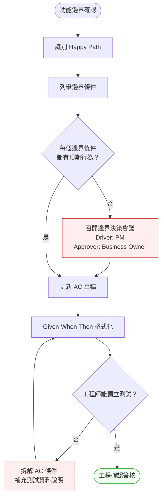
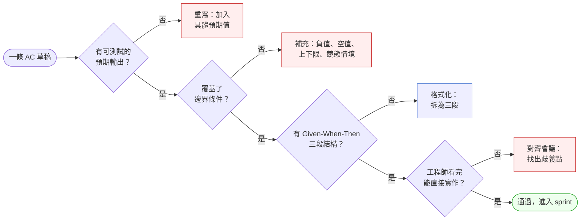

# 第 12 章 | Acceptance Criteria：驗收標準的精確度

> **前置閱讀**：[Ch 11 Writing Specs That Engineers Trust：規格的可執行性](./ch-11-executable-specs.md)
> **下游章節**：[Ch 13 MVP Design：最小可驗證的邊界](./ch-13-mvp-design.md)
> **SA/SD 對照**：[SA/SD Ch 10 規格文件](../../book/part-02-analysis/ch-10-spec-documents.md)
> ⸺ SA 視角關注規格文件的完整性與可追溯性；本章關注 AC 在決策邊界上的精確度，以及 PM 怎麼和 QA、工程師對齊「完成」的定義。

---

## §12.1 冷觀察

Sprint review 的會議室裡，QA Lead 把一份試算表推到桌上。

「23 個未定義情境。」

PM 拿起來看。第一行：「使用者輸入金額為負數時，系統應該怎麼做？」第二行：「轉帳金額超過單日上限，但剛好等於上限時，是允許還是拒絕？」第三行：「同一筆交易在網路斷線的瞬間送出兩次，哪一筆算數？」

這些情境，User Story 裡一個字都沒有。

PM 的 AC 只有三條：
1. 使用者可以輸入轉帳金額
2. 系統顯示確認頁面
3. 交易成功後顯示成功訊息

沒有錯。但也只有這三條。

ClearPay 是一家虛構的台灣金融科技（Fintech）公司，主打即時轉帳功能。這個 sprint 的目標是推出個人轉帳 v1，預計兩週後上線。工程師依照 AC 實作，正常流程（Happy Path）全過了，持續整合（CI，Continuous Integration）也是綠燈。但當 QA 開始測試非預期輸入——邊界值、空值、競態條件——清單在一個下午內從 0 漲到 23。

「你說的完成，到底是什麼意思？」QA Lead 問。

PM 沒有答上來。

上線推遲兩週。工程師需要重新開會釐清 23 個情境的預期行為，補測試案例，重跑回歸。法務也在這個時候介入，要求確認「雙重扣款」場景的退款流程是否符合電支機構規範。

那份試算表後來被貼在辦公室白板上，在接下來三個月的每次 sprint planning 前，有人都會不經意地瞄它一眼。

---

## §12.2 真問題

把那份試算表拆開來看。

### 表面需求（What）：AC 寫得不夠完整

第一個反應通常是：「下次 AC 要寫詳細一點。」這個結論沒錯，但沒有切到根。

寫「更詳細的 AC」，大多數 PM 的做法是把 Happy Path 拉得更長，加更多成功情境的細節描述。這解決不了 23 個邊界條件的問題，因為邊界條件不是從「成功路徑延伸」出來的——它們來自**功能邊界的思維**：這個功能「不處理」什麼？什麼輸入是非法的？什麼狀態是系統不應該允許的？

沒有這個思維框架，AC 再詳細也只是把 Happy Path 說得更清楚。

### 業務目標（Why）：驗收的目的是什麼？

AC 的業務目標不是「讓工程師知道做什麼」，而是**在交付前對齊「完成」的定義**。

這個定義包含三個層次：

| 層次 | 問題 | ClearPay 個案 |
|---|---|---|
| **Outputs** | 功能做出來了嗎？ | 轉帳介面上線了 |
| **Outcomes** | 使用者能完成預期行為嗎？ | 只有 Happy Path 可用 |
| **Impact** | 業務指標有保障嗎？ | 合規風險、退款成本未覆蓋 |

ClearPay 的 PM 量的是 Outputs（功能實作完成）。但 QA 想驗的是 Outcomes（使用者在各種情境下都能正確使用）。法務要求保障的是 Impact（合規與財務風險）。三個層次對 AC 的期待完全不同，卻從來沒有在一個房間裡對齊過。

### 決策瓶頸（Who × When）：誰必須在哪個時間點定案？

問題的核心不在「AC 寫得夠不夠好」，而在**決策責任沒有被明確指定**。

23 個邊界條件，每一個都是一個設計決策：「當 X 發生時，系統應該做 Y 還是 Z？」這些決策通常不是 PM 能單獨決定的——有的需要工程師評估技術可行性，有的需要法務確認合規邊界，有的需要 Business Owner 決定商業邏輯。

但在 AC 撰寫的時候，這些人都不在場。

DACI（一種決策角色分工框架：Driver 驅動者、Approver 拍板者、Contributor 貢獻者、Informed 知會者）在這裡應該這樣分配：

| 角色 | AC 情境中的定義 |
|---|---|
| **D（Driver）** | PM：驅動 AC 定義會議，確保所有情境在 sprint 開始前被覆蓋 |
| **A（Approver）** | Business Owner：對「邊界行為」的商業邏輯最終拍板 |
| **C（Contributor）** | QA、工程師：提出可能的邊界條件；法務：指出合規要求 |
| **I（Informed）** | Design、客服：得知最終決策，更新相關文件或 FAQ |

ClearPay 的問題是：Approver 不在場，Contributor 沒有機會提問，所以 23 個決策全部被推遲到 QA 發現問題的那一天。

#### DACI 決策類型矩陣：PM 什麼時候能自行拍板？

並非所有 AC 邊界決策都需要召開會議。以下矩陣幫助 PM 判斷自行決策 vs. 升級決策：

| AC 類型 | 主要決策者 | 升級觸發條件 | 典型場景 |
|---|---|---|---|
| **UX 樣式選擇** | PM 或 Designer | 影響核心流程轉換率 | 按鈕位置、錯誤訊息文案 |
| **輸入驗證規則** | PM + RD | 需要後端邏輯配合 | 小數位截斷、特殊字元處理 |
| **功能移除 / 排除** | Product Owner + PM | 影響已承諾的使用者承諾 | v1 砍掉通知功能 |
| **合規邊界** | Legal + PM | 任何涉及法規的條件 | 金額上限、KYC 狀態要求 |
| **資料存取權限** | Security + PM | 跨使用者資料存取 | 能否看到他人帳戶狀態 |
| **競態條件處理** | RD + PM | 幂等性、去重邏輯設計 | double submit 防護策略 |
| **錯誤回復行為** | Business Owner + PM | 涉及金融損失或客戶補償 | 部分成功的退款流程 |

**判斷快捷鍵**：如果 PM 寫完 AC 後心裡有「這樣對嗎？我不確定」——這就是需要升級決策的訊號，不是繼續猜。

---

## §12.3 決策框架

### 圖 A — AC 定義工作流程



流程的關鍵轉折在兩個判斷節點。第一個：「每個邊界條件都有預期行為？」這是 PM 在開 sprint 之前必須自問的問題。如果答案是否，不是繼續寫 AC，而是先召集決策會議。第二個：「工程師能獨立測試？」這是格式化後的驗收點。一條寫不出測試案例的 AC，通常代表 AC 本身的條件還不夠清楚。

### 圖 B — AC 品質判斷樹



### Given-When-Then 結構

Given-When-Then（GWT）是目前最穩的 AC 格式，不是因為它是「最佳實踐」，而是因為它強迫 PM 在寫 AC 的時候同時回答三件事：前提狀態、觸發動作、預期結果。缺少任何一段，工程師就必須靠假設補足，而假設是邊界條件洞的來源。

格式：

```
Given  <前提狀態：系統處於什麼狀態？使用者是誰？>
When   <觸發動作：使用者做了什麼？或系統收到什麼事件？>
Then   <預期結果：系統應該做什麼？顯示什麼？狀態如何改變？>
```

ClearPay 轉帳功能的正確 AC 示範：

**Happy Path**
```
Given  使用者已登入，帳戶餘額 NT$10,000，單日轉帳上限 NT$30,000，
       今日已轉出 NT$0
When   使用者輸入轉帳金額 NT$5,000，確認送出
Then   交易成功，帳戶餘額扣減為 NT$5,000，
       顯示交易成功頁面（含交易序號），
       交易紀錄出現在歷程清單中
```

**邊界條件：超過單日上限**
```
Given  使用者已登入，今日已轉出 NT$28,000，單日上限 NT$30,000
When   使用者輸入轉帳金額 NT$3,000
Then   系統拒絕交易，顯示「今日可轉餘額為 NT$2,000」，
       帳戶餘額不變，交易紀錄中不產生任何記錄
```

**邊界條件：負數輸入**
```
Given  使用者已登入
When   使用者輸入轉帳金額為負數（如 -100）
Then   金額欄位顯示錯誤提示「請輸入有效金額」，
       無法進入確認頁面，不觸發任何後端請求
```

注意最後一條：「不觸發任何後端請求」。這一句話對工程師的意義是：不需要驗證後端行為，前端驗證（front-end validation）攔截即可。少了這句，工程師可能會在後端也加一層驗證，或者不確定前端是否需要攔截。

### GWT 常見陷阱

GWT 三段結構看起來簡單，但寫錯的方式高度一致。以下四種是 review AC 時最常攔下來的：

- **Then 段只寫成功路徑，不寫錯誤狀態。** 「Then 交易成功，顯示成功頁」——但交易失敗時系統做什麼？沒寫。GWT 的 Then 段必須涵蓋這個 When 下所有可能的系統回應分支，至少包含成功與失敗兩條。判斷方式：把 Then 段遮起來問自己「這個 When 還有別的結果嗎？」如果有，就少寫了一條 AC。
- **Given 段前提不完整，工程師被迫猜測。** 「Given 使用者轉帳」——餘額多少？登入了嗎？KYC 過了嗎？前提缺一個，工程師就得猜一個，而每個猜測都是一個未來的 bug。判斷方式：Given 段要寫到「換一個工程師來讀，也能重建出完全相同的初始狀態」。
- **When 段塞進多個動作，變成一段流程。** 「When 使用者輸入金額、選擇收款人、確認、再次確認、等待結果」——這不是一條 AC，是五個觸發點混在一起，測試時無法定位是哪一步出錯。判斷方式：一條 GWT 的 When 只描述一個觸發動作；多步驟就拆成多條 AC，或用前一條的 Then 當作後一條的 Given。
- **Then 段寫的是實作手段，不是可觀察的結果。** 「Then 系統呼叫 validateAmount() 函式」——這是實作細節，不是驗收標準。QA 無法從外部觀察函式被呼叫。判斷方式：Then 段必須是「使用者看得到」或「API 回傳得到」的事實（狀態碼、畫面文字、資料欄位變化），而不是程式內部怎麼做到的。

這四種陷阱的共通點：都讓 AC 失去「可被獨立驗證」的能力。寫完一條 AC，用這四個問題掃一次，比任何模板都快找出漏洞。

### 決策表：情境類型 × AC 處理方式

| 情境類型 | 觸發條件 | 推薦做法 | PM 關注點 | 常見錯誤 |
|---|---|---|---|---|
| **Happy Path** | 所有前提成立，輸入合法 | 完整三段 GWT | 確認「成功」的定義（狀態改變、通知、紀錄） | 只描述 UI 行為，忽略後端狀態 |
| **輸入邊界** | 最大值、最小值、恰好等於限制值 | 明確列出「上限」「下限」「等於上限」三條 AC | ≤ 和 < 的差異要指明 | 只寫「超過上限時拒絕」，沒有定義「等於上限」 |
| **非法輸入** | 空值、負數、非數字、XSS 字元 | 指定前端攔截或後端驗證，二擇一 | 避免工程師重複驗證 | AC 說「系統應拒絕」，沒說在哪一層拒絕 |
| **競態條件** | 並發請求、網路斷線重送、double submit | 需要工程師輸入再定義 | 找出業務層的決定（幂等 or 拒絕重送） | 忽略不寫，等 QA 測出來再說 |
| **合規邊界** | 金額上限、KYC 狀態、交易紀錄保留期 | 法務確認後才寫入 AC | 法務的確認必須有書面紀錄 | 依常識寫，沒有對齊法務 |
| **錯誤恢復** | 系統逾時、第三方 API 失敗、部分成功 | 定義 rollback 或 retry 行為 | 使用者看到的錯誤訊息是什麼？ | 「系統顯示錯誤」，沒有指定訊息內容 |
| **非功能性** | 效能、安全性、可及性要求 | 獨立 AC，明確量化指標 | 這條 AC 要在哪個測試階段驗證？ | 混在功能 AC 裡，QA 不知道誰負責跑 |
| **分析記錄** | 事件追蹤、稽核日誌要求 | Then 段明確列出必須被記錄的欄位 | 缺少欄位上線後才發現，補 log 要重新部署 | 假設工程師知道要記錄什麼 |

### 非功能性 AC：效能、安全性、合規

功能性 GWT 只覆蓋「行為正確性」。當一個功能有效能目標、安全要求、或法規規定的回應時間時，需要獨立的非功能性 AC。

**非功能性 AC 格式**：

```
Given  <系統負載條件或環境>
When   <特定操作>
Then   <量化指標或可驗證的狀態>
測試方式: <誰負責驗證，使用什麼工具>
```

**效能 AC 範例**（ClearPay 轉帳查詢）：
```
Given  1,000 個並發使用者同時查詢交易歷程
When   呼叫 GET /transactions API
Then   p95 回應時間 ≤ 500ms，p99 ≤ 1,200ms，
       錯誤率 < 0.1%
測試方式: 壓力測試由 RD 於上線前執行，結果附在 ticket 的 attachment
```

**安全性 AC 範例**（SaaS 帳號系統權限邊界）：
```
Given  使用者 A 已登入，試圖存取使用者 B 的設定頁面
When   直接帶入 user_id=B 的 URL 參數送出請求
Then   系統回傳 403，不洩漏使用者 B 任何資料，
       稽核日誌記錄一條「未授權存取嘗試」事件
測試方式: 安全測試由 Security 在 staging 驗證
```

**合規性 AC 範例**（電商存取紀錄保留）：
```
Given  使用者刪除帳號
When   帳號刪除完成
Then   訂單紀錄依《電子商務消費者保護法》保留 5 年，
       個人識別欄位（姓名、電話、地址）匿名化處理，
       保留欄位：訂單 ID、金額、日期、商品類別
測試方式: Legal 於上線前書面確認，QA 驗證欄位是否匿名化
```

**關鍵原則**：非功能性 AC 必須寫出「測試方式」，否則它們很容易被當作「有寫等於有做」然後在上線前消失。

### 異步與事件驅動 AC 模式

同步請求的 GWT 直接好寫。當功能涉及背景任務、Webhook、或最終一致性系統時，因果關係跨越時間，需要不同的寫法。

**拆解原則**：把一個異步操作拆成三條 AC，對應三個可觀察時間點：
1. **即時回饋**（When 觸發後立即）
2. **中間狀態**（處理期間）
3. **完成事件**（任務結束，無論成功或失敗）

**範例：電商大批量訂單匯出**
```
### AC-A：任務提交即時回饋
Given  使用者點擊「匯出本月訂單」，共 15,000 筆
When   請求送出
Then   - 系統立即回傳 202 Accepted（而非等待完成）
       - 顯示「匯出任務已建立，預計 5 分鐘完成」
       - 頁面顯示任務 ID 和進度條（初始 0%）

### AC-B：中間狀態更新
Given  匯出任務進行中
When   使用者重新整理頁面或查詢任務狀態
Then   進度條反映目前完成百分比（每 10 秒更新一次），
       不得顯示為 0% 或跳到 100%（避免假進度）

### AC-C：完成通知
Given  匯出任務完成
When   系統處理完所有 15,000 筆資料
Then   - 使用者收到 email 通知（含下載連結，有效期 24 小時）
       - 任務狀態頁顯示「完成」，連結可點擊
       - 若失敗，email 說明失敗原因，任務狀態顯示錯誤訊息
```

**為什麼要寫三條**：因為每一個時間點都有各自的實作責任（前端渲染、輪詢 API、通知服務），拆開才能分別驗收，才能定位問題出在哪一段。

### 分析記錄 AC：上線後才發現缺欄位

最常被遺漏的 AC 類型，不是功能行為，而是**必須被記錄的事件欄位**。上線後才發現某個欄位沒 log，補 log 需要重新部署，而且已經遺失的歷史資料無法追回。

在決策表的「分析記錄」情境中，Then 段必須明確列出欄位：

```
Given  轉帳交易成功
When   交易完成
Then   以下事件被記錄到 analytics pipeline：
       {
         event_type: "transfer_completed",
         user_id:    "string (不記錄明文手機號碼)",
         transfer_id: "string",
         amount_ntd:  "integer",
         timestamp:  "ISO 8601",
         channel:    "web | app",
         kyc_level:  "integer"
       }
       - 不記錄收款人的帳號或個資（合規要求）
       - 記錄延遲 < 500ms（確保不影響主交易流程）
```

在 sprint 開始前，讓 RD 和 Data 團隊對這份欄位清單對齊一次。比等到 analytics 發現「我需要 kyc_level 但沒有記錄」要便宜得多。

### If-Then 框架：什麼情況下需要召開邊界決策會議？

在以下條件成立時，不要繼續補寫 AC，先開一次 30 分鐘的邊界決策會議：

- **If** 這條 AC 的預期行為需要商業政策決定（如：重複轉帳是否允許） → **Then** 先找 Business Owner 確認，再寫 AC
- **If** 這條 AC 需要工程師估算成本才能決定做法（如：幂等機制） → **Then** 先做技術 spike，再把決定寫進 AC
- **If** 這條 AC 涉及個資或金融合規 → **Then** 先走 Legal review，再寫 AC（不要等到 sprint 結束）
- **If** 工程師說「這個情境我要猜一下你的意思」 → **Then** 這條 AC 還沒準備好，不要讓它進 sprint backlog

最後一條是最常被忽略的訊號。工程師說「我猜你的意思是」，通常代表 AC 有歧義。這個歧義放著不管，上線後才會炸。

### AC 變更控制：Sprint 中間改動怎麼辦

AC 一旦進入 sprint，並非不能改——但改動必須有明確的通知流程，否則工程師、QA、PM 三方的「完成」定義會在 sprint 中靜默漂移。

**輕量變更流程**（不需要開會，只需要五分鐘）：

1. **工程師或 QA 發現問題** → 在 ticket comment 說明「發現 AC-07 有歧義：xxx」
2. **PM 在 4 小時內回覆** → 確認修改後的 AC 文字，在 comment 裡寫「AC-07 更新為：xxx，生效時間：HH:MM」
3. **通知 QA** → PM 在 #sprint-channel 發一條訊息「[STORY-NNN] AC-07 已更新，請 QA 確認測試案例」
4. **歷史保留在 comment** → 不直接改 ticket 描述（保留修改前的版本），在最下方加「v0.2 更新：xxx」

**不需要這個流程的情況**：文字潤飾、補充說明、不影響行為的前提補充——直接改描述，在 comment 留一行「小修：補充 Given 段的 KYC 條件描述」。

**必須走這個流程的情況**：任何改變「系統預期行為」的修改（When 觸發條件、Then 預期結果、錯誤處理邏輯），都需要 PM 確認 + QA 知情。

**範圍防守**：當利害關係人在 sprint 中途要求加入原本排除的功能（見 §7 排除清單），PM 的標準回應是：「這個情境是 v2 規劃，v2 owner 是 [姓名]，預計 [版本]。這個 sprint 範圍的更動需要 [X 天] 的工程估算，是否排入下個 sprint 討論？」——不是說「不行」，而是把成本可視化，讓對方決定。

---

## §12.4 踩坑清單

**反模式：Happy Path 完全覆蓋，邊界條件全部缺席**

現象：AC 三條，全部描述成功流程。工程師實作通過 review，QA 開始測試後發現 20+ 個未定義行為。
根因：PM 在寫 AC 時從「使用者想做什麼」出發，沒有轉換到「系統可能收到什麼輸入」的視角。這兩個視角在 Happy Path 是重疊的，在邊界條件上完全分岔。

> 修正方向：每寫完一條 Happy Path AC，問自己：「這個欄位的最小值是什麼？最大值？空值？非預期格式？」用這四個問題掃一遍，邊界條件通常就出現了。

---

**反模式：AC 當設計文件用，混入了 UI 規格**

現象：AC 寫著「按鈕顏色為 #3A7BD5」「彈窗關閉後焦點回到輸入框」。工程師實作完後 Design 說樣式不對，QA 不知道哪些是功能驗收標準、哪些是視覺規格。
根因：PM 把 AC 當成交付物的「全部規格」來用，導致 AC 膨脹，失去可測試性。

> 修正方向：AC 只描述「系統行為」（狀態改變、資料更新、錯誤處理），UI 視覺規格放進設計稿的 annotation，不混在 AC 裡。一條 AC 應該能被 API 測試驗證，不需要眼球判斷。

---

**反模式：「系統應正確處理」型 AC**

現象：AC 寫「系統應正確處理所有邊界情境」「系統應符合安全要求」。工程師點頭，QA 點頭，上線前才發現沒有人知道「正確」的定義。
根因：這類 AC 沒有可測試的預期輸出，本質上是把決策責任推給了實作端。

> 修正方向：每條 AC 必須有具體的「Then」：系統回傳什麼狀態碼？顯示什麼文字？哪個欄位改變了？如果寫不出具體的 Then，代表這個需求還沒準備好被實作。

---

**反模式：AC 在 sprint 中間被靜默修改**

現象：工程師在實作中發現 AC 有問題，自行調整了行為，沒有通知 PM 或 QA。Sprint review 時 PM 發現功能行為和預期不同，但已經很接近 demo 了，「先上再說」。
根因：AC 被當成「起點說明」，而不是「合約」。沒有版控，沒有變更通知機制。

> 修正方向：見 §12.3「AC 變更控制」流程。核心是：任何改變系統行為的 AC 修改，必須在 ticket comment 留痕，PM 確認，QA 知情。這個流程不需要開會，一條 comment + Slack 通知即可。

---

**反模式：把 AC 和 DoD（Definition of Done）混用**

現象：AC 裡夾著「單元測試覆蓋率 ≥ 80%」「PR 有兩個 reviewer approve」。這些是 DoD，不是驗收標準。工程師不確定 AC 是給 QA 看的還是給自己看的。
根因：PM 對 AC 和 DoD 的邊界沒有清楚定義，把所有「完成條件」都塞進同一個欄位。

> 修正方向：AC 回答「功能正確嗎」，DoD 回答「工程品質達標嗎」。兩份清單放在 ticket 的不同欄位，分別由 QA 驗收（AC）和 Tech Lead 確認（DoD）。

---

**反模式：遺漏非功能性 AC，上線後才量測**

現象：功能上線後 PM 發現 API 回應很慢，或有安全漏洞被回報，但 sprint 期間沒有任何效能或安全 AC。「我以為工程師會自己處理」。
根因：PM 把非功能性要求當成「工程的事」，沒有寫進 AC，自然也沒有被驗收。

> 修正方向：每個涉及效能敏感路徑（查詢清單、搜尋、交易）或安全邊界（權限驗證、個資存取）的功能，都需要一條量化的非功能性 AC，並指定「測試方式」和「負責人」。見 §12.3「非功能性 AC」模板。

---

## §12.5 交付清單 ⸺ 一頁式 AC 定義單模板

以下是一張標準 User Story 的 AC 定義單，設計來在 sprint planning 前完成：

````markdown
# AC 定義單
> 版本:v0.1 | 撰寫日期:YYYY-MM-DD | 擁有人:{PM 姓名}

Story ID: {STORY-NNN}
功能名稱: {功能簡述}
撰寫日期: {YYYY-MM-DD}
參與人員: PM / QA / 工程師代表

---

### 1. 功能邊界
- 這個功能「做」什麼（一句話）：
- 這個功能「不做」什麼（明確排除）：

---

### 2. Happy Path AC

### AC-01: {主流程描述}
Given  {前提狀態}
When   {觸發動作}
Then   {預期結果，含狀態改變、顯示內容、後端行為}

---

### 3. 邊界條件 AC

### AC-02: {邊界條件描述}
Given  {前提狀態}
When   {邊界輸入或觸發條件}
Then   {預期結果}

---

### 4. 非法輸入 AC

### AC-03: {非法輸入情境}
Given  ...
When   {非法輸入}
Then   {系統如何攔截，在哪一層，顯示什麼訊息}

---

### 5. 錯誤與例外 AC

### AC-04: {錯誤情境}
Given  ...
When   {觸發錯誤條件}
Then   {系統行為：rollback / retry / 通知}

---

### 5a. 非功能性 AC（如適用）

### AC-NF-01: {效能 / 安全性 / 合規}
Given  {負載條件或環境}
When   {操作}
Then   {量化指標}
測試方式: {負責人 + 工具}

---

### 5b. 分析記錄 AC（如適用）

### AC-LOG-01: {事件追蹤}
Given  {觸發條件}
When   {事件發生}
Then   以下欄位被記錄：{ event_type, user_id, ... }
       不記錄：{個資欄位清單}

---

### 6. 決策紀錄
| 情境 | 決策 | Approver | 日期 |
|------|------|----------|------|
| {邊界決策描述} | {選擇的行為} | {姓名} | {日期} |

---

### 7. 已知排除情境（留待未來版本）
- {情境描述}：原因 / 預計版本 / v2 owner
````

把它存在 `docs/requirements/`，跟程式碼同 repo，跟 README 同層。

這張定義單的關鍵在第 1 節「功能邊界」和第 6 節「決策紀錄」。第 1 節逼著 PM 和工程師先對齊範圍，再寫 AC；第 6 節讓邊界條件的決策有人負責、有時間戳記。第 7 節不是在推卸責任，而是把「這次不做」變成顯性決策，避免 QA 或工程師在測試時自行補漏。第 5a 節和 5b 節是選填——如果這個功能沒有效能要求或分析追蹤需求，跳過即可；但如果有，漏掉的代價很高。

### §12.5.1 範例：ClearPay 轉帳 v1 補卡後的 AC 定義單

ClearPay 在那份 23 條試算表出現兩天後，PM 召集了一次 45 分鐘的邊界決策會議，把最關鍵的情境逐一決策。下面是其中一個 User Story 補卡後的樣子：

````markdown
# AC 定義單
> 版本:v0.2 | 撰寫日期:2025-09-14 | 擁有人:PM (Claire)

Story ID: STORY-CP-088
功能名稱: 個人即時轉帳（單筆）
撰寫日期: 2025-09-14
參與人員: PM (Claire), QA (Rex), RD (Kevin), Legal (Amy)

---

### 1. 功能邊界
- 這個功能「做」什麼：已驗證身份的使用者對其他 ClearPay 使用者進行單筆即時轉帳
- 這個功能「不做」什麼：跨行轉帳、分批轉帳、定期轉帳、群組收款

---

### 2. Happy Path AC

<!-- AC-01 完整列出 KYC 狀態與餘額前提，讓工程師不需猜測初始條件即可建立測試環境 -->
### AC-01: 正常單筆轉帳
Given  使用者已登入（KYC Level 2），餘額 NT$10,000，
       今日累計轉出 NT$0，單日上限 NT$50,000
When   輸入收款人手機號碼、轉帳金額 NT$3,000，點擊確認
Then   - 帳戶餘額即時扣減為 NT$7,000
       - 轉帳成功頁顯示：交易序號、收款人姓名（遮罩後兩字）、金額、時間戳記
       - 交易紀錄出現在「交易歷程」清單首位

---

### 3. 邊界條件 AC

### AC-02: 轉帳金額等於單日剩餘上限
Given  今日累計轉出 NT$47,000，單日上限 NT$50,000
When   輸入轉帳金額 NT$3,000（恰好等於剩餘額度）
Then   交易成功，今日累計轉出更新為 NT$50,000

### AC-03: 轉帳金額超過單日剩餘上限一元
Given  今日累計轉出 NT$47,000，單日上限 NT$50,000
When   輸入轉帳金額 NT$3,001
Then   系統拒絕，顯示「今日可轉餘額為 NT$3,000」，
       帳戶餘額不變，無交易紀錄產生

### AC-04: 轉帳金額等於帳戶餘額（全額轉出）
Given  帳戶餘額 NT$500，未達單日上限
When   輸入轉帳金額 NT$500
Then   交易成功，帳戶餘額更新為 NT$0（允許歸零，見決策紀錄 D-01）

---

### 4. 非法輸入 AC

### AC-05: 輸入負數金額
Given  使用者在轉帳金額欄位
When   輸入 -100
Then   前端立即顯示「請輸入有效金額」，無法進入確認頁面，
       不觸發任何 API 請求

### AC-06: 輸入小數點後超過兩位
Given  使用者在轉帳金額欄位
When   輸入 100.123
Then   前端自動截斷為 100.12（四捨五入規則：見決策紀錄 D-02）

---

### 5. 錯誤與例外 AC

<!-- AC-07 的 idempotency key 機制是金融合規的核心防護；需明確指定後端負責，避免前端重複實作 -->
### AC-07: 轉帳途中網路斷線（double submit 防護）
Given  使用者已確認交易，後端處理中
When   使用者因網路斷線重新送出同一筆請求（相同 idempotency key）
Then   系統識別為重複請求，回傳原交易結果，不產生第二筆交易
       （幂等機制實作由 RD Kevin 確認，見決策紀錄 D-03）

---

### 5a. 非功能性 AC

### AC-NF-01: 轉帳 API 效能
Given  正常系統負載（500 並發使用者）
When   呼叫 POST /transfer API
Then   p95 回應時間 ≤ 800ms，錯誤率 < 0.05%
測試方式: RD 在 staging 跑壓力測試，結果附 ticket；上線前 QA 確認

### AC-NF-02: 轉帳金額輸入 XSS 防護
Given  使用者在金額欄位
When   輸入 `<script>alert(1)</script>`
Then   前端攔截，欄位顯示驗證錯誤；後端收到此輸入時回傳 400，不執行任何 script
測試方式: Security 在 code review 時確認，QA 在 staging 手動測試

---

### 5b. 分析記錄 AC

### AC-LOG-01: 轉帳完成事件記錄
Given  轉帳交易成功（AC-01 通過）
When   交易完成
Then   以下欄位被送進 analytics pipeline：
       {
         event_type:  "transfer_completed",
         user_id:     "hashed_id（不記錄明文手機號碼）",
         transfer_id: "string",
         amount_ntd:  "integer",
         timestamp:   "ISO 8601 UTC",
         channel:     "web | app",
         kyc_level:   "integer"
       }
       - 不記錄收款人帳號或手機號碼（Legal Amy 確認）
       - 記錄延遲 < 500ms（非同步，不影響主交易回應）

---

### 6. 決策紀錄
| 情境 | 決策 | Approver | 日期 |
|------|------|----------|------|
| D-01：帳戶是否允許歸零 | 允許，餘額可為 NT$0 | Business Owner (Eric) | 2025-09-14 |
| D-02：小數位截斷規則 | 前端截斷為兩位，四捨五入 | PM + RD | 2025-09-14 |
| D-03：double submit 處理 | 後端 idempotency key，30 分鐘內去重 | RD (Kevin) | 2025-09-14 |
| D-04：AC-LOG-01 個資欄位 | user_id 使用 hashed_id，不記錄手機 | Legal (Amy) | 2025-09-14 |

---

### 7. 已知排除情境（留待未來版本）
- 跨行轉帳：v2 規劃，需接銀行 API，owner: PM Claire
- 收款 push 通知：v1.1，通知服務尚未整合
- 轉帳限額調整申請：v2，需客服流程
````

**現場批註**（這份定義單裡，幾個欄位是真正在止血的關鍵）：

> **§1「不做」什麼**：明確排除是為了避免工程師「順手做了」但 PM 沒預期到，導致未來版本的邊界模糊。「不做」清單和「做」清單一樣重要。

> **AC-02 的「恰好等於剩餘額度」**：「等於上限」是實務上最常被遺漏的邊界。這裡由 Legal 確認此情境應允許（採 ≤ 上限，而非 < 上限），對應決策的書面紀錄。

> **AC-05 的「不觸發任何 API 請求」**：明確指定前端攔截，工程師不需要在後端額外處理，省掉一層重複的驗證邏輯——也讓 QA 知道這條不必準備後端測試案例。

> **AC-NF-01 和 AC-LOG-01**：這是 v0.2 補進來的。v0.1 版本沒有這兩條，是邊界決策會議後 Data 和 Security 各自提出的。45 分鐘的會議省下了後來可能的兩週延誤——還有一份上線後才發現「kyc_level 沒有記錄」的後悔清單。

補卡這件事本身花了四十五分鐘，但省下了後來可能的兩週延誤。決策紀錄第三欄的「Approver」，讓六個月後的新 PM 知道當初為什麼這樣決定——不是 PM 猜的，是 Eric 拍板的。

---

## §12.6 Recap

讀完本章，你應該已經能做到：

- [ ] 用 Given-When-Then 格式寫出可被 QA 直接測試的 AC，不需要工程師自行猜測前提
- [ ] 在 Happy Path 之外，系統性地掃描邊界條件（最大值、最小值、等於限制值、空值、非法格式、競態條件）
- [ ] 識別哪些邊界條件需要召開決策會議，哪些可以 PM 自行拍板（參考 DACI 決策類型矩陣）
- [ ] 為效能敏感或安全邊界功能寫非功能性 AC，附量化指標和測試負責人
- [ ] 為異步操作拆出三條 AC（即時回饋、中間狀態、完成事件）
- [ ] 在 AC 定義單中保留決策紀錄（Approver + 日期）和分析記錄欄位清單
- [ ] 區分 AC（功能行為正確性）和 DoD（工程品質標準），放在 ticket 的不同欄位
- [ ] 當 AC 在 sprint 中需要修改時，用輕量流程（comment + Slack）留下決策脈絡

如果先挑一項做，建議是「把現有 backlog 最頂端的三張 ticket 的 AC 用 GWT 重寫一遍」——這個練習通常會在十五分鐘內暴露出三到五個還沒有決策的邊界條件，比任何框架介紹都更快讓問題浮出來。

把這幾個邊界條件在 sprint 開始前就攤在桌上，那份貼在白板上的 23 條試算表，就不會再出現在你的團隊裡——這一次，是你先問出「完成是什麼意思」，而不是等 QA 來問你。

---

## Cross-References

- **前一章**：[Ch 11 Writing Specs That Engineers Trust：規格的可執行性](./ch-11-executable-specs.md) ⸺ 規格的可執行性是 AC 精確度的前提；本章接續討論驗收標準的定義方法
- **下一章**：[Ch 13 MVP Design：最小可驗證的邊界](./ch-13-mvp-design.md) ⸺ MVP 的邊界決策直接影響哪些 AC 要寫、哪些可以排除
- **強連結**：[Ch 25 PM × QA：驗收合約不是最後一關](../part-04-collaboration/ch-25-pm-qa.md) ⸺ QA 如何使用 AC 定義單、以及 PM 和 QA 的協作邊界
- **強連結**：[Ch 11 Writing Specs That Engineers Trust](./ch-11-executable-specs.md) ⸺ 規格文件和 AC 的分工
- **SA/SD 對照**：[SA/SD Ch 10 規格文件](../../book/part-02-analysis/ch-10-spec-documents.md) ⸺ SA 從系統規格完整性視角定義驗收；本章從 PM 決策責任視角定義驗收邊界
- **SA/SD 對照**：[SA/SD Ch 4 需求工程基礎](../../book/part-01-foundations/ch-04-requirements-engineering.md) ⸺ SA 關注需求的可追溯性與可實作性；本章關注需求的可驗收性與決策責任歸屬

<!-- PROPOSED-REFS
cases:
  - id: CASE-FIN-104
    title: "ClearPay AC 漏洞：Happy Path 通過了，邊界條件在 QA 炸開"
    domain: fintech
    chapters: [ch-12]
    summary: |
      虛構 Fintech ClearPay：PM 寫的 AC 只涵蓋成功路徑，
      QA 在測試時發現 23 個未定義的邊界條件。上線延誤兩週。
      補卡後 PM 召開邊界決策會議，45 分鐘內覆蓋關鍵邊界條件，
      決策紀錄保留 Approver 和日期，避免未來重複決策。
-->
