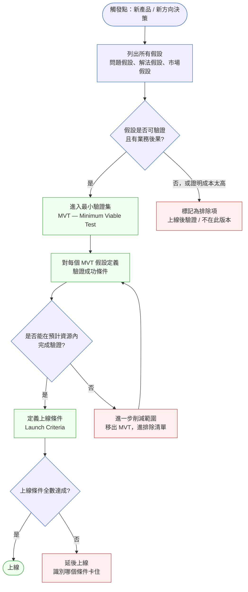
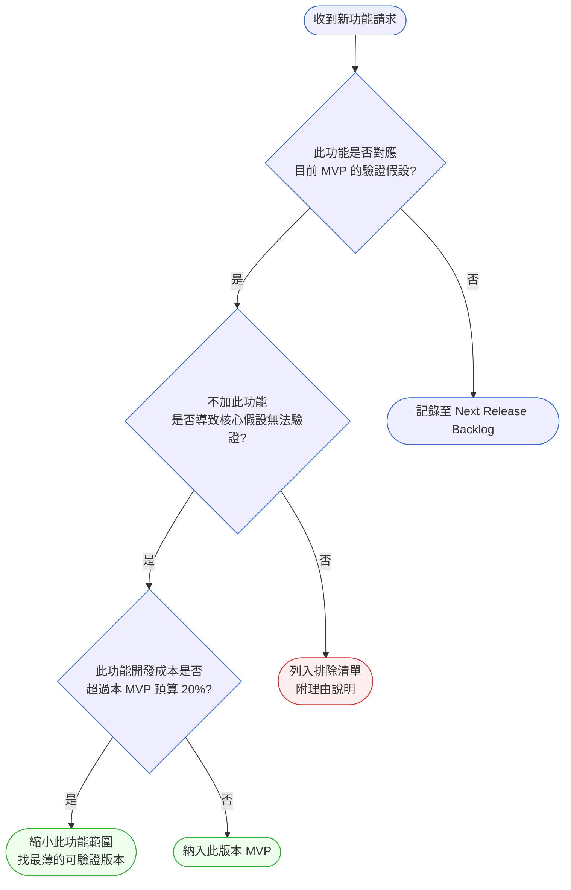

# 第 13 章 | MVP Design：最小可驗證的邊界

> **前置閱讀**：[Ch 12 Acceptance Criteria：驗收標準的精確度](./ch-12-acceptance-criteria.md)
> **下游章節**：[Ch 14 Product Roadmap：承諾的邊界](../part-03-planning/ch-14-product-roadmap.md)
> **相關章節**：[Ch 5 Prioritization Frameworks](../part-01-foundation/ch-05-prioritization.md) ⸺ MVP 排除決策需要優先順序框架支撐；[Ch 11 User Story Mapping](./ch-11-user-story-mapping.md) ⸺ Jobs-to-be-Done 假設的原始來源
>
> **SA/SD 對照**：[SA/SD 第 13 章｜架構風格實戰](../../book/part-03-design/ch-13-architecture-styles.md)
> ⸺ SA 視角關注哪個架構風格能最快搭起可驗證的技術基礎；本章關注哪些假設最值得用最小成本驗證，以及誰有權排除不驗的部分。

---

## §13.1 冷觀察

第六週的 sprint review，GridSense 的 PM 林曉晴打開 Jira，盯著那個數字看了三秒：backlog 從六週前的 34 條，長到了 61 條。會議室裡沒有人覺得不對勁——每一條都是大家一起決定加進去的。

原本的計畫乾淨得像一句話：六週，做一個能讓電網調度員看到即時負載熱點的儀表板。要驗證的假設只有一個——「調度員每天的決策盲點，在於不知道哪個節點正在逼近臨界值」。驗證方式清楚到不需要解釋：找五個調度員，把儀表板擺在他們面前，看他們會不會用上面的數字做決定，而不是像現在這樣打電話到變電所人工確認。

第一週還好。第二週，Sales 拿著一份客戶訪談紀錄走進來，語氣輕鬆：「他們還想要歷史趨勢對比，看七天三十天的曲線。」林曉晴點頭，「不大，兩天的事。」加進去。

第三週，一個大客戶在 demo 後皺眉：節點顯示太粗了，要能鑽到「配電線路等級」。這話帶著三百萬合約的重量，沒有人接得住「不行」。加進去。

第四週的架構評審上，CTO 李明達靠在椅背上說：「既然都有歷史資料了，不如順手把 EMS（Energy Management System，能源管理系統）的 API 接一下，以後擴充方便。」一句「以後方便」聽起來像遠見，不像範圍蔓延。加進去。

第五週，Sales 又來了，這次帶著好消息：約到一個試用客戶，上線前若能加一個「異常告警推播」，演示會更有說服力。誰會拒絕一個讓 demo 更漂亮的功能？加進去。

每一條都合理。把任何一條單獨拎出來，林曉晴都找不到拒絕的理由——拒絕反而顯得像在阻礙進度、像不夠重視客戶、像沒有技術遠見。

然後是第十二週。MVP 仍未上線。那個唯一真正重要的假設——調度員到底會不會用熱點數字取代電話——從第一天到現在，從未被任何一個真實使用者測試過。開發團隊熬紅了眼，功能列表壯觀得可以當產品手冊，但這個產品還沒有一個真實使用者按下過第二次登入。

而那個在第二週問「歷史趨勢對比」的大客戶，林曉晴後來才知道，已經在第九週簽了競品。她們花六週為它加的功能，它一個都沒等到。

## §13.2 真問題

把 GridSense 的故事攤開，最容易得出的結論是「範圍管理失控」。這個結論不算錯，但它是症狀，不是病因。每一個範圍管理失控的團隊背後，都藏著一個更具體的、可以被定位的決策結構缺陷。我們用三層拆解把它挖出來。

### 三層拆解

### 表面需求（What）

先承認一件事：GridSense 加進去的每一個功能，本身都是真實的需求。歷史趨勢對比確實有調度員想看；配電線路細節確實對某些場景有用；異常告警推播確實能讓 demo 更生動。如果我們停在「這些需求是真是假」這一層，會永遠找不到問題——因為它們全是真的。

真正該問的不是「這個需求真不真」，而是「這個需求是否應該在這個時間點、用這個方式、被納入這一版」。需求的真實性是必要條件，不是充分條件。GridSense 的災難不是來自假需求，而是來自把所有真需求都當成「現在就要做」的需求。

### 業務目標（Why）

GridSense 這個六週 MVP 存在的理由，從來不是「做出一個儀表板」。它的業務目標是**用最小成本回答一個會影響公司方向的問題**：調度員會不會改變決策行為？如果會，這個產品有商業基礎；如果不會，公司需要在燒掉一年研發預算之前知道。MVP 的本質是一台縮短學習迴圈的機器，它的產出不是功能，是**學習**。

我們用 Outputs / Outcomes / Impact 三角把這個目標拆開，立刻能看出 GridSense 量錯了什麼：

| 層次 | 定義 | GridSense 想要的 | 六週後實際的 |
|---|---|---|---|
| **Outputs** | 我們做了什麼（功能、畫面、程式碼） | 一個夠用的熱點儀表板 | ✅ 功能從 10 條膨脹到 37 條 |
| **Outcomes** | 使用者行為變了嗎（採用、留存、決策改變） | 調度員用熱點數字取代電話判斷 | ❌ 零個真實使用者，行為從未被觀察 |
| **Impact** | 業務指標移動了嗎（續約、採購、營收） | 客戶願意付費或承諾採購 | ❌ 大客戶第九週簽了競品 |

這張表是整章的縮影：**Outputs 那一格越填越滿，Outcomes 和 Impact 兩格從第一天到第十二週紋風不動**。團隊每天都很忙、每週都有交付，但忙的全是 Outputs。每加一個功能，看起來是在「往前推進」，實際上是在**往後推遲那個唯一重要的 Outcomes 驗證**。

要分辨自己是在推進還是在推遲，有一個簡單的測試：問「這個功能完成後，我們會比現在更接近知道核心假設成不成立嗎？」歷史趨勢對比完成後，林曉晴並不會更知道調度員會不會用熱點數字——所以它是推遲，不是推進。這個測試是 §13.3 整個決策框架的種子。

回到三角的收束問題：**我們原本想改善的是 Outcomes 還是 Impact？我們在量的是哪個？** GridSense 想要的是 Impact（採購），路徑必須先經過 Outcomes（行為改變），但它整整六週只量了 Outputs（功能數）。三層全部錯位，而錯位的代價在第九週由競品代收。

### 決策瓶頸（Who × When）

前兩層解釋了「量錯了什麼」，但還沒回答「為什麼會持續錯六週都沒人喊停」。答案在第三層，也是最關鍵的一層：

**沒有任何一個人，握有說「不」的權力與依據。**

拆開每一次加功能的瞬間：Sales 帶來需求，理由是客戶聲音，充分；CTO 提技術建議，理由是長期架構，良善；大客戶反映需求，背後是合約金額，真實。每一次，提案的人都有充分的「為什麼要做」，而桌子另一邊的 PM，手上沒有任何一份可以指著說「這就是我們講好不做的理由」的文件。於是每一次拒絕都得在當下臨場發明理由，而臨場發明的理由永遠贏不過「客戶都開口了」。

這就是決策瓶頸的精確位置——不是「需求太多」（需求永遠會太多），而是「**從來沒有人顯式地定義過：哪些假設必須在這一版先驗證，哪些可以等到上線之後再說，以及誰有權做這個切分**」。這個切分動作沒有 owner，於是它就不存在；它不存在，範圍就只能無限擴張。

### 用 DACI 定位失控的角色

決策瓶頸的問題，本質是角色錯置的問題。MVP 的範圍邊界不是 PM 一個人想清楚就能守住的事，它需要一個被明確指派的 DACI：

| 角色 | 全稱 | 應該是誰 | 職責 |
|---|---|---|---|
| **D** Driver | 推動者 | PM 林曉晴 | 推動假設清單討論、維護排除清單、把每個請求對應到假設 |
| **A** Approver | 拍板者 | CPO 張文哲 | 對「這一版不做哪些」做出最終、書面的拍板 |
| **C** Contributor | 貢獻者 | Engineering Lead、Sales Lead | 提供技術風險與市場信號，**但不做最終決定** |
| **I** Informed | 被通知者 | CTO、大客戶 Account Manager | 決策後被告知，**非決策前需取得同意** |

把 GridSense 的實況疊上這張表，失控的機制一目了然：**Approver 角色實質缺席**。CPO 從沒在哪一次加功能的瞬間出現拍板。而 Approver 一旦缺席，權力不會消失，它會流向最近的、聲音最大的 Contributor。於是 Sales 帶來一句「客戶說要」就能讓功能直接進 sprint——這等於把 A 角色，悄悄讓渡給了市場噪音。CTO 一句「以後方便」能改寫範圍，等於 Contributor 越位行使了 Approver 的權力。

§13.2 的收束：**GridSense 的問題從來不是「做了太多」，而是「從沒有人被指派去定義並守護那條『驗哪個假設才算完成這一版』的線」**。沒有這條線，沒有守線的人，Outcomes 就永遠只能當 Outputs 的附屬品，而學習迴圈——MVP 唯一的產出——永遠不會閉合。

---

## §13.3 決策框架

如果只能把這一章濃縮成一個動作，那就是：**把「假設清單」和「功能清單」拆成兩份東西**。功能是交付物，假設才是 MVP 存在的理由。團隊習慣盯著功能清單跑，是因為功能具體、可估點、可勾選；但盯著功能跑，就會像 GridSense 一樣，功能全做完了卻一個假設都沒驗。先驗假設，驗完再談下一批功能——這是整個框架的軸心。

下面五個工具，從流程、決策樹、決策表到現場速判與交接策略，是為了在不同的場合（規劃時、收到請求時、planning 桌上、走廊被攔下時）都有東西可以拿出來指著用。請注意：它們教你的是**怎麼判斷**，不是替你給出每個情境的標準答案——同樣的功能在不同公司、不同階段，落點會不同，框架的價值在於讓判斷的依據被攤在桌面上，而不是藏在 PM 的直覺裡。

### 圖 A — MVP 工作流程：從假設到上線條件



這張流程圖刻意把「假設」放在最上游，把「功能」藏在「最小驗證集（MVT, Minimum Viable Test，最小可驗證測試）」這個盒子裡——順序就是訊息：**先有假設，才有功能**。

整張圖的命運，幾乎都決定在第一個菱形 B：**這個假設「可驗證且有業務後果」嗎？** 這是一個雙條件閘門，兩個條件缺一不可。「可驗證」是說：你能設計出一個可觀察的指標，告訴你假設成立與否；連測都沒辦法測的，不該占 MVP 的資源。「有業務後果」是說：如果驗證結果是否定的，公司的決策會因此改變；如果無論結果如何公司都照原計畫走，那這個驗證就沒有意義。

把 GridSense 第三週的「配電線路細節」丟進閘門 B 走一遍：它背後的假設是什麼？大概是「調度員需要線路級的顆粒度才能做判斷」。可驗證嗎？勉強可以。但問下一個問題——如果驗證發現他們不需要這個細節，公司會改變什麼決策嗎？不會，因為核心假設（會不會用熱點數字）根本還沒驗，線路顆粒度是第二層的問題。所以它在閘門 B 就該被擋下，流進右邊那條紅色路徑：標記為排除項，上線後再說。GridSense 的悲劇，是這個閘門從來沒有被啟用過——所有請求都直接跳過 B，衝進 MVT 盒子。

流程後段還有第二道防線在菱形 F：**這些 MVT 假設，真的能在現有資源內驗完嗎？** 答案若是「不能」，正確動作不是加班加人，而是循著 F→G→E 的迴圈，把範圍再砍一刀，把最不關鍵的假設移進排除清單。MVP 的「最小」不是一次定好的，是在資源約束下反覆削出來的。

### 圖 B — 功能納入決策樹

圖 A 處理的是「規劃整個 MVP 時的宏觀流程」；圖 B 處理的是更高頻的微觀時刻——**走廊上、planning 會議中，有人遞來一個新功能請求**，你三十秒內要給出去向。



這棵樹的分支邏輯值得逐個菱形讀：

- **Q1「對應到 MVP 的驗證假設嗎？」** 是第一道、也是淘汰率最高的閘門。答「否」的請求，不是被丟掉，而是流向 OUT2「記錄至下一版 backlog」——重點在於它被**記錄**了，不是被遺忘了。GridSense 的歷史趨勢、配電線路細節，在這一格就該左轉。
- **Q2「不加它，核心假設就驗不了嗎？」** 是對通過 Q1 者的反向壓力測試。就算一個功能「對應」到假設，也要再問：拿掉它，假設真的就驗不成嗎？答「否」（拿掉照樣驗得了）的，流向 OUT3「列入排除清單」——它是「相關但非必要」，這格抓的就是這種看似有理、其實可省的功能。
- **Q3「成本超過 MVP 預算 20% 嗎？」** 是最後的剪裁閘門。一個確實必要的功能，如果太貴，答案不是照單全收（OUT1），而是 OUT4「找最薄的可驗證版本」——最少的欄位、最粗的顆粒度，甚至先用人工流程頂著。

特別把目光停在 OUT3 這個紅色終點：「**列入排除清單，附理由說明**」。這不是垃圾桶，是一份要被維護的清冊。**排除清單和功能清單一樣重要，甚至更重要**——因為功能清單代表你做了什麼，排除清單代表你刻意沒做什麼、以及為什麼。GridSense 從沒維護這份清單，所以每次被問「這個功能為什麼沒有」，林曉晴都得從零重新解釋一遍脈絡，消耗溝通成本，更糟的是，每一次拒絕都像是一次孤立的、個人的、可被質疑的判斷，而不是一個有共同依據的團隊決定。

### 決策表：五種真實情境下的範圍決策

流程圖給的是骨架，但現場的請求總是包裝在具體的人和情境裡。下面把 GridSense 場景以及它的延伸，整理成五種高頻情境，每種都標出推薦做法、PM 真正該盯的點、以及最常見的踩法：

| 情境 / 觸發條件 | 推薦做法 | PM 關注點 | 常見錯誤 |
|---|---|---|---|
| Sales 帶來「大客戶強烈要求」的功能 | 問：這對應 MVP 的哪個假設？若無，記入下一版 backlog，並**書面**告知 Sales 理由與重評時間 | 這是「一個客戶的一次回饋」還是「多個客戶的共同問題」？單客戶訴求需要降權 | 把單一客戶訴求直接翻譯成功能，跳過假設對應這一步 |
| CTO / Engineering 提「以後擴充方便」的技術功能 | 分離技術設計與功能邊界：架構層**可以預留介面**，但 MVP **不交付該功能** | 確保「預留介面」不悄悄演變成「先把功能做出來再說」 | 把技術建議當成功能擴充的理由，讓架構驅動了 MVP 邊界 |
| 上線前演示需求（讓 demo 更有說服力） | 問：這在驗證假設，還是在美化演示？若是後者，用 mock / prototype 替代真實實作 | 區分「驗證用的真功能」與「展示用的視覺功能」 | 為了 demo 效果做真實功能，但它不在任何驗證假設範圍內 |
| 多個假設競爭有限的 sprint 容量 | 用「**驗證失敗的代價**」排序：失敗後果最嚴重的假設優先驗 | 高代價假設（市場不存在、監管不過）優先於低代價假設（使用偏好微調） | 用開發難度或 stakeholder 喜好排序假設，忽略業務後果 |
| MVP 上線後發現部分假設驗得不夠透 | 上線後補做 A/B test 或快速使用者訪談，**不回退重做** | 接受「不完美但及時的驗證」勝過「完美但遲到的驗證」 | 因驗證不夠完整而延後下一個 sprint，苦等完美數據 |

這張表沒有給你「歷史趨勢功能該不該做」的標準答案——因為答案取決於它對應哪個假設、你在哪個階段。它給你的是**問對問題的順序**：先問假設對應，再問必要性，最後才問成本。GridSense 缺的不是答案，是這個提問順序。

### If-Then 框架：MVP 邊界速判規則

決策樹適合會議桌，但有時你需要的是更快的、能背在腦子裡的規則。把圖 B 的邏輯壓縮成七條 If-Then，方便在沒有白板的場合直接調用：

- **If** 功能 X 移除後，MVP 仍能回答核心假設 → **Then** X 進排除清單，標記「Next Release：Phase 2」（對應圖 B：Q2 → OUT3）
- **If** 功能 X 的開發時間 > MVP 剩餘時間的 30% → **Then** 找 X 的最薄版本：最少欄位、最粗顆粒度、甚至手動 workaround（對應圖 B：Q3 → OUT4）
- **If** 功能 X 的加入不改變任何使用者行為，只是讓產品「更完整」 → **Then** X 是 feature 不是 MVP 元件，延後到 V1.1 第一個 sprint（對應圖 B：Q1 → OUT2）
- **If** 假設 A 的驗證依賴假設 B 先成立 → **Then** 先驗 B；B 若否定，A 的功能直接進排除清單，省去開發成本
- **If** 功能 X 的完成是另一個團隊下一個 sprint 的 input → **Then** 不能排除；列為「協作依賴項」，並提前 2 週通知下游團隊時程
- **If** 一個功能同時對應多個假設（H-01 且 H-02）→ **Then** 只要其中一個假設必驗，功能就留；但設計最薄的版本，夠驗其中一個就好，不為另一個鍍金
- **If** 大客戶明確要求某功能，但它不對應任何 MVP 假設 → **Then** 把它從「功能決策」轉為「合約談判」：若客戶要求寫進合約，升級到 Approver 層級決定；若只是「希望有」，書面告知重評時間，不進本版

這七條規則覆蓋了 GridSense 場景裡大部分的加功能瞬間，以及兩種原版未覆蓋的情境：假設之間有依賴（Rule 4）、跨團隊協作依賴（Rule 5）、多假設功能的設計薄度（Rule 6）、客戶要求的升級路徑（Rule 7）。它們真正的用處不在「算出」答案，而在於——當 Sales 第六次走進來時，林曉晴手上有一張可以**指著說**的表，而不是只能臨場硬擠出一個聽起來像在阻礙進度的拒絕。把判斷依據外顯成一張表，拒絕就從「PM 的個人意見」變成「團隊講好的規則」，這正是 §13.2 那個缺席的 Approver 留下的真空，需要被框架填上。

### 假設工作坊：同步與非同步版本

假設清單不是 PM 一個人閉門想出來的——它需要 Engineering 提供可行性輸入、Sales 提供市場信號、UX 提供使用者洞察。一個 30 分鐘的假設工作坊能讓這些輸入在同一個時間點被整合，避免之後各自發炮。

**同步版（適合同地辦公或小型遠端會議）**

流程共四步，全程 30 分鐘：

1. **靜默寫假設（8 分鐘）**：每人拿一張便利貼（或虛擬白板卡片），寫下「我們相信 [使用者行為]，因為 [業務理由]，驗證方式是 [可觀察指標]」。每人至少寫 3 條。
2. **分組歸類（5 分鐘）**：PM 把所有假設貼到白板，依問題假設 / 解法假設 / 市場假設三欄分類。重複的合併。
3. **影響力 × 可驗成本評分（10 分鐘）**：每人 3 票，投給「驗錯了代價最高」的假設；Engineering Lead 標記每個假設的粗略驗證成本（S/M/L）。
4. **鎖定 MVP 假設集（7 分鐘）**：PM 根據票數和成本，劃出「本版要驗」與「本版不驗」的線。未入選的立刻進排除清單。

**非同步版（適合分散時區的遠端團隊）**

同步版的假設工作坊建立在「所有人同時在線」的前提上。分散在三個時區的團隊，這個前提不成立。非同步版把同樣的步驟拉成 48 小時的文件流：

| 時間點 | 動作 | 工具 |
|---|---|---|
| D+0 08:00 | PM 在共享文件建立假設表格，填入格式範本與 2 條種子假設，@所有人請在 24 小時內填寫 | Notion / Confluence |
| D+0 到 D+1 | 各自在文件填入假設句；Engineering Lead 在每條假設旁標記驗證成本（S/M/L） | 同上 |
| D+1 08:00 | PM 關閉填寫，整理去重，在每條假設加上投票欄位（emoji 反應或 thumbs up），請所有人在 8 小時內投票 | Slack 投票 / Notion 評分 |
| D+1 EOD | PM 根據票數和成本畫線，產出「本版假設集」草稿，在非同步頻道宣布，給 24 小時窗口讓人提異議 | Slack 公告 |
| D+2 EOD | 無重大異議則定案；有異議則 PM 決定是否需要一次 30 分鐘的同步會議處理 | 視情況 |

非同步版的核心是「決定有截止日期」。沒有截止日期的非同步討論會無限拖延。PM 的職責是守住每個步驟的時間閘，讓假設清單在 48 小時內定案，而不是在 Slack 裡漂流兩週。

### 速查：從 JTBD 到假設類型

假設清單需要一個系統化的來源，否則你只是在寫一份直覺清單。Jobs-to-be-Done（JTBD，工作待完成理論）是最有效的假設生成框架之一，它從「使用者在特定情境下試圖完成什麼工作」這個問題出發，能自然地產出三種假設。

JTBD 的格式是：「當 [情境] 時，我想要 [動機]，這樣我才能 [目標]」。把這個句子拆解，可以直接對應到三種假設類型：

| JTBD 元素 | 對應假設類型 | GridSense 範例 |
|---|---|---|
| [情境]：使用者在什麼時候遇到這個工作 | **問題假設**：這個痛點真的存在且足夠頻繁 | 「當節點負載接近臨界值時」→ H-01：調度員每天 ≥3 次需要即時判斷 |
| [動機]：使用者想用什麼方式完成這個工作 | **解法假設**：我們的解法能讓他們完成這個工作 | 「我想要即時看到哪個節點有問題」→ H-02：熱點視覺化取代電話確認 |
| [目標]：完成後使用者得到什麼 | **市場假設**：夠多的人有這個工作，且願意採用新工具 | 「這樣我才能快速做調度決策」→ H-03：調度員願意在流程外主動登入使用 |

從 JTBD 句子生成假設的好處是：它讓「假設從哪來」有跡可循。如果有人在 sprint review 質疑「H-02 這個假設是怎麼來的」，PM 可以指著訪談紀錄裡那句 JTBD 句子，而不是說「我覺得使用者需要這個」。（JTBD 訪談方法詳見 [Ch 11 User Story Mapping](./ch-11-user-story-mapping.md)）

### 速估驗證工作量：假設可行性檢查表

圖 A 的菱形 F（「是否能在預計資源內完成驗證？」）是整個流程裡最容易被草率跳過的一步——PM 說「應該可以」，Engineering 說「我們試試看」，然後四週後發現假設 H-02 的觀察設置就花了整整兩週。

在進入 sprint planning 之前，對每個假設做一次粗略的可行性估算，能讓「應該可以」變成一個有數字支撐的判斷：

| 假設 ID | 驗證所需工作 | 粗估時數 | 誰負責 | 在 X 週內可行？ |
|---------|-------------|---------|--------|----------------|
| H-01 | 訪談 5 位調度員（每次 60 分鐘）+ 訪談分析 | 10h | PM | ✅ 1 週 |
| H-02 | 操作日誌埋點（後台）+ 2 週觀察窗口 | 前端 20h + 後端 30h + 等待 2 週 | Engineering | ⚠️ 佔 8 週中的 4 週 |
| H-03 | 分析登入日誌（工具已有）| 2h | PM | ✅ 當週 |

GridSense 範例：如果 H-02 的埋點需要 50h 工程時間，而 Engineering 每週可用 capacity 是 60h（扣除其他工作後），那 H-02 的驗證設置就要花掉幾乎一整週的 Engineering capacity。這個數字如果在 sprint kickoff 前就擺在桌上，PM 就能做出有依據的選擇：縮小 H-02 的觀察範圍（只追蹤關鍵點擊，省去全面日誌）、還是把 H-03 移出本版（它不需要工程時間，可以 Phase 2 再做）。

**使用這張表的三個規則**：
1. 粗估不求精確，誤差 50% 可以接受；不做估算才是真正的風險。
2. Engineering Lead 必須當場確認這個數字，PM 不能單方面估工程工作量。
3. 如果所有假設的驗證工作量加總 > 80% 的 sprint capacity，就要削減假設數量，不是增加加班。

### MVP 上線條件清單（Launch Criteria）

最後一塊拼圖，回答的是 GridSense 自始至終沒人能回答的那個問題：**到底做到什麼程度，這個 MVP 才算「可以上線」？** 答案必須在設計階段就定好，不能拖到上線前一週才臨時開會討論——因為到那時，討論的結果一定會被「再加兩個功能客戶會更滿意」綁架。

一份有效的 Launch Criteria 包含三類門檻，缺一不可：

| 類型 | 它在守護什麼 | 範例 | 注意點 |
|---|---|---|---|
| **假設驗證門檻** | MVP 的學習目標達成了 | 「5 位調度員中至少 3 位，在 3 個工作日內主動用熱點數據做決策」 | 數字必須在上線**前**定義，不能事後為了過關而調低 |
| **技術準備度門檻** | 產品不會在驗證期間因技術問題自爆 | 「資料延遲 ≤ 5 秒、99% 可用性、無需手動重啟」 | 與 Engineering Lead 共同定，不是 PM 單方面拍 |
| **業務準備度門檻** | 有真實使用者承諾接住這次上線 | 「至少 1 個目標客戶同意試用，並指定 2 週內的回饋窗口」 | 沒有真實使用者承諾就上線，等於上線給空氣看，學不到東西 |

三類門檻對應三種會讓 MVP 白做的失敗模式：假設沒驗到、技術撐不住、沒人來用。GridSense 一類都沒定義，於是它同時踩中了三個——產品做完了，但沒有人知道「完成」的定義是什麼，也就沒有人知道什麼時候該停止加功能。當「完成」沒有被定義，「加更多」就成了唯一還能做的事。

#### 上線條件未達時的決策路徑

Launch Criteria 定義清楚還不夠——還要預先定好「如果沒達到，怎麼辦」。這個問題在上線前一週才問，永遠沒有好答案；在 MVP 設計時就問，才能給出有共識的路徑：

| 未達狀況 | 觸發條件範例 | 推薦行動 | 不推薦的行動 |
|---|---|---|---|
| 假設驗證門檻差距小（< 20%）| H-02 達成率 50%，目標 60% | 延長觀察窗口 1 週，不新增功能 | 倉促上線，說「差不多了」 |
| 假設驗證門檻差距大（> 40%）| H-02 達成率 30%，目標 60% | 召開假設復盤：是假設本身錯了（需要 pivot），還是驗證方式錯了（需要重設計）？ | 加功能試圖提高數字 |
| 技術門檻未達 | 延遲 P95 = 12 秒，目標 5 秒 | 縮小上線範圍（只開放給 1 位調度員），讓技術問題在真實場景下被觀察並修復 | 讓所有使用者碰到不穩定的系統 |
| 業務門檻未達（沒有客戶同意試用）| 接觸 3 家客戶，全數婉拒 | 把這個拒絕本身視為市場假設的驗證結果：H-03（使用意願）可能已被否定。召開方向討論，而不是繼續開發 | 繼續開發，等待「更好的時機」 |

這張表的核心訊息：**「未達」本身是學習，不是失敗**。問題是從「未達」中學到了什麼，以及下一步是延伸、調整、還是放棄。讓這個路徑在設計階段就被定義，比在失敗的那一刻才現場決定，少了大量的政治和情緒成本。

### 假設驗證與 OKR 的串接

MVP 的假設驗證結果不是孤立的學習——它應該餵入下一季的 OKR 決策。以下是 GridSense 如果當時有做這個串接，OKR 層次如何讀取 MVP 結果：

| MVP 假設結果 | 對 OKR 的影響 | 下季 OKR 調整方向 |
|---|---|---|
| H-02 通過（調度員確實改變行為）| 核心假設成立，產品方向確認 | O：擴大採用率至 3 家客戶；KR：月活調度員數 ≥ 20 |
| H-02 部分通過（40% 改變行為，目標 60%）| 解法方向對，但工具設計需優化 | O：提升工具易用性；KR：決策使用率從 40% → 65%；追加使用者研究 Sprint |
| H-02 未通過（< 30% 行為改變）| 解法假設錯誤，需要 pivot | O：重新定義「調度員最高頻的痛點」；KR：完成 10 次深度訪談，產出新假設集 |
| H-03 未通過（使用者不願主動登入）| 市場假設可能錯誤，或 GTM 方式需調整 | O：重新評估推廣策略；KR：釐清「強制 vs. 自願」採用的業務可行性 |

這張表的用法是：**MVP 設計完成後，立刻預寫三個版本的下季 OKR 草稿**（成功、部分成功、失敗各一）。有了這個預寫，當 MVP 結果出來時，你不需要從頭重想下季方向——你只需要選哪一個版本，並微調數字。這讓 MVP 的學習迴圈直接連進季度決策，而不是束之高閣的「產品實驗報告」。

---

## §13.4 踩坑清單

### 反模式：功能即假設

**現象**：PM 規劃 MVP 時直接列功能清單，沒有對應的假設清單。團隊心照不宣地把「功能做完」等同於「MVP 完成」。

**根因**：功能比假設具體得多——它能被工程師估點、被 stakeholder 在會議室裡審查、被 Jira 勾選。假設是抽象的、帶不確定性的，在一個追求「可交付」的會議文化裡，假設很難被接受為一個正當的「工作項目」。於是團隊本能地把假設翻譯成功能，然後把假設丟了。

> **修正方向**：在 sprint planning 之前，先做一次假設工作坊（見 §13.3 同步 / 非同步版本）：把每個候選功能反推回它背後的假設句，固定格式是「我們相信 [使用者會有某行為]，因為 [業務理由]，驗證方式是 [可觀察的指標]」。寫不出這句話的功能，不該進 MVP——它要麼不重要，要麼你還沒想清楚它為什麼重要。

---

### 反模式：排除清單沒有書面記錄

**現象**：PM 口頭拒絕了某個功能請求，但沒留下任何文件。三週後，同一個 stakeholder 換個說法再提一次，PM 被問「上次你到底怎麼說的」時，已經還原不出當時的脈絡，只好重新討論一遍。

**根因**：PM 把「拒絕」當成一次性的當下溝通，而不是一個需要被追蹤、被引用的決策記錄。拒絕一旦沒被寫下來，在組織記憶裡就等於沒發生過。

> **修正方向**：在 MVP 設計文件裡固定維護一個「不在此版本」區塊，每條記錄四個欄位：功能名稱、請求來源、排除理由、預計重評時間點。這份清單最大的價值是政治性的——它讓 Sales 和 stakeholder 看見「PM 記得這件事」，他們的需求不是被遺忘，而是被**有意識地、有時間表地延後**。被記錄的延後，遠比被遺忘的拒絕，傷害小得多。

---

### 反模式：上線條件在上線前才定義

**現象**：MVP 開發完成，PM 在最後一週才召集會議討論「這樣算不算可以上線」。Engineering 說技術沒問題，Sales 說再加兩個功能客戶會更滿意，PM 手上沒有任何標準可以依循，只能讓聲音最大的人決定。

**根因**：在 MVP 設計階段，所有人的注意力都在「做什麼」，沒有人關心「怎麼判斷做完了」。上線條件的討論被無限推遲，因為它不是當下緊迫的工作——直到它變成最緊迫、卻已經來不及好好討論的工作。

> **修正方向**：Launch Criteria 必須和假設清單**同步**定義，兩者放進同一份文件。並在 sprint kickoff 時，就讓 Engineering Lead 和 Sales Lead 當場確認過這份 Launch Criteria——讓它成為一份多方事前接受的合約，而不是 PM 事後單方面的、隨時可被推翻的判斷。

---

### 反模式：Prototype 被當作 MVP

**現象**：為了快速向客戶展示，團隊做了一個外觀完整、後端寫死的 prototype。客戶反應熱烈，PM 一高興，決定「這版就當 MVP 繼續往下做」。

**根因**：prototype 的熱烈反應驗證的是「外觀」和「概念是否被理解」，不是「使用者是否真的改變行為」。把前者當成後者，會讓後續所有功能決策都建立在一個錯誤的成功信號上——你以為驗證過了，其實只驗證了「它看起來不錯」。

> **修正方向**：明確區分 prototype 的兩種用途。它適合驗證解法假設的**入口**（「使用者理解這個概念嗎」），但不能替代解法假設的**出口**（「使用者真的改變行為了嗎」）。在 prototype 展示後，主動對 stakeholder 說清楚：「這是概念驗證，不是行為驗證。我們接下來真正要驗的，是 [那個行為假設]。」

---

### 反模式：MVP 沒有「最大邊界」

**現象**：PM 定義了 MVP 的最小功能集，卻沒定義「加了哪些東西之後，它就不再算 MVP 了」的上界。結果每加一個功能，都被順理成章地重新定義為「MVP 的一部分」，最小邊界跟著一路漂移。

**根因**：MVP 的精神是「最小」，但「最小」這個下界，在組織內部完全擋不住「再多一點點」的持續壓力。只設下界不設上界，就像只在地板畫線卻沒有天花板——水位只會一直漲。GridSense 整個故事，就是一個沒有上界的 MVP 從 10 條漲到 37 條的過程。

> **修正方向**：在 MVP 設計文件最頂端，明寫一行硬上界：「MVP 最大工期：X 週／最大功能數：Y 條」。這個上界的特性是——它**不能被「合理的新需求」突破**，只能被「重新規劃一次 MVP」這個動作取代。GridSense 若當初寫下「第八週仍未上線，即強制重評 MVP 定義」，大概在第六週就會被迫做一次範圍重置，而不是一路滑到第十二週。

---

### 反模式：沒有量測設置就上線

**現象**：MVP 上線了，兩週後 PM 想看「H-02 調度員使用熱點數字做決策的比率」，才發現後台沒有任何操作日誌，無法分辨使用者是在看數字後做決定還是打電話後才開儀表板確認。

**根因**：假設的驗證需要可觀察的指標，但可觀察的指標需要主動設計的量測基礎設施。PM 在定義假設時只想到「觀察什麼」，沒有同步跟 Engineering 確認「這個觀察要怎麼實作」。

> **修正方向**：對每個假設，在假設清單完成後立刻追加「量測設計欄」，包含三項：① 觀察指標（要看什麼）② 資料來源（從哪裡取數字）③ 隱私合規確認（這個資料是否符合客戶的資料使用協議）。只有三欄都填得出來的假設，才算定義完整。GridSense 的 H-02 完整版應該是：觀察指標「調度決策行為改變率」、資料來源「後台操作日誌（點擊序列 + 時間戳）」、合規確認「電網設備操作日誌不含個人識別資料，符合試用協議第 3.2 條」。如果後台沒有現成的日誌，Engineering 在 sprint kickoff 就需要把「埋點設置」列為 Day-1 的工作項目，而不是上線前的亡羊補牢。

---

### 反模式：假設清單沒有使用者的聲音

**現象**：PM 和 Engineering 在辦公室用白板列出假設，沒有任何來自目標使用者的直接觀察。假設清單看起來很完整，但每一條都是內部推測。

**根因**：假設工作坊的參與者全是公司內部人，沒有任何直接接觸使用者的設計。內部人對使用者痛點的理解，是二手的、過濾過的，常帶有「產品人的偏見」——傾向於相信使用者需要你正在做的東西。

> **修正方向**：假設清單定稿前，至少完成 3 次使用者訪談（即便是非正式的 15 分鐘通話），讓每條假設都對應到至少一句使用者的原話。如果實在無法在定稿前完成訪談，在假設清單上明確標記「待使用者訪談確認」，並把第一次訪談排進 sprint 第一週的計畫——而不是 MVP 上線後才開始做使用者研究。

---

### 反模式：企業客戶合約把所有功能變成「非必要排除」

**現象**：PM 把一個功能排進排除清單，理由是「不對應核心假設」。但隔天 Sales 說，這個功能明確寫在和大客戶的 PoC（Proof of Concept，概念驗證）合約裡，不做就違約。

**根因**：MVP 假設框架設計給的是「可以選擇做什麼」的情境。在企業 B2B 環境裡，部分功能是合約義務，不是假設驗證，用假設邏輯去排除它是概念錯誤。

> **修正方向**：在 MVP 設計之初，先把所有功能分成兩桶：**合約義務桶**（不做就違約）和**假設驗證桶**（我們選擇去驗的）。假設框架只管驗證桶；合約義務桶不走假設排除流程，直接進 MVT Scope，但標記為「合約義務，非假設驅動」。這樣做的好處是：你仍然知道合約義務功能的開發成本，也能衡量它佔用了多少原本可以驗假設的資源——這個資訊對下一次合約談判有參考價值（「上次 PoC 因為合約功能佔掉 40% capacity，導致核心假設未驗；建議下次 PoC 範圍明確排除 X、Y 功能」）。

---

## §13.5 交付清單 ⸺ 一頁式 MVP 設計文件模板

每一個 MVP，都需要一份能在 sprint review 裡讀完的設計文件。

**為什麼堅持「一頁」？** 因為這份文件的讀者是整個團隊和 stakeholder，不是 PM 自己的筆記。一旦超過一頁，它就會變成只有作者讀的歸檔文件，失去「對齊」這個唯一的存在理由。一頁的約束本身就是一種設計力量——它逼迫 PM 把假設收斂到能寫進一頁的程度。寫不進一頁，通常意味著假設還沒收斂，這版 MVP 還不該開工。

這份文件刻意被切成七個區塊，每個區塊都在守護 §13.2 揭露的某個失控環節，理解它們的存在理由比照抄格式更重要：

- **「MVP 目標」與「核心假設清單」**——對應 §13.2 的 Outputs/Outcomes 錯位。把目標寫成一句假設句、把功能反推成假設表，就是在文件第一行強迫團隊承認「我們做這版是為了**學到什麼**」，而不是「為了**做出什麼**」。
- **「最小驗證集」**——對應「功能即假設」反模式。它強制每個功能都標注對應的假設 ID，沒有假設可對應的功能，在這張表裡無處安放，自然就被擋在外面。
- **「排除清單」**——對應 §13.3 那個被低估的 OUT3。這是整份文件最容易被省略、卻最不該省略的區塊。它把「我們刻意沒做什麼、為什麼、什麼時候重評」變成白紙黑字，讓每一次拒絕都有共同依據，也讓 stakeholder 的需求「被記錄而非被遺忘」。
- **「上線條件 Launch Criteria」**——對應「上線條件臨時定義」反模式。把三類門檻和假設清單放進同一份文件、同一個時間點定義，它才不會在上線前一週被臨時拼湊、被聲音最大的人綁架。
- **「MVP 邊界上限」**——對應「沒有最大邊界」反模式。這一行字是整份文件的天花板，是唯一能對抗「再多一點」壓力的硬約束。
- **「DACI」**——對應 §13.2 最深的那層病因：Approver 缺席。把 Approver 的名字明確寫在紙上，就是不讓拍板權再次悄悄流向聲音最大的 Contributor。

理解了這六組區塊各自在防守什麼之後，再看下面的空白模板，每一欄就不再是格式要求，而是一道防線：

````markdown
# MVP 設計文件 ⸺ {產品名稱} / {版本代號}
> 版本:v0.1 | 撰寫日期:YYYY-MM-DD | 擁有人:{名字}

### 1. MVP 目標
一句話：這個 MVP 要回答什麼問題？
{問題假設描述：我們相信 [目標使用者] 面對 [痛點]，因為 [業務理由]}

### 2. 核心假設清單
| 假設 ID | 假設內容 | 類型 | 驗證方式 | 量測設計 | 成功門檻 |
|---------|---------|------|---------|---------|---------|
| H-01 | {假設句} | 問題/解法/市場 | {可觀察行為} | {資料來源 + 隱私合規} | {量化條件} |
| H-02 | ... | | | | |

### 2a. 驗證工作量估算
| 假設 ID | 驗證工作 | 粗估時數 | 負責人 | 在工期內可行？ |
|---------|---------|---------|--------|--------------|
| H-01 | {具體工作} | {Xh} | {PM/Eng} | ✅/⚠️/❌ |

### 3. 最小驗證集（MVT Scope）
此版本包含的功能 / 實驗：
- [ ] {功能 A}：對應假設 H-{XX}（合約義務 / 假設驅動）
- [ ] {功能 B}：對應假設 H-{XX}（合約義務 / 假設驅動）

### 4. 排除清單（不在此版本）
| 功能 / 請求 | 請求來源 | 排除理由 | 預計重新評估 |
|------------|---------|---------|------------|
| {功能名稱} | {Sales / CTO / ...} | {理由} | {Phase 2 / Q3 / 待驗證} |

### 5. 上線條件（Launch Criteria）
#### 假設驗證門檻
- [ ] {條件}（由誰確認：{角色}）

#### 技術準備度門檻
- [ ] {條件}（由誰確認：Engineering Lead）

#### 業務準備度門檻
- [ ] {條件}（由誰確認：Sales / Account Manager）

#### 未達時的路徑
| 未達情況 | 行動 |
|---------|------|
| 假設門檻差距 < 20% | 延長觀察窗口 {X} 天 |
| 假設門檻差距 > 40% | 召開假設復盤會議 |
| 技術門檻未達 | 縮小上線範圍至 {X} 使用者 |

### 6. MVP 邊界上限
工期上限：{X 週}（到期日：{YYYY-MM-DD}）
功能數上限：{Y 條}
超出時觸發：重新規劃 MVP 定義，非自動延期

### 7. DACI
| 角色 | 負責人 |
|------|--------|
| Driver（PM） | {姓名} |
| Approver | {姓名 / 職稱} |
| Contributor | {Engineering Lead、Sales Lead} |
| Informed | {CTO、Account Manager} |

### 8. 下季 OKR 預寫（三版本）
| MVP 結果 | O | KR |
|---------|---|---|
| 通過 | {目標} | {可量化 KR} |
| 部分通過 | {目標} | {可量化 KR} |
| 未通過 | {目標} | {可量化 KR} |
````

把它存在 `docs/product/mvp/`，跟程式碼同 repo，跟 README 同層。

### §13.5.1 範例：GridSense 第一版 MVP 設計文件

GridSense 在第二週就應該寫出這份文件。下面是它「如果當時有寫」的版本——拿它對照 §13.1 的場景，可以清楚看見哪些加功能請求，在圖 A 的第一個菱形就該被擋下。

````markdown
# MVP 設計文件 ⸺ GridSense / MVP-01「熱點儀表板」
> 版本:v0.1 | 撰寫日期:2026-02-15 | 擁有人:PM 林曉晴

### 1. MVP 目標
<!-- 為什麼這欄：把目標寫成問題假設，逼團隊承認「做這版是為了學到什麼」而非「做出什麼」 -->
問題假設：我們相信電網調度員每天面對節點臨界值判斷的決策盲點，
因為目前 EMS 系統沒有即時的節點負載熱點視覺化，
導致調度決策依賴人工電話確認，每次需要 15–30 分鐘。

### 2. 核心假設清單
| 假設 ID | 假設內容 | 類型 | 驗證方式 | 量測設計 | 成功門檻 |
|---------|---------|------|---------|---------|---------|
| H-01 | 調度員每天有 ≥3 次需要判斷節點臨界值的時機 | 問題假設 | 使用者訪談 + 操作日誌 | 訪談逐字稿 + 操作日誌點擊頻率（不含個人識別資料，符合試用協議 §3.2） | 5 位調度員中 ≥4 位確認 |
| H-02 | 熱點視覺化能讓調度員不打電話即完成判斷 | 解法假設 | 情境觀察：調度員用儀表板做決策的次數 | 後台操作日誌（點擊序列 + 時間戳 vs. 電話記錄對比）| 第一週 ≥60% 決策不需打電話 |
| H-03 | 調度員願意在正式流程外使用新工具 | 市場假設 | 自主登入次數（無強制要求） | 登入日誌（已有，無需新埋點）| 每位調度員每天平均 ≥2 次登入 |

### 2a. 驗證工作量估算
| 假設 ID | 驗證工作 | 粗估時數 | 負責人 | 在 8 週內可行？ |
|---------|---------|---------|--------|----------------|
| H-01 | 5 次使用者訪談（60min × 5）+ 訪談分析 | 10h | PM | ✅ Week 1 |
| H-02 | 後台埋點設計 + 實作（點擊序列日誌）| 50h（Engineering 確認）| Engineering | ⚠️ 佔 Week 1-2 的 Engineering capacity，需在 kickoff 前確認優先 |
| H-03 | 分析既有登入日誌 | 2h | PM | ✅ Week 2 |

<!-- Engineering Lead 陳俊豪 2026-02-15 確認：H-02 埋點估 50h，在 8 週 capacity 內可行，但必須是 Week 1 的第一個工作項目 -->

### 3. 最小驗證集（MVT Scope）
此版本包含的功能 / 實驗：
- [x] 即時節點負載熱點地圖（區域等級）：對應 H-01、H-02（假設驅動）
- [x] 節點臨界值警示色標（紅 / 黃 / 綠）：對應 H-02（假設驅動）
- [x] 操作日誌記錄（後台用，使用者不可見）：對應 H-02、H-03（假設驅動）

### 4. 排除清單（不在此版本）
| 功能 / 請求 | 請求來源 | 排除理由 | 預計重新評估 |
|------------|---------|---------|------------|
<!-- 為什麼這欄：把 Week 2–5 所有進來的請求都擋在這裡，讓開發團隊六週不被新功能拖著走 -->
| 歷史趨勢對比（7天/30天） | Sales（Week 2 客戶訪談） | H-01/H-02 驗證不需要歷史資料；加入會增加 3 週開發量 | MVP-01 上線後，H-01 確認後進入 Phase 2 |
| 配電線路等級細節 | 大客戶 A（Week 3）| 區域等級已足夠驗證 H-02；細節層需要新資料接介，未在本版預算內 | Phase 2 Sprint 1 |
| EMS API 雙向整合 | CTO（Week 4 技術建議）| 架構預留介面即可，MVP 不需雙向整合來驗證使用者假設 | 架構決策另行評估，非 MVP 範疇 |
| 異常告警推播 | Sales（Week 5 演示需求）| 驗證假設不需推播；demo 可用手動觸發模擬 | H-02 確認後，列入 Phase 2 優先項 |

### 5. 上線條件（Launch Criteria）
#### 假設驗證門檻
- [ ] 至少 5 位目標調度員同意在 2 週內正式使用並回饋（由 Sales Lead 確認）

#### 技術準備度門檻
- [ ] 節點負載資料延遲 ≤ 8 秒（P95）（由 Engineering Lead 確認）
- [ ] 系統可用性 ≥ 99%，連續 48 小時無需人工介入（由 Engineering Lead 確認）

#### 業務準備度門檻
- [ ] 至少 1 家目標客戶簽署試用協議，指定 2 位調度員為回饋窗口（由 Account Manager 確認）

#### 未達時的路徑
| 未達情況 | 行動 |
|---------|------|
| H-02 達成率 40-60%（目標 60%）| 延長觀察 1 週，不新增功能 |
| H-02 達成率 < 40% | 召開假設復盤：檢查是假設錯還是驗證設計錯 |
| 技術延遲 > 8 秒 | 縮小到 1 位調度員試用，同步修復 |
| 無客戶同意試用 | 視為 H-03 否定信號，召開方向討論 |

### 6. MVP 邊界上限
工期上限：8 週（到期日：2026-03-28）
功能數上限：5 條（含上方 MVT Scope 的 3 條，最多再加 2 條）
超出時觸發：召集 PM + Approver 重新評估 MVP 定義，非自動延期

### 7. DACI
| 角色 | 負責人 |
|------|--------|
<!-- 為什麼這欄：把 Approver 姓名白紙黑字寫出，讓拍板權不再流向聲音最大的 Contributor -->
| Driver（PM） | 林曉晴 |
| Approver | CPO 張文哲 |
| Contributor | Engineering Lead 陳俊豪、Sales Lead 吳宜臻 |
| Informed | CTO 李明達、大客戶 AM 黃琦雯 |

### 8. 下季 OKR 預寫（三版本）
| MVP 結果 | O | KR |
|---------|---|---|
| 通過（H-02 ≥60%）| 將 GridSense 擴大至 3 家客戶 | 月活調度員數 ≥20；客戶試用轉付費率 ≥1/3 |
| 部分通過（H-02 40-60%）| 提升熱點儀表板易用性 | H-02 從 40% 提升至 65%；完成 5 次 UX 深度訪談 |
| 未通過（H-02 < 30%）| 重新定義調度員最高頻痛點 | 完成 10 次調度員深度訪談；輸出新假設集並通過 Approver 審核 |
````

讀這份範例最關鍵的動作，是把第 4 區塊「排除清單」對照 §13.1 的場景看：GridSense 在第二到第五週硬塞進去的四個功能，在這裡全都有名有姓地躺在排除清單裡，每個都附了排除理由和重評時間點。有了這份文件，第三週大客戶的請求就不再是「被當場拒絕」，而是「被白紙黑字記錄到 Phase 2 第一個 sprint」——對業務關係的傷害小得多，也讓開發團隊整整六週都能把火力鎖在那三個真正要驗的假設上，而不是被新功能拖著走。

同樣值得注意的是區塊 2a 的「驗證工作量估算」：Engineering Lead 在 kickoff 前確認了 H-02 埋點需要 50h，這個數字讓 PM 知道驗證設置必須是 Week 1 的第一優先，而不能等到 Week 6 功能差不多做完才想起來「欸我們要怎麼量測」。

---

## §13.6 Recap

讀完本章，你應該已經能做到：

- [ ] 區分「假設清單」與「功能清單」，並用「假設對應」作為功能納入 MVP 的第一道門
- [ ] 從 JTBD 句子系統化地生成三種假設類型（問題假設、解法假設、市場假設）
- [ ] 建立並維護一份「排除清單」，讓每一次範圍拒絕都有書面記錄與重新評估時間點
- [ ] 在 MVP 設計階段就同步定義上線條件（Launch Criteria）以及「未達時的行動路徑」
- [ ] 用 DACI 明確 Approver 角色，讓「這版不做」的決定有人拍板，不是 PM 一人硬扛
- [ ] 為 MVP 設下工期與功能數的邊界上限，讓「最小」不會在壓力下持續位移
- [ ] 在假設清單完成後，立刻粗估每個假設的驗證工作量，確認資源可行性
- [ ] 預寫三版本的下季 OKR，讓 MVP 學習結果直接連進季度決策，而不是束之高閣

如果只能先做一件事，從「建立假設清單、並讓每個功能對應一個假設」開始——它是後面所有決策的地基，排除清單、上線條件、邊界上限全都要靠它才填得出依據。GridSense 缺的從來不是更努力的團隊，而是這條被寫下來、被守住的線；而這條線，你下一次 sprint planning 就畫得出來。

---

## Cross-References

- **前置閱讀**：[Ch 12 Acceptance Criteria：驗收標準的精確度](./ch-12-acceptance-criteria.md) ⸺ 驗收標準與 MVP 上線條件共享「量化成功定義」的邏輯
- **JTBD 來源**：[Ch 11 User Story Mapping](./ch-11-user-story-mapping.md) ⸺ Jobs-to-be-Done 訪談方法是假設清單最可靠的原始輸入
- **下一章**：[Ch 14 Product Roadmap：承諾的邊界](../part-03-planning/ch-14-product-roadmap.md) ⸺ MVP 完成後，排除清單的項目如何進入 Roadmap 規劃
- **強連結**：[Ch 5 Prioritization Frameworks](../part-01-foundation/ch-05-prioritization.md) ⸺ 假設排序需要優先順序框架；RICE / MoSCoW 可直接應用於假設層
- **強連結**：[Ch 22 PM × SA 介面](../part-04-collaboration/ch-22-pm-sa-interface.md) ⸺ MVP 技術邊界（預留介面 vs. 功能實作）需要 PM 與 SA 共同定義
- **SA/SD 對照**：[SA/SD 第 13 章｜架構風格實戰](../../book/part-03-design/ch-13-architecture-styles.md) ⸺ SA 從架構可行性角度評估 MVP 的技術邊界；本章從假設驗證角度評估功能邊界，兩個視角需要在 sprint kickoff 前對齊
