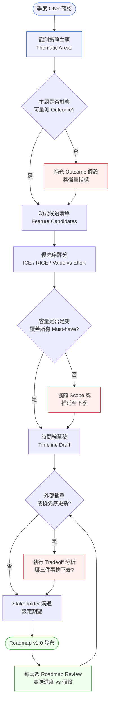
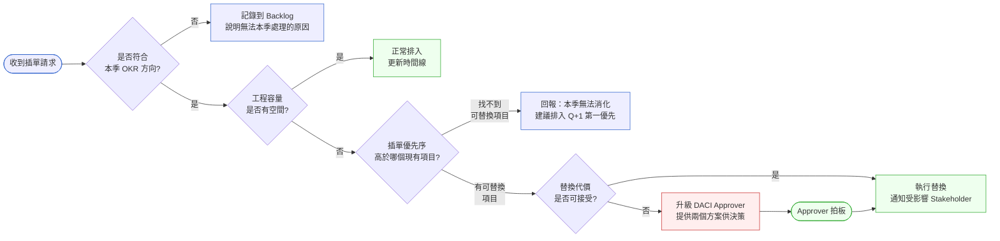
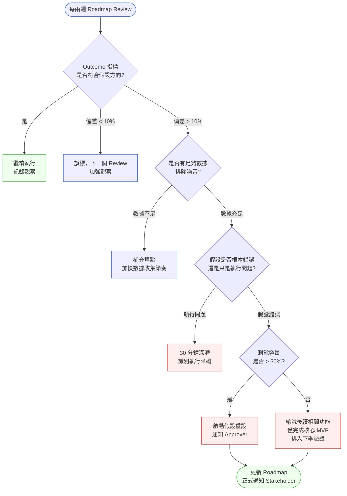
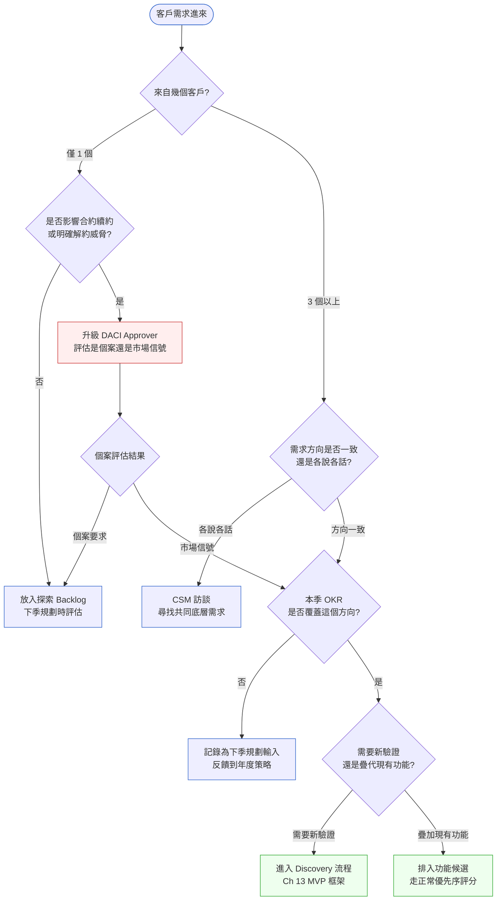

# 第 14 章 | Product Roadmap：承諾的邊界

> **前置閱讀**：[Ch 5 — Prioritization Frameworks：MoSCoW 之外的選擇](../part-01-foundation/ch-05-prioritization.md)、[Ch 13 — MVP Design：最小可驗證的邊界](../part-02-discovery/ch-13-mvp-design.md)
> **下游章節**：[Ch 15 — Estimation & Scope：工程估算的 PM 解讀](./ch-15-estimation-scope.md)、[Ch 17 — Release Planning：上線不等於交付](./ch-17-release-planning.md)
> **SA/SD 對照**：[SA/SD 第 3 章 — 專案啟動、可行性研究與利害關係人分析](../../book/part-01-foundations/ch-03-project-initiation.md) ⸺ SA 視角在這個階段聚焦系統邊界與可行性；本章關注 roadmap 作為承諾工具的政治性與可修改性。
> **SA/SD 對照**：[SA/SD 第 10 章 — 規格文件](../../book/part-02-analysis/ch-10-spec-documents.md) ⸺ SA 把規格當作技術合約；本章把 roadmap 當作方向宣示，兩者的版本控制邏輯截然不同。

---

## §14.1 冷觀察

季度規劃的第三週，Taskline（虛構 SaaS 任務協作工具）的工程師已經跑完第一個 sprint（衝刺，兩週的開發週期）。八個功能卡進行中，三個接近完成。白板上的燃盡圖（burndown chart）走勢很漂亮，所有人都覺得這一季會很順。

PM（叫他 Brian 吧）那天早上九點走進辦公室，桌上有一條 Slack 訊息，是 CEO 傳的，時間是昨晚十一點四十分：

> 「你看到 Notion 昨天發布的 AI 摘要了嗎？我們的 roadmap 裡有這個方向嗎？」

Brian 打開 Notion 的發布公告，看了三分鐘，然後打開 Taskline 自己的 Q3 roadmap。沒有。AI 摘要這個方向在 Q3 規劃裡不存在——它被列在 Q4 的探索清單，但沒有分配到任何 sprint 容量。

九點半，CEO 走進來。不是問號，是句號：「這個我們要做。這個月就要有東西。」

Brian 試著說「我們現在的 sprint 已經排滿了」，但聽起來像藉口。CEO 拿出競品截圖說了一句：「我不是在問可不可以，我是在說這件事的優先序。」

Brian 沒有辦法說：「這個插入的代價是什麼？哪三件事要排下去？排下去的代價是什麼？」因為他的 roadmap 裡沒有這個邏輯——只有功能清單和時間線，沒有取捨假設、沒有衡量指標、沒有調整機制。他翻開那份 roadmap，那是一張漂亮的甘特圖（Gantt chart），每個色塊都對齊到週次，但沒有任何一欄能回答「為什麼這件事比那件事重要」。在 CEO 面前，那張圖看起來不像策略，像是一份等著被推翻的施工排程。

那天下午，Brian 在站會（standup）上宣布兩個原本要做的整合功能延後，工程師沒有問為什麼，只是默默把卡片從「進行中」拖回「待辦」。沒有人抗議，這反而更糟——因為連他自己都說不清楚這次取捨換來了什麼。

一個月後，AI 摘要功能上線，但只完成了計畫版本的 60%——演示給 CEO 看時能跑，但邊界情境（edge case）一堆，企業客戶一用就出錯。更痛的是連鎖反應：Q3 原本排定的 Slack 整合修復推遲了兩個月，那正是當季客服工單量第一名的痛點；兩個簽了年約的企業客戶在續約評估時看到整合還是斷線，直接走人。一個被臨時插進來、半成品的 AI 功能，換掉了兩張本來會留下的合約。Brian 在 Q3 結束的 Retro（回顧會議）上說了一句話：「我們做了 CEO 要的東西，但我沒辦法解釋代價是什麼。」（案例：CASE-SAS-106）

Roadmap 被推翻不是罕見事故，是每個季度都會發生一次的日常摩擦。問題不在於 CEO 插單，而在於 roadmap 作為文件，從一開始就沒有說清楚它在承諾什麼。

---

## §14.2 真問題

把 Taskline 的事情拆開來看，表面上是「CEO 在第三週改計畫」，但底層在發生三層不同的事情。

### 表面需求（What）：roadmap 需要更新

競品發布了新功能，CEO 要求立刻跟進。這個 What 在某種意義上是合理的業務反應——競品壓力是真實的。但「更新 roadmap」這件事，沒有人定義清楚要怎麼做才算做到了。

Brian 只有兩個選項：全部接受，或全部拒絕。他沒有第三個選項，因為他的 roadmap 沒有提供「部分接受、明確說明代價」的結構。換句話說，他缺的不是膽量，是一套能把「插單」翻譯成「取捨」的機制。

### 業務目標（Why）：Outputs、Outcomes、Impact 混在一起

理解 Taskline 的困境，需要先分清三個層次。這三個詞在英文圈常被混用，但它們指的是完全不同的東西：

| 層次 | 定義 | Taskline 的對應 | Brian 能衡量嗎 |
|---|---|---|---|
| **Outputs（產出）** | 團隊做出來的東西 | 功能清單、sprint 計畫、上線版本 | 可以追蹤 |
| **Outcomes（成效）** | 使用者行為的改變 | 任務完成率、行動端日活、企業續約率 | 沒有量 |
| **Impact（影響）** | 對business的長期效應 | 市場定位、競爭力、ARR（年度經常性收入，Annual Recurring Revenue） | CEO 在意但未說清楚 |

舉一個具體的例子說明三者的差異。Outputs 是「我們上線了 AI 摘要功能」——這是一個可以打勾的事實。Outcomes 是「使用者每週生成報告的時間從 25 分鐘降到 15 分鐘」——這需要埋點（instrumentation）才量得到，而且可能上線後三週才看得出趨勢。Impact 是「因為報告更快，企業客戶在續約評估時把我們的工具列為『不可取代』」——這要到下一個合約週期才驗證得了，而且還夾雜了一堆其他變因。

三者的時間尺度與可控程度完全不同：Outputs 由團隊直接控制、當週可見；Outcomes 受使用者行為影響、需要數週觀察；Impact 受市場與競爭環境影響、需要季度甚至年度才能歸因。把三者壓在同一張 roadmap 上而不標明層次，就是 Taskline 那張甘特圖的問題——它看起來在承諾 Impact，實際上只列了 Outputs。

CEO 說的「這個我們要做」，是 Impact 層次的判斷——競品壓力影響市場定位。但 Brian 的 roadmap 全部活在 Outputs 層次。兩個人站在不同的樓層說話，卻以為在討論同一件事。

Roadmap 的根本問題不是「哪個功能排進去」，而是「這張 roadmap 在承諾改善哪個 Outcomes？」當 roadmap 沒有回答這個問題，每一次外部壓力進來，都會直接打到功能清單，因為那是唯一可見的層次。Outcomes 那一層若是空的，插單就沒有任何阻尼（damping）——任何人說「我要這個」，都會無摩擦地落地成一張新的功能卡。

### 決策瓶頸（Who × When）：沒有人被命名為 Approver

Brian 不知道他的決策邊界在哪裡。更準確地說，沒有人告訴他：

- 誰是這個 roadmap 的 **Approver**（最終拍板人）？是 CPO（產品長）？CEO？
- CEO 插單，算是正式的 Approver 行為，還是非正式建議？
- 如果是 Approver 的指示，那舊承諾怎麼處理，誰有責任通知受影響的 stakeholder（利害關係人）？

問題的核心非常具體：**在 Taskline，CEO 和 CPO 都沒有被正式命名為這份 roadmap 的最終拍板人**。季度規劃時，這張 roadmap 是 Brian 自己拉的，CPO 看過點頭，但沒有人在任何文件上寫下「本季 roadmap 的變更，需經 CPO 簽核」。

於是當 CEO 走進來說「這個我們要做」，沒有人能判斷這句話的權重。如果當初 roadmap 上明白寫著「Approver：CPO」，Brian 的回應就完全不同：「我把這個需求帶回去，CPO 會評估它要替換掉哪個 Must-have，明天給你方案。」

DACI 框架中，Approver 的機械作用只有一件事：把「承擔取捨成本的責任」綁定到一個具名的人身上。當你指定「本季 roadmap 的 Approver 是 CPO」，任何插單請求都必須經由 CPO 正式確認——這代表 CPO 要親口說出「我接受為此替換 X、延遲 Y、向客戶 Z 解釋」。這一句話，把非正式的權力施壓（CEO 走進來說「這個我們要做」）轉換成一個有成本評估前置步驟的決策流程。相反地，當 Approver 空缺，代價評估就成了所有人的責任——而「所有人的責任」在現實中等於沒有人的責任。Brian 無法說不，不是因為他的立場不對，而是因為沒有一個被組織授權的人需要公開接受這份代價。

DACI 的缺席，不只讓 Brian 沒辦法說不，也讓他沒辦法說清楚代價是什麼——因為沒有人被指定負責評估代價，也沒有一個正式流程讓代價評估成為「插單」的前置步驟。

真正要改善的是：**Outcomes 層次的可見性**（讓 roadmap 的每個主題都對應一個可量測的行為改變），以及**決策觸發機制**（讓插單有標準流程，並且有一個被指名的人負責拍板，而不是看 CEO 的心情）。

---

## §14.3 決策框架

這一段不給你「正確的 roadmap 長什麼樣」，因為那會隨團隊、階段、文化而變。它給你的是幾組判斷的維度——讓你在現場能自己拉出取捨，而不是套一個別人的模板。

### 圖 A — Roadmap 規劃工作流程

Roadmap 不是一次性文件，而是一個持續更新的決策流程。從季度 OKR（目標與關鍵結果，Objectives and Key Results）到最終溝通，每個節點都有可能觸發調整。



工作流程的關鍵在兩個地方：一是「主題是否對應可量測 Outcome」這個過濾點，它決定 roadmap 是功能清單還是策略工具；二是「外部插單」的處理路徑，強制執行 Tradeoff（取捨）分析，讓代價可見。

### 圖 B — Roadmap 調整決策樹

面對外部插單或優先序異動，下面這棵決策樹提供結構化的判斷路徑：



決策樹的重點不在於「擋掉插單」，而在於讓每次插單都有明確的代價評估和責任歸屬。J 節點——升級 DACI Approver——是整棵樹裡最重要也最容易被 PM 跳過的路徑，因為它把決策責任還給有權限拍板的人，而不是讓 PM 一個人扛。Brian 在 Q3 卡住的地方，正是他從來沒走到 J，直接從「找不到方法擋」跳到「全盤接受」。

### 圖 C — 季中 Outcome 檢查點決策樹

Roadmap 的問題不只發生在「插單」——也發生在「第三週數據就顯示假設錯了，但沒有人做任何事」。下面這棵樹處理的是季中假設失效的場景：



這棵樹解決的問題是「凍結政策」的反面：不是「完全拒絕調整」，而是「有門檻地響應真實信號」。偏差 10% 以上才觸發深入評估，避免讓每個雜訊都變成 roadmap 重寫。關鍵在於 G 節點的分支——「執行問題」與「假設錯誤」要走完全不同的路，混用是常見錯誤。

### 圖 D — 客戶需求 Intake 分流框架

Sales、CS 或企業客戶直接帶來的需求，不能無篩選地流入 roadmap。下面這個分流框架讓 PM 在 15 分鐘內完成初判：



關鍵過濾點是 B 節點（來自幾個客戶）與 C 節點（是否威脅合約）。一個客戶的需求在絕大多數情況下不應該直接改變 roadmap，但如果它綁著合約，就必須升級決策而不是靜默處理。三個以上客戶反映同一方向，才是 roadmap 優先序的有效輸入。

### 圖 E — Stakeholder 溝通矩陣（含需求 Intake 路徑）

同一份 roadmap，對不同 stakeholder 要說不同的話：

| Stakeholder | 影響力 | 受影響程度 | 溝通頻率 | 溝通顆粒度 | 需求進入路徑 |
|---|---|---|---|---|---|
| CEO / CPO | 高 | 高 | 月度方向對齊 | Impact + Outcome | 直接進 DACI 流程 |
| Engineering Lead | 高 | 高 | 每兩週 Review | 容量 + Tradeoff | 容量評估後進優先序 |
| Sales / CS | 低 | 高 | 版本發布時通知 | 確認功能與時間區間 | CSM 週次匯整，月度 PM 審閱 |
| 企業客戶 | 低 | 中 | 重大版本前通知 | 確認功能（不給日期） | 圖 D 分流框架 |
| Board / 投資人 | 低 | 低 | 季度更新 | 主題方向，不談功能 | 不直接進 roadmap |

**需求 Intake 規則**：Sales / CS 的需求統一透過 CSM 在週次匯整，PM 月度審閱——禁止 Sales 直接在 Slack 推功能進 sprint。這個規則不是在壓制 Sales，而是在保護資訊的完整性：一個 Sales 用來解決個別簽單問題的功能請求，和五個 CS 反覆看到的留存痛點，需要不同的權重，而那個權重只有在匯整後才看得清楚。

### 圖 F — 跨團隊依賴與容量預留矩陣

當功能需要跨團隊（Backend、Data、Mobile、Platform），單靠 PM 的 roadmap 是不夠的——依賴沒有被標記，就是埋伏在季度中間的地雷。

| 功能 | 所屬主題 | 依賴團隊 | 預估容量佔用 | 確認狀態 | 風險 |
|---|---|---|---|---|---|
| AI 任務摘要（MVP） | 主題 A | Backend（LLM API 整合）70%、Data（埋點）30% | Backend: 2 sprint、Data: 0.5 sprint | ✅ Backend 確認、⚠️ Data 待確認 | Data 團隊同季有其他優先項 |
| Slack 整合 v2 | 主題 B | Backend 50%、QA 40% | Backend: 1.5 sprint、QA: 1 sprint | ✅ 兩者均確認 | QA 若有生產事故支援，可能延遲 |

這張矩陣要在季度規劃時完成，不能在 sprint 開始後才發現「原來 Backend 團隊那週被佔了」。**確認狀態欄位不能只有 PM 自己填——每一列都需要依賴團隊的 Lead 簽字（或 Slack 確認訊息的截圖）**。這張表是跨團隊承諾的實體，不是 PM 的單方面規劃。

### 工程估算協商指南

插單或 Scope 調整後，工程給出的估算有時候比預期多出 2–3 倍。這個場景 Brian 在 Q3 也遇到了，但他沒有工具應對，只能被動接受或默默壓縮品質。下面是一個三步驟協商框架：

**步驟一：了解估算構成**（30 分鐘）
- 問：「這個估算裡，哪 30% 最確定，哪 30% 最不確定？」
- 目的：分離核心實作與不確定部分，不要把整個估算當成黑盒子

**步驟二：識別 Scope 縮減空間**（定義 0.5 版本）
- 問：「如果我們只做讓 Outcome 假設可以被驗證的最小版本，哪些可以拿掉？」
- 常見可以延後的部分：邊緣情境處理、管理介面、完整錯誤訊息、完整 A/B 測試基礎設施
- 輸出：定義 MVP 版本與完整版本的差距清單，讓 Approver 決策時有具體選項

**步驟三：三路決策**（由 Approver 拍板）
- **路徑 A**：接受完整估算，推延其他功能 → 告知哪些功能排下去、對應 Outcome 影響
- **路徑 B**：以 0.5 版本估算插入，完整版排入下季 → 定義 0.5 版本的驗收標準
- **路徑 C**：此功能延至下季完整執行 → 給 CEO/Approver 一個「等是有理由的」的說法

**PM 的角色**：呈現三個選項與對應代價，不是自己決定走哪路。當工程給出估算，PM 的工作是翻譯成 Outcome 語言，讓 Approver 能做有根據的決策，而不是讓「工程說太貴」成為談話終點。

### Roadmap 組織成熟度調整表

不同階段的組織，roadmap 的結構需要不同的配置。套用企業級框架在早期新創只會製造官僚，套用新創輕量框架在成熟企業只會失去治理。

| 組織階段 | 特徵 | DACI 調整 | Roadmap 結構 | 插單觸發 |
|---|---|---|---|---|
| **早期新創**（< 15 人） | CEO 主導所有決策，沒有 CPO | Approver = CEO；Driver = PM 或 CEO 本人 | 季度卡簡化版：只填 OKR + Must-have 清單 + 本週聚焦 | 任何 > 1 sprint 的調整，CEO + Eng Lead 同步確認（24 小時窗口） |
| **成長期**（15–50 人） | 開始有 CPO 或 VP of Product | Approver = CPO；CEO 為 Informed | 完整季度卡（本章模板） | 影響 > 20% 容量，升級 CPO |
| **成熟期**（50+ 人，多產品線） | 多 PM、共用平台團隊、Portfolio 視角 | Approver = CPO / GM；跨產品插單需要 Portfolio Review | 季度卡 + 跨團隊依賴矩陣（圖 F）+ Portfolio 看板 | Portfolio 層級：影響共用平台團隊容量 > 15%，需 Portfolio Review |

**早期新創的特別說明**：當 CEO = Approver，「升級 DACI Approver」這一步就是「找 CEO 談」。聽起來簡單，實際上容易變成 CEO 每次都能推翻任何決定。應對方式是在新創 roadmap 裡明確標記「本週聚焦」（一件事），讓 CEO 插單時面對的是「這件事替換哪個本週聚焦」，而不是面對一張沒有優先序的清單。

### Roadmap 層次決策表

不同時間跨度的 roadmap 有不同的精準度要求和溝通對象：

| 時間跨度 | 文件類型 | 精準度 | 主要受眾 | PM 關注點 | 常見錯誤 |
|---|---|---|---|---|---|
| 1–2 週 | Sprint 計畫 | 功能 + 驗收標準 | Engineering | 容量分配 | 把 sprint 計畫當 roadmap 給 CEO 看 |
| 1–3 個月 | 季度 Roadmap | 主題 + 功能候選 | PM、Engineering、CPO | Outcome 假設 | 只列功能，不列 Outcome 假設 |
| 3–12 個月 | 年度策略方向 | 主題 + 方向 | Leadership、Sales、CS | 方向一致性 | 給工程師看年度方向後被要求估算 |
| 12+ 個月 | 產品願景 | 方向 + 機會 | Board、投資人、新人 | 策略敘事 | 用願景承諾功能交付時程 |

### If-Then 框架：Roadmap 插單觸發與調整路徑

面對常見的觸發情境，把「會反覆發生的壓力」事先寫成路徑，現場就不必每次重新發明應對：

- **If** 競品功能方向與本季 OKR 無交集 → **Then** 記錄到競品監控 log，排入下季規劃的輸入素材
- **If** CEO 要求立即跟進競品 → **Then** 提供兩個方案：（A）本季插入、明確列出三件被排下去的事及其代價；（B）排入下季第一優先、本季維持計畫；Approver 拍板選一
- **If** 工程估算比預期多出 40% 以上且受影響功能是本季 Must-have → **Then** 走「工程估算協商三步驟」，定義 0.5 版本後由 Approver 拍板
- **If** 工程估算超支但受影響功能是本季 Nice-to-have → **Then** 直接推延，更新溝通給相關 stakeholder
- **If** 企業客戶提出全新方向需求 → **Then** 走圖 D 分流框架，先分流再評估是否進 roadmap
- **If** 客戶以「解約」威脅 → **Then** 升級到 DACI Approver，同時評估：這個客戶的需求是否代表更大的市場信號，還是個案要求
- **If** 季中 Outcome 指標偏差 > 10% → **Then** 走圖 C 季中 Outcome 檢查點決策樹，區分執行問題和假設失效
- **If** 季中發現重大技術債且不處理會讓本季 Must-have 無法穩定上線 → **Then** 把「償還技術債」當作一張正式的功能卡排入，向 stakeholder 說明這是交付品質的前置條件

### DACI 在 Roadmap 決策中的配置

DACI 是一種決策角色框架：Driver（推動者）、Approver（拍板者）、Contributor（貢獻者）、Informed（被知會者）。Roadmap 相關決策需要明確的 DACI 配置：

| 決策類型 | Driver | Approver | Contributor | Informed |
|---|---|---|---|---|
| 季度 Roadmap 制定 | PM | CPO | Engineering Lead、Design、SA | CEO、Sales、CS |
| 季度中重大插單（影響 >20% sprint 容量） | PM | CPO 或 CEO | Engineering Lead | 受影響 stakeholder |
| 功能 Scope 縮減 | PM | Engineering Lead | QA、Design | 企業客戶 CSM |
| Roadmap 方向調整（影響 OKR） | PM | CEO + CPO | 全體 leadership | 全員 |
| 跨團隊依賴資源預留 | PM | 各依賴團隊 Lead | Engineering Lead | 相關 stakeholder |

**Approver 欄位不能空白，也不能寫「待確認」**。如果進入季度規劃時 Approver 還沒定，那麼第一件事不是寫 roadmap，而是先確定誰有最終拍板權。

### 工具橋接指引

本章的 Markdown 模板在任何環境都能用，但實際工作中多數團隊使用專用工具。以下是對應建議：

| 工具 | 對應使用方式 |
|---|---|
| **Notion DB** | 以 `季度`、`主題`、`Outcome假設`、`優先序` 為欄位建 DB；用 Filter 切換「本季確認 / 下季計畫 / 探索」三個 View |
| **Linear** | Roadmap 主題對應 Cycles；功能候選對應 Issues；Outcome 假設寫入 Cycle 描述欄；使用 Labels 標記 Must-have / Nice-to-have |
| **Fibery** | 建 Portfolio View 對接多產品線；使用 Relations 連結跨團隊依賴；Workflow 可建插單審批流程 |
| **Jira + Confluence** | Confluence 頁面存季度卡；Jira Epics 對應主題；Custom Fields 加 Outcome 假設欄位；使用 Roadmap 視圖做時間線 |

**核心原則**：無論用哪個工具，`Outcome 假設` 欄位必須存在，且在季度 Kickoff 前填完。工具是容器，Outcome 假設是靈魂——缺了這個欄位，再精美的工具也只是一張功能清單的數位版本。

---

## §14.4 踩坑清單

### 反模式：功能清單偽裝成 Roadmap

**現象**：Roadmap 文件裡只有功能名稱、負責人、預計完成日期。沒有主題分組，沒有 Outcome 假設，沒有優先序邏輯說明。

**根因**：Roadmap 被當作工程進度追蹤工具，而不是策略溝通工具。PM 把「做什麼」寫清楚了，但沒有說「為什麼這順序、預期改善什麼」。當 roadmap 只有 What 沒有 Why，它在工程房間裡夠用，一出門就會被誤讀或推翻。

**現場後果**：Taskline 的 Brian 就栽在這裡。當 CEO 問「我們的 roadmap 裡有這個方向嗎」，Brian 翻開的是一張功能清單，他能回答的只有「有/沒有」，無法回答「這個方向對應我們本季想改善的哪個成效」。一張只有 What 的 roadmap，把 PM 鎖死在「接受或拒絕」的二元選擇裡。

> **修正方向**：在每個主題區塊加入一句 Outcome 假設，格式為：「我們相信，做了 X 之後，{使用者行為指標} 會在 {時間範圍} 內提升 {幅度}。」這句話不必精確，但必須存在——它的存在才能讓外部插單的討論有共同語言。

---

### 反模式：Date-Driven Roadmap（日期驅動）

**現象**：Roadmap 的第一欄是月份或週次，每個功能都有精確的上線日。Sales 在銷售簡報上直接秀出「Q3 上線 X 功能」的時間表，客戶把它寫進採購評估。

**根因**：PM 把估算直接轉成承諾，沒有在中間加入緩衝或不確定性說明。Sales 看到日期就當作合約。這背後是一個常見的組織壓力——Sales 需要確定性才好賣，於是反向要求 PM 給出精確日期；PM 為了配合，把「最樂觀的估算」當成「承諾」寫進去。

**現場後果**：日期驅動的 roadmap 還會扭曲工程行為。為了「準時」，團隊會偷偷砍品質、跳過測試、累積技術債，結果就是 Taskline 那個「60% 完成度」的 AI 摘要。

> **修正方向**：把時間表改成三個區間：「本季確認」「下季計畫」「未來探索」。只有「本季確認」的功能才有接近精確的時間線；「下季計畫」給方向，不給週次。Sales 若需要給客戶承諾，需要走 Ch 15 的估算流程，不能直接引用 roadmap 日期。

---

### 反模式：Roadmap 凍結（No Update Policy）

**現象**：季度開始後，PM 宣布 roadmap「凍結」，不接受任何修改，以「保護工程師不被打擾」為由。結果是真實的業務信號被擋在外面，季末 Retro 時發現做了三個月的東西沒有人在乎。

**根因**：把「穩定性」當作目的，而不是手段。完全凍結等於宣告「本季我們對外界訊號一律失聰」——對一個還在找產品市場契合（product-market fit）的團隊是致命的。這個反模式往往是「日期驅動」與「過承諾」被罵怕了之後的過度修正。

**現場後果**：如果第二週就有數據顯示某個 Outcome 假設站不住腳，凍結政策會逼著團隊把剩下十週投在一個已知錯誤的方向上。

> **修正方向**：設計「調整觸發條件」而不是「凍結政策」。影響超過 20% sprint 容量的變動才需要走正式的 Tradeoff 分析；小於 20% 的調整，PM 有授權可以自行處理。使用圖 C 的季中 Outcome 檢查點決策樹，讓 roadmap 有彈性，但彈性有門檻。

---

### 反模式：過承諾給 Stakeholder

**現象**：PM 在季初規劃會議說「我們 Q3 會交付這 12 件事」，結果 Q3 末完成了 7 件，另外 5 件推到 Q4。每個季度都有類似的落差，stakeholder 對 roadmap 的信任越來越低。

**根因**：把「希望清單」當作「承諾清單」。規劃時沒有做容量計算，或者容量計算沒有包含緩衝空間——bug 修復、技術債、臨時插單、生產環境事故、同事休假，這些都會吃掉 sprint 容量，但在規劃時常被當成不存在。

**現場後果**：過承諾的真正代價是信任的慢性流失。當 stakeholder 學會「PM 說 12 件，實際做 7 件」，他們反向加碼——「那我要求 18 件，這樣至少能做到 10 件」——roadmap 變成一場通膨競賽。

> **修正方向**：規劃時預留 20–30% 的 sprint 容量為「未計畫工作」（unplanned work buffer）。承諾清單只包含剩下 70–80% 容量可以確認的功能。少承諾、足額交付，遠比多承諾、打折交付更能累積長期信任。

---

### 反模式：Roadmap 成為政治文件

**現象**：Roadmap 的優先序不反映實際的業務價值判斷，而是反映誰的聲音最大。Sales 要的功能排上去，但使用者研究顯示真正影響留存的功能被推延。每季的優先序看起來都像是「上一場會議誰最後離開房間」的結果。

**根因**：團隊沒有一套數據化的優先序評分方法，而且就算有，也是 PM 在暗室裡自己算完才公布。當評分過程不透明，分數本身就失去了仲裁力。政治化的 roadmap 系統性地獎勵「會吵的需求方」、懲罰「不在場的使用者」。

> **修正方向**：每個功能候選的優先序評分必須包含「對目標 Outcome 的貢獻度」這一維度，而且評分要在跨部門會議裡公開進行。把戰場從「聲量」搬到「假設」，是 PM 對抗政治化最有效的一招。

---

### 反模式：Roadmap Bankruptcy（路線圖破產）

**現象**：Roadmap「下季計畫」欄列了 15–20 個功能方向，每個都被口頭承諾給不同的 stakeholder。季度規劃時發現實際只有 5–6 個插槽，但所有人都以為「自己要的那個」已經確認。結果是每次規劃會議都在解釋「為什麼上次說好的現在又沒有了」。

**根因**：「未來探索」與「下季計畫」的邊界沒有定義清楚。PM 在各種場合說了太多「這個我們會做」，但沒有跟一個明確的容量計算掛鉤。「下季計畫」不等於「已承諾」，但被對方聽成了承諾。這個反模式的核心在於 PM 用「探索方向」換取了短期的利害關係人滿意，但累積了未來的信任債務。

**現場後果**：每個季度規劃都從「解釋為什麼上季承諾沒兌現」開始，PM 把規劃週期的 30–40% 時間花在處理誤解，而不是做真正的規劃。

> **修正方向**：實施 RICE 重新排序 + Approver 正式截止機制。在每個季度末，把「下季計畫」欄的所有項目做一次完整的 RICE 評分，由 Approver 確認「進入下季確認清單」的最終名單。任何沒有進入確認清單的項目，自動退回「未來探索」，並且 PM 主動通知相關 stakeholder。規則是：凡是說出去的方向，下次規劃前都要一個正式的「進 or 退」決定，不能讓它懸在空中。

---

## §14.5 交付清單 ⸺ 一頁式 Roadmap 季度卡模板

每個季度在發布 roadmap 之前，這張卡的六個區塊必須填完。填不完代表還沒準備好溝通。

````markdown
# Roadmap 季度卡 — Q{N} {年份}
> 版本:v0.1 | 撰寫日期:YYYY-MM-DD | 擁有人:{名字}

### 1. 季度 OKR 對照
<!-- 為什麼這欄：roadmap 若沒有連回 OKR，外部插單進來時就沒有標準判斷要不要接 -->
- Objective：{本季核心目標，一句話}
- Key Results：
  - KR1：{可量測指標} → 目標值 {X}
  - KR2：{可量測指標} → 目標值 {X}

### 2. 策略主題（Themes）
<!-- 為什麼這欄：功能是葉節點，主題是樹幹；沒有主題，插單就沒有落點 -->
- 主題 A：{名稱} ⸺ {一句話說明這個主題解決什麼}
- 主題 B：{名稱} ⸺ {一句話}
- 主題 C（選填）：{名稱} ⸺ {一句話}

### 3. 本季確認功能清單（Must-have）
| 功能 | 所屬主題 | Outcome 假設 | 依賴團隊 & 容量 | 預計完成時間 |
|---|---|---|---|---|
| {功能名稱} | {主題} | {行為改變假設，如「30 天留存率提升 5%」} | {團隊} {Sprint 數} ✅/{⚠️} | {月/週} |

### 4. 下季計畫（方向，非承諾）
- {主題或功能方向，不需精確日期}
<!-- 這裡的項目在下季規劃前，每一條都需要 Approver 確認「進或退」 -->

### 5. DACI 與插單規則
- Approver：{姓名/角色}
- 插單觸發條件：影響 > {N}% sprint 容量時，需 Approver 拍板
- 本季 Scope 不可調整項目（若有）：{說明}

### 6. 季中 Outcome 檢查點
- 檢查頻率：每兩週
- 負責人：{名字}
- 偏差觸發閾值：KR 進度落後 > 10% 時，啟動圖 C 決策樹
````

**第六區塊是新增的**——它把「假設驗證」從季末 Retro 往前拉到每兩週一次的檢查點。Brian 在 Q3 的問題不只是「插單沒有流程」，還有「三週後數據就顯示方向有問題，但沒有人觸發任何評估」。有了第六區塊，這個評估就從「選做」變成「必做」。

把它存在 `docs/product/roadmap/`，跟程式碼同 repo，跟 README 同層。

### §14.5.1 範例：Taskline Q4 Roadmap 季度卡

Brian 在 Q3 末的 Retro 反思之後，為 Q4 規劃設計了這份卡。它不是事後的紙上演練，而是真的被用來跑 Q4——所以下面每個區塊的填法，都帶著「上一季踩過的坑」的痕跡。

````markdown
# Roadmap 季度卡 — Q4 2025 / Taskline
> 版本:v0.1 | 撰寫日期:2026-02-15 | 擁有人:Brian（PM）

### 1. 季度 OKR 對照
<!-- Q3 的問題是 CEO 插單時，沒有任何共同基準可以評估「這個方向符合本季目標嗎」；
     這欄是那個共同基準。 -->
- Objective：鞏固企業客戶核心工作流採用率，降低 Q4 Churn 風險
- Key Results：
  - KR1：企業客戶 30 日活躍任務完成率 → 目標值 65%（現況 52%）
  - KR2：企業客戶 NPS → 目標值 42（現況 35）

### 2. 策略主題（Themes）
<!-- 「AI 摘要」是功能，「降低任務追蹤認知負荷」是主題；
     只有主題才能讓競品壓力進來時，討論的層次是對的。 -->
- 主題 A：任務追蹤減阻 ⸺ 讓企業使用者每天更新任務的摩擦降到最低
- 主題 B：整合可靠性 ⸺ 修復 Slack / Calendar 整合的斷線問題，這是 Q3 CS 工單第一名

### 3. 本季確認功能清單（Must-have）
| 功能 | 所屬主題 | Outcome 假設 | 依賴團隊 & 容量 | 預計完成時間 |
|---|---|---|---|---|
| 任務快速更新（行動端） | 主題 A | 行動端日活使用率 18%→30% | Mobile 2 sprint ✅、Backend 1 sprint ✅ | 10月第三週 |
| Slack 整合重寫（v2） | 主題 B | CS 整合相關工單量減少 50% | Backend 1.5 sprint ✅、QA 1 sprint ✅ | 11月第一週 |
| AI 任務摘要（MVP 版） | 主題 A | 週報告生成時間縮短 40%（A/B 測試） | Backend 2 sprint ✅、Data 0.5 sprint ⚠️ | 11月第三週 |
<!-- AI 摘要的 Data 團隊容量尚未確認——這是本季最大的跨團隊風險，已在 10/1 前設定追蹤 -->

### 4. 下季計畫（方向，非承諾）
- 探索 AI 智慧分派（資源調度場景）
- 企業管理儀表板（多專案 rollup 視圖）
<!-- 這兩條在 Q4 末規劃會議前，需要 CPO 正式確認「進 Q5 確認清單」或「退回探索」 -->

### 5. DACI 與插單規則
- Approver：CPO（陳 ○○）
- 插單觸發條件：影響 > 20% sprint 容量時，需 CPO 拍板；CEO 需求亦同
- 本季 Scope 不可調整項目：Slack 整合重寫（兩家企業客戶的合約需求）

### 6. 季中 Outcome 檢查點
- 檢查頻率：每兩週（10/14、10/28、11/11、11/25）
- 負責人：Brian（PM）
- 偏差觸發閾值：KR1 任務完成率或 KR2 NPS 落後 > 10%，啟動假設複檢
````

這份卡在 Q4 第二週就驗證了它的價值。當 CEO 帶著另一個競品截圖進來，Brian 打開這份文件，指出「這個功能對應的是哪個 KR、替換的代價是哪個 Must-have、需要 CPO 拍板」。三件事擺在桌上，討論的層次立刻從「做不做」變成「值不值得替換」。會議在 20 分鐘內結束，CEO 說「那就排 Q5」。不是勝利，但是正常的業務對話——而這正是 Q3 那場九點半的對峙裡，Brian 最缺的東西。

另外，第三週的 Outcome 檢查點發現 AI 任務摘要的試用率偏低（目標 15%，實際 6%）——早期信號顯示使用者在找功能入口時迷路。因為有了第六區塊的觸發機制，Brian 在當週就召開了 30 分鐘的深潛，發現是 onboarding 動線問題而非功能本身的問題，在第四週修了入口，第五週試用率回到 14%。這件事在 Q3 不會被發現——那時候 Brian 的 roadmap 裡沒有季中檢查點，問題會在季末 Retro 才出現，那時已經損失了六週。

---

## §14.6 Recap

讀完本章，你應該已經能做到：

- [ ] 把季度 roadmap 從功能清單改造成「主題 + Outcome 假設 + 插單規則」的三層結構
- [ ] 在 roadmap 規劃時明確填入 DACI，特別是 Approver 不能空白、不能寫「待確認」
- [ ] 面對外部插單時，提供兩個有代價分析的方案，而不是單純說可以或不行
- [ ] 識別跨團隊依賴，在季度卡第三區塊確認每個依賴團隊的容量狀態
- [ ] 使用圖 C 的季中 Outcome 檢查點，在假設失效時有結構化的應對路徑
- [ ] 用圖 D 的客戶需求 Intake 分流框架，區分「個案需求」與「市場信號」
- [ ] 根據組織成熟度調整 DACI 配置——新創不套企業框架，企業不套新創輕量框架
- [ ] 區分「季度確認（承諾）」「下季計畫（方向）」「未來探索（願景）」三個時間跨度
- [ ] 在 roadmap 發布前填完 Roadmap 季度卡的六個區塊，包括季中 Outcome 檢查點

如果先挑一件做，建議是在現有 roadmap 裡加入 Outcome 假設那一欄——那一欄的存在會迫使每一次優先序討論從「做不做」升級到「這個假設對不對」，讓 roadmap 從執行清單變成策略對話的起點。Brian 用一張卡，把九點半那場「我說不清代價」的對峙，換成了二十分鐘就收尾的正常對話；你手上已經有同一張卡了，下一次插單走進門時，你會比上次更穩。

---

## Cross-References

- **前一章**：[Ch 13 — MVP Design：最小可驗證的邊界](../part-02-discovery/ch-13-mvp-design.md) ⸺ MVP 的邊界決策是 roadmap 第一個季度最難的一刀
- **下一章**：[Ch 15 — Estimation & Scope：工程估算的 PM 解讀](./ch-15-estimation-scope.md) ⸺ roadmap 的時間線來自估算，估算有它自己的不確定性語言
- **強連結**：[Ch 5 — Prioritization Frameworks：MoSCoW 之外的選擇](../part-01-foundation/ch-05-prioritization.md) ⸺ 功能候選清單的優先序評分方法
- **強連結**：[Ch 33 — Saying No：拒絕的技術](../part-05-decisions/ch-33-saying-no.md) ⸺ 當 DACI Approver 堅持插單，PM 的邊界在哪裡
- **強連結**：[Ch 17 — Release Planning：上線不等於交付](./ch-17-release-planning.md) ⸺ roadmap 的季度末是 release plan 的起點
- **SA/SD 對照**：[SA/SD 第 3 章 — 專案啟動、可行性研究與利害關係人分析](../../book/part-01-foundations/ch-03-project-initiation.md) ⸺ SA 的可行性研究是 roadmap 技術可行性的輸入來源
- **SA/SD 對照**：[SA/SD 第 10 章 — 規格文件](../../book/part-02-analysis/ch-10-spec-documents.md) ⸺ 規格文件是 roadmap 功能進入 sprint 前的細化步驟

<!-- PROPOSED-REFS
cases:
  - id: CASE-SAS-106
    title: "Taskline Roadmap 崩潰：CEO 插單，季度計畫第三週報廢"
    domain: saas
    chapters: [ch-14]
    summary: |
      虛構 SaaS Taskline：季度 roadmap 規劃完成，工程已排好 sprint。
      第三週 CEO 帶來競品截圖，要求立即插入新功能。
      PM 無框架說明 tradeoff，只能全盤接受，原計畫報廢，
      AI 摘要僅完成 60%，Slack 整合延遲，兩家企業客戶解約。
      Q4 重建時採用 Roadmap 季度卡框架，插單有了正式處理路徑，
      CEO 再次插單時 20 分鐘內以正常業務對話收尾。
      Q4 季中檢查點在第三週發現 AI 摘要試用率偏低，
      快速識別 onboarding 動線問題並修復，避免損失六週。
-->
