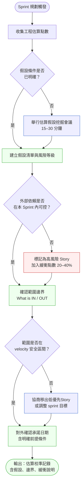
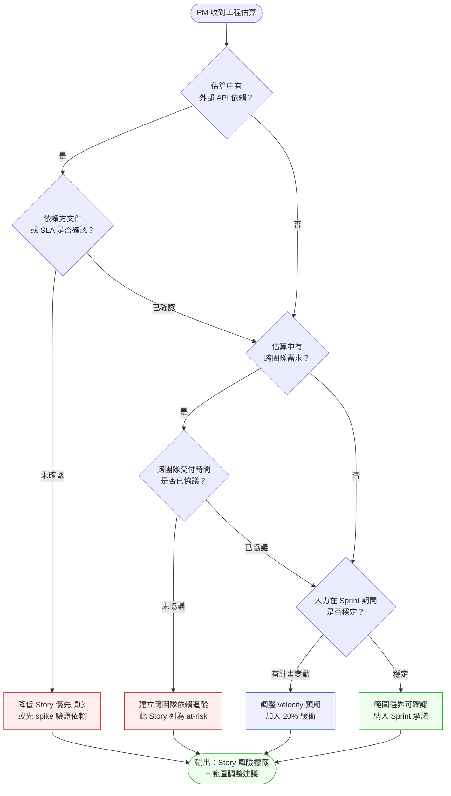

# 第 15 章 | Estimation & Scope：工程估算的 PM 解讀

> **前置閱讀**：[Ch 14 Product Roadmap：承諾的邊界](./ch-14-product-roadmap.md)
> **下游章節**：[Ch 16 Risk Register for PM：PM 視角的風險登記](./ch-16-risk-register.md)
> **相關章節**：[Ch 5 Prioritization Frameworks](../part-01-foundation/ch-05-prioritization.md) ⸺ 範圍邊界協商需要優先順序框架的支撐
>
> **SA/SD 對照**：[SA/SD 第 15 章｜資料儲存設計](../../book/part-03-design/ch-15-data-storage.md)
> ⸺ SA 視角關注技術設計決策的複雜度與成本；本章關注 PM 如何讀懂估算背後的假設，並將工程點數轉譯為範圍邊界與業務承諾。

---

## §15.1 冷觀察

Q3 規劃週期的第二天，CartNova 的規劃會議室裡有一張試算表，上面列著十七個 User Story，旁邊是工程師估出來的 Story Point：2、3、5、8、13……

PM 陳薇看著那張表說：「加總是 87 點。上個 Sprint 我們跑了 42 點，所以兩個 Sprint 就能搞定，對吧？」

資深工程師林傑看了她一眼，沒有反駁。沒有人反駁。

六週之後，Sprint 3 Review 在一片沉默中結束。velocity 是 24 點。三個 Sprint 累計 71 點，距離目標還差 16 點。Roadmap 上承諾給 BD 團隊的「批量優惠碼匯入」被迫推遲，CTO 在 Slack 上傳來一句話：

> 「我以為這個月底就好了？」

陳薇的第一個直覺是：工程師太慢。

但那個週五下午，她把三個 Sprint 的 Sprint Retrospective 記錄翻出來，一條一條讀：第一個 Sprint，物流 API 介接文件有錯，重工三天；第二個 Sprint，前端改版需求在衝刺中途才確認，影響四個 Story；第三個 Sprint，估算時預設在場的資深工程師請了兩週育嬰假。

沒有一條是「工程師太慢」。

每一條都是估算時的隱含假設，在執行時被現實打破了。而那些假設從來沒有被說出來過——不是因為工程師刻意隱瞞，而是因為沒有人問過。陳薇看著那張試算表，第一次意識到：87 點的估算，不是承諾，是在某組假設條件下的預測。那組假設，她完全不知道。

這個場景不特殊。在現場很常看到的版本是：PM 把 Story Point 直接除以 velocity，算出上線日期，然後把日期交給 BD 或行銷，再把日期複製進 roadmap，再把 roadmap 交給 CTO。每個人都很誠實，但整條鏈路上沒有一個人說清楚那個數字的邊界在哪裡。

---

## §15.2 真問題

把 CartNova 的情況拆開來看，表層看起來是「估算不準」，但估算準確度從來都不是 PM 的核心問題。

### 表面需求（What）：估算為什麼一直跑掉？

大多數 PM 的第一個問題都是這個。常見的反應是要求工程師把估算細化，從 Story Point 改成小時數，或者開始要求每個 Story 拆成更小的子任務。

這些操作有時有用，但解決的是「估算精度」問題，不是「估算語義」問題。一個 5 點的 Story，不管被拆成幾個子任務，它背後「假設物流 API 文件正確」這件事還是存在的。

### 業務目標（Why）：PM 真正需要管理的是承諾邊界

Story Point 是工程師內部溝通相對複雜度的語言。它本來就不是交給 PM 或 stakeholder 直接使用的單位。PM 的工作不是把點數算準，而是把「在什麼條件下、範圍是多少、風險在哪裡」這件事搞清楚，然後把它翻譯成對外的承諾邊界。

問題的癥結在於：假設缺口在 Outputs 層次是看不見的。當你只盯著點數，那些隱含的前提——API 文件正確、關鍵成員在場、需求已凍結——永遠潛伏在計算式底下，不會自動浮現。一旦你問「這個 Output 本來要帶出什麼 Outcome？那個 Outcome 又對應哪個 Impact？」，那些條件才不得不被說出來：功能要被用戶採用，需要什麼先成立？轉換率要移動，功能本身又要在什麼前提下如期上線？這兩個問題讓假設無所遁形。依賴追蹤或事後風險評分可以補救，但它們只能告訴你「哪裡出了問題」，而不能指出估算鏈路的哪一節發生了「假設」與「承諾」的錯位。CartNova 的失敗正是這種錯位的教科書案例：陳薇用 Outputs 的點數算術，直接支撐了一個 Impact 層次的業務承諾——這個跳躍，只有在三個層次的框架下才看得清楚。

區分三個層次有助於看清這件事：

| 層次 | 在估算情境中的意義 | CartNova 的混淆點 |
|---|---|---|
| **Outputs** | Sprint 跑完交付了幾個 Story、幾個點數 | 陳薇管理的是這層 |
| **Outcomes** | 上線後用戶行為改變了嗎？功能被使用了嗎？ | 完全沒進入對話 |
| **Impact** | 業務指標移動了嗎？BD 說的轉換率有提升嗎？ | 被推遲的功能其實影響了哪個指標？沒人說得清楚 |

陳薇把「87 點 ÷ 42 點/Sprint = 2 個 Sprint」當成承諾，是把 Outputs 的計算結果直接外推成 Impact 的時間線，跳過了所有中間的不確定性。

### 決策瓶頸（Who × When）：誰必須確認假設？什麼時候？

這才是真正的卡點。估算中的隱含假設（第三方依賴穩定、人力不變、需求凍結）不是技術問題，是需要 PM 在規劃會議上主動挖出來的資訊。

DACI 在這個情境下的分配：

| 角色 | 負責人 | CartNova 的實際狀況 |
|---|---|---|
| **D** Driver | PM 陳薇 | 推動規劃進行，但沒有追問假設 |
| **A** Approver | 工程 Lead 林傑 | 對估算點數有最終說法，但默許了誤用 |
| **C** Contributor | 工程師個人 | 給出點數，未說明假設條件 |
| **I** Informed | CTO、BD | 最後才知道推遲，為時已晚 |

決策瓶頸出現在 **Approver 和 Driver 之間沒有一次「假設對齊」的對話**。林傑知道那些假設，陳薇不知道，但沒有人建立起讓這個資訊流動的機制。

**這章真正想回答的問題是**：PM 原本想管理的是 Outcomes（功能準時上線並被使用），量到的卻只是 Outputs（Sprint 跑了多少點），而造成缺口的根本原因是從來沒人確認估算的假設條件。

---

## §15.3 決策框架

PM 的估算校準（estimation calibration，估算校準）和工程師的估算是兩件不同的事。工程師估的是「這件事相對於那件事有多複雜」，用 Story Point（故事點）表達一個團隊內部的相對刻度。PM 校準的不是這個刻度準不準，而是這個刻度「在什麼前提下成立」，以及「前提崩掉時範圍要怎麼退」。陳薇在 Q3 規劃時做錯的，不是算術——87 ÷ 42 沒有算錯——而是她把一個有前提的預測當成了無前提的承諾。

所以這一節的所有工具，目的都不是讓 PM 算得更準，而是讓 PM 在規劃會議的當下，就能把那些藏在點數背後、平常不會被講出來的假設一條一條逼到檯面上。下面兩張圖，一張處理「流程上什麼時候該停下來問」，一張處理「問完之後怎麼判斷範圍要不要退」。

### 圖 A — 估算校準工作流程



流程的核心邏輯是：**PM 不需要理解點數怎麼算，但需要知道那些點數「假設了什麼」**。圖中的兩個菱形決策點，正好對應 CartNova 三個 Sprint 崩塌的兩個源頭。

第一個菱形「假設條件是否已明確」，是整個流程裡最便宜也最常被跳過的一步。陳薇的規劃會議直接從「收集點數」跳到了「加總外推」，中間沒有那場 15 到 30 分鐘的假設挖掘會議。如果有，林傑很可能會在會議上講出「這幾個 Story 我是假設那位資深同事在場估的」——而那個人後來請了兩週育嬰假。假設一旦被寫進清單並標上風險等級，它就從「沒人知道的隱性前提」變成「可以追蹤的已知風險」，這是 PM 能做、而且只有 PM 會主動去做的動作。

第二個菱形「外部依賴是否可控」，對應的是第一個 Sprint 物流 API 文件出錯導致重工三天那件事。注意這裡的判斷標準不是「依賴方有沒有承諾」，而是「在本 Sprint 內可不可控」——別人答應下個月給文件，對這個 Sprint 來說就是不可控。判斷為不可控時，流程不是把 Story 砍掉，而是加 20% 到 40% 的緩衝點數，把不確定性顯性地計進容量。最後流程強制輸出一份「估算校準記錄」，這份記錄就是把整段對話固化下來的證據，也是 §15.5 的主要交付物。

換句話說，CartNova 的問題不是工程師在這張流程圖的某一步做錯了，而是這張圖的前半段——那兩個菱形——在他們的規劃裡根本不存在。PM 的價值就在於把這兩個問題變成規劃會議的固定環節。

### 圖 B — 範圍邊界決策樹



如果說圖 A 回答的是「流程上什麼時候該停下來」，圖 B 回答的就是「停下來之後，這個 Story 的範圍該怎麼處置」。這棵決策樹可以在 Sprint Planning 的最後 10 分鐘快速過一遍，每個菱形節點都對應一個 PM 可以直接、不需要懂技術就能問出口的問題。

把 CartNova 的三個 Story 丟進這棵樹走一遍，就能看到當初哪一步會攔截到問題。第一個 Sprint 的物流 API Story，會在 Q1「有外部 API 依賴？」答「是」、Q2「文件或 SLA 是否確認？」答「未確認」時，直接落到紅色的 R1——「降低優先順序或先 spike 驗證依賴」。也就是說，這個重工三天的 Story 本來就不該被當成核心承諾納入 Sprint，而該先花半天做一個 spike 去驗證那份文件到底對不對。

第三個 Sprint 那位資深工程師的育嬰假，則會在 Q5「人力在 Sprint 期間是否穩定？」答「有計畫變動」時落到 R3，觸發 velocity 預期下修與 20% 緩衝。重點在於：這棵樹把「人力變動」放在和「外部依賴」「跨團隊需求」同一個層級當成一級風險來檢查，而不是當成一個臨時插曲。陳薇當初知道那個人要請假，但她沒有一個機制提醒自己「這件事必須反映到容量計算裡」——決策樹就是那個機制。

決策樹的終點不是一個是/否的答案，而是一張「Story 風險標籤 + 範圍調整建議」。這正是 §X.3 的設計意圖：它不告訴 PM「這個 Story 該不該做」，而是教 PM 問對問題、根據答案決定範圍要進、要退、還是要加緩衝。判斷權留在 PM 手上，工具只負責確保沒有一個關鍵問題被跳過。

### 假設挖掘對話指令碼

圖 A 要求一場 15–30 分鐘的「假設挖掘會議」，但沒有指令碼的 PM 通常在這場會議上只能問「有沒有風險？」——這個問題幾乎永遠得到「沒什麼問題，就是要花一點時間」的回答。

下面這份指令碼是把陳薇踩過的坑逆向工程出來的。每個問題都設計成可以直接開口說、不需要懂技術的措辭。對著每個被估出 5 點以上的 Story 過一遍，每場不超過 20 分鐘。

**指令碼：Sprint Planning 假設挖掘（適用於 5 點以上 Story）**

> 以下問題針對一個 Story 的場景設計，每個問題後方的括號是追問邏輯，如果工程師的回答觸發括號裡的條件，就繼續追問。

1. **「這個 Story 有沒有需要等別人給我們東西才能開始的部分？」**
   （如果有 → 「那個東西什麼時候會到？如果比預期晚兩週，這個 Story 會怎樣？」）

2. **「有沒有需要呼叫外部 API 或第三方服務的地方？最近一次我們測試那個 API 是什麼時候？」**
   （如果沒測試過或文件較舊 → 「需不需要先花半天做個 spike 確認 API 還能正常工作？」）

3. **「這個 Story 主要由誰來做？那個人這個 Sprint 全程都在嗎？」**
   （如果有請假或出差 → 「少了那幾天，這個 Story 的點數要不要調整？」）

4. **「這個 Story 有沒有依賴另一個 Story 先完成才能進行？如果那個 Story 推遲一週，這個會怎樣？」**
   （這個問題專門挖跨 Story 依賴，見本章末段「反模式六：跨 Story 依賴盲點」）

5. **「需求上有沒有什麼你現在還不確定、等到開始做才會知道的部分？」**
   （如果有 → 「那個不確定的地方，最壞情況下會讓這個 Story 從幾點變成幾點？」）

6. **「這個 Story 的 "完成" 定義是什麼？我們要怎麼驗收它？」**
   （如果驗收條件模糊 → 這個 Story 的估算可靠性低，標記為中風險）

7. **「如果這個 Sprint 中間有人要我們改需求，這個 Story 受不受影響？」**
   （這個問題帶出需求凍結的假設，幫 PM 在規劃時就說清楚「Sprint 中途不改需求」的邊界）

**CartNova 實例**：如果陳薇在 Q3 第一個 Sprint 前問了問題 2，林傑會說「那個物流 API 我上次測是三個月前，文件有沒有更新我不確定」——這一句話就能觸發「先 spike」的決定，省掉後來三天的重工。

**異步版本**：如果團隊分散在不同時區或估算後才能拿到所有人的回覆，可以用以下格式發一個非同步問卷，給 24 小時回覆窗口：

```
Story：{Story ID} — {Story 標題}
請每位負責工程師回答以下問題（文字回覆即可，1–2 句）：
1. 這個 Story 依賴哪些外部系統或人？這些依賴本週可控嗎？
2. 最壞情況下點數會變成多少？
3. 有什麼我應該知道但你還沒告訴我的事？

回覆截止：{日期 + 時間}
```

非同步格式失去了即時討論的張力，但對於有書面紀錄要求或跨時區團隊，是次優而實用的選項。

### 估算校準決策表

| 情境 / 觸發條件 | 推薦做法 | PM 關注點 | 常見錯誤 |
|---|---|---|---|
| 估算點數高於過去 Sprint 平均 150% | 要求工程師說明哪些假設導致高估，確認是否有隱性風險 | 這個 Story 是不確定性高，還是確實複雜？ | 直接接受並外推上線日期 |
| Story 依賴第三方 API / 外部系統 | 明確問：「文件是否最新？上次測試是什麼時候？」 | 外部依賴的不確定性不反映在點數上 | 假設點數已包含所有風險 |
| Sprint 中有人力變動（請假、離職、新人加入） | 重新計算有效 velocity，通知 stakeholder 可能影響 | Velocity 是歷史值，不是容量保證 | 用過去 velocity 計算新 Sprint 的可交付量 |
| 需求在 Sprint 中期有修改 | 評估影響並決定：繼續、縮範圍、或移到下個 Sprint | 範圍修改等於打破原始估算假設 | 默默吸收修改，沒有更新承諾日期 |
| Roadmap 日期已對外承諾，但估算超出 | 立即通知相關人，提出三種調整選項（縮範圍、延期、加人力） | 承諾日期的前提條件是否仍然成立？ | 繼續假設可以追回，直到最後一刻才通知 |
| 工程師拒絕給確定時間，只給範圍 | 接受範圍估算，用樂觀值做承諾的前提，用悲觀值做緩衝 | 範圍估算通常比點數更誠實 | 要求一個確定數字，工程師被迫給一個不可靠的數字 |

### If-Then 框架：PM 的估算校準行動

決策表回答「遇到什麼情境該怎麼想」，下面的 If-Then 框架則把它收斂成「拿到估算後 30 分鐘內，照順序跑一遍」的具體動作。三個條件的排序刻意對應 CartNova 三個 Sprint 各自踩到的坑：外部依賴（第一個 Sprint）、velocity 可靠性（第三個 Sprint），以及對外承諾的時機（整條鏈路最後一哩）。

- **If** 任何 Story 的估算有提到「等待第三方」「依賴 API」「需要另一個團隊交付」 → **Then** 在規劃會議上單獨問：「這個假設不成立的話，這個 Story 的點數會變幾倍？上線會推多少天？」並依答案標記為 at-risk，不納入 Sprint 目標核心清單
- **If** 未來 Sprint 中有計畫外人力變動（育嬰、出差、新成員加入 ramp-up） → **Then** 用調整後 velocity = 歷史 velocity × (在位人天 / 正常人天)，不要用歷史平均值直接外推
- **If** 工程估算已通過假設驗證，且範圍已確認 → **Then** 對外承諾日期時附帶兩個前提：①本 Sprint 範圍不再增加；②具體依賴條件在指定日期前確認
- **If** 前提條件在 Sprint 中改變 → **Then** 在 72 小時內主動通知相關 stakeholder，提出調整選項，不要等 Sprint Review 才說

### 緩衝計算矩陣

緩衝矩陣是前面所有判斷的數字落點：圖 A 與圖 B 判斷出來的風險等級，在這裡被換算成一個具體的緩衝百分比和處置方式。風險與緩衝的對應邏輯是線性的——不確定性越高，越需要在容量裡預留吸收意外的空間。低風險的純內部工作不需緩衝；中風險（有已確認文件的外部依賴或單人短暫變動，例如範例中的出差）給 15–20%；高風險（外部依賴未確認、跨團隊協調、需求模糊）給 30–40%，並且先做 spike 而不是直接承諾。

「未知」這一級需要特別說明，因為它不是一個需要更大緩衝的情況，而是一個需要完全不同處理方式的情況。工程師連估都估不出來時，通常屬於以下兩種：

- **可 spike 的未知**（Spikeable Unknown）：不確定性可以在 4–8 小時的 spike 內大幅降低。例如「不確定那個 API 支不支援批次操作」——花半天測一下就知道了。處理方式：把 spike 作為一個獨立 Story（1–2 點）納入 Sprint，spike 結果決定原 Story 的估算。
- **不可 spike 的未知**（Unspikeable Unknown）：不確定性只有實際開始做才能消解，例如「不知道重構這段遺留代碼會牽扯到哪些地方」。處理方式：拆成更小的子 Story，把已知部分先估，未知部分掛在 Backlog 等前面的子 Story 完成後再估；或者直接告知 stakeholder 這個功能無法在本季度給出承諾日期。

CartNova 那個 13 點的國際版優惠碼，就屬於不可 spike 的未知——法務依賴未到位，技術範圍也不清楚，所以在 §15.5.1 的範例裡它被明確移出 Sprint，而不是含糊地留在清單上。

| 風險等級 | 判斷依據 | 建議緩衝 | 處理方式 |
|---|---|---|---|
| 低 | 純內部工作，無外部依賴，人力穩定 | 0% | 正常計入 Sprint |
| 中 | 有已確認文件的外部依賴，或人力有一人短暫變動 | 15–20% | 納入 Sprint，標記觀察 |
| 高 | 外部依賴未確認，或有跨團隊協調，或需求有模糊地帶 | 30–40% | 移至 Backlog，先 spike |
| 可 spike 的未知 | 工程師無法給估算，但不確定性可在 4–8 小時 spike 內解決 | — | 納入 spike Story（1–2 點），spike 後再估 |
| 不可 spike 的未知 | 工程師無法給估算，不確定性需實際開始做才能消解 | 不可計入承諾 | 拆更小 Story 或明確告知無法給季度承諾 |

### Velocity 法醫分析：何時應該不信任歷史數字

PM 在規劃時依賴 velocity，但 velocity 本身可能是一個失真的訊號。以下三個跡象，任何一個出現就應該重新評估是否可以用歷史 velocity 做為計算基準：

**跡象一：連續三個 Sprint velocity 下降超過 10%**
例如 CartNova 三個 Sprint 跑出 42、35、24 點，這不是隨機波動，而是系統性阻力的訊號。可能原因：技術債累積、需求品質下降、新人 ramp-up、或估算點數通脹（team 開始「保守估算」來避免被追責）。處理方式：在下一個 Sprint 前做一次「velocity 根因分析」（5 Whys），找到是哪個因素主導了下降趨勢，而不是直接用三個 Sprint 的平均值繼續估。

**跡象二：單一 Sprint 超過兩人有非預期缺席**
一人缺席可以用 15–20% 緩衝吸收；兩人以上意味著 velocity 的計算基礎已不再成立。這時候應該重新計算有效人天（available person-days），而不是用比例調整歷史 velocity。

**跡象三：本 Sprint 的高風險 Story 超過 5 個**
高風險 Story 多，意味著估算的不確定性來源多，任何一個假設崩潰都會觸發 spike 或重工。這種情況下，velocity 預期應該使用「保守值」（歷史 velocity 的 70%）而不是中位數，並且明確告知 stakeholder：「本 Sprint 承諾基於保守估計，若風險沒有觸發，有機會交付更多。」

**速算工具：PM 的 velocity 三分法**

| 版本 | 計算方式 | 何時使用 |
|---|---|---|
| **保守值**（velocity floor） | 過去三個 Sprint 最低值 × 0.9 | 向 stakeholder 對外承諾時使用 |
| **預期值**（median） | 過去三個 Sprint 中位數 | Sprint Planning 容量計算基準 |
| **樂觀值**（velocity ceiling） | 過去三個 Sprint 最高值 × 1.0 | 「最早可能上線」的溝通基準 |

對外承諾永遠用保守值；Sprint 內部計劃用預期值；溝通上線可能日期時，提供範圍（保守值到樂觀值），不要給單一日期。

**回測校準**：每兩個 Sprint 做一次估算準確度回測：「我們預期跑 X 點，實際跑了 Y 點，誤差是 (X-Y)/X × 100%。」如果誤差長期超過 ±20%，代表估算模型需要調整。CartNova 三個 Sprint 的情況：預期 42 點，實際 24 點，誤差 -43%——這是一個強烈信號，說明估算基準需要根本性重新校準，而不是「下個 Sprint 再努力一點」。

---

## §15.4 踩坑清單

**反模式一：點數加總法**

現象：把所有 Story 的點數加起來，除以上個 Sprint 的 velocity，算出「幾個 Sprint 就能完成」，然後把日期填入 roadmap。

根因：把統計平均值當成物理定律。Velocity 是歷史樣本，每個 Sprint 的條件都不一樣；點數加總也沒有考慮 Story 之間的依賴關係。

> 修正方向：把「幾個 Sprint 完成」當成估計範圍，不是承諾日期。對外溝通時給出「最早可能」和「最晚可能」兩個值，並說明拉大這個範圍的主要風險因子是什麼。

---

**反模式二：估算會議上 PM 沉默**

現象：Sprint Planning 時 PM 坐在旁邊，工程師喊點數，PM 記錄，沒有任何對話。散會後 PM 把清單發給 stakeholder，說「這個 Sprint 我們會做這些」。

根因：誤以為估算是工程師的事，PM 的角色是接收結果而非參與對話。估算會議被當成資訊傳遞，而不是假設對齊的場合。

> 修正方向：在估算會議上準備三個問題：（1）「這個估算假設什麼條件？」（2）「最壞情況下它會變多大？」（3）「有沒有我們現在不知道但應該知道的事？」這三個問題不需要 PM 懂技術，但每個答案都能影響承諾邊界的設定。本章 §15.3 的假設挖掘指令碼提供更完整的問題清單。

---

**反模式三：把緩衝視為不信任**

現象：PM 提出「在 velocity 計算中加 20% 緩衝」，工程師說「你覺得我們不夠快嗎？」。PM 為了維護關係，撤回緩衝要求，按原始點數做承諾。

根因：把「不確定性緩衝」和「對工程師能力的評估」混為一談。緩衝是風險管理，不是績效評估。

> 修正方向：明確說明緩衝的來源是哪個具體風險（例如：「因為這個 Sprint 有兩個依賴外部系統的 Story，我想預留緩衝給可能的等待時間」）。把「緩衝是不信任」這個等式打斷。

---

**反模式四：上線後才承認估算有問題**

現象：Sprint 跑到第三週，PM 已經知道無法準時完成，但沒有通知 stakeholder，等到 Sprint Review 或上線日前一天才說「我們有一點落後」。

根因：擔心說出延遲會被認為是 PM 失職。把「延遲通知」當成自我保護，結果給了 stakeholder 更少的反應時間。

> 修正方向：72 小時規則——一旦確認某個里程碑有超過 30% 機率無法達到，立即通知相關人，並附帶三個選項：（A）縮小範圍、準時上線；（B）維持範圍、延期；（C）增加資源（如可行）。給選項，不只是報壞消息。

---

**反模式五：把工程估算當成對使用者的承諾**

現象：工程師說「這個功能大概三個 Sprint」，PM 在下個 all-hands 說「三個月後這個功能會上線」，使用者在社群媒體上截圖。

根因：估算是工程團隊內部的相對複雜度溝通，不是對使用者的交付承諾。兩者之間有一段距離：假設條件、測試、Staging 驗證、上線流程。

> 修正方向：把「我們預計在 {季度} 完成這個功能的初版」和「功能將在 {日期} 正式上線」當作兩個不同的訊息，分別在對應的時間點對應的受眾說。前者是規劃意向，後者是已確認的上線承諾。

---

**反模式六：跨 Story 依賴盲點**

現象：Story A 和 Story B 都被納入 Sprint，估算時都是 5 點，看起來容量充足。但沒人注意到 Story B 需要等 Story A 的後端 API 完成才能開始。Story A 在 Sprint 第三週才完成，Story B 沒有足夠時間，兩個 Story 都推遲。

根因：每個 Story 被獨立估算，估算矩陣沒有捕捉到 Story 之間的依賴關係。這在有多個工程師平行開發的 Sprint 中特別容易發生——每個人只看到自己的 Story，沒有人負責看全局的依賴圖。

> 修正方向：Sprint Planning 的最後 5 分鐘，畫一張快速的依賴矩陣：
>
> | Story | 依賴哪個 Story 或外部條件 | 估計可以開始的時間 |
> |---|---|---|
> | S-201 | Admin API 文件（外部） | Sprint 第 1 天 |
> | S-202 | 無 | Sprint 第 1 天 |
> | S-203 | S-201 的後端完成 | Sprint 第 3 天（最早） |
>
> 如果 S-203 依賴 S-201，而 S-201 是高風險 Story，那麼 S-203 就自動繼承一部分 S-201 的風險，而不是被獨立計算。至少把有依賴關係的 Story 用同一個 at-risk 標籤連接起來，讓整個 Sprint 的風險可視化。

---

## §15.5 交付清單 ⸺ 一頁式估算校準記錄模板

- [ ] **估算校準記錄（Estimation Calibration Sheet）**：每個 Sprint 的點數、假設清單、風險標記、緩衝說明（一頁，在規劃後 24 小時內完成）
- [ ] **範圍邊界確認表（Scope Boundary Confirmation）**：明列本 Sprint 的 IN / OUT / AT-RISK Story，附帶前提條件（在 Sprint 開始當天發給 stakeholder）
- [ ] **承諾條件備忘（Commitment Conditions Memo）**：對外承諾日期時附帶的前提條件清單（一段話，不超過 5 條件）
- [ ] **Velocity 調整計算記錄**：人力變動時的有效 velocity 重新計算過程（附在 Sprint Planning Notes）
- [ ] **Sprint 後假設驗證記錄（Post-Sprint Assumption Log）**：記錄哪些假設成立、哪些失敗，做為下個 Sprint 估算的輸入（Sprint Review 當天完成）

這份估算校準記錄把 Sprint 規劃會議上的口頭對話固化成文字：哪些 Story 被納入、每個假設是什麼、哪些是 AT-RISK、對外承諾的前提條件是什麼。有了它，任何人在規劃後五分鐘都能理解 Sprint 的真實承諾邊界，而不是靠口耳相傳猜測。

````markdown
# 估算校準記錄 — {產品} Sprint {N}
> 版本:v0.1 | 撰寫日期:YYYY-MM-DD | 擁有人:{名字}

Sprint: {Quarter}-S{N}
日期: YYYY-MM-DD
PM: {姓名}
工程 Lead: {姓名}

### 本 Sprint 納入 Stories

| Story ID | 描述 | 點數 | 風險等級 | 主要假設 |
|---|---|---|---|---|
| {ID} | {描述} | {點數} | 高/中/低 | {主要假設，一句話} |

Sprint 點數小計: {N} 點
調整後 velocity 預期: {N} 點（{說明調整原因，如人力變動、假日等}）

### 範圍邊界

IN（本 Sprint 核心承諾）: {Story ID 清單}

AT-RISK: {ID}（若 {觸發條件} 則 {降級或移出處置}）

OUT（已移至下 Sprint）: {ID} {說明}（{原因，如依賴未到位、人力不足}）

### 跨 Story 依賴

| Story | 依賴條件 | 最早可開始 |
|---|---|---|
| {ID} | {依賴的 Story 或外部條件} | Sprint 第 {N} 天 |

### 對外承諾條件

{功能名稱} 預計上線日期：YYYY-MM-DD
前提條件：
1. {條件，含截止日與負責人}
2. {條件}

若條件不成立，下一個通知時間點：{日期}（{說明觸發事件}）

### Sprint 後假設驗證（Sprint Review 填寫）

| 假設 | 結果 | 下次估算調整 |
|---|---|---|
| {假設描述} | 成立 / 失敗 | {若失敗：下個類似 Story 加 N% 緩衝} |
````

把它存在 `docs/planning/sprint-records/`，跟程式碼同 repo，跟 README 同層。

### §15.5.1 範例：CartNova Sprint 4 估算校準

以下是 CartNova CASE-ECM-106 場景的估算校準記錄範例（Sprint 4，距 Q3 Roadmap 剩餘工作）：

---

**估算校準記錄 — CartNova Sprint 4**

````markdown
# 估算校準記錄 — CartNova Sprint 4
> 版本:v0.1 | 撰寫日期:2026-07-14 | 擁有人:陳薇（PM）

Sprint: Q3-S4
日期: 2026-07-14
PM: 陳薇
工程 Lead: 林傑

### 本 Sprint 納入 Stories

| Story ID | 描述 | 點數 | 風險等級 | 主要假設 |
|---|---|---|---|---|
| S-201 | 批量優惠碼匯入（CSV） | 8 | 中 | <!-- 假設說明：依賴 Admin API v2，文件已確認，上次測試 2026-07-01 --> 依賴 Admin API v2，已確認 |
| S-202 | 優惠碼使用統計報表 | 5 | 低 | <!-- 假設說明：純內部資料計算，無外部依賴 --> 純內部，無依賴 |
| S-203 | 結帳頁優惠碼欄位 UI | 3 | 低 | <!-- 假設說明：設計稿已 approved，前端資源已確認；依賴 S-201 後端完成 --> 設計稿已定案；依賴 S-201 |

Sprint 點數小計: 16 點
<!-- 為什麼這欄：點數小計讓所有人在規劃後一眼確認「我們承諾了多少」，避免各自記憶不同 -->
調整後 velocity 預期: 18 點（林傑本週出差 2 天，有效人天 × 0.9，歷史 velocity 20 × 0.9 ≈ 18）
<!-- velocity 計算說明：用調整係數而非歷史平均值，反映本 Sprint 實際人力 -->

### 範圍邊界

IN（本 Sprint 核心承諾）: S-201, S-202, S-203
<!-- IN 說明：三個 Story 合計 16 點，在調整後 velocity 18 的安全區間內 -->
<!-- 為什麼這欄：明列 IN 讓 stakeholder 不能在 Sprint 進行中要求「順便加一個小功能」，邊界在這裡 -->

AT-RISK: S-201（若 Admin API 在 7/18 前無法通過 staging 測試，降為 P2）
<!-- AT-RISK 說明：已知風險點，前置測試安排在 Sprint 第二天 -->

OUT（已移至 S5）: S-211 國際版優惠碼格式支援（13 點，依賴法務確認，尚未到位；屬不可 spike 的未知）
<!-- OUT 說明：法務回覆預計 7/28，早於 S5 規劃時間，正式移入 S5 Backlog -->

### 跨 Story 依賴

| Story | 依賴條件 | 最早可開始 |
|---|---|---|
| S-201 | Admin API v2 文件（外部） | Sprint 第 1 天 |
| S-202 | 無 | Sprint 第 1 天 |
| S-203 | S-201 後端 API 完成 | Sprint 第 6 天（最早）；若 S-201 推遲則連動 |

<!-- 跨依賴說明：S-203 繼承 S-201 的 at-risk 標籤。如果 S-201 在 staging 測試失敗，S-203 也需要重新評估時間線。 -->

### 對外承諾條件

批量優惠碼功能預計上線日期：2026-07-28
前提條件：
1. Admin API v2 staging 測試於 7/18 前通過
2. Sprint 4 範圍不再增加（截至 7/16）
<!-- 為什麼這欄：條件清單把「我以為你們沒問題」的口頭確認，變成白紙黑字的前提——任何一條不成立，PM 就有依據立刻升報 -->

若條件不成立，下一個通知時間點：7/18（staging 測試結果出來當天）

### Sprint 後假設驗證（Sprint Review 填寫）

| 假設 | 結果 | 下次估算調整 |
|---|---|---|
| Admin API v2 文件正確且測試通過 | 待驗證（7/18） | 若失敗：類似外部 API Story 一律先 spike，估算加 30% 緩衝 |
| 林傑出差不影響 S-201 交付 | 待驗證（Sprint end） | 若影響：單人超過 2 天缺席，velocity 改用保守值 |
````

---

## §15.6 Recap

- Story Point 是相對複雜度的語言，不是天數的換算表；PM 的工作是讀懂它背後的假設，不是把它算準。
- 估算的真正風險藏在隱含假設裡——外部依賴、人力穩定性、需求凍結，這些從來不出現在點數裡，但決定了 Sprint 能否跑到預期 velocity。
- 把 Velocity 當成物理定律是規劃中最常見的誤判；Velocity 是歷史樣本，每個 Sprint 的人力條件與外部依賴都不一樣。連續下降超過 10%、單 Sprint 兩人以上缺席、或高風險 Story 超過五個，都是應該重新校準基準的訊號。
- 假設挖掘指令碼是 PM 最高 ROI 的工具——七個問題，15–30 分鐘，能攔截 CartNova 三個 Sprint 中任何一個崩塌點。
- 「未知」不是一個數字，而是一個決策點：可 spike 的未知先 spike，不可 spike 的未知不可計入承諾。
- 72 小時規則比 Sprint Review 更重要：一旦確認有超過 30% 的機率無法按原計畫完成，立刻通知、給選項，而不是等到最後一刻才報壞消息。
- 估算校準記錄不是文書工作，是讓「什麼條件下、做多少範圍、風險在哪」這件事可以被檢視、被追溯的工具——拿這個一頁記錄，任何人都能在規劃會議後五分鐘理解 Sprint 的真實承諾邊界。

陳薇缺的從來不是更準的算術，而是規劃會議上那場沒人發起的假設對話。下一次拿到點數試算表時，先別急著除以 velocity——先把假設逼到檯面上。做到這一步，你就已經多守住了一條承諾的邊界。

---

## Cross-References

- **前一章**：[Ch 14 Product Roadmap：承諾的邊界](./ch-14-product-roadmap.md) ⸺ Roadmap 的時間承諾需要以估算校準為基礎
- **下一章**：[Ch 16 Risk Register for PM：PM 視角的風險登記](./ch-16-risk-register.md) ⸺ 本章識別的估算風險應進入正式 Risk Register 追蹤
- **強連結**：[Ch 5 Prioritization Frameworks](../part-01-foundation/ch-05-prioritization.md) ⸺ 範圍邊界協商時需要優先順序框架決定哪些 Story 可以移出
- **強連結**：[Ch 11 Writing Specs That Engineers Trust](../part-02-discovery/ch-11-executable-specs.md) ⸺ 清晰的規格能降低估算的不確定性
- **SA/SD 對照**：[SA/SD 第 3 章｜專案啟動、可行性研究與利害關係人分析](../../book/part-01-foundations/ch-03-project-initiation.md) ⸺ SA 在可行性研究階段處理技術風險評估；本章處理 PM 如何在執行階段持續校準這些風險的範圍影響
- **SA/SD 對照**：[SA/SD 第 10 章｜規格文件](../../book/part-02-analysis/ch-10-spec-documents.md) ⸺ SA 視角關注規格的技術完整性；本章關注規格清晰度如何直接影響估算的可靠度

<!-- PROPOSED-REFS
case: CASE-ECM-106 已在 case-registry.yaml 新增，pm-ch-15
-->
