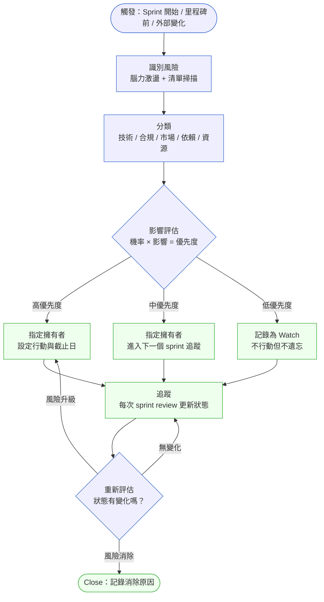
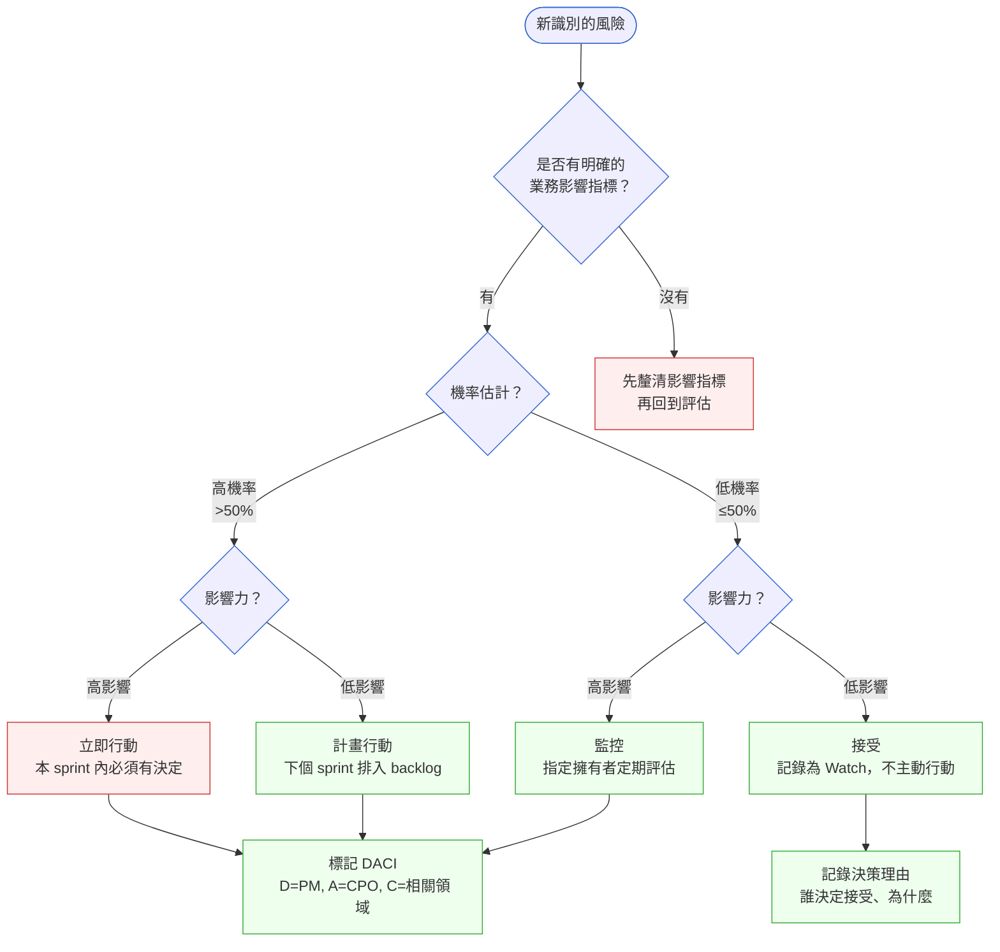

# 第 16 章 | Risk Register for PM：PM 視角的風險登記

> **前置閱讀**：[Ch 15 Estimation & Scope：估算與範圍](./ch-15-estimation-scope.md) ⸺ 風險的「影響」評分必須建立在對範圍與工期的估算之上，否則無法量化延誤代價
> **下游章節**：[Ch 17 Release Planning：上線計畫的節奏](./ch-17-release-planning.md)
> **相關章節**：[Ch 5 Prioritization Frameworks：優先順序框架](../part-01-foundation/ch-05-prioritization.md) ⸺ 風險評分需要優先順序框架支撐排序決策
> **相關章節**：[Ch 19 Dependency Management：依賴管理](./ch-19-dependency-management.md) ⸺ 風險登記中「外部依賴」類型的識別與追蹤，在此章有完整的依賴地圖（Dependency Map）方法
>
> **SA/SD 對照**：[SA/SD 第 27 章｜安全設計](../../book/part-05-quality/ch-27-security-by-design.md)
> ⸺ SA 視角關注如何把安全威脅模型化（threat modeling，威脅建模；STRIDE）並嵌入架構；本章關注 PM 如何在 roadmap（產品路線圖）週期內持續識別、分類、追蹤風險，以及誰擁有哪個風險的決策責任。

---

## §16.1 冷觀察

上線前第十三天的下午三點，那封信進了 PM 的收件匣。

寄件人是法務顧問，主旨只有一行：「PDPA 合規疑慮——待確認後才能上線。」沒有正文摘要，附件是一份七頁的法規對照表。PM 把滑鼠停在「待確認後才能上線」這幾個字上，看了很久——因為再過十三天，記者發布會的場地已經訂好、行銷費用已經付清、CEO 已經在內部信裡寫了「我們將準時改寫小額借貸的體驗」。

FastLend 是一家虛構的 Fintech（金融科技）新創，主打「三分鐘信用審核、當日放款」的個人小額借貸服務（CASE-FIN-105）。第一版產品從需求到開發花了三個月。最後兩週進入 regression（回歸測試），Jira 燈號全綠，PM 已經在草擬上線公告——直到那封信把所有綠燈都變成了問號。

問題的核心很冷硬：台灣新版個人資料保護法（PDPA，Personal Data Protection Act）在半年前修訂，針對金融機構使用自動化信用決策，新增了揭露義務。FastLend 必須在審核結果通知頁面加入「決策邏輯說明」與「申訴機制」的明確提示，否則主管機關可開罰，最快七十二小時就能發函要求暫停服務。而這條要求，在整個開發週期裡，從未被記錄進任何一份文件。

當天傍晚的緊急會議裡，空氣很安靜。工程師問了一句話：「這個改版有多大？」

沒有人答得出來。沒有人知道審核結果頁面的邏輯有多深。設計師說要重做三支流程，前端估計兩週，後端說合規日誌欄位牽動到資料庫 schema（資料結構），可能更久。測試說如果 schema 改了，整個 regression 要重來。每個人說的都是真話，每個人說的加起來，就是上線日期碎了一地。

最後，上線推遲了三週。記者發布會延期，行銷費用無法退款，競品在同一個月搶先上線。

事後，有人翻出了第一個月的 kick-off（專案啟動）文件。裡面確實有一欄寫著「合規風險：待評估」。那四個字在文件裡靜靜躺了三個月——被寫下，然後被遺忘，從來沒有人追蹤它最後變成了什麼。

風險不是在第十三天才出現的。它在第一天就被寫下來了。出問題的，是那四個字後面，沒有接上任何一個人的名字、任何一個日期。

---

## §16.2 真問題

把 FastLend 的故事拆開來看，表面看是「合規漏掉了」，但這只是症狀描述。

### 三層拆解

### 表面需求（What）

工程師需要補做 PDPA 合規功能，包括決策邏輯揭露頁面、申訴入口、合規日誌。這是確實存在的技術工作，最終也確實完成了。

問題不在功能是否做得出來，而在這個需求為什麼在上線前十三天才出現。

### 業務目標（Why）

FastLend 的業務目標是「合規上線，取得主管機關無異議」。三分鐘審核是產品差異化，但在主管機關眼裡，這個差異化必須建立在合規的基礎上，否則自動化決策就是法律地雷。

把這件事用 Outputs / Outcomes / Impact（產出／成果／影響）框架拆開：

| 層次 | FastLend 原始計畫 | 實際發生 |
|---|---|---|
| **Outputs（產出）** | 完成功能開發、通過 regression | ✅ 測試綠燈，功能實作完畢 |
| **Outcomes（成果）** | 合規通過、用戶可以正常使用審核流程 | ❌ 上線受阻，合規缺口在最後兩週才補 |
| **Impact（影響）** | 準時上線、取得市場先機 | ❌ 延遲三週，行銷費用損失，競品已在同期上線 |

Outputs 完成了。Outcomes 和 Impact 全面失守。

這不是工程師的問題，也不是 Legal（法務）的問題。Legal 不是不知道要審查，他們是從來沒有被納入週期性追蹤機制裡。

### 決策瓶頸（Who × When）

真正的瓶頸有兩個層次。

第一層：誰負責「合規風險：待評估」這四個字？kick-off 文件寫了這個欄位，但沒有指定擁有者（Owner），也沒有設定到期日。一個沒有擁有者的風險，等於宣告它不存在。

第二層：什麼時間點應該觸發 Legal 審查？FastLend 採用了常見的錯誤慣例——「上線前兩週讓 Legal 走一遍」。但 PDPA 合規不是審查性工作，是設計性工作：揭露義務要求系統架構本身就要支援特定的日誌格式、申訴入口、決策紀錄欄位。這些在設計階段沒有確認，到了 regression 已經無法補救，只能重做。

風險登記（Risk Register）的本質問題因此浮現：不是「有沒有做一次風險登記」，而是「識別出來的風險有沒有持續被追蹤、有沒有被分配擁有者、有沒有在正確的時間點觸發行動」。

### DACI 在風險擁有上的應用

僅在風險登記表增加一個「Owner」欄位，只解決第一個瓶頸——你知道誰的名字——卻無法解決第二個瓶頸：那個人有沒有權力宣告風險已關閉？有沒有義務在截止日前強制升級？一個擁有者若沒有明確角色定義，同樣會讓「待評估」永遠停在待評估。DACI 的設計正是為了拆解這個模糊地帶：Driver 承擔的是「推動流程不中斷」的義務，確保每週風險狀態有人更新、到期前有人升級；Approver 承擔的是「具有決策權力」的責任，可以明確說出「我們接受這個殘餘風險」或「不行，必須修改設計」。FastLend 缺少的不只是一個名字，而是一個被指派了推動義務的 Driver，以及一個被授予決策權力的 Approver。

風險登記裡每一條風險都需要對應的 DACI（Driver / Approver / Contributor / Informed，推動者／核准者／貢獻者／知會者）：

| 角色 | 全稱 | FastLend 合規風險的對應 |
|---|---|---|
| **D** Driver（推動者） | 推動決策進行 | PM（週期性更新、escalation 升級） |
| **A** Approver（核准者） | 最終拍板 | CPO 或 CEO（是否接受殘餘風險） |
| **C** Contributor（貢獻者） | 提供輸入 | Legal、工程師、資安 |
| **I** Informed（知會者） | 被通知結果 | Sales、Marketing |

FastLend 的風險登記沒有這個結構，所以「待評估」永遠沒有人推動它變成「已評估、已決定」。

---

## §16.3 決策框架

這一節不給你一份「填好就對」的風險清單——因為每個專案的風險長相不同。它給你的是三組判斷工具：怎麼決定一個風險該不該行動、該由誰擁有、什麼時候該回頭重看。學會判斷，比抄一份別人的清單更耐用。

### 圖 A — PM 風險登記工作流程



讀這張圖時，有三個判斷點值得你停下來想清楚，而不是照流程走完就算。

第一，觸發點不只是「每季一次」。你要自己判斷：哪些外部訊號對「你的」專案是觸發點？主管機關發布新規、技術依賴方宣告變更、競品有重大動作，都可能是該觸發一輪風險掃描的時機。FastLend 的合規問題就是沒有把「外部法規變化」設定為觸發點——而對一家 Fintech 來說，這恰恰是最該設的那一個。

第二，每個優先度對應不同的行動力道，但都必須指定擁有者。判準很簡單：沒有擁有者的風險不算「已處理」，只算「已記錄但忽略」。當你不確定一條風險該放哪個優先度，先問「如果它今天爆了，誰會被找上？」——那個人通常就是 Owner。

第三，Close 本身需要記錄消除原因。「因為 Legal 確認 PDPA 無適用」和「因為我覺得不重要」是兩種完全不同的關閉理由，前者是知識資產，後者是遺忘。你關閉一條風險時的自我檢查是：半年後接手的人，能不能只看記錄就理解你為什麼關它？

---

### 圖 B — 風險分類與行動決策樹



這棵樹有一個容易被跳過的第一步：「是否有明確的業務影響指標？」很多團隊跳過這一步，直接做機率 × 影響的評分。但如果沒有定義影響指標，兩個人對同一個風險的評分可能差三倍，最後的優先度排序沒有任何意義。所以這棵樹真正教你的不是「答案在哪個葉節點」，而是「在打分數之前，先確認你和對方量的是同一把尺」。

在 FastLend 的例子裡，「PDPA 合規風險」的影響指標應該是「上線日期」和「主管機關罰鍰」，這兩個指標一旦明確，機率評估也會跟著變——你問的不再是「這件事可能發生嗎」，而是「如果我們不做，上線日期會延遲多少天、罰鍰上限是多少」。問題換了問法，答案的可行動性就完全不同。

---

### 風險分類決策表

這張表不是要你照抄每一列，而是示範「同一種判斷邏輯」如何套在五種不同風險類型上。你的專案可能只有其中三類，重點是看懂每一列的「PM 關注點」欄是怎麼把模糊風險變成可問的問題。

| 風險類型 | 觸發條件 | 推薦做法 | PM 關注點 | 常見錯誤 |
|---|---|---|---|---|
| **合規 / 法規** | 外部法規修訂、主管機關函示、Legal 提出疑慮 | 立即引入 Legal 做設計層影響評估，不等「上線前審查」 | 影響架構設計的合規要求必須在 sprint 1–2 釐清 | 把「Legal 上線前走一遍」當作合規控制機制 |
| **技術依賴** | 第三方 API 版本公告、SDK 廠商棄用通知 | 標記依賴方、訂閱其 changelog（變更日誌）、設立版本鎖定策略 | 依賴方的決策週期比自身快還是慢？ | 等到依賴方通知才開始評估，時間窗口已關閉 |
| **市場 / 競品** | 競品發布重大功能、目標市場政策變化 | 更新假設文件，重新評估 roadmap 優先度 | 這個變化是否影響本 sprint 的驗證假設？ | 把競品動態列入「知道了」但不回頭調整優先度 |
| **資源 / 人員** | 核心成員離職、跨部門資源確認失敗 | 立即 escalate（升級），讓 Approver 決定是否縮範圍或延期 | 哪個角色是無法替代的單點？ | PM 自己消化資源風險，不向上報告，默默壓縮 scope |
| **外部依賴** | 上下游系統整合排程未確認、基礎設施採購未完成 | 建立依賴清單（Dependency Map，依賴地圖），設定 blockers（阻塞項）的 deadline | 未確認的外部依賴是否在關鍵路徑上？ | 假設「應該沒問題」，等到上線前才確認 |

> **延伸**：「外部依賴」這一類的識別與追蹤方法，在 [Ch 19 Dependency Management：依賴管理](./ch-19-dependency-management.md) 有完整的依賴地圖建構流程。本章只把它當作一種風險類型來分類，Ch 19 則教你如何系統性地畫出整張依賴網。

---

### If-Then 框架：風險優先度評分行動門檻

這個框架可以直接貼進 Risk Register 試算表的「評分邏輯」欄。但要注意：它給的是「門檻」，不是「結論」。門檻幫你把對話拉到同一個基準上，最終某條風險要不要破例提級，仍然是你和 Approver 的判斷。

機率（P）分為 P1（>75%）、P2（40–75%）、P3（15–40%）、P4（<15%）；影響（I）分為 I1（阻斷上線）、I2（影響核心 KPI）、I3（局部功能可補救）、I4（幾乎無感）。

- **If** P ≤ 2 且 I ≤ 2（高機率、高影響）→ **Then** 立即行動（Action Required）：本 sprint 必須有決定
- **If** P ≤ 2 且 I = 3（高機率、中影響）→ **Then** 計畫行動（Plan）：列入下個 sprint backlog
- **If** P = 3 且 I ≤ 2（中機率、高影響）→ **Then** 監控（Monitor）：指定擁有者每兩週評估
- **If** P ≥ 3 且 I ≥ 3（中低機率、中低影響）→ **Then** 接受（Accept）：記錄決策理由，誰決定、為什麼

FastLend 的合規風險應該落在 P2、I1——機率中等（新法規如果沒有主動追蹤就很可能遺漏）、影響等級最高（阻斷上線）。套用這個框架，它在 kick-off 後第一個 sprint 就該變成 Action Required。如果你看到一條 P2、I1 的風險還掛著「待評估」，那不是評分問題，是流程沒在運作。

---

## §16.4 踩坑清單

**反模式：Risk Register 只填一次**

現象：kick-off 時做了一份完整的風險登記表，之後文件躺在 Confluence 裡，每次 sprint review 沒有人打開它。

根因：PM 把風險登記視為「一次性的合規動作」，而不是「持續運作的週期性機制」。第一次填的時候，很多「待評估」還沒有足夠資訊，但後續也從來沒有人回來評估。

> **修正方向**：把風險登記的更新放進每次 sprint review 的標準議程。不需要每次都完整重審，但每次至少確認：有沒有新的外部訊號觸發？有沒有哪條「待評估」到了截止日？上週的行動項有沒有執行？

---

**反模式：風險沒有擁有者，只有登記人**

現象：Risk Register 有「記錄日期」、「風險描述」、「嚴重度」，但沒有「Owner」欄位。或者有 Owner 欄位，但填的是「PM」——所有風險都是 PM 的。

根因：登記風險和擁有風險是不同的責任。PM 是風險登記機制的 Driver，但每個具體風險的 Owner 應該是最有能力影響它的人——合規風險的 Owner 是 Legal lead，技術依賴風險的 Owner 是 Tech lead。把所有 Owner 都填 PM，等於沒有 Owner。

> **修正方向**：區分「誰記錄這個風險（通常是 PM）」和「誰負責解決或持續監控這個風險（應該是最相關的職能領域）」。Risk Register 的 Owner 欄位，填的是行動責任人，不是資訊彙整人。

---

**反模式：機率評估流於主觀，沒有基準**

現象：兩個 sprint 後 PM 重新評估風險，把某條合規風險從「高」降為「中」，理由是「Legal 說沒問題」——但沒有記錄 Legal 的依據是什麼、針對的是哪一版法規文本。

根因：風險評分沒有基準文件，每次重新評估都依靠記憶與個人判斷，導致同一條風險在不同時間點的評分不可追溯。

> **修正方向**：每次改變風險評分，必須附上變更依據（「依據：Legal 確認 PDPA §15 不適用於非金融機構，信件存檔於 Confluence #XYZ」）。這樣的記錄不只保護 PM，也是日後接手的人能快速理解決策脈絡的知識資產。

---

**反模式：只登記「做不到的風險」，不登記「決定不做的風險」**

現象：Risk Register 裡都是「第三方 API 可能不穩定」「合規可能有疑慮」這類技術／外部風險，但沒有記錄「我們決定不做 A 功能，接受了 B 使用者需求被忽略的風險」。

根因：PM 把風險登記理解為「威脅清單」，而不是「決策地圖」。每一個範圍決策、優先度排序都隱含風險假設——接受了某個 trade-off（取捨），等於暗中接受了某個風險。沒有記錄，日後就沒有辦法解釋「當初為什麼這樣決定」。

> **修正方向**：在 Risk Register 裡加一個類別「接受的業務風險（Accepted Business Risk）」，專門記錄團隊主動決定接受的 trade-off，包括決策人、決策日期、當時的假設條件。當假設條件改變時，這些記錄可以觸發重新評估。

---

**反模式：把 Risk Register 跟 Issue Log 混用**

現象：風險登記表裡出現「前端登入頁 bug 未修」「設計稿延遲兩天」這類已發生的問題，跟「可能發生的風險」混在同一份表。

根因：PM 在維護一份文件（如果有維護的話），自然而然把所有「不對勁的事情」都往裡面塞。但風險是尚未發生、可能發生的事；問題（Issue）是已經發生、需要解決的事。兩者的管理邏輯完全不同。

> **修正方向**：維護兩份分開的文件——Risk Register（前瞻性，管理可能性）和 Issue Log（回應性，管理已發生的問題）。每次 sprint review 分別更新，相互提示但不合併。

---

## §16.5 交付清單 ⸺ 一頁式風險登記表

本章涉及四份可立即帶入專案的文件：一張持續追蹤的風險登記表作為核心，加上觸發清單、DACI 對應表與關閉記錄三份配套。把它們存在 `docs/risk/` 目錄下，跟程式碼同 repo，跟 README 同層。

- [ ] **風險登記表（Risk Register）**：含識別 ID、風險描述、類型、機率評分（P1–P4）、影響評分（I1–I4）、優先度、擁有者（Owner）、行動項、截止日、狀態、最後更新日
- [ ] **風險更新觸發清單（Risk Trigger Checklist）**：列出哪些外部訊號應觸發風險掃描（法規公告、依賴方版本更新、競品動態、資源變化）
- [ ] **DACI 對應表**：每條 Action Required 風險都附 Driver / Approver / Contributor / Informed
- [ ] **關閉記錄（Risk Closure Log）**：每條 Close 的風險必須記錄消除原因、決定人、日期

---

### §16.5.1 範例：FastLend PDPA 合規風險登記

FastLend 在 kick-off 時記錄了「合規風險：待評估」，卻沒有進入追蹤機制，最終導致上線前十三天才爆發（CASE-FIN-105）。以下是「如果當時有做」的風險登記範例，對應專案第一個 sprint 結束時的狀態。

````markdown
# FastLend 風險登記表 — Sprint 1 結束版（Week 2）
> 版本:v0.1 | 撰寫日期:2026-02-15 | 擁有人:林 PM

<!-- 欄位說明：表頭解釋各欄用途，幫助首次使用的 PM 理解為什麼這欄存在 -->

| 欄位 | 說明 |
|---|---|
| 風險 ID | 用於 DACI 表、Issue Log 交叉引用的唯一識別碼 |
| 類型 | 合規／技術依賴／市場／資源／外部依賴，幫助分流處理 |
| P × I | 機率（P1–P4）× 影響（I1–I4），決定行動門檻 |
| 行動門檻 | 按 if-then 框架自動推算 |
| Owner | 行動責任人，不是記錄人 |

---

### 風險 #FL-R001

<!-- 欄位說明：風險描述應回答「什麼情境下、誰受到什麼影響」，
     不應寫成「合規可能有問題」這種無法行動的描述。 -->

- **風險 ID**：FL-R001
- **風險描述**：台灣 PDPA 2025 修訂版針對自動化信用決策新增揭露義務（決策邏輯說明 + 申訴機制），FastLend 審核結果頁面目前未符合此要求，若未在上線前修正，主管機關可依新版第 15 條裁罰。
- **類型**：合規 / 法規
- **來源識別時間**：Week 1 kick-off（由 Legal Lead 王律師提出初步疑慮）
- **機率（P）**：P2（可能發生，40–75%）——修訂版已正式生效，FastLend 屬適用範圍，風險是「我們是否已符合」而非「法規是否存在」

  <!-- 欄位說明：P2 不是「中等可能發生」，而是「如果我們不主動確認，幾乎確定會遺漏」 -->

- **影響（I）**：I1（阻斷上線）——主管機關認定違規時，最快 72 小時可發函要求暫停服務
- **行動門檻**：**立即行動（Action Required）**

  <!-- 欄位說明：P2×I1 組合按 if-then 框架應為 Action Required，
       本 sprint 內必須有決定，不能帶到下個 sprint -->

- **Owner**：法務長（王律師）
- **行動項**：
  1. 由法務長確認 PDPA §15 對 FastLend 的具體適用範圍（Deadline：Week 2 週五）
  2. 工程師評估審核結果頁面的架構改動範圍（Deadline：Week 3 週一）
  3. PM 根據改動範圍更新 sprint 計畫（Deadline：Week 3 週二）
- **DACI**：D=PM（林 PM），A=CPO，C=Legal Lead + Tech Lead，I=Sales Lead
- **狀態**：🟡 進行中（等待法務長 Week 2 確認）
- **最後更新**：Week 2 Day 1

---

### 風險 #FL-R002

<!-- 為什麼這欄：技術依賴風險的 Owner 必須是有能力評估遷移工作量的人，而不是 PM -->

- **風險 ID**：FL-R002
- **風險描述**：第三方徵信 API（虛構：TaiCredit v2.3）官方公告 v3.0 將於 Q2 啟用，v2.3 的文件支援將同步結束；FastLend 目前所有信用決策依賴 v2.3 的響應格式。
- **類型**：技術依賴
- **機率（P）**：P2（公告已發出，版本切換時間明確）
- **影響（I）**：I1（核心功能依賴，切換失敗則審核功能全停）
- **行動門檻**：**立即行動（Action Required）**
- **Owner**：Tech Lead（陳工）
- **行動項**：
  1. Tech Lead 確認 v3.0 API 差異，評估遷移工作量（Deadline：Week 3）
  2. 排入 Sprint 2 backlog 的 spike task（技術探勘任務）
- **DACI**：D=PM，A=CTO，C=Tech Lead + QA Lead，I=PM
- **狀態**：🔴 待分配 sprint
- **最後更新**：Week 2 Day 1
````

這份範例的關鍵在於 FL-R001 的 Owner 是法務長而不是 PM，行動項有明確截止日，DACI 填到每個角色姓名或職稱。PM 記錄、法務長行動——這是風險登記機制正常運作的樣子。如果 FastLend 在 Week 2 就有這張表並且持續追蹤它，Legal 就不會在上線前十三天才「出現」，而是在 Week 2 就已經在行動了。回到 §16.1 那四個躺了三個月的字：差別只在於，這裡的「待評估」後面，接上了一個名字和一個日期。

---

## §16.6 Recap

讀完本章，你應該已經能做到：

- [ ] 識別 Risk Register 的核心失效模式：只填一次、沒有擁有者、評分無基準、不記錄接受的風險
- [ ] 用機率（P1–P4）× 影響（I1–I4）的 if-then 框架，把模糊的「高中低」轉成有行動門檻的分類
- [ ] 為每條 Action Required 風險配上 DACI，明確 Driver 是 PM 但 Owner 是領域負責人
- [ ] 把風險更新放進 sprint review 常規議程，而不是等到「感覺有問題了」才翻出來
- [ ] 建立 Risk Closure Log，讓每個消除的風險都有記錄，不只是從表裡刪掉

如果先挑一件事做，建議是——打開你現在手上的 Risk Register，加上「Owner」和「行動截止日」兩欄，然後找出所有狀態還是「待評估」的條目。那些停著沒動的行，就是 FastLend 那四個字的翻版；今天替它們各補上一個名字和一個日期，你就已經把這套機制啟動了。風險管理不需要等到下一個專案才開始，它從你下一次打開那張表的那一刻就開始。

---

## Cross-References

- **上一章**：[Ch 15 Estimation & Scope：估算與範圍](./ch-15-estimation-scope.md) ⸺ 風險「影響」評分所需的工期與範圍基準來自估算
- **下一章**：[Ch 17 Release Planning：上線計畫的節奏](./ch-17-release-planning.md) ⸺ 風險狀態直接影響 release go/no-go（上線決策）
- **強連結**：[Ch 19 Dependency Management：依賴管理](./ch-19-dependency-management.md) ⸺ 風險登記中「外部依賴」類型的完整識別與追蹤方法（依賴地圖）
- **強連結**：[Ch 5 Prioritization Frameworks：優先順序框架](../part-01-foundation/ch-05-prioritization.md) ⸺ 風險行動的優先度排序邏輯
- **SA/SD 對照**：[SA/SD 第 27 章｜安全設計](../../book/part-05-quality/ch-27-security-by-design.md) ⸺ SA 用 STRIDE 威脅建模把安全風險嵌入架構設計；本章關注 PM 如何在 roadmap 週期中持續追蹤所有類型的風險並確保有擁有者
- **SA/SD 對照**：[SA/SD 第 3 章｜專案啟動、可行性研究與利害關係人分析](../../book/part-01-foundations/ch-03-project-initiation.md) ⸺ SA 在啟動階段做可行性風險評估；本章關注啟動後的持續追蹤機制，兩者是時間軸上的前後段
