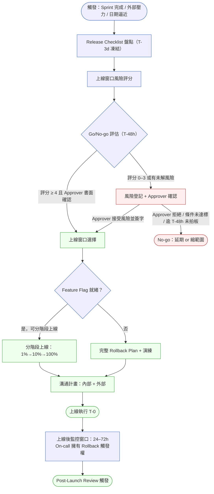
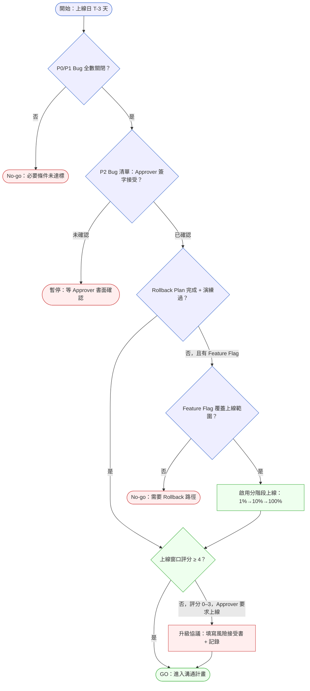

# 第 17 章 | Release Planning：上線不等於交付

> **前置閱讀**：[Ch 15　Estimation & Scope：工程估算的 PM 解讀](./ch-15-estimation-scope.md)
> **前置閱讀**：[Ch 16　Risk Register for PM：PM 視角的風險登記](./ch-16-risk-register.md)
> **下游章節**：[Ch 18　GTM Coordination：上線那天，工程只是開始](./ch-18-gtm-coordination.md)
> **下游章節**：[Ch 38　Post-Launch Review：上線後的 PM 責任](../part-06-metrics/ch-38-post-launch-review.md)
> **SA/SD 對照**：[SA/SD 第 2 章　SDLC 與方法論演進](../../book/part-01-foundations/ch-02-sdlc-evolution.md)
> ⸺ SA 視角關注 SDLC（軟體開發生命週期，Software Development Life Cycle）各階段的技術門控；本章關注 PM 如何在上線前定義「完成」的邊界，以及當門控條件不達標時，誰有權拍板、怎麼拍。

---

## §17.1 冷觀察

週四下午四點，上線同步會開到一半，CEO 推門進來。

他沒坐下。

「我剛跟 VP of Sales 通完電話，」他說，「下週一上線。雙十一前要留兩週給他們跑 campaign。」

會議室安靜了兩秒。原定上線日是下下週三——Sprint 已經燒了三個週期，QA 還壓著兩個 P2 bug 沒關，Release Checklist 上「Rollback Plan」那一列，狀態還停在「進行中」。

PM 看了一眼 Engineering Lead。Engineering Lead 低頭看筆電。沒有人說話。

「沒問題吧？」CEO 問。這不是問句。

PM 張了張嘴，最後說出口的是：「我們盡量。」

上線日就這樣從週三提前到下週一，縮短了九天。會議室裡沒有人說不——不是因為他們覺得可以，是因為沒有人手上有一張能說「不」的依據。

那個週末，Engineering 連夜進了七個 hotfix，QA 跑了一輪縮版回歸（regression，回歸測試）。為了趕時間，縮版跳掉了「Cart + CMS 同步狀態驗證」的情境組合。週一早上十點，ShopFlow 的促銷活動功能上線。Checkout 頁面正常、Cart 服務的折扣碼邏輯生效、CMS 端的活動 banner 同步完成。儀表板一片綠。

下午兩點，客服系統開始堆訂單。折扣碼套用了，金額卻沒更新：前端顯示折扣後的價格，後端計費仍走原始金額。那個被縮版回歸跳掉的情境組合，正是漏洞所在。

沒有 Rollback Plan。沒有 Feature Flag（功能旗標）。

Engineering 只剩兩個選項：把出問題的 Checkout 路徑整段停掉，或者緊急 hotfix。停掉等於促銷活動當天中斷，而 Sales 已經發出去的 EDM（電子報行銷，Electronic Direct Mail）收不回來。他們選了 hotfix。

修復花了三十六小時。這期間訂單持續進來，有的用戶被收原始金額、有的被收折扣金額。退款、客服紀錄、財務對帳，整整跑了兩個星期。

那個週四下午，PM 沒有說不。但真正的問題不是「PM 不夠勇敢」。是在那個房間裡，沒有人知道「說不」需要哪些依據，也沒有人能回答：說了不之後，這個決策的責任，到底由誰扛。

---

## §17.2 真問題

把 ShopFlow 的事件拆開，表面是「上線日期被壓縮，QA 不足」。但這句話裡其實塞了三個不同的問題，混在一起，從沒被分開過。

### 表面需求（What）

CEO 想在雙十一前上線，給 Sales 兩週跑 campaign。這是時間節點需求。工程端想要完整的 QA 週期和完整的 Rollback 準備。這是品質需求。兩個需求彼此不相容，但都是真的。

會議室裡所有人都只看到這一層，然後開始「協調」——協調的結果是時間需求贏了，品質需求被壓縮成一個「weekend sprint」。

### 業務目標（Why）

時間需求背後的業務邏輯是：雙十一前兩週是 EDM 最有效的窗口，轉換率在節日前七到十天最高。但如果兩週變一週，campaign 的 ROI（投資報酬率，Return on Investment）預估會掉多少？這個數字從來沒被量化過。

同樣，品質風險的業務影響也沒被量化。P2 bug 在縮版回歸下漏掉的機率是多少？Cart + CMS 同步問題在高並發下出現的概率是多少？

現實是，這兩個數字在實際開會中幾乎不可能即時算出——沒有哪個 PM 能在 CEO 推門後的三分鐘內建好 ROI 模型。但這不代表 PM 只能靠直覺或嗓門。本章第三節的上線窗口評分矩陣（0–8 分）正是為了彌補這個缺口而設計：它把「Campaign ROI 會掉多少」和「P2 bug 在高並發下漏掉的機率」這兩類難以即時量化的問題，收斂成四個可當場填答的維度分數。評分 0–3 就是「風險超出業務緊迫性」的操作性定義；評分 4 分以上加上 Approver 書面確認，就是「業務優先、風險已被知情接受」的操作性定義。這張表不是要取代 ROI 計算，而是讓 PM 在沒有 ROI 計算的情況下，手上仍然有一個可以指著說話的數字。

沒有這些數字，「提前上線」和「維持 QA 週期」就只是兩個人的意見在對撞，嗓門大的贏。

### 決策瓶頸（Who × When）

真正的決策瓶頸有兩個維度，而 ShopFlow 兩個都沒答案。

**Who——誰有權做這個 Go/No-go 決定？** CEO 說了一個日期，PM 沒有反駁，Engineering 接受了。這不是決策過程，這是壓力傳遞。Go/No-go 是一個有具體觸發條件的決策，不是「誰職位高誰定」。如果 Rollback Plan 沒完成，是否該觸發 No-go？如果 P2 bug 沒關，上線的業務風險是否超出 Approver（核准者）的授權範圍？這些問題沒人問，也沒人被指定要回答。

**When——這個決定要在什麼時間點之前做完？** 「誰拍板」如果沒有綁定「什麼時候拍」，授權結構就是空的。Go/No-go 不能在上線前一晚開、更不能在上線當天早上口頭決定，因為那時所有人都已經沒有退路，No-go 在心理上變成不可能的選項。一個可運作的 Release，決策窗口必須在排程上明確標好：

| 時間點 | 動作 | 責任人 | 不達標的後果 |
|---|---|---|---|
| **T-3d**（上線前 3 個工作日） | Release Checklist 凍結盤點，所有未解風險登記完畢 | PM（Driver） | 風險清單不完整 → Go/No-go 無法基於事實 |
| **T-48h** | Go/No-go 會議召開，Approver 出席並書面拍板 | Approver | 過了 T-48h 仍未拍板 → 自動視為 No-go（延期） |
| **T-24h** | Rollback 演練完成、外部溝通渠道確認 | Eng Lead + PM | 演練未過 → 觸發 No-go 重評 |
| **T-0** | 上線執行，進入監控窗口 | On-call | — |

關鍵在最後一欄的「不達標後果」：T-48h 沒拍板就自動 No-go，這條規則把「沉默」從預設的 Go 翻轉成預設的 No-go。在 ShopFlow，沒有這條時間軸，所以 CEO 週四丟下的一句話，就一路滑到了週一上線——中間沒有任何一個時間閘口逼任何人正式拍板。

---

### Outputs / Outcomes / Impact 的混淆

ShopFlow 的上線產出了什麼？

| 層次 | ShopFlow 的狀況 |
|---|---|
| **Outputs（產出）** | 功能上線了：折扣碼、活動 banner、促銷 Checkout 頁面。 |
| **Outcomes（成果）** | 使用者行為改變了嗎？折扣碼的使用率多少？促銷轉換率比基線高多少？這些數字在事故後從未被清算，因為退款和客服紀錄蓋過了一切。 |
| **Impact（影響）** | 業務指標移動了嗎？雙十一整體 GMV、活動 ROI、客服成本、財務對帳成本——全部沒被算進去。 |

上線這個 Output 被當成交付完成。但 Outcomes 和 Impact 在上線後的三十六小時裡，是負的。

---

### DACI 缺位

DACI（Driver / Approver / Contributor / Informed）是一種決策角色框架：Driver 推動、Approver 拍板、Contributor 提供輸入、Informed 被告知結果。

| 角色 | 應有配置 | ShopFlow 的實際狀況 |
|---|---|---|
| **D** Driver | PM 推動 Release Checklist 完成、協調各方確認 | PM 在壓力下接受了日期，沒有推動 Checklist 完成 |
| **A** Approver | 明確指名的 Go/No-go 決策者，有業務授權 | 事實上是 CEO，但沒有正式確認，也沒有基於 Checklist 的依據 |
| **C** Contributor | QA、Engineering Lead、Risk Owner 提供輸入 | QA 提供了意見但沒被納入決策；Engineering 接受了壓縮 |
| **I** Informed | Sales、Marketing、Finance 被通知結果 | Sales 主導了決定，根本不在 Informed 位置 |

整個 DACI 配置倒置了：Sales 從 Informed 跑到了實質 Approver 的位置，PM 從 Driver 退成傳遞者，QA 的輸入沒有進入決策迴路。

Release Planning 要解決的不是「如何把功能做完」，而是「**誰，在什麼條件下、什麼時間點之前，有授權說這個可以上線**」——以及「**如果上線後出問題，誰負責、怎麼收**」。

---

## §17.3 決策框架

下面的工具不是要替你做決定，而是把「該問哪些問題、卡在哪個閾值」攤開來，讓你在會議室裡能指著一條規則說話，而不是靠嗓門。

### 圖 A — Release 流程：Go/No-go → 上線窗口 → Rollback Plan → 溝通



流程的關鍵在兩個節點：**Go/No-go 評估**和**Rollback Plan / 分階段上線確認**。兩個節點都不是單人可以跳過的；任一節點缺席，後面的步驟都是在沒有安全網的情況下走鋼絲。

---

### 上線窗口風險評分矩陣

Go/No-go 的核心問題是「這次上線的風險，有多少是可控的？」評分矩陣把這個問題拆成四個可量化的維度，讓「我覺得有點冒險」變成一個數字：

| 維度 | 2 分（低風險） | 1 分（中等風險） | 0 分（高風險） |
|---|---|---|---|
| **流量風險** | 低流量時段（非促銷、非週末尖峰） | 平日正常時段 | 促銷活動日 / Campaign 已發出 |
| **Rollback 就緒** | Feature Flag 全覆蓋 或 Rollback 腳本演練 Pass | Feature Flag 部分覆蓋 | 無 Feature Flag、無 Rollback 腳本 |
| **Bug 債務** | P2 ≤ 2 個 且 Approver 已書面接受 | P2 = 3–5 個 | P2 > 5 個 或 任一 P1 未關 |
| **Approver 就緒** | Approver 書面確認 Go，T-48h 前完成 | Approver 口頭確認，待補書面 | Approver 未出席 / 未確認 |

**判讀規則**：
- **總分 7–8**：Go-Ready，可按計畫上線
- **總分 4–6**：需要 Approver 書面確認各風險維度後才可上線
- **總分 0–3**：建議 No-go；若 Approver 堅持上線，須填寫「風險接受書」（見下文 §17.3 IF-Then 框架）

> **ShopFlow 的評分**：流量 0（促銷日 EDM 已發）+ Rollback 0（無任何路徑）+ Bug 1（P2×2 未書面接受）+ Approver 0（未確認）= **總分 1**。這個數字，在 T-48h 就應該阻止上線——不需要「勇氣」，只需要這張表。

---

### 圖 B — Go/No-go 決策樹



決策樹的邏輯是：P0/P1 是硬性 No-go，沒有例外；P2 可以接受，但必須有 Approver 書面確認風險；Rollback Plan 缺失可以用 Feature Flag 補位（並啟用分階段上線），但兩者都缺就是 No-go。

---

### 分階段上線：Feature Flag 梯度策略

當 Feature Flag 就緒時，不要一次 100% 上線——分階段上線把爆炸半徑（Blast Radius）控制在可接受範圍內：

| 階段 | 流量比例 | 最短烘烤時間 | 觀察指標 | 推進條件 |
|---|---|---|---|---|
| **Canary** | 1% | 4 小時 | Error Rate、P99 Latency、業務指標基線 | 無告警觸發，指標在閾值內 |
| **Limited** | 10% | 4 小時 | 同上 + 用戶反饋渠道 | 無新增問題，Canary 指標穩定 |
| **Full** | 100% | — | 持續監控 24–72h | — |

> **階段中止條件**：任何階段若 Error Rate > 1%（或業務指標告警觸發），On-call 工程師可立即切回上一階段，無需等待 PM 或 Approver 批准。這個「自動降級授權」必須在 T-0 前書面確認。

若無 Feature Flag 可用（涉及 DB Migration、計費邏輯），則必須準備完整 Rollback 腳本並演練，且不得分階段上線——大爆炸（Big Bang）上線需要更嚴格的 Go/No-go 條件（評分建議 ≥ 6）。

---

### 上線後事故回應：Rollback vs. Hotfix 決策

上線後出問題，最常見的混亂是：**誰有權決定 Rollback 還是 Hotfix？** 這個問題不能留到出問題再討論——必須在 T-0 前寫進 Checklist。

| 條件 | 建議行動 | 決策人 | 授權方式 |
|---|---|---|---|
| Error Rate > {X}% 持續 > {Y} 分鐘 | 立即 Rollback / 切回上一 Feature Flag 階段 | On-call 工程師 | T-0 前書面授權，無需逐級報告 |
| 業務指標偏差 > {Z}%，但無系統錯誤 | 升級給 PM + Engineering Lead，評估 Hotfix 或 Rollback | PM + Eng Lead | 30 分鐘內決定 |
| P0 bug 在生產環境發現 | 停止分階段推進，召開緊急 War Room | PM 召集，Approver 知會 | 即時 Slack / 電話 |
| 凌晨 2 時告警觸發（On-call 值班中） | On-call 工程師持有 Rollback 觸發權；PM 在 30 分鐘內被告知 | On-call 工程師 | 預授權，事後補 incident ticket |

> **核心原則**：Go/No-go 是 T-0 前的決策；T-0 之後，Rollback 觸發權屬於 On-call，不需要等 Approver 批准。若出問題時 On-call 無法聯繫 Approver，預設行動是 Rollback，而不是繼續等待。

**上線後監控責任歸屬**（24–72h 窗口）：

| 時間段 | 責任人 | 主要動作 |
|---|---|---|
| T+0 到 T+4h | On-call 工程師（主）+ PM（副） | 系統指標監控，業務指標基線確認 |
| T+4h 到 T+24h | On-call 工程師 + PM | 用戶反饋渠道監控，客服異常升級 |
| T+24h 到 T+72h | PM（主）+ On-call（備） | 業務指標趨勢，7 天 KPI 觀察窗啟動 |
| T+72h | PM | 觸發 Post-Launch Review（見 Ch 38） |

---

### 執行長壓力下的對話腳本

當 CEO 或高層在 T-48h 之前施壓要求繞過 Go/No-go 流程，PM 的角色不是反駁，而是讓決策責任回到正確的位置。以下是一段可以實際說出口的腳本：

> **情境**：CEO 在週四推門說「下週一上線，Sales 要兩週跑 campaign」，目前 Rollback Plan 未完成、P2 Bug 未書面確認。

**PM 的回應框架（分三步）**：

**步驟一：確認業務目標，不否定需求**
> 「我完全理解雙十一前兩週是最有效的窗口，這個目標我們都支持。讓我在五分鐘內把目前的狀態給你看一下。」

**步驟二：用數字呈現風險，不用情緒**
> 「根據我們現在的 Release Checklist，上線窗口評分是 1 分（滿分 8 分）。具體是：Rollback Plan 沒有——這代表出問題的話，最快的修復路徑是 hotfix，RTO 無上限；兩個 P2 bug 的業務影響評估還沒完成；EDM 如果已經發出去，高流量窗口我們沒有降級手段。這不是工程在說不，是這張表在說不。」

**步驟三：把決策責任交回給 Approver，並書面記錄**
> 「如果你決定接受這個風險並且要我們上線，我需要你在這份文件上填上你的名字，說明你理解並接受這些條件。這樣工程和 QA 都知道這是經過授權的決定，而不是口頭指令。我們現在可以做這件事。」

這個腳本的核心不是「說不」，而是**把書面確認作為上線的前提**——讓 CEO 的口頭壓力變成一個需要簽名的決定。簽了名，這是他的決策；不簽名，No-go 自動生效。

---

### 7 天學習議程：上線後應觀察什麼

上線後的監控不是等問題出現——而是預先設計要觀察的指標和閾值，讓「出問題」有一個可以提早發現的信號：

| KPI | 基線（上線前 14 天平均） | 告警閾值（觸發調查） | 觀察窗口 |
|---|---|---|---|
| 折扣碼套用成功率 | {X}% | < {X-10}% 或 > {X+20}% | T+0 到 T+7d |
| Checkout 轉換率 | {Y}% | < {Y-15}% | T+0 到 T+7d |
| 退款率 | {Z}% | > {Z+50}% | T+1 到 T+7d |
| 客服工單量（折扣相關） | {W} 件/天 | > {W×2} | T+0 到 T+7d |

> **學習議程設計原則**：每次上線前，PM 應在 Release Checklist 中定義至少 3 個上線後 7 天的 KPI，以及觸發「需調查是否與本次上線相關」的偏差閾值。數字不需要精確，但必須存在——沒有閾值的監控只是在等問題爆發，不是在管理風險。

---

### IF-Then 框架：上線條件矩陣

在具體規劃上線時，用以下條件組合決定處理方式：

- **If** 時間壓力來自外部合約或法規截止日 → **Then** 優先確認 MVP 範圍縮減，不接受 QA 壓縮
- **If** 時間壓力來自內部業務活動（促銷、發佈會） → **Then** 要求 Sales/Marketing 提供延期的業務損失量化，再由 Approver 決策
- **If** 時間壓力來自 CEO / 管理層壓力，Approver 堅持上線 → **Then** 填寫風險接受書（見 §17.5 模板），Approver 書面簽字，記錄存檔
- **If** 功能涉及純前端，無 DB 寫入 → **Then** Feature Flag 作為主要 Rollback 工具，可接受無完整 Rollback Plan
- **If** 功能涉及新 DB 欄位 / 資料寫入 → **Then** 必須有 Migration 回滾腳本並演練一次
- **If** 功能涉及計費 / 財務邏輯 → **Then** No-go 條件升為 P0 等級，不接受豁免；Approver 需為 CFO 或 VP Engineering 以上層級
- **If** Feature Flag 就緒 → **Then** 啟用分階段上線（1%→10%→100%），每階段最少烘烤 4 小時
- **If** 上線窗口評分 0–3，且 Approver 堅持 Go → **Then** 填寫風險接受書並存檔，On-call 工程師預授權 Rollback 觸發

---

### 溝通計畫所有人定義

Release Checklist 的「溝通計畫」欄位最常流於形式——列了渠道，沒有列負責人。以下是一個完整的所有人配置：

| 溝通對象 | 內容 | 時間點 | 負責人 | 渠道 |
|---|---|---|---|---|
| 內部工程團隊 | 上線窗口、On-call 名單、Rollback 觸發條件 | T-48h | PM | Slack #release |
| Sales / Marketing | 功能上線時間、Campaign 可啟動條件 | T-24h | PM | Email + Slack |
| 客服 / Support | 新功能操作說明、預期用戶問題 FAQ | T-24h | PM + PO | Confluence + Slack |
| Finance（涉及計費） | 計費邏輯變更說明、退款處理流程 | T-24h | PM | Email |
| 外部用戶（重大變更） | 功能上線公告 | T-0 + 2h（確認無問題後） | Marketing | 官網 / 推播 |
| Approver | 上線後 T+4h 狀態更新 | T+4h | PM | Email / Slack DM |

> **注意**：外部用戶通知應在上線後確認系統穩定（T+2h 無 P0 告警）再發出，不要在 T-0 同步觸發——避免功能出問題時公告已發出的被動局面。

---

## §17.4 踩坑清單

**反模式：上線 = 交付完成**

現象：功能部署到 Production 之後，PM 把這個 Sprint 的 Story 標成 Done，Retro 上報告「本週完成三個功能」，然後開始下一個 Sprint。

根因：Release 日期是可見的里程碑，Outcomes 的數據要一到兩週後才出現。在這個空白期，「上線」就成了最方便的完成定義。

> 修正方向：在 Definition of Done（完成的定義）加一條：「上線後 7 天的目標 KPI 達到 X 閾值」。功能上線是 Output，Outcome 達標才是交付完成。具體的 KPI 和閾值在 Sprint Planning 時就定好，並記進 Release Checklist 的「7 天學習議程」欄位。

---

**反模式：Rollback Plan 寫在文件裡沒人演練**

現象：Release Checklist 上「Rollback Plan：已備妥」打了勾，但沒有人真的跑過一次。上線後出問題，翻出文件才發現回滾腳本依賴的 staging 環境已經三個月沒有同步 schema。

根因：演練需要時間，而演練失敗會推遲上線，所以在壓力下，演練步驟最先被跳過。

> 修正方向：把 Rollback 演練設為 Release Checklist 的硬性條件，同時定義「演練的最低標準」——不需要完整演練，但至少要能跑完「回滾腳本可以無錯誤執行」這一步，並把演練的時間戳和 Pass/Fail 結果記進 Checklist。

---

**反模式：Go/No-go 會議沒有 Approver**

現象：上線前的確認會議，PM + Engineering Lead + QA 都出席了，但有 Go 決定權的 Approver（通常是 Engineering Director 或 CPO）沒來，或者只有 CEO 臨時說了一句「沒問題就上吧」。

根因：Go/No-go 的 Approver 通常不是 PM，但會議的召集責任在 PM。如果 PM 自己不清楚誰是 Approver，會議就會在沒有決策授權的人之間進行。

> 修正方向：在 Release Planning 初期就把 DACI 確認完，把 Approver 的名字寫進 Release Checklist 的第一行，並且在 T-48h 確認 Approver 知道會議時間和自己的角色。

---

**反模式：把上線窗口給 Marketing 決定**

現象：Sales 或 Marketing 說「我們的 campaign 在週五發，所以功能要週五上線」，PM 接受了，然後工程端加班整個週四晚上趕上線，QA 在週五早上跑縮版。

根因：外部業務活動的日期是具體的、可見的，工程品質的風險是抽象的、不確定的。在兩邊都有壓力時，具體的日期往往贏。

> 修正方向：在 Roadmap 層級就把「上線窗口選擇原則」告知 Sales/Marketing：功能上線日由工程準備度決定，Campaign 日期可以晚於上線日。兩個日期不必綁在一起。如果 Campaign 日期有外部合約限制，應進入 Release Risk 評估流程（含評分矩陣），而不是直接接受。

---

**反模式：沒有書面 Go 確認，只有會議室口頭共識**

現象：Go/No-go 會議結束，大家「點了頭」，Engineering 開始準備上線。但三天後出了問題，Approver 說「我當時說的是有條件的 Go，沒有說無條件 Go」。

根因：口頭共識在壓力下是模糊的。「Go」這個字在不同人的理解裡有不同的前提條件。

> 修正方向：Go/No-go 會議結束後，由 PM 在三小時內發出 Go 確認郵件或在 release ticket 補上 comment，列出「基於以下條件，Approver XX 確認 Go」，並附上未解風險的書面接受記錄。這封郵件不是用來追究責任的，是讓所有人的理解對齊。

---

**反模式：分階段上線沒有「退出條件」**

現象：Feature Flag 設好了，Canary 1% 上線了，儀表板一片綠，工程師直接推到 100%——跳過了 10% 的觀察窗口，也沒有定義「什麼情況下應該停在 10%」。

根因：分階段上線的「推進條件」在事前沒有被定義，每一階段的推進都變成人工判斷，壓力下最容易被加速跳過。

> 修正方向：在 T-0 前，把每個階段的「推進條件」和「中止條件」寫進 Checklist：Canary 無告警、業務指標基線確認後才推進到 10%；10% 穩定 4 小時後才推 100%。中止條件觸發時，On-call 工程師可以不等 PM 批准就退回上一階段。

---

## §17.5 交付清單 ⸺ 一頁式 Release Go/No-go Checklist

本章交付的核心 artifact 是一份 **Release Go/No-go Checklist**，它把前面的決策框架收斂成一張可以填、可以歸檔、可以在會議室裡指著說話的單頁文件：

- **Release Go/No-go Checklist 模板**（空白版）——八個區塊各對應一個決策點，下面的 §17.5.1 是填好的範例。
- **上線窗口風險評分表**——嵌在第三區塊，把「我覺得冒險」轉化為 0–8 的具體分數。
- **Rollback 演練紀錄表**——掛在第二區塊底下，把「有沒有演練」從一個打勾欄升級成一筆有日期、有結果的紀錄。
- **7 天學習議程**——嵌在第六區塊，上線前就設計好要觀察的 KPI 和告警閾值。
- **Go 確認郵件範本**——Go/No-go 會議後三小時內發出，對齊所有人對「Go」的理解。

````markdown
# Release Go/No-go Checklist
> 版本:v0.1 | 撰寫日期:YYYY-MM-DD | 擁有人:{名字}
版本：{版本號 / Sprint 號}
上線日期：{YYYY-MM-DD HH:MM}
PM：{PM 姓名}
Approver：{Approver 姓名，必須具體人名}
上線後事故回應：On-call 工程師 {姓名}（持有 Rollback 觸發預授權）
最後更新：{更新時間}
決策時間軸：T-3d 凍結盤點 / T-48h Go-No-go 拍板 / T-24h 演練+溝通 / T-0 上線

---

### 一、Bug 狀態

- [ ] P0 Bug：全部關閉（0 open）
- [ ] P1 Bug：全部關閉（0 open）
- [ ] P2 Bug：{開放數量} 個，Approver 已書面接受風險
      → 風險接受記錄連結：{ticket / email link}

---

### 二、Rollback 準備

上線策略：{Feature Flag 分階段（1%→10%→100%）/ 完整 Rollback Plan（Big Bang）}

**若採用 Feature Flag 分階段上線**：
- [ ] Feature Flag 覆蓋上線功能範圍：{是 / 否}
- [ ] Canary 推進條件：Error Rate < {X}%，業務指標基線確認
- [ ] Canary 中止條件：Error Rate > {X}% 持續 > {Y} 分鐘 → On-call 自動降級，無需批准
- [ ] 每階段最短烘烤時間：4 小時

**若採用完整 Rollback Plan**：
- [ ] Rollback 方案：{回滾腳本位置 / DB Migration 回滾腳本}
- [ ] RTO（Recovery Time Objective，復原時間目標）：{N 分鐘內完成 Rollback}

### 2.1 Rollback 演練紀錄（硬性條件，無紀錄視為未演練）

| 演練日期 | 演練範圍 | 結果 | 復原耗時 | 執行人 | 備註 / 失敗原因 |
|---|---|---|---|---|---|
| [ ] {YYYY-MM-DD} | {Feature Flag 切換 / 腳本回滾 / 全鏈路} | {Pass / Fail} | {N 分鐘} | {姓名} | {若 Fail，記錄阻塞點與重演練日期} |

> 演練最低標準：回滾腳本可無錯誤執行一次，且實測復原耗時 ≤ RTO。
> Fail 時必須記錄，並在重演練 Pass 後才可進入 Go 評估。

---

### 三、上線窗口風險評分

| 維度 | 評分（0/1/2） | 依據說明 |
|---|---|---|
| 流量風險 | {分} | {說明} |
| Rollback 就緒 | {分} | {說明} |
| Bug 債務 | {分} | {說明} |
| Approver 就緒 | {分} | {說明} |
| **總分** | **{合計} / 8** | 7–8=Go-Ready；4–6=需書面確認；0–3=建議 No-go |

- 計畫上線時段：{時間段}
- On-call 值班：{工程師姓名} + {PM 備用：姓名}
- 業務活動衝突：{有 / 無}，說明：{活動名稱 + 發出時間}

---

### 四、監控覆蓋

- [ ] Error Rate 告警：{服務名稱} 告警閾值 {X}%
- [ ] Latency P99 告警：{服務名稱} 閾值 {Xms}
- [ ] 業務指標告警：{指標名稱} 閾值 {數值}
- 上線後監控窗口：{24h / 48h / 72h}

**上線後事故回應授權**：
- Rollback 觸發權：On-call 工程師 {姓名}，Error Rate > {X}% 持續 > {Y} min 即可觸發，無需等待 PM 批准
- 業務指標偏差 > {Z}%：升級給 PM + Eng Lead，30 分鐘內決定 Rollback 或 Hotfix
- 凌晨事故：On-call 先 Rollback，事後補 incident ticket 並通知 PM

---

### 五、溝通計畫

| 對象 | 內容 | 時間點 | 負責人 | 渠道 |
|---|---|---|---|---|
| 工程團隊 | 上線窗口、On-call 名單、Rollback 條件 | T-48h | PM | Slack |
| Sales / Marketing | 功能上線時間 | T-24h | PM | Email |
| 客服 / Support | FAQ、新功能說明 | T-24h | PM + PO | Confluence |
| Finance（計費變更） | 計費邏輯說明 | T-24h | PM | Email |
| 外部用戶 | 功能上線公告（T+2h 確認穩定後） | T+2h | Marketing | 推播 |

---

### 六、7 天學習議程

| KPI | 基線（上線前 14 天平均） | 告警閾值 | 觀察窗口 |
|---|---|---|---|
| {指標 1} | {基線值} | {偏差 ±X%} | T+0 到 T+7d |
| {指標 2} | {基線值} | {偏差 ±X%} | T+1 到 T+7d |
| {指標 3} | {基線值} | {偏差 ±X%} | T+0 到 T+7d |

> 告警觸發時，PM 負責調查是否與本次上線相關，並在 T+7d Post-Launch Review 中報告。

---

### 七、DACI 確認

| 角色 | 姓名 | 確認方式 | 確認時間 |
|---|---|---|---|
| Driver（PM） | {姓名} | Checklist 完成 | {時間} |
| Approver | {姓名} | {郵件 / ticket comment} | {時間} |
| Contributor：QA | {姓名} | {方式} | {時間} |
| Contributor：Eng Lead | {姓名} | {方式} | {時間} |

---

### 八、Go/No-go 最終決定

**上線窗口評分**：{合計} / 8

決定：{GO / NO-GO}（T-48h 前未填 → 自動 NO-GO）
條件：{無條件 / 附帶條件：XXX}
Approver 書面確認連結：{連結}

**若 Approver 在評分 0–3 情況下堅持 Go**，以下為風險接受書：
> 「我 {Approver 姓名} 理解本次上線的上線窗口評分為 {N}/8，主要風險為 {列出風險}。我接受上述風險並授權上線，本決策由我承擔。」
> 簽名：{Approver 姓名}　日期：{YYYY-MM-DD}
````

把它存在 `docs/release/`，跟程式碼同 repo，跟 README 同層。

---

### §17.5.1 範例：ShopFlow 促銷活動功能上線（CASE-ECM-107）

ShopFlow 事件發生前，沒有這份 Checklist。以下是如果當時填了，它會長什麼樣子——以及它應該在哪個欄位觸發 No-go。

````markdown
# Release Go/No-go Checklist
> 版本:v0.1 | 撰寫日期:2026-02-15 | 擁有人:Lisa Wang（PM）
版本：Sprint-23 / 促銷活動功能 v1.0
上線日期：2025-10-14 10:00（週一）
PM：Lisa Wang
Approver：David Chen（VP Engineering）
上線後事故回應：On-call 工程師 Alex Tsai（持有 Rollback 觸發預授權）
最後更新：2025-10-11 22:30
決策時間軸：T-3d=10/09 凍結 / T-48h=10/12 10:00 拍板 / T-24h=10/13 演練 / T-0=10/14 10:00

---

### 一、Bug 狀態

- [x] P0 Bug：全部關閉（0 open）
- [x] P1 Bug：全部關閉（0 open）
- [ ] P2 Bug：2 個，Approver 已書面接受風險
      → 風險接受記錄連結：【缺】
<!-- 這欄空著 → 風險接受沒有完成 → 應觸發暫停。 -->

---

### 二、Rollback 準備

上線策略：Big Bang（無 Feature Flag）

- [ ] Rollback 方案：【缺：Feature Flag 未部署，DB Migration 回滾腳本未備妥】
- [ ] RTO：【未定義】

### 2.1 Rollback 演練紀錄

| 演練日期 | 演練範圍 | 結果 | 復原耗時 | 執行人 | 備註 |
|---|---|---|---|---|---|
| 【缺】 | 【未演練】 | 【N/A】 | 【N/A】 | 【N/A】 | 涉及計費邏輯卻無任何 Rollback 演練 |
<!-- 計費改動 + 無 Rollback 路徑 = 出問題後 RTO 無上限。
     這一格的「未演練」在 T-24h 直接擋下上線。 -->

---

### 三、上線窗口風險評分

| 維度 | 評分（0/1/2） | 依據說明 |
|---|---|---|
| 流量風險 | **0** | 促銷日，EDM 已於 T-48h 發出，預估流量 3–4 倍 |
| Rollback 就緒 | **0** | 無 Feature Flag，無回滾腳本，無演練 |
| Bug 債務 | **1** | P2×2，但 Approver 書面接受記錄缺失 |
| Approver 就緒 | **0** | David Chen 未出席 T-48h 會議，未書面確認 |
| **總分** | **1 / 8** | **建議 No-go**（0–3 範圍）|

- 計畫上線時段：週一 10:00（促銷活動日）
- On-call 值班：Alex Tsai（Eng）+ Lisa Wang（PM）
- 業務活動衝突：有，「雙十一暖身促銷」EDM 已於 10/12 發出，無法撤回

---

### 四、監控覆蓋

- [x] Error Rate 告警：checkout-service 閾值 1%
- [x] Latency P99 告警：checkout-service 閾值 500ms
- [ ] 業務指標告警：折扣碼套用成功率 —— 【未設定，無基線】
<!-- 新功能業務指標告警缺失：若有設定，Cart 金額不一致問題
     在上線後 30 分鐘內就能被偵測到。 -->

**上線後事故回應授權**：
- Rollback 觸發權：【缺：未定義 On-call 的預授權條件】
- 實際發生：出問題後三方討論 36 小時才決定路徑

---

### 五、溝通計畫

- [x] T-48h 內部通知：Engineering、QA、Sales
- [x] T-24h 外部渠道：客服知會
- [x] Post-Launch 狀態更新：Lisa Wang，上線後 2 小時
- 【缺】Finance 未被通知計費邏輯變更

---

### 六、7 天學習議程

| KPI | 基線 | 告警閾值 | 觀察窗口 |
|---|---|---|---|
| 折扣碼套用成功率 | 【未建立基線】 | 【未定義】 | 【未設定】 |
<!-- 若有設定「折扣碼套用成功率 < 基線 -10% 觸發告警」，
     事故在 T+30min 就能被偵測到，而不是等到 T+4h 客服電話湧入。 -->

---

### 七、DACI 確認

| 角色 | 姓名 | 確認方式 | 確認時間 |
|---|---|---|---|
| Driver（PM） | Lisa Wang | Checklist 完成 | 2025-10-11 22:30 |
| Approver | David Chen | 【缺：未書面確認】 | 【缺】 |
| Contributor：QA | May Lin | Slack 確認 | 2025-10-11 18:00 |
| Contributor：Eng Lead | Alex Tsai | Slack 確認 | 2025-10-11 20:00 |

---

### 八、Go/No-go 最終決定

**上線窗口評分**：1 / 8

決定：【應為 NO-GO】
條件：評分 1/8；Rollback Plan 缺失 + 演練紀錄空白 + P2 Bug 風險未書面接受 + Approver 未確認 + On-call 預授權未定義
Approver 書面確認連結：【缺】

**若當時 CEO 堅持上線，應填寫**：
> 「我 David Chen 理解本次上線評分為 1/8，主要風險為：無 Rollback 路徑（計費邏輯）、EDM 已發出（高流量窗口）、P2 Bug 未評估業務影響。我接受上述風險並授權上線。」
> 這份書面記錄讓決策責任歸位，而不是讓 PM 一人承擔後果。
````

這份 Checklist 在五個位置同時亮紅燈：評分 1/8、Rollback 欄位、演練紀錄空白、P2 Bug 的書面接受、以及 Approver 確認連結。任何一個獨立觸發，按照這份文件的邏輯，都應該是 No-go 或暫停。

有這份 Checklist，PM 不需要在會議室裡「勇敢說不」——文件本身就是依據。當 CEO 堅持，風險接受書讓這個決定有主人。

---

## §17.6 Recap

讀完本章，你應該已經能做到：

- [ ] 在 Sprint Planning 或 Release Planning 時建立 Go/No-go Checklist，並把 Approver 的名字填進第一行
- [ ] 把 Go/No-go 的決策窗口寫死在排程上（T-3d 凍結 → T-48h 拍板 → T-24h 演練 → T-0 上線），讓「沉默」預設為 No-go 而不是 Go
- [ ] 使用上線窗口風險評分矩陣（4 維度，0–8 分），把「我覺得冒險」轉化為可以指著說話的數字；評分 0–3 時主動觸發風險接受書流程
- [ ] 當 Feature Flag 就緒時，採用分階段上線（1%→10%→100%），每階段至少烘烤 4 小時，並書面定義每階段的推進條件和中止條件
- [ ] 在 T-0 前書面確認 On-call 工程師的 Rollback 觸發預授權，讓凌晨事故有人可以直接決定，不需要等 Approver
- [ ] 設計 7 天學習議程：上線前就定義 3–4 個 KPI 和告警閾值，讓監控從「等問題爆發」變成「主動觀察信號」
- [ ] 區分 Output（功能上線）、Outcome（使用者行為改變）、Impact（業務指標移動），把 Definition of Done 擴展到 Outcome 層
- [ ] 把 DACI 配置寫進 Release Checklist，防止 Sales / CEO 從 Informed 漂移到實質 Approver 的位置
- [ ] 面對執行長壓力時，用對話腳本把口頭指令轉化為書面風險接受——不是說不，而是讓決策責任歸位

那個週四下午，會議室裡沒有人手上有依據，所以沒有人說得出「不」。上線是執行的開始，不是交付的終點。拿這份 Checklist 填完一次，你會發現它最有價值的欄位，是那些第一次填的時候是空的——而正是那些空格，讓你下次有底氣說話。

---

## Cross-References

- **前章**：[Ch 16　Risk Register for PM：PM 視角的風險登記](./ch-16-risk-register.md) ⸺ Risk Register 提供本章 Go/No-go 評估的風險輸入來源
- **下一章**：[Ch 18　GTM Coordination：上線那天，工程只是開始](./ch-18-gtm-coordination.md) ⸺ 本章定義了什麼條件可以上線；Ch 18 接手上線後的 GTM 協調，包括外部溝通的執行
- **強連結**：[Ch 38　Post-Launch Review：上線後的 PM 責任](../part-06-metrics/ch-38-post-launch-review.md) ⸺ 本章的 7 天學習議程和監控窗口結束後，進入 Post-Launch Review 的 Outcomes 評估
- **強連結**：[Ch 25　PM × QA：驗收合約不是最後一關](../part-04-collaboration/ch-25-pm-qa.md) ⸺ Go/No-go 的 Bug 分級標準需要與 QA 的驗收標準對齊
- **SA/SD 對照**：[SA/SD 第 2 章　SDLC 與方法論演進](../../book/part-01-foundations/ch-02-sdlc-evolution.md) ⸺ SA 視角關注 SDLC 各階段的技術閘控；本章關注 PM 如何在閘控點建立決策授權結構
- **SA/SD 對照**：[SA/SD 第 30 章　SRE、SLO、Chaos Engineering](../../book/part-05-quality/ch-30-sre-slo-chaos.md) ⸺ SRE 定義服務的 Error Budget 和 SLO；本章的 Release 風險評估應引用這些閾值作為 Go/No-go 的技術依據
