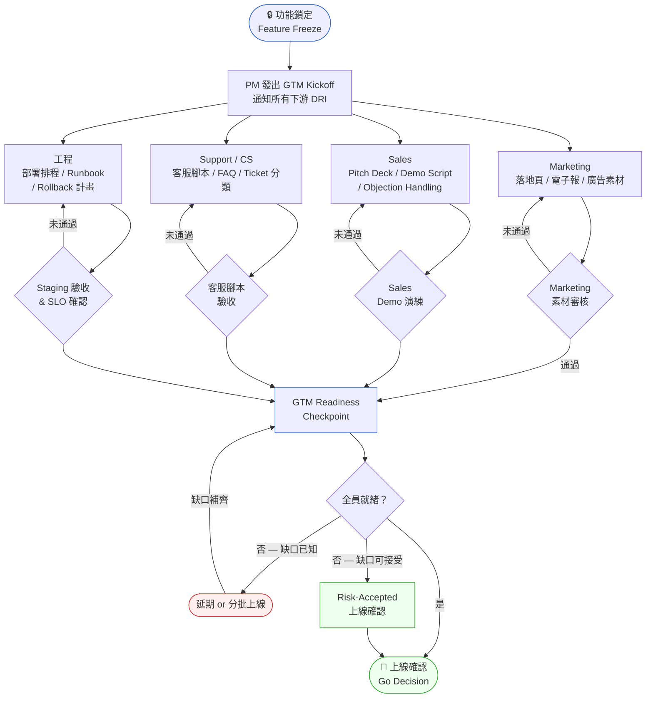
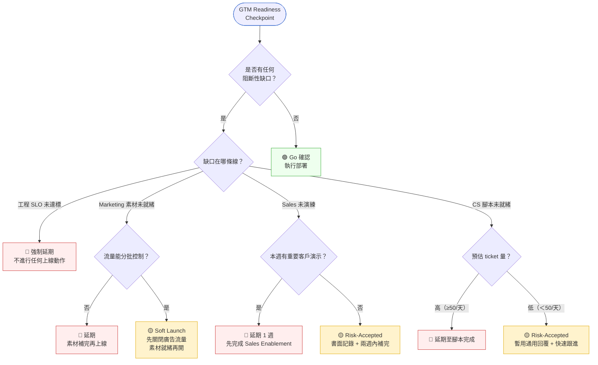

# 第 18 章 | GTM Coordination：上線那天，工程只是開始

> **前置閱讀**：[Ch 17 Release Planning：上線不等於交付](./ch-17-release-planning.md) — 釐清 release 的技術定義後，本章處理 release 之外的商業化協調。
> **下游章節**：[Ch 19 Dependency Management：你擋不住的外部因素](./ch-19-dependency-management.md) — GTM 失敗最常見的源頭就是外部依賴沒接上。
> **SA/SD 對照**：[SA/SD Ch 3 專案啟動、可行性研究與利害關係人分析](../../book/part-01-foundations/ch-03-project-initiation.md) — SA 視角關注的是系統邊界與 stakeholder 的技術需求；本章關注的是同一批 stakeholder 在商業上線那天各自需要什麼，以及誰說了才算數。

---

## §18.1 冷觀察

「多店鋪管理」這個功能，PrimeCart 做了四個月。

工程的部分沒有任何懸念。功能在 staging 環境跑了兩週，QA 把 142 條測試案例全部跑綠，週二早上九點，deploy 到 production 只花了十三分鐘。PM 在上線頻道貼了一張慶祝的貼圖，寫著：「正式上線，辛苦大家了。」

九點四十一分，第一個訊息進來。是大客戶經營部的同事，截了一張客戶的 LINE 對話：「我看到後台多了一個『多店鋪』的分頁，這是什麼？要錢嗎？會不會把我現有的店搞亂？」PM 愣了一下——這位客戶是平台前二十大商家，按理應該在上線前就被告知。但沒有人通知他，因為沒有人被指派去通知他。

十點十二分，Sales 主管在另一個頻道 @了 PM：「下午兩點我要 demo 給一個連鎖品牌客戶，他指名要看多店鋪。我們有 demo 帳號嗎？有腳本嗎？這功能到底怎麼操作？」PM 翻遍了 Confluence，只找到一份四個月前的 PRD，裡面的 UI 早就改過三版。

十一點整，客服主管寄來一封信，主旨只有四個字：「腳本在哪？」信裡列了上午已經進來的十九張工單，全是同一類問題——「多店鋪怎麼用」「為什麼我點進去是空的」「這個會額外收費嗎」。客服人員不知道怎麼回答，因為從來沒有人把這功能的 FAQ 交給他們。

到下午三點，數字攤開來看：客服收到的工單累積到八十一張，其中超過七成是基礎操作疑問；Sales 那場兩點的 demo 因為沒有乾淨的展示帳號，臨時改用工程師的本機環境，客戶看到一半畫面跳出一個測試訂單，當場問「你們這是上線了還是還在測試？」；而那二十大商家裡，已經有三位主動發訊息問「這功能是不是強制開啟，能不能關掉」。

工程那邊，一片祥和。系統穩定，p99 延遲符合 SLO（Service Level Objective，服務等級目標），錯誤率是零。

沉默的不是系統，是整個商業組織——它在那天早上九點被工程推了一把，然後就自己跌倒了。功能做好了，沒有人知道怎麼賣，也沒有人知道怎麼用。

---

## §18.2 真問題

把 PrimeCart 那天發生的事拆開來看，它不是技術事故，也不是單純的溝通失誤。要看清楚真正的問題，得拆三層。

### 表面需求（What）

PM 需要一個「上線協調流程」，讓 Marketing、Sales、Support、CS 在功能推出前各自準備好。這聽起來像是「我們需要一份更好的 checklist」的問題。如果停在這一層，PM 的下一步就是去找一個更長、更詳細的 launch checklist 模板——然後在下一次上線，用同樣的方式再失敗一次。

### 業務目標（Why）

功能上線的真正目的，從來不是把程式碼部署到 production。多店鋪管理這個功能存在的理由，是讓擁有多家分店的商家能在一個後台統一管理，從而提高他們留在 PrimeCart 平台的黏著度、減少跳去競品的動機。部署完成，只是讓這件事「有可能發生」；它本身什麼都還沒改變。

這不是「溝通不夠多」或「清單不夠長」的問題。PrimeCart 整個協調過程的終止條件，是 Outputs：deploy 完成、checklist 打勾。沒有任何一個機制會在 deploy 之後繼續問：「用戶有沒有真的用到？」Sales 有沒有辦法賣？客服接不接得住問題？那天早上 Marketing、Sales、客服都在等一個「準備好了」的信號——但 PrimeCart 發出的信號是「deploy done」，而「deploy done」根本不蘊含任何商業就緒的意思。更好的 checklist 依然是 Outputs 的 checklist；更詳細的 RACI 依然在協調 Outputs 的交付。問題的根源是組織對「完成」的定義停在 Outputs，讓下游每一個接觸點都無從得知自己是否已進入就緒狀態。要診斷這個失效模式，需要一個能區分三個層次的框架。

這裡有一個關鍵的 Outputs / Outcomes / Impact（產出 / 成效 / 影響）混淆：

| 層次 | PrimeCart 實際在量的 | 應該在量的 |
|---|---|---|
| **Outputs** | 功能部署完成、checklist 打勾 | 同左，但這不是終點 |
| **Outcomes** | 多店鋪功能啟用率、跨店操作頻率 | 這些在上線後才開始測量，GTM 協調決定了基準線（baseline） |
| **Impact** | 多店商家留存率、平台 GMV（Gross Merchandise Value，商品交易總額） | 受上線那天的採用漏洞直接影響 |

當 PM 把「工程部署完成」等號於「交付完成」，他量的是 Outputs。而 GTM（Go-To-Market，市場進入）協調的全部目的，是確保從 Outputs 到 Outcomes 的那條路徑是通的——每一個用戶接觸點（touchpoint）都準備好承接流量。PrimeCart 那天，路徑斷在三個地方：大客戶沒被通知（接觸點斷在關係維護）、Sales 沒有彈藥（接觸點斷在銷售現場）、客服沒有腳本（接觸點斷在使用支援）。

### 決策瓶頸（Who × When）

這才是整件事的核心病灶。

PrimeCart 的 GTM 協調，從頭到尾沒有一個明確的「功能鎖定點（Feature Freeze）」——一個讓所有下游團隊知道「從這一刻起，功能規格不再變動，你們可以開始準備了」的起點。PRD 寫於四個月前，期間 UI 改了三版，但沒有任何一個人有責任在每次變動後通知 Sales 和 Support「你們手上那份過期了」。

決策責任（DACI）在上線那天呈現一種詭異的真空狀態：

| 角色 | DACI 應為 | 上線當天的實際狀況 |
|---|---|---|
| 誰在推動協調？（Driver） | PM | PM 以為「貼上線頻道」就是協調 |
| 誰最終拍板說「可以上線」？（Approver） | 應有商業面 Approver | 只有工程主管確認了技術面，商業面沒有人拍板 |
| 誰必須提供輸入？（Contributor） | Marketing、Sales、Support、CS | 全部在等 PM 通知，但 PM 以為他們都清楚了 |
| 誰只是被告知結果？（Informed） | 執行長、業務 VP | 實際上業務 VP 應該是 Approver |

決策責任裡沒有一個明確的「商業上線 Approver」，這讓工程部署和商業就緒變成了兩條平行線，在上線那天的早上九點才被迫發現：它們從來沒有交叉過。

**真正在處理的是什麼**

GTM Coordination 不是「跑完一份 checklist」。它是在功能鎖定之後、技術部署之前，建立一個讓所有商業接觸點同時就緒的協調機制，並且有一個人有責任在「所有人都準備好了嗎」這件事上，說是或說否。

換句話說，PrimeCart 缺的不是一份更長的清單，而是兩樣東西：一個讓所有人對齊的時間錨點，和一個有權力喊停的人。

---

## §18.3 決策框架

### 圖 A — GTM 協調工作流程



GTM 協調的起點不是「上線前一天」，而是**功能鎖定（Feature Freeze）**。這個時間點是所有下游準備工作的共同基準，也是唯一一個能讓 Marketing、Sales、Support 對準的錨點。它的判斷標準很簡單：在這個點之後，任何規格變動都要走「重新通知」的流程，而不是默默改掉。如果你發現自己沒辦法說出「這個功能是哪一天鎖定的」，那它大概就還沒鎖定——這本身就是一個診斷信號。

功能鎖定後，PM 的第一個動作是發出 **GTM Kickoff**，明確告知每一個下游 DRI（Directly Responsible Individual，直接負責人）三件事：他有多少時間準備、需要什麼輸入、由誰驗收。注意這裡的判斷重點：不是「我發了通知就好」，而是「對方收到了、理解了、回了一個準備計畫」。發出去而沒有回音，等於沒發。

**四條準備線並行**，各自有自己的驗收條件：

- **Marketing 線**：落地頁、電子報文案、廣告素材，以最終 UI 截圖為準，由 PM + 設計師驗收。
- **Sales 線**：Pitch Deck 更新、Demo 劇本演練、Objection Handling（異議處理），由 Sales Lead 確認可以對客戶演示。
- **Support / CS 線**：客服腳本、FAQ 文件、常見 ticket 分類，由 Support Lead 確認可以獨立回答基本問題。
- **工程線**：Staging 驗收、SLO 達標、Rollback（回滾）計畫就緒，由工程主管簽核。

四條線都走到 **GTM Readiness Checkpoint** 之後，PM 才有資格提出 Go Decision。這裡要教你判斷的是：Checkpoint 不是「四條線都打勾」這麼簡單，而是「四條線各自的 DRI 親口確認就緒」——由 PM 替別人打勾，是 PrimeCart 失敗的原型，不是修正。

---

### 圖 B — Go/No-Go 決策樹



Go/No-Go 決策不是二元的「上或不上」。在現實中，絕大多數的上線日都有某條線沒有完美準備好。決策樹的價值不在於替你給出答案，而在於教你怎麼判斷：把模糊的「感覺還沒好」轉化成兩個可回答的問題——「這個缺口是不是阻斷性的？」以及「如果不是，它能不能被控制？」

圖 B 用三種顏色標示三種風險等級，這是刻意的設計：紅色（hot）是「不上」，綠色（goal）是「全綠就上」，而黃色（risk）是這張圖最重要的中間地帶——它代表「帶著已知缺口、有控制手段地上」。PrimeCart 那天的災難，本質上是把所有黃色狀態都當成了綠色：沒有人說不行，所以全部當作可以。決策樹要逼你做的，是把每一個黃色狀態都配上一個書面的風險承擔人和補完時限，而不是讓它悄悄滑進綠色。

判斷四條線時，各有不同的提問角度，這是你要內化的思考路徑：

- **工程線**：問的是「技術上能不能穩定承接流量？」——這是唯一一條沒有妥協空間的線，SLO 不達標就是紅燈，因為其他三條線再完美，系統掛了也是零。
- **Marketing 線**：問的是「流量打進來，落地頁接得住嗎？」——關鍵判斷是流量能否分批控制。如果可以，Soft Launch 把缺口轉成可控的時間差；如果不行（例如電子報已排程寄出），就只能延期。
- **Sales 線**：問的是「這週有沒有真實客戶會被影響？」——沒有迫近的 demo，Sales 未演練可以接受（兩週內補完）；有，就得延，因為一次砸鍋的客戶 demo 的代價，遠高於延一週。
- **CS 線**：問的是「壞掉的客服體驗會波及多少人？」——這是一道量級判斷題，用預估 ticket 量決定容忍度，而不是憑感覺。

---

### GTM Readiness 決策表

| 情境 / 觸發條件 | 推薦做法 | PM 關注點（要問的問題） | 常見錯誤 |
|---|---|---|---|
| 功能鎖定後，下游有人說「還沒收到 spec」 | 立刻對齊版本，釐清是 spec 本身沒更新，還是溝通沒傳到 | 版本管理責任歸誰？通知有沒有閉環？ | PM 以為「貼在 Notion 上就是溝通了」 |
| Marketing 希望在上線前更改產品定名 | 召開 15 分鐘緊急 sync，確認改名影響的 UI copy 範圍 | 工程改 copy 要多久？是否動到部署時程？ | 直接答應，不評估工程影響 |
| Sales 說「這功能我不知道怎麼賣」 | 安排 PM 對 Sales 做 30 分鐘 Enablement Session，附書面 Cheat Sheet | Sales 的疑問通常就是客戶會問的問題 | 以為「賣是 Sales 的事，PM 不管」 |
| Support 說「客服腳本還要三天才能完成」 | 評估三天內預估 ticket 量，決定 Soft Launch 還是等三天 | 三天的機會成本 vs. 爛客服體驗的品牌成本 | 因為怕延期，直接說「先上再說」 |
| 工程在上線前兩小時發現 hotfix 需要重新 deploy | 評估 hotfix 影響範圍，是否觸發 GTM Readiness 重跑 | hotfix 後所有驗收是否仍然有效？ | 以為「工程只是小修」，不通知其他 DRI |
| 大客戶尚未被提前告知功能變動 | 上線前 T-3 天由客戶經營部發出個別通知，附開關與計費說明 | 哪些客戶會「被驚到」？誰負責通知？ | 假設「客戶自己會發現」 |
| 上線後發現功能使用率異常低 | 24 小時內召開 Post-Launch Sync，排查是 onboarding 問題還是功能本身 | 漏斗（funnel）斷在哪一步？ | 等到下次 sprint review 才討論 |

---

### Sales Enablement Playbook（如何讓 Sales 賣得出去）

PrimeCart 那場兩點的 demo 之所以砸鍋，根因不是 Sales 不努力，而是 PM 把「賣」當成了 Sales 的事，而沒意識到 **Sales 賣的是 PM 腦袋裡的東西**。Sales Enablement（銷售賦能）不是上線後的培訓，而是 GTM 協調的一條主線。判斷它有沒有做到位，看三份產出物：

**1. Demo Cheat Sheet（演示小抄）的結構**

一份能用的 Cheat Sheet 不是功能列表，而是「對話腳本」。它至少要回答：

| 區塊 | 內容 | 判斷標準 |
|---|---|---|
| One-liner | 一句話講清楚這功能解決什麼痛 | Sales 能在電梯裡講完 |
| Demo 路徑 | 哪三步要點、按什麼順序、停在哪個畫面講價值 | 三步以內，不超過 90 秒 |
| 數據彈藥 | 一個可量化的價值點（如「上架時間從 4 天降到 1 天」） | 有數字，不是形容詞 |
| 不要碰的地方 | 哪些 beta 殘留 / 未完成的入口不要點開 | 明確列出地雷 |

**2. Objection Handling（異議處理）的三類典型反對**

Sales 真正怕的不是介紹功能，而是被客戶問倒。PM 要替 Sales 預演三類最常見的反對，並給出回應方向（不是逐字稿，是判斷框架）：

- **價格型反對**（「這要加錢嗎？」）→ 回應原則：先確認對方在意的是絕對價格還是 ROI，再決定談價格還是談價值。
- **風險型反對**（「會不會把我現有資料搞亂？」）→ 回應原則：用「可逆性」化解——說明這是可開可關、不影響既有資料的功能。PrimeCart 的大客戶問的正是這一類，而當時沒有人準備好答案。
- **時機型反對**（「我現在不急著用」）→ 回應原則：不要硬推，改成留一個「想用的時候怎麼開」的低門檻入口。

**3. 乾淨的 Demo 環境**

這是最常被忽略、卻最致命的一項。Sales 需要一個有合理假資料、沒有測試垃圾、隨時可重置的 demo 帳號。判斷標準：工程能不能在 staging 保留一個「乾淨狀態」供 Sales 隨時演練？PrimeCart 那天臨時改用工程師本機環境，跳出測試訂單，就是因為這一項從來沒被列進準備清單。

---

### Soft Launch 策略矩陣（分批上線的判斷）

當某條線沒就緒，但缺口可控時，Soft Launch（軟性上線）是介於「延期」和「硬上」之間的第三條路。它的核心是**把全量流量切成可控的子集**，先讓一小部分用戶接觸，邊跑邊補。但 Soft Launch 不是萬靈丹，要看缺口性質決定切法：

| 缺口所在 | Soft Launch 切法 | Go/No-Go 判準 | 不適用的情況 |
|---|---|---|---|
| Marketing 素材未齊 | 功能上線但不開廣告流量、不寄電子報，僅後台可見 | 自然流量是否可承受、落地頁是否最低限度可用 | 電子報已排程且無法撤回 → 改延期 |
| CS 腳本未齊 | 限定開放給「高黏著、低客訴」的種子用戶群 | 種子群預估 ticket 量是否低於客服可吸收上限 | 功能對所有人預設開啟、無法分群 → 改延期 |
| 大客戶未通知 | 先對中小客戶開放，大客戶採「邀請制」逐一通知後開 | 大客戶名單是否可控、通知是否有專人負責 | 功能是全平台強制變更 → 改延期 + 補通知 |
| 功能本身信心不足 | 用 Feature Flag（功能旗標）對 5% 用戶灰度發布 | 是否有埋點觀測核心 Outcome 指標 | 沒有埋點、無法觀測 → 先補埋點再上 |

要教你判斷的重點是：Soft Launch 成立的前提，是你能**控制誰會接觸到這個功能**，而且你能**觀測到他們的反應**。這兩個條件缺一個，Soft Launch 就退化成「閉著眼睛上線」，那還不如延期。

---

### 跨域對照：GTM 失敗在其他產業長什麼樣

PrimeCart 是電商場景，但「工程就緒不等於商業就緒」這個病在每個產業都會發作，只是症狀不同。理解這些變體，能幫你判斷自己的場景裡「最不能斷的那條線」是哪一條：

- **醫療（Healthcare）**：某醫療資訊平台上線新的用藥提醒功能，工程零問題，但臨床端的護理人員沒有收到「這個提醒長什麼樣、什麼時候會跳、怎麼確認」的說明。第一天護理師看到陌生彈窗直接全部關掉，提醒形同虛設。在醫療場景，**最不能斷的線是「臨床安全溝通」**——使用者誤解一個功能的後果，可能是病人安全事件，而非一張客服工單。GTM 協調必須把臨床培訓當成阻斷性條件，不達標就是紅燈。

- **金融科技（Fintech）**：某支付平台準備上線新的跨境收款功能，工程與 QA 全綠，但法遵（Compliance）團隊在上線前 48 小時才被告知，發現該功能在其中一個市場需要額外的監管報備尚未完成。這條線一斷，不是延期問題，而是**監管暫停（regulatory holdback）**——硬上等於違規。在 Fintech 場景，**最不能斷的線是合規就緒**，而且它經常是個「隱性 DRI」：沒人主動拉法遵進 GTM Kickoff，因為大家以為合規是「上線前最後蓋章」，而不是一條需要前置準備的並行線。

這兩個跨域案例要傳遞的判斷是：四條線的權重不是固定的。電商裡客服體驗壞了還能補救，金融裡合規漏了可能直接停業。**先問你的場景裡哪條線斷了會「不可逆」，那條線就是你的工程 SLO 等級的紅燈。**

---

### If-Then 框架：GTM 時間軸

下面是一個可以直接複製的 GTM 時間軸，以「功能鎖定日」為 T=0：

| 時間點 | 觸發條件 | PM 行動 | 輸出物 |
|---|---|---|---|
| T-14 天 | Sprint Planning 確認功能鎖定日 | 發出 GTM Kickoff 通知，附 spec 最終版 | GTM Kickoff Memo |
| T-10 天 | 各下游 DRI 回應準備計畫 | 建立 GTM Tracker，追蹤四條線進度 | GTM Tracker（shared） |
| T-7 天 | 第一次 GTM Sync | 確認 Marketing 素材初稿、Sales Cheat Sheet 草稿 | 素材初稿審核意見 |
| T-3 天 | 第二次 GTM Sync | 確認四條線 80% 就緒、列出尚未解決的缺口；大客戶通知發出 | Readiness Status Report |
| T-1 天 | GTM Readiness Checkpoint | 四條線 DRI 各自確認就緒，PM 彙整 Go/No-Go 建議 | Go/No-Go Memo |
| T=0 | 上線日早上 | 召開 15 分鐘 Launch Standup，確認所有人在線 | Launch Standup Notes |
| T+1 天 | 上線後第一個工作日 | 彙整前 24 小時數據：ticket 量、轉換率、錯誤率 | Day-1 Report |
| T+7 天 | 上線一週後 | Post-Launch Review（見 [Ch 38](../part-06-metrics/ch-38-post-launch-review.md)） | Post-Launch Review Doc |

涵蓋四條線的常見失效路徑：

- **If** 功能鎖定日後發生重大設計變更 → **Then** 重新發一次 GTM Kickoff，附差異說明，所有下游 DRI 重新確認，舊版本作廢。
- **If** 任一下游 DRI 在 T-3 天仍未回應 → **Then** PM 升級給該 DRI 的直屬主管，不要等到 T-1。
- **If** 工程在 T-1 觸發 hotfix 需要重新部署 → **Then** PM 評估 hotfix 是否動到使用者可見行為；若有，所有依賴該行為的驗收（Marketing 截圖、客服腳本、Demo 路徑）必須重跑。
- **If** Marketing 在 T-7 回報廣告素材會 miss deadline → **Then** 預設改走 Soft Launch（先不開廣告流量），把上線與行銷曝光解耦，不讓 Marketing 卡住整個 release。
- **If** Support 在準備腳本時發現一批新的 edge case（邊界情境）→ **Then** PM 把這批 edge case 回灌給工程確認行為，並評估是否需要在 FAQ 增列；edge case 數量異常多時，是功能設計不清的信號，需重新檢視。
- **If** Sales 要求多套 Demo 環境（不同客戶要看不同情境）→ **Then** 與工程確認 staging 是否支援多帳號隔離；不支援時，優先保障「最迫近的那場 demo」的單一乾淨環境，其餘排序處理。
- **If** Marketing 在 T-5 提出產品改名或文案範圍變更 → **Then** PM 評估是否觸及工程 UI copy；觸及則回到「重大設計變更」流程，不觸及才當作純文案調整放行。
- **If** 大客戶通知時間與行銷公開發佈時間衝突（客戶比公告晚知道）→ **Then** 強制把大客戶個別通知排在公開發佈之前，避免重要客戶從電子報而非你的口中得知。

---

## §18.4 踩坑清單

**反模式一：把技術部署當作 GTM 完成**

現象：deploy 成功，PM 在 Slack 發「功能已上線！」然後去做別的事。Marketing 那邊正被 404 淹沒，客服那邊正被工單淹沒。

根因：PM 把工程交付的定義（部署完成）和商業交付的定義（用戶能完整使用並獲得價值）混為一談。這不是粗心，是概念邊界從來沒有被明確化。

> 修正方向：把「上線」拆成兩個 milestone——Tech Launch（工程部署完成）和 Business Launch（所有商業接觸點就緒）。兩個 milestone 中間的時間窗口，就是 GTM 協調的工作範圍。

---

**反模式二：checklist 代替溝通**

現象：PM 準備了一份有三十個條目的 launch checklist，全部打勾。但「打勾」的人是 PM 自己，根據的是上週的資訊。

根因：checklist 的功能是確認已知任務的完成狀態，但無法發現「這件事根本沒人負責」或「條件已經改變但沒人更新」這兩種最常見的失效模式。PrimeCart 的清單上有「客服腳本」一項，PM 看到 Confluence 有一份文件就打了勾——那份文件是四個月前的 PRD，不是客服腳本。

> 修正方向：checklist 的每一條都要有 DRI 欄位和「由誰確認」欄位。PM 的角色是匯總狀態，而不是替別人打勾。

---

**反模式三：功能鎖定日等於 GTM 開始，但沒有人知道**

現象：工程在 sprint review 宣布「這個功能下週上線」，PM 以為大家都在追 Jira，所以都知道了。Sales 說他們完全沒收到通知。

根因：工程的時程追蹤工具（Jira、Linear）對非工程團隊來說是黑盒子。跨職能協調需要明確的主動通知，而不是期待大家主動去看一個他們從不打開的看板。

> 修正方向：功能鎖定日確定後的二十四小時內，PM 主動發 GTM Kickoff 通知給所有 DRI，用他們習慣的管道（Slack 頻道、Email、weekly sync）。這一條通知的成本是十五分鐘，不做的代價就是下一個 PrimeCart 的上線早上。

---

**反模式四：Go/No-Go 沒有明確的 Approver**

現象：上線日早上沒有人說「Go」，也沒有人說「No-Go」，工程師在九點準時部署，因為「沒人說不行」。

根因：GTM 協調流程裡沒有一個人被明確賦予「說不的權力」。工程主管只管技術 SLO，不管商業就緒。PM 沒有被賦予延期決策的權力，所以默許了部署照常進行。

> 修正方向：在 GTM Kickoff 的第一天就明確 Go/No-Go 的 Approver 是誰，以及他有權力在什麼條件下延期。通常是 PM（技術面授權給工程主管），但必須白紙黑字寫清楚，否則「沒人說不行就繼續走」會在每一次上線重演。

---

**反模式五：Sales Enablement 在上線後才做**

現象：功能上線了，Sales 說「等上線再說，到時候再培訓」。結果第一週的客戶 demo 用的是舊版截圖或臨時環境，客戶問「這跟你說的不一樣」。

根因：Sales 習慣以「上線」為準備基準，但 Sales Enablement 需要時間消化和演練，不是一個可以在上線當天臨時完成的任務。

> 修正方向：Sales Cheat Sheet 和 Demo Script 的 draft 應該在 T-10 天就存在，T-3 天完成演練。給 Sales 七天演練時間，遠比給他們一份在上線當天才開始讀的文件有用。

---

**反模式六：把大客戶當成「會自己發現」的一般用戶**

現象：功能對所有商家預設開啟，大客戶沒有被提前告知，在上線當天才從後台多出來的分頁裡「發現」這個功能，第一反應是疑慮而非歡迎。

根因：PM 把「對外發佈」和「對重要客戶溝通」當成同一件事。對二十大商家而言，任何後台變動都可能影響他們的營運，他們需要的是被「提前、個別、由人」告知，而不是和散客一起從電子報得知。

> 修正方向：在 GTM Tracker 裡為「大客戶通知」單獨列一條線，指定 DRI（通常是客戶經營部），在 T-3 天完成個別通知，內容包含「這是什麼、可不可關、會不會影響既有資料、要不要錢」四個必答問題。

---

## §18.5 交付清單 ⸺ 一頁式 GTM Readiness Tracker 模板

本章對應的核心交付物：

- **GTM Readiness Tracker**（本節主模板）：四條線並行追蹤的一頁式就緒狀態表。
- **GTM Kickoff Memo**：功能鎖定後對所有 DRI 發出的啟動通知。
- **Go/No-Go Memo**：Readiness Checkpoint 後 PM 彙整的上線建議與決策記錄。
- **Day-1 Report**：上線後 24 小時的數據彙整（見本節末 Post-Launch 模板）。

GTM Readiness Tracker 是 PM 在功能鎖定後、上線前，用來確認四條並行準備線（Marketing、Sales、Support/CS、工程）全數就緒、且有人簽核的一頁式狀態表。它不替代詳細的 PM 文件，而是給所有 DRI 一個共同的「現在缺什麼」視圖，讓 Go/No-Go 決策有依據、有人負責。

主模板如下：

````markdown
GTM Readiness Tracker
======================================
> 版本:v0.1 | 撰寫日期:YYYY-MM-DD | 擁有人:{名字}

功能名稱：{功能名稱}
Tech Launch 預定日期：{YYYY-MM-DD}
Business Launch 預定日期：{YYYY-MM-DD}
功能鎖定日：{YYYY-MM-DD}
PM DRI：{姓名}

--------------------------------------
一、功能摘要（三句話以內）
--------------------------------------
{用戶做得到什麼，以前做不到？}
{對哪個業務指標有直接影響？}
{此功能鎖定後，哪些下游接觸點受影響？}

--------------------------------------
二、GTM 四線 Readiness 狀態
--------------------------------------

[Marketing 線]
DRI：{姓名}
需要產出：{落地頁 / 電子報 / 廣告素材}
依賴：{最終 UI 截圖 / 文案核定版}
預計就緒日：{YYYY-MM-DD}
目前狀態：{🔴 未開始 / 🟡 進行中 / 🟢 已就緒}
備註：{阻斷點或缺口說明}

[Sales 線]
DRI：{姓名}
需要產出：{Pitch Deck 更新 / Cheat Sheet / Demo Script / Objection Handling}
依賴：{功能 walkthrough 錄影 / PM Enablement Session / 乾淨 Demo 帳號}
預計就緒日：{YYYY-MM-DD}
目前狀態：{🔴 未開始 / 🟡 進行中 / 🟢 已就緒}
備註：{阻斷點或缺口說明}

[Support / CS 線]
DRI：{姓名}
需要產出：{客服腳本 / FAQ / Ticket 分類標籤}
依賴：{功能流程圖 / 預期 edge case 清單}
預計就緒日：{YYYY-MM-DD}
目前狀態：{🔴 未開始 / 🟡 進行中 / 🟢 已就緒}
備註：{阻斷點或缺口說明}

[工程線]
DRI：{姓名}
需要產出：{Staging 驗收 / Runbook / Rollback 計畫 / SLO 確認}
預計就緒日：{YYYY-MM-DD}
目前狀態：{🔴 未開始 / 🟡 進行中 / 🟢 已就緒}
備註：{阻斷點或缺口說明}

[大客戶通知線]（功能影響大客戶營運時必填）
DRI：{姓名}
需要產出：{Top-N 客戶名單 / 個別通知內容（是什麼/可否關/影響/計費）}
預計就緒日：{YYYY-MM-DD}
目前狀態：{🔴 未開始 / 🟡 進行中 / 🟢 已就緒}

--------------------------------------
三、Go/No-Go Approver
--------------------------------------
技術面 Approver：{工程主管姓名}
商業面 Approver：{PM 或業務 VP 姓名}
延期決策條件：{哪條線未就緒將觸發延期}

--------------------------------------
四、已知缺口與風險承擔
--------------------------------------
缺口 1：{描述}
  影響：{哪條線 / 哪個用戶接觸點}
  處理方式：{延期 / Soft Launch / Risk-Accepted}
  風險承擔人：{姓名}

--------------------------------------
五、Go Decision 記錄
--------------------------------------
決策日期：{YYYY-MM-DD HH:MM}
最終狀態：{Go / Soft Launch / 延期}
延期原因（如適用）：{說明}
決策人簽核：{技術面} / {商業面}
````

把它存在 `docs/gtm/`，跟程式碼同 repo，跟 README 同層。

這份 Tracker 的設計邏輯是：**讓缺口可見，讓決策有主**。四條線並行追蹤，每條線有自己的 DRI 和就緒狀態，PM 的工作是匯總，而不是替每個人做事。第三節的 Approver 欄位是最容易被省略、也最關鍵的部分——沒有這一欄，上線日的 Go 決策就會回到「沒人說不行就繼續走」的真空。

### §18.5.1 範例：PrimeCart 多店鋪管理的 GTM Readiness Tracker

PrimeCart 在那次上線之後的下一個 sprint，補做了這份 Tracker，並把它套用在多店鋪管理的二次推廣（重新對全量商家開放）上。第一條補進去的缺口，就是「大客戶從來沒有被個別通知」。

````markdown
GTM Readiness Tracker
======================================
> 版本:v0.1 | 撰寫日期:2026-02-15 | 擁有人:Joyce Lin（PM DRI）

功能名稱：多店鋪管理（Multi-Store Management）
Tech Launch 預定日期：2025-10-07（週二，已完成）
Business Launch 預定日期：2025-10-21（重新對全量商家正式發佈）
功能鎖定日：2025-10-02
PM DRI：Joyce Lin

--------------------------------------
一、功能摘要（三句話以內）
--------------------------------------
擁有多家分店的商家可在單一後台統一管理商品、庫存、訂單，
不再需要逐店切換登入，預計減少多店商家每日營運操作時間 40%。
直接影響業務指標：多店商家 90 天留存率（目標 +12pp）。
受影響接觸點：後台分頁、商家電子報、Sales pitch、客服腳本、Top-20 大客戶營運。

--------------------------------------
二、GTM 四線 Readiness 狀態
--------------------------------------

[Marketing 線]
DRI：Kevin Wu（行銷主任）
需要產出：功能介紹頁、商家電子報、後台 in-app 公告
依賴：最終 UI 截圖（v3.1 版）、文案核定版
預計就緒日：2025-10-17
目前狀態：🟡 進行中（截圖已給，文案待 PM 核定）
<!-- 為什麼這欄：Marketing 素材的依賴是「最終 UI 截圖」，這不是一次給就結束的事；前一次上線就是拿了過期三版的截圖。 -->
備註：第一次上線拿的是四個月前 PRD 的 UI，本次強制以 10-02 鎖定版為準。

[Sales 線]
DRI：Allen Tsai（企業業務主管）
需要產出：Pitch Deck 多店段落、Demo Cheat Sheet、Objection Handling 三類、Demo 帳號
依賴：PM 提供 30 分鐘 Enablement Session（排定 10-15）、工程提供乾淨 staging 帳號
預計就緒日：2025-10-18
目前狀態：🟡 進行中（Enablement Session 尚未完成）
<!-- 為什麼這欄：上次 demo 砸鍋是因為臨時用工程師本機環境跳出測試訂單；乾淨 demo 帳號這次列為硬性依賴。 -->
備註：Demo 帳號需工程在 staging 保留一個「兩家分店、有合理假資料」的乾淨狀態。

[Support / CS 線]
DRI：Lulu Huang（客服主管）
需要產出：多店管理 FAQ 12 題、ticket 分類標籤（新增 multi-store 類）、客服腳本 v2
依賴：功能流程圖（PM 提供）、預期 edge case 清單（工程提供）
預計就緒日：2025-10-19
目前狀態：🔴 未開始（流程圖尚未收到）
<!-- 為什麼這欄：第一次上線兩週進了 80 張工單七成是基礎操作問題，根因就是客服沒腳本；這條依賴沒接上，二次發佈會重蹈覆轍。 -->
備註：PM 需在 10-09 前提供流程圖，否則腳本無法在 10-19 完成。

[工程線]
DRI：David Lin（後端工程主管）
需要產出：Staging 驗收、Runbook v2、Rollback 計畫（關閉多店分頁的操作）、SLO 確認（p99 ≤ 800ms）
預計就緒日：2025-10-16
目前狀態：🟢 已就緒（功能 10-07 已在 production 穩定運行）
備註：Rollback 為「以 Feature Flag 關閉分頁」，演練執行時間 2 分鐘。

[大客戶通知線]
DRI：Sandra Kuo（客戶經營部）
需要產出：Top-20 商家名單、個別通知（是什麼/可否關/不影響既有資料/不額外收費 四點）
預計就緒日：2025-10-18（須在 10-21 公開發佈之前）
目前狀態：🟡 進行中（名單已備，通知文案待法務確認「不額外收費」表述）
<!-- 為什麼這欄：第一次上線當天有三位 Top-20 商家主動問「能不能關」，這次改為上線前由專人個別通知。 -->

--------------------------------------
三、Go/No-Go Approver
--------------------------------------
技術面 Approver：David Lin（工程主管）
商業面 Approver：Joyce Lin（PM）+ Claire Ho（業務 VP，for 大客戶 risk）
延期決策條件：CS 腳本未就緒且預估 ticket ≥ 50/天，或大客戶通知未在公開發佈前完成，觸發延期。

--------------------------------------
四、已知缺口與風險承擔
--------------------------------------
缺口 1：CS 腳本依賴流程圖，目前 🔴
  影響：發佈第一天客服無法獨立回答多店操作提問
  處理方式：PM 在 10-09 提供流程圖；若 10-19 仍未完成，改為 Soft Launch（先對種子商家開放，不發全量電子報）
  風險承擔人：Joyce Lin（PM）

--------------------------------------
五、Go Decision 記錄
--------------------------------------
決策日期：2025-10-19 17:00
最終狀態：Soft Launch（先對 200 家種子商家開放，全量電子報延至 10-24）
延期原因：CS 腳本 10-19 完成度 75%，Lulu 評估全量發佈的工單量會超出客服吸收上限
決策人簽核：David Lin（技術面）/ Joyce Lin（商業面）
````

Joyce 在這份 Tracker 完成後說的第一句話是：「上次如果有這份東西，那天早上就不會有三個大客戶來問我能不能關掉了。」

寫不出 CS 腳本依賴項的功能，通常是流程圖還沒整理清楚的功能——而流程圖沒整理清楚，往往代表 PM 自己也還沒想清楚用戶旅程的邊界在哪裡。

### §18.5.2 補充模板：Post-Launch Day-1 Sync 記錄

上線不是終點，上線後 24 小時才是 GTM 協調真正驗收的時刻。Day-1 Sync 用一頁記錄「第一天到底發生了什麼」，讓 Day-1 的混亂變成可決策的資訊：

```
Post-Launch Day-1 Sync
======================================
功能名稱：{功能名稱}
上線時間：{YYYY-MM-DD HH:MM}
記錄人：{PM 姓名}     會議時間：{上線後 +24h}

一、四線即時狀態（紅黃綠）
  Marketing：{流量 / 落地頁錯誤率} → {🔴/🟡/🟢}
  Sales：{今日 demo 場次 / 卡關次數} → {🔴/🟡/🟢}
  Support：{累積 ticket 數 / 無法回答比例} → {🔴/🟡/🟢}
  工程：{錯誤率 / SLO 達標} → {🔴/🟡/🟢}

二、核心 Outcome 指標（vs. 基準線）
  指標：{功能啟用率 / 完成率} = {實際值}（基準線預期：{X}）
  漏斗斷點：{進入→啟用→完成 哪一步流失最多}

三、Day-1 浮現的問題（按嚴重度排序）
  P0（需立即 hotfix）：{描述 / 負責人 / ETA}
  P1（48h 內處理）：{描述 / 負責人}
  P2（納入下個 sprint）：{描述}

四、決策
  是否維持目前發佈範圍？{是 / 收窄為 Soft Launch / 回滾}
  下一個檢查點：{時間}
```

判斷 Day-1 報告好壞的標準只有一條：它有沒有把「第一天的混亂」翻譯成「明天要做的三件事」。如果一份 Day-1 報告讀完之後沒有人知道接下來該動哪裡，那它只是一份焦慮的流水帳。

---

## §18.6 Recap

讀完本章，應該已經能做到：

- [ ] 在下一個功能上線前，識別「功能鎖定日」並以它為錨點發出 GTM Kickoff
- [ ] 為每一條 GTM 線（Marketing、Sales、Support、工程，必要時加上大客戶通知）指定 DRI 和就緒條件
- [ ] 用 Go/No-Go 決策樹把「感覺還沒好」轉化成「缺口是否阻斷、能否控制」兩個可回答的判斷
- [ ] 在 GTM Readiness Checkpoint 前，明確 Go/No-Go 的商業面 Approver 是誰
- [ ] 把已知缺口轉化為書面的 Risk-Accepted 或 Soft Launch 決策，而不是沉默地硬上
- [ ] 用 Day-1 Sync 把上線後的混亂翻譯成明天要做的三件事

如果先挑一項做，建議是——**指定商業面 Approver**，理由是這一條的成本最低（一個名字），但沒有它，其他幾條都會在上線當天失效。PrimeCart 那天缺的從來不是努力，而是一個有權力在早上九點說「還沒準備好，先別上」的人。下一次，那個人可以是你：當功能鎖定的那一刻，你就有資格把這四條線拉到同一張表上，讓每個缺口都有名字、每個決策都有人簽，然後在上線早上篤定地說出那一聲「Go」——或者，更難也更值得的那一聲「還沒」。

---

## Cross-References

- **前一章**：[Ch 17 Release Planning：上線不等於交付](./ch-17-release-planning.md) — Release 的技術定義是本章商業協調的前提
- **下一章**：[Ch 19 Dependency Management：你擋不住的外部因素](./ch-19-dependency-management.md) — GTM 四條線每條都有外部依賴，這章提供系統性的應對方法
- **強連結**：[Ch 38 Post-Launch Review：上線後的 PM 責任](../part-06-metrics/ch-38-post-launch-review.md) — GTM Readiness Tracker 與 Day-1 Sync 都是 Post-Launch Review 的輸入文件
- **強連結**：[Ch 2 Stakeholder Mapping：誰在乎這件事？誰說了算？](../part-01-foundation/ch-02-stakeholder-mapping.md) — GTM 四線的 DRI 來自 Stakeholder Map
- **SA/SD 對照**：[SA/SD Ch 3 專案啟動與利害關係人分析](../../book/part-01-foundations/ch-03-project-initiation.md) — SA 視角關注的是系統邊界；本章關注的是上線那天每個商業接觸點的就緒狀態與責任歸屬
