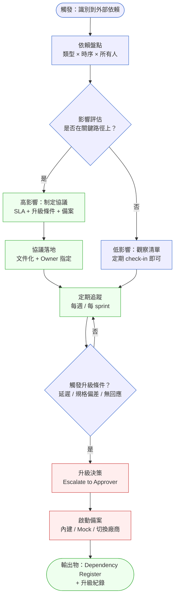
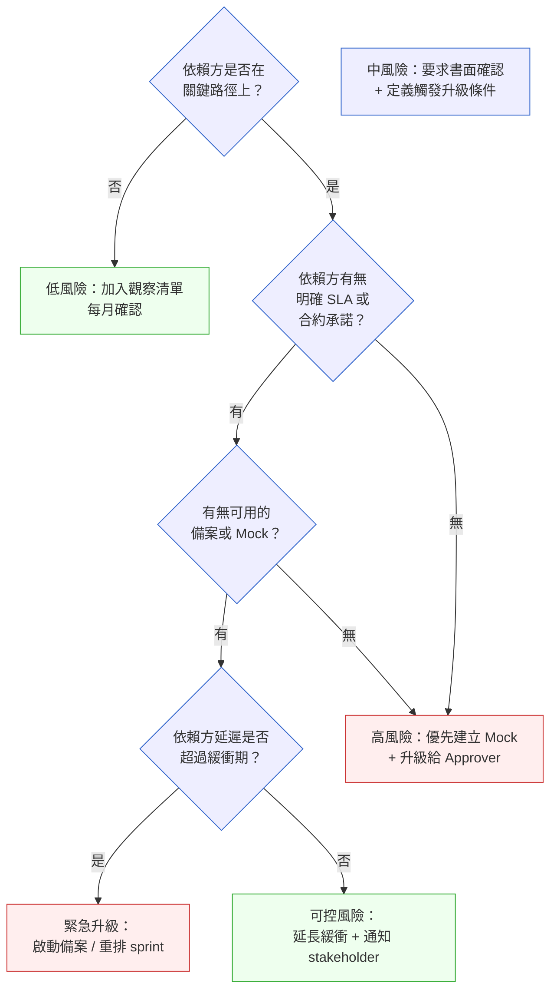

# 第 19 章 | Dependency Management：你擋不住的外部因素

> **前置閱讀**：[Ch 18 GTM Coordination：上線那天，工程只是開始](./ch-18-gtm-coordination.md)
> **下游章節**：[Ch 20 Sprint Ceremonies for PM：PM 在敏捷儀式中的角色](./ch-20-sprint-ceremonies.md)
> **相關章節**：[Ch 16 Risk Register for PM：PM 視角的風險登記](./ch-16-risk-register.md)、[Ch 27 Escalation Protocol：衝突升級的觸發條件與路徑](../part-04-collaboration/ch-27-escalation-protocol.md)
> **SA/SD 對照**：[SA/SD Ch 3 專案啟動、可行性研究與利害關係人分析](../../book/part-01-foundations/ch-03-project-initiation.md)
> ⸺ SA 視角關注依賴的技術可行性與整合介面；本章關注依賴的時序風險、責任歸屬，以及 PM 如何在無法控制對方的情況下保護交付承諾。

---

## §19.1 冷觀察

Sprint 14 第三天，Loopline 的站立會議本來應該只是例行的十五分鐘。它在第四分鐘就停了。

工程師 Kai 把筆電轉過來，螢幕上是一封昨天下午的廠商郵件，他唸出其中一行，會議室就靜了下來：「對方通知，支付閘道（Payment Gateway，金流串接服務）API 要延兩週上線。」

沒有人接話。因為每個人都在同一秒鐘想到同一件事：那個 API 不是「之一」，它是 Loopline 計費模組唯一的核心依賴。沒有它，訂閱升級流程走不通。而訂閱升級流程，正是 Sprint 14 和 Sprint 15 的主要交付目標——也是本季 OKR（Objectives and Key Results，目標與關鍵結果）裡那條被高層盯著的關鍵結果。

PM 張雅婷盯著白板上的 sprint 計畫看了十秒，手裡的馬克筆懸在半空，沒落下。

「等一下，」她開口，聲音比自己預期的還低，「這個 API 什麼時候進的計畫？」

三個月前。Sprint 8 結束後，她跟工程師確認過技術可行性，對方說「廠商承諾十二月上線」，她把這句話記在 Confluence 的一個頁面裡，標題下面只有那一行字，再沒追過。現在是一月中，那行字還在原地，廠商卻已經換了說法。

接下來的十分鐘，整個團隊在討論「還能做什麼」。答案是：前端可以繼續開發，但沒有 API 就無法聯通測試。沙盒(Sandbox)環境有一個，但廠商說沙盒的行為跟正式環境不一致——「有時候」。這個「有時候」沒有任何文件說明邊界在哪裡。

下午三點，張雅婷跟 VP of Product 開了一個突然冒出來的會。VP 問了一個問題：

> 「這個依賴，我們之前有任何監控機制嗎？」

張雅婷知道答案是沒有。她也知道，在那個 Confluence 頁面上，廠商的「十二月上線」從來沒有一個追蹤人、一個確認日期、一個升級路徑。那不是計畫，那是一個願望。

接下來兩週，Loopline 的 sprint 沒有爆掉——爆掉其實比較好收拾。它進入了一種更難受的狀態：工程師在做無法完整驗收的工作，PM 每天在追廠商時程，每天收到的回覆都是「再給我們確認一下」，沒有人知道「對」的答案是什麼。一條從來沒有被當回事的依賴，正在用最緩慢、最消耗士氣的方式拖垮整個 sprint。

---

## §19.2 真問題

把 Loopline 的狀況拆開來看，張雅婷面對的不是「廠商延遲」的問題。廠商延遲是結果，不是根因。

### 表面需求（What）

第三方 API 沒有如期上線，計費模組的開發被卡住，Sprint 14 交付目標受影響。這是最表面的描述，也是大多數 sprint retrospective 會停留的層次。

「下次要更早確認廠商時程」——這是典型的表面答案。它不解決任何結構性問題。

### 業務目標（Why）

往下一層看，Loopline 真正的業務目標是「本季讓訂閱升級流程上線，推動付費轉換率提升」。這個目標有明確的商業意義，也有可量測的 Outcome。

但這個目標的成立，靜靜地依賴一個從來沒有被顯式管理的前提：**第三方 API 在可預期的時間內可用**。

Outputs / Outcomes / Impact 三層的斷裂，在這裡是這樣的：

| 層次 | Loopline 的狀況 | 斷裂點 |
|---|---|---|
| **Outputs** | Sprint 完成了前端開發、API 整合的骨架 | 有量到，但無法驗收 |
| **Outcomes** | 訂閱升級流程真的能讓使用者完成升級嗎？ | 因 API 缺失，根本無法量測 |
| **Impact** | 付費轉換率提升？MRR（Monthly Recurring Revenue，月度經常性收入）增長？ | 全鏈路斷在第三方節點上 |

張雅婷量的是 Outputs，但業務在意的是 Impact。而 Outputs 到 Impact 中間，有一個她沒有主動管理的外部依賴節點。

### 決策瓶頸（Who × When）

這裡是最核心的結構性問題：**誰對這條外部依賴負責，以及什麼時候必須做出決定？**

當第三方 API 被加進計畫的那一天，以下幾個問題沒有人回答：

- 誰是這個依賴的「單一追蹤人」（Owner）？
- 如果廠商延遲兩週，應對方案是什麼，誰決定切換到方案 B？
- 廠商延遲多久是「可吸收」的，超過多久就要升級（Escalate）？

用 DACI（Driver / Approver / Contributor / Informed，一種釐清「誰推動、誰拍板、誰提供輸入、誰被通知」的決策角色模型）來看這個決策：

| 角色 | 全稱 | Loopline 的狀況 | 應有狀態 |
|---|---|---|---|
| **D** Driver | 推動決策進行 | 空缺——沒人主動追 | PM 張雅婷 |
| **A** Approver | 最終拍板 | 廠商延遲後才由 VP 拍板 | 事前定好：VP of Product |
| **C** Contributor | 提供輸入 | 工程師被動告知 | 工程師評估沙盒可用性；廠商聯絡窗口 |
| **I** Informed | 被通知結果 | 全員在意外中得知 | VP、行銷（受 GTM 影響） |

理解這張表的關鍵，不在於填滿四個角色，而在於 Driver 這個位置的結構意義。Driver 的實際職責是「擁有追蹤節奏」：在預定的間隔主動確認狀態、追問對方窗口、並在達到升級觸發條件時立即觸發升級。這聽起來像常識，但對外部依賴來說，它是唯一有效的守門機制——原因很具體：不像內部任務，你的 sprint 目標對第三方廠商完全不可見。廠商不知道你的 Sprint 15 上線節點，不知道你的緩衝期只剩兩週，也不知道你的 VP 正在看這條 KR。他們有自己的優先序，有自己的工程瓶頸，有時候只是忘了回你。因此，外部依賴天生處於「沉默狀態」——不追，它不會自己發出警告；一旦它終於發出訊號，通常是因為已經爆了。這不是廠商的惡意，而是外部依賴的結構特性：沒有人從外部推動你的利益，只有內部的 Driver 能做這件事。沒有指定 Driver，依賴就進入一種被動等待的狀態，只會在最不方便的時刻才浮出水面。

Decision Driver 的空缺，是 Loopline 最核心的問題。一個沒有 Driver 的外部依賴，會在某個隨機的時間點爆發，時機永遠是最不方便的那一刻。

### SA 與 PM 的依賴視角，差在哪裡

值得停下來區分一件事：SA（系統分析師）在專案啟動階段也會盤點依賴，但 SA 問的是「這個依賴在技術上接得起來嗎」——介面規格、資料格式、認證方式、整合複雜度。SA 的產出是一張整合介面清單，回答的是「能不能做」。

PM 接手的是另一半問題，而且這一半往往沒人認領：「就算技術上接得起來，對方會在我們需要的時間點交付嗎？如果不會，誰決定我們改走哪條路？」這是時序（When）與責任（Who）的問題，不是可行性問題。

Loopline 的悲劇正在這個交接縫上。SA 早就確認了 PayVault 的 API 規格沒問題——技術可行性是綠燈。但「綠燈」被誤讀成「這條依賴安全了」，於是沒有人把它升級成一條需要時序管理的依賴。技術可行不等於時序可控，這兩件事被混為一談的那一刻，這條依賴就失去了 Owner。

換句話說：SA 回答「這個依賴能不能整合」，PM 回答「這個依賴會不會準時、不準時的時候誰拍板」。前者交付完就結束，後者要一路追到上線。把後者當成前者的延伸而不另設 Owner，是跨職能交接最常見的漏接。

---

## §19.3 決策框架

依賴管理不是「把所有依賴列出來」這麼簡單。更重要的是判斷：哪些依賴需要主動干預，何時要升級，升級給誰。

以下的工具不會替任何人決定「該不該等廠商」——那是現場的判斷。它們做的是把判斷的依據攤開來，讓做決定的人看清楚自己正在權衡什麼：關鍵路徑、緩衝期、備案成本、升級觸發線。換句話說，框架給的是「怎麼想」，不是「答案是什麼」。

### 圖 A — PM 依賴管理工作流程



這條流程的關鍵在兩個節點：**影響評估**（是否在關鍵路徑上）和**觸發升級條件**（事前定義，不是事後感覺）。Loopline 跳過了第一個，也沒有定義第二個。

### 圖 B — 依賴風險決策樹



每條分支都有一個終點動作，沒有「繼續等」的開放結局。**「繼續等」是最常見的隱性風險決策**——它不是一個決定，它是一個放棄決定。

### 依賴管理決策表

| 情境 / 觸發條件 | 推薦做法 | PM 關注點 | 常見錯誤 |
|---|---|---|---|
| 依賴方在關鍵路徑上，無合約 SLA（Service Level Agreement，服務水準協議） | 要求書面確認（email / 工單），定義升級條件 | Owner 是誰？緩衝期多長？ | 口頭承諾當作計畫基礎 |
| 依賴方有 SLA，但 SLA 範圍模糊 | 要求對方定義具體量測方式（MTTD 平均偵測時間 / MTTR 平均修復時間） | 沙盒行為和正式環境一致嗎？ | 只看 SLA 數字，不看定義 |
| 依賴方延遲 < 一個 sprint | 評估影響範圍，調整 sprint 內工作順序 | 哪些 story 可以先做不依賴的部分？ | 整個 sprint 停擺等依賴 |
| 依賴方延遲 > 一個 sprint | 啟動備案，同步 stakeholder，重排 roadmap | 備案成本 vs. 等待成本哪個低？ | 不升級，獨自吸收，季末才爆 |
| 依賴方內部（跨團隊依賴） | 納入 DACI，明確 Driver，寫進 sprint planning | 對方的 backlog 優先順序是什麼？ | 假設對方「知道」且「會做」 |
| 依賴方變更規格（Breaking Change）| 評估影響，要求版本化介面，升級決策 | 這個變更有沒有 deprecation 時間表？ | 默默吸收，不文件化 |

### If-Then 框架：依賴升級決策

依賴管理中最難的判斷是：這個情況到底要不要升級？以下是一個比較穩的決策框架：

**評分矩陣（事前填寫，不是事後感覺）**

每一條外部依賴在加入計畫時，填寫以下欄位：

| 欄位 | 量測方式 | 範例（Loopline） |
|---|---|---|
| **關鍵路徑影響** | 無此依賴，幾個 sprint 的交付受影響？ | 2 個 sprint（Sprint 14–15） |
| **業務影響金額** | 延遲一個月，MRR 影響多少？ | 新訂閱預計 $80K ARR（Annual Recurring Revenue，年度經常性收入）延後 |
| **緩衝期** | 依賴最晚幾號到位不影響上線？ | 1 月 25 日（Sprint 15 第二週） |
| **備案成本** | 啟動 Mock 或替代方案要多少工時？ | 約 5 工程師天 |
| **升級觸發線** | 超過幾天沒有確認就升級給 Approver？ | 3 個工作日無回應 |

- **If** 依賴在關鍵路徑 AND 無書面確認 → **Then** 要求書面確認，設定 3 個工作日 deadline
- **If** 書面確認顯示延遲 < 緩衝期 → **Then** 通知工程師調整工序，記錄追蹤
- **If** 延遲 > 緩衝期 OR 連續 3 個工作日無回應 → **Then** 升級給 Approver + 啟動備案評估
- **If** Approver 決定啟動備案 → **Then** PM 更新 Dependency Register，同步 GTM 計畫，通知 stakeholder

這個框架的用意不是讓 PM 自己解決所有問題，而是讓 PM 知道**什麼時候不再是 PM 的問題**——升級本身就是一個合法的決策動作，不是失敗的象徵。

---

## §19.4 踩坑清單

### 反模式：把口頭承諾當作計畫輸入

**現象**：廠商說「十二月上線」，PM 把它記進 sprint 計畫，直到十二月才發現對方的「上線」跟自己理解的不一樣。

**根因**：依賴確認沒有書面化、沒有版本化。「上線」可以是 GA（General Availability，正式公開可用）、可以是 Beta（公開測試版）、可以是沙盒，這三個的 API 穩定性天壤之別。

> **修正方向**：所有外部依賴的時間節點，要求對方回覆 email 或工單確認，並且在確認訊息裡明確是哪個環境、哪個版本、SLA 是什麼。沒有書面確認的時間承諾，在 Dependency Register 裡標 `unconfirmed`，不得成為 sprint 目標的前提。

---

### 反模式：沒有 Owner 的依賴

**現象**：Dependency Register 上有一條「廠商 API 接入」，但沒有 Owner 欄位，或者 Owner 是「工程團隊」這種集體名詞。

**根因**：集體所有等於沒有所有。當廠商三週沒有回應，沒有人意識到這是自己的問題，因為每個人都以為別人在追。

> **修正方向**：每一條外部依賴指定一個具名的 Owner（通常是 PM 本人或指定的 Engineering Lead），並且明確「追蹤節奏」：多久確認一次，用什麼管道，對方沒回應的升級動作是什麼。

---

### 反模式：升級太晚，等到爆了才說

**現象**：PM 知道依賴有風險，但覺得「再等幾天說不定廠商會解決」，直到 sprint planning 前一天才告訴主管「我們有個問題」。

**根因**：升級被誤解為「失敗的表現」，PM 下意識地想自己扛。結果 Approver 得到的是一個沒有準備時間的緊急狀況，而不是一個可以從容決策的選項。

> **修正方向**：升級是一個流程動作，不是一個道德判斷。事前定義升級觸發條件（見 §19.3 if-then 框架），達到條件時升級就是正確的行為，不需要等到確定「出了大問題」才動。早升級給 Approver 更多選擇，晚升級只剩救火。

---

### 反模式：備案是嘴上說說，沒有工時保護

**現象**：Sprint planning 時有人說「如果廠商延遲，我們可以先用 Mock 擋著」，但 Mock 沒有被排進任何 sprint，也沒有工時估算。

**根因**：備案是思維上的安慰，不是實際可執行的計畫。真的需要啟動 Mock 的那一天，工程師說「這要三天，現在 sprint 滿了」。

> **修正方向**：如果決定備案選項是 Mock，就把 Mock 的最小可用版本排進 sprint 為前 2 週的某個 story，哪怕只是骨架。備案不在 backlog 裡，就不是備案，是願望。

---

### 反模式：跨團隊依賴沒有進 sprint planning

**現象**：本團隊的 sprint goal 依賴另一個團隊的 API 完成，但 sprint planning 裡沒有追蹤這條跨團隊依賴的 story，也沒有確認對方的 sprint 是否排了這件事。

**根因**：PM 聚焦在自己團隊的 backlog，預設「對方知道我們要用他的東西」。但跨團隊依賴不會自動進入對方的 sprint——對方的優先順序由對方的 PM 決定。

> **修正方向**：跨團隊依賴在 sprint planning 前，主動確認對方的 sprint 是否排了對應的工作。沒排就是風險，需要立即升級或協商，不能等到 sprint 中途發現。

---

### 微型案例：兩種升級時機，兩種結局

同一條 PayVault 依賴，在 Loopline 內部其實演過兩次，結局相反，差別只在升級的時機。

**第一次（DEP-001 早期，反面）**：廠商在 Sprint 8 給出「十二月上線」的口頭承諾後，PM 把它記下就轉身去處理別的火。十二月到了，廠商說「再兩週」，PM 想「再等等，催太緊不好看」，於是又等了一週。等到 Sprint 14 第三天確定延兩週時，距離 Sprint 15 上線只剩九個工作日，VP 拿到的是一個「沒有選項的壞消息」——備案還沒排、stakeholder 還沒通知、roadmap 已經來不及重排。升級得太晚，Approver 能做的只剩接受現實。

**第二次（DEP-002，正面）**：內部 Billing Team 的 MRR 計算 API，PM 在 sprint planning 當天就確認對方 backlog 裡排了這件事，並寫下觸發條件「1 月 18 日前看不到 PR merged 就升級」。1 月 17 日傍晚，PR 還沒出現，PM 沒有再等一晚「看看明早會不會好」，當天就把狀況丟給 Engineering Manager。對方花十分鐘調了 Billing Team 隔天的優先序，PR 在 1 月 19 日 merged，整件事連 at-risk 都沒走到。

兩次的技術難度相當，差別只有一個變數：升級觸發條件是不是事前定義、達標就動。第一次靠感覺，所以永遠覺得「再等一下」；第二次靠日期，所以時間一到就有動作。這就是 §19.3 評分矩陣裡「升級觸發線」那一欄存在的全部理由。

---

## §19.5 交付清單 ⸺ 一頁式 Dependency Register 模板

Dependency Register 是一頁可以在 sprint review 時 review 的活文件，不是一次性填寫的需求文件。它的核心用途是讓整個團隊在同一個頁面上知道：哪些外部依賴是活的、誰在追、什麼時候要升級。

````markdown
# Dependency Register — {專案/功能名稱}

> 版本:v0.1 | 撰寫日期:YYYY-MM-DD | 擁有人:{名字}

更新日期：{YYYY-MM-DD}
PM Owner：{姓名}
上次 Review：{YYYY-MM-DD}（建議每 sprint 更新一次）

---

### 依賴清單

| 依賴 ID | 依賴方 | 依賴項目 | 類型 | 關鍵路徑 | Owner | 承諾日期 | 確認狀態 | 緩衝期 | 備案 | 升級觸發 | 狀態 |
|---------|--------|---------|------|---------|-------|---------|---------|--------|------|---------|------|
| DEP-001 | {外部廠商/內部團隊} | {API/功能/資料/許可} | {外部/內部} | {是/否} | {Owner} | {YYYY-MM-DD} | {confirmed/unconfirmed} | {最晚到位日} | {有/無+說明} | {觸發條件} | {on-track/at-risk/blocked} |

---

### 升級紀錄

| 日期 | 依賴 ID | 觸發原因 | 升級對象 | 決策 | 執行狀態 |
|------|---------|---------|---------|------|---------|
| {日期} | {DEP-XXX} | {觸發原因} | {升級給誰} | {決策內容} | {進行中/完成} |

---

### 下次 Review 重點

- [ ] {DEP-XXX}：{預計確認事項}
- [ ] {DEP-XXX}：{預計確認事項}
````

把它存在 `docs/dependency/`，跟程式碼同 repo，跟 README 同層。

欄位設計的重點在「狀態」（on-track / at-risk / blocked）和「確認狀態」（confirmed / unconfirmed）這兩欄。這兩欄讓 PM 在每週 standup 或 sprint planning 前，用三十秒掃一遍，就能判斷哪條依賴需要立即處理。

### §19.5.1 範例：Loopline 支付 API 依賴管理

Loopline 在 Sprint 14 危機後，補建了 Dependency Register。以下是第一版的核心內容——不是重建，是張雅婷從那次事件裡整理出來的教訓轉換。

````markdown
# Dependency Register — Loopline 計費模組 v2

> 版本:v0.1 | 撰寫日期:2026-01-18 | 擁有人:張雅婷（PM）

更新日期：2026-01-18
PM Owner：張雅婷
上次 Review：2026-01-15（Sprint 13 Review 後補建）

---

### 依賴清單

| 依賴 ID | 依賴方 | 依賴項目 | 類型 | 關鍵路徑 | Owner | 承諾日期 | 確認狀態 | 緩衝期 | 備案 | 升級觸發 | 狀態 |
|---------|--------|---------|------|---------|-------|---------|---------|--------|------|---------|------|
| DEP-001 | PayVault（第三方支付閘道）| 訂閱升級 API v2 — /subscriptions/upgrade | 外部 | 是 | 張雅婷 | 2026-01-25 | unconfirmed（已發 email 追確認） | 1月25日（Sprint 15 第二週開始前） | 有：Mock Server（已排入 Sprint 14，3 工程師天） | 連續 3 個工作日無回應，或確認日期 > 1月25日，升級給 VP of Product | at-risk |
| DEP-002 | Billing Team（內部） | MRR 計算 API /billing/calculate | 內部 | 是 | Eric（Billing Team Lead） | 2026-01-20 | confirmed（Slack 書面 + 工單 #BIL-441） | 1月20日 | 無（Billing Team 已排入 Sprint 14） | 若 1月18日前未看到 PR merged，升級給 Engineering Manager | on-track |
| DEP-003 | Legal（合規）| 訂閱降級條款審閱 | 內部 | 否 | 林怡君（Legal）| 2026-02-05 | unconfirmed | 2月5日 | 無（如延遲，降級功能移至下季）| 1月28日無回應升級給 VP of Product | on-track |

<!-- 為什麼這欄（確認狀態）：「unconfirmed」不是警示，是一個待辦事項的標記；
     讓 PM 在每次 Review 時立即看到哪條依賴還沒有書面保證，避免口頭承諾進入計畫。 -->

<!-- 為什麼這欄（升級觸發）：觸發條件事前定義而非事後感覺，
     讓升級成為流程動作而非情緒決定；有條件才有底氣在對的時間升級。 -->

---

### 升級紀錄

| 日期 | 依賴 ID | 觸發原因 | 升級對象 | 決策 | 執行狀態 |
|------|---------|---------|---------|------|---------|
| 2026-01-15 | DEP-001 | PayVault 通知延遲兩週，超過緩衝期 | VP of Product 陳建輝 | 啟動 Mock Server，Sprint 15 目標改為完整前後端整合（依賴 Mock），GA 延後一個 sprint | 進行中 |

---

### Sprint 15 前 Review 重點

- [ ] DEP-001：PayVault 1月21日前回覆書面確認；否則升級
- [ ] DEP-002：確認 PR #BIL-441 在 1月20日前 merged
````

這份 Register 在 Sprint 14 危機之前不存在。第一版是補建的，補建的動作本身說明了什麼：依賴管理不需要等到完美的時機才開始，一張表、一個 Owner、一條升級觸發條件，就已經比空白強得多。

---

## §19.6 Recap

讀完本章，你應該已經能做到：

- [ ] 識別計畫中的外部依賴，並區分「關鍵路徑上的依賴」與「觀察清單依賴」
- [ ] 用 DACI 模型指定每條依賴的 Driver 與 Approver，消除無主依賴
- [ ] 為每條高影響依賴定義升級觸發條件（天數、事件），讓升級成為流程動作
- [ ] 建立並維護 Dependency Register，讓整個團隊在同一個頁面上看到依賴狀態
- [ ] 在備案沒有排進 sprint 之前，不把「有備案」當作風險緩衝

依賴管理的核心能力，不是擋住外部因素——那本來就擋不住。能練起來的是：在外部因素失控之前，提前把決策選項搬到桌面上，讓該拍板的人在有時間的時候拍板。Loopline 的 DEP-001 最終延遲了一個 sprint，但有了 Register 和觸發條件，下一次 PayVault 出狀況，這個流程不需要再從頭發明。

回到那個讓會議室靜下來的四分鐘：問題從來不是廠商延了兩週，而是那兩週的壞消息直到第三天才有人發現。當你手上有一張會被定期 review 的 Register、每條依賴都有名字、每個延遲都有事前寫好的觸發線，下一次廠商再丟出「再給我們確認一下」，你不會是那個盯著白板算還剩幾天的人——你會是那個已經知道下一步該按哪顆按鈕、並且有時間從容按下去的人。

---

## Cross-References

- **前一章**：[Ch 18 GTM Coordination](./ch-18-gtm-coordination.md) ⸺ 上線前最後一哩的協調框架，依賴管理是它的前置條件
- **下一章**：[Ch 20 Sprint Ceremonies for PM](./ch-20-sprint-ceremonies.md) ⸺ Dependency Register 應在 sprint planning 和 review 中定期更新
- **強連結**：[Ch 16 Risk Register for PM](./ch-16-risk-register.md) ⸺ 依賴風險是風險登記的子集，兩者共用升級判準
- **強連結**：[Ch 27 Escalation Protocol](../part-04-collaboration/ch-27-escalation-protocol.md) ⸺ 升級觸發後的路徑與溝通格式
- **SA/SD 對照**：[SA/SD Ch 3 專案啟動、可行性研究與利害關係人分析](../../book/part-01-foundations/ch-03-project-initiation.md) ⸺ SA 視角的依賴識別聚焦在系統整合介面與技術可行性；PM 視角聚焦在時序風險與業務影響

<!-- PROPOSED-REFS
cases:
  - id: CASE-SAS-107
    title: "Loopline 的第三方牆：依賴 API 沒上線，自己的功能等兩週"
    domain: saas
    chapters: [ch-19]
    summary: |
      虛構 SaaS Loopline：核心功能依賴第三方支付閘道 API，
      對方突然延遲兩週，PM 沒有緩衝計畫與升級機制，整個 sprint 卡死。
      事後補建 Dependency Register，定義升級觸發條件。
-->
