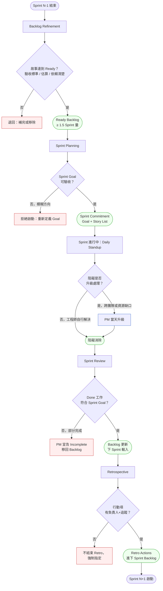
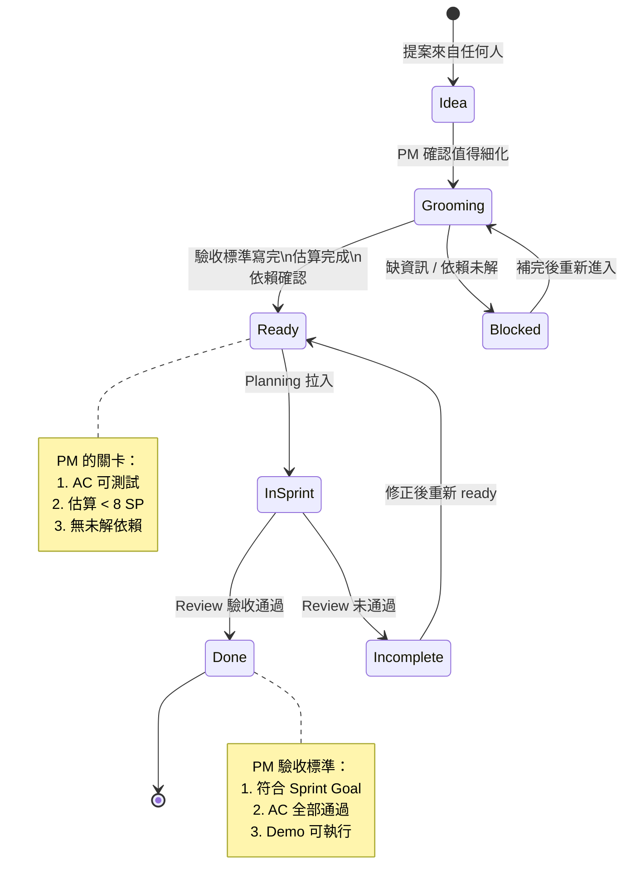

# 第 20 章 | Sprint Ceremonies for PM：PM 在敏捷儀式中的角色

> **前置閱讀**：[Ch 19　Dependency Management：你擋不住的外部因素](./ch-19-dependency-management.md)
> **下游章節**：[Ch 21　Dual-Track Agile：Discovery 與 Delivery 同時跑](./ch-21-dual-track-agile.md)
> **SA/SD 對照**：[SA/SD 第 2 章　SDLC 與方法論演進](../../book/part-01-foundations/ch-02-sdlc-evolution.md)
> ⸺ SA/SD 視角關注迭代流程的工程完整性；本章關注 PM 在每個儀式節點的決策責任與問題隔離。

---

## §20.1 冷觀察

Sprint 28 的 Retrospective（回顧會議，以下簡稱 Retro）剛散會，Formly 的工程師還沒走出會議室，Engineering Manager（工程經理，以下簡稱 EM）的 Slack 私訊就跳到 PM Yuna 的螢幕上：「同一個問題，這是第三個 sprint 了。」

Yuna 盯著那行字，手指停在鍵盤上。她不需要問是哪個問題——她知道。

每一次 Retro，工程師都寫下同一條：「Backlog（待辦清單）不清楚，refinement（精煉會議）做了，但故事進 Planning 時還是沒寫完。」每一次，Yuna 都點頭，記下來，說「下個 sprint 會改進」。然後下一個 sprint 啟動，故事還是不完整，那行字又出現在白板上。不是她沒聽進去，是她始終說不清楚：「改進」這個動作，到底是誰的責任？在哪個時間點、由哪個儀式觸發？

她加入 Formly 之前，在一家傳統軟體公司做了三年 PM，那裡沒有 Scrum，只有季度計畫和週會。敏捷對她而言是一套她叫得出名字的東西——Backlog Refinement、Sprint Planning、Daily Standup（每日站會）、Sprint Review（衝刺審查）、Retrospective——五個儀式她全辦，會議室訂得準時，紀錄做得整齊。但她從來沒想清楚一件事：在這五個儀式裡，PM 的決策責任分別是什麼？

最諷刺的是 Sprint Review。她把它當對外 Demo 在用——每個 sprint 結束，她取消內部審查，改邀客戶來看展示。工程師排練流程，客戶鼓掌，Yuna 在後排看著，覺得這一切都好得不得了。

但 Review 原本的目的，是讓團隊檢視完成的工作有沒有達到 Sprint Goal（衝刺目標），並把結果作為 backlog 更新的輸入。這件事在 Formly 從來沒發生過。Sprint Goal 寫得模糊，Review 等於沒有驗收，每個 sprint 的「Done（完成）」標準，靠每個工程師自己心裡那把尺。

Retro 更典型。三十分鐘，固定三欄——順利的、待改進的、行動項——行動項每次寫三條，沒有負責人，沒有追蹤欄位。下一次 Retro，前一次的三條行動項不出現在任何地方，像從來沒被寫過。

而 Sprint 28 的 Planning 那天，是壓垮 Yuna 的最後一根稻草：三個故事在會議開始前十分鐘才被臨時補完。工程師花了四十分鐘在會議室裡 clarify（釐清）需求，原本要做估算的時間被擠光，最後勉強切出 sprint，散會時沒有一個人敢說這個 sprint 做得完。

那天晚上，Yuna 在筆記本上寫下一句話：「儀式我全辦了，可是好像沒有一個人，在對的時間，做對的那件事。」

她只說對了一半。儀式確實全辦了——但她沒看清的是：在每個儀式裡，PM 不是主持人，是那個必須拍板的人。

---

## §20.2 真問題

Yuna 看到的問題是「Retro 行動項沒人追」「Planning 前故事沒寫好」。這是表面需求（What）。

把它拆開來看。

### 表面需求（What）

儀式有執行，但執行品質差，問題重複出現。

### 業務目標（Why）

Sprint 的五個儀式構成一個封閉的回饋迴路——refinement 輸入清晰的 backlog，planning 確認可承諾的 scope（範圍），daily 讓阻礙快速可見，review 驗收真實的 done，retro 讓流程持續改進。任何一個環節斷裂，整個迴路的品質就會塌陷。Formly 的問題不是「行動項沒追蹤」，是 PM 把自己定位成儀式的「主持人」而不是「決策責任者」，導致每個儀式的核心判斷都沒有人做。

### 決策瓶頸（Who × When）

這是 Formly 案例真正困難的地方。五個儀式各有一個關鍵決策點：

| 儀式 | 關鍵決策點 | 決策者（DACI：Driver） | 必須定案時間 |
|------|-----------|----------------------|-------------|
| Backlog Refinement | 哪些故事達到 Ready 標準？ | PM | 每次 refinement 結束前 |
| Sprint Planning | Sprint Goal 是什麼？承諾哪些故事？ | PM + EM | Planning 結束前 |
| Daily Standup | 阻礙升級還是自行解決？ | PM（阻礙判斷） | 每日會後 15 分鐘內 |
| Sprint Review | Done 的工作是否符合 sprint goal？ | PM（驗收） | Review 結束前 |
| Retrospective | 行動項誰負責、下次 retro 怎麼追蹤？ | PM（追蹤機制） | Retro 結束前 |

Formly 的 Yuna 在所有五個節點都沒有做這個決策。Refinement 結束時她沒有對「Ready」作最終確認；Planning 裡 Sprint Goal 是模糊的方向陳述不是可驗收的標準；Daily 她當成進度同步會而不是阻礙感知器；Review 她改成了 demo，失去了驗收機制；Retro 她主持了，但沒有指定負責人，行動項等同無效。

### Outputs / Outcomes / Impact 三角

這裡的混淆也符合典型的三層混淆：

| 層次 | Formly 的狀況 |
|------|-------------|
| **Outputs** | 五個儀式都有舉辦，有會議記錄，有行動項列表 |
| **Outcomes** | 問題重複三個 sprint 出現，story 完整度沒有提升，Planning 效率持續低落 |
| **Impact** | 每個 sprint 的可預測性低，工程師對承諾缺乏信心，velocity（速度）難以穩定 |

Yuna 量的是 Outputs——儀式辦了沒有。真正需要改善的是 Outcomes——每個儀式的決策品質，以及它對下一個節點的輸入是否清晰。

### DACI 責任釐清

把儀式責任對應 DACI（Driver / Approver / Contributor / Informed，驅動者 / 批准者 / 貢獻者 / 被告知者）：

| 角色 | 誰 | 在儀式中的責任 |
|-----|-----|--------------|
| **D**river（驅動者） | PM | 確保每個儀式的決策點被執行，輸出物明確 |
| **A**pprover（批准者） | PM（scope）、EM（tech feasibility，技術可行性） | Planning 的承諾、Retro 行動項的資源分配 |
| **C**ontributor（貢獻者） | 工程師、設計師、QA | 提供估算、提出問題、輸入 retro |
| **I**nformed（被告知者） | 其他 stakeholder（利害關係人） | Review 可邀請，但不是 Review 的主角 |

這張表裡有一個位置最容易出事：Planning 的 Approver 是兩個人——PM 管 scope，EM 管 tech feasibility。問題是，當兩人對「這個 sprint 能承諾多少」出現歧見時，誰拍板？

**衝突解決規則（必須事先講清楚）**：

> Planning 的承諾量出現歧見時，**EM 的 feasibility 判斷擁有最終否決權**。理由是承諾的代價由工程團隊承擔——是他們在 sprint 末尾要面對「做不完」的後果，所以可行性的最終話語權必須在他們手上。PM 不能用「業務很急」覆蓋 EM 的「做不完」。
>
> 但否決權不是終點，是分工的起點：**EM 否決承諾量之後，PM 的責任是帶著「砍到什麼程度可行」這個答案，回去向業務方溝通調整 scope 或時程**。也就是說，EM 決定「能裝多少」，PM 決定「在能裝的範圍內優先裝哪些、以及怎麼跟業務交代少裝的那些」。兩個 Approver，兩個不重疊的決策面，衝突時由承擔後果的那一方保留否決權。

PM 是 Driver，不是服務者。Drive 的意思是：讓對的決策在對的時間發生，不是讓每個人都舒適——包括在承諾量這件事上，讓 EM 的否決權被尊重，而不是被「這個客戶很重要」磨掉。

---

## §20.3 決策框架

這一節給的不是「Formly 應該怎麼辦五個儀式」的標準答案，而是 PM 在每個儀式現場腦中要跑的判斷邏輯。你的團隊規模、產業、節奏都和 Formly 不同，但「在哪個菱形前面，用什麼條件做 Yes / No」這件事是共通的。

### 圖 A — Sprint Ceremonies PM 責任工作流程圖



這張圖的重點不是流程本身——流程你的團隊早就有了。重點是那五個菱形決策節點。PM 要學會的是：在每個菱形前面停下來，用一組明確的條件做出 Yes / No，而不是讓決策「自然發生」。下面兩張圖和四組 if-then，給的就是「每個菱形用什麼條件判斷」，不是「答案一律是什麼」。

---

### 圖 B — Backlog Story 狀態機（PM 驗收決策樹）



Story 從 Idea 到 Done 有兩個 PM 關卡：進入 Ready 之前，以及移出 InSprint 之後。注意這裡的數字（8 SP、1.5 sprint 量）是 Formly 在它的團隊規模下調出來的起點，不是普世常數——你要從中學的是「Ready 必須有一組可檢查的條件、Done 必須對齊一個外部標準」這件事，門檻值請依自己團隊的歷史 velocity 校準。但有一點不會變：這兩個關卡如果都沒有 PM 明確把關，sprint 的輸入和輸出都會是模糊的。

---

### 決策表：五個儀式的 PM 操作判斷

| 儀式 | 觸發條件 | 推薦做法 | PM 關注點 | 常見錯誤 |
|------|---------|---------|----------|---------|
| **Backlog Refinement** | 每 sprint 執行 1–2 次；ready 量低於 1.5 sprint 時加開 | 每條故事對照「Ready 三件套」：AC + 估算 + 依賴；PM 做最終 sign-off | Ready Backlog 量是否足夠支撐下個 sprint | 把 refinement 當成需求說明會，PM 只說需求不做 ready 確認 |
| **Sprint Planning** | Sprint 開始前，ready backlog 量充足 | Sprint Goal 必須可驗收（用「誰可以做到什麼」格式）；承諾量由 EM 確認可行性，PM 確認方向；衝突時 EM 保留否決權 | Sprint Goal 是否清楚到可以在 Review 驗收 | Goal 寫成「繼續開發 X 功能」而非「使用者可完成 Y 流程」 |
| **Daily Standup** | 每工作日，15 分鐘內 | PM 聽阻礙，不聽進度報告；當天決定升級還是交工程師解決 | 有無跨團隊阻礙需 PM 介入 | PM 當 Daily 主持人，變成進度確認，失去阻礙感知功能 |
| **Sprint Review** | Sprint 最後一天，內部完成後 | PM 先做內部驗收（對照 AC + Sprint Goal），通過後再邀 stakeholder | 未完成的故事如何處置 | 跳過內部驗收，直接做 stakeholder demo，Done 標準失效 |
| **Retrospective** | Sprint Review 之後、下個 sprint 開始之前 | 行動項格式：What + Who + When；進下個 sprint backlog 追蹤 | 前次行動項完成率 | 行動項只有 What，沒有 Who 和 When，等同無效 |

---

### If-Then 框架：PM 的儀式決策條件

下面四組 if-then 不是要你照抄條件值，是示範「一個決策該由哪些條件構成」。你可以替換門檻，但不能省略「先列條件、再判 Yes / No」這個動作。

**Refinement Ready 判斷：**

- **If** 故事有驗收標準（AC）可以用「Given/When/Then」寫出，且估算 ≤ 8 story points（或可拆分），且無未解決的外部依賴 → **Then** 標記 Ready，可進 Planning
- **If** 缺少上述任一條件 → **Then** 退回 Grooming，指定補完負責人與截止時間

**Sprint Goal 可驗收判斷：**

- **If** Sprint Goal 能以「使用者可以做到 [具體動作]」描述，且工程師可在 Review 當場 demo 驗證，且所有人對 Goal 的理解一致（Planning 結束前口頭確認）→ **Then** Goal 通過，sprint 可啟動
- **If** Goal 是方向陳述（「提升體驗」「優化流程」）→ **Then** 停止啟動，重新定義，5 分鐘內得出可驗收版本

**Planning 承諾量衝突判斷：**

- **If** PM 想承諾的 scope 與 EM 判斷的可行量不一致 → **Then** EM 的 feasibility 判斷優先（保留否決權，因為後果由工程團隊承擔）；PM 接受可行量，並負責向業務方溝通 scope / 時程調整；不得以「業務很急」覆蓋 EM 的「做不完」
- **If** 雙方對「可行量」本身的事實基礎有歧見（例如某依賴是否已解）→ **Then** 當場用 Ready Backlog 與依賴狀態核對，而非用職級壓過

**Retro 行動項效力判斷：**

- **If** 行動項有明確 Owner（一人，不是「大家」），且有完成時間點（下次 retro 前 / sprint N+1 第幾天），且進入 sprint backlog 或有追蹤看板 → **Then** 行動項有效，Retro 可結束
- **If** 任一條件缺失 → **Then** 不結束 Retro，補完後才離開

**Daily 阻礙升級判斷：**

- **If** 阻礙可由工程師自行在當天或隔天解決 → **Then** 不升級，工程師處理，PM 明天 Daily 確認
- **If** 阻礙涉及跨團隊資源（設計未完成、後端依賴另一組），或阻礙持續超過 1 天未解決 → **Then** PM 當天升級，指定解決路徑，不等到下次 Daily

這五組 if-then 不是清單，是 PM 在每個儀式現場的即時判斷腳本。在每個決策節點，PM 腦中跑的就是這個邏輯——換了團隊，條件值會變，但「停在節點前、跑完條件、給出 Yes / No」這個動作不會變。

---

## §20.4 踩坑清單

**反模式：Sprint Review 對外化**

現象：PM 把 Sprint Review 定位成客戶 Demo，邀請外部 stakeholder 參加，工程師排練展示路徑，現場像是產品發布會。

根因：PM 把「展示給外部看」當作 Review 的目的，但 Review 的核心是「Done 的工作是否符合 Sprint Goal」的內部驗收。把 Review 對外化的深層誘因，是外部掌聲是即時且正向的回饋，而內部驗收常常要面對「這條沒做完」的尷尬——PM 下意識地用「客戶很滿意」這個舒服的訊號，替換掉「我們是否真的達標」這個難堪的訊號。沒有內部驗收，Done 的標準就沒有人負責。

> 修正方向：Review 拆成兩段。先做 15 分鐘內部驗收（PM + EM，對照 AC 和 Sprint Goal），再決定是否邀請 stakeholder 做展示。內部驗收是強制的，外部展示是選擇性的。

---

**反模式：Retro 行動項沒有 Owner**

現象：Retro 結束時有三條行動項，格式是「我們要改進 X」「下次要注意 Y」，沒有具體負責人和時間點。下次 Retro 開始時沒有人提起上次的行動項。

根因：PM 把 Retro 當成情緒宣洩和集體反思的空間，而不是改進決策的場所。「我們」這個主詞看起來包容，實際上是責任的稀釋——當所有人都負責時，沒有人負責。情緒釋放有價值，但沒有 Owner 的行動項等同沒有行動項。

> 修正方向：Retro 結束前固定最後 5 分鐘：逐條行動項指定一個人名（不是角色，是人名），確認完成時間，PM 負責把行動項加進下個 sprint 的 backlog 或追蹤看板。下次 Retro 前三分鐘先看上次的行動項完成率。

---

**反模式：Sprint Goal 是任務清單**

現象：Sprint Planning 結束，Sprint Goal 的內容是「完成用戶通知功能和後台報表」，實質上是 sprint backlog 的摘要。

根因：PM 沒有區分 Sprint Goal（為什麼做這個 sprint）和 Sprint Backlog（這個 sprint 做什麼）。寫成任務清單比寫成目標容易得多——任務是現成的，目標需要先想清楚「這個 sprint 結束後，使用者世界裡多了什麼」，這一步需要承擔「想不清楚」的不確定感，於是 PM 退回到列任務。缺少 Goal，Review 的驗收標準就不存在。

> 修正方向：Sprint Goal 用「誰可以做到什麼」格式重寫：「企業版用戶可以設定通知規則並收到第一封測試信」。如果寫不出這個格式，代表這個 sprint 的方向還沒想清楚，Planning 應該先停下來。

---

**反模式：Refinement 是 PM 的獨角戲**

現象：Backlog Refinement 由 PM 說明需求，工程師聽完點頭，PM 問「有問題嗎？」沒有人說話，會議結束。Planning 當天才發現很多細節沒確認。

根因：Refinement 的目的是讓工程師和設計師對故事的疑問提前在 Planning 前浮現，不是讓 PM 說明需求。PM 主導說明的背後，藏著一個錯誤的安全感——「我講完了，沒人反對，代表大家都懂了」，但沉默通常不是理解，是還沒開始思考。PM 主導說明，工程師沒有機會問問題，所有未解的疑問被推到 Planning（或 Sprint 進行中）。

> 修正方向：Refinement 把說明縮到前 5 分鐘，剩下時間是工程師問問題的時間。PM 的責任是回答問題並在當場更新 AC，不是說服工程師這個需求有道理。如果工程師問不出問題，可以請他們「試著用 Given/When/Then 重述一遍」。

---

**反模式：Daily 變成進度報告會**

現象：Daily Standup 每個人輪流說「昨天做了什麼、今天要做什麼、有沒有問題」，PM 記錄進度，15 分鐘準時結束，每個人繼續回去工作。

根因：Daily 被設計成「讓阻礙快速可見」的機制，不是進度報告。PM 把它變成進度確認會，背後有一個沒說出口的假設：「資訊對稱 = 問題會被看見」——只要每個人都報告了，問題自然會浮上來。但這個假設在工程師的真實心理裡不成立。工程師天生會自我檢查、傾向把「可能有問題、但我還在查」的模糊狀態留在自己手裡，等到有結論再說；在輪流報告的格式下，沒有人會主動把一個還沒成形、講出來顯得自己沒搞定的疑慮拋到桌上。於是 Daily 蒐集到的全是「已成形的進度」，恰恰漏掉了「正在惡化但還沒爆」的早期阻礙——而那正是 Daily 唯一真正該抓的東西。PM 聽進度並不會讓阻礙更快解決；PM 主動把問題改成「有沒有什麼讓你卡住、自己一時解不掉的事」，才把那層模糊狀態逼出來。

> 修正方向：把 Daily 的問題從「昨天做了什麼」改成「有沒有讓你卡超過 4 小時的事？」PM 專注聽這個問題的答案，其他的交給工程師自己協作。必要時點名問「有沒有哪件事你不太確定會不會出問題？」，主動替工程師說出他們不會主動報告的模糊狀態。

---

## §20.5 交付清單 ⸺ 一頁式 Sprint Ceremonies PM 責任卡

每次進入新 sprint 週期，這張卡幫 PM 確認五個儀式的決策責任是否被執行。不是會議紀錄，是 PM 自用的觸發清單。

````markdown
=== Sprint Ceremonies PM 責任卡 ===
> 版本:v0.1 | 撰寫日期:YYYY-MM-DD | 擁有人:{PM 姓名}
Sprint: {Sprint 編號} | 日期: {起始日} – {結束日}

---
■ BACKLOG REFINEMENT（Sprint 開始前 ≥ 3 天）
  Ready Backlog 目前量: {N 條 / 預估 sprint 量}
  本次 refinement 確認故事: {N 條}
  未達 Ready 退回: {N 條，原因摘要}
  PM sign-off: {是 / 否，若否：補完截止}

---
■ SPRINT PLANNING
  Sprint Goal（「誰可以做到什麼」格式）:
    {填入一句話目標}
  可驗收確認（目標可 demo？）: {是 / 否}
  承諾故事數 / SP: {N 條 / SP}
  PM-EM 承諾量是否一致: {是 / 否，若否：EM 可行量 + PM 對業務的調整溝通}
  未解依賴: {條目或「無」}

---
■ DAILY STANDUP（每日）
  本 sprint 升級阻礙記錄:
  - {日期}：{阻礙描述} → {PM 升級動作}
  持續阻礙（> 1 天未解）: {條目或「無」}

---
■ SPRINT REVIEW
  內部驗收完成: {是 / 否，時間}
  Done / Total: {N 條完成 / M 條承諾}
  未完成故事處置: {退回 backlog / 移入 icebox}
  Stakeholder 展示: {是 / 否，對象}

---
■ RETROSPECTIVE
  上次行動項完成率: {N/M 條}
  本次行動項:
    1. {What} | Owner: {人名} | Due: {日期/Sprint}
    2. {What} | Owner: {人名} | Due: {日期/Sprint}
    3. {What} | Owner: {人名} | Due: {日期/Sprint}
  行動項進 backlog: {是 / 否}
````

把它存在 `docs/pm/sprint/`，跟程式碼同 repo，跟 README 同層。

五個區塊對應五個儀式，每塊有一個 PM 必須完成的動作。空著不填的欄位就是這個 sprint 被跳過的決策責任。

---

### §20.5.1 範例：Formly Sprint 28 PM 責任卡（補填版）

Sprint 28 結束後，Yuna 拿到這張模板，回頭補填了一遍，把那三個 sprint 重複出現的問題對應到具體的哪個欄位沒有被執行。

````markdown
=== Sprint Ceremonies PM 責任卡 ===
> 版本:v0.1 | 撰寫日期:2026-02-15 | 擁有人:Yuna（PM）
Sprint: Sprint 28 | 日期: 2026-04-07 – 2026-04-18
<!-- 為什麼這欄：sprint 識別符讓行動項追蹤不會跨期混淆；
     沒有日期範圍，下面的 daily 阻礙記錄無法按時序還原。 -->

---
■ BACKLOG REFINEMENT（Sprint 開始前 ≥ 3 天）
  Ready Backlog 目前量: 6 條 / 預估需 9 條（不足）
  本次 refinement 確認故事: 4 條
  未達 Ready 退回: 3 條（AC 不完整：通知規則條件邏輯未定義）
  PM sign-off: 否 → 補完截止 2026-04-04（Planning 前一天）
  <!-- 為什麼這欄：「PM sign-off」這格讓 Yuna 直視那三條沒寫完的故事；
       Formly 連續三個 sprint 的 Planning 地雷，都源自這格留空。 -->

---
■ SPRINT PLANNING
  Sprint Goal（「誰可以做到什麼」格式）:
    企業版管理員可以設定「成員加入時自動發送歡迎通知」規則，
    並收到第一封測試通知確認配置正確
  可驗收確認（目標可 demo？）: 是（管理員帳號當場操作）
  承諾故事數 / SP: 7 條 / 34 SP
  PM-EM 承諾量是否一致: 否 → EM 判可行量為 7 條（PM 原想塞 9 條）；
                        EM 對「通知頻率上限」一條保留否決（依賴未完全確認），
                        PM 接受 7 條並向客戶成功團隊溝通該功能延一個 sprint
  未解依賴: 無（第三方 email provider 測試帳號已確認）
  <!-- 為什麼這欄：Sprint Goal 的格式強制 Yuna 把「繼續開發通知功能」
       轉成可驗收的句子；這句話也成為 Review 當天驗收的唯一標準。
       「PM-EM 承諾量是否一致」這格逼出了 Yuna 過去最常跳過的一步：
       她以前會默默把 9 條塞進去，sprint 末尾再解釋為什麼沒做完。 -->

---
■ DAILY STANDUP（每日）
  本 sprint 升級阻礙記錄:
  - 2026-04-09：前端 template 渲染邏輯與設計稿不一致
    → PM 當天找設計師確認，2026-04-10 解除
  - 2026-04-14：email provider sandbox 憑證過期
    → PM 升級 DevOps，2026-04-15 換新憑證
  持續阻礙（> 1 天未解）: 無

---
■ SPRINT REVIEW
  內部驗收完成: 是（2026-04-18 14:00，PM + EM）
  Done / Total: 6 條完成 / 7 條承諾
  未完成故事處置: 1 條（通知頻率上限設定）退回 backlog，
                  加 AC 補完後下 sprint 優先
  Stakeholder 展示: 是，對象：客戶成功團隊（非外部客戶）
  <!-- 為什麼這欄：「Done/Total」讓 Yuna 直接看到這個 sprint 的承諾兌現率；
       未完成處置強制她決定這條故事的下一個狀態，不讓它消失在 backlog 裡。 -->

---
■ RETROSPECTIVE
  上次行動項完成率: 1/3 條（2 條未追蹤到）
  本次行動項:
    1. AC 模板加入通知邏輯欄位 | Owner: Yuna | Due: Sprint 29 第一次 Refinement 前
    2. Refinement 會議末尾新增「PM Ready sign-off」步驟 | Owner: Yuna | Due: Sprint 29 Refinement
    3. Retro 行動項在下次 Retro 開頭前 3 分鐘複查 | Owner: Yuna | Due: Sprint 29 Retro
  行動項進 backlog: 是（三條加入 Sprint 29 backlog，tag: process-improvement）
  <!-- 為什麼這欄：行動項進 backlog 是讓 retro 結果可見的最小機制；
       Formly 連續三個 sprint 的問題重複，就是因為這格從來都是空的。 -->
````

這張補填的卡讓 Yuna 看清楚了：Retro 的問題不是「工程師沒有改進動力」，是「行動項從未進入任何追蹤系統」。從 Sprint 29 開始，那行重複了三個 sprint 的字，沒有再出現在白板上。

---

## §20.6 Recap

讀完本章，應該已經能做到：

- [ ] 區分五個 Sprint Ceremonies 裡 PM 的決策責任點，而不只是把 PM 當成會議主持人
- [ ] 用「誰可以做到什麼」格式寫出可驗收的 Sprint Goal，並在 Review 當場驗證
- [ ] 在 Planning 承諾量衝突時，讓 EM 的 feasibility 否決權生效，PM 負責回去向業務方溝通調整
- [ ] 建立 Retro 行動項的 Owner + Due Date + backlog 追蹤三件套，讓改進動作不是口頭承諾
- [ ] 區分 Sprint Review（內部驗收）和 Stakeholder Demo（對外展示），不讓兩者混用
- [ ] 在 Daily 聚焦阻礙感知，主動逼出工程師不會自己報告的模糊狀態，而不是進度確認

回到 Sprint 28 那天晚上 Yuna 寫下的那句話——「儀式我全辦了，可是沒有一個人在對的時間做對的那件事」——本章要補上的，正是「對的那件事是誰的、在哪一格」。如果先挑一項做，建議是 Sprint Review 的內部驗收 ⸺ 從下次 Review 開始，花 15 分鐘先讓 PM 和 EM 對照 Sprint Goal 做完成確認，再決定是否邀人展示。這一個動作就能讓 Done 的標準重新存在，其他改進都可以在這個基礎上疊加。不必等流程整套重來，下個 sprint 就開始試。

---

## Cross-References

- **前一章**：[Ch 19　Dependency Management：你擋不住的外部因素](./ch-19-dependency-management.md) ⸺ 外部依賴的識別和緩衝計畫是 Planning 準備的基礎
- **下一章**：[Ch 21　Dual-Track Agile：Discovery 與 Delivery 同時跑](./ch-21-dual-track-agile.md) ⸺ Discovery 和 Delivery 如何共存在 sprint 節奏中
- **強連結**：[Ch 14　Product Roadmap：承諾的邊界](./ch-14-product-roadmap.md) ⸺ Sprint Goal 的方向來自 roadmap 的季度承諾
- **強連結**：[Ch 17　Release Planning：上線不等於交付](./ch-17-release-planning.md) ⸺ Review 驗收的 Done 標準與 release 標準的差異
- **SA/SD 對照**：[SA/SD 第 2 章　SDLC 與方法論演進](../../book/part-01-foundations/ch-02-sdlc-evolution.md) ⸺ SA/SD 視角從工程完整性分析迭代流程；本章從 PM 決策責任分析同一套儀式
</content>
</invoke>
