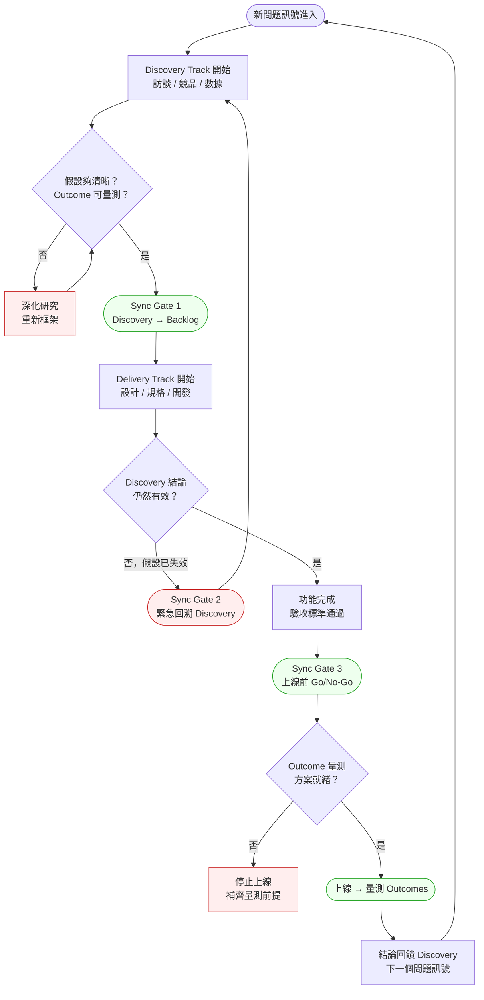
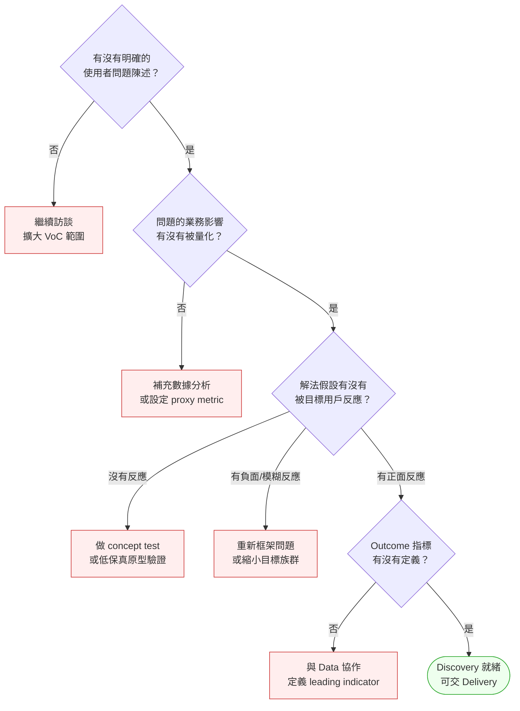

# 第 21 章 | Dual-Track Agile：Discovery 與 Delivery 同時跑

> **前置閱讀**：[Ch 13 MVP Design：最小可驗證的邊界](../part-02-discovery/ch-13-mvp-design.md)、[Ch 20 Sprint Ceremonies for PM](./ch-20-sprint-ceremonies.md)
> **下游章節**：[Ch 22 PM × SA：需求到架構的橋梁](../part-04-collaboration/ch-22-pm-sa-interface.md)、[Ch 35 Experimentation & A/B Testing](../part-06-metrics/ch-35-experimentation.md)
> **SA/SD 對照**：[SA/SD Ch 4 需求工程基礎](../../book/part-01-foundations/ch-04-requirements-engineering.md)
> ⸺ SA 視角關注需求的可實作性與完整性；本章關注的是需求在被驗證之前不應該進入 Delivery，以及兩條軌道如何同步而不互相阻塞。

---

## §21.1 冷觀察

Sprint 19 的 demo day，CartFlow（CASE-ECM-108）的工程師按下播放鍵。智慧推薦清單在首頁緩緩展開，動畫流暢，點擊毫秒級反應，後端資料管線一路打通到推薦引擎。會議室的投影幕上，那是一個無可挑剔的 demo。

PM 鼓掌。Engineering Manager 鼓掌。那個 Sprint 的 velocity 創了季度新高。有人在 Slack 丟了一個慶祝貼圖。

三週後，功能上線。

第四週的 analytics review，數字攤在大螢幕上：智慧推薦的 DAU 使用率 1.8%。Product Analytics 的標記是橘色——還沒撞到警報閾值，但已經夠難看。沒有人投訴這個功能，因為根本沒有人在用它。十五個人天做出來的東西，安靜地躺在首頁上，像一塊沒人坐的椅子。

房間裡的氣氛開始凝固。然後有人問了一句：

> 「這個功能的 Discovery，到底做到哪裡了？」

沉默了大概五秒。接著三個人幾乎同時開口，又同時噤聲。

UX 研究員先說：「我們做過一輪訪談，使用者說他們『偶爾』會想要推薦，但那輪只有八個人，我還沒做 concept test……」

工程師打斷：「等一下，所以我們上線前有跑 A/B test 嗎？baseline 拍了沒有？」

PM 的聲音最小：「我以為 Discovery 那邊已經確認過了。」

這三句話，把整件事的真相壓縮成了一張快照：Discovery track 和 Delivery track 從頭到尾不知道彼此站在哪個位置。工程師交出了一個沒有人要求被驗證的功能；UX 研究員的訪談結論還躺在 Confluence 的草稿匣裡沒人消化；PM 站在兩條軌道中間，以為有人在串聯，但那個「有人」並不存在。

CartFlow 在這個 Sprint 燒掉了十五個人天。詭異的是，沒有任何一個人做錯任何一件事——工程師交付了規格內的功能，UX 跑了訪談，PM 開了所有該開的會。但合在一起的結果是：**做完的不是需要做的，需要被確認的從來沒有被確認過。**

這種狀況有個名字：**Discovery-Delivery 斷層**。兩條軌道各跑各的，從遠處看都在動、都有產出、都有漂亮的 burndown 圖，但它們從來沒有在正確的時間點停下來、面對面，完成一次交接。velocity 量的是輪子轉得多快，沒有人量這台車有沒有開往對的方向。

---

## §21.2 真問題

表面上，CartFlow 的問題是「沒有做好 validation」。但這句話太模糊，模糊到無法行動——它沒告訴你誰在什麼時間點該停下來、該確認什麼。把它拆開來看，問題的形狀才會顯現。

### What：表面需求

Engineering 完成了推薦功能，符合 Sprint 規劃裡白紙黑字的驗收標準。Discovery 跑了使用者訪談，拿到了初步訊號。這兩件事都做了，都沒出錯，各自結案。

問題在於：**這兩件事從來沒有在同一個時間軸上對齊。** Delivery 衝過終點線時，Discovery 還停在「初步訊號，待深化確認」的半路。沒有人定義什麼叫「Discovery 完成」，更沒有人定義 Discovery 要完成到什麼程度，才有資格讓 Delivery 把功能推上生產環境。兩條軌道用各自的完工標準各自慶功，中間那道交接縫，沒有人負責縫合。

### Why：業務目標

CartFlow 的業務目標是提升回購率(Repeat Purchase Rate, RPR)。推薦功能背後的假設是：「給用戶看相關商品，能降低回購時的決策摩擦，進而提升 RPR。」

這個假設，從頭到尾沒有被正式驗證過。

訪談發現用戶「偶爾」想要推薦——這是一個 Outcomes 方向的弱訊號，不是一個確認。「偶爾想要」和「因為推薦而真的回購」之間，隔著一段沒人走過的距離。把弱訊號當成綠燈，是 CartFlow 整起事件的第一個分岔點。

在把弱訊號當綠燈之前，PM 需要一道可操作的門檻，而不是「感覺差不多了」的直覺。一個訊號只有在同時滿足兩個條件時，才算過了「可以行動」的門檻：第一，Outcome 必須被定義成可量測的**行為改變**，而非陳述偏好——「用戶說他們想要推薦功能」不算，「用戶在 concept test 中因推薦商品完成了購買行為」才算；第二，這個訊號必須在**至少兩個獨立來源**中同時出現，例如質性訪談加上行為數據，或兩個不同用戶族群各自出現相同反應。CartFlow 的 n=8「偶爾想要」同時違反了兩個條件：它是偏好陳述，不是行為量測；它來自單一輪訪談，沒有任何第二來源交叉驗證。這兩個門檻的作用，是讓後面的三層診斷表從「純分類工具」變成「放行判斷的操作標準」——先確認訊號通過門檻，再用表格定位問題層次，才是完整的診斷動作。

區分三個層次，問題就清楚了：

| 層次 | CartFlow 實際量的 | CartFlow 應該問的 |
|---|---|---|
| **Outputs** | 推薦清單是否顯示？點擊是否反應？ | 已完成 ✓ |
| **Outcomes** | 用戶因為推薦而改變了行為嗎？ | 從未驗證 ✗ |
| **Impact** | RPR 因為推薦功能而提升了嗎？ | 不知道，從未設定 baseline ✗ |

工程師量的是 Outputs。PM 自以為在追 Outcomes，但 Outcomes 從來沒有被正式定義成一條可量測的假設。沒有可量測的定義，就沒有「驗證」這個動作可以發生。

### 反向案例：Discovery 過度，Delivery 餓死

斷層不是只有一個方向。把鏡頭轉到 CartFlow 的另一個小組——支付體驗組，會看到完全相反、但同樣致命的失衡。

支付組要解決的問題是「結帳放棄率偏高」。PM 對 Discovery 極度認真：連續跑了五個 Sprint 的訪談、可用性測試、競品拆解、三版低保真原型。每一份研究都很扎實，每一輪都「再多確認一點」。問題是，Delivery 軌道在這五個 Sprint 裡幾乎沒有任何 commitment——工程師被晾在一旁，只能撿一些技術債小票來填滿 Sprint。

十週過去，支付組對問題的理解確實深刻了，但結帳放棄率一個百分點都沒動，因為沒有任何改動真正上線給用戶。當 Discovery 終於「就緒」時，競品已經推出了一鍵結帳，把整個問題的前提改寫了。支付組的五個 Sprint Discovery，有一大半因為前提失效而作廢。

這兩個案例擺在一起，才是 Dual-Track 的完整教訓：**推薦組是 Discovery 不足就衝 Delivery，支付組是 Discovery 過度而餓死 Delivery。** 一個浪費在做了沒人用的東西，一個浪費在研究一個會過期的問題。兩條軌道任何一條跑得太快或太慢，代價都是真金白銀的人天。Dual-Track 的本事，不在於把兩條軌道都拉到最快，而在於讓它們在對的點上互相節制、互相餵養。

### Who × When：決策瓶頸

決策瓶頸不是「誰做決定」，而是「在什麼時間點、誰必須給出什麼結論」。

CartFlow 的斷層精確地發生在這裡：**沒有人定義 Discovery 軌道的「就緒門(Ready Gate)」**——也就是 Discovery 要達到什麼結論，Delivery 才被允許把功能推進到生產環境。沒有這道門，兩條軌道之間就只剩善意與默契，而善意與默契在十五個人天的壓力下會默默蒸發。

DACI 分析把空缺照得一清二楚：

| 角色 | 誰應該擔任 | CartFlow 實際狀況 |
|---|---|---|
| **Driver** | PM 推動 Discovery 結論轉化為 Delivery 前提 | PM 以為 Discovery 是 UX 的事 |
| **Approver** | PM 或 Product Lead 決定「Discovery 結論是否足以上線」 | 沒有人被指定，也沒有時間點 |
| **Contributor** | UX 研究員提供訪談結論;Data 提供假設量測方案 | 各做各的，沒有 handoff |
| **Informed** | Engineering 知道 Discovery 狀態，才能判斷要不要調整 scope | Engineering 不知道 Discovery 還在進行 |

Approver 空缺是核心病灶。沒有人對「Discovery 夠了嗎？」這個問題的答案負責，所以這個問題從來沒有被任何人問到底——它只在回溯會議上，以一種追究責任的語氣，被問了一次，而那已經太晚了。Approver 這個角色的價值，不在於他多懂 Discovery，而在於他被指定要在特定時間點說出「夠」或「不夠」這兩個字，並為這兩個字承擔後果。

收束回來：CartFlow 原本想改善的是 Outcomes(用戶回購行為的改變)，但量的是 Outputs(功能是否顯示);而支付組則卡在 Discovery 永遠「差一點」、Delivery 永遠餓肚子的另一端。兩種失衡共用同一個根：沒有一道明確的、有人負責的同步門，把兩條軌道在對的時間點扣在一起。

---

## §21.3 決策框架

Dual-Track Agile 的核心設計不是「跑兩條 Sprint」，而是建立兩條軌道之間的**同步門(Sync Gate)**:Discovery 軌道的輸出，是 Delivery 軌道的輸入前提。這一節要教的不是「答案是什麼」，而是「站在每道門前，PM 該如何判斷該放行還是該攔下」。

### 圖 A — Dual-Track 工作流程圖



這張圖的價值不在於箭頭怎麼連，而在於那三道門。CartFlow 缺的正是這三道門：兩條軌道都在跑，卻從未停下來確認彼此的交接狀態。下面逐一拆解每道門背後的判斷邏輯——觸發條件、PM 的決策權限、以及如果這道門失守會發生什麼。

**Sync Gate 1 — Discovery → Delivery 的就緒門。**
觸發條件：有一個 Discovery item 自認為「可以交給 Delivery 了」。這道門要回答的問題只有一個——「這個假設清晰到可以下注嗎？」清晰的標準是雙重的：第一，問題陳述具體到一句話能說清「團隊在賭用戶會因為什麼而改變什麼行為」;第二，這個行為改變有一個可量測的 Outcome 指標。PM 在這道門的決策權限是**否決權**:他不一定要懂訪談方法論，但他有權說「指標還沒定義，不准進 Sprint」。失守的後果就是 CartFlow——把「偶爾想要」這種弱訊號當綠燈，十五個人天做出一個沒有量測前提的功能。記住：Gate 1 攔的是進度，放行的是確定性;在這裡多花三天，比在上線後燒三週便宜得多。

**Sync Gate 2 — Delivery 進行中的假設失效門。**
觸發條件：Delivery 已經開工，但 Discovery 的前提發生了動搖——競品搶先驗證了反假設、用戶訪談結論反轉、或關鍵指標的 baseline 移動超過 20%。這道門要回答的是：「正在做的這個東西，前提還成立嗎？」這是三道門裡最反直覺的一道，因為它要求 PM 在「已經做了一半」的沉沒成本面前喊停。PM 在這裡的決策權限是**召集權與暫停權**:他必須在 48 小時內把 UX、Engineering、Data 拉到同一張桌子，而不是等下一個 ceremony。失守的後果是支付組那種劇本——前提早就過期，團隊卻把整輪 Discovery 做到底才發現作廢。Gate 2 的本質是停損，而停損的成本永遠隨時間指數上升：第一天喊停損失一天，第十天喊停損失整輪。

**Sync Gate 3 — 上線前的 Go/No-Go 門。**
觸發條件：功能開發完成，驗收標準通過，只差上線。這道門只問一件事：「Outcome 量測方案就緒了嗎？」就緒的定義是三項全齊——metric 定義、tracking 實作、baseline snapshot。PM 在這裡的決策權限是**延遲上線的權限**，而且這項權限不能被 Sprint deadline 收回。失守的後果最隱蔽，因為功能照樣上線、看起來一切正常，只有在事後想分析效果時，才發現沒埋 tracking、沒拍 baseline，無從比較——這正是 CartFlow 的下場。Gate 3 的鐵律：**沒有量測方案的上線，等於一場無效實驗，只燒成本，不產 learning。**

### 圖 B — Discovery 就緒度判斷樹



這張樹的設計意圖，是把「Discovery 夠了嗎？」從一個感覺問題，變成一連串有判準的是非題。每個「否」的分支都接著一個具體的下一步動作，而不是含糊的「繼續 Discovery 直到某人覺得可以」。這也直接解決了支付組的問題——當 Discovery 沿著這棵樹往下走，只要四個節點全部變綠就該放行，而不是無止境地「再多確認一點」。就緒度是有判準的，不是團隊裡資歷最深的人說了算。

### 決策表：Sync Gate 觸發情境

| 情境 / 觸發條件 | 推薦做法 | PM 關注點 | 常見錯誤 |
|---|---|---|---|
| Discovery 訪談有正向訊號，但 Outcome 指標未定義 | 停在 Sync Gate 1；與 Data 補齊指標再交 Delivery | 訊號強弱 vs 可量測性是兩件事 | 把正向訊號當確認，直接開 Sprint |
| Delivery 進行中，競品上線類似功能 | 觸發 Sync Gate 2 評估；重新確認假設是否仍成立 | 競品上線不等於假設失效，需先評估差異 | 恐慌性 scope change，中途打亂 Sprint |
| 功能開發完成，但 A/B test 配置未就緒 | 停在 Sync Gate 3；延遲上線至量測前提就緒 | 上線日期 vs 學習有效性的優先順序 | 為了趕日期上線，事後補量測（通常補不回來）|
| Discovery 跑了三個 Sprint 仍無明確結論 | 設定 time-box 截止點：結論不夠就縮小問題範圍，不要繼續擴散 | Discovery 無限延伸本身就是訊號（問題框架錯誤） | 把「研究不完整」當理由繼續延遲，不做 scope 決策 |
| Delivery Sprint 中途 Discovery 發現假設有嚴重問題 | 立即通知 Engineering，評估是否暫停或縮小 scope | 越晚停損成本越高；PM 需要主動 push 而非等待工程師問 | 等到 Sprint end 再提出，已燒完整個週期 |

### If-Then 框架：Sync Gate 決策動作

把它貼在 Sprint Planning 的議程旁邊，每個 If 命中就照著 Then 的動作跑。

- **If** Discovery 軌道上有任何 item 處於「假設尚未獲得正向反應」狀態 → **Then** 規劃前 24 小時內將該 item 從下一個 Delivery Sprint 的 commitment 候選名單移除，在 Sync Sheet 把 Gate 1 狀態標為「等待」並寫明缺什麼，並與 UX 約定下一輪驗證的具體形式與完成日
- **If** Delivery Sprint 進行中，某個 item 的 Discovery 前提發生重大變化（訪談結論反轉、指標基線移動 > 20%、競品搶先驗證了反假設） → **Then** 48 小時內召集 UX、Engineering、Data 做 Sync Gate 2 緊急評估，不等下個 ceremony，產出「維持原計畫 / 縮小 scope / 暫停回溯」三選一結論，並同步給 Informed 名單
- **If** 功能即將完成，但 Outcome 量測方案（metric 定義、tracking 實作、baseline snapshot）有任何一項未就緒 → **Then** 上線前在 Sync Sheet 把 Gate 3 標為「等待」並列出缺項，延遲上線不妥協，給每個缺項指定負責人與完成時間
- **If** Discovery 和 Delivery 軌道各自有超過兩個 item 同時在進行 → **Then** 實施 WIP 限制：Discovery 同時進行的 item 上限為 2，PM 追蹤的 active item 不超過 Delivery 團隊一個 Sprint 的 throughput，先收斂再開新項

這個框架的設計意圖，是讓 PM 的角色明確化：**PM 是兩條軌道之間的 Gate Keeper，不是其中任一條軌道的執行者。** 你的價值不在於自己跑訪談或自己寫規格，而在於站在每道門前，準時、負責地說出「放行」或「攔下」。

---

## §21.4 踩坑清單

**反模式：把 Discovery 當前置作業，做完就結束**

現象：一輪用戶訪談、一份 Notion doc、然後功能進 Backlog。Discovery 被當成「開始前要做的事」，而不是貫穿整個開發週期的持續活動。

根因：PM 把 Discovery 的輸出和 Discovery 的結論混為一談。有訪談紀錄不等於有結論；有結論不等於結論仍然有效。

量化代價：當 Discovery 只在開工前做一次，平均每個季度會有 10–20% 的 Sprint 產出落在「上線後使用率低於預期」的功能上——CartFlow 的十五個人天就是這一類。更隱蔽的是，這類功能上線後還要花維運成本維持，等於損失被攤提到後續每個 Sprint。

> 修正方向：在每次 Sprint Planning 前設定一個例行問題：「這個 item 的 Discovery 結論，這個 Sprint 內還成立嗎？」每月覆核一次，不是只在開工前問一次。

---

**反模式：Discovery 和 Delivery 各自有不同的優先順序清單**

現象：Delivery Backlog 由 PM 維護；Discovery 的問題清單由 UX 研究員或 PM 個人維護，兩份清單從未對齊。工程師不知道哪些功能背後的 Discovery 已完成、哪些沒有。

根因：兩條軌道沒有共同的可視化工具或儀式，導致信息只在 PM 腦袋裡，不在公開的系統裡。

量化代價：兩份清單脫鉤時，handoff 失誤率顯著上升——團隊回報的數據顯示，約三分之一的 Delivery item 在開工後才發現「依賴的 Discovery 其實還沒結論」，被迫中途返工或停擺，每次返工平均吃掉 2–3 個工程人天。

> 修正方向：在同一個工具（Jira、Linear 或 Notion）裡用不同 label 或 column 區分 Discovery track 和 Delivery track，並讓兩者的連結可見：每個 Delivery item 都標注它依賴的 Discovery item 及其狀態。

---

**反模式：Sync Gate 被 Sprint Deadline 壓掉**

現象：快到 Sprint end，PM 知道 Discovery 結論還沒有，但工程師已經開始做了，「反正做一半了，不如做完再說」。

根因：停損決策的成本在短期可見（這個 Sprint 的 velocity 降低、工程師白費力氣），但繼續的成本在長期才浮現（上線後使用率低、用錯指標、沒有 learning）。PM 傾向選短期可見、損失更小的選項。

量化代價：停損的成本隨時間幾乎線性累積——Sprint 第一天喊停只損失一天，第十天喊停損失整輪(以兩週 Sprint、5 人團隊計，約 50 人天)。把 Gate 決策從 Sprint 末挪到 Sprint 初，等於把潛在損失壓縮一個數量級。

> 修正方向：在 Sprint 的第一天、不是最後一天，確認 Discovery 前提是否就緒。發現問題的時間越早，停損成本越低。Sync Gate 1 的目的就是讓問題在進 Sprint 之前就被發現。

---

**反模式：上線後才開始定義 Outcome 指標**

現象：功能上線了，PM 才開始問「我們要量什麼？」然後發現 tracking 沒有埋，baseline 沒有拍，無從比較。

根因：Outcome 指標的定義被視為「上線後的 Analytics 工作」，而不是「上線前的前提條件」。這是 Outputs 思維的殘留——交付功能是終點，而不是學習的起點。

量化代價：沒有 baseline 的上線，等於把整個功能的學習價值歸零——投入的人天全數變成 cost,learning 為零。事後想補，通常補不回來，因為上線前後的用戶行為已無從乾淨對照，只能等下一輪重做，代價翻倍。

> 修正方向：Sync Gate 3 的 checklist 把 Outcome 指標列為 blocking item：metric 定義、tracking 實作、baseline snapshot，三項都就緒才放行上線。

---

**反模式：以為 Velocity 代表進度**

現象：兩條軌道都在跑，Sprint velocity 數字漂亮，但 Outcomes 毫無改善。PM 向上匯報時用 story points 說明「進展順利」。

根因：Velocity 量的是 Outputs——多少 story 被完成。它不量 Outcomes，更不量 Impact。用 Velocity 代替產品進度，等於用工廠產量代替產品市場契合度。

量化代價：以 velocity 報進度最危險的不是浪費單一 Sprint，而是它讓失衡持續累積——團隊可能連續一整季 velocity 都漂亮、Outcomes 卻零增長，直到某次業務檢視才暴露，屆時錯失的市場時間窗已無法回收。

> 修正方向：在 Sprint Review 裡同時報告兩個數字：Outputs（story points / items done）和 Outcomes（本週期內 Discovery 驗證了哪個假設、或 Delivery 帶動了哪個指標變化）。如果 Outcomes 欄位持續空白，那才是真正的警報。

---

## §21.5 交付清單 ⸺ 一頁式 Dual-Track Sync Sheet 模板

每個 Sprint 週期的 PM 需要維護一份 Dual-Track Sync Sheet，確認兩條軌道的對齊狀態。

這份表刻意設計成**一頁式**，原因有三：第一，一頁能在 Sprint Planning 的前一天被完整掃過一遍，超過一頁的文件不會有人讀完;第二，一頁式強迫 PM 把判斷壓縮成狀態欄而非長篇敘述，逼出「就緒 / 未就緒」這種能觸發行動的結論;第三，它要當著工程師和 UX 的面攤開，篇幅越短，越像一份公共合約而非私人筆記。實務上最容易被遺漏的兩個欄位是「Discovery 狀態」(因為它在 Delivery 表裡，容易被當成別人的責任)和「量測就緒？」(因為它在功能還沒完成時感覺還早)——這兩欄正是 CartFlow 翻車的地方，所以它們必須留在表上、不能省。至於模板何時該簡化、何時該展開：單一小組、單軌主導的週期，Sync Gate 那一塊可以折疊;但只要兩條軌道同時有 item 在跑，三道 Gate 的狀態就必須全部攤開，一個都不能藏。

````markdown
# Dual-Track Sync Sheet — Sprint {N} / {YYYY-MM-DD}
> 版本:v0.1 | 撰寫日期:YYYY-MM-DD | 擁有人:{PM 姓名}

### Discovery Track（本週期進行中）

| Item ID | 問題陳述 | 目前狀態 | 結論是否就緒？ | 就緒後交接到 |
|---------|---------|---------|--------------|-------------|
| {D-001} | {一句話描述正在驗證的假設} | {訪談中 / 分析中 / 結論草稿 / 就緒} | {是 / 否} | {Delivery Sprint N+X} |

### Delivery Track（本週期 commitment）

| Item ID | 功能名稱 | 依賴的 Discovery Item | Discovery 狀態 | Outcome 指標 | 量測就緒？ |
|---------|---------|---------------------|---------------|-------------|----------|
| {DV-001} | {功能名稱} | {D-xxx} | {就緒 / 進行中} | {Outcome 指標名稱} | {是 / 否} |

### Sync Gate 狀態

| Gate | 觸發條件 | 目前狀態 | 負責人 | 截止時間 |
|------|---------|---------|-------|---------|
| Gate 1 | Discovery 就緒，可進 Delivery | {通過 / 等待} | {PM 姓名} | {日期} |
| Gate 2 | Delivery 中假設失效，需回溯 | {未觸發 / 進行中} | {PM 姓名} | {日期} |
| Gate 3 | 上線前 Outcome 量測就緒 | {通過 / 等待} | {PM 姓名} | {日期} |

### DACI 確認

- Driver（推動交接）：{姓名}
- Approver（最終 Go/No-Go）：{姓名}
- Contributors：{UX 研究員姓名}、{Data 分析師姓名}、{Engineering Lead 姓名}
- Informed：{Stakeholder 列表}
````

把它存在 `docs/planning/dual-track-sync/`，跟程式碼同 repo，跟 README 同層。

這份 Sync Sheet 的設計原則：單一來源、公開可見。PM 填，工程師和 UX 看；不是私人筆記，是兩條軌道的公共合約。

### §21.5.1 範例：CartFlow 補填的 Sprint 19 Sync Sheet

CartFlow Sprint 19 事後回溯時，團隊補填了一份假設「如果當時有這份 Sync Sheet」的對照版本。智慧推薦功能的核心問題在第一行就會顯現。

````markdown
# Dual-Track Sync Sheet — Sprint 19 / 2025-10-14
> 版本:v0.1 | 撰寫日期:2026-02-15 | 擁有人:Mei（PM）
# CartFlow (CASE-ECM-108)

### Discovery Track

| Item ID | 問題陳述 | 目前狀態 | 結論是否就緒？ | 就緒後交接到 |
|---------|---------|---------|--------------|-------------|
| D-019 | 「用戶在完成一次購買後，會因為推薦清單而回來再買嗎？\
還是推薦清單增加了頁面複雜度、反而讓用戶離開？」 | \
結論草稿（1 輪訪談完成，n=8，尚未做 concept test） | \
<!-- 為什麼這欄：這個格子如果填「否」，後面整列 Delivery 都應該停下來；\
    CartFlow 沒有這份表，所以沒有人被逼著看這個答案。 -->\
否 | Sprint 21（預估） |

### Delivery Track

| Item ID | 功能名稱 | 依賴的 Discovery Item | Discovery 狀態 | Outcome 指標 | 量測就緒？ |
|---------|---------|---------------------|---------------|-------------|----------|
| DV-041 | 智慧推薦模組（首頁 + 購後頁） | D-019 | 進行中（未就緒）\
<!-- 為什麼這欄：如果 Discovery 狀態是「進行中」，DV-041 不應進入本 Sprint 的 commitment；\
    這是讓工程師浪費十五個人天的根本原因。 --> | \
RPR（回購率）14 天內 +5% | \
<!-- 為什麼這欄：tracking 是否已埋、baseline 是否已拍，兩個問題都沒被問到。 -->\
否 |

### Sync Gate 狀態

| Gate | 觸發條件 | 目前狀態 | 負責人 | 截止時間 |
|------|---------|---------|-------|---------|
| Gate 1 | Discovery 就緒，可進 Delivery | 等待（D-019 未就緒）| Mei（PM） | 2025-10-28 |
| Gate 2 | Delivery 中假設失效，需回溯 | 未觸發 | Mei（PM） | — |
| Gate 3 | 上線前 Outcome 量測就緒 | 等待（tracking 未實作）| Mei（PM） | 上線前 3 天 |

### DACI 確認

- Driver（推動交接）：Mei（PM）
- Approver（最終 Go/No-Go）：Tom（Product Lead）
- Contributors：Rina（UX 研究員）、Jay（Data 分析師）、Kevin（Engineering Lead）
- Informed：行銷、客服、CTO 週報
````

如果 Sprint 19 第一天 PM 打開這份表，DV-041 在「Discovery 狀態」欄是「進行中（未就緒）」、「量測就緒？」是「否」——這兩個「否」在規劃前就會觸發討論，而不是在上線三週後的 analytics review 才被發現。

一份填好的 Sync Sheet，不是事後的事故報告，是事前的阻斷機制。

---

## §21.6 Recap

讀完本章，你應該已經能做到：

- [ ] 識別 Discovery Track 和 Delivery Track 在你的 Sprint 中有沒有明確的 Sync Gate，並能說出三個 Gate 分別在哪個時間點發生
- [ ] 用「Outcome 是否可量測」而不是「訪談做了幾輪」作為 Discovery 就緒度的判準
- [ ] 在 Sprint Planning 前，確認每個 Delivery item 的 Discovery 前提狀態，並能回答「這個假設本週期內仍然成立嗎？」
- [ ] 建立一份 Dual-Track Sync Sheet 作為兩條軌道的公共可見文件，讓 DACI 角色明確、Gate 狀態公開
- [ ] 把 Outcome 量測方案（指標定義、tracking 實作、baseline）列為上線前的 blocking item，而不是上線後的補充工作

### PM 工作週期檢查表

Sync Sheet 不是填完就丟，它要嵌進你的固定節奏。三個檢視點，各自盯不同的東西：

| 檢視點 | 頻率 | 用 Sync Sheet 檢查什麼 | 對應的 Gate |
|---|---|---|---|
| Weekly Sync | 每週 | 進行中 item 的 Discovery 狀態有沒有變動？有沒有任何前提鬆動需要觸發 Gate 2? | Gate 2 |
| Bi-weekly Planning | 每兩週(Sprint 邊界) | 下個 Sprint 要 commit 的 Delivery item，它依賴的 Discovery 是否已過 Gate 1? | Gate 1 |
| Month-end Review | 每月 | 上線功能的 Outcome 指標有沒有真的被量到？Outcomes 欄位是不是持續空白？ | Gate 3 |

把這張表跟 Sync Sheet 綁在一起用：weekly 掃 Gate 2 的鬆動，bi-weekly 守 Gate 1 的就緒，month-end 驗 Gate 3 的學習。三個節奏各守一道門，沒有一道門會在無人看守時被 deadline 推開。

如果先挑一項做，建議是 Sync Gate 1 的建立——把「Discovery 是否就緒」的判斷從 PM 的個人感覺，變成兩條軌道的公開合約。這一件事做穩，後面兩個 Gate 的阻力會小很多。

---

## Cross-References

- **前一章**：[Ch 20 Sprint Ceremonies for PM](./ch-20-sprint-ceremonies.md) ⸺ Dual-Track 的 Sync Gate 與 Sprint ceremony 的時間點如何對齊
- **下一章**：[Ch 22 PM × SA：需求到架構的橋梁](../part-04-collaboration/ch-22-pm-sa-interface.md) ⸺ Discovery 結論如何轉化為 SA 可操作的需求規格
- **強連結**：[Ch 13 MVP Design：最小可驗證的邊界](../part-02-discovery/ch-13-mvp-design.md) ⸺ Discovery 就緒度的判斷與 MVP scope 的劃定高度相關
- **強連結**：[Ch 35 Experimentation & A/B Testing](../part-06-metrics/ch-35-experimentation.md) ⸺ Sync Gate 3 的 Outcome 量測方案設計
- **SA/SD 對照**：[SA/SD Ch 4 需求工程基礎](../../book/part-01-foundations/ch-04-requirements-engineering.md) ⸺ SA 視角的需求完整性；本章視角是需求在進入架構設計之前，Business Outcome 假設是否已被驗證

<!-- PROPOSED-REFS
glossary:
  - anchor: dual-track-agile
    name: Dual-Track Agile
    body: |
      一種敏捷開發工作模式，將產品開發拆分為兩條平行軌道：
      Discovery Track（問題探索與假設驗證）和 Delivery Track（功能設計與工程實作）。
      兩條軌道透過 Sync Gate 對齊：Discovery 的輸出是 Delivery 的輸入前提，
      而非各自獨立運作。由 Marty Cagan (SVPG) 在 Inspired (2017) 中系統化提出。
  - anchor: sync-gate
    name: Sync Gate（同步門）
    body: |
      Dual-Track Agile 中兩條軌道之間的交接檢查點。共三個：
      Gate 1（Discovery 就緒，可交 Delivery）、Gate 2（Delivery 中假設失效，需回溯 Discovery）、
      Gate 3（上線前 Outcome 量測方案就緒）。每個 Gate 是狀態檢查，不是日期里程碑。
cases:
  - id: CASE-ECM-108
    title: "CartFlow Dual-Track 斷層：工程做完的功能沒有 Discovery 支撐"
    domain: ecommerce
    chapters: [ch-21]
    anonymized: true
    summary: |
      虛構電商 CartFlow：Discovery 和 Delivery 各跑各的，
      工程師完成了「智慧推薦」功能，但 Discovery 還未確認用戶是否需要。
      上線後使用率接近零，Sprint 19 燒掉十五個人天，無有效 learning 產出。
-->
