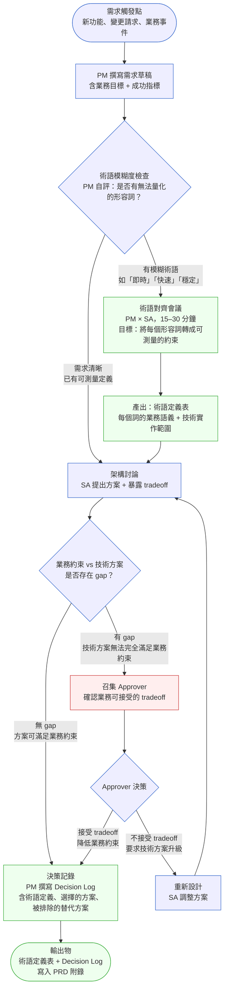
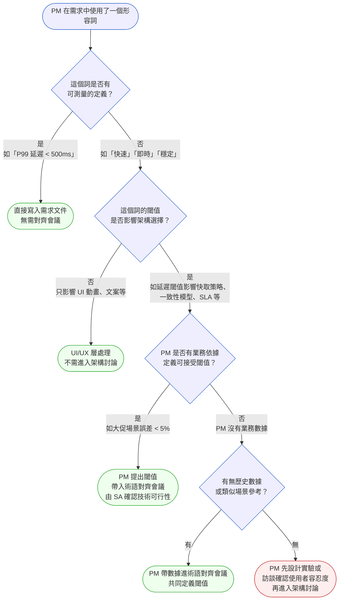

# 第 22 章 | PM × SA：需求到架構的橋梁

> **前置閱讀**：[Ch 11 Writing Specs That Engineers Trust：規格的可執行性](../part-02-discovery/ch-11-executable-specs.md)
> **前置閱讀**：[Ch 4 Requirements Lifecycle：需求的生命週期](../part-01-foundation/ch-04-requirements-lifecycle.md)
> **下游章節**：[Ch 23 PM × Engineering：Spec 與實作的落差](./ch-23-pm-engineering.md)
> **下游章節**：[Ch 27 Escalation Protocol：衝突升級的觸發條件與路徑](./ch-27-escalation-protocol.md)
> **SA/SD 對照**：[SA/SD 第 4 章 需求工程基礎](../../book/part-01-foundations/ch-04-requirements-engineering.md) ⸺ SA 視角關注需求的可實作性與系統邊界；本章關注需求從 PM 意圖轉譯到架構語言（architecture language）的接口斷裂。
> **SA/SD 對照**：[SA/SD 第 18 章 領域驅動設計（DDD）](../../book/part-04-architecture/ch-18-ddd-strategic-tactical.md) ⸺ SA 用限界上下文（Bounded Context）和通用語言（Ubiquitous Language）定義系統邊界；PM 使用本章框架確保業務語言在跨越邊界時不失真。

---

## §22.1 冷觀察

PrimeCart 的這次 sprint 評審（sprint review，衝刺評審）平靜地通過了。沒有人知道，這場平靜會在四個月後變成一場黑色星期五的事故。

那個功能叫做「即時庫存顯示」——產品頁面上的庫存數字。PM 在 PRD（產品需求文件）裡的原話是：「使用者要能即時看到商品剩餘數量，避免加入購物車後才發現無貨。」這句話在評審時通過了，沒有人多問一句。SA 設計了一套以最終一致性（eventual consistency）為基礎的方案，快取（cache，暫存）每 3 秒更新一次，設計文件第七頁有一行字：「庫存數字延遲最多 3 秒，在高流量場景下可確保系統穩定性。」這行字也通過了，沒有人質疑。

兩份文件，各自都對。但「即時」和「延遲 3 秒」之間那道裂縫，沒有人看見。

上線日是黑色星期五前兩天。

促銷開始後兩小時，客服頻道湧入第一批工單：「明明顯示有貨，加入購物車後跳出無貨。」三個小時後，工單數量突破 400 張。PM 衝進工程師的 Slack 頻道，敲下「庫存怎麼了」，工程師回了一句讓人血壓升高的話：「功能沒有壞，這是預期行為。」

PM 把那句話截圖，轉給 SA：「你說這是預期行為？」

SA 回覆的連結，指向設計文件第七頁：3 秒快取，高流量下的正常延遲。PM 盯著那一行字看了三秒，胃一沉——她終於明白，自己在 PRD 裡寫的「即時」，和 SA 在設計文件裡承諾的「3 秒延遲」，從來就不是同一件事。

沒有人說謊。沒有人犯錯。但有兩組人，整整四個月都在各說各話，而且都以為對方理解自己。

黑色星期五的那個週末，PrimeCart 的客服負責人在事故會議上問了一句話：「為什麼從頭到尾，沒有一個人在上線前確認『即時』到底是什麼意思？」

現場二十幾個人，沒有一個答得上來。

---

## §22.2 真問題

把這個事故拆開來看，表面上是技術問題——3 秒延遲和零延遲之間的差距。但真正的斷裂發生得更早，發生在需求被轉譯的那一刻。

這不是偶發的溝通失誤，而是一個結構性的、可預測的組織失敗模式。PM 和 SA 各自操作的是兩套根本不同的語義系統：PM 的語言以業務結果為導向，刻意保持一定模糊度，因為在決策早期保留選項空間是合理的；SA 的語言則必須以約束為精確，因為架構選擇一旦落地，代價是不可逆的。這兩套系統之間，沒有任何內建的對齊機制。

讓情況更棘手的是：在大多數組織裡，唯一跨越這道邊界的人，只有撰寫 PRD 的 PM 和撰寫設計文件的 SA——而沒有任何角色被明確授權負責「轉譯」這件事。沒有人擁有那個對齊責任，所以沒有人察覺到邊界正在碎裂。這就是為什麼同樣的事故會在不同團隊、不同專案裡一再重演：結構性的缺口持續存在，不因為換了能力更強的人而消失。以下的三層拆解，不是一次事故的事後分析，而是這個組織缺口在每個典型接口斷裂中留下的診斷路徑。

### 三層拆解

### ��表面需求（What，做什麼）

PM 寫的是「即時庫存顯示」。這是一個功能描述，不是一個可執行的系統約束。「即時」在 PM 的語境裡是「使用者體驗上感覺沒有延遲」；在 SA 的語境裡，任何延遲都可以被命名——100 毫秒、500 毫秒、3 秒——只要在設計文件裡說清楚，都算「預期行為」。

同一個詞，兩套語義，沒有人負責對齊。

### ��業務目標（Why，為什麼）

往上看一層，PM 真正要的是什麼？不是「即時」這個技術規格，而是「避免顧客加入購物車後才發現無貨」——這是一個業務問題，核心是轉換率保護和客戶體驗。

如果 PM 把業務目標說清楚，SA 的方案設計就會有不同的起點：問題不再是「這個更新頻率夠快嗎」，而是「3 秒延遲在高流量大促場景下，會有多少百分比的顧客遇到庫存顯示錯誤？這個比例能被業務接受嗎？」

沒有這一層的對話，就不會有後面那 400 張工單。

### ��決策瓶頸（Who × When，誰在何時拍板）

最深的一層不是技術，也不是業務目標，而是：誰必須在哪個時間點拍板「3 秒延遲是否可接受」？

這個決策從來沒有被做過。不是沒有機會做——設計評審就是最好的時機。但設計評審的參與者都是技術角色，沒有人被授權代表業務說「3 秒在大促場景下不可接受」。PM 不在場，或者在場但沒看懂那行字；SA 認為已經在文件裡說清楚了。

決策瓶頸的本質是：這個決策在組織裡找不到主人。

### Outputs / Outcomes / Impact 的錯位

這個案例精準示範了三層混淆：

| 層次 | PrimeCart 的版本 | 應有的問題 |
|---|---|---|
| **Outputs（產出）** | 即時庫存顯示功能已上線，符合設計文件 | 我們做了什麼？ |
| **Outcomes（成效）** | 顧客遭遇庫存顯示錯誤 → 加入購物車失敗 → 轉換率下跌 | 使用者行為改變了嗎？ |
| **Impact（影響）** | 黑色星期五銷售額損失，品牌信任受損 | 業務指標移動了嗎？ |

PM 盯著 Output 在確認（功能有沒有做），SA 設計的是符合 Output 規格的系統，但沒有人確認 Outcomes：「3 秒延遲在大促場景下，實際的顧客體驗是什麼？」

收束這一層的問題是：**原本想改善的是顧客結帳的 Outcomes，量的卻是功能是否上線（Output）。**

### DACI 缺席

在 PM × SA 接口，最常斷裂的地方不是技術能力，而是決策責任沒有被明確分配。這個場景的決策地圖如果事後補畫，會長這樣（DACI：Driver 推動者 / Approver 拍板者 / Contributor 貢獻者 / Informed 知會者）：

| 角色 | DACI | 應承擔的工作 | 實際狀況 |
|---|---|---|---|
| PM | **Driver** | 推動「即時」的定義對齊，確認業務可接受的延遲上限 | 寫了需求，沒有確認語義 |
| 架構負責人/CTO | **Approver** | 拍板技術方案能否滿足業務約束 | 從未被邀入對話 |
| SA | **Contributor** | 提供可行的技術方案，暴露約束與取捨（tradeoff） | 暴露了，但沒有被翻譯給業務 |
| Sales/CS | **Informed** | 上線後才需要知道行為變化 | 卻是第一個看到問題的人 |

Driver 沒有推動語義確認；Approver 沒有被納入；結果是 Contributor 寫了正確的設計，但整個決策鏈裡，沒有人代表業務說過一句「可以」或「不行」。

---

## §22.3 決策框架

PM × SA 接口的問題，根源是兩種語言系統的碰撞，中間沒有翻譯層。下面這套框架的目的，不是讓 PM 學會寫架構文件，而是讓 PM 學會判斷：在哪個節點該提出哪個問題，讓術語在進入架構討論之前就被對齊。它給你的是判斷的依據，不是現成的答案——因為每個需求該對齊到什麼程度，只有你最清楚業務能接受什麼。

### 圖 A — PM × SA 協作工作流程



這個流程的設計意圖是：**術語對齊發生在架構討論之前，不是之後。** PrimeCart 的問題，就是讓「即時」帶著模糊語義闖進了架構設計，等到設計完成再回頭對齊，代價是整個大促周期。你要判斷的不是「要不要開對齊會」，而是「這個詞的模糊度，會不會在進入架構後變成不可逆的成本」。

### 圖 B — 術語對齊決策樹



這棵決策樹的重點是：**不是所有形容詞都需要開會，但影響架構選擇的詞必須在進入設計前解決。** 它幫你判斷哪些詞值得花一場會、哪些丟給 UI/UX 就好、哪些得先補數據——而不是替你規定「所有形容詞都要對齊」。如果 PM 沒有業務數據支撐閾值，先補數據再開架構會，會比開了會卻定義不清更省時間。

### 決策表：PM × SA 接口的典型情境

| 情境 | 觸發條件 | 推薦做法 | PM 核心關注點 | 常見錯誤 |
|---|---|---|---|---|
| **性能類需求** | 需求含「快速」「即時」「低延遲」等詞 | 召開術語對齊會議，將形容詞轉為可測量閾值（如 P99 < 200ms），寫入 PRD 約束欄位 | 業務場景下使用者實際感受到的延遲容忍度 | 讓 SA 自行判斷「合理」延遲，未設定業務約束 |
| **一致性類需求** | 涉及庫存、餘額、帳單等需要準確顯示的資料 | 明確說明「讀到舊資料的代價」：業務是否能接受最終一致性？在哪些場景絕對不行？ | 使用者行為後果（加入購物車、付款）是否依賴即時準確性 | 假設「顯示準確」= 強一致性（strong consistency），未說明業務約束 |
| **規模類需求** | 需求含「支援大量用戶」「可擴展」等詞 | 提供峰值場景數字（如大促 QPS 預估）；由 SA 決定架構，PM 確認業務可接受的降級策略 | 峰值流量的業務來源（大促、行銷活動）和時間窗口 | 不提供流量數字，讓 SA 猜測規模 |
| **整合類需求** | 需要對接第三方系統或其他內部服務 | 確認對方的 SLA（服務等級協議）；PM 定義對方 downtime 時的業務降級行為 | 第三方失效時，使用者體驗是否可接受降級？ | 假設第三方永遠可用，未納入降級場景 |
| **架構重構類需求** | SA 提出需要重構才能支援新需求 | PM 要求 SA 用業務語言說明「不重構的代價」（如未來六個月新功能無法交付）；帶入 roadmap 討論 | 重構的機會成本 vs 繼續在舊架構上硬做的代價 | 把重構當純技術議題，不納入 roadmap 取捨 |

### If-Then 框架：術語對齊會議提問結構

在術語對齊會議中，一個有效的結構性提問是：

- **If** 業務場景為 [具體情境] → **Then** PM 定義的成功狀態為：使用者看到的是 ___；允許的誤差範圍是 ___（時間 / 百分比 / 次數）；不可接受的邊界是 ___
- **If** 技術方案無法達到上述標準 → **Then** 業務可接受的替代方案為：選項 A（代價：___）或選項 B（代價：___）

這個框架迫使 PM 在進入架構討論前，先把業務決策做完。SA 的工作是在這個框架內提供技術方案和取捨，而不是替 PM 決定業務約束。

對 PrimeCart 來說，如果這個框架在設計評審前被用過哪怕一次：

- **If** 黑色星期五大促期間庫存高速變動 → **Then** 顧客看到「有貨」後加入購物車的成功標準為：庫存顯示誤差 < 0.5 秒（大促前 1 小時內）；加入購物車失敗率 ≤ 2%
- **If** 技術方案無法達到上述標準 → **Then** 業務可接受：選項 A 顯示「庫存緊張」替代精確數字（代價：轉換率可能下降 1–3%）；或選項 B 大促期間切換強一致性（代價：系統成本增加 10%）

SA 看到這個框架，就不會在不說明業務影響的情況下，默默選擇 3 秒快取。

---

## §22.4 踩坑清單

PM × SA 接口的反模式，大多不是技術無知，而是對自己角色邊界的誤解。

**反模式：把 PRD 當作規格終點**

現象：PM 寫完 PRD 後，認為需求傳遞工作結束。SA 拿到 PRD，自行填補模糊地帶，設計出符合技術邏輯但不符合業務預期的方案。設計評審時 PM 批准了，因為沒看懂技術細節。上線後問題出現，才知道兩方從來沒在同一個問題上。

根因：PRD 是需求意圖的文字版，不是業務約束的完整規格。PM 認為「寫清楚了」，但技術可實作性的空間裡，有大量業務判斷需要 PM 參與。

> 修正方向：把術語對齊會議排進設計評審之前，而不是之後。PRD 的「完成」定義是：SA 能從中推導出業務可接受的技術約束，而不是只有功能描述。

---

**反模式：用技術術語假裝理解架構**

現象：PM 在設計評審中頻繁說「微服務」「快取」「非同步」，但使用方式顯示對這些詞的理解停留在字面。SA 無法確定 PM 是否真的理解取捨，傾向直接做技術決策，業務考量被排出討論。

根因：PM 試圖用技術語言獲得話語權，但這恰恰讓 SA 覺得「PM 已經懂了，不需要解釋業務影響」。

> 修正方向：在設計評審中，PM 的主要貢獻是業務約束和成功指標，而非技術方案。用「如果這樣做，使用者會看到什麼」比用「我覺得應該用 Redis」更能推進正確的對話。

---

**反模式：把架構取捨當 SA 的黑盒**

現象：設計評審後，PM 說了「OK 照你說的做」，但沒有理解方案的業務含義。上線後遇到邊界情況（edge case），PM 不知道這是「預期行為」還是 bug，也不知道如何向客服解釋。

根因：PM 把技術決策的理解責任完全外包給 SA，失去了對產品行為的解釋能力。

> 修正方向：SA 每一個重要的架構選擇，PM 都要能回答一個問題：「如果這個方案的假設不成立，使用者會遇到什麼？」不需要理解實作，但需要理解降級行為。

---

**反模式：術語對齊只做一次**

現象：Sprint 1 的術語對齊會議效果很好。Sprint 3 引入了新的性能需求，PM 以為之前的對齊仍然適用，沒有再約一次。新的需求被 SA 用不同假設實作，進入了第二個「預期行為不一致」的循環。

根因：術語對齊不是一次性工作，它在每次需求新增或場景擴展時都需要重新確認。

> 修正方向：把術語對齊的檢查點嵌入需求生命週期，每次新增涉及性能、一致性、規模的需求時，觸發一次快速對齊（可以是 15 分鐘的非同步文件審核，不一定是會議）。

---

**反模式：Decision Log 沒有人寫**

現象：術語對齊會議在口頭上達成共識，但沒有人寫成文件。三週後 SA 換了一個人繼續設計，舊的共識消失。PM 和新 SA 重新談，但基礎假設已不同，出現隱性的規格分裂。

根因：跨職能的口頭共識，是最脆弱的工作產出。PM 在接口點有責任確認決策被記錄。

> 修正方向：術語對齊會議結束後，PM 負責輸出一份 Decision Log，寫入 PRD 附錄。這份文件的所有人是 PM，不是 SA，因為它記錄的是業務判斷，不是技術判斷。

---

## §22.5 交付清單 ⸺ PM × SA 接口術語定義表模板

**交付物清單：**

- [ ] 術語定義表（Terminology Alignment Sheet）：列出所有需求中的模糊形容詞，附業務語義定義和可測量閾值
- [ ] Decision Log（決策記錄）：記錄術語對齊會議的決策、被排除的替代方案、Approver 確認
- [ ] PRD 約束欄位（Constraints Section）：在 PRD 中明確標注業務可接受的技術邊界

**空白模板：術語定義表**

這份卡片的用途是把術語對齊會議的口頭共識轉成可查閱的文件基準，讓換人接手或跨 sprint 回溯時不必重新談。填完後放進 PRD 附錄，擁有人是 PM。

````markdown
# 術語定義表 — {功能名稱} × {Sprint/版本}

> 版本:v0.1 | 撰寫日期:YYYY-MM-DD | 擁有人:{名字}

日期：{YYYY-MM-DD}
出席：PM：{姓名} | SA：{姓名}
關聯 PRD：{文件連結}

### 術語定義

| 術語 | PM 原始描述 | 業務語義（使用者角度） | 技術約束（可測量） | 不可接受的邊界 | 備注 |
|---|---|---|---|---|---|
| {術語} | {PRD 原文} | {使用者看到/感受到什麼} | {ms / % / 次數等} | {超過此值業務不可接受} | {大促/一般流量等場景差異} |

### 業務降級方案

如果技術方案無法達到上述約束：
- 選項 A：{描述} — 業務代價：{說明}
- 選項 B：{描述} — 業務代價：{說明}
- 選項 X（不可接受）：{說明為什麼這個選項不行}

### 決策記錄

選擇的方案：{選項}
Approver：{姓名 / 職稱}
確認日期：{YYYY-MM-DD}
排除的替代方案：{說明}
````

把它存在 `docs/pm/terminology-alignment/`，跟程式碼同 repo，跟 README 同層。

術語定義表的核心是「不可接受的邊界」那一欄——這是 PM 的業務判斷，不是技術規格。SA 可以幫你測量，但無法替你決定業務能接受什麼。

---

### §22.5.1 範例：PrimeCart 大促庫存顯示的術語對齊

PrimeCart 的事故在黑色星期五之後促成了一次補卡——上線後才補出的術語定義表。這份文件本來應該在設計評審前就出現。

````markdown
# 術語定義表 — 即時庫存顯示 × Sprint 14（事後補錄版）

> 版本:v0.1 | 撰寫日期:2026-02-15 | 擁有人:Irene Chen（PM）

<!-- 為什麼這欄：這份文件是事後補錄，用途是作為下一次大促前的參考，
     以及建立跨 sprint 的術語共識基準。 -->

日期：2025-12-03（事後補錄）
出席：PM：Irene Chen | SA：Marco Liu
關聯 PRD：[庫存顯示 v1.2](../specs/inventory-display-v1.2.md)

### 術語定義

| 術語 | PM 原始描述 | 業務語義（使用者角度） | 技術約束（可測量） | 不可接受的邊界 | 備注 |
|---|---|---|---|---|---|
| 即時庫存顯示 | 「使用者要能即時看到商品剩餘數量」 | 顧客點「加入購物車」時，看到的庫存數字與實際可購買數量誤差可接受 | 庫存數字更新延遲 ≤ 500ms（一般流量）；大促前 1 小時切換 strong read | 顧客點「加入購物車」後跳出「無貨」的機率 > 2%（大促場景） | 大促場景（QPS > 5,000）需另行定義；本次大促未設定此閾值為問題根因 |

<!-- 為什麼這欄（不可接受的邊界）：這個數字是業務判斷，不是技術規格；
     3 秒快取在一般流量下可接受，在大促場景下因庫存變動速度不同，
     業務代價完全不同。沒有這欄，SA 無法判斷「3 秒是否夠快」。 -->

### 業務降級方案

如果技術方案無法達到上述約束：
- 選項 A：大促期間顯示「庫存緊張」替代精確數字 — 業務代價：轉換率預估下降 1-3%，客服工單預估減少 80%
- 選項 B：大促前 1 小時切換 strong consistency read — 業務代價：單次查詢成本增加約 40%，系統團隊需提前部署
- 選項 X（不可接受）：維持 3 秒快取不調整 — 在大促 QPS > 5,000 的場景，庫存誤差率預估 8-12%，超過業務容忍上限

<!-- 為什麼這欄（選項 X）：寫下不可接受的選項，比只列可接受的選項更重要；
     它讓下一個看到這份文件的 SA 知道，哪條路是業務已確認不能走的。 -->

### 決策記錄

選擇的方案：選項 B（大促前 1 小時切換 strong consistency read）
Approver：VP of Engineering — David Huang
確認日期：2025-12-05
排除的替代方案：選項 A 被排除，因為「庫存緊張」文案在品牌評估中被認為對高單價商品轉換率影響過高
下次大促適用版本：v1.3（待工程排入 Sprint 16）
````

這份補卡文件花了一小時完成。如果在 Sprint 14 設計評審前就有它，黑色星期五的那 400 張客服工單，根本不會發生。

---

## §22.6 Recap

讀完本章，你應該已經能做到：

- [ ] 在 PRD 撰寫完成後，主動識別含有模糊形容詞的需求，並在架構討論前組織術語對齊會議
- [ ] 用「使用者看到的業務後果」定義技術約束，而不是直接引用技術術語
- [ ] 區分哪些架構取捨需要帶入 Approver 確認（涉及業務不可接受邊界），哪些可以由 SA 自行決定（在已定義約束內的技術選擇）
- [ ] 在術語對齊會議後產出 Decision Log，並寫入 PRD 附錄作為跨 sprint 的共識基準
- [ ] 理解自己在 DACI 中是 Driver：推動對齊發生，而不是等 SA 來問

回到開頭那個沒人答得上來的問題——「為什麼沒有一個人在上線前確認『即時』到底是什麼意思？」——現在你手上有了答案，也有了攔截它的工具。如果只先挑一項做，就做「術語定義表」：在下一個含有性能或一致性需求的功能進入設計前，花 30 分鐘把模糊形容詞列出來，補上「不可接受的邊界」那一欄。光是這一步，就足以把 PM × SA 之間最常見的接口斷裂，提前四到六週攔在門外——而且這一次，攔住它的人會是你。

---

## Cross-References

- **上一章**：[Ch 21 Dual-Track Agile：Discovery 與 Delivery 同時跑](../part-03-planning/ch-21-dual-track-agile.md) ⸺ 雙軌制的 Discovery 輸出如何帶入 SA 的設計討論
- **下一章**：[Ch 23 PM × Engineering：Spec 與實作的落差](./ch-23-pm-engineering.md) ⸺ 術語對齊之後，規格在工程實作階段如何繼續漂移
- **強連結**：[Ch 11 Writing Specs That Engineers Trust：規格的可執行性](../part-02-discovery/ch-11-executable-specs.md) ⸺ 可執行規格的撰寫，是術語對齊後的下一步
- **強連結**：[Ch 27 Escalation Protocol：衝突升級的觸發條件與路徑](./ch-27-escalation-protocol.md) ⸺ 當 PM × SA 術語對齊陷入僵局，升級路徑的決策框架
- **SA/SD 對照**：[SA/SD 第 4 章 需求工程基礎](../../book/part-01-foundations/ch-04-requirements-engineering.md) ⸺ SA 的需求規格化方法論；本章聚焦於 PM 如何在規格化之前做好語義層的準備工作
- **SA/SD 對照**：[SA/SD 第 18 章 領域驅動設計（DDD）](../../book/part-04-architecture/ch-18-ddd-strategic-tactical.md) ⸺ Ubiquitous Language 是 PM × SA 術語對齊的理論基礎；本章是 PM 視角的實踐手冊
