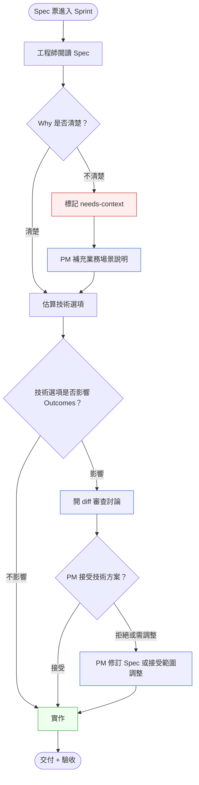
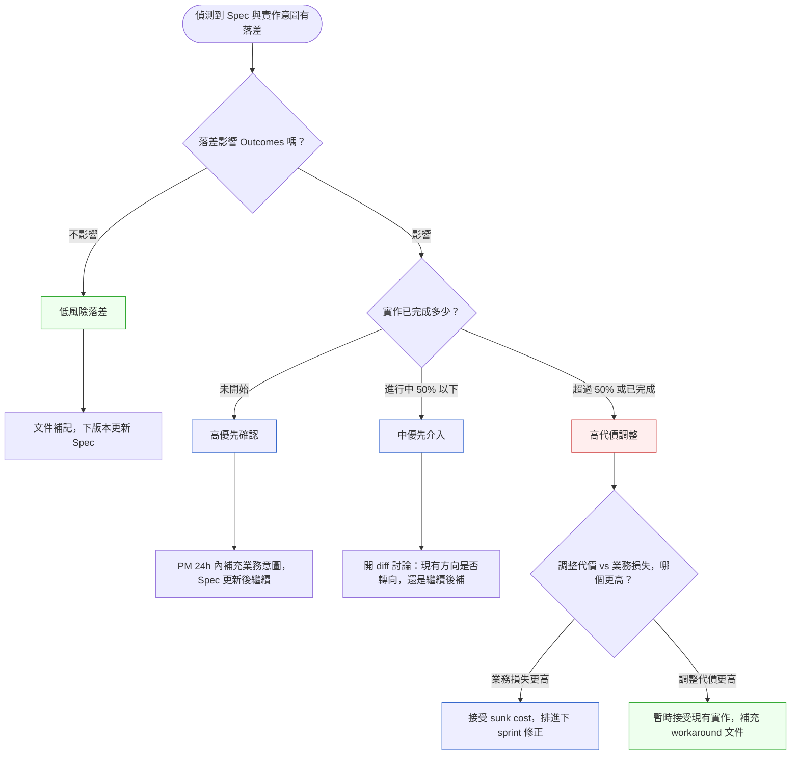

# 第 23 章 | PM × Engineering：Spec 與實作的落差

> **前置閱讀**：[Ch 22 — PM × SA：需求到架構的橋梁](./ch-22-pm-sa-interface.md)
> **下游章節**：[Ch 24 — PM × Design：UX 決策的取捨邊界](./ch-24-pm-design.md)
> **SA/SD 對照（規格結構視角）**：[SA/SD 第 10 章 — 規格文件](../../book/part-02-analysis/ch-10-spec-documents.md) ⸺ SA 視角關注規格的結構完整性與可追溯性（traceability，需求逐項可回溯到來源）；本章補上另一面：Spec 與實作之間的落差如何形成，以及 PM 如何在不干預工程自主的前提下介入確認。

---

## §23.1 冷觀察

Sprint 第十一天下午三點，Teamline 的後端工程師陳彥廷把 Jira 票從 In Progress 拖到 Done，順手在群組丟了一句「資料匯出做完了，等 Review」。他關掉編輯器去倒咖啡，整件事在他心裡已經結案。

那張票的 Spec 只有一行：「用戶可以匯出其帳戶資料」。他選了 CSV——CSV 是最直接的結構化格式，後端十分鐘就能搞定，欄位對齊乾淨，也完全符合「匯出資料」這四個字的字面意義。沒有疑問，沒有歧義，他甚至沒覺得這裡有需要問人的地方。

三天後的 Sprint Review，PM 雷佳瑩看著螢幕上那個下載下來、用試算表軟體打開、一格一格塞滿原始欄位的 CSV，停了幾秒沒說話。會議室裡有人察覺到那幾秒的重量。

她要的，從來不是 CSV。她要的是一份 PDF 報告——帶 Teamline logo、格式化好的客戶帳單摘要，財務人員下載後可以直接列印、簽核、夾進年度核對的卷宗。這個功能之所以擠進 Q3，是因為三家企業客戶在續約會議上都講了同一句話：「我們的財務流程需要能印出來給主管看的東西。」CSV 在技術上百分之百是「資料匯出」，但對那三家客戶，它等於沒做。

沒有人說錯話。陳彥廷沒有誤讀任何一個字，雷佳瑩確實在 Spec 上寫了「匯出」。落差出在那行字背後沒寫出來的東西——「為什麼要匯出」。Why 缺席了。而 Why 決定了格式，格式決定了這份輸出能不能進財務流程，能不能進財務流程決定了三週工時值不值得。

更難受的是接下來的算術。三週開發工時已經花掉，Sprint Review 那幾秒的沉默已經發生，工程師重做的成本還沒開始算。雷佳瑩只剩兩個選項：插隊讓陳彥廷停下手邊的事改做 PDF，打亂兩個人的節奏；或者跟客戶說「CSV 先這樣用」，把信任賭到下一季。兩個選項都要付代價——而這代價，本來一句話就能省下來。

這種落差在 SaaS 產品團隊裡幾乎每季上演一次。它不是工程師粗心，也不是 PM 不懂技術。它是 Spec 這個載體本身的形狀，讓「意圖」太容易從字縫裡掉出去。

---

## §23.2 真問題

### 表面需求（What）

「資料匯出」這個功能在 Spec 上存在，工程師交付了，QA 驗收通過了。這不是功能缺失，也不是程式錯誤。表面上看，問題像是「需求描述不夠詳細」——加一行「格式為 PDF」，似乎就解決了。

這個診斷沒錯，但它停得太淺。補一行格式只是補了這一次；下一次掉的可能是別的東西。

### 業務目標（Why）：意圖 vs. 規格

把它拆開來看，真相是：**Spec 的格式默認工程師已經知道業務脈絡，但他們通常不知道，也不應該被要求知道。**

這裡要刻意區分兩件事：

- **意圖（Intent）**：Why 存在這個功能、使用者用完後要拿去做什麼、哪個 Outcome 代表成功。這是 PM 的責任，必須在 Spec 裡明確。
- **規格（Specification）**：技術邊界、輸入輸出格式、異常處理。這是 SA 與工程師的責任，在可追溯性框架下逐條驗收。

SA 視角的規格文件在乎結構完整性——每一條需求能對應到來源，修改能追回到決策紀錄。這是正確的，但一份結構完整的 Spec，仍然可以在意圖上是空洞的。「用戶可以匯出其帳戶資料」在技術上可追溯，但在意圖上是缺失的。結構完整 ≠ 意圖完整。

Outputs / Outcomes / Impact 三層的對比在這裡格外清晰：

| 層次 | Teamline 案例的狀況 | Spec 裡有沒有對應 |
|---|---|---|
| **Outputs（產出物）** | CSV 檔案已交付 | ✅ 有，「用戶可以匯出資料」 |
| **Outcomes（行為改變）** | 企業客戶的財務核對流程無法進行 | ❌ 沒有，「讓財務核對可行」從未出現 |
| **Impact（業務影響）** | 三個企業客戶的續約意願下降 | ❌ 沒有，業務指標層從未被提及 |

Spec 只寫到 Outputs，工程師就只能對 Outputs 負責。Outcomes 和 Impact 不在他的視線內，要求他去猜，既不公平也不可靠。

### 決策瓶頸（Who × When）

這裡有兩個決策沒有被顯性化：

**第一個決策**：匯出格式是 CSV 還是 PDF？這看似技術選型，但它的答案由業務場景決定。這個決策的 Approver（拍板者）應該是 PM，而不是工程師的技術直覺。但 Spec 上沒有任何格式說明，等於把這個決策隱性地、無聲地委託給了實作者。

**第二個決策**：功能做完之後，怎麼確認它解決了對的問題？驗收標準（Acceptance Criteria，AC）只寫了「匯出功能可用」，沒有寫「企業客戶可以用這份輸出完成財務核對」。驗收點沒有觸及 Outcomes，於是就算 QA 全過，業務問題依然原地不動。

DACI（Driver / Approver / Contributor / Informed，一種決策權責分配框架）在這個決策上的合理分配應該是：

| 角色 | 人 | 這個決策的責任 |
|---|---|---|
| **Driver（推動者）** | PM（雷佳瑩） | 推動格式決策並寫入 Spec |
| **Approver（拍板者）** | PM × 業務代表 | 格式選型是否符合客戶場景 |
| **Contributor（貢獻者）** | 工程師（陳彥廷） | 技術可行性評估（PDF 生成成本） |
| **Informed（知會者）** | QA、客戶成功 | 知道格式選擇，調整驗收流程 |

問題的核心是：PM 沒有把自己本該扮演 Approver 的那個決策點寫進 Spec，於是它在無人察覺的情況下滑落到工程師那裡，以一個技術預設值的形式被「順手決定」了。決策沒有消失，只是換了個人、用錯了依據。

### 利害關係人衝突時怎麼辦

Teamline 案例是乾淨的——只有一個 PM 和一個工程師。但現實更混雜：假設財務部門要 CSV（方便匯入 ERP），業務部門已經在客戶面前承諾了 PDF。格式決策不是技術問題，而是一張 DACI 空白、沒有主辦人的政治問題。

這類衝突的解法不是讓兩個格式都實作——那是把決策推進程式碼，最貴的逃避方式。解法是在衝突浮出之前，PM 先找到 Impact 的所有權人：

> 哪一個 Outcome 指標的達成，對業務影響最大？誰的 OKR 對它負責？那個人就是 Approver。

Teamline 的例子裡，企業客戶續約率是 Q3 的核心業務指標，歸屬客戶成功主管。格式決策影響財務核對流程能否運作，財務核對流程影響續約會議的走向，因此 Approver 是客戶成功主管，而不是財務部門或業務部門。PM 的工作是把這條因果鏈清楚地說出來，讓有業務所有權的人拍板，而不是讓技術選型「順手決定」把衝突埋進 Outputs。

---

## §23.3 決策框架

本節給的不是「PDF 還是 CSV」這種單題答案——那是雷佳瑩的題目，不是你的。本節要交給你的是**判斷的尺**：當你面對一個 Spec 落差時，怎麼判斷它該不該介入、什麼時候介入、用多大的力氣介入。

### §23.3.1 圖 A — Spec→實作落差確認流程

當工程師開始實作前，有幾個確認點可以攔截這類落差。下圖描述的是一個輕量的「落差偵測與處理」工作流：



這個流程的設計意圖，是把判斷壓力前移到兩個便宜的介入點，而不是堆到昂貴的 Review：

- **開始前**：工程師標記 `needs-context`，PM 在 24 小時內補充業務場景。這比 Sprint Review 才發現便宜三週——要學會的判斷是「這個疑問現在問值多少、晚問貴多少」。
- **選型時**：技術選型影響 Outcomes 時，不該由工程師獨自決定，而是透過 diff 審查讓 PM 看見選項之間的語義差異。注意：是「讓 PM 看見」，不是「由 PM 代選」。

**觸發門檻**：不是每張票都需要走完整流程。一個可操作的門檻是：

> **凡是技術選型自由度 ≥ 50% 的 Spec 票，都需要附帶 Why 橋接卡（§23.5），並在 Sprint 開始前 48 小時完成。**

「技術選型自由度 ≥ 50%」的判斷方式：如果 Spec 沒有明確指定格式、載體、協議、或使用者可見行為，就視為自由度超過 50%。Teamline 的匯出票只寫了「匯出資料」，格式未定、目標使用者未寫、下游行為未寫——自由度接近 100%，Why 橋接卡是必要的。

### §23.3.2 圖 B — 落差類型決策樹

不是每個 Spec 落差都值得相同的處理力道。下面這棵樹不替你回答「要不要改」，它幫你問對問題、按對順序問，答案會從你的具體情境裡長出來：



這棵決策樹的核心判準是：**先問「落差有沒有碰到 Outcomes」，再問「改它要付多少代價」**。Outcomes 沒被影響的落差，不值得消耗政治資本；Outcomes 被影響、但改動代價已經高於業務損失的落差，硬改反而是第二個錯誤。要培養的，是在這兩個維度上估量級的直覺，而不是背一條固定結論。

### §23.3.3 決策表 — 常見 Spec 落差情境

下表不是要照抄「推薦做法」那一欄就交差，而是對照「PM 關注點」那一欄練習自己問問題——同樣的情境換個產品、換個客戶，答案可能就翻轉：

| 情境 / 觸發條件 | 推薦做法 | PM 關注點（你該自問的） | 常見錯誤 |
|---|---|---|---|
| 格式選型（如 CSV vs PDF）被工程師自行決定 | 在 Spec 加「使用場景說明」段，明確說明輸出的消費者是誰、怎麼用 | 消費者是人還是系統？可印還是可讀取？ | 把技術格式決策留白，等 Review 才發現 |
| 工程師提出範圍縮減建議（「這個可以之後再做」） | 要求工程師用一句話描述縮減後的 Outcome 影響，PM 決定是否接受 | 縮減後哪個 Outcome 受損？受損的嚴重程度？ | 直接說「好你決定就好」，把 Outcomes 責任外包出去 |
| 驗收時發現功能運作正常但使用者不買單 | 補做 Outcomes 驗證（使用者訪談或行為數據），再決定是否重做 | Outputs 達標但 Outcomes 未驗證，是不是最貴的落差？ | 把 QA 通過等同於交付成功 |
| 工程師實作中加入了 Spec 未提到的技術優化 | 確認優化是否影響業務語義；若不影響，歡迎並記錄；若影響，納入 diff 審查 | 技術優化有沒有改變使用者看到的行為？ | 完全不管工程師的技術選擇，等上線後才追問 |
| Sprint 到了一半，Spec 某個細節被發現有歧義 | 立即開一個 15 分鐘的對齊會，當場決定後寫進 Spec，不要留在下次 Review 再說 | 歧義的哪個解釋方向更符合 Why？ | 用 Slack 留言說「之後再討論」，讓歧義帶進實作 |
| 多個利害關係人對同一功能的輸出格式有衝突意見 | 找到對應 Impact 指標的 OKR 所有人，讓他做 Approver | 哪個 Outcome 指標最貴？哪個部門對它負責？ | 讓工程師做兩個版本，把衝突推進程式碼 |
| Design 的視覺稿與 Why 橋接卡的 Outcomes 說法有出入 | 在 DACI 框架內確認：PM Approver 的 Outcomes 定義優先於視覺稿 → 或協商修改 Outcomes | 視覺稿改變了什麼使用者行為？這和 Why 橋接卡的 Outcomes 方向一致嗎？ | 讓設計師或工程師各自解讀，不統一 Why 的來源 |

### §23.3.4 非同步工作流 — 當你的團隊不在同一個時區

以上流程假設 PM 和工程師在同一個辦公室或同一個 Slack 時段裡。但分散式團隊或跨時區協作時，15 分鐘對齊會是奢侈品。非同步版本的替代做法：

**工程師在票上問 Why 的 Async 格式（放進 Jira/Linear comment）：**

```
[needs-context] 我在實作 {功能名稱} 時遇到一個技術選擇，
需要確認業務方向後再繼續。

問題：{具體選擇描述，e.g. 「格式 CSV 還是 PDF？」}

我的初步判斷：{基於現有資訊的預設方向，e.g. 「CSV，因為 Spec 未指定，
成本最低」}

如果這樣走，使用者會看到：{對使用者行為的影響，e.g. 「需用試算表軟體開啟，
無法直接列印」}

@PM 請在 {時間，e.g. 「明天 EOD 前」} 確認：
- [ ] 可以照我的初步判斷走
- [ ] 方向需要調整，原因：___
```

**PM 的 24 小時 SLA**：工程師標記 `needs-context` 後，PM 在下一個工作日 EOD 前必須在票上回覆。超過 SLA，工程師可以照初步判斷繼續，但需在 PR description 補記「PM 未在 SLA 內確認，按技術預設走，可能需後補 Outcomes 驗證」。

這個 Async 格式的核心設計是：**工程師主動陳述預設方向 + 對使用者行為的影響**，而不只是問「A 還是 B？」——後者把判斷責任推回 PM，前者讓 PM 的回覆只需要確認或糾偏，節省兩邊的認知負擔。

### §23.3.5 Why 橋接卡與驗收標準的層次關係

Why 橋接卡（§23.5）和 Acceptance Criteria（AC）是兩個不同層次的文件，容易被誤以為是重複的：

| 文件 | 回答的問題 | 驗收者 | 什麼時候讀 |
|---|---|---|---|
| **Acceptance Criteria（AC）** | 功能在技術上是否正確完成？ | QA 工程師 | Sprint 尾段，驗收時 |
| **Why 橋接卡** | 功能完成後，使用者行為是否如預期改變？ | PM + 客戶成功 | Sprint 開始前（工程師）、上線後（PM） |

兩者互補，不互相取代。AC 驗的是 Outputs；Why 橋接卡的「驗收觸發行為」欄位（§23.5 第 5 欄）驗的是 Outcomes。一個功能可以 AC 全過而 Outcomes 零達成——Teamline 的 CSV 就是完美的例子。

在 Spec 結構裡，建議的堆疊順序：

```
Spec 票（SA 規格，完整性與可追溯性）
  └── Why 橋接卡（PM 意圖摘要，讓工程師在歧義時自主導航）
        └── Acceptance Criteria（QA 驗收點，驗 Outputs）
              └── Outcomes 驗收觸發行為（PM 驗 Outcomes，上線後量測）
```

### §23.3.6 If-Then 框架：Spec 意圖保護

下面是現場常用的條件→行動結構，可以直接放進 Spec 模板的「工程師須知」區段。它的價值不在於替你下結論，而在於把「該不該停下來問」這個判斷，變成一條可以當場自檢的反射：

- **If** 你在實作中遇到 Spec 沒有覆蓋的技術選擇 → **Then** 在評估中加一行：「這個選擇會影響 \_\_\_ 的使用體驗/業務場景嗎？」——如果答案是「會」，@mention PM 確認後再繼續
- **If** 你認為 Spec 的某個需求可以用成本更低的方式達到 → **Then** 先用一句話描述「用這個方案的話，用戶行為的哪個部分會改變或消失」，再提出替代建議
- **If** 工程師完成的功能在技術上正確但業務上不對 → **Then** PM 的責任是重開一張票，不是在 Sprint Review 上更正歷史；Sprint Review 已完成的是歷史，下一張票才是行動
- **If** Sprint 到一半發現 Spec 有歧義 → **Then** 立即開 15 分鐘對齊會（或發 async 確認，SLA 24 小時），當場決定後寫進 Spec，不留到下次 Review
- **If** Design 的視覺稿與 Why 橋接卡的 Outcomes 描述有出入 → **Then** 在實作前 escalate 到 DACI Approver 確認以誰的 Outcomes 定義優先，不讓工程師自行判斷（這條橋接第 24 章）

這五個 If-Then 的共同邏輯是：**PM 保護 Outcomes，工程師保護 Outputs，Spec 是兩者對話的媒介**。Spec 如果只描述 Outputs，它就只能保護 Outputs。

---

## §23.4 踩坑清單

### 反模式一：Spec 只寫功能，不寫使用場景

**現象**：Spec 寫了「用戶可以 X」，但沒有說這個 X 是在什麼情境下被誰用、用完後拿去做什麼。工程師憑技術直覺做了一個合理的實作，但業務語義對不上。

**根因**：PM 在寫 Spec 時思維停在「功能邊界」，沒有切換到「使用者行為後果」。寫 Spec 的格式沒有強制要求填寫使用場景，導致意圖留在 PM 腦裡而不在紙面上。這種現象在 SaaS 產品裡格外常見，因為「使用者」背後往往是一個有自己流程的企業，而那個流程的細節 PM 知道、工程師不知道。

**為什麼「只補規格」不夠**：如果解法是「以後 Spec 要寫清楚」，那只是在補這一次的 What。下一次掉的可能是另一個維度——誰用、怎麼用、用完後去哪裡。結構完整的 Spec 沒辦法自動保護意圖的完整性。

> **修正方向**：Spec 模板加入「這個功能的輸出，誰在什麼情境下使用？用完後去哪裡？」欄位。這一欄不需要多，一句話就夠——但有和沒有，工程師的選型方向會完全不同。Why 橋接卡的第 1、2 欄是具體的填法（見 §23.5）。

---

### 反模式二：用 Sprint Review 代替落差確認

**現象**：PM 在 Sprint Review 才第一次看到實作結果，發現與預期不符後在會議上要求修改。工程師感到突然，下一個 Sprint 的排程被打亂。反複發生後，工程師開始在 Sprint Review 前對 PM 做「預防性說明」——花時間解釋他們為什麼做了某個決定，而不是展示完成的功能。

**根因**：PM 把 Sprint Review 當成「驗收會」，工程師把 Sprint Review 當成「展示完成品的場合」。兩者的心理模型不同，導致修改請求被感知為「臨時翻案」。長期下來，工程師學會在 Review 前做自我保護；PM 學會在 Review 上說「先這樣，下次再調」。兩個人都在花力氣管理不信任，而不是做產品。

**為什麼「中間過一次」就夠了**：Spec → 實作的最大落差窗口，在 Sprint 第 3–5 天：工程師已做了足夠多的技術選型，但還沒到無法回頭的地方。在這個點做一個輕量確認，成本是 15 分鐘或一條 Async comment；在 Review 才確認，成本是三週工時加上下個 Sprint 的插隊。

> **修正方向**：在 Sprint 第三到五天設一個輕量的「mid-sprint sync」——不是進度報告，而是工程師展示技術選型，PM 確認方向是否符合 Why。15 分鐘，同步一件事：「你正在做的這個，方向對嗎？」非同步版本：工程師在票上留「技術選型摘要」comment，PM 在 24h 內回覆確認或糾偏（見 §23.3.4 的 Async 格式）。

---

### 反模式三：把技術選型決策完全外包給工程師

**現象**：PM 在工程師問「要用 A 還是 B 實作？」時，回答「你比我懂，你決定就好」。工程師選了技術上最優的方案，但這個方案對業務場景的適配性從未被驗證。更隱藏的形式：PM 在寫 Spec 時預設工程師會問，但工程師沒問，因為 Spec 上沒有顯示這裡有需要問的地方。

**健康授權 vs. 過度信任的邊界**：工程師對 How 有完整的判斷能力，這是對的，應該被充分授權。但技術選型的業務語義（這個選項對使用者行為的影響）不是技術問題，是業務問題。把兩件事混在一起，「你決定就好」等於一起外包了。

**已經發生了怎麼辦**：如果功能已經做完，發現選型的業務語義有問題：
1. 不要在 Sprint Review 上要求當場重做——那個選型已經是工程師的合理決策，在他的資訊框架裡。
2. 在 Review 後另開一張「業務驗證票」，用行為數據或使用者訪談確認 Outcomes 是否達成。
3. 如果 Outcomes 確實沒有達成，把修正需求寫成新的 Spec，附帶 Why 橋接卡，讓下一輪實作有清楚的業務意圖。

> **修正方向**：工程師問選型時，PM 的標準回答模式：「從業務角度，\_\_\_ 這件事需要被滿足（Why）。在這個前提下，哪個選項更好你決定（How）。」PM 說 Why，工程師說 How——這條線清楚了，授權才是真正的授權，而不是放棄 Outcomes 的掌控。

---

### 反模式四：用「補規格」取代「對齊意圖」

**現象**：Spec 落差發現後，PM 加了很多文字到 Spec 裡，描述越來越詳細，但工程師仍然感覺「看不懂 PM 在想什麼」。Spec 越寫越長，對齊效果越來越差。會議邀請越開越多，每次開完仍然有新的問題出現。

**根因**：補規格是在補 What 的細節，但落差通常來自 Why 的缺失。再多的 What 都無法取代一句清楚的 Why。Spec 長度不等於意圖清晰度。

**為什麼長 Spec 有時候更危險**：工程師在實作前會「掃讀」Spec，找到看起來最直接相關的部分開始做。長 Spec 意味著他們掃到的段落不一定包含 Why——Why 被埋在第三頁的某個段落，在時間壓力下很容易被跳過。

> **修正方向**：落差發生後，先問「哪個 Why 沒有被傳遞到？」，再決定要補什麼。通常答案是在 Spec 最前面加一段「業務背景」（或一張 Why 橋接卡），比在功能描述下加三段限制條件更有效。Why 放第一頁，工程師遇到歧義時的第一個參照點就對了。

---

### 反模式五：驗收標準停在技術層，不觸及使用者行為

**現象**：驗收標準寫的是「匯出功能可用、檔案可下載、無錯誤訊息」。QA 全過，功能上線。但使用者用了一次後再也不用，NPS 沒動，客戶續約會議上這個功能沒有被提到。

**根因**：Acceptance Criteria 寫的是 Outputs，沒有包含對應的 Outcomes 驗證點。功能「可用」和功能「被用」之間的距離，Spec 沒有要求任何人去量測。QA 的責任邊界在技術驗收，Outcomes 的量測是 PM 的責任——但如果 PM 沒有把 Outcomes 量測點預埋在 Spec 裡，它就不會自動發生。

**上線後如何補救**：如果功能已上線而沒有 Outcomes 驗證：
1. 在 Analytics/BI 工具裡設一個漏斗：「使用者啟動功能」→「完成功能」→「完成下游行為」。下游行為是 Why 橋接卡第 5 欄描述的那個 Outcomes 觸發行為。
2. 如果沒有行為數據，找 3–5 個使用者做 15 分鐘的 Outcomes 訪談：「上次用這個功能後，你做了什麼？」
3. 把這次補做的量測結果寫進功能的「後期觀察記錄」，附在下一個相關功能的 Why 橋接卡裡作為歷史參照。

> **修正方向**：在 Acceptance Criteria 加一條「行為驗收」：「第一批使用者完成這個功能後，可以繼續完成 \_\_\_ 這個下游行為。」這不是 QA 的責任——是 PM 在 Spec 裡預埋的 Outcomes 量測觸發點。上線後 2 週，PM 用數據或訪談確認這個觸發行為是否真的發生了。

---

## §23.5 交付清單 ⸺ 一頁式 Spec Why 橋接卡模板

每個帶有技術選型空間的 Spec 票，應該附帶一張「Why 橋接卡」，讓工程師在實作前看到業務脈絡。

````markdown
### Spec Why 橋接卡
> 版本:v0.1 | 撰寫日期:YYYY-MM-DD | 擁有人:{名字}

### 1. 業務背景（這個功能為什麼存在）
<!-- 為什麼這欄：工程師知道「為誰做、給誰用」後，格式選型的答案通常
     不需要再問 PM；這一欄省掉的 Review 時間比寫它花的時間多很多。 -->
{使用者/客戶遇到什麼問題，這個功能如何讓他們繼續完成下一步行為}

### 2. 使用者是誰，怎麼用這個功能
{角色 + 操作場景 + 輸出被拿去做什麼}

### 3. 成功的 Outcomes 是什麼
<!-- 為什麼這欄：沒有這一欄，QA 只能驗「能下載」，沒有人驗「財務主管
     看得懂、願意用」；兩件事之間的距離，這裡點出來。 -->
{功能上線後，什麼使用者行為的改變代表成功}

### 4. 工程師的選型邊界
<!-- 為什麼這欄：告訴工程師哪些選型空間是他的、哪些需要回來確認；
     沒這一欄，工程師只能靠猜測決定什麼需要問。 -->
{技術上可以自由選擇的部分} / {影響使用者行為、需要 PM 確認的部分}

### 5. 驗收觸發行為（Outcomes 驗收點）
<!-- 為什麼這欄：這是 AC 和 Why 橋接卡的橋接點。AC 驗 Outputs；
     這一欄是 PM 對 Outcomes 的量測承諾——上線後 2 週，
     PM 要回來確認這個觸發行為是否真的發生了。 -->
{第一批使用者完成後，應能繼續完成：___}
量測方式：{行為數據 funnel / 使用者訪談 / 客戶成功觀察}
驗證時間：上線後 {N} 週

### 6. DACI
<!-- 為什麼這欄：讓工程師在選型疑問出現時知道該問誰、誰能拍板；
     沒這一欄等於讓問題在 Slack 漂流。 -->
- Driver：
- Approver：{負責 Outcomes 指標的 OKR 所有人}
- Contributor：
- Informed：
````

這張卡不需要取代完整的 Spec，它是 Spec 的「意圖摘要」——工程師在開始實作之前讀的那一頁，決定他在遇到歧義時是往左走還是往右走。

把它存在 `docs/specs/why-bridge/`，跟程式碼同 repo，跟 README 同層。

### §23.5.1 範例：Teamline 資料匯出功能的 Why 橋接卡

Teamline 案例裡，雷佳瑩在 Sprint 開始前沒有填這張卡。以下是如果當時填了，陳彥廷看到的會是什麼：

````markdown
### Spec Why 橋接卡
> 版本:v0.1 | 撰寫日期:2026-02-15 | 擁有人:PM 雷佳瑩

### 1. 業務背景（這個功能為什麼存在）
<!-- 為什麼這欄：工程師知道「為誰做、給誰用」後，格式選型的答案通常
     不需要再問 PM；這一欄省掉的 Review 時間比寫它花的時間多很多。 -->
企業客戶的財務部門需要每季核對 Teamline 的使用費用。
目前他們需要截圖再整理，過程耗時且容易出錯。
這個功能讓他們可以直接拿一份格式化報告給財務主管簽核。

### 2. 使用者是誰，怎麼用這個功能
- 角色：企業客戶的財務或行政人員
- 場景：每季末，登入帳戶 → 點「匯出帳戶報告」→ 下載 → 列印或轉 PDF 寄給主管
- 輸出被拿去做什麼：紙本或 email 附件，交給財務主管做年度覆核

### 3. 成功的 Outcomes 是什麼
<!-- 為什麼這欄：沒有這一欄，QA 只能驗「能下載」，沒有人驗「財務主管
     看得懂、願意用」；兩件事之間的距離，這裡點出來。 -->
財務人員下載報告後，不需要再做任何整理，可以直接交給主管。
量測方式：第一批使用企業客戶的財務人員反饋「可以直接使用」。

### 4. 工程師的選型邊界
- 可自由選擇：報告生成的後端技術（wkhtmltopdf、Puppeteer、等）
- 需回來確認：輸出格式（格式影響使用者行為）→ 本功能格式需為 PDF，
  原因：使用者要列印給主管，CSV 無法直接列印成可閱讀的報告格式

### 5. 驗收觸發行為（Outcomes 驗收點）
第一批使用企業客戶完成下載後，應能直接將 PDF 附件轉寄給財務主管，
無需另外格式化或重新整理資料。
量測方式：客戶成功主管在上線後第 2 週聯繫 3 家企業客戶確認使用情況
驗證時間：上線後 2 週

### 6. DACI
- Driver：PM 雷佳瑩
- Approver：PM × 客戶成功主管（格式確認 + Outcomes 指標所有人）
- Contributor：後端工程師陳彥廷（技術可行性：PDF 生成方案選型）
- Informed：QA（調整驗收流程）、財務部門（格式確認後知會）
````

如果這張卡在 Sprint 開始前存在，陳彥廷在技術選型時就知道「格式影響使用者行為，需要確認」——他會在做 CSV 之前先問一句話，而不是在 Sprint Review 才讓兩個人都尷尬。

### §23.5.2 Outcomes 驗證清單（上線後）

Why 橋接卡的第 5 欄是 PM 對 Outcomes 的量測承諾。上線後 2 週，用這份清單確認承諾有沒有兌現：

| 驗證項目 | 確認方式 | 達標標準 | 負責人 |
|---|---|---|---|
| 使用者啟動功能的比例 | Analytics funnel | ≥ {X}% 目標使用者在 2 週內至少使用一次 | PM |
| 下游行為完成率 | Analytics funnel 或 客戶成功追蹤 | ≥ {Y}% 完成 Why 橋接卡第 5 欄描述的觸發行為 | PM + 客戶成功 |
| 使用者自述回饋 | 3–5 人訪談或 CSAT | 無需額外整理即可使用率 ≥ {Z}% | 客戶成功 |
| 支援票件量 | Zendesk / Intercom | 功能相關支援票 < {N} 件/週 | 客戶成功 |
| 業務指標影響 | CRM / 續約率追蹤 | 對應 OKR 指標方向正確 | PM × 業務 |

如果上線後 2 週有任何一欄未達標，不等到下一個季度計畫才處理——在 Jira 開一張「Outcomes 補強票」，附上這份清單的未達標記錄，讓下一輪修正有清楚的起點。

---

## §23.6 Recap

讀完本章，應該已經能做到：

- [ ] 在 Spec 票上加入「業務背景」段，讓工程師在技術選型前知道 Why
- [ ] 區分哪些技術選型影響 Outcomes（需要確認），哪些只影響 Outputs（授權給工程師）
- [ ] 設計驗收標準時加入至少一條「使用者行為」觸發點，不只驗 Outputs
- [ ] 在 Sprint 中段設一個輕量確認點（同步或非同步），不等到 Review 才發現方向偏差
- [ ] 用 DACI 把「格式選型由誰拍板」顯性化，讓衝突有地方落地而不是落進程式碼
- [ ] 在 Why 橋接卡的第 5 欄預埋 Outcomes 量測承諾，上線後 2 週回來確認

如果只能先做一件，就在下一張 Spec 票的最前面加一段「業務背景」——這一段決定了工程師遇到歧義時的第一個判斷方向，而那個方向一旦定了，後面的選型幾乎就跟著走了。下次 demo 那幾秒的沉默，從你寫下那一段業務背景的此刻起，就已經被提前拆掉了。

---

## Cross-References

- **前一章**：[Ch 22 — PM × SA：需求到架構的橋梁](./ch-22-pm-sa-interface.md) ⸺ SA 如何把業務需求轉為可實作的架構邊界
- **下一章**：[Ch 24 — PM × Design：UX 決策的取捨邊界](./ch-24-pm-design.md) ⸺ 設計決策的 PM 介入點與讓步邊界；Why 橋接卡的 Outcomes 定義如何在設計稿與實作間保持一致
- **強連結**：[Ch 12 — Acceptance Criteria：驗收標準的精確度](../part-02-discovery/ch-12-acceptance-criteria.md) ⸺ Outcomes 驗收點的具體寫法；本章的「行為驗收」條目是 AC 的意圖延伸
- **強連結**：[Ch 11 — Writing Specs That Engineers Trust：規格的可執行性](../part-02-discovery/ch-11-executable-specs.md) ⸺ Spec 的結構如何引導工程師信任它；Why 橋接卡是 Spec 的意圖摘要層
- **SA/SD 對照**：[SA/SD 第 4 章 — 需求工程基礎](../../book/part-01-foundations/ch-04-requirements-engineering.md) ⸺ SA 視角的需求可追溯性與邊界定義；本章關注 PM 如何在 Spec 中嵌入業務意圖，讓工程師在歧義時能自主導航
- **SA/SD 對照（延伸閱讀）**：[SA/SD 第 10 章 — 規格文件](../../book/part-02-analysis/ch-10-spec-documents.md) ⸺ 章首對照聚焦「落差如何形成」，此處延伸到落差的修補面：規格的 Why 層在實作期如何防止落差被持續擴大
