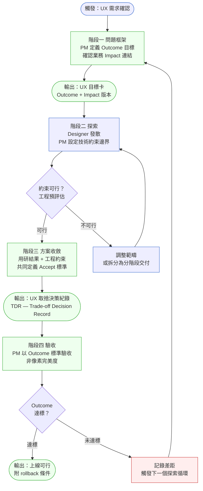
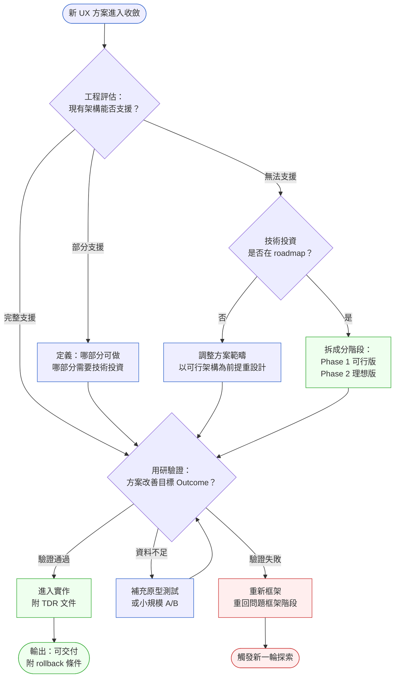

# 第 24 章 | PM × Design：UX 決策的取捨邊界

> **前置閱讀**：[Ch 23 PM × Engineering：Spec 與實作的落差](./ch-23-pm-engineering.md)
> **下游章節**：[Ch 25 PM × QA：驗收合約不是最後一關](./ch-25-pm-qa.md)
> **SA/SD 對照**：[SA/SD 第 16 章 UI/UX 與人機互動的系統觀](../../book/part-03-design/ch-16-uiux-system-view.md)
> ⸺ SA 視角關注互動設計的系統可實作性與元件邊界；本章關注 PM 在 UX 探索過程中的決策所有權與取捨時機。

---

## §24.1 冷觀察

Sprint 17，倒數第三天，下午四點十一分。Designer 把第三版 checkout（結帳）流程的高保真稿丟進 Slack，附一句話：

「這版我很滿意，用研驗過了，流程從七步壓到四步。轉換率該起來了。」

PM 回了一個 👍。Engineering Lead 沒回。

第二天站會，Engineering Lead 等所有人講完才開口：「那個四步 checkout，Payment 那塊的狀態機要整個重寫。這個 sprint 做不了。」

現場靜了三秒。三秒在站會裡很長。

Designer 先打破沉默：「但用研講得很清楚，第五步是最大的離開點。不壓掉它，數字不會動。」

「我知道。」Engineering Lead 說，「但那個 UI 假設 payment 跟 inventory 的狀態是同步的。我們的架構不是。」

PM 坐在兩人中間，看左邊，看右邊，然後看向白板上那條已經排好的 sprint 線。

「那……我們先上六步版，下個 Sprint 再看?」

Designer 把筆放下，起身，走出會議室。沒有摔門，這比摔門更糟——她只是不再覺得這場對話跟她有關。

那條被砍掉的第五步，後來上線了。轉換率沒起來，反而掉了。但這是三個月後的事。

---

這個場景在 CASE-ECM-109 的 VistaCart 電商平台複現過不只一次。VistaCart 是一間中型時裝電商，月活 230 萬，2025 年 Q2 啟動了一次「全站 UX 升級」計劃，預計三季內重新設計 6 個核心流程。

計劃在第二季度開始失速。

不是設計做得不好——用研扎實、原型精緻、A/B test（A/B 對照測試）的實驗設計也合理。是決策斷了。每一個設計方案在進入 Engineering 評估前，沒有人知道它的「取捨邊界」在哪裡。Designer 在探索階段做了很多對的事；PM 在驗收階段說了很多次「先這樣吧」。兩者之間的那段空白，被站會裡的沉默填滿。

三個月後，VistaCart 上線了四個「降格」版本。Analytics 顯示其中兩個的轉換率比重新設計前更差。沒有人能解釋為什麼——因為沒有人記得當初取捨了什麼，更沒有人寫下為什麼那樣取捨。決策蒸發了，只剩結果。

---

## §24.2 真問題

把 VistaCart 的情況拆開，表面上是 Engineering 和 Design 的時程不同步。

真正在處理的，是三個層次的問題。

### 表面需求（What）

Designer 要的是：設計方案被忠實實作。

Engineering 要的是：不要在最後兩天，拿到一個需要重寫狀態機的需求。

PM 要的是：sprint 不爆。

這三件事，都是 **Outputs（產出物）** 層次的訴求——做出了什麼。

### 業務目標（Why）

VistaCart 真正想改變的，是 checkout 的完成率——一個 **Outcomes（成效）** 層次的指標，衡量用戶行為是否真的改變。

但在整個 UX 升級計劃裡，「完成率」只出現在 OKR 文件的第一頁。後續的設計評審、sprint planning、驗收討論，談的都是「這版做完了沒」「高保真稿有沒有對上原型」。Outcomes 在執行流程中消失了。

更深一層：VistaCart 的業務壓力是時裝市場的留存率，因為競品在 2025 年推出了 AI 穿搭推薦。這是 **Impact（業務影響）** 層次。checkout 體驗的改善，是服務這個 Impact 的其中一條路徑——但沒有人在計劃裡把這條路徑說清楚。

於是當 Engineering 說「這個 sprint 做不了」，沒有人知道這個「做不了」的代價有多大——因為沒有人知道它跟業務 Impact 的連結有多緊。

VistaCart 的取捨決策之所以失控，根源在於所有討論都停在 Output 層次——「這版做完了沒」「高保真稿有沒有對上」——沒有任何一場站會或評審把 Outcome 目標或 Impact 風險擺上桌。當三個角色看不到同一個成效參照點，「先這樣吧」就不會帶來成本感：每一次讓步在當下都顯得合理，因為沒有人知道它讓轉換率的假設鬆動了多少。Output / Outcome / Impact 三層不只是診斷工具，更是讓取捨決策重新變得「看得見成本」的共同語言——PM 用它定義問題框架，Designer 用它確認探索方向的有效性，Engineering Lead 用它評估技術約束的業務權重。有了這個共同參照，「做不了」才能轉化為「這個做不了的代價是 Outcome 損失 X%，值不值得找替代路徑」——這正是下面的 DACI 分析與 §24.3 框架想解決的問題。

### 決策瓶頸（Who × When）

把問題推到最核心：**誰必須在什麼時候決定取捨？**

VistaCart 的 UX 升級沒有一個明確的決策點設計。Design 在探索階段自主收斂，Engineering 在實作前才給出約束，PM 在最後才仲裁——而那個仲裁，通常是「先這樣」。

這不是協作問題，是 **決策時機** 問題。

用 DACI（Driver / Approver / Contributor / Informed，責任歸屬框架）拆：

| 角色 | 誰 | VistaCart 的問題 |
|---|---|---|
| **D** Driver（驅動者） | PM | PM 沒有設計「取捨決策」的觸發點 |
| **A** Approver（拍板者） | PM + 業務負責人 | 業務負責人在降格版上線前從未被拉入 |
| **C** Contributor（貢獻者） | Designer + Engineering Lead | 兩者沒有共同的「可行性對話」節點 |
| **I** Informed（知會對象） | Marketing、客服 | 上線後才知道版本降格 |

問題不在 Designer 做太多、Engineering 說太晚。問題在 PM 沒有在探索階段就設計一個讓 Design 約束條件可見的機制，也沒有在方案收斂前讓 Approver 確認取捨邊界。

結果是：決策分散在無數個「先這樣吧」裡，沒有人能還原。

---

## §24.3 決策框架

PM 在 Design 協作中的核心工作，不是「管理設計師」，而是設計 **決策點的出現時機**。

問題框架、探索、方案收斂、驗收——每個階段都有 PM 必須介入的節點。下面這套框架不會告訴你「該選四步還是六步」，那永遠視情境而定；它告訴你**在哪個節點、該問哪個問題，才能讓正確的人有依據地做出取捨**。先把四個階段畫出來。

### 圖 A — PM × Design 工作流程



這個流程的關鍵，是圖中的兩個決策點：**工程預評估**（探索後，收斂前）和 **Outcome 達標確認**（實作後，上線前）。

VistaCart 缺的不是設計能力，是這兩個節點。Designer 在探索階段沒有收到工程約束，因為沒有人設計這個對話的時機。PM 在驗收時用「高保真稿有沒有對上」衡量，而非用「完成率是否移動」。

---

### 圖 B — UX 取捨決策樹

決策樹的用途不是替你決定，而是逼你在「先這樣吧」之前，先把方案推進到某個有終點的分支上。



每條分支都有明確終點：要麼進入實作（附文件）、要麼重新框架（附觸發記錄）。「先這樣吧」不是一個分支，因為它沒有終點——這正是它危險的地方。

---

### 決策表 — PM 在各情境的介入策略

這張表不給你答案，給你**該問的問題**。同一個情境在不同公司會收斂成不同決定，但該問的問題是一樣的。

| 情境 / 觸發條件 | 推薦做法 | PM 該問自己的問題 | 常見錯誤 |
|---|---|---|---|
| Designer 帶著完整高保真稿進 Sprint Planning | 先停：確認工程預評估是否做過 | 這個方案的技術前提是什麼？ | 直接排進 sprint，Engineering 驗收後才發現問題 |
| Engineering 說「這個 sprint 做不了」 | 問「做不了」的部分是什麼？是架構問題還是時程問題？ | 取捨邊界在哪？哪部分影響 Outcome 最大？ | 妥協為「六步版」卻不記錄取捨原因 |
| 用研顯示設計方案有效，但 Engineering 成本高 | 帶業務負責人一起確認取捨優先序 | Impact 層次的業務壓力有多緊？ | PM 單方面決定降格，業務方事後不認 |
| 方案在 A/B test 中未達預期 | 記錄差距，觸發新的問題框架，不要直接打補丁 | 是假設錯了，還是執行偏了？ | 調整 UI 細節卻不重新驗證假設 |
| 設計師與工程師在細節上持續衝突 | 把衝突提到 Outcome 層次：這個細節影響用戶行為嗎？ | 衝突的根源是技術約束，還是設計優先序分歧？ | PM 當裁判，卻沒有衡量 Outcome 的依據 |
| Designer 對 Approver 的取捨決定不同意 | 把分歧拉到 Impact 層次，設計 1% 流量測試解決「口味」爭論 | 分歧是 UX 品味問題，還是對業務 Impact 優先序的理解不同？ | PM 直接拍板，Designer 帶著挫敗感繼續工作 |

---

### If-Then 框架：探索期的 PM 介入觸發條件

在 Design 探索階段，以下是 PM 應該介入的觸發條件與對應行動：

- **If** Designer 進入高保真設計 AND Engineering 尚未做可行性評估 → **Then** 安排「15 分鐘工程約束對話」，輸出約束清單，再繼續高保真設計
- **If** 方案涉及跨服務狀態同步（如 payment × inventory）AND 現有架構是非同步模型 → **Then** 觸發 TDR，定義「可行版」與「理想版」的邊界，由 PM 帶業務方確認優先序
- **If** 驗收時發現實作與設計稿有落差 → **Then** 先判斷落差是否影響 Outcome 指標，影響則退回，不影響則接受並記錄
- **If** 上線後 Outcome 未如預期 → **Then** 回到問題框架，重新驗證「哪個假設錯了」，不是重新設計介面
- **If** 設計師感覺「我的設計一直被砍」 → **Then** 這是信號：PM 沒有在探索早期就把技術約束帶入，導致設計師在錯誤的假設下工作
- **If** Designer 對 Approver 的取捨結果提出異議 → **Then** 把討論轉向 Outcome 指標：先跑 1% 流量測試，讓資料裁判，而非讓職級裁判

---

### Analytics 同步：Sprint 開始就對齊，不是上線前才問

「上線後看數據」這句話，是三個月後後悔的起點。

在每個涉及 UX 假設的 Sprint 開始時，PM 必須和 Analytics 團隊確認三件事：

1. **衡量哪個指標**：用哪個 event 代表「checkout 完成」？是 `order_confirmed` 還是 `payment_success`？這兩個在架構上可能是不同節點。
2. **需要多少樣本**：以 VistaCart 每日 checkout 嘗試量（約 8,000 次）為例，偵測 3% 的轉換率差異，需要約 10,000 個樣本，大約 1.5 天；但同期若有其他 UI 改動，結果會被混淆。
3. **誰每天看數字**：不是 PM 每週看一次，而是 Analytics 每天報告，PM 每天決定是否有觸發 rollback 條件。

這三件事不確認，TDR 裡的「驗收條件」就是空話。

---

### 兩種規模的 TDR：大改動 vs. 微改動

TDR 不是只給系統重設計用的。任何「取捨決策」都值得一條記錄——大到狀態機重寫，小到按鈕文案改動。

| 維度 | 大改動（VistaCart checkout） | 微改動（按鈕文案調整） |
|---|---|---|
| 探索週期 | 6–8 週，多輪用研 | 1–2 天，快速 A/B 假設 |
| 工程約束對話 | 正式排 30 分鐘，輸出約束清單 | Slack 非同步確認，5 分鐘 |
| TDR 長度 | 完整一頁（見 §24.5 模板） | 三行：原文案 / 新文案 / 預期 Outcome |
| 驗收條件 | 4 週，明確閾值與 rollback 行動 | 1 週，點擊率變化 > 5% 即確認 |
| Phase 2 條款 | 必填（技術投資路徑） | 通常不需要 |

「三行 TDR」不是在簡化流程，而是讓 PM 在快速迭代時仍然有決策痕跡。一個月後的復盤，會謝謝那三行。

---

### 跨團隊 UX 決策：DACI 跨越多個 Owner 時

當 UX 決策跨越 Payment、Inventory、Marketing、CS 多個團隊，單一 DACI 表會失準。

這種情況的症狀：「我們都同意改，但不知道誰來排進 sprint」。

處理原則：

- **一個 UX 決策只能有一個 Approver**。如果兩個 VP 都有否決權，必須先解決 Approver 衝突，才能進入設計探索。不要讓 Designer 在 Approver 衝突未解的情況下工作。
- **跨團隊影響用「影響地圖」而非 DACI 延伸**：先畫出哪些團隊的指標會被這個 UX 改動影響，再決定每個影響域各自的 Contributor 和 Informed，分開填寫，不要合併成一張過大的 DACI。
- **設計評審會邀請跨團隊代表**：每個受影響的團隊出一人參加一次設計評審，目的不是讓他們拍板，而是讓他們提前知道約束，避免上線後才出現「那邊說不行」。

---

## §24.4 踩坑清單

**反模式：驗收時才發現技術前提不成立**

現象：高保真稿通過 PM 審核進入 Sprint，Engineering 在實作階段才指出架構問題，導致方案在最後降格或推遲。

根因：PM 把 UX 評審和工程可行性評估視為獨立的兩條線，沒有設計讓兩者在探索中期相交的節點。Designer 在假設「Engineering 會讓它成真」的前提下工作。

> 修正方向：在高保真設計開始前，安排一次「15 分鐘工程約束對話」，輸出一份約束清單（不是技術文件，就是一頁清單），讓 Designer 知道哪些互動假設需要調整。這一步花的時間，遠少於最後的降格協商。

---

**反模式：以「像素完美度」衡量 UX 驗收**

現象：PM 在驗收時比對高保真稿與實作，關注顏色、間距、動畫是否對齊，卻沒有檢查使用者行為是否如預期改變。

根因：「做完了」比「有效了」更容易量化，而 PM 在時程壓力下傾向於用可量化的指標結案。

> 修正方向：在 Sprint 開始時，把驗收標準從「實作與稿對齊」改成「Outcome 指標可量測」。如果 Outcome 在一個 Sprint 內量不到，就定義一個代理指標（如：測試環境的 task completion rate，任務完成率）當驗收門檻。

---

**反模式：取捨決策沒有記錄，只存在 PM 的記憶裡**

現象：功能上線後，Analytics 顯示成效不如預期，但沒有人能還原「當初為什麼做了這個版本而不是那個版本」。

根因：PM 在 sprint 壓力下做了口頭仲裁（「先這樣吧」），沒有寫下決策原因、取捨的假設、以及驗收後的追蹤條件。

> 修正方向：每一個「降格決策」或「取捨決策」，寫一條 TDR（Trade-off Decision Record，取捨決策紀錄），格式不需要複雜：日期、原方案、實際做法、取捨原因、驗收條件。一段話就夠，但要寫。這份記錄，在 post-launch review（上線後復盤）時會是最重要的上下文。

---

**反模式：PM 當 UX 決策的裁判，而非框架的持有者**

現象：Designer 和 Engineering Lead 在細節上意見分歧，PM 介入拍板，最終決策來自 PM 的個人偏好，而非 Outcome 依據。

根因：PM 沒有帶著「這個細節如何影響 Outcome」的問題進入衝突，而是直接進入判斷者角色。

> 修正方向：在衝突升溫前，把問題轉換到 Outcome 層次：「這個細節，我們有沒有資料說明它對完成率的影響？」如果有，依資料；如果沒有，承認不確定性，設計一個可以收集資料的驗收條件，讓資料做裁判。

---

**反模式：Design 探索完全自主，PM 只在收斂後才出現**

現象：Designer 在整個探索階段獨立運作，PM 在方案成型後才參與評審，此時修改成本已高，導致方案被迫全盤接受或全盤否定。

根因：PM 誤以為探索是設計師的工作，自己的角色是在「完成品」上做決策。實際上 PM 在探索初期就需要帶入業務假設，讓探索有方向。

> 修正方向：在探索開始前，PM 和 Designer 共同完成一份「UX 目標卡」，寫清楚：我們想改善哪個 Outcome、哪些技術約束是已知的、業務 Impact 的優先序是什麼。這一頁，讓後續探索不會在最後才發現方向偏了。

---

**反模式：Phase 2 承諾隨時間蒸發**

現象：TDR 中寫了「Phase 2 補齊」，但沒有設定進入條件或過期機制。六個月後沒有人記得那個承諾，降格版本成為永久狀態。

根因：PM 把「Phase 2」當作一個安撫 Designer 的承諾，而非一個有條件、有期限的 roadmap 事項。

> 修正方向：每一個「Phase 2」承諾，在 TDR 中填寫「Phase 2 契約」欄位（見 §24.5 模板）：進入 Phase 2 的觸發條件是什麼、誰負責追蹤、如果到 X 日期還沒進入，自動標記為「已降優先序」，並通知 Designer。沒有過期條件的 Phase 2，等於沒有承諾。

---

## §24.5 交付清單 ⸺ 一頁式 UX 取捨決策紀錄（TDR）模板

本章交付物只有一份：一頁式 TDR 模板，以及一個填好的範例。它的設計原則是「一條取捨一頁」，輕到可以在 sprint 中途十分鐘寫完。

````markdown
# UX 取捨決策紀錄（TDR）
> 版本:v0.1 | 撰寫日期:YYYY-MM-DD | 擁有人:{名字}

<!-- 為什麼這份文件：
     每次 PM 在 UX 流程中做了「降格」或「分階段」的取捨，
     需要有一份可查的記錄；沒有這份記錄，六個月後的 post-launch review
     會找不到決策上下文，也無法驗證當初的假設是否成立。 -->

### 日期 / Sprint
{YYYY-MM-DD} / Sprint {N}

### 功能 / 流程
{功能名稱，如：checkout 四步流程}

### 原方案（理想版）
{描述 Designer 提出的完整方案，包含核心 UX 假設}

### 實際做法（可行版）
{描述最終實作的版本，與理想版的差異}
<!-- 為什麼這欄：差異要寫清楚，不是「簡化了」，
     而是「第四步的 payment confirmation modal 改為 inline，
     因為彈窗需要 payment 服務同步回應，現有架構不支援」。 -->

### 取捨原因
{技術約束 / 時程壓力 / 業務優先序 — 寫真正的原因}

### 影響的 Outcome
{這個取捨預計對哪個 Outcome 指標有何影響？}
<!-- 為什麼這欄：強迫寫出「我們認為這個取捨不影響轉換率，因為…」
     或「我們接受這個取捨，代價是轉換率可能下降 X%」，
     讓 post-launch review 時有假設可以驗證。 -->

### 量測計畫（Analytics 對齊）
- 衡量指標：{具體 event 名稱，如 `order_confirmed`，非泛稱「轉換率」}
- 最小樣本量：{N 個用戶，或 N 天的流量}
- 混淆變數排除：{同期是否有其他 UI 改動？若有，如何隔離？}
- 每日報告負責人：{Analytics 聯絡人名字}
<!-- 為什麼這欄：沒有量測計畫的驗收條件是空話。
     這欄在 Sprint 開始時填，不是上線前才填。 -->

### 驗收條件
{上線後 N 週，如果 {指標} 低於 {閾值}，觸發 {行動}}

### Phase 2 契約（若有分階段承諾）
- 進入條件：{什麼情況觸發進入 Phase 2，如「完成率穩定在 65% 以上連續 4 週」}
- 負責追蹤人：{PM 姓名}
- 過期日期：{若 YYYY-MM-DD 前未進入 Phase 2，自動標記「已降優先序」並通知 Designer}
<!-- 為什麼這欄：沒有過期條件的 Phase 2 承諾等於沒有承諾。
     Designer 需要知道這個承諾有沒有在被追蹤。 -->

### 決策者（DACI）
- Driver: {PM 姓名}
- Approver: {業務負責人}
- Contributor: {Designer, Engineering Lead}
- Informed: {Marketing, 客服}

### 升溫路徑（若 Designer 對決定有異議）
{如果 Designer 不同意 Approver 的取捨優先序，下一步是什麼？
 建議：帶到業務負責人 + Designer 主管，根因通常是 Impact 優先序分歧，非 UX 品味分歧。
 若分歧無法解決，設計一個 1% 流量測試，讓資料裁判。}
````

> 把它存在 `docs/decisions/ux/`，跟程式碼同 repo，跟 README 同層。

這份模板設計為「一條取捨一頁」，不需要描述整個 UX 流程，只記錄這次取捨的原因和後果。六個月後的人能從這一頁重建決策上下文。

### §24.5.1 範例：VistaCart Checkout 四步流程取捨

VistaCart 在 Sprint 17 做了一個讓設計師離開站會的決策。下面是那個決策如果當時就寫成 TDR，會長什麼樣：

````markdown
# UX 取捨決策紀錄（TDR）
> 版本:v0.1 | 撰寫日期:2026-02-15 | 擁有人:PM Alice Chen

<!-- 為什麼這份文件：
     VistaCart Q2 UX 升級計劃中，checkout 流程降格決策沒有文件，
     導致三個月後的 post-launch review 無法還原取捨原因。
     這份範例是事後補的，用來示範如果當時有寫，長什麼樣。 -->

### 日期 / Sprint
2025-05-14 / Sprint 17

### 功能 / 流程
Checkout 流程重新設計（七步壓四步）

### 原方案（理想版）
四步 checkout：購物車確認 → 地址填寫 → 付款 → 完成確認
<!-- 為什麼這欄：用研顯示第五步是最大離開點（離開率 34%），
     壓縮到四步的假設是去掉中間的 payment confirmation modal，
     改為 inline 確認，預期轉換率提升 8–12%。 -->

### 實際做法（可行版）
六步 checkout（移除的是地址自動填入功能，payment confirmation modal 保留）
差異：payment confirmation modal 是彈窗，需要 payment service 同步回應；
現有 payment 服務是非同步模型，彈窗關閉前無法確認付款狀態。
保留 modal = 保留第五步，無法壓到四步。

### 取捨原因
技術約束：payment 與 inventory 狀態非同步，checkout UI 假設同步回應。
重寫狀態機需要 2–3 個 sprint，不在當前 roadmap。
時程壓力：Q2 上線承諾已在 OKR 中，推遲代價高於降格代價（當時評估）。
<!-- 為什麼這欄：寫「技術約束」是事實；不寫具體是哪個約束，
     就等於沒寫。未來要補 Phase 2 的人，看這欄才知道從哪裡動。 -->

### 影響的 Outcome
checkout 完成率目標：從 62% 提升至 70%（原方案假設）
六步版預期：提升至 65%（移除地址自動填入的邊際改善）
接受代價：放棄 5% 的轉換率提升，等待 Phase 2 補齊

### 量測計畫（Analytics 對齊）
- 衡量指標：`order_confirmed` event（在 payment_service callback 後觸發）
- 最小樣本量：10,000 個 checkout 嘗試（約 1.5 天流量），置信度 95%
- 混淆變數排除：同期無其他 checkout 頁面改動；若有緊急 hotfix，Analytics 標記排除日期
- 每日報告負責人：Analytics 工程師 David Huang（每天 10AM Slack 報告）

### 驗收條件
上線後 4 週，如果完成率低於 63%（低於現況），觸發緊急回滾評估。
如果完成率在 63%–65%，進入 Phase 2 排程討論。
如果完成率超過 65%，確認六步版為穩態，Phase 2 降低優先序。

### Phase 2 契約
- 進入條件：Q3 Engineering 評估後，技術投資 ≤ 2 個 sprint，且六步版完成率穩定 ≥ 4 週
- 負責追蹤人：PM Alice Chen
- 過期日期：2025-09-30 前未進入 Phase 2，自動標記「已降優先序」，並通知 Designer May Wu 和 VP Product

### 決策者（DACI）
- Driver: PM Alice Chen
- Approver: VP Product Jerry Lin（事後確認；此欄應在決策前填妥）
- Contributor: Designer May Wu, Engineering Lead Kevin Tsai
- Informed: Marketing, 客服

### 升溫路徑（若 Designer 對決定有異議）
Designer May Wu 當場以沉默表達異議。正確做法應為：
1. 識別分歧根源：May 認為 Impact 優先序是「用戶體驗先行」；Jerry 認為是「如期上線先行」。
2. 帶到 Jerry + May 的主管，對齊 Impact 優先序，而非在站會中即席裁判。
3. 若仍無共識，設計 1% 流量測試：同時上線四步版（僅限可以快速調整的用戶段）vs. 六步版，
   4 週後依資料決定 Phase 2 是否提前進入。
````

這份 TDR 寫出來，Designer 離開站會的那三秒沉默就有了上下文。「先這樣吧」不會憑空消失——但它會有個可以追蹤的記錄，讓六個月後的人知道當初為什麼，以及當初說的「Phase 2」有沒有兌現。

---

## §24.6 Recap

回到 Sprint 17 那三秒沉默：問題從來不是「四步還是六步」，而是沒有人設計一個讓這個取捨被看見、被記錄、被追蹤的時機。讀完本章，你應該已經能做到：

- [ ] 在 Design 探索階段，識別出哪個節點需要工程約束介入，並設計對話時機
- [ ] 用 Outputs / Outcomes / Impact 三層拆解 UX 需求，找到真正的業務決策點
- [ ] 建立 DACI，讓每個 UX 取捨有明確的 Approver，不靠 PM 口頭仲裁
- [ ] 每次降格或取捨決策，寫一份 TDR，讓決策上下文六個月後仍可還原
- [ ] 把驗收標準從「稿圖對齊」改成「Outcome 可量測」，Sprint 開始就對齊 Analytics
- [ ] 所有「Phase 2」承諾附上進入條件、追蹤人和過期日期，確保承諾不蒸發
- [ ] 當 Designer 對取捨有異議，把分歧移到 Impact 層次，用資料裁判，不用職級裁判

不用一次全部做到。下次 sprint 裡第一個「先這樣吧」出現的時候，花十分鐘把它寫成一條 TDR——你會發現決策從那一刻起就不再蒸發，而你也不再是那個坐在中間、只能說「先這樣」的人。

---

## Cross-References

- **上一章**：[Ch 23 PM × Engineering：Spec 與實作的落差](./ch-23-pm-engineering.md) ⸺ Engineering 協作中的 spec 可執行性問題
- **下一章**：[Ch 25 PM × QA：驗收合約不是最後一關](./ch-25-pm-qa.md) ⸺ 驗收標準的精確度與 QA 合作界面
- **強連結**：[Ch 12 Acceptance Criteria：驗收標準的精確度](../part-02-discovery/ch-12-acceptance-criteria.md) ⸺ Outcome 導向的驗收標準定義
- **強連結**：[Ch 38 Post-Launch Review：上線後的 PM 責任](../part-06-metrics/ch-38-post-launch-review.md) ⸺ TDR 中的驗收條件如何進入 post-launch review
- **SA/SD 對照**：[SA/SD 第 16 章 UI/UX 與人機互動的系統觀](../../book/part-03-design/ch-16-uiux-system-view.md) ⸺ SA 視角的 UX 系統邊界與元件可實作性；本章關注 PM 在取捨決策中的所有權設計
