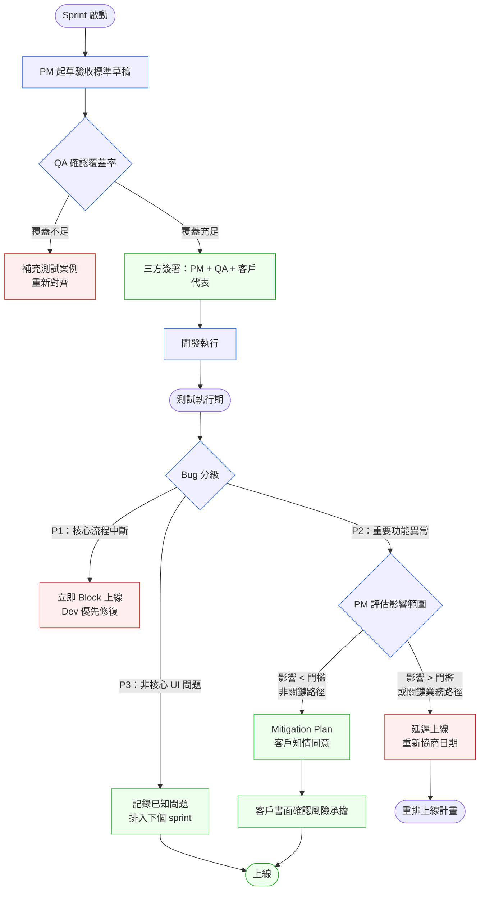
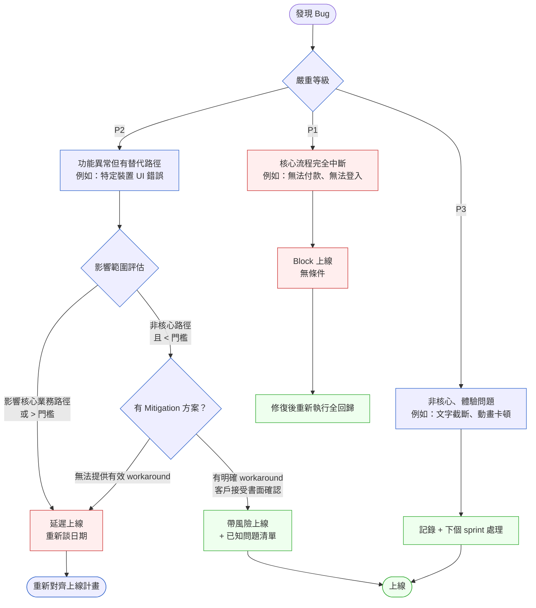
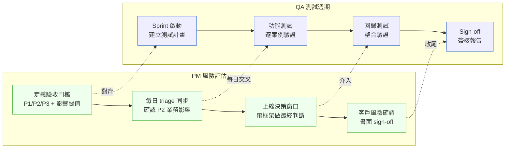

# 第 25 章 | PM × QA：驗收合約不是最後一關

> **前置閱讀**：[Ch 23　PM × Engineering：Spec 與實作的落差](./ch-23-pm-engineering.md)
> ⸺ 了解 Spec 與實作落差後，本章進一步處理「實作完成後的驗收缺口」。
>
> **下游章節**：[Ch 26　PM × Data：指標的定義與所有權](./ch-26-pm-data.md)
> ⸺ 驗收通過只是起點；本章的後續是如何用數據衡量功能是否真正有效。
>
> **SA/SD 對照**：[SA/SD 第 27 章｜安全設計](../../book/part-05-quality/ch-27-security-by-design.md)
> ⸺ SA 視角關注測試覆蓋的系統性設計；本章關注 PM 在 Bug Triage（缺陷分流）中的決策責任與承諾管理。
>
> **SA/SD 對照**：[SA/SD 第 30 章｜SRE、SLO、Chaos Engineering](../../book/part-05-quality/ch-30-sre-slo-chaos.md)
> ⸺ SA 用 SLO（服務水準目標，Service Level Objective）定義可靠性目標；本章討論 PM 如何把 SLO 轉化為驗收標準的語言。

---

## §25.1 冷觀察

上線前兩天，晚上九點四十一分，QA Lead（測試主管）在 Slack 丟了一條訊息，後面跟著一個紅色的驚嘆號 emoji：

> 「P2 bug，支付確認頁面在 iOS 15.x 上不顯示訂單金額。影響範圍估計 18% 用戶。修復需要 2–3 天。」

ClearPay 的 PM Jenny 盯著螢幕，手指停在鍵盤上方，沒有立即回覆。她已經連續開了六個小時的會，這條訊息是今天的第三個壞消息，但前兩個都能在當天解決——這一個不行。

三週前，她在客戶對齊會議上對企業端的財務長 James Lim 親口承諾：「十一月十五號上線，不會延。」那個日期已經寫進了合約附件第三條。對方的採購流程、員工教育訓練計畫、發給三千名員工的內部公告，全部繞著那個日期排。James 當時還笑著說：「我們很久沒遇到敢把日期寫進合約的供應商了。」這句稱讚，現在像一塊壓在胸口的石頭。

她把視窗往下拉，看到 Dev Lead（開發主管）幾乎同時丟上來的訊息：「我可以先包一個 hotfix（緊急修補），但沒辦法保證不破壞 Android 那邊的流程。要嘛我給你一個沒測完的快修，要嘛你給我三天。」

QA Lead 緊接著補了一句，語氣平靜，卻字字有重量：「如果現在強推，我會在 sign-off（簽核）報告上標記『已知風險』。」

這句話 Jenny 懂。已知風險一旦被白紙黑字標記，責任鏈就從「系統出了問題」變成「PM 在知情的情況下同意上線」。前者是團隊的事，後者是她一個人的事。

她打開日曆，盯著那一格。十五號是週五。延一週就撞上感恩節前的最後一個工作日，那正是企業客戶的財務年度結算高峰期——財務部門那一週連喝水的時間都沒有，不可能配合上新系統。再往後延就是跨年，整個採購案有可能因為跨會計年度而需要重新走一次審批，等同於失效。

驗收清單上有 142 個測試案例，139 個已通過。綠燈一片，只有三個格子是紅的。問題是，那三個紅格子，沒有人事先說過「紅了會怎樣」。

這種場景在現場並不罕見。P2 的 bug 不夠嚴重到強制 block（阻擋上線），但又不是可以裝作沒看見的雜訊。驗收合約簽了，上線日期承諾了，QA 盡責地發現了問題，PM 站在中間——她既不是工程師、也不是客戶，卻是那個唯一必須在午夜前按下「上」或「不上」的人。

問題從來不是「這次要不要延遲上線」。問題是：**當驗收標準沒有事先定義清楚，這個決策就會在最壞的時機點，落到最不應該獨自承擔它的人身上。**

---

## §25.2 真問題

### 表面需求（What）

ClearPay 的案例表面上是一個上線時機問題：P2 bug 遇上承諾日期，要上還是要延？

大多數 PM 在這個階段的反應是尋找折中方案——「先上線，再 hotfix」或「跟客戶溝通延一週」。這兩條路都可能走通，但它們都只是處理症狀，而不是病因。處理症狀的代價是：下一個 sprint、下一個功能、下一個客戶，同樣的午夜抉擇會再來一次。

### 業務目標（Why）

把問題往後退一步：為什麼這個 P2 bug 會在上線前兩天才被發現？為什麼驗收清單的 139/142 通過，卻無法給 PM 足夠的決策信心？

根本原因不是測試做得不夠，而是 **驗收標準的定義從頭到尾沒有把「可上線條件」說清楚**。

驗收清單列出了 142 個測試案例，但它沒有回答三個真正重要的問題：

- P1 / P2 / P3 的區分標準是什麼？誰來判定？
- 哪些 bug 等級、在哪些條件下，是無條件 block？
- 已知風險的最終承擔方，是客戶、PM、還是 QA？

當這些邊界不存在，每一次上線決策都會退化成一場即時談判——而即時談判的結果，取決於誰當下最大聲、誰的日期承諾最重，而不是取決於什麼對產品和用戶最好。

### 決策瓶頸（Who × When）

這裡有一個更深層的問題：**驗收標準是誰定的？什麼時候定的？**

常見的錯誤是把驗收標準的制定，留到「QA 開始測試的時候」。到那個時候，工程師已經按自己對 Spec 的理解實作完畢，客戶已經排好了上線後的內部流程，PM 也已經把日期承諾出去了。任何在測試期才被發現的問題，都只能在這些既成約束下被「處理」，而不可能被「解決」。

驗收標準應該在 **Spec 鎖定、開發開始之前** 就和 QA、工程師、客戶三方對齊。這不是 QA 的責任，是 PM 的責任——因為只有 PM 同時握有「業務上什麼叫完成」和「客戶承諾了什麼」這兩塊資訊。

### 同一個病根的三種變形

ClearPay 是最典型的版本，但「驗收標準未事先定義」這個病根，會在不同團隊長出不同的樣子。認得出變形，才不會以為這只是 fintech 的特例：

- **跨時區驗收斷層。** QA 在台北，工程在波蘭，客戶在紐約。bug 在台北早上被發現，傳到工程已經是波蘭深夜，客戶要到紐約上午才看得到。一個本該十分鐘解決的 triage 對齊，被時區拉成 24 小時的延遲。若驗收標準沒有事先寫明「哪些等級的 bug 需要同步、哪些可以非同步」，跨時區團隊每一個 P2 都會空轉一整天。
- **多客戶上線時間衝突。** 同一份程式碼要在同一週上線給三個企業客戶，但三家的「可接受風險門檻」不同：A 客戶是新創，願意帶風險先上；C 客戶是銀行，任何已知 P2 都不接受。PM 若只有「一套」驗收標準，必然得罪其中一邊。真正需要的是「分客戶的上線門檻」事先寫進各自的驗收卡。
- **內部利害關係人的隱性日期。** 沒有外部合約，但業務承諾了一場給投資人的 demo、行銷排好了發稿、CEO 在全員信裡提了日期。這些「軟承諾」沒有合約那麼硬，卻同樣會在上線前兩天變成壓力，逼 PM 帶風險上線。

三種變形的解法是同一個：把上線條件，從「事後談判」前移成「事前定義」。

這裡有一個工具可以精準命名 ClearPay 犯的類別錯誤。Jenny 掌握的資料完全正確：139 個測試通過、日期準時、Dev Lead 說能包 hotfix。問題不在資料錯誤，而在她量的是錯誤的層次。139/142 通過是一個 **Outputs**（產出）數字，它只告訴你「被測到的路徑跑通了」。但客戶真正在意的是 **Outcomes**（成效）——三千名員工上線後能否順利完成付款——以及 **Impact**（影響）——帶著已知風險上線若引發大規模客訴，合約信任能否撐得住。把計數測試通過視為「可上線」的信心依據，是把 Outputs 當作 Outcomes 的代理指標，而測試案例根本沒有被設計來量測那一層。下面這張三角表的作用，是讓這個類別錯誤在下次 sprint 啟動前就被指出來，而不是等到午夜才被迫重新思考。

### Outputs / Outcomes / Impact 三角

| 層次 | ClearPay 的誤認 | 真實情況 |
|---|---|---|
| **Outputs**（產出） | 142 個測試案例通過 = 交付完成 | 測試案例通過只代表「被測到的路徑沒有問題」，沒被想到的路徑（iOS 15.x）正是出事的地方 |
| **Outcomes**（成效） | 上線日期達成 = 客戶滿意 | 客戶真正在意的是「上線後我的三千名員工能不能順利操作」 |
| **Impact**（影響） | 合約履行 = 關係維護 | 帶著已知風險上線若造成大規模客訴，合約關係受到的傷害會遠大於誠實延期 |

PM 在這個案例中量的是 Outputs（測試通過數）和行程上的 Output（日期達成）。真正需要保護的，卻是 Outcomes（用戶操作成功率）和 Impact（客戶長期信任）。錯把產出當成效，是這場午夜危機真正的源頭。

### DACI 拆解

DACI（Driver / Approver / Contributor / Informed，驅動者／核准者／貢獻者／知情者）是釐清決策責任歸屬的框架。把 ClearPay 的決策套進去，瓶頸立刻現形：

| 角色 | 人員 | 本案問題 |
|---|---|---|
| **Driver**（驅動者） | PM | 在推動「上線決策」，但從未推動「驗收標準的事先定義」 |
| **Approver**（核准者） | PM + 企業客戶財務長 | 客戶的「同意」是針對日期，不是針對任何已知風險 |
| **Contributor**（貢獻者） | QA Lead、Dev Lead | 全程被動回應，因為他們從未被邀請在 sprint 啟動時參與驗收標準的定義 |
| **Informed**（知情者） | 銷售、客服 | 完全不知道有已知風險存在，上線後第一線挨罵的卻是他們 |

決策瓶頸的核心是：**Approver 在上線前兩天才第一次拿到完整資訊**。這是一個流程設計缺陷，不是一次溝通失敗。把溝通做得再勤快，也補不回一個本該在三週前就攤開的決策。

---

## §25.3 決策框架

本節的目標不是給你一個「該不該上線」的標準答案——那個答案永遠取決於你的業務脈絡。本節要給的是**判斷的鷹架**：一套讓你能在午夜十一點，依然能對自己、對客戶、對團隊說清楚「我為什麼這樣決定」的工具。

> **關於「15% 用戶影響閾值」**
> 本章在多處使用「15% 用戶影響」作為 P2 是否升級為延遲上線的參考線。需要載明：**這個 15% 不是業界標準，也不是任何規範定義的硬性數字，而是多個 fintech 團隊在支付類產品上累積的經驗值。** 支付、登入這類「失敗即流失」的核心場景，閾值通常更低（有些團隊設 5%）；而資訊展示、非交易類功能，閾值可以拉高到 30%。**請把 15% 當成「你需要替自己的產品填上一個數字」的提醒，而不是直接照抄。** 重點不是這個數字本身，而是「上線門檻必須是一個事先講定的、可量化的數字」。

### 圖 A — PM × QA 驗收工作流程



這個流程的關鍵轉折在「三方簽署」這個節點。多數團隊跳過這一步，直接從 Sprint 啟動進入開發——結果就是 ClearPay 的情境：驗收標準是 QA 自己默默定的，PM 看到測試報告時才第一次知道有哪些邊界案例存在。注意這張圖刻意把「PM 評估影響範圍」畫成一個菱形決策節點而不是一個動作框：那一格不是執行步驟，是**需要 PM 親自判斷**的地方，框架到此為止，剩下的是你的判斷。

### 圖 B — Bug Triage 決策樹



這棵決策樹有一個常被忽略的分支：P2 帶 Mitigation（緩解方案）上線。這不是「放棄品質」，而是一種**明確的、被記錄的風險轉移**——前提是客戶已書面確認知道這個限制，且 PM 已把修復排進計畫。沒有書面確認就帶 P2 上線，責任完全在 PM 身上。決策樹給的是分支，不是結論：你的產品如果是醫療或金流核心，整棵樹的 Accept 分支可能直接被你關掉。

### 圖 C — QA 測試週期 × PM 風險評估時間軸

前兩張圖是「在某一刻怎麼判斷」，這張圖是「在整個 sprint 裡，PM 的判斷點該落在哪些時間點」。多數 PM 的問題不是判斷得不對，而是**判斷得太晚**——所有風險評估都擠在上線前 48 小時：



這張圖要傳達的核心是：PM 的風險評估必須和 QA 的測試週期**並行交織**，而不是等 QA 跑完才接手。ClearPay 出事，正是因為上排（QA）一路往前跑，下排（PM 的判斷）整條空著，直到 Sign-off 前才被迫一次補完。把判斷分散到四個時間點，午夜的恐慌就不會發生——不是因為 bug 不出現，而是因為每個 bug 出現時，你都已經有一張對齊好的卡可以查。

### §25.3.1 驗收標準定義表

| 情境 / 觸發條件 | 推薦做法 | PM 關注點 | 常見錯誤 |
|---|---|---|---|
| Sprint 啟動前，QA 尚未介入 | PM 起草「驗收標準草稿」，含 P1/P2/P3 定義與上線門檻 | 確保「上線條件」是明文，不是默認 | 把驗收標準制定留到 QA 開始測試才討論 |
| 客戶有固定上線日期承諾 | 在合約/承諾中加「已知嚴重 Bug 免責條款」 | 保護自己和工程師不被強迫帶 P1 上線 | 承諾日期後才發現驗收標準沒有寫上線條件 |
| 發現 P2 bug，距上線 < 3 天 | 啟動 Bug Triage 流程，用事先定義的影響閾值判斷 | 拿到 Dev 的修復時間估算，再做決策 | PM 自己決定「不算嚴重」，沒有和 QA 對齊 |
| QA 報告「已知風險」標記 | 要求客戶書面確認，並排入修復優先隊列 | 確保「已知風險」不等於「默許風險」 | 視已知風險標記為格式要求，不做後續 |
| 跨時區 / 多客戶同時上線 | 為每個客戶 / 每個時區定義獨立的上線門檻 | 確認「哪些 bug 需同步、哪些可非同步」 | 用一套門檻套所有客戶，必然得罪最保守的一方 |
| 上線後發現漏網 bug | 立即觸發 Hotfix SLA（定義修復時間目標） | 確保 QA sign-off 標準包含回歸測試範圍 | 上線後才開始定義 hotfix 流程 |

### §25.3.2 閾值校準工作表：替你的產品填上對的數字

這是一份讓你在 sprint 啟動時就填好「影響閾值」的校準工作表，適用於任何垂直行業，而不只是 fintech。

**步驟一：判斷你的產品特性**

| 問題 | 選項 | 對閾值的影響 |
|---|---|---|
| 這個功能的 MTTR（平均修復時間）是多少？ | < 4 小時（可快速 hotfix） → 閾值可以高；> 24 小時（修復複雜） → 閾值要低 | 修復越難，容忍空間越小 |
| 這個功能在主要業務路徑上的位置？ | 核心交易路徑（付款/登入/合規流程）→ 低；輔助功能（通知/報表/偏好設定）→ 高 | 路徑越關鍵，閾值越嚴格 |
| 業務失敗的後果是什麼？ | 監管處罰 / 資料外洩 → 極低；用戶體驗降低 → 較高 | 後果不可逆則趨近零容忍 |
| 你的客戶有替代方案嗎？ | 無（只有你的系統）→ 低；有（可切換其他工具）→ 較高 | 替代路徑愈少，對你的容錯率越低 |

**步驟二：對照行業參考區間**

| 行業 | 典型 P2 閾值 | 決定因素 |
|---|---|---|
| **金融 / 支付**（核心交易） | 5–15% | 金流失敗直接失單；監管留存紀錄 |
| **醫療 / HCR** | 0–5%（任何核心流程） | 患者安全；FDA / CE 法規合規；部分 bug 屬強制回報事項 |
| **B2B SaaS**（有合約 SLA） | 10–20% | 超過 SLA 觸發賠償；合約客戶通常有正式驗收流程 |
| **電商**（一般期間） | 20–30% | MTTR 快；用戶可重試；高峰期（雙11、黑五）另設專屬低閾值 |
| **電商**（大促高峰窗口） | 2–8% | 流量集中、每分鐘 GMV 損失大；回滾成本高 |
| **能源 / 工業監控** | 0–3%（警報類） | 資產損壞或安全事故後果不可逆 |

> 這個表不是你應該直接套用的標準，而是你要在 sprint 啟動時和 QA、Dev 一起討論「我們的產品跟哪一格最像，然後再做什麼調整」的起點。

**步驟三：寫進你的驗收卡**

把討論結果直接填進 §25.5 的驗收標準卡的「Bug 上線門檻定義」欄位。閾值一旦寫進卡，就不再是 PM 的個人判斷，而是三方（PM + QA + 客戶）共同承認的標準。

### §25.3.3 跨時區 P2 決策路徑

跨時區問題的根本不是時區，而是「誰有權在非業務時間做 P2 決策」。如果這件事沒有事先定義，就等於把每個跨時區 P2 變成一個等待決策者上線的空轉等待。

**兩種場景的處理方式：**

**場景 A：P2 在台北發現，Dev 在波蘭深夜，客戶在紐約未上班**

1. QA 依驗收卡上的影響閾值，計算這個 P2 的分數（用 §25.3.4 的評分矩陣）。
2. 若分數 ≤ 門檻下限（例如 P2 區段低端，總分 4）：QA 在 bug tracker 標記「非同步處理」，Dev 在正常工作時間回覆。PM 無需半夜被叫醒。
3. 若分數 > 門檻或接近 P1 邊界：QA 觸發「非業務時間升級協議」，依驗收卡上預先填寫的「緊急聯絡人」路徑，同步通知 PM 和 Dev 值班負責人。

**事先在驗收卡上填寫的兩欄，決定這整條流程能不能跑起來：**

```
非業務時間決策授權：
  P2（分數 4-5）→ QA Lead 可獨立標記「非同步」，下一個工作日 triage
  P2（分數 6）或 P1 → 觸發緊急聯絡：PM [手機] → Dev Lead [手機] → 產品總監 [手機]

緊急聯絡人：
  PM 值班：{姓名} {聯絡方式}
  Dev 值班：{姓名} {聯絡方式}
```

沒有這兩欄，跨時區的 P2 就只能等人上班。有這兩欄，QA 凌晨發現的 bug 有路可走——不是全部叫醒，也不是全部等到隔天。

### §25.3.4 If-Then 框架：QA 驗收門檻決策

以下是在 sprint 啟動時可以帶進去跑的驗收對齊框架。注意每一條的 If 都是**你要替自己填上具體數字**的地方，框架只給結構：

- **If** 主要業務流程（如：付款 → 確認 → 通知）全程可在目標設備上執行 → **Then** 核心流程驗收通過；否則視為 P1 block，開發優先修復
- **If** P2 bug 影響用戶比例 < {你定義的閾值，例如 15%}，且存在可操作的 workaround，且客戶代表已書面確認風險 → **Then** 可帶已知問題上線；否則延遲上線，重新排期
- **If** 本次 sprint 改動影響到支付核心模組 → **Then** 必須跑完整回歸（不得只跑 smoke test）；若未影響則 smoke test + 新功能測試案例
- **If** 有 hotfix 在上線前 48 小時合併 → **Then** 強制再跑一次回歸，不得以時間不足為由跳過

**P1/P2/P3 分級評分矩陣：**

這個矩陣的用途不是替你做決定，而是把「我覺得不嚴重」這種主觀直覺，轉成 QA 和客戶都能複核的分數：

| 維度 | 分數計算 |
|---|---|
| 影響用戶比例 | > 30% = 3，15–30% = 2，< 15% = 1 |
| 業務流程重要性 | 核心付款/登入 = 3，重要但有替代 = 2，輔助功能 = 1 |
| 有無 workaround | 無 = 2，有但複雜 = 1，有且簡單 = 0 |

```
總分 7–8：P1，無條件 Block
總分 4–6：P2，需 PM 評估後決策
總分 0–3：P3，記錄後排 backlog
```

ClearPay 案例的那個 iOS 15.x bug：影響 18%（分數 2）× 支付確認頁（分數 3，核心相關但非付款動作本身）× 有 workaround（可切 Android 或瀏覽器，分數 1）= 總分 6，剛好落在 P2 的上緣。這個分數正好說明了它為什麼難——它不是黑或白，而是需要 PM 帶著客戶一起做的灰色地帶決策。**真正的問題不是分數算出 6，而是 ClearPay 從來沒有這張矩陣，所以那個 6 是 PM 在午夜的腦中算的，而不是三週前團隊一起講好的。**

---

## §25.4 踩坑清單

**反模式：驗收清單等於 QA 自己寫的測試案例**

現象：PM 把「驗收標準」的制定完全交給 QA，等到測試報告出來才第一次看到測試的邊界條件。

根因：PM 認為測試是技術工作，自己不需要介入。但驗收標準實際上是**業務決策的翻譯**，只有 PM 知道哪些路徑對客戶是 critical（關鍵）的。

> 修正方向：每個 sprint 的驗收標準草稿由 PM 先寫一版，包含「什麼情況下這個功能算完成」，然後交給 QA 補充技術案例。PM 寫不出草稿，本身就是一個訊號——代表 Spec 還沒定義清楚。

---

**反模式：承諾日期時沒有附帶品質條件**

現象：PM 對客戶或 stakeholder（利害關係人）承諾上線日期，但沒有說明「在沒有 P1/P2 bug 的前提下」。

根因：害怕加條件會讓客戶不信任，或認為「加那麼多限制顯得不專業」。

> 修正方向：在所有外部上線承諾中加入標準措辭：「預計 {日期} 上線，前提是驗收流程中無嚴重缺陷（P1/P2）。若發現嚴重缺陷，我們會在 48 小時內通知並提供修訂時間表。」這句話在現場通常不會引起問題，但它在後來救了 PM 很多次。

---

**反模式：Bug Triage 是 QA 的事，PM 只看結果**

現象：QA 每天更新 bug 清單，PM 在上線前才集中看。Triage 的優先順序是 QA 和 Dev 自己協調的，PM 不參加。

根因：PM 把 bug triage 視為技術會議，認為自己沒有發言權。

> 修正方向：PM 在每個 sprint 的測試執行期，應該參加每日 15 分鐘的 triage 同步，只做一件事：確認每個 P2 的業務影響評估是否正確。QA 判斷技術嚴重性，PM 判斷業務影響性——這兩個維度結合，才能做出正確的優先排序。

---

**反模式：「先上線再說」的口頭文化**

現象：工程師和 PM 之間有默契：小問題先上，反正上線後可以 hotfix。這個文化沒有被明文否定，於是逐漸成為預設行為。

根因：過去幾次「帶 P2 上線、後來 hotfix 都沒出事」，讓這個行為被正向強化。

> 修正方向：建立 post-launch review（上線後檢討，見 Ch 38）的強制機制，並在 review 中明確追蹤「帶風險上線的已知問題」的實際影響。有些問題確實沒出事，但有些問題只是剛好沒被客戶踩到——等到被踩到的那次，才知道那個默契有多貴。

---

**反模式：QA sign-off 是橡皮章**

現象：QA 的上線 sign-off 報告每次格式一樣，PM 收到後直接轉給 stakeholder，沒有看裡面的已知問題清單。

根因：sign-off 流程是為了合規而存在的，不是為了決策支援而設計的。

> 修正方向：在 sign-off 模板中加入一個欄位：「本次上線帶入的已知問題（P2+）及其 mitigation plan」。這個欄位如果是空的，代表這次上線是乾淨的；如果有內容，PM 必須在批准 sign-off 前，確認客戶已知情。

---

**反模式：Sprint 中期需求異動，驗收標準沒有同步更新**

現象：Sprint 進行到第五天，業務提出「能不能也支援企業管理員的批次審批」。工程師評估後說可以加，QA 就多寫了幾個測試案例。驗收標準卡沒有人更新，PM 也不知道「批次審批」現在算不算這次 sprint 的驗收範圍。

根因：大多數團隊把驗收標準卡當成 sprint 開始時的一次性文件，沒有建立「需求異動 → 驗收標準同步異動」的流程。

> 修正方向：任何 sprint 中期的 scope 異動（包含新增功能、修改流程、刪除功能），都必須觸發驗收標準卡的版本更新。具體做法：
> 1. 在驗收卡的版本欄記錄 v0.1 → v0.2，並標記「異動原因：{業務加需求} on {日期}」
> 2. 新加入的測試案例，PM 必須明確標注「本次 sprint 驗收範圍」還是「排入 backlog」
> 3. 客戶/stakeholder 需對更新版本重新確認（即使只是 email 回覆「確認」）
>
> 沒有這個機制，sprint 中期的「小加一點」會在上線前變成「誰說要測這個」的爭議。

---

**反模式：面對高層壓力，PM 在沒有框架的情況下獨自決策**

現象：上線前一天，CEO 在群組裡說：「我們不能延，明天那個 demo 是給大客戶的，P2 先過，hotfix 我相信你們。」這時 PM 兩個選擇都很危險：抵抗 CEO 壓力，還是違背 QA 的 block 建議？

根因：沒有事先定義的上線門檻，就沒有可以搬出來擋壓力的「客觀標準」。PM 只能用人情 vs 人情的方式抗衡，而這是 PM 天生處於弱勢的戰場。

> 修正方向：驗收標準卡在 sprint 啟動時就讓 CEO / 產品總監知情並確認。當上線前的壓力來臨，PM 的回覆可以是：「這個 P2 的評分是 6，按我們三週前和你確認過的標準，6 分在門檻上緣，需要客戶書面確認才能帶風險上線。我現在去聯絡 James Lim——如果他今天能確認，我們可以今晚上線。」
>
> 這句話做了兩件事：把決策還給有授權的人（CEO / 客戶），而不是讓 PM 一個人扛；同時讓「可不可以上」變成一個流程問題，而不是 PM 和 CEO 的意志之爭。框架在壓力下的作用，不是擋住壓力，而是讓壓力流向對的決策節點。

---

### 當 triage 談不攏：常見的衝突升級路徑

前面六個反模式假設團隊終究能達成共識。但現場常有另一種情況：QA 堅持 block、Dev 堅持可上、客戶堅持日期，三方在午夜僵住。這時 PM 需要的不是「再協調一次」，而是一條**事先講好的升級路徑**：

1. **第一層：資料對齊。** 先確認三方爭的是不是同一份事實——影響比例 18% 是哪裡來的？有沒有 workaround？修復估時可信嗎？很多僵局其實是資訊不對稱，不是價值觀衝突。
2. **第二層：回到事先定義的門檻。** 如果驗收卡上寫了「P2 影響 < 15% 才可帶風險上線」，而現在是 18%，那就不需要爭論——門檻已經替你做了決定。這正是事先定義門檻最大的價值：它讓午夜不必重新發明標準。
3. **第三層：正式升級。** 如果連門檻都涵蓋不了（例如門檻沒寫過這種狀況），就觸發正式的衝突升級協定，把決策推到有對應權責的人身上，並記錄決策依據。

**Ch 27 的升級協定做了什麼：** 衝突升級不是找更大的主管來壓下去，而是把「是什麼讓三方無法達成共識」這個問題，以書面方式遞交給授權決策者，並要求在定義好的時限內回覆。這個「書面遞交 + 時限」的設計，讓升級成為一個有記錄的流程，而不是誰大聲誰贏的口頭戰場。具體觸發條件、升級路徑與記錄格式，見 [Ch 27 衝突升級的觸發條件與路徑](./ch-27-escalation-protocol.md)。

**最後一件事：** 升級不是失敗，沒有事先定義升級路徑才是。一個 PM 在午夜獨自扛下本該升級的決策，傷害的不只是這次上線，而是團隊對「決策該由誰負責」的整體認知。

---

## §25.5 交付清單 ⸺ 一頁式驗收標準卡模板

每個 sprint 在開發開始前，PM 應產出一份驗收標準卡，對齊 QA、Dev、客戶三方。

**工具整合說明：** 這份驗收標準卡是一個活文件，應存放在與 sprint 程式碼同 repo 的位置：`docs/qa/acceptance-criteria/sprint-{N}-{feature-slug}.md`。QA 在測試執行期從這個路徑讀取，測試案例的 PR 應連結到這份卡的對應版本。如果你的團隊使用 Jira，在對應的 Epic 欄位加入這個文件路徑作為外部連結；如果使用 Notion，在 sprint 頁面嵌入這份文件的連結。**重點是它與程式碼同版控，不是 Google Doc 的某個找不到的連結。**

**客戶確認的實際操作：** 「客戶書面確認」在不同規模的組織有不同的形式——不需要紙本簽名。小型組織可接受 email 回覆「我確認」並截圖存檔；中型組織可用 Jira ticket 的 approve 功能；大型企業可能需要對方的採購或 IT 主管在合約附件上簽字。重點是：確認的紀錄可查，不是確認的形式。填寫驗收卡時，在「客戶確認」欄注明「{確認方式：email / ticket / 簽字}，存檔位置：{連結}」。

````markdown
# 驗收標準卡 — {功能名稱} v{版本}
> 版本:v0.1 | 撰寫日期:YYYY-MM-DD | 擁有人:{名字}

### 基本資訊
- Sprint：{Sprint 編號}
- 功能負責人：{PM 姓名}
- QA 負責人：{QA 姓名}
- 預計上線日：{日期}
- 客戶/利害關係人確認：{姓名 / 日期 / 確認方式}
- 非業務時間決策授權：P2（分數4-5）→ QA Lead 可獨立標記非同步；P2（分數6）或 P1 → 聯絡 PM {手機} → Dev Lead {手機}

### 核心業務流程（必須通過才能上線）
<!-- 由 PM 填寫：列出「用戶要完成什麼任務」，非技術路徑 -->
1. {流程 1}
2. {流程 2}
3. {流程 3}

### Bug 上線門檻定義
| Bug 等級 | 定義 | 上線條件 |
|---|---|---|
| P1 | {核心流程中斷的定義} | 無條件 Block |
| P2 | {重要功能異常，有替代路徑} | 影響 < {X}% + 客戶書面確認 |
| P3 | {非核心體驗問題} | 記錄，下個 sprint 排入 |

### 測試覆蓋確認
- [ ] 主要業務流程測試案例：{N} 個
- [ ] 邊界條件與裝置覆蓋：{列出主要目標裝置}
- [ ] 回歸測試範圍：{本次改動影響模組}
- [ ] 效能基準線：{如適用}

### 已知風險（上線前填寫）
<!-- 若有 P2 帶入上線，此欄必填；客戶必須在這欄簽字確認 -->
| 問題描述 | 影響範圍 | Mitigation | 修復目標時間 | 客戶確認 |
|---|---|---|---|---|
| {問題} | {X% 用戶 / 哪些設備} | {workaround 說明} | {日期} | □ 確認（{確認方式}） |

### 版本修訂紀錄（Sprint 中期 scope 異動時填寫）
| 版本 | 日期 | 異動內容 | 客戶重新確認 |
|---|---|---|---|
| v0.1 | {日期} | 初始版本 | □ |
| v0.2 | {日期} | {異動原因} | □ |

### QA Sign-off
- QA Lead 簽字：___________________
- 簽字日期：___________________
- 本次上線帶入 P2+ 已知問題數量：{N}
````

這份卡有四個核心設計意圖：

1. **PM 先填業務流程定義**，強迫對業務目標的反思發生在 QA 介入之前。
2. **Bug 門檻是事先定義的**，不是在上線前兩天才談判出來的。
3. **已知風險有客戶簽字欄**，讓「帶風險上線」成為顯性的、被記錄的決策，而不是默默的妥協。
4. **版本修訂紀錄**，確保 sprint 中期的 scope 異動不會讓驗收標準成為過期文件。

### §25.5.1 範例：ClearPay 上線前若有這份卡

ClearPay 的情境是：P2 bug 在上線前兩天出現，PM 沒有事先對齊的框架可以用。以下是如果在 sprint 啟動時就填好這份卡，那張卡應該長什麼樣。

````markdown
# 驗收標準卡 — 企業支付確認頁面 v2.3
> 版本:v0.1 | 撰寫日期:2026-10-20 | 擁有人:Jenny Chen（PM）

### 基本資訊
- Sprint：Sprint-47（2026-10-20 至 11-07）
- 功能負責人：Jenny Chen（PM）
- QA 負責人：Marcus Wu（QA Lead）
- 預計上線日：2026-11-15
<!-- 為什麼這欄必填：日期寫在卡上，代表所有後續 triage 決策都以這個時間點
     為基準來衡量「緊急程度」。卡上沒有日期，「修復需要 2-3 天」這句話就沒有
     參照系——三天到底來不來得及，要對著上線日才算得出來。 -->
- 客戶/利害關係人確認：TrustBank 財務長 James Lim｜簽字日期：2026-10-22｜確認方式：email，存檔 /docs/qa/confirmations/sprint47-trustbank.eml
- 非業務時間決策授權：P2（分數4-5）→ Marcus Wu 可獨立標記非同步；P2（分數6）或 P1 → 聯絡 Jenny Chen +886-9xx-xxx-xxx → Dev Lead David Ko +886-9xx-xxx-xxx

### 核心業務流程（必須通過才能上線）
<!-- 為什麼這欄由 PM 填：「業務流程」不是測試案例，是 PM 對客戶使用情境的翻譯。
     這份清單實際上定義了 P1 的邊界——凡是讓以下任一條無法完成的 bug，就是 P1。
     QA 寫得出測試案例，但只有 PM 知道「員工收不到 Email」對 TrustBank 是致命的。 -->
1. 企業員工可在 iOS / Android 上完成付款申請（金額 + 收款人 + 備註）
2. 付款確認頁面正確顯示訂單金額、幣別、手續費
3. 提交後，系統在 30 秒內回傳確認編號，且員工收到 Email 通知
4. 財務主管可在後台看到員工的待審批付款

### Bug 上線門檻定義
<!-- 為什麼 P1/P2 要量化分界（這裡用 15%）：不量化，「不算嚴重」就會變成
     午夜時一場誰大聲誰贏的談判。寫死 15%，當 QA 報 18% 時，門檻自己會說話——
     超過了就是延，不需要 PM 在壓力下臨場發明標準。15% 是 ClearPay 對支付確認類
     功能的內部經驗值（核心付款動作本身會設更低），不是業界通則。 -->
| Bug 等級 | 定義 | 上線條件 |
|---|---|---|
| P1 | 付款無法提交 / 確認編號不產生 / Email 通知不發送 | 無條件 Block |
| P2 | 特定裝置 UI 顯示異常，但付款功能可完成 | 影響 < 15% + TrustBank 書面確認 |
| P3 | 文字截斷、動畫問題、非核心頁面排版 | 記錄，Sprint-48 處理 |

### 測試覆蓋確認
- [ ] 主要業務流程測試案例：28 個（含 4 個邊界金額測試）
- [ ] 邊界條件與裝置覆蓋：iOS 16+、iOS 15.x、Android 12–14、Chrome 桌機
- [ ] 回歸測試範圍：支付確認模組、Email 通知服務、後台審批列表
- [ ] 效能基準線：確認頁面載入 < 2 秒（P95，4G 環境）

### 已知風險（上線前填寫）
<!-- 為什麼 Mitigation 和「修復目標時間」要同時填：兩欄少任何一欄，這個風險
     就是不完整的。只有 Mitigation 沒有修復時間 = 把臨時 workaround 偷渡成永久
     現狀，債務沒人認領；只有修復時間沒有 Mitigation = 客戶在這段時間內無路可走，
     等於要他們裸奔等修復。兩欄一起填，才湊成一個客戶能簽字、團隊能交代的完整承諾。 -->
| 問題描述 | 影響範圍 | Mitigation | 修復目標時間 | 客戶確認 |
|---|---|---|---|---|
| iOS 15.x 付款確認頁金額欄位不顯示 | 約 18% iOS 用戶（TrustBank 員工設備分析） | 員工可切換 Chrome 瀏覽器完成確認；IT 可協助設備升級至 iOS 16 | 2026-11-22（Sprint-48 第一優先） | □ James Lim 確認（email） |

### 版本修訂紀錄
| 版本 | 日期 | 異動內容 | 客戶重新確認 |
|---|---|---|---|
| v0.1 | 2026-10-20 | 初始版本 | ✓ James Lim 2026-10-22 |

### QA Sign-off
- QA Lead 簽字：Marcus Wu
- 簽字日期：2026-11-13
- 本次上線帶入 P2+ 已知問題數量：1
````

把這張填好的卡，疊回 §25.1 那個午夜的場景：iOS 15.x 影響 18%，門檻寫的是 15%——門檻自己就回答了「該延」。但更關鍵的是，這個答案不是 Jenny 一個人在午夜算出來的，而是 10 月 22 日 James Lim 確認時就共同講好的。iOS 15.x 的問題仍然存在，但它現在是一個有 Mitigation、有修復時間、有客戶確認的已知問題——而不是一個在 Slack 上、在午夜、懸在一個人肩上的 P2 通知。

> **驗收標準 → 指標交棒：** 這份驗收卡在上線後還有一個作用——它是 Ch 26 指標定義的輸入來源。如果這次上線帶著「iOS 15.x 瀏覽器 workaround」這個已知問題，Ch 26 會要求你監控 workaround 的實際採用率：有多少 iOS 15.x 用戶真的切換了瀏覽器？有多少人直接放棄操作？這不是附加工作，而是讓「帶風險上線」的決策可以被事後驗證。如果 workaround 採用率低於預期，就是立刻提升修復優先級的依據，而不是等到客戶投訴。

---

## §25.6 Recap

讀完本章，應該已經能做到：

- [ ] 在 sprint 啟動時而不是測試執行時，主導驗收標準的定義
- [ ] 用 P1/P2/P3 分級評分矩陣，把 bug triage 從技術判斷轉化為業務判斷
- [ ] 依據 §25.3.2 閾值校準工作表，為自己的產品填上一個量化的「上線影響閾值」，而不是照抄 15%
- [ ] 在外部承諾日期前，加入品質條件的標準措辭，避免被日期鎖死
- [ ] 要求每一個「帶 P2 上線」的決策都有客戶書面確認，讓風險承擔顯性化
- [ ] 讓 QA sign-off 成為決策工具，而不只是合規格式
- [ ] 在驗收卡中預先填好跨時區決策授權欄，讓非業務時間的 P2 有路可走
- [ ] 建立驗收卡版本修訂機制，確保 sprint 中期 scope 異動不會讓驗收標準失效
- [ ] 在面對高層壓力時，把「可不可以上」轉化為流程問題，而非意志之爭

驗收合約從來不是最後一關——它只是在說「測試路徑跑通了」。真正的最後一關，是把「什麼叫完成」的定義，在衝突出現之前，就寫清楚、確認記錄。回到 §25.1 那個午夜：Jenny 缺的從來不是談判技巧，而是一張三週前就該填好的卡。所以從你的下一個 sprint 開始，別等到上線前兩天——今天就把那張驗收標準卡的第一欄填上。一份事先填好的卡，在午夜的價值，遠超過任何臨場的急智。

---

## Cross-References

- **前置閱讀**：[Ch 23　PM × Engineering：Spec 與實作的落差](./ch-23-pm-engineering.md) ⸺ 本章承接其後：Spec 落差處理完，下一個缺口就是驗收。閱讀路徑由此形成迴圈
- **前一章**：[Ch 24　PM × Design：UX 決策的取捨邊界](./ch-24-pm-design.md) ⸺ 設計驗收的特殊性與 PM 的角色
- **下一章**：[Ch 26　PM × Data：指標的定義與所有權](./ch-26-pm-data.md) ⸺ 驗收通過後，如何定義衡量功能成效的指標；帶 workaround 上線的功能，Ch 26 要求監控 workaround 的實際採用率
- **衝突升級**：[Ch 27　衝突升級的觸發條件與路徑](./ch-27-escalation-protocol.md) ⸺ P2 triage 無法達成共識時的升級路徑；本章的「第三層升級」在 Ch 27 有完整的書面遞交格式與時限機制
- **上線後追蹤**：[Ch 38　Post-Launch Review](../part-06-metrics/ch-38-post-launch-review.md) ⸺ 帶已知風險上線後，如何追蹤實際影響
- **SA/SD 對照**：[SA/SD 第 27 章｜安全設計](../../book/part-05-quality/ch-27-security-by-design.md) ⸺ SA 視角的測試覆蓋系統設計；本章補充 PM 在業務影響評估中的角色
- **SA/SD 對照**：[SA/SD 第 30 章｜SRE、SLO、Chaos Engineering](../../book/part-05-quality/ch-30-sre-slo-chaos.md) ⸺ SLO 的定義框架可以直接轉化為本章的驗收門檻設計
