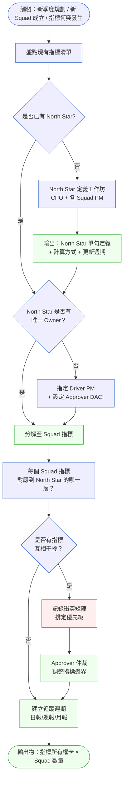
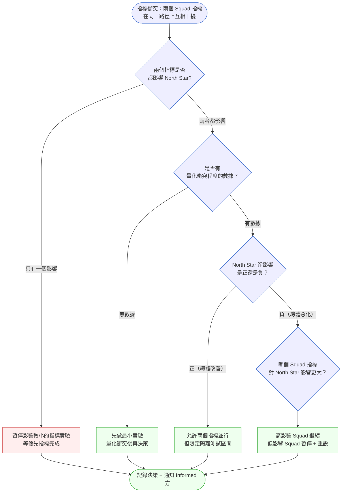
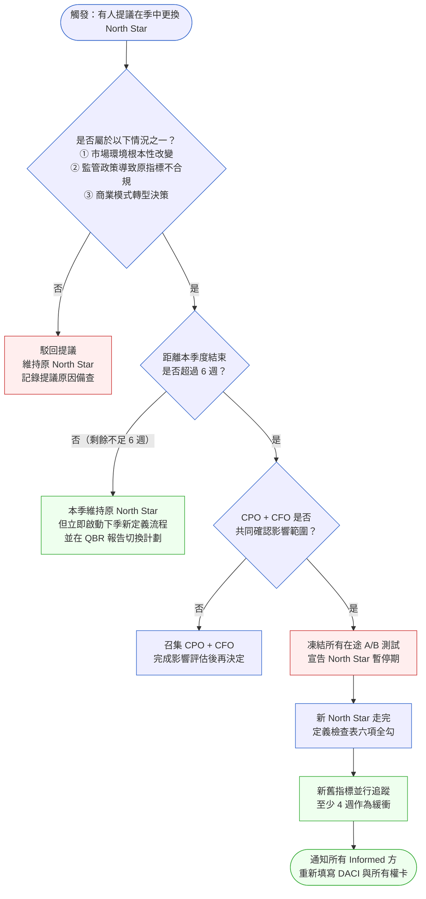

# 第 26 章 | PM × Data：指標的定義與所有權

> **前置閱讀**：[Ch 25 — PM × QA：驗收合約不是最後一關](./ch-25-pm-qa.md)
> **下游章節**：[Ch 27 — Escalation Protocol：衝突升級的觸發條件與路徑](./ch-27-escalation-protocol.md)
> **SA/SD 對照**：[SA/SD 第 29 章 — 可觀測性](../../book/part-05-quality/ch-29-observability-otel.md)
> ⸺ SA 視角關注指標的技術採集與 SLO 達標；本章關注指標的業務定義、所有權歸屬與跨團隊衝突解決。

---

## §26.1 冷觀察

BrightCart 的 Q4 週報發出去那天，所有人的臉色都很好看。

成長團隊的 MAU（月活躍使用者數，Monthly Active Users）從 280 萬漲到 320 萬，達成率 107%。商業化團隊的 GMV per user（每使用者商品交易總額，Gross Merchandise Value per user）從 $218 漲到 $241，OKR 綠燈。物流體驗團隊的 NPS（淨推薦值，Net Promoter Score）從 42 分漲到 57 分，超標整整 15 分。四份週報，四組綠色箭頭，在 Notion 上並排放著，看起來像一幅電商版的凱旋圖。

副總裁 Diana 在週報下面留了一個問號：

> 「為什麼 checkout 轉換率從九月的 3.8% 掉到 3.1%？」

留言串底下安靜了一整天。成長 PM 回了一句「應該是季節性波動」，沒有人附議，也沒有人反駁。隔週的週報照常發出，數字繼續漲，那個問號停在原地，被新的綠色箭頭一層層蓋過去。沒有人覺得它是自己的事——因為 checkout 轉換率不在任何一個團隊的 OKR 上。

六週之後，Q4 旺季結束了，checkout 轉換率收在 2.9%。換算下來，大概少了一億兩千萬的年化 GMV。Diana 召集四個 PM、兩個工程 leads、一個資料分析師開事後檢討。會議室從早上十點坐到下午兩點，白板上畫滿了箭頭和問號，沒有人說得清楚，轉換率究竟掉在哪個節點、因為哪一個改動。每個人手上都有一份自己團隊的 dashboard，每一份都是綠的。

分析師調出 A/B 測試紀錄，畫面一拉開，會議室安靜了。九到十一月間，四個 Squad 並行跑了 17 個實驗，其中三個實驗在同一個 checkout 路徑上修改流程：成長團隊在首頁加了一個會員入口彈窗（目的是提升 MAU 登入率）；商業化團隊在購物車頁插入加購推薦模組（目的是提升 GMV per user）；物流團隊修改了退款確認流程（目的是降低 NPS 中的「退款太麻煩」投訴）。

三個改動，都上線了。三個 OKR，都達成了。結帳路徑多了兩個必須點擊的中介畫面，轉換率安靜地掉了。

「所以是誰負責 checkout 轉換率？」Diana 問。會議室沒有人舉手。四個 PM 互相看了一眼——它橫跨四個團隊，所以它不屬於任何一個團隊。

沒有人有責任。也沒有人發現。

這不是工程問題，也不是 A/B 測試流程問題。這是指標的所有權問題。

---

## §26.2 真問題

### 表面需求（What）

BrightCart 的問題看起來像「指標之間沒有對齊」——成長、商業化、物流各做各的，缺少一個橫向協調機制。

直觀的解法：設立一個跨團隊的指標委員會、建立 A/B 測試審批流程、要求每個實驗上線前提報衝突影響。

這個解法會有效果，但治的是表面。它增加了流程，卻沒有回答「最終誰為業務結果負責」這個問題。多開一個委員會，只是把「沒有人負責」變成「一群人共同不負責」。

### 業務目標（Why）

把它拆開來看。BrightCart 的四個 Squad 各自追自己的 KPI，這本身不是設計上的錯誤——Product Squad 制度的核心邏輯就是讓每個團隊對一個指標負責、有自主性地推動改進。問題不在「各自追指標」，問題在：**這四個指標，哪一個代表公司在賺錢？**

MAU 代表平台被多少人進來。GMV per user 代表每個人花多少錢。NPS 代表體驗好不好。三個指標都有意義，但沒有一個能單獨回答「BrightCart 作為一個電商平台，本季度業務是在變好還是變壞？」

把痛點講白了——**使用者的痛點與商業指標的痛點，是同一件事被切成了三份**：

- **使用者痛點**：想買東西的人（JTBD：「讓我順利完成這筆購買，別讓我分心」），在結帳路徑上被一個會員彈窗、一個加購推薦、一個改版的退款說明連續攔截三次。每多一個中介畫面，就有一批人關掉視窗離開。使用者要的是「把東西買完」，平台給的是「先看完三段別的東西」。
- **商業指標痛點**：這個被卡住的使用者行為，對應的商業指標就是 checkout 轉換率。轉換率每掉 0.1%，月估算 GMV 少 $180 萬。使用者「買不完」的挫折，直接等於公司「收不到」的營收。

成長團隊優化的是「進來的人變多」，商業化團隊優化的是「進來的人買貴一點」，物流團隊優化的是「買完的人別抱怨」。三個團隊都在優化使用者旅程的一段，卻沒有一個團隊對「使用者能不能順利走完整段、最後完成付款」這件事負責——而那一段，恰恰是公司真正收錢的地方。

這就是 **Outputs / Outcomes / Impact**（產出層次／行為改變層次／業務影響層次）的混淆點：

| 層次 | BrightCart 的現況 | 真正在量什麼 |
|---|---|---|
| **Outputs** | 17 個 A/B 實驗、三套 dashboard 更新 | 我們做了多少事 |
| **Outcomes** | MAU ↑、GMV per user ↑、NPS ↑ | 各自的使用者行為改變 |
| **Impact** | Checkout 轉換率 ↓、年化 GMV 少 1.2 億 | 業務是否真的在成長 |

每個 Squad 都在認真優化 Outcomes，但沒有人擁有 Impact 層的指標。checkout 轉換率是 Impact 指標，它橫跨四個 Squad 的職責邊界，沒有人負責追蹤，也沒有人有責任在它下滑時發出警報。更危險的是：三個 Outcomes 同時上升，反而成了「業務一片大好」的假象，把 Impact 的下滑掩蓋得更徹底。Outcomes 漲得越漂亮，Impact 的下滑越沒有人想去看。

### 三層指標結構：North Star、Guard Rails、Diagnostics

光有 North Star 還不夠——它只告訴你方向，不告訴你邊界在哪。完整的指標體系需要三個層次並行：

| 層次 | 定義 | BrightCart 範例 | 責任方 |
|---|---|---|---|
| **North Star（北極星）** | 代表業務核心健康的單一 Impact 指標 | 季度 GMV | CPO Approver + Driver PM |
| **Guard Rails（護欄指標）** | 優化 North Star 時「不可犧牲」的底線指標——若跌破就必須暫停 | 結帳轉換率 ≥ 3.2%、退款率 ≤ 5%、NPS ≥ 40 | 各 Squad PM 各自負責自己的護欄 |
| **Diagnostics（診斷指標）** | 隊內用於診斷問題來源的細粒度指標，不對外比較 | 加購彈窗曝光率、退款確認點擊率 | Squad 內部，工程師或 DA |

**護欄指標的操作原則**：

護欄的數值門檻不是拍腦袋決定的——它來自歷史基準與可接受的退化容忍度。第一步：找出指標在最近一個穩定期的基準值；以 BrightCart 為例，Q3 的結帳轉換率穩定落在 3.8%，這就是基準。第二步：套用退化容忍度——業界慣用 10–15% 的相對降幅作為「警告門檻」，20–25% 作為「緊急停損門檻」；3.8% × 0.85 ≈ 3.2% 即警告下限，3.8% × 0.75 ≈ 2.9% 即緊急下限，這便是表格中 3.2% 的由來，而非憑感覺選的整數。第三步：確認門檻高於業務可行底線——若轉換率跌至 2.9% 已會對 GMV 造成可量化的實質損失，代表緊急門檻設置合理。最後，門檻必須在指標健康時設定，而非在下滑後補救性追加；等指標已跌才訂門檻，等同在火災現場才畫逃生路線。

- 設定數值門檻，不是方向目標。「轉換率越高越好」是 North Star 的語言；「轉換率不得低於 3.2%」是護欄的語言。
- 護欄被觸破，任何在該路徑上的 A/B 測試都應立即暫停，不需等 Approver 判斷——這是護欄與 North Star 的關鍵差異：North Star 需要仲裁，護欄是自動阻斷。
- 每個 Squad 在提交實驗計劃時，必須聲明「此實驗不會使哪些護欄指標低於門檻」；若無法保證，進入衝突評審。

### 決策瓶頸（Who × When）

BrightCart 的實際問題，是一個 **North Star Metric（北極星指標，即代表公司核心業務健康狀況的單一量化指標）定義缺席**、加上一個 **指標所有權 DACI（決策責任分工，Driver/Approver/Contributor/Informed）空白** 的組合。

缺席的是兩個決策：

1. **North Star 是什麼？** 這個問題的答案，決定了四個 Squad 在方向衝突時誰讓步。它必須在 Q4 規劃開始之前由 CPO（最終拍板者 Approver）確認，不能在週報出問題之後再追討。決策的「時機」本身就是關鍵：North Star 在規劃前定義，是治理；在事故後定義，是檢討。

2. **Impact 指標誰擁有？** checkout 轉換率不屬於任何一個 Squad 的 OKR，所以它下滑時沒有人的績效受影響，自然沒有人有動力盯著它。這個「誰的 job 是盯 Impact 指標」的問題，是 **DACI**（Driver／Approver／Contributor／Informed 四角色決策責任框架）裡的 Driver 缺失。沒有 Driver，警報就沒有收件人；沒有 Approver，衝突就沒有仲裁者。

> §26.2 的收束：BrightCart 原本想改善的是 Outcomes（各 Squad 指標），但從未有人明確定義要改善的是哪個 Impact（業務指標）。每個人量的都是自己的 Outcomes，沒有人量 Impact——這才是轉換率沉默下滑六週、無人發現的根本原因。

---

## §26.3 決策框架

### 圖 A — 指標定義工作流程



圖 A 是一條「從上到下定義」的流程：先確認 North Star，再往下分解到各 Squad，最後落到追蹤週期。North Star 定義是整條鏈的起點，不是裝飾品。跳過這一步直接分解 Squad 指標，等於在沒有地基的地方蓋樓——每個 Squad 都蓋得很認真，但沒有人知道樓最後是否站得住。讀這張圖時，注意每一個菱形判斷點都是一次「誰來回答」的問題：是否有 North Star，是 CPO 回答；是否有唯一 Owner，是 DACI 回答；是否互相干擾，是衝突矩陣回答。流程圖的價值不在於告訴你「該做什麼」，而在於逼你在每個分岔點指認出負責回答的人。

### 圖 B — 指標衝突決策樹



圖 A 處理的是「平時怎麼建立指標體系」，圖 B 處理的是「衝突已經發生時怎麼拍板」——前者是治理流程，後者是仲裁決策樹，兩張圖的進入時機不同。衝突不等於要停下來——但要有人拍板。決策樹的價值在於讓「誰拍板」和「用什麼數據拍板」在衝突發生之前就說清楚。

### 圖 C — North Star 季中變更決策樹

North Star 不應該輕易在季中更換，但市場驟變或重大策略轉向確實可能讓原有定義失效。以下是判斷「能不能換」的決策樹：



**BrightCart 的現實案例**：假設 Q4 中途市場出現競爭對手大規模補貼，BrightCart 管理層決定從「GMV 成長」轉為「使用者留存（30 日回購率）」以應對流量被搶。這個轉換不是不可以做，但若只剩 4 週就季末，最好的選擇是本季先把 GMV 做完、同步設計新 North Star，讓 Q1 一開始就用新定義——而不是在最後幾週讓所有 Squad 重新校正方向，製造比原問題更大的混亂。

### DACI：指標所有權分工表

每一個 Impact 層指標，都需要一個完整的 DACI 設定。以 BrightCart 的 checkout 轉換率為例：

| DACI 角色 | 全稱 | 指派對象 | 具體責任 |
|---|---|---|---|
| **D** Driver | 推動決策 | 成長 Squad PM（主路徑負責人） | 每週一彙整轉換率數據；在下滑超過 0.3% 時發起衝突評審 |
| **A** Approver | 最終拍板 | CPO | 批准 A/B 測試結果、核准指標邊界調整 |
| **C** Contributor | 提供輸入 | 商業化 PM、物流 PM、資料分析師 | 在 Driver 發起衝突評審時提供影響評估 |
| **I** Informed | 被通知結果 | 工程 leads、設計 leads | 在指標邊界更動後同步，用於調整各自追蹤設定 |

DACI 的填法沒有唯一正解，但有一個判斷原則：Driver 是「會因為這個指標睡不著的人」，Approver 是「能停掉別人實驗的人」。如果你發現 Driver 沒有授權停實驗，那這張 DACI 就是空的。

**DACI 設定的常見空白**：

- Approver 寫「待確認」：等於沒有 Approver，等於衝突時沒有仲裁者。
- Driver 是「資料分析師」：資料分析師提供數據，不負責推動決策，把他們放在 D 位是誤用。
- Informed 裡面放了工程師的直屬主管：資訊觸達太慢，等通知到主管再往下，決策早就延誤。

**當 Squad PM 拒絕接受 Approver 決議時**：若 Driver 或某 Squad PM 認為 Approver 的仲裁結果不公平（例如自己的實驗被暫停，但對方指標衝突證據同樣不充分），升級路徑如下：

1. Driver 在 48 小時內以書面形式向 Approver 提出異議，附上量化反駁數據。
2. Approver 有 24 小時給出書面回覆（不能只說「維持決定」，必須回應異議中的數據）。
3. 若仍有爭議，升級至 CPO（若 Approver 本身就是 CPO，則升級至 CEO + CFO 組成的緊急仲裁）。
4. 升級不得超過兩層，且在升級期間原實驗保持暫停狀態。
5. 全程記錄在 `docs/metrics/conflict-log.md`，作為下次 QBR 的回顧素材。

政治阻力是真實的——有 Squad PM 會說「Approver 偏心對方」，有人會繞過 Driver 直接跟高層談。升級路徑的價值不在消除政治，而在讓政治有個可查的軌跡，讓以後的決策不被遺忘的情緒左右。

### 北極星定義檢查表（North Star Definition Checklist）

DACI 解決「誰擁有指標」，但前提是 North Star 本身已經被定義清楚。多數失敗發生在更前面一步：North Star 的「定義」根本不及格，於是無論交給誰擁有都無濟於事。用下面這張檢查表，在 North Star 工作坊散會之前逐項過一遍，全部打勾才算定義完成：

| 檢查項 | 通過標準 | 不通過的典型寫法 |
|---|---|---|
| **唯一性** | 只有一個 North Star，沒有「以及／同時」 | 「MAU 以及 GMV」 |
| **可計算** | 寫得出分子/分母的計算公式 | 「使用者活躍度」（無公式） |
| **方向明確** | 越大越好或越小越好，二選一 | 「平衡的成長」 |
| **時間粒度** | 註明衡量區間（每日/每週/季度） | 「持續成長」（無區間） |
| **唯一 Approver** | 點名到一個人，非「Leadership」 | 「管理層共同負責」 |
| **可被某個 Squad 行為影響** | 至少一個 Squad 的工作能撥動它 | 「股價」（不可被產品行為直接影響） |

**填好範例（BrightCart）**：

```
North Star：季度 GMV（Gross Merchandise Value）
- 唯一性：[x] 唯一指標
- 計算公式：季度內所有完成支付訂單的商品金額總和（含稅前，不含運費）
- 方向：越大越好
- 時間粒度：季度（每日 T+1 更新趨勢，季度結算）
- Approver：CPO（Marcus Lin）
- 可影響性：成長 Squad（流量）、商業化 Squad（客單價）、
            checkout 路徑（轉換率）皆可撥動
```

**工作坊建議安排同步 Peer Review**：North Star 定義完成後，由一個「不在場的 PM」（可以是另一個產品線的 PM，或下一週第一個使用這張定義的工程師）在 30 分鐘內嘗試用定義計算出昨日數字。如果他算不出來，代表定義不完整，退回修改。這個機制比再開一次審查會更快發現漏洞。

這張檢查表的用途，是在工作坊現場就攔下「兩個都很重要」的妥協。只要有任何一項打不了勾，North Star 就還沒定義完成，後面所有的 DACI、警戒門檻、衝突仲裁都是建在流沙上。

### 決策表：情境 × 推薦做法

| 情境 / 觸發條件 | 推薦做法 | PM 關注點 | 常見錯誤 |
|---|---|---|---|
| 新季度開始，North Star 未明確定義 | 辦 North Star 定義工作坊，限時 90 分鐘，產出唯一指標定義 + 計算方法 | CPO 是否在場並拍板；禁止「這個指標很重要但我們也要看那個」式妥協 | 工作坊結束後 North Star 有兩個候選，沒有人被拍板 |
| 兩個 Squad A/B 測試在同一路徑上衝突 | 啟動衝突矩陣評審，48 小時內由 Approver 決定優先排序 | 量化衝突程度（用已有實驗數據推估），避免純靠主觀判斷 | 兩個實驗都繼續跑，理由是「數據量還不夠，先看看」 |
| 某個 Squad 指標持續上升，但 North Star 下滑 | 暫停該 Squad 指標的相關實驗，追查是否有負外部性 | 區分「因果」與「相關」；指標上升不等於對 North Star 有正貢獻 | 把 Squad 指標上升當成「證明方向正確」的理由，忽略 North Star 趨勢 |
| Impact 指標（如轉換率）下滑，無人發現 | 設立 Impact 指標自動警報，下滑超過門檻時自動通知 Driver | 門檻設定（% 或絕對值）需要先定義，不能等事故後再追討 | 所有 dashboard 都在看 Outcomes，沒有一個在看 Impact |
| 季度末，各 Squad 指標全綠但業務目標未達成 | 召開指標回顧，追查 Outputs→Outcomes→Impact 之間哪一層斷鏈 | 重點在找「斷鏈位置」，不是責怪哪個 Squad | 週報繼續發，QBR 上用「市場環境」解釋結果，不追查內部原因 |
| 新 Squad 成立，要求認領一個新指標 | 先確認新指標掛在 North Star 的哪一層，再決定是否需要新 DACI | 新指標是否與既有指標在同一路徑衝突；是否製造新的 Impact 盲區 | 新 Squad 自選一個漂亮指標，與 North Star 無對應關係，變成第二個孤島 |
| 指標定義要修改（換計算口徑） | 凍結舊定義數據，標記變更時點，新舊口徑並行至少一個週期 | 變更必須通知所有 Informed 方，避免趨勢圖出現「無法解釋的斷層」 | 直接改口徑不留記錄，事後沒有人能解釋指標為何在某天跳變 |

### 決策矩陣：指標健康度評分

在季度規劃前，用以下評分矩陣快速判斷指標體系的健康狀況：

| 檢查項目 | Yes = 1 分 | No = 0 分 |
|---|---|---|
| North Star 有唯一文字定義（一句話，無「以及」） | 1 | 0 |
| North Star 有唯一 Approver（非「Leadership Team」） | 1 | 0 |
| 每個 Impact 指標有指定 Driver | 1 | 0 |
| 護欄指標已設定數值門檻（非方向目標） | 1 | 0 |
| A/B 測試在同一路徑的衝突有明確仲裁 SLA（如 48 小時） | 1 | 0 |
| Impact 指標有自動警報（不需手動查） | 1 | 0 |
| 各 Squad 指標能追溯到 North Star 的哪一層 | 1 | 0 |

### If-Then 框架：指標體系優先順序

根據上方評分結果，決定下一步行動：

- **If** 得分 ≥ 6 → **Then** 指標體系已具備基本防護，季度規劃可以推進
- **If** 得分 4–5 → **Then** 補齊所有權空白後再跑，Q4 旺季或多 Squad 並行實驗時風險顯著
- **If** 得分 ≤ 3 → **Then** 優先執行 North Star 工作坊，其他規劃動作暫緩

---

## §26.4 踩坑清單

**反模式：North Star 委員會決議**

現象：季度初開了一個跨 Squad 的「指標對齊會議」，花了兩小時，最後在 Confluence 上記了四個「都很重要的北極星指標」，每個 Squad 繼續追自己原本在追的東西。

根因：North Star 本質上是一個排他性選擇——它的意義在於，當兩個指標方向衝突時，它告訴你誰讓步。一旦 North Star 有兩個，它就失去了這個功能，變成裝飾性的戰略文件。

> 修正方向：North Star 工作坊結束時，只帶走一個指標定義。如果 CPO 說「兩個都要」，可以把其中一個降為「護欄指標（guard rail metric）」，明確區分主從關係，再散會。

---

**反模式：資料分析師是 Owner**

現象：「我們有數據，所以指標交給資料分析師管」。分析師每週出一份報告，PM 看到數字再決定要不要行動。

根因：資料分析師的職責是提供分析視角，不是推動決策。把 Driver 角色給分析師，等於把「什麼時候需要行動」的判斷交給了一個沒有決策授權的人。指標下滑時，分析師能做的只有出報告，不能停掉實驗、不能召集衝突評審。

> 修正方向：Driver 必須是有決策授權的 PM。資料分析師是 DACI 裡的 Contributor，負責在 Driver 發起評審時提供數據支持，而不是等待被詢問時才發言。

---

**反模式：Outcomes 指標漲了，Impact 指標被忽略**

現象：週報上每個 Squad 的 Outcomes 都在漲，沒有人看 Impact 指標，直到季度末 QBR 才被高層追問業務目標。

根因：Outcomes 指標通常是每個 Squad 的 OKR，影響績效評核，所以自然被盯得很緊。Impact 指標（如 checkout 轉換率、整體 GMV growth）橫跨多個 Squad，不屬於任何單一的績效考核系統，容易落入「重要但沒人負責」的地帶。

> 修正方向：把至少一個 Impact 指標放進 PM 自己的 OKR，讓它「有人的績效跟它掛鉤」。不需要把所有 Impact 指標都進 OKR，但至少 North Star 對應的核心 Impact 指標，Driver PM 必須自己承擔。

---

**反模式：追蹤週期不一致，比較無意義**

現象：成長 Squad 看日報，商業化 Squad 看月報，物流 Squad 看 Sprint 週報。季度末要橫向比較時，沒有任何一個時間維度是對齊的。

根因：各 Squad 根據自己的習慣或歷史設定追蹤週期，沒有在指標定義時同時定義「更新頻率」與「回顧週期」。

> 修正方向：在指標所有權卡的建立階段，明確填寫「更新頻率（每日/每週/每月）」和「回顧週期（週報/月報/QBR）」兩欄，並讓跨 Squad 的 Impact 指標統一到相同頻率，方便橫向比較時有共同基準。

---

**反模式：A/B 測試沒有衝突審查，各跑各的**

現象：Sprint review 結束，PM 說「這個實驗明天 launch」，沒有人問「同一路徑上有沒有其他實驗正在跑」。

根因：A/B 測試的排程通常由各 Squad 自行管理，缺乏橫向的衝突審查機制。多個實驗同時跑在相同的使用者路徑上，會讓實驗結果交叉污染（一個實驗的提升可能來自另一個實驗的效應，或者互相壓制）。

> 修正方向：建立一個輕量的「實驗地圖（experiment registry，實驗登記簿）」，每個 Sprint 開始時 Driver PM 查一次目前有哪些實驗在同一個路徑段落上跑。超過兩個實驗在同一路徑的情況，進入衝突評審流程，由 Approver 排定優先順序。

---

**反模式：指標更動沒通知跨團隊**

現象：商業化 Squad 為了讓數字「更準」，把 GMV per user 的計算口徑從「含退款」改成「不含退款」，自己團隊內部知道，其他三個團隊不知道。一個月後橫向比較時，趨勢圖上多了一個無法解釋的跳變，事後檢討花了半天才查出是口徑變更。

根因：指標定義被當成「各團隊內部的事」，沒有把「修改定義」納入需要走 Informed 通知的決策。

> 修正方向：把「指標定義變更」明確列為需要通知所有 Informed 方的事件。變更時凍結舊口徑、標記變更時點、新舊口徑並行至少一個回顧週期。

---

**反模式：Dashboard 數字和指標定義不一致**

現象：Driver PM 每週看 dashboard，checkout 轉換率顯示 3.6%，感覺健康。但分析師調查時發現 dashboard 的公式抓的是「加入購物車後的付款率」而非「進入 checkout 頁面後的付款率」——兩個分母不同，導致數字虛高 0.5 個百分點，且這個差異已存在三個月無人察覺。

根因：指標定義文件裡寫的是一套公式，dashboard 工程師當時實作的是另一套公式，兩者從未被人比對過。

診斷方法：每季度第一週，Driver PM 手動用指標定義文件裡的公式計算一次上週的原始數字，與 dashboard 顯示值比對。誤差超過 2%，即標記為「待驗證」並發起一次數據稽核（data audit）。

> 修正方向：在指標所有權卡新增「驗證記錄」欄，記載上次手動核對日期與結果。稽核週期建議每季一次；若 dashboard 有改版，稽核提前觸發。指標數字的正確性不能只靠「沒人反映問題」來保證。

---

**反模式：過度本地化的指標，無法橫向比較**

現象：每個 Squad 都發明了一套只有自己看得懂的「健康分數」——成長團隊的「活躍健康度」、商業化團隊的「變現指數」、物流團隊的「滿意係數」。每個分數內部都很自洽，但季度回顧時，高層想問「哪個團隊對業務貢獻最大」，沒有任何兩個分數能放在同一張圖上比較。

根因：本地化指標讓單一團隊優化起來方便，卻犧牲了跨團隊的可比性。

> 修正方向：允許 Squad 保留內部診斷用的本地指標，但要求每個 Squad 至少有一個「可橫向比較的標準指標」直接掛在 North Star 之下，並用統一口徑計算。本地指標用於團隊內部調優，標準指標用於跨團隊對話——兩者分開，但標準指標不可缺。

---

## §26.5 交付清單 ⸺ 一頁式指標所有權卡

- **指標所有權卡（Metric Ownership Card）**：每個 Impact 指標一張，定義「是什麼、誰負責、什麼狀況行動」。
- **北極星定義檢查表（North Star Definition Checklist）**：工作坊散會前逐項確認 North Star 定義是否及格（見 §26.3）。
- **衝突矩陣（Conflict Matrix）**：列出同一路徑上互相干擾的指標，供 Approver 仲裁排序。
- **數據品質稽核記錄（Data Quality Audit Log）**：每季一次，確認 dashboard 數字與指標定義公式一致。

每個 Impact 指標對應一張所有權卡，目的是讓任何新加入的 PM 在 30 分鐘內看完就能理解：這個指標是什麼、誰負責、什麼狀況下要行動。把它存在 `docs/metrics/` 下，跟程式碼同 repo，跟 README 同層。

````markdown
### 指標所有權卡（Metric Ownership Card）— 每個 Impact 指標一張
> 版本:v0.1 | 撰寫日期:YYYY-MM-DD | 擁有人:{名字}

### 指標基本資訊
- 指標名稱：{指標中文名稱}（{英文名稱}）
- 所屬層次：[ ] Outputs  [ ] Outcomes  [ ] Impact
- 使用者工作描述（JTBD）：{一句話，說明使用者在完成什麼任務時產生這個指標}
- 指標定義：{一句話，含計算方式，禁止「增加」「改善」等模糊動詞}
- 計算公式：{分子}/{分母} × {倍率}
- 數據來源：{資料表/系統名稱}
- 更新頻率：{每日 / 每週 / 每月}
- 回顧週期：{週報 / 月報 / QBR}

### 所有權 DACI
- Driver（推動行動）：{PM 姓名} — {觸發條件：下滑超過 X% 時需發起評審}
- Approver（最終拍板）：{姓名 + 職稱}
- Contributor（提供輸入）：{角色列表}
- Informed（被通知）：{角色列表}

### 警戒門檻
- 正常範圍：{下限} ～ {上限}
- 警告門檻：低於 {值} 或高於 {值}（需通知 Driver）
- 緊急門檻：低於 {值}（需通知 Approver + 暫停相關實驗）

### 護欄指標連動
- 此指標為護欄指標：[ ] 是  [ ] 否
- 若是護欄指標，跌破門檻時自動暫停的實驗範圍：{描述}

### 與 North Star 的關係
- 對 North Star 的貢獻方向：{正相關 / 負相關 / 間接影響}
- 量化貢獻估算：{例：轉換率每 +0.1%，GMV 月估算 +$180 萬}
- 已知衝突指標：{列出可能互相干擾的其他指標}

### 數據品質驗證
- 上次手動稽核日期：{YYYY-MM-DD}
- 稽核結果：{通過 / 發現差異（描述）}
- Dashboard 公式最後確認日期：{YYYY-MM-DD}
- 驗證方法：{說明如何手動計算以比對 dashboard 值}
````

這張卡的設計意圖是讓一個新加入的 PM 在 30 分鐘內看完，就能理解：這個指標是什麼、誰負責、什麼狀況下要行動。填寫時最容易卡關的是「計算公式」欄——如果填不出公式，代表這個指標還沒定義清楚，不適合放進 OKR。

### §26.5.1 範例：BrightCart Checkout 轉換率所有權卡

BrightCart 事故後補建的第一張所有權卡，是那個沉默下滑六週、沒有任何人盯著的 checkout 轉換率。

````markdown
### 指標所有權卡 — BrightCart Checkout 轉換率
> 版本:v0.1 | 撰寫日期:2026-02-15 | 擁有人:Fiona Chen（成長 Squad PM）

### 指標基本資訊
<!-- 為什麼這欄：計算公式寫清楚才能確認分子/分母，避免「轉換率」被三個 Squad 各自計算出不同的數字。 -->
- 指標名稱：Checkout 轉換率（Checkout Conversion Rate）
- 所屬層次：[x] Impact
- 使用者工作描述（JTBD）：使用者想要「順利完成這筆購買、不被中途打斷」。Checkout 轉換率衡量平台有沒有讓他們成功完成這件事。
- 指標定義：進入 checkout 頁面的 session 中，成功完成支付的比例
- 計算公式：支付完成 session 數 / 進入 checkout 頁面的 session 數 × 100%
- 數據來源：analytics.events（event_type = 'checkout_start' / 'payment_success'）
- 更新頻率：每日（T+1 更新）
- 回顧週期：週報 + QBR

### 所有權 DACI
<!-- 為什麼這欄：Driver 必須是有授權的 PM，不是分析師；Approver 必須點名到人，不能是「Leadership」。 -->
- Driver：成長 Squad PM（Fiona Chen） — 單日下滑超過 0.3% 時，48 小時內發起衝突評審
- Approver：CPO（Marcus Lin）
- Contributor：商業化 PM（Roy Wu）、物流 PM（Tina Hsu）、資料分析師（Ada Liang）
- Informed：工程 Lead（各 Squad）、Design Lead（成長 Squad）

### 警戒門檻
<!-- 為什麼這欄：門檻要在指標健康時定義，在下滑時才定門檻等於讓 Driver 自行判斷「這次算不算嚴重」。 -->
- 正常範圍：3.5% ～ 4.2%
- 警告門檻：低於 3.3%（Fiona 通知 Roy / Tina + Ada，24 小時內提供診斷）
- 緊急門檻：低於 3.0%（通知 Marcus + 暫停 checkout 路徑上所有 A/B 測試）

### 護欄指標連動
- 此指標為護欄指標：[x] 是
- 跌破 3.0% 時，以下實驗自動暫停，不需 Approver 再審：所有在 checkout 路徑（cart → payment_success）上進行的 A/B 測試

### 與 North Star 的關係
<!-- 為什麼這欄：寫清楚衝突指標，下次有人要在 checkout 路徑上跑實驗時，這張卡就是觸發衝突評審的依據。 -->
- North Star：季度 GMV（Gross Merchandise Value）
- 對 North Star 的貢獻方向：直接正相關
- 量化貢獻估算：轉換率每 +0.1%，月估算 GMV +$180 萬
- 已知衝突指標：
  - MAU（成長 Squad）：入口彈窗可能提升 MAU 但增加 checkout 摩擦
  - GMV per user（商業化 Squad）：加購推薦可能提升客單價但增加放棄率
  若以上指標實驗上線前未通知 Fiona，列為衝突評審觸發條件

### 數據品質驗證
- 上次手動稽核日期：2026-02-15
- 稽核結果：發現差異 — dashboard 公式原本分母為「加入購物車的 session 數」，與定義不符；已修正為「進入 checkout 頁面的 session 數」，實際值從顯示 4.1% 修正為真實 3.6%
- Dashboard 公式最後確認日期：2026-02-15（修正後）
- 驗證方法：從 analytics.events 取 checkout_start 與 payment_success 事件，手動計算比值，與 dashboard 值比對；誤差超過 2% 即觸發稽核
````

這張卡在事故後補建，花了一個下午。數據品質稽核那欄，還額外發現了一個長達三個月的計算口徑錯誤——dashboard 顯示 4.1%，實際轉換率只有 3.6%。如果它在 Q4 開始前就存在，checkout 轉換率的第一次下滑會在第 3 天被 Fiona 發現，而不是第 42 天被 Diana 的問號揭露。補卡的成本是一個下午；缺卡的成本是一億兩千萬。

---

## §26.6 Recap

讀完本章，應該已經能做到：

- [ ] 區分 Outputs / Outcomes / Impact 三個層次，並指出目前指標體系量的是哪一層
- [ ] 區分 North Star、Guard Rails、Diagnostics 三層指標，為每層設定對應責任方與操作門檻
- [ ] 主持 North Star 工作坊，用定義檢查表輸出唯一定義（含計算公式與 Approver 姓名），並安排 Peer Review
- [ ] 判斷季中是否需要更換 North Star，並依決策樹決定時機與流程
- [ ] 為每個 Impact 指標填寫所有權卡（DACI + 警戒門檻 + 與 North Star 的關係 + 數據品質驗證）
- [ ] 識別 A/B 測試路徑衝突，發起衝突矩陣評審並取得 Approver 決議；在政治阻力下使用升級路徑
- [ ] 用指標健康度評分矩陣，在季度規劃前快速定位所有權空白

指標的問題從來不是數量太少，而是所有權不清。回到 BrightCart 那個沒人回答的問號——它沉默了六週，不是因為沒有人有能力回答，而是因為沒有人有責任回答。一旦每個 Impact 指標都有一個願意承擔的 Driver、一個敢於拍板的 Approver、和一個有人在看的警戒門檻，多 Squad 並行的混亂就會變成可管理的協作。填好那張所有權卡，比再開一個對齊會議有用。

---

## Cross-References

- **前章**：[Ch 25 — PM × QA：驗收合約不是最後一關](./ch-25-pm-qa.md) ⸺ 從技術優先順序協商進入指標定義與所有權
- **下一章**：[Ch 27 — Escalation Protocol：衝突升級的觸發條件與路徑](./ch-27-escalation-protocol.md) ⸺ 指標定義後，如何向高層呈現與捍衛
- **SA/SD 強連結**：[SA/SD 第 29 章 — 可觀測性](../../book/part-05-quality/ch-29-observability-otel.md) ⸺ SA 關注指標的技術採集（OpenTelemetry、SLO）；本章關注指標的業務定義與所有權政治
- **SA/SD 強連結**：[SA/SD 第 30 章 — SRE、SLO、Chaos Engineering](../../book/part-05-quality/ch-30-sre-slo-chaos.md) ⸺ SLO 定義的工程視角與本章的業務指標視角互補
- **SA/SD 延伸**：[SA/SD 第 4 章 — 需求工程基礎](../../book/part-01-foundations/ch-04-requirements-engineering.md) ⸺ SA 從需求可實作性出發；本章從指標可追蹤性出發，兩者都在問「這個目標是否能被驗證」

<!-- PROPOSED-REFS
cases:
  - id: CASE-ECM-110
    title: "BrightCart — North Star 缺席導致三套衝突指標與Q4 Roadmap 翻車"
    domain: ecommerce
    chapters: [pm-ch-26]
    summary: |
      虛構中型電商平台 BrightCart（月活 320 萬、GMV 7.2 億美元、4 個
      Product Squad），在 2025 Q4 規劃期間出現三套互相矛盾的 North Star
      指標。三個 Squad 各自 OKR 全達成，但 checkout 轉換率連續六週下滑
      未被發現，造成年化 GMV 損失約 1.2 億。用於展示 North Star 缺席與
      指標所有權 DACI 空白如何在多 Squad 並行優化中造成系統性衝突。
glossary:
  - anchor: north-star-metric
    name: North Star Metric（北極星指標）
    body: |
      單一的、能代表公司核心業務健康狀況的量化指標。North Star 的關鍵
      屬性在於排他性：當兩個 Squad 指標方向衝突時，North Star 決定誰讓步。
      一個有效的 North Star 必須有唯一文字定義、唯一計算公式、唯一 Approver。
  - anchor: outputs-outcomes-impact
    name: Outputs / Outcomes / Impact 三角
    body: |
      PM 衡量工作成果的三個層次。Outputs：團隊做了什麼（功能、頁面、程式）；
      Outcomes：使用者行為改變了嗎（轉換率、留存、NPS）；Impact：業務指標
      移動了嗎（營收、GMV、市占）。常見混淆是把 Outputs 的完成當作 Outcomes
      的達成，或把 Outcomes 改善當作 Impact 成長的充分條件。
  - anchor: daci
    name: DACI（決策框架）
    body: |
      Driver / Approver / Contributor / Informed 四角色的決策責任框架。
      Driver 負責推動決策進行（通常是 PM）；Approver 最終拍板（必須指名到人）；
      Contributor 提供輸入（工程師、設計師、法務等）；Informed 被通知結果。
      DACI 的核心價值在於讓「誰負責推動」與「誰有最終決定權」在決策前就說清楚。
  - anchor: guard-rail-metric
    name: Guard Rail Metric（護欄指標）
    body: |
      在優化 North Star 的過程中「不可犧牲」的底線指標。護欄指標以數值門檻
      表達（「不得低於 X」），而非方向目標（「越高越好」）。跌破護欄門檻時，
      相關實驗應自動暫停，不需等 Approver 的指示。護欄指標與 North Star 的
      關鍵差異：North Star 需要仲裁，護欄是自動阻斷機制。
-->
