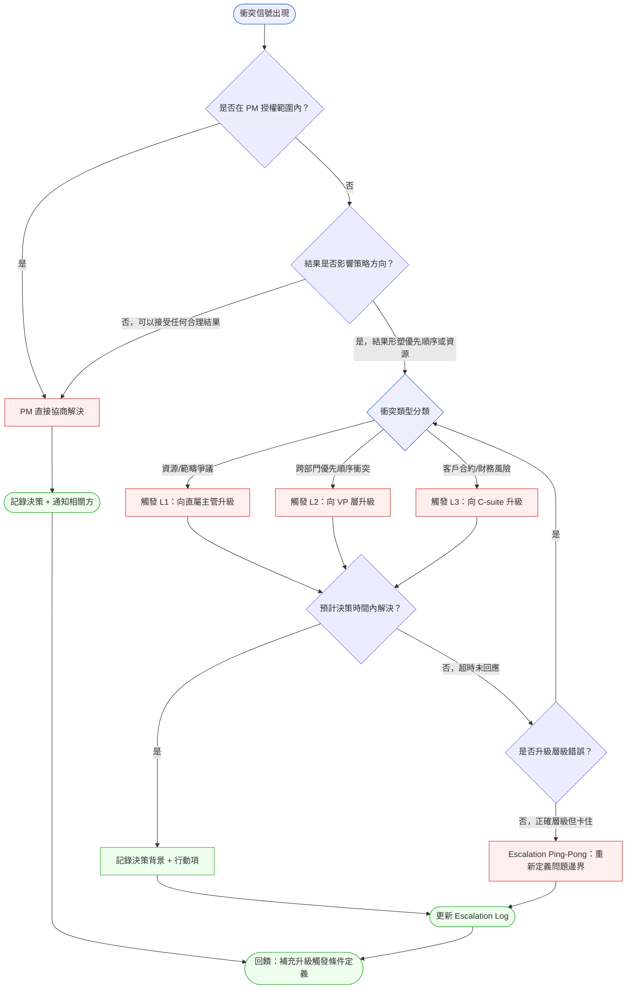
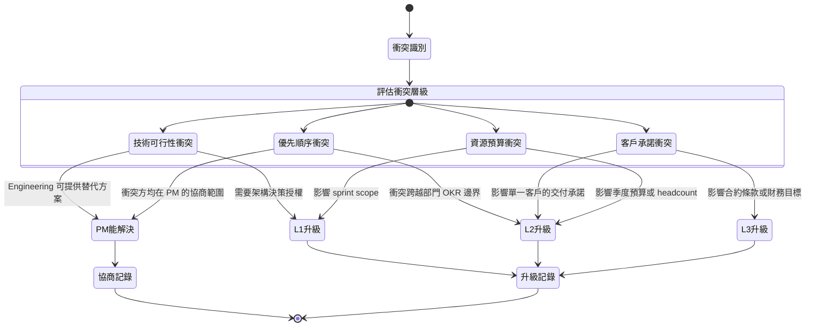

# 第 27 章 | Escalation Protocol：衝突升級的觸發條件與路徑

> **前置閱讀**：[Ch 25　PM × QA：驗收合約不是最後一關](./ch-25-pm-qa.md)
> ⸺ 了解驗收邊界的決策責任後，本章進一步處理當衝突超出 PM 的解決範圍時，該如何升級。
>
> **前置閱讀**：[Ch 26　PM × Data：指標的定義與所有權](./ch-26-pm-data.md)
> ⸺ 指標爭議是衝突升級的常見觸發點之一；本章延伸討論當指標所有權未定時的升級路徑。
>
> **下游章節**：[Ch 28　Executive Communication：向上匯報與 QBR](./ch-28-executive-communication.md)
> ⸺ 升級完成後，如何在 QBR 與高層同步結果；本章的升級記錄是下游匯報的原始材料。
>
> **SA/SD 對照**：[SA/SD 第 36 章｜治理架構 ⸺ 在高彈性系統中控制管理複雜度](../../book/part-06-engineering/ch-36-governance-architecture.md)
> ⸺ SA 視角關注架構層的決策治理與變更控制；本章關注 PM 視角的人際衝突升級，兩者都在處理「誰有權做決定，以什麼流程做」的根本問題。
>
> **SA/SD 對照**：[SA/SD 第 3 章｜專案啟動、可行性研究與利害關係人分析](../../book/part-01-foundations/ch-03-project-initiation.md)
> ⸺ SA 在專案啟動時識別利害關係人層級；本章把這個層級圖轉化為衝突升級時的路徑選擇。

---

## §27.1 冷觀察

季度末的第十一週，Vela 的 PM 收到了一封主旨只有三個字的 Slack 訊息：「這不行。」

發訊息的是 Enterprise Sales 的 Regional Lead。訊息附帶了一份截圖——一個新的權限管理 UI，原定這個 sprint 結束後推給所有 Tier-1 客戶。截圖旁邊他貼了一句話：「客戶說這個改版根本看不懂，他們需要舊版界面。如果這週五推，我沒辦法保這個客戶。」

那個客戶的年費是 24 萬美元。

PM 看了一眼 sprint board。Engineering 已經把這個 feature 標成 Done，QA 昨天 sign off，Design 已經把下一個版本的 mockup 送進了 review queue。整個交付鏈已經運轉了三個 sprint，沒有人在中途提出任何保留。

她打開了 Slack 的搜尋框，試圖找到之前是否有人提過這個 UI 改版會影響 Enterprise 客戶。結果她找到的是——兩個月前，Customer Success 的一位同事發在 #product-feedback 頻道的一條訊息，附帶了一個客戶回饋連結。那條訊息的回覆數是零。

Engineering Lead 看到她在 #eng-general 轉發了 Sales 的截圖後，回了一句：「這在 spec 裡是 approved 的設計，我們不能因為一個 Sales 的反應就 rollback。」

Design Lead 在同一個 thread 跟了一句：「這個 UI 是根據三個月的研究結果設計的，不是亂改的。」

Sales Regional Lead 在 #product 頻道寫道：「我需要今天有個答案。」

PM 的行事曆上，那天下午有一個全公司的 Sprint Review Demo，邀請名單裡有 CTO 和 VP of Sales。

沒有人問她：「你打算怎麼辦？」但所有人都在等她給出一個答案，而且每個人期待的答案都不一樣。

---

## §27.2 真問題

### 表面需求（What）

Vela 的場景表面上是一個上線決策問題：一個 Enterprise 客戶反對 UI 改版，Sales 要求 rollback 或延遲，Engineering 和 Design 有既定立場，PM 夾在中間。大多數 PM 在這個時候的本能反應是召集一個「緊急對齊會議」，把所有人拉進來談。

這個本能不是錯的，但它沒有解決根本問題。

### 業務目標（Why）

把問題往後退一層：這個衝突為什麼會在上線前 72 小時才爆發？

真正的問題不是「UI 設計好不好」或「那個客戶的反應對不對」。真正的問題是：**在整個三個 sprint 的交付週期裡，Enterprise 客戶的聲音沒有進入任何一個決策節點。**

Customer Success 頻道那條零回覆的訊息，就是這個缺口的物理證據。

區分三個層次：
- **Outputs**：Engineering 交付了符合 spec 的 UI，QA 通過了驗收，Design 的研究有據可查。輸出層是完整的。
- **Outcomes**：Enterprise Tier-1 客戶的操作順暢度是否有改善？轉換率、功能使用率、客戶滿意度分數，在推出前沒有人定義過這些指標的基線，更沒有人設計驗證計畫。Outcomes 層是空白的。
- **Impact**：24 萬美元的客戶合約續約率。這個 Impact 指標存在，但沒有人把它連接到這個 UI 改版的決策框架裡。

PM 量的是 Outputs，但她被問責的是 Impact。這中間的 Outcomes 層，沒有人擁有它。

### 決策瓶頸（Who × When）

更深的問題是：當衝突爆發時，**誰有資格做最終決定？這個授權在哪份文件裡寫過？**

Vela 的案例裡，PM 是 Driver——她在推動決策進行。但 Approver 是誰？這個問題沒有人事先定義。當 Approver 不明確，每一個利害關係人都會覺得自己有否決權，每一個否決都需要 PM 去協商，而協商的成本隨著緊迫感的上升而幾何倍增。

這才是升級協議（Escalation Protocol）存在的真正原因：不是為了把問題丟給上級，而是為了**在衝突超出 PM 的解決能力之前，有一條事先議定的路徑**，讓決策在正確的層級、正確的時機被做出。

DACI（決策責任分工框架：Driver 推動者、Approver 拍板者、Contributor 貢獻者、Informed 知會者）在這個場景下的結構是：

| 角色 | 全稱 | Vela 場景中的人 |
|------|------|----------------|
| **D** Driver | 推動決策進行 | PM（本章核心角色） |
| **A** Approver | 最終拍板 | 需要升級才能確認是 VP Product 還是 C-suite |
| **C** Contributor | 提供輸入 | Engineering Lead、Design Lead、Customer Success、Sales Regional Lead |
| **I** Informed | 被通知結果 | CTO、其他 Enterprise 客戶的 CSM |

升級的觸發，不是因為 PM 放棄了解決問題，而是因為 Approver 的層級超出了 PM 的授權範圍。

---

## §27.3 決策框架

### 圖 A — 升級工作流程圖



這張圖描述的不是「哪些問題該升級」，而是**升級的決策節點在哪裡，每個分支的終點是什麼**。最重要的是：每一條路徑都必須以「記錄」結束，不是以「解決」結束——因為解決是結果，記錄才是讓下一次衝突不重蹈覆轍的機制。

注意圖中新增的 `B2` 節點：**「結果是否影響策略方向？」**這是升級的第一個過濾器。如果 PM 能接受任何一個合理的結果，就算協商困難，也不需要升級——困難的協商是 PM 的核心工作，不是升級的理由。只有當結果會形塑產品方向、OKR 優先順序或資源分配時，才需要啟動升級路徑。

### 圖 B — 升級觸發條件決策樹



每個衝突類型都有兩條分支，而不是一條「絕對升級」的判斷。這是刻意設計的：**升級的判斷依據是授權邊界，不是衝突的激烈程度**。Sales 再怎麼憤怒，如果問題在 PM 的協商範圍內，拉進 VP 反而會讓問題變複雜。

### §27.3.1 組織規模的升級路徑差異

L1 / L2 / L3 是抽象的層級標籤。在不同規模的組織裡，這些層級對應的實際角色差異很大。照搬「L2 升至 VP」這種規則，在 10 人新創可能讓 CEO 每天被打擾，在 500 人矩陣組織可能讓問題在多個 VP 之間漂移。

| 衝突情境 | 10 人新創 | 50 人 Scale-up | 500 人矩陣組織 |
|----------|-----------|----------------|----------------|
| Sprint scope 爭議 | PM 與 CTO 直接對話 | PM → Engineering Manager（L1） | PM → Pod Lead（L1） |
| 跨功能優先順序衝突 | PM 與 CEO 同步 | PM → VP Product（L2） | PM → Group PM → VP Product（L2） |
| 客戶合約 / 財務風險 | PM 與 CEO / CFO 對話（L3 = L1，同一人） | PM → CEO（L3） | PM → SVP Sales + VP Product 聯合決策（L3） |
| OKR 跨部門衝突 | 直接在週會討論 | PM → CEO OKR 會議（L2） | PM → Chief of Staff → C-suite OKR Review（L3） |

**新創 PM 的特殊挑戰**：L1 到 L3 可能是同一個人（CEO 兼 CTO）。這種情況下，升級的意義不是「往上走」，而是**把問題從日常對話提升至正式決策記錄**。即使是兩個人之間的升級，也需要填寫 Escalation Log——它的價值不在於路徑，而在於決策可追溯。

**矩陣組織的特殊挑戰**：同一個衝突可能有多個合法的升級路徑（Product VP vs. Engineering VP vs. Business GM）。選擇錯誤的路徑會讓問題反彈，或讓未涉及的 VP 意外介入。建議在季度 Kickoff 時畫出一張「衝突類型 × 升級路徑」的矩陣表，讓所有 Contributor 事先同意誰有最終拍板權。

### §27.3.2 升級速度與成本

升級不是免費的。每一次升級都消耗 PM 的政治資本——對同一個上級而言，第六次升級的可信度會低於第一次。以下是升級決策的速度與成本框架：

| 升級層級 | 典型決策延遲 | 政治資本消耗 | 適合時機 |
|----------|-------------|-------------|---------|
| PM 自行協商 | 0–24 小時 | 最低 | 衝突方均在 PM 的協商範圍 |
| L1（直屬主管） | 24–48 小時 | 低 | Sprint 範疇 / 技術架構 / 單一部門資源 |
| L2（VP 層） | 48–72 小時 | 中 | 跨部門 OKR 衝突 / 單一重要客戶 |
| L3（C-suite） | 72–120 小時 | 高 | 合約風險 / 財務目標 / 公司層級優先順序 |

**升級速度與 Sprint 節奏**：
- 若衝突在 **Sprint 前三天**爆發：有足夠時間走 L1 或 L2 升級路徑，建議立刻啟動
- 若衝突在 **Sprint 最後兩天**爆發：L3 升級決策延遲可能超過 sprint 週期，應提前在 Escalation Log 標記「sprint boundary risk」，並評估是否需要在 Sprint Review 前取得臨時授權
- 若衝突橫跨 **Sprint Review 節點**：在 Sprint Review 當天前完成升級記錄；不要讓 Sprint Review Demo 成為衝突的「首次公開場合」

**升級頻率警示**：若 PM 在單一季度內升級次數超過 3 次，這是一個系統性信號，不是個案問題。可能的根因有三：①PM 的授權範圍與實際工作範疇不符（需要重新定義 scope）；②觸發條件過於寬鬆（PM 把不需要升級的問題也送上去了）；③組織的決策機制本身有缺陷（上級需要了解的問題）。三種根因的解法完全不同——把它帶到和主管的 1:1，不要讓升級頻率成為不言而喻的負面記錄。

### 升級觸發條件決策表

| 情境 | 觸發條件 | 升級層級 | PM 關注點 | 常見錯誤 |
|------|----------|----------|-----------|----------|
| 跨部門優先順序衝突 | 兩個以上部門的 OKR 互斥，PM 無法獨立裁決 | L2：VP 層 | 確保每個部門的立場都有書面記錄再升級 | 在升級前試圖代表某方「解釋」立場，失去中立性 |
| 客戶承諾與內部決策衝突 | 對外承諾的交付日期或功能範疇，與工程評估不符 | L2 → L3 視財務規模 | 升級時帶著「合約條款截圖」而非口頭描述 | 以「客戶很重要」替代具體的財務影響數字 |
| 技術風險被隱瞞 | Engineering 在 sprint 中途發現重大技術瓶頸，未主動同步 | L1：直屬主管 | 關注的是「為什麼這個信息沒有更早浮現」，不是誰的錯 | 把技術風險討論轉化為責任追究會議 |
| 資源競爭（同一工程師被多個 PM 搶） | 同一 sprint 有超過一個 P0 task 指向同一個人 | L1：Engineering Manager | 帶著優先順序建議去升級，而不是空手要答案 | 不升級，等到 deadline 才爆發 |
| 法務 / 合規出現在上線前 | Legal 或 Compliance 在最後階段提出修改要求 | L3：C-suite + Legal | 把影響範圍量化（上線延遲 N 天的成本是多少） | 試圖在沒有法務背景的情況下自行「解決」合規問題 |
| Stakeholder 在決策後反悔 | 已批准的功能範疇，在開發後期被 Stakeholder 要求修改 | L2：VP 層 | 拿出原始批准記錄，確保升級對話有書面基礎 | 回到討論「誰對誰錯」而不是「現在怎麼辦」 |
| 北極星指標所有權爭議（Ch 26 延伸） | 兩個 PM 擁有同一產品的互斥指標，一方的指標提升導致另一方惡化 | L2：VP Product | 帶著兩組指標的定義文件 + 衝突案例數據 | 在沒有 VP 仲裁的情況下讓兩個 PM 自行「談定」，容易形成暗中競爭 |

### If-Then 框架：升級觸發條件

在 Vela 的場景中，PM 面對的是一個沒有預設觸發條件的衝突。以下是一個可以在章程（Team Charter）或 Kickoff 文件裡事先填入的 if-then 框架：

- **If** 衝突雙方均為 Contributor 層級（工程師 × 設計師 × 業務）且衝突無法在 24 小時內達成共識 → **Then** PM 主導協商，並以書面記錄雙方立場，送 Approver 批准
- **If** 衝突涉及跨部門 OKR 邊界（如 Growth OKR vs. Retention OKR）且 PM 的授權不涵蓋跨 OKR 決策 → **Then** 升級至 VP Product，攜帶：雙方 OKR 文件 + 影響量化 + PM 建議方案
- **If** 衝突涉及客戶合約條款或財務承諾，且金額超過門檻（如：單一客戶年費 > $100K） → **Then** 升級至 CRO 或 CEO，攜帶：合約截圖 + 財務影響試算 + 三個可選方案
- **If** 升級後超過預定決策時間未獲得決策 → **Then** PM 主動 follow-up，並在 Escalation Log 標記「待決」，若再度超時，重新評估升級層級是否正確

這個框架的關鍵不是填入「正確的數字」，而是**在衝突發生前，讓所有 Contributor 知道觸發條件是什麼**。一旦大家都知道「年費超過 $100K 的客戶衝突會自動升到 CRO 層」，Sales Regional Lead 就不需要在 Slack 上用三個字的訊息逼 PM 回應——因為路徑是公開的。

---

## §27.4 踩坑清單

**反模式：升級等同於投降**

現象：PM 把「升級」解讀為「我解決不了這個問題」的同義詞，因此盡可能拖延，試圖在授權範圍外自行「喬定」。

根因：升級的成本（時間、關係、形象）在當下是顯性的，而不升級的風險（決策拖延、當事人積怨、記錄空白）是隱性的。

> 修正方向：把升級重新定義為「交付決策給正確的授權層」。PM 帶著清晰的問題陳述、影響量化和三個可選方案去升級，是展現判斷力，不是放棄責任。

---

**反模式：升級前沒有書面記錄**

現象：PM 打電話或面對面口頭向上級匯報衝突，沒有留下任何文字記錄。決策做了，但理由、前提和條件都在口頭上消失了。

根因：口頭升級速度快、壓力小，但它沒有辦法回答三個月後的問題：「當初為什麼這樣決定？」

> 修正方向：升級前先用三句話寫下：①衝突是什麼、②現在的狀況是什麼、③需要什麼決定。這三句話就是升級的最小書面紀錄，不需要完整的 doc。

---

**反模式：升級時代替某一方「解釋」立場**

現象：PM 在向上級匯報時，不自覺地加入了「我覺得 Engineering 的顧慮是對的，但 Sales 這次客戶真的很重要」這類評論，把自己從中立傳遞者變成了一方的辯護人。

根因：PM 在日常工作中需要跟各方建立關係，導致在升級的高壓時刻容易「站邊」。

> 修正方向：升級時的角色是「信息傳遞者 + 選項整理者」，不是裁判。陳述每一方的立場要用對方的原話或書面記錄，不要用 PM 的詮釋。

---

**反模式：升級後消失**

現象：PM 把衝突升級上去之後，就以為工作完成了。等待上級決策的期間，沒有繼續追蹤、沒有設定 follow-up 時間點，直到有人回來問「這件事後來怎麼了」才發現決策懸在空中。

根因：升級的心理釋放感讓 PM 誤以為責任已經轉移。但升級的責任邊界是「把決策交給正確的授權層」，Driver 的角色並沒有結束。

> 修正方向：升級後立刻在 Escalation Log 填入「預計決策時間」，超時未回應，主動 follow-up 一次。讓等待有截止點，而不是無限期懸掛。

---

**反模式：每次衝突都升級**

現象：PM 把所有超過自己舒適圈的對話都往上推，導致上級每週都收到多條升級請求，而其中大部分其實可以在 PM 層級協商解決。

根因：缺少明確的升級觸發標準，導致 PM 以「感覺不舒服」取代「授權邊界」作為升級依據。

> 修正方向：在 Team Charter 或季度 Kickoff 中把升級觸發條件具體化（見 §27.3 的 if-then 框架），讓升級決策有客觀依據，而不是 PM 的主觀感受。如果季度升級次數超過 3 次，主動和主管討論是否需要重新定義 PM 的授權範圍。

---

**反模式：Escalation Ping-Pong（升級彈回、衝突復發）**

現象：PM 升級衝突至 VP 層，VP 給出了一個方向（「先按計畫推，下個 sprint 再看」），但沒有留下書面決策理由。三週後，同樣的衝突在新的 sprint 裡以稍微不同的形式重演，PM 再次升級，VP 再次給同樣的答覆——沒有人的行為改變，問題繼續循環。

根因：升級解決了表面的「誰做決定」，但沒有要求決策方說明「為什麼這樣決定，以及什麼條件下這個決定會改變」。沒有這個說明，Contributor 沒有學到任何東西，下一次遇到類似情況仍然需要升級。

> 修正方向：升級時明確要求決策方填寫 Escalation Log 第 7 欄的「決策理由」欄位，而不只是「決策內容」。如果決策方說「先按計畫推」，PM 應追問：「好的，如果下個 sprint 我們遇到類似的 Enterprise 客戶反饋，我們的觸發條件會不同嗎？」把這個回答記錄下來，就能打破 ping-pong 循環。

---

**反模式：透明度選擇錯誤（公開 vs. 靜默升級）**

現象：PM 在公開頻道（#product 或 #general）宣告了一個升級，讓更多人意識到衝突的存在，但此時問題還沒有被解決。這讓未涉及的人開始表態，升級變成了一場公開投票，而不是一個清晰的決策路徑。

反向現象：PM 把所有升級都靜悄悄地用 DM 處理，相關的 Contributor 不知道問題已被升級，繼續提出新的衝突，造成信息不一致。

> 修正方向：升級時遵循「通知範圍 = DACI 的 I（Informed）欄位」。在 Escalation Log 填寫完成後，把文件連結發送給所有 Informed 角色，但不需要在公開頻道發起討論。讓透明度有邊界，讓決策有路徑。

---

## §27.5 交付清單 ⸺ 一頁式升級記錄卡（Escalation Log Card）

一張好的升級記錄卡要回答四個問題：發生了什麼、誰在涉及、升級到哪裡、決策是什麼。

格式刻意壓縮成單一 code block，因為升級通常發生在壓力最高的時刻——此時 PM 需要的是「馬上可以填」的東西，而不是精心設計的 doc template。

````markdown
# Escalation Log Card

### 1. 衝突描述
{一句話描述衝突：誰 × 因為什麼 × 影響什麼}
<!-- 為什麼這欄：強迫用「一句話」可以暴露 PM 自己對衝突理解是否清晰；
     寫不出一句話通常代表問題本身還沒被釐清。 -->

### 2. 衝突方
- 方 A：{姓名/角色} — 立場：{用對方的原話}
- 方 B：{姓名/角色} — 立場：{用對方的原話}
<!-- 為什麼這欄：要求 PM 用「對方的原話」而非詮釋，避免升級時無意識站邊。 -->

### 3. 已嘗試的解決路徑
- {做了什麼} → 結果：{成功/失敗，原因}

### 4. 升級層級
- 升級至：{姓名/角色/層級}
- 升級時間：{YYYY-MM-DD HH:mm}
- 升級媒介：{Slack DM / Email / 面對面}
- Sprint 節點：{Sprint N 第幾天 / 距上線幾天}
<!-- 為什麼這欄：記錄時間節點讓決策者了解緊迫度，也為後續分析「哪個 sprint 節點最容易爆發衝突」提供數據。 -->

### 5. 決策需求
需要對方決定的是：{具體問題，非開放式}
可選方案：
  - 方案 A：{描述} — 代價：{什麼}
  - 方案 B：{描述} — 代價：{什麼}
  - 方案 C：{描述} — 代價：{什麼}
<!-- 為什麼這欄：帶著「三個方案」去升級，可以讓對話從「你告訴我怎麼辦」
     變成「你選哪個」，決策速度通常快 2–3 倍。 -->

### 6. 預計決策時間
{YYYY-MM-DD HH:mm} — 超過此時間未回應，PM follow-up
<!-- L1 建議：升級後 48 小時；L2 建議：升級後 72 小時；L3 建議：升級後 120 小時 -->

### 7. 決策結果
- 決策方：{姓名/角色}
- 決策內容：{一句話}
- 決策理由：{為什麼選這個方案，什麼條件下這個決定會改變}
- 決策時間：{YYYY-MM-DD HH:mm}
- 後續行動：
  - [ ] {行動項 1} — 負責人：{} — 完成時間：{}
  - [ ] {行動項 2} — 負責人：{} — 完成時間：{}

### 8. 通知清單（DACI Informed）
已通知：{姓名/角色} via {媒介} at {時間}
<!-- 見 §27.4 透明度選擇：通知範圍 = DACI 的 I 欄位，不需要在公開頻道發起討論 -->

### 9. 後續回饋
這次衝突是否應該修改升級觸發條件定義？{Y/N}
如果 Y：建議修改：{描述}
是否有 Ping-Pong 風險（同類衝突是否可能在下個 sprint 復發）？{Y/N}
如果 Y：預防措施：{描述}
````

這張卡不需要是正式文件——貼在 Slack DM、Google Doc 或 Notion 頁面都可以。新增的第 7 欄「決策理由」和第 9 欄「Ping-Pong 風險」是此版本的關鍵改進：前者讓決策可解釋、可演進；後者讓每次升級都主動評估是否需要系統性預防。

### §27.5.1 範例：Vela CASE-SAS-110 Enterprise UI 衝突升級 + 決策翻轉處理

Vela 的 PM 在那天下午的 Sprint Review Demo 開始前兩個小時，坐下來填了一張升級記錄卡。不是因為有人要她這樣做，而是因為她需要在 10 分鐘內把狀況說清楚給 VP Product。

**第一次升級：2026-06-03 上線決策**

````markdown
# Escalation Log Card — Vela Inc. / 2026-06-03

### 1. 衝突描述
Enterprise UI 改版（v2.4.0）預計週五推全部 Tier-1 客戶，
Sales RGL [Jason W.] 引用客戶反饋要求暫緩，
Engineering 與 Design 已完成驗收，不同意 rollback。

### 2. 衝突方
- 方 A：Jason W.（Sales Regional Lead）
  立場：「如果週五推，我沒辦法保這個客戶。」（Slack 原文）
- 方 B：David K.（Engineering Lead）
  立場：「這在 spec 裡是 approved 的設計，不能因為一個 Sales 的反應就 rollback。」（#eng-general 原文）
- 方 C：Michelle T.（Design Lead）
  立場：「這個 UI 是根據三個月的研究結果設計的，不是亂改的。」（#eng-general 原文）

### 3. 已嘗試的解決路徑
- 查找歷史紀錄：找到 2026-04-01 Customer Success 的客戶回饋訊息（零回覆）。
  結果：確認 Enterprise 聲音在 spec 審批流程中未被納入。
- 提議分階段推送（先推 SMB，Enterprise 延一週）：Engineering 評估可行。
  結果：Sales 確認可接受，但要求有書面承諾。

### 4. 升級層級
- 升級至：Sarah L.（VP Product）
- 升級時間：2026-06-03 14:00
- 升級媒介：Slack DM + 此文件連結
- Sprint 節點：Sprint 7 最後兩天 / 距計畫上線 48 小時

### 5. 決策需求
需要 VP 決定：v2.4.0 是否按原計畫週五全量推，或改為分階段（SMB 先推，Enterprise 延至 06-10）？
可選方案：
  - 方案 A：週五全量推（按原計畫）
    代價：可能流失 24 萬美元客戶；Engineering / Design 立場不受損；Sales 承受客戶壓力
  - 方案 B：分階段推送（SMB 週五，Enterprise 06-10）
    代價：工程需要 flag feature toggle（David 確認 1 小時可完成）；Jason 需要跟客戶溝通延一週
  - 方案 C：全部延後至 06-10
    代價：整個 sprint 產出延遲一週；不影響任何客戶，但 sprint velocity 數字受影響

### 6. 預計決策時間
2026-06-03 15:30（L2 升級，建議 72 小時內，但此案有 Sprint Review Demo 在 16:00，提前收斂）

### 7. 決策結果
- 決策方：Sarah L.（VP Product）
- 決策內容：採用方案 B，分階段推送，Enterprise 客戶延至 06-10，由 Jason 負責客戶溝通。
- 決策理由：24 萬美元客戶的流失風險高於分階段推送的工程成本；分階段推送可以保留 Sprint velocity 記錄，不影響 Q2 OKR 的產出層計算；Enterprise CSM 審核流程應在下個 sprint 補入。
  **這個決定會改變的條件**：如果 Enterprise 客戶在 06-10 前明確接受新 UI，可以提前全量推送；如果 feature toggle 的工程成本超過 4 小時，重新評估是否改採方案 C。
- 決策時間：2026-06-03 15:15
- 後續行動：
  - [ ] David K. 加入 feature toggle（Enterprise 關閉 v2.4.0）— 完成時間：週四 EOD
  - [ ] Jason W. 發送客戶通知信（由 PM 提供草稿）— 完成時間：週四 10:00
  - [ ] Customer Success 在 spec 審批流程中加入「Enterprise 影響評估」步驟 — 完成時間：下一個 sprint 規劃前
  - [ ] PM 在下個季度 OKR 中加入 Enterprise Feedback Loop 指標 — 完成時間：週五規劃會議

### 8. 通知清單（DACI Informed）
已通知：CTO（Mike R.）via Sprint Review Demo summary at 17:00；其他 Enterprise CSM via #cs-enterprise at 16:30

### 9. 後續回饋
這次衝突是否應該修改升級觸發條件定義？Y
建議修改：加入觸發條件——「Enterprise 客戶年費 > $100K 的 UI 改版，需在 spec 審批時加入 Enterprise CSM sign-off」
是否有 Ping-Pong 風險？Y
預防措施：David K. 的 feature toggle 完成後，PM 設定 06-07 的 check-in，確認 Enterprise 客戶接受狀況；避免 06-10 前再次爆發同樣衝突。
````

**決策翻轉場景：2026-06-05 法務風險浮現**

方案 B 執行後兩天（06-05 週四），Legal Counsel 注意到 Vela 與該 Enterprise 客戶的合約中有一個條款：「任何影響核心操作流程的 UI 變更，需提前 14 天書面通知。」PM 現在面對的是：即使延到 06-10，合約條款要求的通知期未滿足，法務建議全面暫停 Enterprise 推送，改至 06-17。

這是一個決策翻轉（Decision Reversal）——VP 已經批准了方案 B，但新信息讓方案 B 本身變得不可行。

**PM 的正確動作**：

1. **不要直接行動**：PM 沒有授權撤銷 VP 的決定，即使 PM 認為自己已經「理解」法務的意思。
2. **立刻開一張新的 Escalation Log**，標記為「決策翻轉申請」，清楚說明：①原決策是什麼（方案 B，06-10 Enterprise 推送）；②新信息是什麼（合約 14 天通知條款）；③建議的調整（Enterprise 推送延至 06-17）；④誰需要重新批准（同一個 VP，但此次也需要 Legal 的書面確認）。
3. **直接溝通對象不變**：仍然升級回 Sarah L.（VP Product），附上 Legal Counsel 的書面意見截圖。
4. **對失去方的溝通**：VP 重新決策後，PM 需要主動發一封簡短的更新郵件給 Jason W.，說明「合約條款發現了新限制，Enterprise 推送延至 06-17，我知道這讓你的客戶溝通更複雜，我可以提供更新的客戶通知模板」。

**這樣做的理由**：如果 PM 沉默地把時間線改掉，Jason 在 06-10 聯繫客戶時才發現推送沒有發生，他的信任度受損，PM 的可信度也受損。決策翻轉的溝通不是讓人覺得「PM 辦事不力」，而是讓人感覺「PM 讓我第一時間知道了新的事實」。

**後續決策溝通模板**（給 losing party）：

```
Jason，

有個新狀況需要同步：Legal 發現 Acme 合約要求 UI 變更需 14 天書面通知，
這讓 06-10 的推送時間線不符合合約條款。

VP Sarah 已確認調整：Enterprise 版本延至 06-17 推送。

我知道這讓你的客戶溝通更複雜。我準備了一封更新的通知信草稿，
你可以直接用來告訴 Acme 新的時間線和我們為什麼這樣調整。
連結在此：{Doc 連結}

如果客戶有任何法務問題，我可以安排 Legal Counsel 直接回覆他們。

謝謝你的彈性配合。
```

這份記錄和後續的決策翻轉處理，在三個月後讓同樣的團隊在下一個 Enterprise 功能的 spec 審批裡多了兩個步驟：CSM 審核 + 合約條款快速核查。那兩條規則都是從這次衝突的 Escalation Log 長出來的。

---

## §27.6 Recap

讀完本章，你應該已經能做到：

- [ ] 識別衝突是否超出 PM 的授權邊界，並根據衝突類型決定升級層級（L1 / L2 / L3）
- [ ] 根據組織規模（10 人 / 50 人 / 500 人）調整升級路徑，避免把層級標籤照搬套用
- [ ] 在升級前完成三件事：雙方立場的書面記錄、影響量化、三個可選方案
- [ ] 填寫一張升級記錄卡，讓決策者在五分鐘內理解問題並做出選擇
- [ ] 升級後設定預計決策時間，主動 follow-up，避免升級懸掛
- [ ] 處理決策翻轉：用新的 Escalation Log 重新升級，同時對「失去方」主動溝通，保持信任
- [ ] 每次衝突結束後用第 9 欄回饋機制，把個案轉化為系統優化，預防 Ping-Pong 循環

如果先挑一項做，建議是在下一個 sprint kickoff 時，和 Engineering Lead 一起填寫一個簡版的升級觸發條件清單——哪些衝突類型 PM 自行協商，哪些需要升級到哪個層級。這一頁清單存在，就算之後真的爆發衝突，現場每個人都不需要猜測「這件事要不要往上報」，路徑是公開的，決策速度就快了一倍。當你把升級從一場臨場的人際角力，變成一條事先議定、人人可見的路徑，你就不再是夾在中間被動回應的那個人——你是那個讓正確的決策在正確的層級準時發生的人。

---

## Cross-References

- **前一章**：[Ch 26　PM × Data：指標的定義與所有權](./ch-26-pm-data.md) ⸺ 指標所有權的爭議是升級的常見觸發點；本章提供了一旦爭議需要升級時的具體路徑
- **下一章**：[Ch 28　Executive Communication：向上匯報與 QBR](./ch-28-executive-communication.md) ⸺ 升級後的決策記錄是 QBR 向上匯報的原始材料；本章的 Escalation Log 直接對應下章的匯報架構
- **強連結**：[Ch 2　Stakeholder Mapping：誰在乎這件事？誰說了算？](../part-01-foundation/ch-02-stakeholder-mapping.md) ⸺ 升級路徑依賴事先完成的 Stakeholder 層級圖；沒有 Stakeholder Map，升級時很難確認 Approver 是誰
- **強連結**：[Ch 16　Risk Register for PM：PM 視角的風險登記](../part-03-planning/ch-16-risk-register.md) ⸺ 升級協議本身應該在 Risk Register 中預先定義；本章的觸發條件框架可以直接加進 Risk Register 的「緩解措施」欄
- **SA/SD 對照**：[SA/SD 第 36 章｜治理架構](../../book/part-06-engineering/ch-36-governance-architecture.md) ⸺ SA 的治理架構關注架構決策的授權與審批；本章的升級協議是 PM 層面的人際決策治理，兩者可以合併成一份團隊層級的 Decision Protocol 文件
- **SA/SD 對照**：[SA/SD 第 3 章｜專案啟動、可行性研究與利害關係人分析](../../book/part-01-foundations/ch-03-project-initiation.md) ⸺ SA 在專案啟動時識別利害關係人層級；本章把該層級圖轉化為 DACI 升級路徑的輸入

<!-- PROPOSED-REFS
cases:
  - id: CASE-SAS-110
    title: "Vela Inc. Enterprise UI 改版衝突升級"
    domain: SAS
    chapters: [ch-27]
    summary: |
      Vela 是一家 B2B SaaS 公司（多租戶計費與權限管理平台）。
      2026 Q2 的 UI 大改版在上線前 72 小時遭到 Enterprise Sales Regional Lead 引用客戶反饋要求暫緩，
      而 Engineering 和 Design 均已完成驗收並持相反立場。
      衝突升級至 VP Product 後，採分階段推送（SMB 先推，Enterprise 延一週）並建立 CSM 審核流程。
      兩天後，Legal 發現合約 14 天通知條款，PM 發起決策翻轉流程，VP 重新決策延至 06-17，
      PM 主動向 Sales Regional Lead 溝通更新並提供客戶通知模板。
      此案例展示升級觸發條件不明確時的典型連鎖反應、結構化升級記錄對決策速度的影響，
      以及決策翻轉時 PM 如何在不失去任一方信任的情況下重新對齊。
-->
