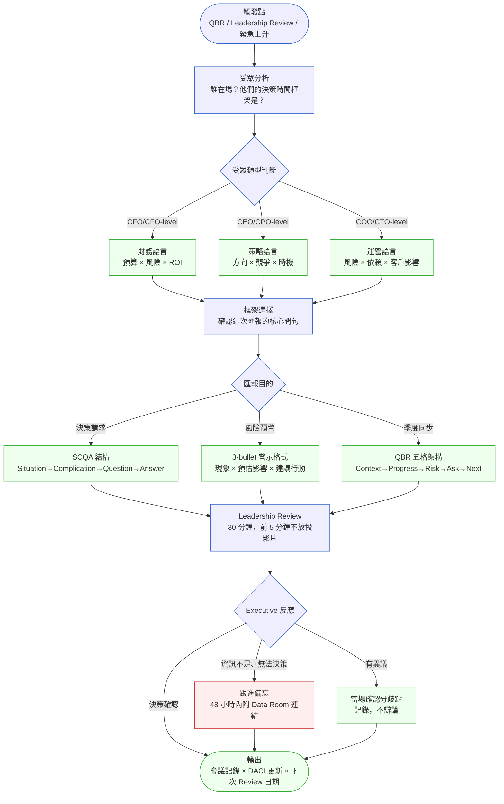
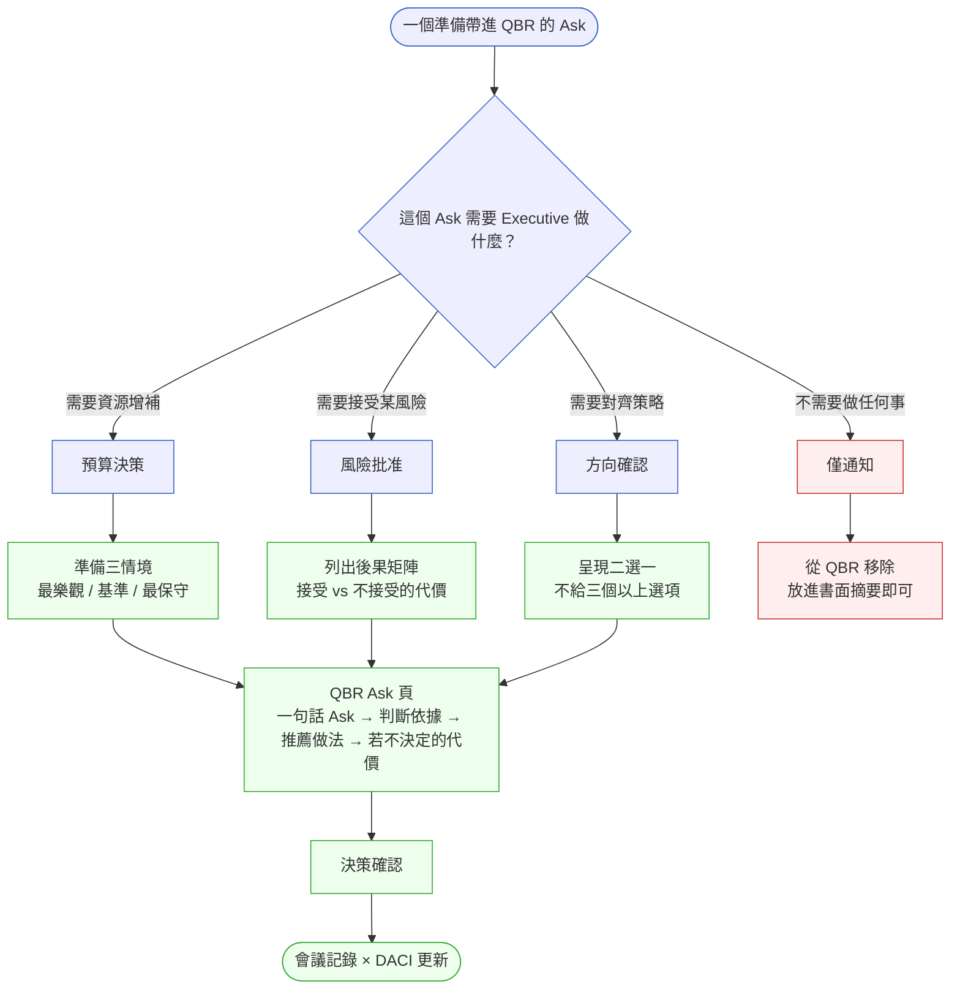

# 第 28 章 | Executive Communication：向上匯報與 QBR

> **前置閱讀**：[Ch 27 — Escalation Protocol：衝突升級的觸發條件與路徑](./ch-27-escalation-protocol.md)
> **下游章節**：[Ch 29 — Build vs Buy vs Partner：邊界決策框架](../part-05-decisions/ch-29-build-buy-partner.md)
> **SA/SD 對照**：[SA/SD 第 3 章 — 專案啟動、可行性研究與利害關係人分析](../../book/part-01-foundations/ch-03-project-initiation.md)
> ⸺ SA 視角關注利害關係人的需求邊界與技術可行性；本章關注如何在 QBR（Quarterly Business Review，季度業務審視）與 Leadership Review（領導層審視）等高密度決策場合，將進度、風險與資源需求轉化為 Executive（高階主管）能做決策的語言。

---

## §28.1 冷觀察

晚上十一點四十分，FinCore 辦公室只剩 PM Lead Marcus 一個人，明天早上九點的 Q2 QBR 簡報還停在第二十三頁。他把 Squad C 的延遲解釋又改了第四遍——這一版聽起來像在道歉，上一版聽起來像在甩鍋，他自己都分不清哪個更糟。

FinCore 是一家做跨境 B2B 支付清算的金融科技公司（fintech）。2025 年底，公司決定把核心清算引擎從自建的 on-premise（地端）批次系統，遷移到雲端即時清算架構。這個計畫代號 Apex，預計十八個月、四個 Squad（小隊）、預算 US$4.2M。此刻是計畫第七個月，明早就是決定後半段命運的 Q2 QBR。

Marcus 的簡報有二十三頁。第一頁封面，第二頁進度甘特圖，第三到第十七頁是各 Squad 的 Sprint velocity（衝刺速度）、bug count（缺陷數）、Story Point burn rate（故事點燃燒率）、兩套 A/B 測試結果、技術債清單，以及一整段解釋為什麼 Squad C 比計畫晚三週。第十八頁是 Q3 功能清單，第十九頁是 OKR 達成率熱力圖，第二十到第二十三頁是每個 Squad 的「下一步計畫」。他關掉電腦時想：資訊夠齊了，明天應該守得住。

隔天早上九點。QBR 只有四十分鐘。出席者是 CFO、COO、Head of Compliance（合規長），以及前一晚剛從倫敦飛回來、眼睛還帶著時差的 CEO。

Marcus 才放到第四頁，CFO 就抬起頭，打斷了他：

> 「我需要知道一件事：我們現在花了多少錢，有沒有換到什麼？」

Marcus 愣了半秒，說：「第十九頁有 OKR 達成率。」

CFO 翻到第十九頁，沉默了三秒。那張熱力圖有九個 KR，七格橘色、兩格綠色，配色說明用 8 點字體擠在右下角。她沒再說話，把筆放下了——那個動作比任何質疑都更讓 Marcus 心跳加速。

CEO 往椅背一靠：「先跳過。直接說，Apex 的風險在哪。」

Marcus 翻到第十一頁技術債清單，開始解釋 legacy batch scheduler（舊批次排程器）的耦合問題。講到第三分鐘，COO 把手抬起來攔住他：

> 「停。這是技術問題還是業務風險？我只想知道一件事——這會不會讓我們的大客戶在 Q3 出事。」

Marcus 張了張嘴，沒有立刻回答。他在二十三頁裡找不到那一句話。不是他不知道答案——答案是「三個大客戶的清算路徑，其中一條在 Q3 遷移期間有 6 小時維護窗口，可能影響到期款項」——而是他把這個判斷埋進了第十一頁的技術語言裡，從來沒翻譯成 COO 能直接拿去決策的句子。會議室安靜了幾秒，那幾秒裡 Marcus 聽得見自己的呼吸。

四十分鐘的 QBR，Marcus 回答了十一個問題，但只有三個問題讓 Executive 真正拿到了他們需要的答案。剩下八個，全部排進了兩週後的 follow-up——也就是說，這場 QBR 該做的三個決定，一個都沒做成。

走出會議室時 COO 拍了拍他肩膀，沒說什麼。Marcus 知道，這不是簡報技巧的問題。這是受眾分析沒做、匯報框架選錯的問題。

---

## §28.2 真問題

### 表面需求（What）

Marcus 的 QBR 問題看起來像「資訊太多、結構不清楚」——二十三頁塞進四十分鐘，Executive 找不到重點。

這是表面。

### 業務目標（Why）

把它拆開來看：QBR 的功能不是「報告進度」，是「讓 Executive 做出 Q3 所需的三個決定」。

這三個決定在 FinCore 的情況下是：
1. Apex 預算要不要增補（Squad C 晚了三週）
2. 大客戶的 SLA（Service Level Agreement，服務水準協議）保護方案要不要在 Q3 啟動
3. Compliance 團隊要不要在遷移完成前介入一次稽核

Marcus 的簡報回答了大量的 What（做了什麼、花了多少 Story Point），但沒有連到 Why（這些事情會讓那三個決定更容易、還是更難下）。

Executive 要的不是更多資料，是更少、但更精準的資料，外加一個明確的「你需要決定 X，判斷依據是 Y，推薦做法是 Z」結構。

為什麼選 Output/Outcome/Impact 這個鏡頭，而不是從「資訊架構」或「受眾關注點」切入？原因是：CFO 問的「有沒有換到什麼」，本質上是在問投資效益鏈——花了錢（Output），有沒有帶來行為或指標的改變（Outcome），這個改變有沒有轉化成業務後果（Impact）。「資訊架構」框架能告訴你哪些資訊更容易被找到，「受眾關注點」框架能告訴你哪位 Executive 在意哪個面向，但兩者都解決不了「哪一層的資訊根本缺席」這個診斷問題。Output/Outcome/Impact 的三層鏈條，恰好對映 CFO 與 COO 評估任何投資的心智模型：投入（Outputs）是否帶來行為或指標轉變（Outcomes），這些轉變是否產生財務或營運後果（Impact）。只有用這個鏈條來拆解 Marcus 的簡報，才能準確定位缺口在第三層——而不是在頁數或配色上。

這裡有一個三層框架值得拆清楚：

| 層次 | Marcus 的 QBR 做到了什麼 | Executive 實際需要什麼 |
|---|---|---|
| **Outputs**（產出） | Sprint velocity、bug count、功能上線數量 | 知道存在即可，不需要細節 |
| **Outcomes**（結果） | OKR 熱力圖（行為指標） | 需要，但要能對應到客戶風險 |
| **Impact**（影響） | 缺席 | 「這會影響哪些大客戶、影響多少、影響多久」 |

Marcus 量了 Outputs，報了 Outcomes，但漏掉了 Impact。CFO 問「有沒有換到什麼」，問的正是 Impact 層次——不是功能數量，是業務影響。

### 決策瓶頸（Who × When）

向上匯報最常見的失效不是資訊不夠，而是**決策責任沒有被點名**。

Apex 計畫有五個人需要做決定，但那五個人坐在 QBR 裡，卻沒有人知道自己今天要決定什麼。

這就是 DACI（Driver-Approver-Contributor-Informed，決策責任分工模型）沒有在 QBR 前被確認的代價：

| 角色 | 全稱 | Apex Q2 QBR 的情況 |
|---|---|---|
| **D** Driver（推動者） | 推動決策進行 | Marcus，但他沒有明說「今天要決定三件事」 |
| **A** Approver（拍板者） | 最終拍板 | CFO（預算）/ CEO（風險策略），都在場卻沒被點名 |
| **C** Contributor（貢獻者） | 提供輸入 | Head of Compliance，被動等待，沒被直接詢問 |
| **I** Informed（被知會者） | 被通知結果 | Squad Lead，根本不該出現在這個 QBR |

結論：**問題不是 Marcus 不知道狀況，而是他沒有把 QBR 當作一個需要設計 DACI 的決策會議，而是當作一個進度彙報的展示場合。**

向上匯報與 QBR 的核心技藝，是把「報告進度」的心智模型換成「設計決策」的心智模型。

---

## §28.3 決策框架

這一節不給你一份「QBR 標準簡報範本」照抄，而是給你三個用來自己判斷的工具：一張流程圖告訴你「卡點在哪、為什麼卡」，一棵決策樹告訴你「每個 Ask 該走哪條路」，一張決策表告訴你「不同場合該選哪個框架」。判斷邏輯交給你，套用情境交給你的現場。

### 圖 A — 向上匯報工作流程圖



這個流程有三個關鍵卡點值得停下來看：

**卡點一：受眾分析在準備期做，不是在會議室門口做。** 同一個 Apex 狀況，CFO 要聽的是「還需要多少預算、風險調整後的 ROI 是多少」；COO 要聽的是「哪個大客戶在哪個時間窗口有風險」。兩份訴求用同一份二十三頁簡報回答，等於把資訊整理的工作丟回給 Executive 做——而這份負擔，會讓他們在你還沒講到重點前就先不耐煩。

**卡點二：框架選擇決定了問句，問句決定了整個簡報結構。** SCQA 是 McKinsey（麥肯錫）的 Situation-Complication-Question-Answer（情境—衝突—問題—解答）結構縮寫，適合「需要 Executive 拍板一個新方向」的場合；QBR 五格架構（Context、Progress、Risk、Ask、Next，即脈絡—進度—風險—請求—下一步）適合「週期性同步、例行審視」的場合。兩者都不適合用來「一次說明很多事情」——如果你發現自己在猶豫該選哪個，那通常代表你還沒想清楚這場會議要的是「決定一件大事」還是「同步一個季度」。

**卡點三：Leadership Review 的前五分鐘不放投影片。** 先口頭說「今天我要請各位做三個決定，分別是 X、Y、Z，預計各需要五分鐘」，讓 Executive 的決策準備狀態先對齊，再開始放頁面。這個五分鐘的設計，能讓後面三十分鐘的效率翻倍。

注意流程圖裡那個紅色節點：當 Executive 反應是「資訊不足、無法決策」時，這不是中性的下一步，而是一個警訊——它代表你的受眾分析或 Ask 設計在前面某一步就漏了東西，48 小時的補件只是止血，不是常態。

---

### 圖 B — QBR Ask 決策樹

每個準備帶進 QBR 的 Ask，先過一次這棵樹，判斷它該走哪條準備路徑、或根本不該進 QBR。



**使用說明**：注意那條紅色路徑——「僅通知」類的 Ask 最常被誤放進 QBR。讓 Executive 坐在會議室聽一件他們不需要決定的事，等於消耗他們對這個 QBR 的信任額度，下次你真的需要他們專注時，那份額度可能已經透支了。判斷一個 Ask 是不是「僅通知」很簡單：問自己「如果今天沒人回應這頁，計畫會不會卡住？」會卡，才是真 Ask；不會卡，放進書面摘要就好。

---

### 決策表：匯報場合選擇框架

| 情境 / 觸發條件 | 推薦框架 | PM 關注點 | 常見錯誤 |
|---|---|---|---|
| 季度例行同步（QBR） | QBR 五格架構（Context→Progress→Risk→Ask→Next） | Ask 必須是具體的決策請求，不能是「請大家給回饋」 | Ask 頁放了五個問題，全部太大，沒有一個能在四十分鐘內決定 |
| 需要追加預算或資源 | SCQA + 三情境預算表 | 一定要有「不追加的代價」比較欄，不能只列需求 | 只帶需求，沒帶後果——Executive 會把決定推遲 |
| 緊急風險通報（OKR 爆掉 / 大客戶事故） | 3-bullet 警示格式：現象 × 影響 × 行動 | 行動欄要有 PM 已採取的措施，不能只報問題 | 在 Slack 打一長串說明，沒有口頭確認對方收到 |
| 策略方向需要確認（roadmap 轉向） | 二選一決策框架 + DACI 更新 | 兩個選項之間的 trade-off（取捨）要對稱呈現，不能偏心 | 給了三個選項，讓 Executive 做 PM 該做的選擇 |
| 跨部門升級（Engineering / Legal 衝突） | Executive Brief（一頁摘要）+ 立場聲明 | 一頁上要清楚說「PM 的建議是 X，理由是 Y」 | 不表態，只「呈現兩邊立場」讓 Executive 猜 PM 的看法 |

讀這張表的方式不是「對號入座」，而是先問自己一個問題：**這次匯報，我希望會議結束時 Executive 手上多了什麼？** 是一筆核准的預算、一個被接受的風險、一個確認的方向，還是只是「知道了」。答案會直接指向你該選哪一列。

---

### If-Then 框架：Ask 設計速查

在設計 QBR 的每一個 Ask 頁時，可以用以下條件逐項自我檢查是否完整：

- **If** 受眾角色在指定時間框架內需要做某類決策 → **Then** 帶進場的資料是最少夠用的資訊集合，Ask 句子明確指向「請核准 / 請確認 / 請決定 ＿＿＿」
- **If** Ask 頁填不出「若不決定的代價」 → **Then** 這個 Ask 尚未成熟，不應進入 QBR，先退回問題分析階段
- **If** 建議做法只有一個選項且無理由 → **Then** 補充 PM 推薦的決策依據（成本、風險、NPV），否則 Executive 無從判斷
- **If** Ask 需要多位 Executive 共同拍板 → **Then** 在 Ask 頁明確標示「主決策者」與「共識參與者」，避免會後責任模糊

用 Apex Q2 QBR 的案例套一次：

- **If** CFO 在 Q2 QBR（40 分鐘）需要決定是否追加 Apex 預算 → **Then** 帶進場的資料是：目前已花費 $2.1M（50%）、剩餘工期 11 個月但 Squad C 晚 3 週、三情境估算（維持現況 / 追加 $0.3M / 縮小範圍）
- **If** CFO 選擇不在當場決定 → **Then** 告知後果：大客戶 A、B 在 Q3 清算窗口面臨服務中斷風險，最晚決策截止日為 T+5 工作天
- **If** CFO 傾向情境 (b) 但質疑金額 → **Then** 提示 NPV 分析：$0.3M 追加可保護 $2.8M 年化合約，ROI 約 9:1
- **If** CFO 要求更多資料再決定 → **Then** 確認所需資料清單與提供時間，並預約下一個決策窗口（避免議題無限期擱置）

這個結構做完之後，QBR 的 Ask 頁可以縮到一頁半。如果你發現某個 Ask 填不滿這四行（特別是填不出「若不決定的代價」），那通常不是格式問題，而是這個 Ask 還沒成熟到該進 QBR。

---

## §28.4 踩坑清單

**反模式：進度報告代替決策設計**

現象：PM 把 QBR 準備成「完整版月報」，每個 Squad 的 velocity、每個功能的上線日、每個 OKR 的達成率全部列出，希望 Executive「看到全貌」。

根因：PM 把 QBR 的功能理解成「讓大家知道進展」，而不是「讓大家做出下一步決定」。這個認知的錯位讓準備工作全部走偏。

> 修正方向：QBR 前先列出「這次需要 Executive 做幾個決定、分別由誰拍板、需要什麼資訊才夠」，然後反推需要準備哪些頁面。沒有服務任何決定的頁面，全部移出簡報，放進附件的 Data Room（資料室）。

---

**反模式：隱藏壞消息到 QBR 才說**

現象：Squad C 晚了三週，PM 在週報裡用模糊措辭帶過（「整體進度 97%，部分里程碑調整中」），留到 QBR 才正面解釋。

根因：PM 怕直接說壞消息會讓自己看起來管不住 Squad，選擇等場合「一次交代清楚」。但 Executive 在 QBR 才第一次聽到風險，等於讓他們在四十分鐘內同時處理「驚訝」和「決策」兩件事，認知負荷翻倍。

> 修正方向：風險出現的當週，用 3-bullet 警示格式提前一對一告知關鍵 Approver（CFO / COO）。QBR 上只需要說「這個風險兩週前已告知 CFO，今天要確認處置方案」，而不是重新建立語境。

---

**反模式：讓 Executive 做 PM 該做的選擇**

現象：PM 的決策頁列了三個選項（A、B、C），每個選項寫了五個優點和三個缺點，最後說「請大家討論選哪個方向」。

根因：PM 認為「把選項都列出來、讓 Executive 做最終判斷」是尊重，但 Executive 在 QBR 裡同時面對五個類似的「我們列了幾個選項，請討論」，等於讓他們替 PM 做分析工作。

> 修正方向：進入 QBR 前，PM 對每個決策必須有自己的推薦做法。選項可以呈現，但一定要明說「PM 建議 B，理由是 X」。Executive 的工作是確認或推翻這個建議，不是從零開始選。

---

**反模式：QBR 結束沒有書面記錄**

現象：QBR 上 CEO 口頭說「Apex 可以追加，讓 Marcus 去找 CFO 確認細節」，但沒有正式記錄。兩週後 CFO 說「我以為 CEO 說的是要先做評估，不是已經核准」。

根因：口頭決策在多人場合容易被不同人聽到不同版本，特別是「可以去追」和「已核准」之間的差距，PM 通常低估這個模糊空間的殺傷力。

> 修正方向：QBR 結束後四小時內，PM 發一封「決策摘要」郵件給所有出席者，用三個欄位列清楚：「決定了什麼 / 誰負責執行 / 截止日期是什麼」。讓 Executive 在 24 小時內確認或更正，不要等到下次 QBR 才發現記憶落差。

---

**反模式：用技術術語解釋業務風險**

現象：PM 在 QBR 說「我們的 batch scheduler 跟新的 event-driven pipeline（事件驅動管線）有耦合問題，可能導致 Q3 的清算延遲」，COO 問「這會影響客戶嗎」，PM 繼續解釋技術細節。

根因：PM 在技術語言裡待太久，忘記把技術風險翻譯成業務後果的動作。

> 修正方向：準備 QBR 時，對每個技術風險跑一次「所以呢」測試——問自己「這個技術問題，對客戶的最壞情況是什麼、可能性是多少、發生時誰要負責通知客戶」。帶進 QBR 的是「所以呢」之後的答案，不是原始的技術問題描述。

---

## §28.5 交付清單 ⸺ QBR Ready Pack 模板

````markdown
# QBR Ready Pack — 一頁決策請求模板
> 版本:v0.1 | 撰寫日期:YYYY-MM-DD | 擁有人:{名字}

### 0. 會議基本資料
- 場合類型：[ QBR / Leadership Review / 緊急上升 ]
- 出席 Approver：
- 預計時間：___分鐘
- 需要做的決定數量：___ 個

### 1. Context（1-2 句）
{這個計畫 / 產品 / 議題的一句話背景}

### 2. Progress（結果導向）
- Outputs（做了什麼）：
- Outcomes（使用者 / 業務指標變化）：
- Impact（對核心業務目標的影響）：

### 3. Risk（3 個以內）
| 風險 | 機率 | 業務影響 | 已採取行動 |
|---|---|---|---|
| | | | |

### 4. Ask（每個決策單獨一段）
**決策 1：{一句話說明需要決定什麼}**
- 推薦做法：
- 判斷依據：
- 若不決定，預計在 {日期} 前出現：
- DACI：Driver={} / Approver={} / Contributor={} / Informed={}

### 5. Next（下次 Review 前的三件事）
- [ ] {行動} by {誰} by {日期}
- [ ] {行動} by {誰} by {日期}
- [ ] {行動} by {誰} by {日期}
````

把它存在 `docs/governance/qbr/`，跟程式碼同 repo，跟 README 同層。

這個模板設計的核心假設是：**Executive 在 QBR 裡的認知頻寬有限，每個頁面都應該只服務一個目的**。Context 讓大家校準語境；Progress 用三層架構讓人確認「做的事有沒有換到想要的結果」；Risk 用業務語言而不是技術語言；Ask 強制 PM 把決策點說清楚；Next 讓會議結束時有具體的下一步，不是在空氣裡結束。

### §28.5.1 範例：FinCore Apex Q2 QBR Ask 頁

Marcus 在 QBR 失敗後，隔週做了一件事：把原本的二十三頁簡報，壓縮成這份 QBR Ready Pack。CFO 在收到草稿後十五分鐘就批了核心決策——不是因為決策變容易了，而是因為她不需要再花時間替 Marcus 做資訊整理的工作。

下面這份範例的每一個關鍵欄位都附了行內註解（`<!-- -->`），說明「這一欄為什麼存在、填寫時的判斷邏輯是什麼」——這正是 Marcus 第一版簡報缺的東西。

````markdown
# QBR Ready Pack — FinCore Apex 計畫 Q2 Review
> 版本:v0.1 | 撰寫日期:2026-02-15 | 擁有人:Marcus(PM)

### 0. 會議基本資料
<!-- 為什麼這欄：場合類型直接決定 DACI 設計——QBR 的 Approver 組合（CFO/COO/CEO 都在）
     和緊急上升（通常只找單一 Approver）不同。先確認「誰在場、誰拍板」，可以省掉事後
     追人補簽的時間。「需要做的決定數量」刻意放在最前面，是逼自己在準備期就收斂 Ask
     數量——超過 3 個，這場 40 分鐘 QBR 幾乎一定做不完。 -->
- 場合類型：QBR（Q2 季度同步）
- 出席 Approver：CFO（預算）、COO（運營風險）、CEO（策略方向）
- 預計時間：40 分鐘
- 需要做的決定數量：2 個

### 1. Context
<!-- 為什麼這欄：給剛從倫敦飛回來、沒跟到細節的 CEO 一個 5 秒對齊點。一句話講不完的
     背景，代表你還沒想清楚這個計畫對業務的意義。 -->
FinCore Apex 是十八個月的核心清算引擎雲端遷移計畫，總預算 $4.2M，
目標是 2026 Q2 全面切換到即時清算架構，以支援大客戶合約中的
T+0 清算 SLA 承諾。

### 2. Progress
<!-- 為什麼這欄：三層區分讓 CFO 看到「花了多少錢、換到什麼商業結果」。只報 Outputs
     （做了幾個 Sprint）容易被反問「那又怎樣」；關鍵是 Impact 那一行——把技術進度直接
     綁到「Meridian Corp 的 T+0 SLA 能不能兌現」，這才是 CFO 真正在意的事。 -->
- Outputs：Squad A/B/D 完成雲端基礎設施部署（19 個 Sprint），
  Squad C 完成 60% 的 batch-to-stream 遷移（延遲 3 週）
- Outcomes：內部測試清算吞吐量提升 340%，錯誤率從 0.23% 降至 0.04%
- Impact：大客戶 Meridian Corp（年合約 $1.8M）的 T+0 SLA 承諾
  目前可在 Q3 如期兌現，但須視 Squad C 進度

### 3. Risk
<!-- 為什麼這欄：「業務影響」欄一律用金額與客戶名表達，不用技術語言——這是 §28.4 的
     「所以呢」測試落地。「已採取行動」欄是用來證明 PM 不是只報問題、而是已經在處理，
     讓 Approver 的決策聚焦在「還差最後一步要不要批」。 -->
| 風險 | 機率 | 業務影響 | 已採取行動 |
|---|---|---|---|
| Squad C 再延 2 週，Q3 清算窗口出現 6h 維護停機 | 35% | Meridian Corp T+0 SLA 違約，罰款條款 $120K | 已預告客戶可能維護窗口，等待本次 Ask 決定後正式通知 |
| Compliance 稽核在遷移完成前被要求提前 | 20% | 推遲整體上線 4-6 週 | 已與 Head of Compliance 排定預審會議 |

### 4. Ask

**決策 1：是否核准 Apex 追加預算 $0.3M 加速 Squad C**
<!-- 推薦做法欄：這是 PM 最常跳過、卻最致命的一欄。沒有推薦，Executive 等於要從零開始
     幫 PM 做判斷，會直接拖慢決策（這正是第一版 QBR 失敗的核心）。填法：先給出明確動作
     +可量化目標，不要寫「建議考慮加速」這種沒有承諾的句子。 -->
- 推薦做法：核准追加 $0.3M，增加兩名資深工程師至 Squad C，
  目標是在 8 週內補回延遲
<!-- 判斷依據欄：用 NPV（淨現值）把「花 $0.3M」翻譯成 CFO 的語言——$0.3M 的投入對應
     保護 $1.8M 年化合約收入 + 避免 $120K SLA 罰款，投資回收期 < 3 個月。計算邏輯：
     成本 $0.3M 為一次性；效益為「合約得以續存的年化收入 + 規避的罰款」，兩者相除得回收期。
     重點是讓 Approver 不必自己算，看一眼就知道這筆錢值得。 -->
- 判斷依據：NPV 分析顯示追加 $0.3M 可保護 Meridian Corp 合約
  $1.8M 年化收入，以及避免 SLA 罰款 $120K；投資回收期 < 3 個月
<!-- 若不決定欄：必須綁定具體日期與一個不可逆的觸發機制——這裡是「6/12 前必須正式通知
     客戶維護窗口，一旦發出就觸發合約通知條款，無法收回」。給 Executive 一個明確的決策
     deadline，比說「越快越好」有效十倍。 -->
- 若不決定（截止 2026-06-10）：需在 2026-06-12 前正式通知
  Meridian Corp 維護窗口，觸發合約通知條款
<!-- DACI 欄：當場點名拍板者（Approver=CFO），避免「散會後沒人覺得自己被授權」的真空。
     Driver 是 PM 自己（負責推進與追蹤），Contributor 提供技術輸入但不拍板，Informed
     只需事後知會、不需出席表態。 -->
- DACI：Driver=Marcus(PM) / Approver=CFO / Contributor=Engineering Lead /
  Informed=客戶成功團隊

**決策 2：Q3 大客戶 SLA 保護方案——主動通知或等待**
<!-- 這是一個典型「風險批准」型 Ask（對應圖 B 路徑）：本質是讓 COO 接受「主動通知」這個
     方案的代價，而非選功能。判斷依據刻意點出合約裡的 15 天提前通知條款，把「要不要主動」
     從公關問題升級成法律義務問題，讓 Approver 看到不決定的真實風險。 -->
- 推薦做法：核准主動通知方案，由客戶成功團隊在 2026-06-15
  前告知三家大客戶 Q3 可能維護窗口，並提供 SLA 補償方案草稿
- 判斷依據：主動通知可維持客戶信任，被動等待若出問題將觸發
  客戶升級（兩家有合約條款要求 15 天提前通知）
- 若不決定：兩週後自動進入被動等待情境，法律義務風險上升
- DACI：Driver=Marcus(PM) / Approver=COO / Contributor=Legal, CS /
  Informed=CEO

### 5. Next
<!-- 為什麼這欄：每條都綁「誰 + 日期」，讓會議散場時沒有任何懸空的行動。下次 Review 的
     日期也預先排定，避免決策追蹤斷在「之後再約」。 -->
- [ ] Squad C 資源增補方案由 Engineering Lead 提交 by 2026-06-07
- [ ] 大客戶通知信件草稿由客戶成功團隊完成 by 2026-06-10
- [ ] 下次 Leadership Review 排定 by 2026-07-05（Q3 中期）
````

兩個 Ask，各自帶齊了判斷依據、推薦做法、不決定的代價、以及 DACI。CFO 拿到這份之後，問題從「我需要知道有沒有換到什麼」變成了「$0.3M 的情境 (b) 我支持，請 Engineering Lead 週四前送我 headcount 計畫」。這就是 QBR 設計對了之後的樣子——同一個人、同一個計畫、同一筆預算，只是匯報的結構從「展示進度」換成了「設計決策」。

---

## §28.6 Recap

讀完本章，你應該已經能做到：

- [ ] 在 QBR 準備期先做受眾分析，確認每個 Approver 的決策時間框架與語言偏好
- [ ] 把每個 Ask 用 If-Then 框架設計完整：推薦做法 + 判斷依據 + 不決定的代價 + DACI
- [ ] 區分 Outputs / Outcomes / Impact，QBR Progress 頁至少涵蓋 Outcomes 和 Impact 層次
- [ ] 技術風險過「所以呢」測試後，再帶進 Leadership Review，不帶技術術語
- [ ] QBR 結束四小時內，發出決策摘要確認郵件

回到開場那個改到半夜十一點四十、卻仍守不住四十分鐘的 Marcus——他缺的從來不是更多頁面，是一個清楚的決策請求。如果先挑一項做，就先設計 Ask 頁：一句話的決策請求，加上推薦做法和「若不決定的代價」，就能把原本需要四十分鐘才能勉強收尾的 QBR，壓縮成一個每個人都知道自己要做什麼的二十分鐘會議。其他準備工作，都是在為這個核心服務。下一次走進 QBR 前，你已經知道該怎麼讓那三個決定，當場就做成。

---

## Cross-References

- **前一章**：[Ch 27 — Escalation Protocol：衝突升級的觸發條件與路徑](./ch-27-escalation-protocol.md) — 衝突升級到 Executive 層級時，本章的匯報框架就是接下來的下一步
- **下一章**：[Ch 29 — Build vs Buy vs Partner：邊界決策框架](../part-05-decisions/ch-29-build-buy-partner.md) — 向上匯報後最常需要 Executive 決定的，是這類邊界型決策
- **強連結**：[Ch 26 — PM × Data：指標的定義與所有權](./ch-26-pm-data.md) — QBR 的 Progress 頁能不能說清楚，取決於指標是否事先定義清楚
- **SA/SD 對照**：[SA/SD 第 3 章 — 專案啟動、可行性研究與利害關係人分析](../../book/part-01-foundations/ch-03-project-initiation.md) — SA 視角關注利害關係人的需求邊界與可行性；本章關注如何在 QBR 等高壓場合，把需求翻譯成 Executive 的決策語言
- **SA/SD 對照**：[SA/SD 第 36 章 — 治理架構](../../book/part-06-engineering/ch-36-governance-architecture.md) — DACI 在治理架構層面的設計；本章專注在 QBR 場合的即時 DACI 確認
