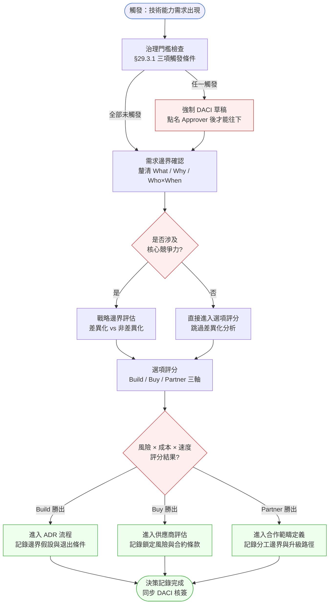
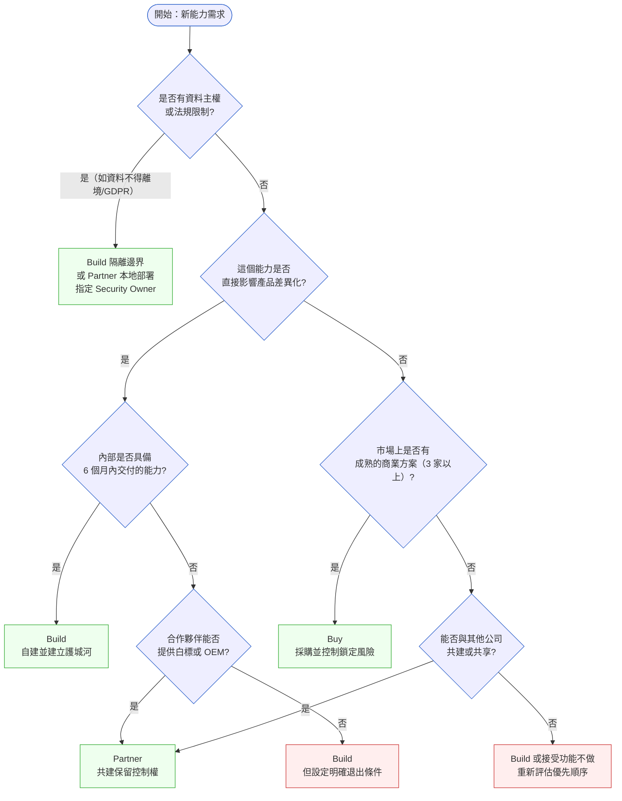

# 第 29 章 | Build vs Buy vs Partner：邊界決策框架

> **前置閱讀**：[Ch 28 — Executive Communication：向上匯報與 QBR](../part-04-collaboration/ch-28-executive-communication.md) ⸺ Build/Buy/Partner 是跨職能、需要向 C-level 拍板的決策；先掌握如何把決策規模量化給高層，才有辦法找對 Approver
> **前置閱讀**：[Ch 27 — Escalation Protocol：衝突升級的觸發條件與路徑](../part-04-collaboration/ch-27-escalation-protocol.md) ⸺ 當邊界決策卡在職能之間（工程要自建、財務要外購），升級路徑決定誰來破局
> **下游章節**：[Ch 30 — Technical Debt 的 PM 語言：怎麼跟 Stakeholder 說](./ch-30-tech-debt-pm.md) ⸺ 自建（Build）的長期代價往往以技術負債的形式回來，本章的決策直接餵養下一章的負債溝通
> **SA/SD 對照**：[SA/SD 第 33 章 — 架構決策紀錄(ADR)與架構知識管理](../../book/part-06-engineering/ch-33-adr-architecture-knowledge.md)
> ⸺ SA 視角從技術負債與架構適配性切入；本章從商業邊界與 PM 決策責任切入，兩者共用決策紀錄格式，但觸發時機與核心問題不同。

---

## §29.1 冷觀察

那場會議是 Q3 規劃週的第三天，會議室白板上還留著前一天沒擦掉的 roadmap，紅筆圈著一條：**SSO，這季一定要上**。

Taskline（CASE-SAS-111）是一家中型 SaaS，核心產品是工作流自動化平台，ARR 剛過兩千萬美元，Series B 交割後六個月。PM 當時的待辦清單裡有一條：「SSO 認證升級，支援 SAML 2.0 與 OpenID Connect」。三個大客戶的採購窗口已經在催了，Enterprise 銷售那邊把話說得很白：這季不上，年底三筆續約全部有風險，加起來年化 ARR 將近五百萬。

PM 把需求丟給工程 lead 問工時。工程 lead 想了一下，回了兩個數字：「用 Auth0，三個禮拜可以交；自建的話，三個月——但我們可以完全控制。」

「完全控制」這四個字，是整場會議裡唯一沒有人去定義的詞。沒有人問：控制什麼？控制給誰用？控制的代價是誰在三年內持續支付？

PM 決定自建。理由寫在 Notion 頁面裡，一句話：「Auth0 年費八萬美元，自建一次性成本，長遠省錢。」

這個決策沒有被任何人推翻。架構評審沒有被列為必填會議。CTO 沒有被納入審批鏈。Legal 沒有人問到。決策當天下午，Engineering 就開始排 sprint，工程 lead 私下對同事說了一句：「能自己掌握總比被綁死好。」——這句話也沒有人記錄。

十四個月後，Taskline 的安全工程師在一次例行審計中發現 SSO session token 的 rotation 邏輯有漏洞，攻擊面已經存在了四個月。修補緊急動員了三名工程師、花了兩個半週。那一年，自建 Auth 模組共發生四次緊急 patch、一次計劃外的協議升級，以及一次因 SAML assertion 規格誤判導致兩個客戶無法登入的事故（P0，持續 47 分鐘）。其中一個客戶，正是當初被列入「續約風險」名單的那三家之一。

CTO 在事後復盤報告裡算了一筆帳：人力維護成本年化超過 Auth0 年費三倍。更刺眼的是，那位負責維護模組的工程師在復盤會上說出了一句沒有被寫進報告的話：

> 「這塊程式碼沒有人真的懂。我也只是在修。」

會議室安靜了幾秒。沒有人回答得了當初為什麼要自建。那個寫著「長遠省錢」的 Notion 頁面，在一次工作區搬遷中遺失了。決策的理由消失了，但決策的帳單還在每個月準時寄到。

---

## §29.2 真問題

把 Taskline 的案例拆開來看，表面需求清晰得不能再清晰，決策過程卻是一層一層往下崩。真正值得 PM 警惕的，不是「選錯了 Build」，而是**整個決策從頭到尾沒有一個地方逼問過自己的前提**。

### 表面需求（What）

技術需求是確定的：支援 SAML 2.0 與 OpenID Connect，讓企業客戶能夠接入自家 IdP（Identity Provider，身分識別供應商）。功能邊界清楚，市場上已有 Auth0、Okta、WorkOS 等多家成熟解決方案。

但「確定的需求」和「確定的決策方式」是兩件事。需求越清楚，PM 越容易以為決策也很簡單——這正是陷阱的入口。

### 業務目標（Why）

往下一層：為什麼這個需求現在被提出來？答案是 Enterprise 續約風險。這代表真正的業務指標是**客戶留存**與**Enterprise ARR 防守**，不是「有沒有 SSO 這個功能」。

這裡出現了第一個混淆：

| 層次 | 實際狀況 | PM 的認知 |
|---|---|---|
| **Output** | 完成 SSO 模組開發 | ✅ 有意識到 |
| **Outcome** | Enterprise 客戶成功完成 IdP 整合，順利續約 | ⚠️ 只在嘴上說 |
| **Impact** | ARR 防守，降低年底流失風險 | ❌ 沒有被量化進決策依據 |

PM 的決策依據停在「省成本（Output 層）」，但需要守的是「續約率（Impact 層）」。這兩個目標之間，並不是簡單的因果鏈：省下八萬年費，無法直接換算成續約成功；但延遲三個月交付，卻可能直接讓客戶在 QBR 上看不到可 demo 的版本。

自建確實省了採購費用；自建也確實延遲了三個月，讓那三個大客戶在續約決策會議前一個月才看到 demo，而不是六週前。這個時間差，在 Enterprise 銷售的節奏裡代表什麼？沒有人問過。

Enterprise 客戶的續約決策有固定節奏：QBR（季度業務審查）通常在合約到期日前六至八週鎖定供應商候選名單；任何在 QBR 前四週才 demo 的功能，採購窗口根本來不及完成內部評估。這個「六週門檻」才是本次決策真正的時間約束——Outcome 欄的「Enterprise 客戶成功整合」不是一個模糊的願望，而是一個有截止日期的日曆事件。自建三個月、Auth0 三週，兩者的差距直接決定了能不能在門檻前到達。Build/Buy 的取捨應以「能否在客戶 QBR 前至少六週交付可 demo 版本」作為首要篩選門，而不是一次性採購成本的大小。

決策依據選錯了層次——拿 Output 層的成本去回答 Impact 層的問題。

### 決策瓶頸（Who × When）

第三層才是這個案例真正的根問題，也是 PM 最該停下來盯著看的一層：**這個決策的瓶頸不在「選哪個」，而在「誰有資格選、什麼時候必須定案」。**

為什麼 Taskline 會卡在這裡？因為 Build vs Buy 既不是純工程決策，也不是純採購決策。它是一個**邊界決策**：這個能力是不是公司的核心競爭力？要不要把公司的安全責任、財務承諾、合規風險揹在自己身上？這個問題跨越技術、財務、安全、合規四個職能，任何單一職能都不具備完整的判斷視野。工程 lead 只看得到「能不能做、要做多久」，看不到「漏了會賠多少、合約鎖多久」。

Taskline 的 DACI 當時長這樣（事後還原，當時並無記錄）：

| 角色 | 應該是誰 | 實際上是誰 |
|---|---|---|
| **Driver**（推動決策進行） | PM | PM（有做） |
| **Approver**（最終拍板） | CTO + CFO | PM（實際上是 PM 自己拍） |
| **Contributor**（提供輸入） | Engineering Lead、Security、Legal | 只有 Engineering Lead |
| **Informed**（被通知結果） | CEO、Enterprise Sales | 沒有人被正式通知 |

**為何出現這個瓶頸？** 三個結構性原因疊在一起：

1. **沒有觸發機制**：組織裡沒有任何規則說「涉及三年以上財務承諾或安全責任的決策，必須升級到 C-level」。於是這類決策默默地落在最先碰到它的人身上——PM。
2. **決策規模沒有被量化**：PM 從來沒把「年化風險 ARR 480 萬」攤在桌上。一旦攤開，這個數字本身就會自動把 CFO 拉進審批鏈。規模沒被量化，Approver 就不會自動現身。
3. **諮詢半徑太小**：PM 只問了工程，因為工程是「最容易問到的人」。Security 和 Legal 不在 PM 的日常路徑上，於是被省略——不是刻意，而是路徑依賴。

**如何系統性解決？** 瓶頸的解法不是「PM 下次更謹慎」，而是把決策觸發條件制度化。Approver 缺位是這個案例最根本的問題，而 Approver 缺位的根因是**組織沒有為邊界決策設立固定審批流程**。本章後面的框架，就是要把這個「強制入口」變成一張任何人都能填的表。

---

## §29.3 決策框架

Build vs Buy vs Partner 的決策，有四個階段：需求邊界確認、戰略邊界評估、選項評分、決策記錄。每個階段都有具體工具。下面的兩張圖與三張表，目的不是給你「該選哪個」的標準答案——能力需求千差萬別，沒有通用答案——而是教你**如何把一個模糊的「要不要自己做」的衝動，逼問成一連串可被檢驗的判斷**。

### 圖 A — PM 工作流程圖



流程的關鍵節點有三個：第一個是「治理門檻檢查」（§29.3.1），這是新增的強制入口，確保高影響決策自動觸發 DACI；第二個菱形（核心競爭力判斷）決定後續分析深度；第三個菱形（評分結果）之後，每條路徑都必須走到「決策記錄完成」，不能停在口頭共識。Taskline 的錯誤，本質上是從觸發直接跳到 sprint 排程——整個流程圖只走了第一格。

### §29.3.1 治理門檻檢查：DACI 強制觸發規則

「邊界決策」的風險，在於它總是安靜地落在最先碰到它的人手上。要打破這個路徑依賴，需要的不是更謹慎的 PM，而是**組織層面的自動觸發機制**。

以下三個條件，滿足任何一項即強制啟動 DACI 草稿，並要求在草稿完成、Approver 點名之後才能繼續決策流程：

| 觸發條件 | 門檻 | 說明 |
|---|---|---|
| **跨職能風險** | 決策涉及 2 個以上職能的責任邊界 | 工程 + 安全、財務 + 法務、合規 + 商務 任一組合 |
| **財務承諾** | 三年 TCO 超過 NT$100 萬（或 USD $30k） | 含一次性成本 + 年化維護 × 3 |
| **新合規域** | 進入組織未曾處理過的合規領域 | GDPR、SOC2、資料不得離境、ISO 27001 等 |

**這三條規則做的事只有一件：讓 Approver 不得不現身。**

組織基礎設施建議：
- 在 Notion / Confluence 的決策記錄模板中，把這三個觸發條件做成 checkbox，任何人提交決策記錄時必須勾選
- 若有 1+ 個勾選，頁面自動通知 CTO 或負責審批的角色
- 季度 OKR 會議固定一個 10 分鐘的「邊界決策清單複查」，由 PM lead 主持，確認過去 90 天是否有遺漏的觸發案例

這不是流程包袱，是讓「PM 自己拍跨越授權範圍的決策」變得不可能的最小配置。

### 圖 B — 決策樹：核心判斷邏輯（含合規維度）



新增的第一個分叉（資料主權與法規限制）是合規優先原則的落地：在某些場景下，Buy 根本不是選項（雲端供應商無法滿足資料不得離境要求），或 Partner 必須是本地部署夥伴。先排除合規硬限制，後面的差異化判斷才有意義。R4 和 R5 維持 `hot` 標色，代表受限條件下的選擇，進入前需要額外的風險確認。

### 決策評分表

走完決策樹拿到三個選項的輪廓之後，用以下六個維度打分（1–5 分，越高越優），再加權彙總。這張表的價值不在分數本身，而在**逼你把每個維度單獨拿出來想一遍**——很多人在腦中只算了 TTM 和採購費用兩格就拍板了。

| 評估維度 | 說明 | Build | Buy | Partner |
|---|---|:---:|:---:|:---:|
| **差異化潛力** | 這個能力能否成為競爭優勢？ | 高 | 低 | 中 |
| **時間到市場（TTM）** | 多快能交付給客戶使用？ | 低 | 高 | 中 |
| **全週期成本（TCO）** | 包含維護、升級、人力的三年總成本 | 不確定 | 可預測 | 部分可控 |
| **技術鎖定風險（Vendor Lock-in）** | 更換選項的難度與代價 | 低 | 高 | 中 |
| **安全與合規負擔** | 誰對漏洞和合規負責？ | 全責 | 轉移部分 | 分責 |
| **退出彈性** | 若決策失誤，多快能切換？ | 高代價 | 需合約審計 | 依協議 |

**Taskline 的評分還原（事後）：**

| 維度 | Build | Buy（Auth0） | Partner |
|---|:---:|:---:|:---:|
| 差異化潛力 | 2 | 1 | 2 |
| TTM | 1 | 5 | 3 |
| TCO（三年） | 2 | 4 | 3 |
| 技術鎖定風險 | 5 | 2 | 3 |
| 安全合規負擔 | 1 | 4 | 3 |
| 退出彈性 | 2 | 3 | 4 |
| **加權總分** | **13** | **19** | **18** |

**評分依據說明（為什麼是這些分數）：**

評分必須有可追溯的背景數據，否則分數只是「感覺」的包裝。以下說明 Taskline 案例中幾個關鍵分值的依據：

- **TCO 維度 Build = 2**：自建三年 TCO 還原為 135 萬（一次性 45 萬含三個月開發工時；年化維護 30 萬，含安全 patch、SAML 協議升級、on-call 輪值——以實際發生的四次緊急 patch 與一次協議升級反推）。成本高且**不可預測**（事故年份維護成本暴增），故給低分 2。
- **TCO 維度 Buy = 4**：Auth0 三年 TCO 約 24 萬（年費 8 萬 × 3，無一次性開發成本）。成本低且**可預測**，未滿分 5 是因為年費隨用量階梯上漲，存在向上風險。
- **安全合規負擔 Build = 1**：自建意味著 token 儲存、漏洞修補、合規認證全部自揹，Taskline 的 P0 事故正是這個全責的代價。
- **TTM Build = 1 vs Buy = 5**：直接對應工程估時——自建三個月、Auth0 三週，差距近 4 倍。

加權總分（此處採等權，實務中可依情境調權重）顯示 Buy（19）明顯優於 Build（13）。若當時有做這個評分，Buy 是清楚的選擇。**分數會說話，前提是有人逼你算分。**

### §29.3.2 TCO 試算進階：勞動力市場與人力容量調整

多數 TCO 試算把人力成本當作固定變數處理——一個工程師，一個年薪，就乘下去了。這個假設在以下情境會嚴重低估 Build 成本：

**勞動力市場稀缺性加乘：**

| 情境 | TCO 調整建議 |
|---|---|
| 目標職能市場供應商少於 3 家（如台灣資安工程師） | 年化維護人力成本 × 1.5 |
| 同職能年薪中位數 > $150k USD | 維護人力預算基準上調 30% |
| 過去 12 個月同職能離職人數 ≥ 2 人 | 加計 20% 的 bus-factor 風險溢價 |
| 維護該模組的人數 ≤ 1（單點依賴） | 在備忘錄中標注「關鍵人力風險」，觸發 Approver 確認 |

**Taskline 的還原應用：** 事後審計顯示，維護 Auth 模組的實際上只有一位工程師，且該工程師在 P0 事故後三個月離職。若當時套用「單點依賴」調整，就會在備忘錄中標出這個風險——讓 CTO 在審批時有機會看到它。

人力是 Build 決策最常被低估的長尾成本。把勞動力市場條件和人力容量限制納入 TCO，不是讓數字更大，而是讓數字更誠實。

### If-Then 框架：Build vs Buy vs Partner 情境對應

以下 15 個情境覆蓋了主要的觸發類型。對上情境後仍要回到評分表精算——這些是「找到最接近的起點」，不是終點：

**非差異化功能 × 時間敏感：**
- **If** 需求屬非差異化功能 + 交付期限 < 6 週 → **Then** Buy 優先，附加退出計畫，確認鎖定期不超過下一個戰略週期
- **If** 市場上有 3 家以上成熟供應商 → **Then** Buy 優先，評估合約中是否有數據可攜性條款
- **If** 非差異化 + 時間壓力高 + 供應商鎖定風險低 → **Then** Buy 並積極談 SLA，不需要多輪競標

**差異化功能 × 內部能力充足：**
- **If** 需求直接影響產品核心差異化，且內部有足夠開發與維護能力 → **Then** Build 優先，記錄邊界假設與六個月後的維護資源計畫
- **If** 差異化 + 現有工程師可交付 + 合規無特殊限制 → **Then** Build，並用 ADR 格式記錄退出條件

**合規與資料主權優先：**
- **If** 安全或合規要求需要完全控制（如資料不得離境、GDPR 數據主權） → **Then** Build 隔離邊界，或尋找本地部署的 Partner；指定 Security Owner 並設定變更審批流程
- **If** 進入新合規域（SOC2、ISO 27001）且無內部專業能力 → **Then** Partner 優先，要求合規認證已通過的夥伴，而不是自己摸索
- **If** 客戶合約有特定資料存放地點要求 → **Then** Buy 前先確認供應商是否支援指定區域部署，否則直接排除

**成本驗算觸發：**
- **If** 三年 TCO 試算顯示 Build 超出 Buy 的 2 倍以上 → **Then** 重新檢視 Build 決策，排除「以技術自主為由」的確認偏誤
- **If** 維護人力市場供應商 < 3 家，或維護角色是單點依賴 → **Then** 在 TCO 加計 1.5 倍人力溢價後重算，再做評分

**生態系與外部整合：**
- **If** 需求橫跨多個組織的業務流程，涉及外部生態系整合 → **Then** Partner 優先，定義分工邊界並設定升級路徑
- **If** 市場上已有 2+ 家有相同需求的同類公司（如產業標準整合） → **Then** 評估共建（co-development Partner）是否可行

**供應商鎖定管理：**
- **If** 現有供應商合約即將到期，且替換成本高 → **Then** 提前 6 個月啟動競品評估，避免在談判中喪失籌碼
- **If** Buy 方案的年費增長條款不透明（如用量階梯未上限） → **Then** 要求供應商提供三年價格鎖定，或在 TCO 加計 30% 上漲緩衝

**戰略週期對齊：**
- **If** 需求在 6 個月內確定會被替換或棄用（如橋接方案） → **Then** Buy 或輕量 Partner，明確標注「臨時方案，設有日落條款」

決策樹判方向、評分表定優先、if-then 對情境——三者搭配使用才是完整的判斷流程。

---

## §29.4 踩坑清單

Build vs Buy vs Partner 決策中，有幾個 PM 特定的反模式，現場出現頻率很高。每一條都附上現場可用的修正方向。

---

**反模式一：成本短視症**

現象：決策依據只列了採購費用，沒有計算「全週期成本（TCO）」。Auth0 年費八萬美元看起來貴，但自建的三年維護人力成本沒有被放進同一張試算表。

根因：採購費用可以直接從預算中感知，維護人力成本是「以後的事」。兩個成本的時間維度不同，導致比較失真。

> **修正方向**：每次 Build vs Buy 評估，要求試算「三年 TCO」，不是一次性成本。把工程維護人力換算成年化費用（FTE × 時薪 × 時數），放進同一張表比較。勞動力市場稀缺或單點依賴時套用 §29.3.2 的調整係數。

---

**反模式二：差異化幻覺**

現象：把「產品需要這個功能」錯誤升格為「這個功能是差異化」，進而決定自建。身分認證、支付處理、郵件發送、PDF 產生器——這些全都是現場常見的「誤判差異化」項目。

根因：自建有技術主權的安全感，讓 PM 傾向高估差異化的必要性。

> **修正方向**：問一個問題：「如果競爭對手也用 Auth0，產品競爭力會因此下降嗎？」如果答案是否，這個能力不是差異化，不值得為它的技術主權付出維護代價。

---

**反模式三：決策孤島**

現象：PM 在沒有完整 DACI 的情況下拍板，超出自己的決策範圍。Build vs Buy 涉及安全、財務、合規，但 PM 只諮詢了工程 lead。

根因：缺乏組織層級對「哪些決策需要跨職能審批」的明確定義。PM 不是刻意越權，而是沒有人界定這個決策已超出 PM 的審批範圍。

> **修正方向**：每次 Build vs Buy 決策啟動時，先走 §29.3.1 的治理門檻檢查。任何一項觸發，就先填 DACI 草稿，點名 Approver 後才能繼續。

---

**反模式四：Partner 是最後的妥協**

現象：Build 做不了、Buy 太貴，所以「找個合作夥伴來做」。Partnership 被當成退路，而不是主動戰略。

根因：PM 對 Partnership 模式不熟悉，不知道如何定義分工邊界、SLA 責任鏈、退出條款，所以在前期排除它，等到「沒辦法」才拿出來。

> **修正方向**：把 Partner 作為三個選項之一從一開始就評估，不是最後一選。特別是在生態系密集的領域（如支付、物流、合規），Partner 往往比 Buy 有更好的彈性，比 Build 有更快的 TTM。

---

**反模式五：決策沒有退出條件**

現象：決定 Build 之後，沒有設定「什麼條件下會停止自建、轉向 Buy 或 Partner」的觸發線。結果沉沒成本效應不斷累積，沒有人有勇氣承認決策錯了。

根因：決策記錄缺失，或記錄只有「為什麼這樣決定」，沒有「什麼情況下要重新評估」。

> **修正方向**：每個 Build 決策附上「定期複查條款」：設定 6–12 個月的複查點，以及具體觸發指標（如維護人力超過採購方案成本的 X%、安全事故發生 Y 次等）。複查是正常流程，不是否定當初的決策。

---

**反模式六：用工時估算冒充決策依據**

現象：把工程 lead 給的「三週 vs 三個月」當成決策的全部輸入。工時是真實的，但它只回答了 TTM 一個維度，卻被當成整個決策的答案。Taskline 正是栽在這裡——一句工時對比就拍了板。

根因：工時是最容易拿到、最具體的數字，PM 容易用它來逃避更難量化的維度（安全責任、鎖定風險、退出彈性）。

> **修正方向**：規定工時只能填進評分表的 TTM 一格。在 TTM 之外，至少還要強制回答 TCO、安全合規、退出彈性三格才能拍板。

---

**反模式七：把「完全控制」當成不證自明的好處**

現象：工程端拋出「自建可以完全控制」，這句話被當成決策性的正面理由，但沒有人定義「控制」的對象、用途與代價。控制權本身不是價值，能不能用控制權換出商業優勢才是。

根因：「掌控感」對技術團隊有天然吸引力，PM 缺乏反問的話術，容易被這個詞帶著走。

> **修正方向**：每次聽到「完全控制」，追問三句：控制什麼具體能力？這個控制能換出什麼客戶看得到的價值？三年內由誰持續支付這個控制的維護代價？答不出第二句，「控制」就只是成本，不是收益。

---

**反模式八：可逆性搞反了——Build 輕率啟動，Buy 反覆糾結**

現象：Buy 其實是高度可逆的決策（換供應商雖有代價但可行），卻被當成「一旦選了就回不去」而反覆糾結、延誤拍板；反過來，真正高度不可逆的 Build（程式碼一旦長出來就難以拔除）卻被輕率啟動。決策的可逆性被搞反了。

根因：對「鎖定風險」與「沉沒成本」的直覺不準，把合約鎖定（多半可談）看得比程式碼鎖定（幾乎不可逆）更嚴重。

**可逆性矩陣：決策速度應與可逆性對齊，而不是與成本大小對齊**

| 決策類型 | 可逆程度 | 切換成本 | 建議決策速度 | 核簽門檻 |
|---|---|---|---|---|
| Buy（年約，有退出條款） | 高 | 合約違約金 + 遷移工時 | 快速決策，1 週內定案 | PM + 財務確認 |
| Partner（合作協議，分工清晰） | 中 | 重新招標 + 關係重建 | 中速，2–3 週評估 | PM + BU Head |
| Buy（多年深度整合，無 API 可攜） | 低 | 資料遷移 + 系統重建 | 慢速，進入 DACI 強制流程 | CTO + CFO |
| Build（獨立服務，介面清晰） | 中 | 替換服務 + 整合測試 | 中速，需 ADR 記錄 | CTO 核閱 |
| Build（深度嵌入，無邊界隔離） | 極低 | 大型重構，風險極高 | 強制慢速，最高審批門檻 | CTO + CEO |

**使用方式**：在評分表完成後，對照這張矩陣確認決策速度是否與可逆程度匹配。低可逆決策需要更高的審批門檻和更慢的節奏；高可逆決策不需要過度分析，快速試、保留退出條款即可。

---

**反模式九：Approver 之間意見分歧時，PM 躲起來**

現象：CTO 傾向 Build（技術主權），CFO 傾向 Buy（財務可預測），雙方都有理，PM 夾在中間既不推動解決，也不敢升級，決策在會議室裡死掉。

根因：PM 誤以為自己的職責是「找到所有人都滿意的答案」，但 Approver 之間的分歧往往根植於不同的假設，而不是真正的價值觀衝突。沒有人去挑明假設，分歧就永遠解不開。

> **衝突解法三步驟：**
>
> **Step 1 — 假設審計**：把 CTO 和 CFO 各自的決策假設列出來放在同一張表。通常分歧的根源是對「維護人力成本」或「供應商穩定性」的預測不同，而不是根本立場不同。把假設攤開，往往 30 分鐘內就能收斂。
>
> **Step 2 — 試驗性決策**：如果假設無法在短期內驗證，可以提議「條件式 Buy」：簽一年短約（而非三年），六個月後做一次假設驗證。低可逆度 = 短承諾期，讓試驗本身成為降低分歧的工具。
>
> **Step 3 — 雙方立場文件化後升級**：如果 Step 1–2 都無法收斂，PM 的職責是把兩方的假設與立場各寫一頁，提交給共同上級（通常是 CEO）並明確說：「這是一個需要 CEO 拍板的戰略取捨，不是技術或財務問題。」不逃避升級，是 PM 在跨職能衝突中最重要的行動。

---

**反模式十：工程師想 Build 是為了學習，PM 直接否定**

現象：工程師支持自建，部分原因是「這是一個學習新技術的好機會」。PM 認為這是不理性的，直接引用 TCO 數字否定。結果工程師不配合，後續的 Buy 方案整合工作品質低落。

根因：學習動機是真實的組織能力投資，不是雜音；但它需要被量化，而不是被無視或被情緒化支持。

> **修正方向**：承認學習價值，然後量化它。例如：「這個模組如果自建，三年 TCO 超出 Buy 100 萬。我們可以設一個『學習溢價預算』：若工程師認為自建有能力建設價值，我們允許最多 20 萬（TCO 差距的 20%）作為學習投資，剩下的差距需要找到業務收益來平衡。」把學習需求放進決策框架，而不是放進情緒衝突。

---

## §29.5 交付清單 — 一頁式 Build/Buy/Partner 決策備忘錄模板

本章交付的核心工件是一份「一頁式決策備忘錄」，內含以下要素：

- 需求邊界確認（What / Why / When 三問）
- 治理門檻檢查（三項觸發條件）
- DACI 角色分配（特別是強制點名 Approver）
- 差異化判斷（核心競爭力與否）
- 三年 TCO 試算表（含勞動力市場調整）
- 決策結果與六個月複查觸發條件
- Approver 簽核欄

````markdown
# Build / Buy / Partner 決策備忘錄
> 版本:v0.1 | 撰寫日期:YYYY-MM-DD | 擁有人:{名字}

案例 ID：{CASE-XXX-NNN}
決策日期：{YYYY-MM-DD}
決策範圍：{這個決策覆蓋的能力邊界是什麼？一句話說清楚}

━━━━━━━━━━━━━━━━━━━━━━━━━━━━━━━━━━
零、治理門檻檢查（任一勾選 → 必須完成 DACI 才能繼續）

□ 決策涉及 2 個以上職能的責任邊界
□ 三年 TCO 預估 > NT$100 萬（USD $30k）
□ 進入組織未曾處理過的新合規域

━━━━━━━━━━━━━━━━━━━━━━━━━━━━━━━━━━
一、需求邊界確認

需求描述：{具體需求，不是解法}
業務目標（Why）：{這個需求服務的 Outcome 或 Impact 是什麼？量化到 ARR 或關鍵指標}
決策期限（When）：{必須在什麼日期前定案，為什麼？}

━━━━━━━━━━━━━━━━━━━━━━━━━━━━━━━━━━
二、DACI

Driver：{誰推動決策？}
Approver：{誰最終拍板？——必須點名，不能是「待確認」}
Contributor：{誰提供輸入？}
Informed：{誰被通知結果？}

[如果 Approver 欄空白，停止，回到零、治理門檻確認]

━━━━━━━━━━━━━━━━━━━━━━━━━━━━━━━━━━
三、差異化與合規判斷

這個能力是否影響產品核心差異化？□ 是  □ 否
是否有資料主權或法規限制？□ 是（說明：{GDPR/資料不得離境/其他}）  □ 否
理由（一句話）：{說明}

━━━━━━━━━━━━━━━━━━━━━━━━━━━━━━━━━━
四、三年 TCO 試算（單位：萬元）

              Build    Buy      Partner
一次性成本    {  }     {  }     {  }
年化維護      {  }     {  }     {  }
三年 TCO      {  }     {  }     {  }

勞動力調整（Build 適用）：
□ 維護角色市場供應商 < 3 家 → ×1.5
□ 維護角色年薪 > $150k USD → +30%
□ 過去 12 個月同職能離職 ≥ 2 人 → +20% bus-factor
□ 維護角色 ≤ 1 人（單點依賴）→ 標注關鍵人力風險

調整後 Build TCO：{  }

━━━━━━━━━━━━━━━━━━━━━━━━━━━━━━━━━━
五、可逆性確認

選定方案的可逆程度：□ 高（快速切換）  □ 中  □ 低（需高核簽門檻）
決策速度是否與可逆性匹配：□ 是  □ 否（說明：{  }）

━━━━━━━━━━━━━━━━━━━━━━━━━━━━━━━━━━
六、決策結果

選定方案：□ Build  □ Buy  □ Partner
核心理由（≤3 點）：
  1. {理由}
  2. {理由}
  3. {理由}

六個月複查觸發條件：{寫出具體觸發指標}

━━━━━━━━━━━━━━━━━━━━━━━━━━━━━━━━━━
Approver 簽核：{姓名}  日期：{YYYY-MM-DD}
````

把它存在 `docs/decisions/`，跟程式碼同 repo，跟 README 同層。

這份備忘錄一頁一決策，核心是「治理門檻 + 三年 TCO + DACI + 可逆性 + 退出條件」五位一體。只要這幾欄有填，事後復盤就有依據。

### §29.5.1 範例：Taskline SSO 認證升級決策

這是 Taskline（CASE-SAS-111）事後還原的備忘錄。如果當初有這份文件，決策的走向不一定不同，但至少 Approver 缺位的問題會在填表當下被發現。

````markdown
# Build / Buy / Partner 決策備忘錄
> 版本:v0.1 | 撰寫日期:2026-02-15 | 擁有人:PM Vivian Chen
<!-- 說明：這是 Taskline 事後復盤還原的版本，用於說明框架如何運作 -->

案例 ID：CASE-SAS-111
決策日期：2025-03-15（還原）
決策範圍：支援 SAML 2.0 與 OpenID Connect 的 SSO 認證模組
<!-- 說明：描述能力邊界而非功能，避免過早鎖定實作方案 -->

━━━━━━━━━━━━━━━━━━━━━━━━━━━━━━━━━━
零、治理門檻檢查

■ 決策涉及 2 個以上職能的責任邊界（Security + Engineering + Legal）
■ 三年 TCO 預估 > NT$100 萬（還原後：Build TCO 135 萬）
□ 進入組織未曾處理過的新合規域

→ 2 項觸發，強制進入 DACI 草稿

━━━━━━━━━━━━━━━━━━━━━━━━━━━━━━━━━━
一、需求邊界確認

需求描述：Enterprise 客戶需要接入自家 IdP，目前 Taskline 不支援 SAML
業務目標（Why）：Q3 有 3 個 Enterprise 客戶的續約決策受此影響，年化風險 ARR 約 480 萬
<!-- 說明：把業務目標量化到 ARR 影響，是幫 Approver 定義決策規模 -->
決策期限（When）：2025-04-01，因 Enterprise QBR 在 4 月初，需要可 demo 版本

━━━━━━━━━━━━━━━━━━━━━━━━━━━━━━━━━━
二、DACI

Driver：PM Vivian Chen
Approver：CTO + CFO（此決策涉及安全架構 + 三年財務承諾）
<!-- 說明：原始決策中 Approver 欄位空白；這正是問題根源 -->
Contributor：Engineering Lead、Security Lead、Legal
Informed：Enterprise Sales、CEO

━━━━━━━━━━━━━━━━━━━━━━━━━━━━━━━━━━
三、差異化與合規判斷

這個能力是否影響產品核心差異化？□ 是  ■ 否
是否有資料主權或法規限制？□ 是  ■ 否
理由：SSO 是 Enterprise 進入門檻（Hygiene Factor），不是差異化功能；
競爭對手（Asana、Monday.com）也使用 Auth0 或類似方案

━━━━━━━━━━━━━━━━━━━━━━━━━━━━━━━━━━
四、三年 TCO 試算（單位：萬元）

              Build    Buy（Auth0）  Partner
一次性成本    45       0             10
年化維護      30       8             5
三年 TCO      135      24            25

勞動力調整（Build 適用）：
■ 維護角色 ≤ 1 人（單點依賴）→ 標注關鍵人力風險
  [附注：唯一維護工程師在 P0 事故後 3 個月離職，bus-factor 風險已實現]

調整後 Build TCO 參考值：~162 萬（加計 20% bus-factor 溢價）

━━━━━━━━━━━━━━━━━━━━━━━━━━━━━━━━━━
五、可逆性確認

選定方案（Buy）的可逆程度：■ 高（年約，有退出條款，可切換供應商）
決策速度是否與可逆性匹配：■ 是（Buy 高可逆，快速決策 1 週內定案合理）

━━━━━━━━━━━━━━━━━━━━━━━━━━━━━━━━━━
六、決策結果

選定方案：□ Build  ■ Buy（Auth0）  □ Partner
核心理由：
  1. TCO 三年差距超過 100 萬，且 Buy 可預測性更高
  2. SSO 非差異化能力，安全責任轉移有明確收益
  3. TTM：Auth0 整合三週 vs 自建三個月，Q2 QBR 前可交付

六個月複查觸發條件：
  - Auth0 年費漲幅超過 50%，或功能不再滿足 Enterprise 需求，重新評估
  - 如有 SOC2 要求需完全控制 token 儲存，啟動 Build 評估

━━━━━━━━━━━━━━━━━━━━━━━━━━━━━━━━━━
Approver 簽核：Marcus Lin（CTO）+ Fiona Ho（CFO）  日期：2025-03-18
````

填完這份表，Taskline 的結局大概率不同——不是因為「選了 Buy」，而是因為 Approver 出現了，TCO 被攤開了，人力風險被標出了，退出條件被明確了。

---

## §29.6 Recap

讀完本章，你應該已經能做到：

- [ ] 在任何 Build/Buy/Partner 決策觸發時，先走治理門檻檢查（三項觸發條件），確認是否需要強制 DACI
- [ ] 先問「這個能力是不是核心差異化」、「是否有資料主權或合規限制」，而不是先問「哪個便宜」
- [ ] 用 DACI 框架確認 Approver 是誰，並確保決策規模與 Approver 的授權範圍匹配
- [ ] 填寫三年 TCO 試算，把維護人力成本（含勞動力市場調整係數）放進同一張表
- [ ] 用可逆性矩陣確認決策速度與可逆程度匹配：高可逆快決策，低可逆高門檻
- [ ] 在 Approver 分歧時，用假設審計 → 試驗性決策 → 升級三步驟推動收斂，而不是躲起來
- [ ] 為每個 Build 決策設定六個月複查觸發條件，讓「換方向」成為正常複查，而不是承認失誤
- [ ] 在一頁備忘錄中同時記錄決策依據、可逆性評估與退出條件，讓未來的接手者有上下文可讀

下次當有人在會議室說出「我們自己做，可以完全控制」時，你不必當場反對——只要拿出這張表，請大家一起把三年 TCO、Approver、可逆性三欄填完。數字攤開的那一刻，對話會自然收斂到正確的方向。你要做的，不是更聰明地猜，而是讓決策無處可藏。

---

## Cross-References

- **前一章**：[Ch 28 — Executive Communication：向上匯報與 QBR](../part-04-collaboration/ch-28-executive-communication.md) ⸺ 邊界決策需要向 C-level 拍板，先學會把決策規模量化給高層
- **下一章**：[Ch 30 — Technical Debt 的 PM 語言：怎麼跟 Stakeholder 說](./ch-30-tech-debt-pm.md) ⸺ Build 決策的長期代價常以技術負債的形式回來，本章直接餵養下一章的負債溝通
- **相關章節**：[Ch 27 — Escalation Protocol：衝突升級的觸發條件與路徑](../part-04-collaboration/ch-27-escalation-protocol.md) ⸺ 當 Build vs Buy 卡在職能之間，升級路徑決定誰來破局
- **SA/SD 對照**：[SA/SD 第 33 章 — 架構決策紀錄(ADR)與架構知識管理](../../book/part-06-engineering/ch-33-adr-architecture-knowledge.md) ⸺ SA 用 ADR 記錄技術決策；§29.5 的備忘錄格式可與 ADR 對接
- **SA/SD 對照**：[SA/SD 第 35 章 — FinOps 與永續工程](../../book/part-06-engineering/ch-35-finops-green-software.md) ⸺ TCO 試算方法論的技術面補充

<!-- PROPOSED-REFS
cases:
  - id: CASE-SAS-111
    title: "Taskline 自建 Auth：低估維護成本的 Build 決策"
    domain: saas
    chapters: [ch-29]
    anonymized: true
    summary: |
      虛構 SaaS Taskline：PM 決定自建 SSO 認證而非使用 Auth0，
      理由是「省錢」。一年後維護成本超過 Auth0 費用三倍，
      且安全漏洞修補遲緩。用於展示 Build vs Buy vs Partner
      邊界決策框架中 TCO 試算與 DACI 確認的必要性。
-->
