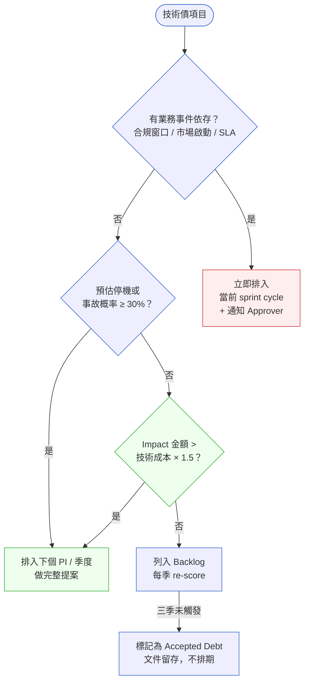

# 第 30 章 | Technical Debt 的 PM 語言：怎麼跟 Stakeholder 說

> **前置閱讀**：[Ch 29 — Build vs Buy vs Partner：邊界決策框架](./ch-29-build-buy-partner.md)
> **下游章節**：[Ch 31 — Platform Thinking：平台型產品的特殊挑戰](./ch-31-platform-thinking.md)
> **SA/SD 對照**：[SA/SD 第 33 章 — 架構決策紀錄（ADR）與架構知識管理](../../book/part-06-engineering/ch-33-adr-architecture-knowledge.md)
> ⸺ SA 視角關注決策的可追溯性與技術理由；本章關注同一個決策如何在不同受眾面前取得共識與預算。

---

## §30.1 冷觀察

季度規劃的第三天，下午兩點四十分，FastLend 的會議室裡空氣已經悶了。Meredith 把簡報翻到第七頁。那一頁只有一個標題、一個數字：「核心授信引擎重構——預估 12 週」。

她知道翻到這頁的瞬間，整桌人的注意力會掉下來。新功能那幾頁，大家會湊上前；技術債這一頁，大家會往後靠。她已經練習過要怎麼說了，她在電梯裡對著手機講了三遍。

CEO Wayne 坐在長桌另一端，目光落在那個「12 週」上停了兩秒。然後他把筆放下，往後靠進椅背，問了一句話：

> 「用戶感受得到嗎？」

會議室裡有人低頭看筆電。Sales 主管的手指在桌面上敲了兩下。Meredith 的喉嚨乾了一下——她準備的所有材料，都是為了回答「這個系統有多糟」，而不是「用戶感受得到嗎」。

她在腦子裡飛快過了一遍工程師 Lucas 在站立會上說的每一句話：2019 年的單體、每次部署要停機兩小時、信用評分模型現在是手工 patch 進去的、再不動它下一個新市場根本上不了……這些句子全是真的，但沒有一句是 Wayne 問的答案。

於是她做了那個當下看起來最誠實、事後看起來最致命的選擇。她說：「現在用戶感受不到，但六個月之後——」

Wayne 打斷她：「那就下季再說。」

議程往下走。第八頁是行銷檔期，全桌人重新坐直。

---

把這一刻按下暫停，換三個不同的 PM 站進去，會發生三種不一樣的事。

**A 型 PM——資訊型。** 她會把 Lucas 的清單講得更完整：單體、部署停機、手工 patch、循環依賴。她的直覺是「Wayne 沒批准，是因為他不夠了解技術細節」。於是她加碼技術細節。結果是 Wayne 更快地說出「聽起來工程的事，讓工程處理吧」。資訊不是越多越好；對著一個問「用戶感受得到嗎」的人倒更多技術細節，只會讓他更確信這不是他該管的事。

**B 型 PM——情緒型。** 他會把音量提高：「這是高風險項目，不做會出事的。」他賭的是危機感。但「會出事」「高風險」這種詞，決策者每週聽十次，已經免疫了。沒有數字、沒有時間框架的風險，等於一個可以無限期推遲的風險。Wayne 點頭，然後還是說下季再說。

**C 型 PM——翻譯型。** 她不會回答「這個系統多糟」，她會直接回答 Wayne 問的那個問題，並且把它接上 Wayne 真正在算的帳：「用戶現在感受不到。但 Q3 東南亞市場的合規接入，在現有架構上做不到——要嘛延半年，要嘛上線當天有四小時停機風險。我把『延半年』換算成首年收入，是 200 萬。重構成本是 12 週。這是一個 200 萬對 12 週的選擇，不是一個技術選擇。」

Meredith 那天當的是 A 型。她不是不努力，她是答錯了題。她回答了「系統有多糟」，而 Wayne 問的是「對我的帳本有什麼影響」。

---

那個場景在 FastLend 重複了四個季度。每次工程團隊提出技術債項目，它總是在 roadmap 排序中往下滑，被新功能、被 Sales 帶進來的客製化需求、被行銷季節檔期一次次擠出去。Lucas 後來說，那段時間他以為 PM 不在乎；但 Meredith 說，她知道 Lucas 在乎，她也在乎，她只是每次走進那個會議室，都沒辦法把那十二週換成 Wayne 能聽懂的語言。

三個季度後，授信引擎在一次批量跑單的夜晚崩潰。停機四小時。合規審計跟著進來。那次的直接成本是 80 萬，間接成本是下一個市場的啟動時間推遲了整整半年。

這不是工程師的失敗，也不是 CEO 的失敗。這是一個翻譯問題。工程語言描述的是風險與負債（Liability），業務語言描述的是機會與成本（Opportunity Cost）。技術債（Technical Debt）卡在中間，兩邊都說了，但沒有人把它們接起來。

本章要做的，就是把這座橋造出來。

---

## §30.2 真問題

把這個場景拆開來看，它有三層，每層都不一樣。多數 PM 只處理了第一層，就以為自己處理了全部。

### 表面需求（What）

表面上，Lucas 要的是一個十二週的技術債還款項目排入 roadmap。Meredith 要的是讓它通過季度規劃審核。Wayne 要的是一個「值得做」的理由。

看起來是優先級問題。但如果它真的只是優先級問題，那麼把分數算清楚、排進序列就解決了。它沒有被解決，代表問題不在這一層。

### 業務目標（Why）

再往下一層，真正的業務目標是：FastLend 需要在下一個合規窗口前擴展授信模型，而那個擴展在現有架構上的成本是「做不到，或者做到但每次都是噩夢」。

工程師描述的是「負債」：現在欠的錢，再不還就要複利。
業務窗口描述的是「機會成本」：六個月後的市場機會，如果架構跟不上，機會就消失了。

這兩件事是同一件事的兩個面——但在那個會議室裡，它們從來沒有被放在一起說過。

這裡值得把「資訊落差」攤開看清楚，因為這是整章的核心。下面這張表，左邊是 Wayne 在做決策那一刻**手上真正有的資訊**，右邊是 Meredith **腦子裡有、但從來沒翻譯出去的資訊**：

| 決策維度 | Wayne 手上有的（他據此決策） | Meredith 有但沒給出去的 |
|---|---|---|
| 急迫性 | 「六個月之後」——聽起來可以等 | Q3 合規窗口是**硬日期**（2026-09），不是模糊的「六個月後」 |
| 成本 | 「12 週」——一個純支出 | 不做的代價：80 萬停機期望損失 + 200 萬市場推遲損失 |
| 受益對象 | 「用戶感受不到」——對用戶沒好處 | 受益的是**合規通過、市場準入、核准率**，不是用戶體驗 |
| 風險型態 | 「系統很舊」——一個抽象的工程顧慮 | 批量跑單事故概率 + 合規審計附帶條件，兩個具體事件 |
| 可替代性 | 不知道有沒有別的做法 | 有 4 週 MVP 路徑（只做合規接入），但會累積後續債務 |

Wayne 的決策在他那一欄的資訊框架下，是**完全合理的**。一個只看到「12 週支出、用戶無感、六個月後」的 CEO，理應說「下季再說」。問題從來不在 Wayne 的判斷力，問題在右欄那五格資訊，沒有一格被搬到他面前。

但這裡有一個容易走錯的彎路：把右欄五格資訊全部搬給 Wayne，並不足以解決問題。假設 Meredith 在那個下午把五格都念出來——「Q3 合規窗口是硬日期」「期望損失 80 萬」「受益的是市場準入，不是用戶體驗」——如果她說這些話的方式仍然是「我們做了重構之後，停機窗口從兩小時降到零」，Wayne 的大腦依然會把它歸類為工程報告，而不是他的決策問題。資訊對了，但語言層錯了，Wayne 還是會往後靠進椅背。真正的缺口不在資訊數量，在資訊落在哪一層被接收：Wayne 的決策框架運作在「這件事如何影響我的帳本和市場時間表」這個層次，而不是在「工程做了什麼、用戶感不感受得到」的層次。這就是為什麼 Meredith 需要的不只是一份更完整的資料，而是一個能診斷「同樣的事實為何在不同層次說出來效果天差地別」的模型。

這就帶出本章最重要的一個區分——Output、Outcome、Impact 三層語言：

- **Output（產出）**：我們做了什麼。「重構授信引擎，12 週。」這是工程的語言。
- **Outcome（成果）**：行為怎麼改變。「部署頻率從每月一次變成每週，停機窗口從兩小時降到零。」這是產品的語言。
- **Impact（衝擊）**：業務指標怎麼動。「Q3 新市場準時啟動，合規審計不再有附帶條件。」這是 CEO / CFO 的語言。

Meredith 說的全是 Output。當 Wayne 問「用戶感受得到嗎」，他其實在問 Outcome 和 Impact。兩個人在同一個房間，說的卻是三層語言裡的不同層——一個在最底層，一個在最頂層，中間沒有電線把它們接起來。

### 決策瓶頸（Who × When）

第三層是決策責任的問題。

技術債還款這個決策，需要四個角色同時在場。這裡用 DACI（Driver / Approver / Contributor / Informed）來盤點：

| DACI 角色 | 在 FastLend 的人 | 問題所在 |
|---|---|---|
| **Driver（推進者）** | Meredith（PM） | 沒有把工程評估翻譯成業務語言 |
| **Approver（拍板者）** | Wayne（CEO） | 在資訊不完整的情況下說「下季再說」 |
| **Contributor（貢獻者）** | Lucas（工程）、法務合規 | 法務從未被拉進這個對話 |
| **Informed（被知會者）** | Sales、客戶成功 | 對架構風險一無所知，持續帶入新客製化需求 |

決策瓶頸不在 Wayne 身上。Wayne 做出了他能做的最合理決策——在他拿到的資訊框架下，「用戶感受不到」就等於「不重要」。

瓶頸在於：沒有人把「六個月後的合規風險」折算成 Wayne 決策需要的貨幣——時間、金錢、市場機會。

還有一個更隱蔽的 DACI 問題：這個決策的 Approver 其實不應該只有 Wayne。一筆牽涉「市場推遲收入 200 萬 + 合規罰款風險」的決策，CFO Serena 才是該共同拍板的人。但她從來沒在這個對話裡出現過。當一個技術債的真正衝擊落在財務和合規上，卻只對著 CEO 講「系統很舊」，等於把案子送到了錯的法庭。

這個翻譯工作，是 PM 的責任，不是工程師的責任，也不是 CEO 的責任。工程師的責任是把技術事實講準；CEO 的責任是在拿到完整資訊後拍板；把事實翻成決策貨幣、並確認對的 Approver 在場——這中間那一段，是 PM 一個人的活。

### 跨平台技術債的特殊複雜度

上面的 FastLend 案例是「單一產品線的技術債」——受影響的是同一個授信引擎，DACI 的 Approver 相對清晰。但現實中常見一種更複雜的情況：**基礎設施或共享服務的技術債，同時影響多個產品線**。

例如：FastLend 的身分驗證服務（IAM）同時被授信引擎、KYC 模組、後台報表使用。如果 IAM 累積了技術債，它的影響不是落在一個 PM 的 roadmap，而是散布在三個產品的速度和穩定性上。

這時 DACI 有幾個典型的失效模式：

- **Approver 競爭**：每個 PM 都主張「這應該排進我的競爭對手的 roadmap，而不是我的」，導致沒有人負責。
- **Impact 稀釋**：因為每個 PM 只看到自己的一塊影響，整體的業務衝擊被低估，TD Score 算不準。
- **貢獻者缺席**：共享服務的技術債往往需要基礎設施工程師主導，但在產品型 roadmap 討論中，他們不在場。

**跨平台技術債的處理原則：**

1. **畫債務影響地圖**：先把受影響的系統和對應的 PM / 業務線列出來（Debt Impact Map），讓 Impact 數字加總，而不是各算各的。
2. **指定技術債的 Driver**：當影響跨越多個 PM 時，需要一個明確的主導者（通常是平台 PM 或資深 PM）作為 Driver，不能依賴「自然協調」。
3. **Approver 上移一層**：跨平台的技術債，Approver 通常需要是 CTO 或 VP of Engineering，而不是個別產品線的 CEO 代理人。
4. **預算獨立一池**：如果組織有共享基礎設施的預算池，跨平台技術債應從那裡申請，而不是從任何一個產品的 roadmap 中扣。

---

## §30.3 決策框架

技術債的 PM 語言，不是「把工程報告翻成白話文」。那只是翻譯層。它還需要一個優先級框架，和一個提案結構，讓決策者能在正確的時間點做出有依據的決定。

本節不會給你「這個技術債該不該做」的答案——因為那個答案取決於你的業務脈絡。本節給你的是一套**判斷的方法**：怎麼看出急不急、怎麼算分、什麼時候分數有效、什麼時候分數該被推翻。

下面是這個框架的完整流程。

### 圖 A — PM 技術債溝通工作流程

```mermaid
flowchart TD
    T([觸發點：工程師提出技術債]):::cold
    A[工程評估輸入\n複雜度 × 風險 × 時程]:::cold
    B{是否有業務事件\n在 6 個月內觸發？}:::cold

    subgraph URGENT[緊急路徑]
      D1{事件類型？}:::hot
      D2[合規窗口\n→ 接入法務 + 設硬日期]:::hot
      D3[市場啟動\n→ 接入業務 + 反推工程起點]:::hot
      D4[SLA / 已發生事故\n→ 接入財務 + 算期望損失]:::hot
    end

    subgraph REGULAR[常規路徑]
      E1{是否有外部依賴\n或概率事件？}:::cold
      E2[列入下季 roadmap 候選\n每季 re-score]:::cold
      E3[標記 Accepted Debt\n文件留存]:::cold
    end

    C[業務翻譯\nOutput → Outcome → Impact]:::goal
    F[優先級評分\nTD Score = 風險 × 業務衝擊 ÷ 成本]:::goal
    G{TD Score ≥ 閾值\n且 Approver 在場？}:::goal
    H[準備一頁提案\nTD Proposal Card]:::goal
    I[排入下季 Discovery\n留追蹤記錄]:::cold
    J([輸出物：提案 + DACI 確認]):::goal

    T --> A --> B
    B -- 是 --> D1
    D1 --> D2 & D3 & D4
    D2 & D3 & D4 --> C
    B -- 否 --> E1
    E1 -- 是 --> E2 --> C
    E1 -- 否 --> E3
    C --> F --> G
    G -- 是 --> H --> J
    G -- 否 --> I

    classDef hot fill:#fee,stroke:#c33
    classDef cold fill:#eef,stroke:#36c
    classDef goal fill:#efe,stroke:#3a3
```



注意緊急路徑（紅）和常規路徑（藍）的分岔點：差別不在於技術債有多嚴重，而在於**有沒有一個業務事件在六個月內把它變成硬截止日**。同樣一個「2019 年單體」，在沒有合規窗口時是常規路徑的 backlog 項目；一旦 Q3 合規窗口出現，它瞬間跳到緊急路徑，並且要接入的不再只是工程，而是法務、業務、財務。緊急路徑的三條子分支——合規、市場、SLA/事故——各自對應不同的 Contributor 和不同的翻譯語言，不能混用。

### 業務翻譯的三層語言

工程師描述技術債的語言是準確的，但不是 CEO 或 CFO 的語言。翻譯不是讓工程語言變簡單，而是讓它接上業務決策的神經。

### Output → Outcome 的轉換

| 工程語言（Output） | 業務語言（Outcome） |
|---|---|
| 重構授信引擎，12 週 | 部署頻率：月 → 週；停機窗口：2h → 0 |
| 消除手工 patch 流程 | 信用模型迭代速度提升 3 倍 |
| 拆分單體為模組 | 新市場可在 4 週內接入，不需動核心 |

### Outcome → Impact 的接線

Outcome 是行為改變，Impact 是業務指標。把這兩層接上，才讓決策者看得到為什麼「現在做」和「下季做」是不同的選擇。

| Outcome | Impact |
|---|---|
| 部署頻率提升 | Q3 新市場準時啟動（=估算 40 萬收入窗口） |
| 停機窗口降到零 | 合規審計不再有附帶條件；避免罰款風險 |
| 模型迭代速度 × 3 | 風控準確率可在三個月內提升，直接影響核准率 |

### 如何從第一原則算出財務衝擊

上面表格裡的數字（80 萬、200 萬）不是 PM 拍腦袋的。把「怎麼算」說清楚，是讓數字在 CFO 面前站得住腳的唯一方式。下面是三類衝擊的標準計算路徑，以及需要向誰取數：

**A. 停機期望損失**

```
期望損失 = 停機概率（年化） × 單次停機直接損失
單次停機直接損失 = 停機小時數 × 每小時業務吞吐量 × 平均票面
```

- 停機概率：從過去 12 個月的事故記錄推算；如果沒有記錄，讓工程師給一個保守估計（20–40%）
- 業務吞吐量：向 Data 或業務運營取「峰值每小時處理筆數」
- 平均票面：向業務或 Finance 取

FastLend 的計算：停機概率 40%（事故記錄推算）× 停機 4h × 批量筆數 5000 筆/h × 平均票面 100 元 ≈ 80 萬。

> **Finance 協作檢查清單**：在你拿著數字進會議室之前，確認以下四件事至少有一件有 Finance 背書：(1) 停機概率來自 IT Risk 記錄而非 PM 估算；(2) 業務吞吐量來自 BI 系統而非工程直覺；(3) 平均票面來自 Finance 系統而非業務直覺；(4) 市場機會損失由 Finance 或 Strategy 用前兩個市場數據推算，而非 PM 拍定。四件事都是 PM 估的，數字的可信度在 CFO 面前會大幅打折。

**B. 合規罰款風險**

```
合規風險成本 = 罰款上限 × 違規概率 + 法律與稽核費用（固定）
```

- 罰款上限：向法務取，通常有監理文件可查
- 違規概率：法務 + 工程共同評估

**C. 市場機會損失**

```
市場損失 = 推遲月數 × 新市場月均收入（前兩個市場的實際數據推算）
```

- 向 Finance 或 Strategy 取「前兩個市場首年月均收入」，用保守值（P25 分位）
- 不要用最樂觀情境，CFO 會直接質疑

**三個計算的共同原則**：用保守值，說明計算假設，讓 CFO 能夠反駁你的輸入而不是反駁你的邏輯。一個可以被反駁的假設是健康的；一個黑箱數字是危險的。

---

### Discovery Spike 決策規則：在提案前先測不確定性

TD Proposal Card 的欄 5 有一個「信心度」欄位。這個欄位決定了提案能不能成立。

**當工程信心度為「低」時，不應該直接提完整提案。** 原因很簡單：如果 12 週這個數字有 ±50% 的不確定性，那麼財務計算的前提就不穩固。Approver 批准了一個「12 週」，結果變成「24 週」，比沒提案更傷。

**Discovery Spike 規則**：

| 工程信心度 | 定義 | 對應動作 |
|---|---|---|
| 高 | 關鍵依存已識別，有同類重構先例，P90 估算偏差 < 20% | 直接準備完整提案 |
| 中 | 主要架構已了解，但有 1–2 個未驗證的外部依存 | 做 1 週 spike 驗證依存點，再提案 |
| 低 | 範圍模糊，有多個未知技術風險，估算基礎不足 | 先做 2 週 spike，確認範圍和依存後再估算，再提案 |

**Spike 的 Timebox 結構**：

```
Spike 目標：驗證 [具體技術問題]，例如「KYC 模組的 API 相容性」
Timebox：1–2 週（不延長）
輸出物：
  - 依存清單（已確認 / 仍有風險 / 不需要）
  - 更新後的工程估算（P50 / P90）
  - 建議：繼續完整提案 / 縮小範圍至 MVP / 擱置
```

Spike 的結果，直接寫進 TD Proposal Card 的欄 5，讓工程信心度有來源可查，而不是 PM 和工程師口說無憑。

---

### 圖 B — 技術債優先級決策樹



---

### 優先級評分矩陣

一個好用的拇指法則是用 TD Score（Technical Debt Score，技術債評分）做初篩：

```
TD Score = (業務衝擊分 × 事件機率) ÷ 工程成本分
```

| 維度 | 1 分 | 3 分 | 5 分 |
|---|---|---|---|
| **業務衝擊** | 僅影響工程流程 | 影響某個產品線的速度 | 影響合規、市場準入、或 SLA |
| **事件機率** | < 10%（六個月內） | 30–60% | > 60% 或有確定業務事件 |
| **工程成本** | < 2 週 | 2–8 週 | > 8 週 |

> 註：事件機率在公式中以小數代入（10% → 0.1、60% → 0.6、確定事件 → 1.0），業務衝擊與工程成本以 1/3/5 分代入。

閾值建議（供調整）：

- TD Score ≥ 2.0 → 列入正式提案，當季溝通
- TD Score 1.0–1.9 → 列入下季 Discovery
- TD Score < 1.0 → Accepted Debt，文件留存

**三個評分帶的實作範例**

光看公式不容易抓到手感，下面用三個具體項目走一遍評分，並且看它落在哪個帶、該怎麼處理：

| 技術債項目 | 業務衝擊 | 事件機率 | 工程成本 | TD Score | 落點與處置 |
|---|---|---|---|---|---|
| 授信引擎合規接入（FastLend） | 5（合規/市場準入） | 1.0（Q3 是硬日期） | 3（12 週） | (5×1.0)÷3 ≈ **1.67** | 1.0–1.9 帶：列入下季正式提案、當季溝通 |
| 報表服務 N+1 查詢拖慢後台 | 3（影響某產品線速度） | 0.3（旺季可能拖垮） | 1（< 2 週） | (3×0.3)÷1 = **0.9** | < 1.0 帶：原本要進 Accepted Debt，但成本極低——**見下方覆寫規則** |
| 內部工具老舊的測試框架 | 1（僅工程流程） | 0.1（無外部事件） | 5（> 8 週） | (1×0.1)÷5 = **0.02** | < 1.0 帶：Accepted Debt，文件留存，不排期 |

第二個項目示範了 TD Score 的一個盲點：分數低不代表不該做。當工程成本極低（< 2 週）時，即使分數低於閾值，把它順手清掉的性價比往往很高——這時應該讓它搭新功能的便車，而不是教條地丟進 Accepted Debt。**分數是初篩，不是判決。**

### TD Score 什麼時候有效，什麼時候該被推翻

這是最常被忽略的一段。TD Score 是一個排序工具，它**假設了一個健全的決策結構存在**。當這個假設不成立時，分數再高也沒有意義。三個覆寫規則：

1. **Approver 缺席 → 分數無效。** 如果這個決策真正的拍板者（例如牽涉財務風險時的 CFO）不在場，那麼算出 TD Score = 3.0 也沒用——因為沒有人能把它變成預算。此時 PM 的第一動作不是優化提案，是**先把對的 Approver 拉進 DACI**。一個高分提案送到沒有拍板權的人面前，等於沒送。

2. **成本極低 → 分數讓位給性價比。** 如上面第二個範例，工程成本 < 2 週的項目，順手做掉常常比走完整提案流程更划算。

3. **有硬性外部事件 → 事件凌駕分數。** 合規硬日期、客戶合約 SLA、監理要求——這些不進公式，它們直接把項目推上緊急路徑。你不會對一個「90 天後生效的監理規定」去算 TD Score，你直接排它。

換句話說：**DACI 的角色清晰度，是 TD Score 能不能生效的前提條件。** 先確認 Approver 在場、責任分清，分數才有意義。順序錯了，再精準的分數都是空轉。

### 替代方案框架：不只 MVP，而是有標價的選擇題

技術債提案常見的錯誤是只呈現「做 vs. 不做」的二元選擇。這會逼 Approver 做一個不舒適的決定。更好的做法是**把選項做成三選一，每個選項附上代價**，讓決策者選的是一個有標價的選擇題，而不是站在懸崖邊做一個跳不跳的選擇。

**替代方案的三層結構**：

| 選項 | 做什麼 | 工程成本 | 業務影響 | 殘餘債務 |
|---|---|---|---|---|
| **完整重構** | 全面現代化授信引擎 | 12 週 | 完全解鎖 Q3 合規 + 速度提升 | 無 |
| **MVP 路徑** | 僅完成合規接入介面 | 4 週 | 解鎖 Q3 合規，速度問題留到 Q4 | 仍需 Q4 完整重構，整體成本 +30% |
| **接受債務** | 不動，增加監控與人工流程 | 2 週（監控建設） | Q3 合規接入有風險，速度問題持續 | 全部殘留，停機概率維持 40% |

這個框架的設計邏輯：**選項 3（接受債務）不是「不做」，而是一個有成本的主動決策**——建設監控、培訓人工流程、承擔更高的停機概率。把「不做」的代價也量化，Approver 才知道「不做」不是免費的。

---

### If-Then 框架：技術債溝通節奏

在不同情境下，技術債的溝通節奏和切入角度不同：

- **If** 合規審計窗口在 90 天內 → **Then** 立即通報 Approver，技術債升級為合規風險，準備「不做的法律後果」一頁紙
- **If** 新功能依賴受影響的舊模組 → **Then** 先做影響評估，把技術成本加進新功能估算，不要把重構和新功能拆開報告
- **If** 工程師由下而上提出技術債 → **Then** 協助工程師做業務翻譯，PM 共同掛名提案，翻譯不等於稀釋，準確度比好聽重要
- **If** Stakeholder 主動問「我們有多少技術債？」 → **Then** 給分級快照（high/medium/low），不要給清單，以速度、穩定性、合規三類呈現業務影響
- **If** 技術債導致已發生事故 → **Then** 事後 30 天內提還款計畫，附帶成本回顧，從事故往前推說明哪個決策點是轉折
- **If** 組織是早期新創（< 30 人，無正式 CFO/CEO 職稱）→ **Then** Approver 通常是 CTO 或聯合創辦人；財務衝擊用「下一輪融資估值影響」或「能否準時交付給主力客戶」替代正式損益計算；DACI 角色可以一人兼多角，但必須明確點名

---

## §30.4 踩坑清單

技術債的 PM 語言有幾個固定的失誤模式。現場很常出現，不是因為 PM 不夠認真，而是因為這些情境的直覺反應幾乎都是錯的。每個反模式後面附了一個**現場頻率估計**（基於作者輔導團隊的觀察，非嚴格統計），幫你判斷哪些坑最該優先繞開。

---

**反模式：用工程詞彙做業務報告**（現場頻率：極高，幾乎每個未受訓 PM 都犯過）

現象：提案裡有「服務拆分」「資料庫正規化」「循環依賴」等詞，CEO 聽完說「聽起來很重要，讓工程自己處理吧」，然後預算沒有核。

根因：工程師提供的語言直接貼到 slide 上，沒有做業務轉換。受眾不懂這些詞，但不好意思說不懂，所以轉換成「交給工程決定」作為出口。

> 修正方向：每個技術術語旁邊配一個業務後果句。「循環依賴」→「每次改 A 模組，B 也要跟著測，每次部署額外多八小時工程時間」。後果句出現，受眾才有判斷基礎。

---

**反模式：把風險講得太抽象**（現場頻率：高）

現象：提案裡寫「未來可能影響系統穩定性」「長期維護成本偏高」，Stakeholder 點頭，但排序沒有動。

根因：「可能」和「未來」是決策者可以合理推遲的詞彙。模糊的風險等於沒有風險。

> 修正方向：給具體數字和時間框架。「在現有架構下，下一個合規週期的接入工作估計需要額外六週，以 Q3 市場計畫為例，這等於窗口縮小到不夠用。」具體後，「下季再說」就沒有容身之處。

---

**反模式：一次提太多技術債**（現場頻率：中高）

現象：PM 準備了一份十五個技術債項目的清單，進會議室。CEO 看了一眼說「我們工程是有多亂」，然後把整份清單打回去要工程先整理。

根因：清單不是提案。清單讓人覺得問題沒有被消化，只是被轉發。

> 修正方向：每次提案只帶一個或最多兩個項目，附帶業務理由和優先依據。其他項目在提案附錄裡「備查」，而不是「待辦」。讓決策者感覺到問題被篩選過，不是被丟給他們。

---

**反模式：不讓工程師進提案現場**（現場頻率：中）

現象：PM 翻譯完之後，自己獨自進 stakeholder 會議，回來說「他們想多了解工程面」，但當時 Lucas 不在場。

根因：PM 擔心工程師說出太多技術細節，讓會議失焦。這個擔心本身是合理的，但解法不是讓工程師缺席。

> 修正方向：工程師進場，但提前協商誰說什麼。PM 負責業務框架，工程師負責在被問到時回答「可行性」和「信心度」，不展開技術細節。讓工程師在場，等於讓決策者知道這個數字不是 PM 自己估的。

---

**反模式：事故後立刻要重構預算**（現場頻率：中，但殺傷力最大）

現象：停機事故發生三天後，PM 帶著重構提案進會議室，被 CEO 說「現在是傷口還在的時候，你就要錢？」

根因：事故剛發生時，組織情緒在「止血」和「追責」模式，不是在「系統改善」模式。這個時間點提預算，會被解讀為趁亂要資源。

> 修正方向：事故後先做 30 天的 post-mortem 和穩定化，等情況回到正常節奏，再提「防止下一次」的系統改善計畫。用「防範」框架，不用「修復」框架。這兩個提案的成功率差距很大。

---

**反模式：只記錄、不行動（Over-documenting without acting）**（現場頻率：高，尤其在重視文件的組織）

現象：PM 維護了一份精美的技術債登記表，每季更新、分類齊全、顏色標示一應俱全。但連續四季，沒有任何一個項目從「登記」走到「排期」。

根因：記錄技術債讓人產生「我在管理它」的錯覺。但登記不是還款，盤點不是行動。一份越來越長、永遠不動的清單，本身就是一種債——它消耗 PM 的時間，卻不改變任何結果。

> 修正方向：每張技術債登記都要綁一個「觸發條件」和「過期日」。每季 re-score 時，問的不是「這還在嗎」，而是「它還在 backlog 是因為觸發條件未到，還是因為我們在迴避決策」。三季未觸發的，明確降級為 Accepted Debt，從活躍清單移除——讓清單短，比讓清單全更重要。

---

**反模式：把所有技術債一視同仁（Treating all tech debt equally）**（現場頻率：中高）

現象：PM 在排序時，把「測試框架老舊」和「合規模組會在 Q3 卡關」放在同一個優先級會議裡用同一套標準討論，結果不是兩個都做，就是兩個都拖。

根因：技術債不是一個同質的類別。合規型債有硬日期、穩定性型債有概率、速度型債有累積利息——它們的決策貨幣完全不同。用一套標準衡量，等於把急診和健檢排進同一條隊伍。

> 修正方向：先分類，再排序。用三分類法把技術債拆成「速度（拖慢迭代）／穩定性（事故風險）／合規（外部硬約束）」，每一類用不同的觸發邏輯：合規型看日期、穩定性型看概率、速度型看累積成本。分完類，TD Score 才量得準。

---

**反模式：把技術債當成純工程事務（Missing the product lens）**（現場頻率：高）

現象：PM 收到工程師的技術債清單，把它轉交給 CTO，說「這是工程的事，你們決定」。

根因：PM 把技術債誤判為「工程內部的事」，認為自己只需要在需要預算的時候出面。事實上，技術債的每一個「何時還、還多少、怎麼排優先級」，都是業務與工程的交叉決策，缺少 PM 的業務視角，工程師無法判斷哪個債最值得先還。

> 修正方向：PM 不是技術債的執行者，但必須是技術債的**業務翻譯者和優先級框定者**。每季至少做一次和工程的「技術債盤點」，問的不是「有什麼技術問題」，而是「哪些技術問題會影響下一個業務里程碑」。這個問題只有 PM 能問，因為只有 PM 知道下一個業務里程碑是什麼。

---

**反模式：接受的債從不重新審視（Zombie Accepted Debt）**（現場頻率：中，但隱蔽性最強）

現象：PM 在一年前把一個技術債標記為「Accepted Debt」，從此消失在 backlog 深處。業務環境已經完全改變——合規要求更新、新客戶帶來新 SLA——但這個「殭屍債務」從未被重新拿出來評估。

根因：「Accepted Debt」讓人誤以為這個決定是永久的。事實上，接受技術債是一個**有條件的暫緩決策**，條件改變時，決定應該重新評估。

> 修正方向：每一筆 Accepted Debt 在登記時，必須寫明「重新評估觸發條件」，例如「當年度合規要求更新」「當新客戶 SLA 要求 99.9% uptime」。每季 re-score 時，先看觸發條件有沒有改變，再決定是否升級處理。**Accepted Debt 不是墓碑，是附條件的緩期執行。**

---

### PM 溝通反劇本：對不同角色，什麼話千萬別說

同一個技術債，對 CEO、CFO、CTO 要講的不是同一句話。下面這張「反劇本」列出對每類角色的典型錯誤開場，以及它為什麼會失敗：

| 對象 | 不要說（錯誤開場） | 為什麼失敗 | 改成 |
|---|---|---|---|
| **CEO** | 「我們的系統有嚴重的技術債，架構很老舊。」 | CEO 不買「系統狀態」，他買「對成長/市場的影響」。這句話對他是雜訊。 | 「Q3 東南亞市場，現有架構上不去。延半年等於 200 萬收入窗口。」 |
| **CFO** | 「這個重構很重要，能提升我們的工程效率。」 | 「重要」「效率」不是財務語言。CFO 要的是金額、概率、回收期。 | 「不做的期望損失是停機 80 萬加合規罰款風險；做的成本是 12 週。」 |
| **CTO / 工程主管** | 「業務說這個不急，我們先放著。」 | 對工程主管把技術風險講軟，會失去工程的信任，下次他不會再老實告訴你風險。 | 「我同意它有風險。我需要你幫我把『不做的概率與後果』量化，我來翻譯成業務帳。」 |
| **Sales 主管** | 「我們要花 12 週還技術債，這季新功能會少。」 | Sales 聽到「少功能」只會抗拒。他不關心債，關心能不能賣。 | 「做完這個，新市場客戶 4 週能接入；不做，每筆客製化要多等三週。」 |
| **創辦人 / 早期新創** | 「TD Score 是 1.67，應該排進 Q2。」 | 創辦人不看分數，看「這影不影響我下個月的交付承諾和下一輪融資故事」。 | 「這個問題如果不在 Demo Day 前處理，主力客戶整合時會卡 4 週。那時候很難解釋。」 |

這張表的共同邏輯只有一句：**先問對方用什麼貨幣記帳，再決定你要講哪一層語言。** CEO 用成長記帳，CFO 用金額記帳，CTO 用風險記帳，Sales 用成交記帳，創辦人用「下一個重要節點能不能達到」記帳。對著用 A 貨幣的人講 B 貨幣，再正確的內容都會被當成雜訊。

---

## §30.5 交付清單 ⸺ 一頁式 TD Proposal Card 模板

技術債溝通的核心交付物是一張一頁的提案卡（TD Proposal Card，技術債提案卡）。它的作用是讓 PM 在任何對話（從走廊偶遇到正式提案）都能用同一份材料切入，並且讓工程師和 stakeholder 看的是同一張紙。

````markdown
# TD Proposal Card
> 版本:v0.1 | 撰寫日期:YYYY-MM-DD | 擁有人:{名字}

### 1. 技術債名稱
{簡短名稱，< 10 字}

### 2. 業務事件觸發
{哪個業務計畫、合規窗口、或市場目標會在什麼時間點受到影響？}

### 3. 不做的代價（Outcome / Impact）
{停機風險估算：[期望損失 = 停機概率 × 單次損失]}
{速度損失估算（每個 sprint 多付出的工程時間）：}
{市場機會損失（如有）：}
{計算假設來源：Finance / 歷史事故記錄 / 工程估算}

### 4. 做完之後能解鎖什麼
{Outcome：使用者/工程行為改變}
{Impact：業務指標改變}

### 5. 工程評估摘要
{工程成本：X 週 / Y 人}
{信心度：高 / 中 / 低（附理由）}
{是否需要 Discovery Spike：是（建議 N 週）/ 否}
{主要依存：哪些其他系統受影響}

### 6. 優先建議
{TD Score：}
{建議時程：本季 / 下季 / Accepted Debt}
{Accepted Debt 重新評估觸發條件：}
{DACI：Driver: PM / Approver: {待填} / Contributors: 工程、法務 / Informed: Sales}

### 7. 替代方案（三選一）
| 選項 | 做什麼 | 工程成本 | 解鎖業務影響 | 殘餘債務 |
|---|---|---|---|---|
| 完整重構 | ... | ... | ... | 無 |
| MVP 路徑 | ... | ... | 部分解鎖 | 整體成本 +X% |
| 接受債務 | 增加監控 + 人工流程 | ... | 維持現狀 + 風險 | 全部殘留 |

### 8. 實施後衡量（Post-Implementation）
{衡量指標：}
{基線（現在）：}
{目標（完成後 30 天）：}
{再衡量時間點：完成後 30 / 60 / 90 天}
{如果 60 天結果不如預期，觸發什麼行動？}
````

這張卡設計為一頁 A4 或一個 slide。**新增欄 8（實施後衡量）** 是本版相對舊版的關鍵改動：技術債提案常見的失誤是「獲得預算之後就消失了」，Approver 三個月後不知道做了有沒有效，等於讓你下一次提技術債的可信度打折。欄 8 讓這個提案在通過後仍然有責任鏈。

把它存在 `docs/tech-debt/`，跟程式碼同 repo，跟 README 同層。

---

### §30.5.1 範例：FastLend 授信引擎重構提案

要看懂「對的提案卡」長什麼樣，得先看「錯的版本」長什麼樣。下面先還原 Meredith 第一次被 Wayne 打斷的那版材料，再看她三季後重做的版本。

**先看被打回的版本（Q1 的口頭提案，標註出哪裡出錯）**

> 「我們的核心授信引擎是 2019 年的單體架構。每次部署要停機兩小時，信用評分模型現在是手工 patch 進去的，技術債越積越多。工程估計重構要 12 週。如果再不處理，未來系統穩定性會有風險。」

| 這句話 | 出了什麼問題 |
|---|---|
| 「2019 年的單體架構」 | 純 Output / 技術狀態，CEO 無法換算成決策貨幣 |
| 「停機兩小時、手工 patch」 | 工程細節，沒有業務後果句接住 |
| 「12 週」 | 只給了成本，沒給「不做的代價」做對照 |
| 「未來系統穩定性會有風險」 | 抽象風險——「未來」「會有」可以無限期推遲 |
| 通篇 | 沒有業務事件、沒有金額、沒有 Approver（CFO 缺席） |

這版的致命傷不是內容不真實，而是它**整段停留在 Output 層**，沒有一個字爬到 Outcome 或 Impact。Wayne 的「用戶感受得到嗎 → 下季再說」，是這段話的必然結果。

**再看重做的版本（Q5，事故滿 30 天後）**

````markdown
# TD Proposal Card
> 版本:v0.1 | 撰寫日期:2026-02-15 | 擁有人:Meredith（PM）

### 1. 技術債名稱
授信引擎現代化
<!-- 欄位註解：名稱要讓人知道它改的是哪個系統、做的是什麼動作；
     「技術重構」或「系統改善」太抽象，六個月後沒人記得這張卡說的是什麼。 -->

### 2. 業務事件觸發
Q3 東南亞合規接入窗口（2026-09）需要授信模型支援多幣別評分規則；
現有架構需要停機接入，估計週期 8 週以上，Q3 啟動不可行。
<!-- 欄位註解：把「業務事件」和「技術限制」放在同一句，
     決策者才能看到它們之間的關係，而不是把它們當成兩件不相干的事。 -->

### 3. 不做的代價（Outcome / Impact）
<!-- 為什麼這欄：把「不做」的成本換算成金額，決策者才能做 ROI 對比而非憑感覺 -->
停機風險估算：每批量跑單事件期望損失 ≈ 80 萬
  計算：停機概率 40%（IT Risk 記錄）× 4h × 5000筆/h × 票面100元
  來源：Finance Serena 確認業務吞吐量；IT Risk 確認概率
速度損失：每個部署週期工程額外 16 小時（每月損失約 32 工時）
市場機會損失：Q3 東南亞啟動推遲估算影響首年收入 200 萬
  計算：前兩個市場首年月均 40 萬 × 推遲 5 個月（保守 P25 估算）
  來源：Finance Serena 用泰國/印尼市場實際數據推算

### 4. 做完之後能解鎖什麼
Outcome：部署頻率月 → 週；停機窗口 2h → 0；信用模型迭代 3x
Impact：Q3 合規接入如期；風控準確率提升預計改善核准率 5–8pp；
        合規稽核移除附帶條件

### 5. 工程評估摘要
工程成本：12 週 / 2 人核心 + 1 人合規介面
信心度：高（Lucas 已完成 2 週 spike，主要依存已識別）
Discovery Spike：已完成；spike 確認 KYC 模組相容性，工程估算置信度高
主要依存：風控評分服務 v1.3、KYC 驗證模組

### 6. 優先建議
<!-- 為什麼這欄：Approver 必須具名到人；這格空著，提案永遠沒人拍板 -->
TD Score：(5 × 1.0) ÷ 3 ≈ 1.67 → 排入下季 PI 正式提案
建議時程：Q2 2026 開始，Q3 啟動前完成
Accepted Debt 觸發條件：N/A（已升級為正式提案）
DACI：Driver: Meredith（PM）/ Approver: Wayne（CEO）+
      CFO Serena / Contributors: Lucas, 法務合規 Chen /
      Informed: Sales Lead, 客戶成功團隊

### 7. 替代方案（三選一）
| 選項 | 做什麼 | 工程成本 | 解鎖業務影響 | 殘餘債務 |
|---|---|---|---|---|
| 完整重構 | 授信引擎全面現代化 | 12 週 | 完全解鎖 Q3 合規 + 速度提升 | 無 |
| MVP 路徑 | 僅完成合規接入介面 | 4 週 | Q3 合規解鎖，速度問題殘留 | Q4 仍需完整重構，整體成本 +30% |
| 接受債務 | 增加批量監控 + 人工備援流程 | 2 週 | Q3 合規接入有風險，速度問題持續 | 全部殘留；停機概率維持 40% |

### 8. 實施後衡量（Post-Implementation）
衡量指標：
  - 部署頻率（次/月）
  - 停機事件次數（次/季）
  - Q3 東南亞合規接入如期完成（是/否）
  - 核准率變化（pp）
基線：部署 1 次/月；停機 2 次/季；核准率 62%
目標（完成後 30 天）：部署 ≥ 3 次/月；停機 0 次；Q3 準時啟動
再衡量時間點：完成後 30 / 60 / 90 天
60 天未達標觸發行動：Lucas + Meredith 聯合 post-mortem；評估是否需要追加工程資源
````

**兩版並排：同一個技術債，談判怎麼翻轉**

| 維度 | Q1 被打回版 | Q5 通過版 |
|---|---|---|
| 切入語言 | Output（系統很舊） | Impact（Q3 市場 + 200 萬） |
| 急迫性 | 「未來」「會有風險」 | 硬日期 2026-09 |
| 成本對照 | 只有 12 週支出 | 12 週 vs. 80 萬 + 200 萬 |
| 財務數字來源 | PM 口說 | Finance Serena 背書 |
| Approver | 只有 Wayne | Wayne + CFO Serena |
| 工程可信度 | PM 轉述 | 附 spike 結果 + Lucas 在場 |
| 選項 | 二選一（做/不做） | 三選一（含 4 週 MVP + 接受債務標價） |
| 實施後追蹤 | 無 | 30/60/90 天衡量指標 + 未達標觸發機制 |
| 結果 | 「下季再說」 | 20 分鐘通過 |

最關鍵的差別不在資訊量——兩版講的是同一個系統、同一個工程估算。差別在於 Q5 版把每一格資訊都翻到了決策者的貨幣上，並且把對的 Approver 拉進了房間。

**現場：那 20 分鐘裡發生了什麼**

提案卡只是材料，真正的翻轉發生在會議室的即時對話裡。值得看 Meredith 怎麼在當下接住問題：

Wayne 看完欄 3，問的第一句是：「這 200 萬怎麼算的？」——這是 CFO 該答的問題，於是 Meredith 沒有自己硬撐，她轉向 Serena：「Serena 用東南亞前兩個市場的首年數據推的，要不要她說明？」**把財務數字交給財務的人背書，PM 不假裝自己什麼都懂——這是讓數字可信的關鍵動作。**

接著 Wayne 轉向 Lucas：「12 週你有多少把握？」Lucas 沒有展開架構細節（這是事前協商好的），只回答：「spike 做完了，主要依存都識別了，信心度高。風險在 KYC 模組的相容性，那部分我留了緩衝。」**工程師只答可行性和信心度，不講技術——這讓 12 週這個數字有了來源，而不是 PM 拍腦袋。**

唯一真正卡住的一刻：Sales 主管插話「那這季新功能不就少了？」——這是 Q1 版會翻車的地方。但這次 Meredith 接住了：「4 週 MVP 路徑可以先解合規，不擋你這季的客製化需求；但 Q4 還是要還，整體成本會多 30%。要選哪條，這裡有三個選項。」**她沒有為新功能 vs. 技術債吵架，她把它變成一個有標價的選擇題，丟回給 Approver。**

Wayne 最後問的問題，已經不是「用戶感受得到嗎」，而是：「Q3 不動的話，東南亞確定無法啟動？」

Meredith 說是。

會議在二十分鐘後通過了這個提案。同一個 PM、同一個工程估算、同一個 CEO——變的只是材料的語言層級，和房間裡坐對了人。

---

### 技術債健康度追蹤：債務速度儀表板

提案獲批只是開始。一個成熟的 PM 需要定期告訴組織「我們的技術債整體在好轉還是惡化」。這不是工程師的責任，是 PM 對組織健康的業務責任。

**季度技術債速度報告（Debt Velocity Report）**

每季需要追蹤兩個核心指標的比率：

| 指標 | 計算方式 | 健康閾值 |
|---|---|---|
| 債務積累率 | 本季新增技術債故事點 / 本季總開發故事點 | < 15% |
| 債務還款率 | 本季已清償技術債故事點 / 期初活躍技術債故事點 | > 20% |

**解讀象限**：

```
                高還款率
                    |
   負債縮小 ←————|————→ 清舊但未停止積累
 (健康)       |          (需要源頭管控)
              |
低積累率 ————|———————————————— 高積累率
              |
   有控制的緩慢積累 |   失控（必須干預）
 (可接受)     |          (危險）
                    |
                低還款率
```

**實作方式**：不需要精確的故事點，PM 可以用簡化版：每季盤點「新增了幾個活躍技術債登記 vs. 關閉了幾個」。趨勢方向比精確數字更重要——如果連續兩季新增 > 關閉，就是一個需要向 CTO 示警的訊號，不需要等到事故才說。

---

## §30.6 Recap

讀完本章，你應該已經能做到：

- [ ] 把工程師的技術債描述，翻譯成 Output / Outcome / Impact 三層業務語言
- [ ] 用財務計算三步驟（停機期望損失 / 合規罰款風險 / 市場機會損失）建構可被 Finance 背書的數字
- [ ] 在工程信心度低時，決定是否先做 Discovery Spike，再提完整提案
- [ ] 用 TD Score 矩陣做初篩，並判斷什麼時候分數有效、什麼時候該被 DACI 推翻
- [ ] 識別技術債的業務事件觸發點（合規窗口、市場啟動、SLA 依存），分辨緊急路徑與常規路徑
- [ ] 準備一張一頁的 TD Proposal Card（含三選一替代方案 + 實施後衡量指標），讓不同受眾看同一份材料做決定
- [ ] 對 CEO / CFO / CTO / Sales / 創辦人各用對的決策貨幣，避免反劇本裡的典型錯誤
- [ ] 用 DACI 明確點出誰是 Approver、誰必須在什麼時間點到位；處理跨平台技術債時，知道 Approver 該上移一層
- [ ] 用季度債務速度報告追蹤組織技術債整體是在改善還是惡化
- [ ] 識別 Zombie Accepted Debt 並設定重新評估觸發條件，讓「接受債務」是有條件的暫緩，而不是永久棄置

回到開頭那個會議室：Meredith 第一次失敗，不是因為她不努力，是因為她答錯了題。她後來贏，也不是因為她變強硬，是因為她學會了在走進房間前就問自己一句：「我要說服的人，用什麼貨幣記帳？」

如果先挑一項做，建議是製作一張 TD Proposal Card 給目前 backlog 裡評分最高的技術債項目——有了那一張卡，下一次被問到「為什麼現在要做這個」的時候，答案已經在你手上，而你會知道該把它念給房間裡的哪一個人聽。

---

## Cross-References

- **前一章**：[Ch 29 — Build vs Buy vs Partner：邊界決策框架](./ch-29-build-buy-partner.md) ⸺ 技術債優先級評分接續 roadmap 取捨的整體方法論
- **下一章**：[Ch 31 — Platform Thinking：平台型產品的特殊挑戰](./ch-31-platform-thinking.md) ⸺ 從本章的「PM 翻譯業務語言給 stakeholder」延伸到「PM 翻譯需求語言給工程師」
- **SA/SD 對照**：[SA/SD Ch 33 — 架構決策紀錄（ADR）](../../book/part-06-engineering/ch-33-adr-architecture-knowledge.md) ⸺ SA 用 ADR 記錄技術決策的可追溯性；本章關注同一決策如何通過 PM 語言取得預算與共識
- **SA/SD 對照**：[SA/SD Ch 34 — 架構適應度函式](../../book/part-06-engineering/ch-34-fitness-functions.md) ⸺ SA 用量化指標偵測架構劣化；本章把劣化訊號翻譯成 PM 能帶進提案的業務語言
- **SA/SD 對照**：[SA/SD Ch 35 — FinOps、永續工程與綠色軟體](../../book/part-06-engineering/ch-35-finops-green-software.md) ⸺ 技術債的財務成本與 FinOps 可觀測性框架有直接接點
