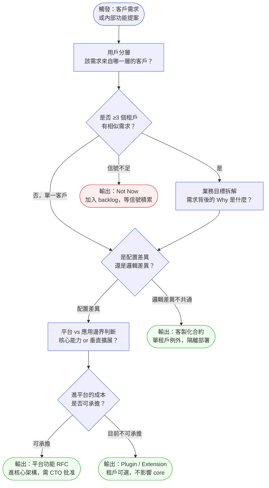
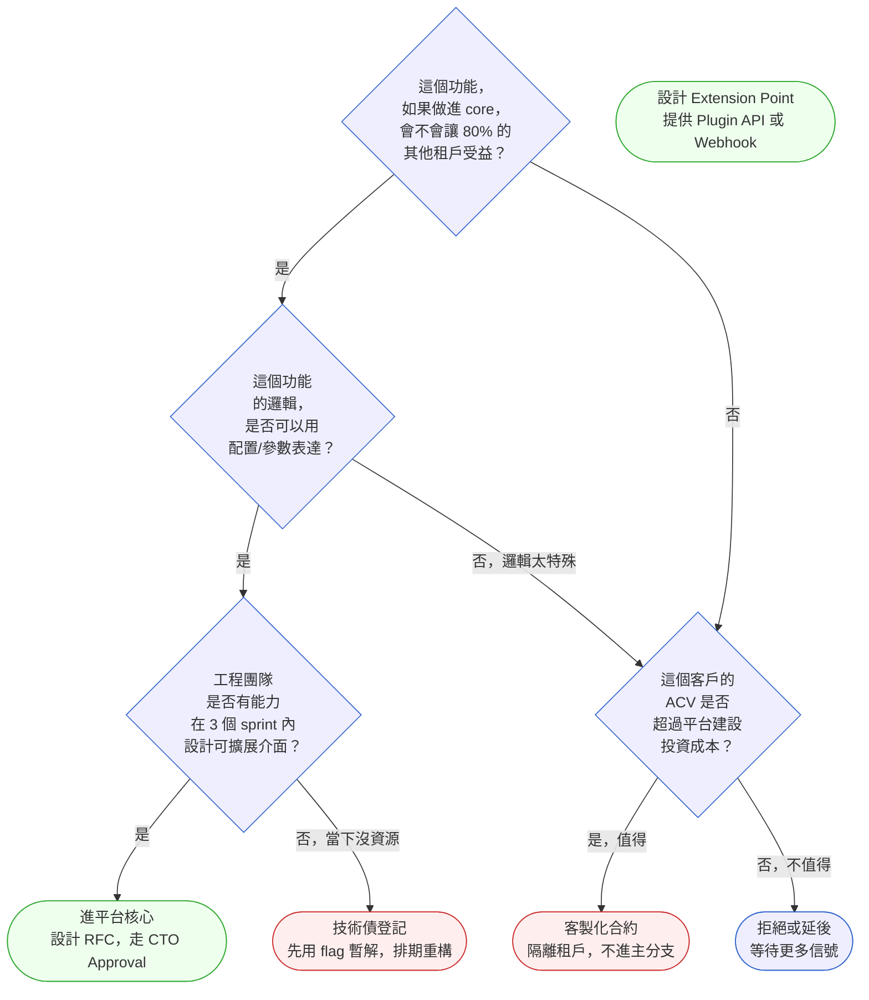

# 第 31 章 | Platform Thinking：平台型產品的特殊挑戰

> **前置閱讀**：[Ch 29 Build vs Buy vs Partner：邊界決策框架](./ch-29-build-buy-partner.md)、[Ch 30 Technical Debt 的 PM 語言](./ch-30-tech-debt-pm.md)
> **下游章節**：[Ch 32 Pricing & Monetization：商業模式的 PM 決策](./ch-32-pricing-monetization.md)
> **SA/SD 對照**：[SA/SD Ch 32 Platform Engineering 與 IDP](../../book/part-06-engineering/ch-32-platform-engineering-idp.md) ⸺ SA 視角關注平台的技術服務抽象與 IDP（Internal Developer Platform，內部開發者平台）能力邊界；本章關注平台功能的 PM 決策：誰的需求值得進平台、誰的需求是客製化例外。

---

## §31.1 冷觀察

季度規劃結束後第七天，Loopline 的 PM 在午休時收到一封 Slack 訊息，寄件者是頭號大客戶的 Customer Success（客戶成功）負責人。訊息只有一行，但 PM 把咖啡放下了：

> 「Merrifield 說如果這個功能下季沒上，合約續簽會有問題。」

那個功能是「多層級審核流」。Merrifield 是 Loopline 當時最大的企業客戶，年合約金額佔整體營收 18%——換句話說，這一句 Slack 訊息背後，是公司近五分之一的營收在搖晃。PM 在下午的站立會議裡把這件事說出來，工程師一句話都沒說，只有 Tech Lead（技術主管）抬起頭問了一句：「這是做在 core（核心）裡，還是做成 plugin（外掛）？」

會議室安靜了兩秒。PM 說：「先做出來，之後再說。」

Sprint 3 結束，功能上線。Merrifield 滿意，續簽確認。PM 開了一瓶香檳。那天看起來，這是一個漂亮的 PM 勝仗。

接下來的三個月，香檳的氣泡退得很快。另外五家客戶陸續提出類似需求，細節各不相同：有的要三層審核，有的要跨部門核簽，有的要有時限，有的要能回退。PM 把它們列入 backlog（待辦清單），工程師一一實作，每次都在既有的多層級審核流基礎上加一個 flag、加一個 config、加一個條件判斷。每一次都很快，每一次都「先做出來」。

到了第七個月，在一次架構審查中，Tech Lead 把那段程式碼投到螢幕上：17 個 flag、11 個條件分支、3 個不同的資料模型相容層。沒有一個工程師能在十分鐘內解釋完整的行為。新功能的開發週期，從平均 4 天拉長到 11 天——因為每個人在動任何流程相關的程式碼前，都需要先花兩天讀懂現狀。會議室裡沒有人說話，螢幕上的程式碼自己在說話。

CTO 在隔週的 All Hands（全員大會）上說了一句話：「我們幫一個客戶做了一個功能，然後我們把這個功能的帳，讓所有客戶一起還。」

沒有人反駁他，因為這是事實。問題不在工程師的實作方式，不在 Tech Lead 沒有說出警告，問題在 Sprint 3 的那個決定：PM 說「先做出來，之後再說」，而「之後」從來沒有到來。

---

## §31.2 真問題

### 表面需求（What）

Merrifield 要多層級審核流。其他客戶要更多種審核流。每個都想要，每個都有點不一樣。

在功能層面，這看起來是「客製化需求的管理問題」。工程師的直覺是：客製化多，代表需要更有彈性的設計。PM 的直覺是：大客戶有特殊需求，要想辦法滿足。兩個直覺都沒有錯，但都沒有回答一個核心問題。

### 業務目標（Why）

把它拆開來看：Merrifield 要的不是「多層級審核」這個功能，他們要的是「符合內部合規流程的工作流管理」。其他客戶也是類似的需求——他們要的不是 Loopline 提供一個特定的審核流，他們要的是 Loopline 能承載他們各自的業務流程邏輯。

這是一個根本性的產品定位問題：Loopline 要成為一個「固定流程的 SaaS 工具」，還是「可配置業務流程的平台」？

前者的極限是：你做了一個功能，其他人用不用隨便。後者的代價是：你必須在架構上先投資一個可配置的流程引擎，而不是在每個 sprint 裡追加一個 flag。

- Outputs（產出，已完成）：多層級審核流功能、11 個相關 config 變體。
- Outcomes（成果，未量測）：客戶的合規流程是否真的被滿足、PM 是否因為「功能有了」而停止追蹤。
- Impact（影響，未達成）：新功能開發速度掉了 40%，反而傷害了所有客戶的體驗。

這個錯誤不只發生在第七個月、17 個 flag 之後。它的根源出現得更早：當第二、三家客戶帶著「有點不一樣」的審核需求出現時，那就是平台分類決策的早期信號。此刻 PM 的正確動作，是停下來問兩個問題：這些客戶各自的 Why——他們真正要承載的業務邏輯——是否收斂到 80% 以上的共同模式？累積的租戶信號是否已達到 ≥3 個？不是問「功能要怎麼做」，而是問「這個需求在平台裡的位置是什麼」——進 core、做 Extension Point，還是走客製合約。這兩個門檻不是事後的架構審查標準，它們是 PM 在 Day 1 就能問出口的問題。§31.3 的決策工作流將把這個判斷結構化成可操作的 If-Then 規則。

Loopline 的根本錯誤，是把 Outputs 當成 Outcomes 來管理。一旦功能上線、客戶說「可以」，這件事就被視為完成。但真正的 Outcome 問題——這個架構決策是否可以持續擴展——從來沒有進入 PM 的評估框架。

### 決策瓶頸（Who × When）

真正的決策是：**「這個功能是應用層的客製，還是要進入平台核心？」**

這個決策不只是技術問題，也是產品定位問題。Tech Lead 在 Sprint 3 問了那個問題（「做在 core 裡，還是 plugin？」），但 PM 用「先做出來」繞過了它。

DACI（Driver/Approver/Contributor/Informed，決策權責分工框架）應該是：

- **Driver（推動者）**：PM，負責推進「平台 vs 應用邊界」的明確決議
- **Approver（決策者）**：CTO 或 CPO，因為這是產品定位層面的決定
- **Contributor（貢獻者）**：Tech Lead（技術可行性）、CS（客戶需求深度）、Sales（商業影響）
- **Informed（知情者）**：客戶成功執行的工程師、其他租戶的 PM

實際上，Loopline 沒有執行任何一個角色。決策在走廊上、在 Slack 訊息裡、在站立會議的一句話裡被「解決」了。那不叫解決，那叫延遲。

平台型產品的決策瓶頸，幾乎永遠卡在同一個地方：**誰有權決定一個功能是租戶層級的例外，還是平台層級的標準？** 當這個角色不存在，每一個「先做出來」都在替未來的架構帳單簽字。

---

## §31.3 決策框架

### 本框架的適用邊界

本章的框架以**多租戶 SaaS 平台**為設計前提——也就是同一套部署承載多個企業客戶、有明確租戶隔離邊界的場景。以下情境適用性有限，需要調整：

| 平台類型 | 邊界調整說明 |
|----------|-------------|
| **Internal Developer Platform（IDP）** | 沒有「客戶」，只有「內部使用者」；「Layer 3 頭部」的概念換成「高影響力業務部門」，商業談判替換成 OKR 優先順序協商 |
| **消費型產品**（C2C/B2C） | 沒有租戶邊界，Layer 分層改用 cohort 行為分群（DAU 重度 / 中度 / 輕度）；DACI 的 Approver 改由 Product Council 扮演 |
| **低接觸 Commodity SaaS** | 部署隔離成本過高，客製合約路徑通常不可行；決策樹的「隔離部署」選項改為「列入下一版本主分支」或「不做」 |
| **開發者工具 / API 平台** | Extension Point 成為主路徑；「進 core」的門檻更高，因為破壞性變更的影響範圍更難控制 |

### 圖 A：平台功能決策工作流程



工作流從「觸發」開始，不從「功能清單」開始。接到任何新需求的第一步不是評估複雜度，而是定位這個需求在用戶分層中的位置——它是來自頭部幾個特殊客戶，還是來自廣泛的使用行為信號？

**用戶分層**是平台 PM 最重要的習慣。把客戶分成三層：

| 層次 | 定義 | 對平台決策的意義 |
|------|------|-----------------|
| **Layer 1 長尾用戶** | 佔客戶數 70-80%，低 ARPU（Average Revenue Per User，每用戶平均營收），高標準化 | 需求代表平台核心方向 |
| **Layer 2 成長客戶** | 佔客戶數 15-25%，中高 ARPU，有配置需求 | 需求代表擴展點設計 |
| **Layer 3 頭部客戶** | 佔客戶數 5% 以下，高 ARPU，有客製需求 | 需求可能是例外，需要隔離 |

Loopline 的錯誤是把 Layer 3 的需求（Merrifield 的多層審核流）當作 Layer 1 的信號來處理——不做用戶分層，直接進 core。

### 商業影響矩陣：Layer × 定位的四格

選定「定位」之後，每個格子帶來的商業義務不同。這個矩陣幫助 PM 在決策後，立刻知道還有哪些後續合約、SLA（Service Level Agreement，服務水準協議）、定價問題要處理。

| | **平台核心（Core）** | **Plugin / Extension** | **客製合約（Custom）** |
|---|---|---|---|
| **Layer 1 長尾** | 標準功能，所有人受益；SLA 跟隨主分支；包含在基礎訂閱 | 罕見；若出現代表 core 設計過窄，考慮升級 | 不適用；如果 Layer 1 提出邏輯差異需求，應優先重新評估 core 設計 |
| **Layer 2 成長** | 功能進 core，Layer 2 需要配置啟用；SLA 同主分支；包含或作為升級包 SKU | **最常見路徑**；獨立模組、租戶自選啟用；SLA 獨立；定價為 add-on 或 tier 升級 | 例外；若需要，協商條件必須包含升級路徑條款（未來進 core 時如何遷移） |
| **Layer 3 頭部** | 高風險；需確認 80% 租戶受益才允許；SLA 同主分支，但變更影響範圍最廣 | 適合；但需協商 plugin 維護責任（Loopline 維護 vs 客戶自維護） | **適合例外需求**；必須在合約中明定：支援 SLA（通常更嚴格）、升級路徑（新版主分支如何處理）、patch 義務（誰在安全漏洞時負責更新）、定價溢價（通常 1.5x–2x 標準 ACV） |

**關鍵商業條款備忘**（Layer 3 + Custom 時必談）：
- **Support SLA**：客製版本的 bug 修復 SRT（Service Response Time）應比主分支嚴格（例：P1 → 4h vs 8h）
- **升級路徑**：當主分支跟上客製功能時，客戶遷移的時間表和責任方
- **Patch 義務**：安全漏洞時，誰負責在隔離部署中推送修補
- **定價溢價**：客製部署的工程維護成本，應在 ACV 中體現

### 圖 B：平台 vs 應用邊界決策樹



決策樹的核心邏輯是：**先問受益範圍，再問可配置性，再問資源，最後才問商業價值**。順序不能倒過來——如果先問商業價值（「這個客戶多重要？」），幾乎所有需求都會進 core，因為每個大客戶都「很重要」。

### If-Then 框架：平台功能決策初篩

平台功能決策可以用以下條件結構快速初篩：

- **If** 需求來源是 ≤2 個租戶 AND 邏輯無法用現有配置表達 → **Then** 評估客製合約可行性；不進 backlog 主流
- **If** 需求來源是 ≥3 個租戶 AND 需求描述高度相似（80% 重疊）→ **Then** 安排 PM × Tech Lead 工作坊，設計 Extension Point；進 backlog 主流
- **If** 功能已進 core AND 產生了 ≥5 個 feature flag（功能旗標）或 config 例外 → **Then** 觸發架構健康評估；把「技術債登記 + 重構 roadmap」列為下一 sprint 的 PM 責任
- **If** 某功能佔了 ≥20% 工程能量 AND 使用率 ≤10% 的租戶 → **Then** 重新評估該功能的平台定位；考慮移至 optional add-on（選配模組）或下架
- **If** CTO/Tech Lead 問出「這要進 core 還是 plugin？」→ **Then** 這不是技術問題，是 PM 必須先回答的產品定位問題；不能以「先做出來再說」帶過

### DACI 執行機制：防止決策在走廊裡死亡

Loopline 的失敗不只在於沒有 DACI——更在於沒有執行機制，讓 DACI 角色在沉默時仍能繼續運轉。以下是讓 DACI 真正有效的操作規則：

**Approver 非回應處理**

| 場景 | 預設行為 |
|------|---------|
| Approver 3 個工作天無回應 | PM 發送升級訊息，明確說明「預計在 1 個工作天內等待確認，否則將決策降級為 Not Now」 |
| Approver 5 個工作天無回應 | 決策自動降級為 Not Now；功能進入 backlog 凍結狀態；在下一次 PI Planning（計畫增量規劃週期）重新評估 |
| Approver 明確說「我委託給 Tech Lead」 | Tech Lead 升格為 Approver；需要在決策卡上更新並存檔 |

**Approver 拒絕簽字時**

不是繞過，是重新定位。如果 CTO 認為不應該進 core，PM 的下一步是：（1）評估 Plugin 路徑的可行性；（2）如果只有客製合約可行，立刻把合約條件帶回 Sales 和 CS 談；（3）如果以上都不可行，明確對客戶說「Not Now」，給出下次評估的時間點（通常是下個 PI Planning）。

**PM 無法強制 Approver 回應怎麼辦**

PM 的槓桿是透明度：把「等待 CTO 批准中，預計影響下個 sprint 的交付範圍」寫進週報，抄送 CPO。讓沉默變成一個可見的組織成本，而不是 PM 一個人扛的不確定性。

### 決策表：四種情境的 PM 回應

| 情境 / 觸發條件 | 推薦做法 | PM 關注點 | 常見錯誤 |
|----------------|----------|-----------|---------|
| 單一 Layer 3 客戶提出獨特邏輯需求 | 客製合約或隔離部署；明確告知不進 core | 設定邊界：哪些不進主分支；談妥 SLA、patch 義務、定價溢價 | 因為 ACV 高就直接進 core，沒有邊界 |
| 3+ 租戶出現相似但細節不同的需求 | 抽象共同模式，設計可配置的 Extension Point（擴展點） | 找到「配置可表達」vs「邏輯不同」的分界 | 把細節差異當成「功能多樣性」來支持，而非抽象設計的信號 |
| 長尾用戶普遍在 workaround（繞道處理）同一個缺口 | 進平台核心，走完整 RFC（Request for Comments，提案評審文件）流程 | 量測 workaround 的頻率與成本 | 只靠 Sales/CS 轉述，不直接量測行為數據 |
| 競品發布了一個平台層級的新能力 | 先做市場影響評估，再決定是否跟進 | 評估是否影響 Layer 1 的留存，而非第一反應是「我們也要做」 | 看競品做了就跟，沒有先判斷這能力是否符合自己的平台邊界 |
| 工程師反映某個模組「改不動了」 | 立刻啟動技術架構審查；把重構需求列入下一個 PI | 把「改不動」轉成 PM 可以向上溝通的業務語言（速度慢了多少、新功能延誤了多少） | 把它當成工程師的內部問題，不升級，等到速度掉到無法解釋才行動 |

---

## §31.4 踩坑清單

**反模式：客戶重要性等於功能優先級**

現象：頭部客戶提出需求，PM 不加分析直接放入下個 sprint，理由是「這個客戶佔我們 15% 的營收」。

根因：PM 把客戶的商業重要性混淆成需求的平台重要性。客戶重要，不代表客戶的需求對其他所有租戶有意義。

> 修正方向：把「客戶重要性」和「需求的平台適配性」分成兩個獨立評估維度。前者影響處理優先順序，後者影響進入平台的位置（core / plugin / 客製）。

---

**反模式：用 Feature Flag 解決架構問題**

現象：每次有租戶要例外，工程師加一個 flag，PM 說「這樣最快」。六個月後 codebase 裡有 20 個 flag，每個人都不確定組合行為是什麼。

根因：Feature flag 是部署工具，不是架構設計工具。用 flag 解決邏輯分支問題，等同於把架構決策推遲到執行期，讓運行時的複雜度無限累積。

> 修正方向：每個新增的 feature flag 必須在建立時附上「清除條件」：什麼時候、由誰負責決定這個 flag 的歸宿（進 core、移除、或轉為 config）。PM 負責追蹤這張清單。**觸發門檻**：單一模組 ≥8 個 flag 時，PM 必須在當週週報中提出「flag 健康狀態」，不得等到架構審查才浮出水面。

---

**反模式：把「所有客戶都要」當作進平台的充分條件**

現象：PM 在需求評估時說「我們問過了，大家都想要這個功能」，然後直接進 core 開發。

根因：「所有人都想要」是需求的廣度，不是平台設計的充分條件。需求廣不代表應該做成統一邏輯——如果每個人想要的背後是不同的業務邏輯，強行統一會造成功能滿足率低、配置複雜度高。

> 修正方向：在需求廣度之外，加一個「需求收斂度」的評估：不同租戶的需求，用同一個邏輯能解決 80% 嗎？如果不能，先設計 Extension Point，讓各自實作。

---

**反模式：生態系影響只問銷售，不問現有用戶**

現象：PM 在規劃平台新能力時，只收集了 Sales pipeline 的反饋，沒有評估現有租戶的影響。功能上線後，現有用戶因為平台行為改變而提出大量 support ticket。

根因：平台型產品的每一個 core 變更，都是對整個租戶生態系的廣播。PM 在決策時必須同時考慮「新客戶的吸引力」和「現有客戶的穩定性」，而不只是從 Sales 視角看增長。

> 修正方向：任何影響 core 的功能，在發布前必須有「現有租戶影響評估」作為 go/no-go 的必要條件之一。評估方式可以是：抽樣 10% 的現有租戶做 pre-launch 訪談，或者用 analytics 掃描哪些租戶會接觸到這個改動。

---

**反模式：平台邊界討論只發生在架構審查會**

現象：工程師已經開發完了，在架構審查會上才發現「這個做進 core 有問題」。此時修改成本已經很高，通常以「這次先這樣，之後重構」收場。

根因：平台 vs 應用邊界是一個「決策前問題」，不是「程式碼寫完後問題」。如果 PM 沒有在 backlog grooming（待辦梳理）或 sprint planning（衝刺規劃）時就觸發這個討論，架構審查會只能在既成事實上做有限度的修補。

> 修正方向：在 backlog grooming 加入一個標準問題：「這個功能，我們是在什麼層次上做它？」由 PM 主導，Tech Lead 確認，在進入 sprint 前就得出答案。

---

**反模式：「客製就是客製，永遠不會進核心」**

現象：某功能以 Layer 3 客製合約的形式上線，兩年後四個 Layer 2 客戶提出幾乎相同的需求，PM 仍然把新需求走客製路線，因為「這一直是特殊功能」。

根因：客製定位是當下決策，不是永久標籤。市場信號在累積，當同一個 Why 出現在多個 Layer 2 租戶，原本的例外已經變成了平台信號，需要重新啟動定位評估。

> 修正方向：見 §31.3 的「功能晉升路徑」——客製功能需要定期複審，不能讓定位決策過期卻無人知道。

---

## §31.5 交付清單 ⸺ 平台功能定位卡（Platform Feature Positioning Card）

平台功能定位卡的用途，是在需求進入開發之前，強迫 PM 回答三個核心問題：這個需求來自哪裡、它應該在平台的哪個層次存在、這個決策的 DACI 是誰。一張卡一個功能，在 backlog grooming 時填寫，Tech Lead 簽字確認。

下面是空白範本，每一段都附上引導註解（HTML comment），協助第一次使用的 PM 理解每欄要回答的問題；填寫時可保留或刪除註解。

````markdown
# Platform Feature Positioning Card
> 版本:v0.1 | 撰寫日期:YYYY-MM-DD | 擁有人:{名字}

### 功能名稱
{功能名稱，一句話描述}
<!-- 寫具體的功能名，不要寫「workflow 功能」這種模糊類別；
     名稱越模糊，後面的層次判斷越容易失準。 -->

### 需求來源
- 提出租戶：{租戶 ID 或匿名代號}
- 租戶層次：[ ] Layer 1 長尾  [ ] Layer 2 成長  [ ] Layer 3 頭部
- 相似需求的其他租戶數量：{N 個，列出 ID 或說明「暫無」}
<!-- 這三欄合起來決定「這是平台信號還是單一客戶例外」。
     若層次勾 Layer 3 且其他租戶數量為「暫無」，預設方向應是客製/隔離，
     而不是直接進 core。「暫無」要當成「尚未調查」，觸發一次跨租戶確認。 -->

### 業務目標拆解
- 租戶的 What（表面需求）：{功能描述}
- 租戶的 Why（業務目標）：{背後要解決的業務問題}
- 其他租戶是否有相同的 Why：[ ] 是  [ ] 否  [ ] 未知
<!-- 分開 What 與 Why：不同租戶的 What 可能各異，但 Why 若相同，
     才是抽象成平台能力的依據。Why 欄勾「未知」代表還不能下進 core 的決定。 -->

### 平台定位判斷
- 這個邏輯，能用配置/參數表達嗎？：[ ] 是  [ ] 否
- 進 core 後，預計受益的租戶比例：{N%}
- 推薦定位：[ ] 平台核心（走 RFC） [ ] Extension Point / Plugin [ ] 客製合約 [ ] Not Now
<!-- 這是整張卡的結論欄。先答「可否配置表達」與「受益比例」，
     再勾推薦定位——順序不能倒過來，避免用商業價值反推結論。 -->

### 商業影響（若為客製合約，必填）
- 支援 SLA：{P1 回應時間，例：4h}
- 升級路徑：{若未來主分支跟上此功能，客戶遷移計畫}
- Patch 義務：{安全漏洞時，誰負責隔離部署的更新}
- 定價溢價：{相對標準 ACV 的倍率，例：1.5x}
<!-- 客製合約不只是「做一次收一次錢」；
     這四欄決定了未來 12-24 個月的維護義務，Sales 和 CS 必須一起確認。 -->

### 生態系影響評估
- 現有租戶中，會受到影響的層次：{說明}
- 是否需要 pre-launch 現有租戶溝通：[ ] 是  [ ] 否
<!-- 任何進 core 的變更都是對整個租戶生態系的廣播；
     這兩欄逼 PM 在發布前把「現有客戶穩定性」放上 go/no-go 天平。 -->

### DACI
- Driver：{PM 姓名}
- Approver：{CTO / CPO 姓名，不能是「待確認」}
- Contributor：{Tech Lead, CS, ...}
- Informed：{執行工程師, 其他租戶 PM, ...}
<!-- Approver 必須點名到人。留「待確認」等於沒有人負責，
     就是 Loopline 那個「先做出來」決策的根源。
     Approver 3 個工作天無回應，PM 發升級訊息；5 天無回應，自動降級 Not Now。 -->

### 技術債追蹤（如果是暫解）
- 是否引入 feature flag 或臨時分支：[ ] 是  [ ] 否
- 如果是，清除條件：{什麼情況下、由誰決定清除}
- 預計重構排入的 PI / Sprint：{時間}
<!-- 暫解可以接受，但必須當場寫下「何時、由誰」清除；
     沒有清除條件的暫解，就是未來架構帳單的本金。 -->

### 功能晉升評估（客製定位適用）
- 下次複審日期：{YYYY-MM-DD，建議 6 個月後或下次 PI Planning}
- 晉升門檻：若 ≥2 個 Layer 2/3 租戶在 12 個月內提出相似需求，觸發 RFC 評估
<!-- 客製不是永遠的標籤；這欄讓決策有期限，到期自動重新審視。 -->

### 決策日期與版本
{YYYY-MM-DD，v1.0}
<!-- 標日期與版本，讓這張卡可被追溯、可被後續決策引用。 -->
````

把它存在 `docs/product/platform-positioning/`，跟程式碼同 repo，跟 README 同層。

### §31.5.1 範例：Loopline 多層審核流定位事後重建

Loopline 在 Sprint 3 做了決定卻沒有留下任何決策文件。下面是用定位卡「事後還原」那個決策的樣子——以及如果當時有填這張卡，結論會長得怎樣不同。

````markdown
# Platform Feature Positioning Card
> 版本:v0.1 | 撰寫日期:2026-02-15 | 擁有人:PM（Ava Chen）

### 功能名稱
多層級審核流（Multi-Level Approval Workflow）

### 需求來源
- 提出租戶：Merrifield（CASE-SAS-112 主角）
- 租戶層次：[x] Layer 3 頭部
- 相似需求的其他租戶數量：暫無（當時未做跨租戶調查）
<!-- 「暫無」不代表沒有；它代表 PM 還沒問過。
     這欄填「暫無」應觸發一個動作：在下個 sprint 前，調查其他 10 個目標客戶。 -->

### 業務目標拆解
- 租戶的 What：三層主管逐層審核，逾期自動升級
- 租戶的 Why：Merrifield 的合規政策要求採購流程有書面核准鏈
- 其他租戶是否有相同的 Why：[x] 未知（Sprint 3 時未調查）

### 平台定位判斷
- 這個邏輯，能用配置/參數表達嗎？：[x] 否（層數、時限、跨部門規則各家不同）
- 進 core 後，預計受益的租戶比例：不明，估計 <30%
- 推薦定位：[x] 客製合約（隔離 Merrifield 部署）
  → 等收集到 ≥3 個相似需求後，再評估抽象設計

### 商業影響（客製合約）
- 支援 SLA：P1 → 4h（合規類客戶容忍度低）
- 升級路徑：若 Q3 收集到 3+ 相似需求啟動 RFC，Merrifield 優先遷移至主分支版本
- Patch 義務：安全漏洞 → Loopline 工程負責隔離部署推送，時間限 72h
- 定價溢價：1.5x 標準 ACV

### 生態系影響評估
- 現有租戶中，會受到影響的層次：若進 core，所有使用 workflow 模組的租戶
- 是否需要 pre-launch 現有租戶溝通：[x] 是

### DACI
- Driver：Loopline PM（Ava Chen）
- Approver：CTO（需要，因為涉及 core 架構定位）
- Contributor：Tech Lead（Chris），CS（Renata）
- Informed：其他租戶的 AM，工程全員

### 技術債追蹤
- 是否引入 feature flag 或臨時分支：[x] 是（隔離部署）
- 清除條件：收集到 ≥3 租戶相似需求後，由 PM + Tech Lead 決定是否抽象化設計
- 預計重構排入的 PI / Sprint：Q2 PI Planning

### 功能晉升評估
- 下次複審日期：2026-08-15（6 個月後）
- 晉升門檻：若 ≥2 個 Layer 2/3 租戶在 12 個月內提出相似需求，觸發 RFC 評估

### 決策日期與版本
2025-10-15，v1.0（事後重建版本）
````

如果 Sprint 3 那天填了這張卡，CTO 的 Approval 欄空著，就不可能過。Tech Lead 問的那個問題——「做在 core 還是 plugin？」——會在這張卡的「平台定位判斷」欄找到答案，而不是被一句「先做出來」略過。

---

## §31.5.2 平台健康診斷：PM 可執行的自我檢查

平台功能定位卡解決了「單次決策品質」的問題，但平台健康是一個持續積累的狀態——正確的決策可能因為環境改變而過期，也可能因為執行不到位而產生漂移。以下診斷清單設計為 PM **每季執行一次**，不需要工程師配合，PM 自己拿資料就能跑。

### 平台健康信號清單（季度自查）

| 指標 | 量測方法 | 健康門檻 | 觸發動作 |
|------|----------|---------|---------|
| **Feature flag 總數（每模組）** | 請工程師跑 `grep -r "feature_flag"` 或查配置管理工具 | 單一模組 ≤8 個 | ≥8 → 在週報列出，排進下個 PI 的清除計畫 |
| **Feature flag 平均壽命** | 從 flag 建立日到今日的天數平均 | ≤90 天 | >120 天 → 逐一確認是否仍有存在理由，或強制設定清除日 |
| **功能開發週期（Feature Cycle Time）** | 從 ticket 開啟到上線的中位數天數，按季追蹤 | 季度 YoY 變化 <15% | 下降 >15% YoY（且無重大重構或組織變動）→ 觸發平台架構審查 |
| **Backlog 中「架構重工」佔比** | 搜尋標記為 `tech-debt`、`refactor`、`rework` 的 ticket 佔比 | ≤15% | >25% → 上報 CPO，申請一個「平台健康 sprint」 |
| **客製合約定位卡逾期複審數** | 查所有定位卡的「下次複審日期」，計算已逾期未複審的數量 | 0 | ≥1 → 立刻在本週排入複審，不得跨月 |
| **config 參數增長率（流程相關模組）** | 比較本季和上季的 config 欄位數，計算增幅 | ≤10% 季增 | >20% → 疑似「用 config 代替設計」，觸發 Extension Point 評估 |

### 健康診斷的輸出

每季診斷結束後，PM 應產出一份「平台健康摘要」，不超過一頁，結構如下：

```
## 平台健康摘要 YYYY-QN

### 信號狀態
- Feature flags：{總數} / 最高的模組：{模組名} {N 個}
- Feature cycle time：{本季中位數} vs {上季中位數}，{+/-N%}
- 重工 backlog 佔比：{N%}
- 逾期客製卡複審：{N 張}

### 本季動作
- [ ] {動作 1}
- [ ] {動作 2}

### 下季預警
{如果趨勢持續，預計在哪個 sprint 出現什麼問題}
```

這份摘要的讀者是 CTO 和 CPO；它的價值是把工程團隊在程式碼層面感受到的摩擦，翻譯成 PM 語言的業務風險。

---

## §31.5.3 功能晉升路徑：從客製到核心

客製定位是一個「當下最佳解」，不是永久標籤。當市場信號改變，PM 需要知道如何把一個 Layer 3 客製功能「晉升」為平台核心能力，而不是重寫或拋棄。

**晉升觸發條件**（任一符合即觸發評估）：

1. ≥2 個 Layer 2 或 Layer 3 租戶在 12 個月內，以相似的 **Why**（業務目標）要求相同功能
2. 客製版本的維護成本（工程工時）超過重新設計通用版本成本的 50%
3. 客製功能的使用率在非原始客戶中達到 ≥30% 的查詢或請求量

**晉升流程**：

```
觸發信號確認
    ↓
PM 召集「晉升評估工作坊」（PM + Tech Lead + 2 個相關客戶的 CSM）
    ↓
產出：Extension Point 設計提案 or 核心 RFC
    ↓
Approver（CTO）簽字 → 進入 PI Planning
    ↓
原始客製合約客戶：協商遷移時間表（建議：新版上線後 2 個 PI 內完成遷移）
    ↓
舊版隔離部署退役，flag / 相容層清除
```

**Loopline 的後記（假設有做晉升）**：如果 Loopline 在第三個相似需求出現時啟動了這個流程，Tech Lead 在工作坊上會發現：六個客戶的審核流 Why 都是「業務流程需要可追溯的授權紀錄」——這是一個可以用可配置的 Workflow Engine 解決的共同問題，而不是六個不同的功能。重構的範圍會小很多，因為有了明確的抽象目標；17 個 flag 的情況，是「沒有任何一次被要求停下來想清楚」的累積，不是技術能力的問題。

---

## §31.5.4 當決策錯了：事後重定位的操作

平台功能定位不是一道只能答對一次的考題。以下是三種「決策錯了」的常見場景，和 PM 的修正動作。

**情境 A：決定了「Plugin」，但 80% 的租戶都啟用了**

信號：Plugin 的啟用率超過 80%；所有新客戶的 onboarding 都要求啟用這個 Plugin；CS 說「客戶以為這是標準功能」。

解讀：這個 Plugin 已經在行為上等同於 core 功能，但在架構上還是掛在外面——增加了不必要的維護複雜度和 onboarding 摩擦。

動作：召開「晉升評估工作坊」→ 走 RFC 把 Plugin 合併進 core → 更新定價（如果原本是 add-on，考慮納入基礎訂閱）→ 通知現有租戶（大多數人感受到的是「功能變便宜或變標準了」，通常是好消息）。

**情境 B：決定了「Core」，但只有 3 個租戶在用**

信號：功能已進 core 六個月，使用率低於 10% 的租戶；維護這個功能的 bug fix 和相容性工作佔工程工時 >15%；路線圖上有更高優先的需求等待。

解讀：進 core 的判斷過於樂觀，或者市場信號收斂得比預期慢。

動作：和現有使用者確認「如果這個功能做成 Plugin，你們會啟用嗎？」→ 如果答案是肯定的，啟動「降級評估」——把功能從 core 移出到 optional Plugin，減少維護義務 → 如果使用者說「不確定」，考慮 sunset（下架）計畫，給 6 個月通知。

**情境 C：決定了「Not Now」，競品三個月後發布了這個功能**

信號：三個月前判斷「信號不足」的功能，競品已上線；客戶開始在 renewal 談話中提到「我們在考慮競品因為他們有 X」。

解讀：Not Now 的依據（信號不足）已被外部事件推翻。

動作：立刻重新走決策工作流（圖 A），這次有了新的信號（競品上線 + 客戶提及）→ 評估是否達到「≥3 個租戶相似需求」的門檻 → 如果是，進入快速 RFC 流程，不需要從零開始。

---

## §31.6 Recap

讀完本章，你應該已經能做到：

- [ ] 把客戶需求放入用戶分層（Layer 1/2/3），再決定功能在平台的定位，而不是直接從 ACV 高低判斷優先順序
- [ ] 用「配置差異 vs 邏輯差異」的判斷，決定需求適合進 core、做成 Extension Point、還是走客製合約
- [ ] 在簽客製合約時，明確談定支援 SLA、升級路徑、patch 義務、定價溢價，而不是只說「先做出來」
- [ ] 執行 DACI，並有具體的 Approver 非回應處理規則，讓決策不死在走廊
- [ ] 每季跑一次平台健康診斷（flag 數、cycle time、重工佔比），把工程摩擦翻譯成 PM 語言的業務風險
- [ ] 在 backlog grooming 時主動觸發「平台 vs 應用邊界」討論，而不是等到架構審查才發現問題
- [ ] 填寫平台功能定位卡，包含功能晉升日期，讓客製定位有期限、有複審觸發條件
- [ ] 當決策錯了，知道三種修正路徑：Plugin → Core 晉升、Core → Plugin 降級、Not Now → 重新評估

如果先挑一項做，建議是填一張定位卡——把當前 backlog 裡最模糊的一個功能，從頭走一遍「用戶分層 → 邏輯差異判斷 → 推薦定位 → DACI → 下次複審日期」。回到開場那個 Sprint 3 的場景：當 Tech Lead 再問「做在 core 還是 plugin？」，你不會再說「先做出來，之後再說」——你會把卡推過去，說「這欄我們現在就填」。那一刻，你已經從替架構帳單簽字的人，變成那個有權決定它的人。

---

## Cross-References

- **上一章**：[Ch 30 Technical Debt 的 PM 語言](./ch-30-tech-debt-pm.md) ⸺ 把架構累積問題轉成 PM 能向 stakeholder 說清楚的語言
- **下一章**：[Ch 32 Pricing & Monetization：商業模式的 PM 決策](./ch-32-pricing-monetization.md) ⸺ 平台定位確立後，定價模型如何反映平台 vs 應用層的價值分層
- **強連結**：[Ch 29 Build vs Buy vs Partner：邊界決策框架](./ch-29-build-buy-partner.md) ⸺ 平台自建 vs 引入第三方能力的邊界判斷
- **SA/SD 對照**：[SA/SD Ch 32 Platform Engineering 與 IDP](../../book/part-06-engineering/ch-32-platform-engineering-idp.md) ⸺ SA 視角的平台能力設計；PM 視角的平台邊界決策是其前置條件
- **SA/SD 對照**：[SA/SD Ch 22 微服務架構](../../book/part-04-architecture/ch-22-microservices.md) ⸺ 平台 vs 應用邊界在技術上的微服務拆分邊界，兩個視角互補

<!-- PROPOSED-REFS
cases:
  - id: CASE-SAS-112
    title: "Loopline 平台困境：單一租戶功能快速複製給所有租戶"
    domain: saas
    chapters: [ch-31]
    anonymized: true
    summary: |
      虛構 SaaS Loopline：為單一大客戶開發的客製功能，
      PM 決定快速推給所有租戶。三個月後積累了 17 個「例外配置」，
      架構無法維護，新功能開發速度掉了 40%。
      （已在 pm-playbook _refs/case-registry.yaml 確認）
-->
