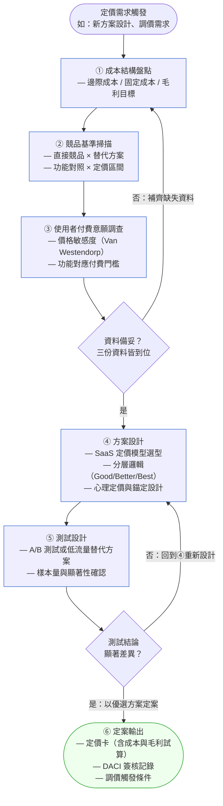
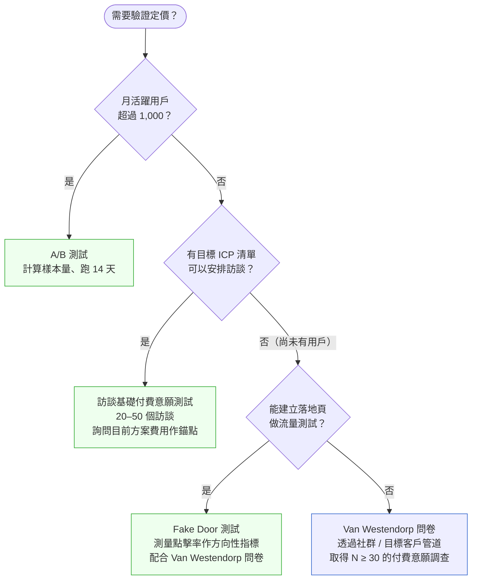
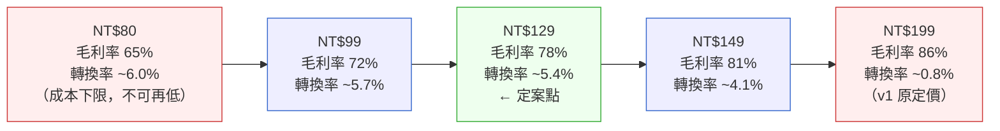

# 第 32 章 | Pricing & Monetization：商業模式的 PM 決策

> **前置閱讀**：[Ch 31 Platform Thinking：平台型產品的特殊挑戰](./ch-31-platform-thinking.md)
> **下游章節**：[Ch 33 Saying No：拒絕的技術](./ch-33-saying-no.md)
> **相關指標章節**：[Ch 34 North Star Metric：選對唯一重要的指標](../part-06-metrics/ch-34-north-star.md)
> **SA/SD 對照**：[SA/SD Ch 3 專案啟動、可行性研究與利害關係人分析](../../book/part-01-foundations/ch-03-project-initiation.md)
> ⸺ SA 視角關注可行性的技術與財務邊界；本章關注定價決策的商業邏輯與感知心理，以及 PM 在定案前必須完成的數據備妥動作。

---

## §32.1 冷觀察

上線的那個早晨，QuickBuy 的 PM 陳潔盯著 dashboard 看了三分鐘，什麼話都沒說。

三個月前，她主導設計了 QuickBuy 訂閱方案的定價架構：「基礎版 NT$199/月、進階版 NT$499/月、旗艦版 NT$1,299/月。」當時沒有跑 A/B 測試，沒有做競品定價分析，也沒有訪談任何付費意願調查。定價開會的那天，CFO 問了一句：「這個數字是怎麼來的？」陳潔回答：「業務那邊覺得合理，我也覺得值這個。」

會議記錄上寫的是「以市場感知為基準」。

上線三週後，免費轉付費的轉換率是 0.8%。事後競品分析報告出爐，才發現市場主力競品的訂閱基礎版定價落在 NT$119–149 之間；QuickBuy 的進階版功能，競品基礎版就包了七成。

這還不是最糟的部分。最糟的是：當工程師問「要不要降價修正？」的時候，沒有人知道成本結構是什麼、降到哪裡才不會虧。毛利數字在 Finance 手裡，但陳潔沒有讀過那份 P&L。市場研究是 Marketing 做的，結論停在一份 PDF 裡從沒被引用。「感覺合理」是整個定價決策唯一有文字的依據。

競品分析報告遲了六週才到 PM 桌上，因為沒有人在需求啟動的時候把這件事放進 sprint。

季度 OKR 上寫的是「提升訂閱轉換率」。Outcome 列的是「付費轉換率 ≥ 5%」。0.8% 的數字沒有讓任何一條 OKR 被標記為失敗——因為 KPI 追蹤在另一個試算表，沒有人把它們串起來。

那份競品報告的最後一頁有一句話，沒有人在上線前讀過：「目標市場的價格敏感度中位數顯示，超過 NT$299/月的訂閱在首次轉換時流失率急劇上升。」

---

## §32.2 真問題

把這件事拆開來看，表面看起來是「定價定太高」，但那只是觸發點。

### 表面需求（What）

把訂閱方案定一個「合理的價格」讓用戶願意付費。

這是可以理解的需求，但它同時也是一個沒有邊界的指令。「合理」對誰合理？對用戶？對競品市場？對成本結構？對股東期待的毛利率？陳潔遇到的不是定錯一個數字，而是在定數字的時候，這四個角度根本沒有被同時放上桌。

### 業務目標（Why）

QuickBuy 訂閱化的真正目標是改善可預測性營收（Recurring Revenue）、降低對單次促購的依賴。這個目標決定了衡量的 Outcome 不應該只是「有多少人訂閱」，而應該是：

- 訂閱戶的 LTV（Lifetime Value）是否高於非訂閱戶？
- 免費轉付費的門檻是否出現在對的使用深度點？
- 方案設計是否驅動了升級行為（Upsell）？

| 層次 | QuickBuy 的實際狀況 | 應問的問題 |
|---|---|---|
| **Outputs** | 上線了三個方案、定了三個價格 | 這只是工作交付 |
| **Outcomes** | 付費轉換率 0.8%（目標 5%） | 用戶行為有沒有改變？ |
| **Impact** | 訂閱收入未達財務計畫，且無法推估損益平衡點 | 商業指標有沒有移動？ |

問題在第二層。QuickBuy 衡量的是 Output（方案上線），但 OKR 宣稱要改善的是 Outcome（轉換率），而財務計畫依賴的是 Impact（訂閱收入）。三個層次之間沒有人建立可量測的串接。

### 決策瓶頸（Who × When）

定價決策的瓶頸不是「誰有資格定價」，而是「誰要在什麼時間點取得哪些資料才能定案」。

把它拆開來看，有三個問題在上線前應該被鎖住：

1. **成本結構**：每個訂閱戶的邊際服務成本是多少？（Finance Contributor 應在需求啟動時提供）
2. **競品基準**：目標用戶正在使用的替代方案定價區間是多少？（Marketing Contributor 應在 sprint 開始前完成）
3. **付費意願**：在目標定價下，有多少比例的用戶明確表示願意付費？（User Research Contributor 應在方案設計前完成調查）

三個問題都屬於「決策前提資料」，但沒有人被指定負責在定案前準備好。決策流程的設計缺了「資料備妥門檻」這個卡點。

選用 DACI 而非其他協作方式，正是因為它強制將「誰推進節奏」（Driver）與「誰擁有資料輸入責任」（Contributor）拆開列名——沒有 Contributor 欄位的流程只靠 PM 自行追問，等同於把資料備妥的責任隱性化，讓三份關鍵資料永遠停留在「應該有人去拿」的狀態。Contributor 欄位是結構性的門禁，不是禮貌性的通知。

DACI 應該是這樣的：

| 角色 | 定價決策的 QuickBuy 實際狀況 | 正確指派 |
|---|---|---|
| **D** Driver | PM（陳潔） | PM（陳潔）⸺ 推進決策節奏 |
| **A** Approver | CFO 與業務主管（隱性、未明確） | CFO ⸺ 明確拍板，在成本與財務目標對齊後 |
| **C** Contributor | 沒有人被正式列入 | Finance、Marketing、User Research |
| **I** Informed | 工程師、設計師（被動告知） | 工程師、客服（上線後才通知） |

問題在 Contributor 欄位是空的。Driver 沒有在流程中設置「等待 Contributor 輸入」的門禁，導致定案時三份關鍵資料都缺席。

---

## §32.3 決策框架

### §32.3.1 定價決策工作流程與資料備妥門禁



這個流程的關鍵設計是「資料備妥門禁」（Definition of Ready Gate）——步驟 ① ② ③ 是並行的先決條件，不是串行的「做完再說」，三份資料缺任何一份，不進入方案設計。把它放在 D1 這個菱形節點，意思是：流程在這裡會卡住，而不是讓人「先設計、之後再補資料」。

**反面案例：QuickBuy 跳過門禁的代價。** QuickBuy 的問題在於完全跳過了這個門禁，從觸發點直接跳到方案設計，再直接跳到上線。表面上節省了三週的資料等待，但實際付出的代價是：上線後 0.8% 的轉換率讓三個月的訂閱營收計畫落空，重啟定價流程又花了八週——其中前兩週還是在補當初該在門禁前就完成的那三份資料。換算下來，「省下」的三週，最終放大成超過三個月的損失與一次對外調價的信任折損。

**如果 Finance 沒有邊際成本數字怎麼辦？** 這是比「資料遲到」更常見的狀況：Finance 手頭有 P&L，但沒有拆解到「每位訂閱用戶的月邊際成本」。這時有三條務實路徑可以選：

1. **向 Finance 索取代理指標**：請 Finance 提供 COGS（銷貨成本）佔營收比率，以及用量（如 API 呼叫、儲存 GB）與成本的對應表。用「如果訂閱戶增加 100 個，雲端費用增加多少？」這個問題驅動 Finance 反推邊際成本。
2. **用行業基準作臨時地板**：SaaS 行業毛利率通常在 60–80%（依雲端成本比重），早期階段可以把「毛利率目標 65%」作為臨時定價地板，並在定價卡上明確標注「基準來源：行業中位數，待 Finance 確認後更新」。
3. **設立觸發更新條件**：在定價卡的「調價觸發條件」中加一條——「Finance 完成 COGS 逐用戶試算後，於 N 日內重新確認定價地板是否需要修正」。

這三條路徑的共同原則：**不要讓「Finance 沒有數字」變成「PM 憑感覺定數字」的藉口**，而是要讓「臨時數字」帶著明確的假設和更新觸發條件，繼續往下走。

---

### §32.3.2 Van Westendorp 付費意願調查：五分鐘入門

Van Westendorp Price Sensitivity Meter（PSM）是 PM 最常被引用、最少被正確使用的研究方法。它的核心是四個問題，每個問題對同一個產品問受訪者一個不同的心理門檻：

| 問題 | 心理層次 | 典型用途 |
|---|---|---|
| 「在這個價格，你會覺得這個產品**便宜**？」 | 可接受下限 | 找出「太便宜反而不可信」的起點 |
| 「在這個價格，你會覺得這個產品**有點貴但還能接受**？」 | 合理上限 | 找出大多數人的接受天花板 |
| 「在這個價格，你會覺得這個產品**太貴了**？」 | 拒絕門檻 | 找出定價不能超過的區間 |
| 「在這個價格，你會覺得這個產品**太便宜了，品質可疑**？」 | 品質感知下限 | 找出免費或過低定價傷害品質感知的點 |

**怎麼解讀結果？** 把四條累積分布曲線畫在同一張圖上，找出交叉點：

- **PMC（Acceptable Price Range）**：「有點貴」與「太便宜」的交叉點之間的區間，就是大多數用戶可以接受的定價範圍。
- **OPP（Optimal Price Point）**：「有點貴」與「便宜」曲線交叉點，通常是轉換率預期最高的定價。
- **IDP（Indifference Price Point）**：「不貴」與「不便宜」的交叉點，是用戶感知「理所當然」的基準定價。

QuickBuy 的調查結論（N=312）是：PMC 落在 NT$99–NT$149，OPP 是 NT$129，IDP 是 NT$109。這說明 v1 的 NT$499 進階版遠超出所有曲線的交叉範圍，0.8% 的轉換率不是偶然。

**樣本量指引**：

| 用途 | 最低建議樣本量 | 說明 |
|---|---|---|
| 快速定向（方向性判斷） | N ≥ 30 | 誤差大，只用來確認量級是否合理 |
| 功能發布前定價 | N ≥ 100 | 能呈現明確的峰谷分布，可信度足夠做決策 |
| 正式上線定案 | N ≥ 200 | 具統計顯著性，建議的最低標準 |
| 大市場 / 高風險定價 | N ≥ 500 | 能做子群體切割（不同 ICP、地區）分析 |

**如何快速執行？** 用 Typeform 或 Google Forms，把四個問題設為「滑動比例尺」（0–999 或用 NT$ 區間）。問卷設計建議：在四個定價問題之前先展示產品描述（50 字以內），確保受訪者有足夠語境判斷。整份問卷控制在 3 分鐘內完成，完成率才能維持在 60% 以上。

**Van Westendorp 的限制**：它測的是「自述意願」而非「實際行為」——用戶說「NT$129 可接受」不代表他們真的會付錢。所以 PMC 的結論應該與 A/B 測試或 Fake Door 測試配合使用，PSM 決定「在哪裡放測試點」，測試決定「在這個點真的有多少人轉換」。

---

### §32.3.3 SaaS 定價模型選型

「訂閱制」不是一個模型，而是四種截然不同的收費邏輯。在方案設計前先選對模型，比調整定價數字更重要。

#### 每座席制（Per-Seat Pricing）

**定義**：依使用者帳號數計費。典型：Slack（$8.75/用戶/月）、Notion（$16/用戶/月）。

**單位經濟學**：
- 客單價 = 座席數 × 每座席定價
- 毛利率通常較高（增加一個座席邊際成本接近零）
- ARR 成長方式：新客戶 + 現有客戶增加座席（Net Revenue Retention 的主要驅動力）

**適用情境**：產品使用量與座席數高度正相關（如協作工具、CRM），且買家容易量化「需要幾個帳號」。

**陷阱**：大型企業有動機壓低座席數（讓多人共用帳號），導致實際使用量被低估、定價漏收。

#### 使用量制（Usage-Based Pricing）

**定義**：依實際使用量計費，如 API 呼叫次數、發送訊息數、儲存 GB。典型：Twilio（每則訊息 $0.0079）、AWS（依資源用量）。

**單位經濟學**：
- 客單價 = 使用量 × 每單位定價
- 成本與收入同步增長，毛利率較穩定
- 客戶進入門檻低（初期用量少=初期費用低），但需要更精細的成本追蹤

**適用情境**：使用量差異懸殊的產品（輕量用戶和重量用戶差異 10×–100×），且邊際成本與使用量直接相關。

**陷阱**：「帳單衝擊」——客戶在月底收到遠超預期的帳單，導致信任崩塌。處置方式：設「用量警示」和「每月上限保護」功能，讓客戶有控制感。

#### 功能分層制（Tiered Feature Pricing）

**定義**：依功能集合分層計費（Good/Better/Best），每層包含一組固定功能。典型：Notion（Free / Plus / Business / Enterprise）、GitHub（Free / Pro / Team / Enterprise）。

**單位經濟學**：
- 客單價 = 方案價格（固定）
- 設計挑戰：「哪些功能放哪層」直接決定升級動力

**適用情境**：功能複雜度高、不同 ICP 有明確的功能需求分化、且 PM 能清楚劃定功能邊界。

**陷阱**：見 §32.4 的「方案過多陷阱」——層數越多，用戶決策負擔越大，反而降低轉換率。

#### 年約制（Annual Contract / Upfront）

**定義**：鼓勵年付，通常提供月費折扣（典型 15–20%）。這不是獨立的定價模型，而是與上面三種模型疊加的「付費週期選項」。

**對 PM 的財務意義**：
- 年付提高 LTV 預測可靠性（減少月流失風險）
- 年付客戶留存率通常比月付客戶高 20–30%
- 首年年付折扣會壓低 Y1 ARR，但 Y2+ 毛利改善

**決策建議**：早期階段以月付為主、年付選項並陳，讓市場自然揭示願意年付的 ICP 比例。等年付比例超過 30% 再考慮調整折扣力度。

#### 免費增值（Freemium）與試用（Trial）的選擇

這兩者常被混用，但邏輯不同：

| | Freemium | Free Trial |
|---|---|---|
| **定義** | 永久免費基礎版 + 付費升級 | 全功能體驗限時（7/14/30 天）+ 付費解鎖 |
| **適用** | 網絡效應強、用戶需要充分時間體驗的產品 | 功能複雜、需要時間建立使用習慣的產品 |
| **轉換挑戰** | 用戶太舒適，沒動力升級；免費層功能邊界設計至關重要 | 試用期到了但用戶還沒觸達 aha moment |
| **成本** | 長期承擔免費用戶的雲端/支援成本 | 短期內集中支援成本 |

**Freemium 失敗最常見的根因**：免費版轉換率 <1% 的產品，通常是「免費功能太完整」或「付費功能沒有明確的 aha moment 觸發點」。診斷方法：

1. 找出付費用戶和免費用戶在哪個功能點的使用量差距最大。
2. 確認這個功能點是否在免費版就能充分體驗。
3. 如果免費版就能充分體驗，付費動機就消失了——這時需要重新劃定免費邊界，而不是降價。

---

### §32.3.4 定價心理學與感知錨定

定價不只是一個數字，而是用戶心理的一場演算。以下五個機制，每一個都在臨床實驗和市場數據中有 5–15% 的轉換率影響力。

#### 1. 魅力定價（Charm Pricing）

NT$99 和 NT$100 之間，理性上差 NT$1，感知上差一個位數。大量消費者決策研究顯示，以 9 結尾的定價（NT$99、NT$129、NT$499）在初次轉換時比整數定價高約 5–8% 的轉換率，主要機制是「向左讀」——用戶的第一個感知數字是「1XX」而非「2XX」。

**使用邊界**：魅力定價在消費性產品和中低客單價（<NT$1,000/月）有效；企業級產品（Enterprise 年約）使用整數定價反而顯得更專業、更像經過精算的報價。

#### 2. 誘餌層（Decoy Pricing）

三層方案中，中間層的轉換率比兩層方案的付費層高 20–30%，原因不是中間層定價便宜，而是頂層方案讓中間層「顯得合理」。QuickBuy v2 的設計邏輯是：旗艦版 NT$399 的存在，讓進階版 NT$129 看起來「相對實惠」——即使大多數用戶永遠不會考慮旗艦版，旗艦版的角色是調整感知錨點，不是為了賣出旗艦版。

**注意**：誘餌層要可信。如果旗艦版的功能差異讓用戶「連看都不想看」，誘餌失效；反而如果旗艦版太有吸引力，中間層反而顯得功能不足，造成決策跳過中間層直接到頂層（或直接放棄）。

#### 3. 年付錨定（Annual Anchoring）

定價頁預設顯示年付方案（而非月付）是一種錨定策略：當用戶第一眼看到的是「NT$1,188/年（相當於 NT$99/月）」，比起第一眼看到「NT$129/月」，年付帶來的「省了 NT$360」框架讓升級決策更容易觸發。

實作建議：在定價頁放「年付 / 月付」切換開關，預設選年付，並在年付標籤上加「省 XX%」的標注。這個設計讓有意願年付的用戶更快找到選項，同時讓月付成為「主動降級」的選擇，心理上減少月付的吸引力。

#### 4. 功能分配矩陣（Feature Allocation Logic）

「什麼功能放哪一層」不應該由直覺決定，而應遵循一套分配邏輯：

| 層級 | 應放什麼功能 | 設計原則 |
|---|---|---|
| **免費 / 基礎** | 讓用戶觸達 aha moment 的核心流程 | 「夠用但會撞牆」——核心功能完整，但量或深度受限 |
| **進階（主力層）** | 讓 aha moment 變成日常工作流的功能 | 解除量限制 + 加入自動化 / 整合 / 協作功能 |
| **旗艦 / 企業** | SLA、進階安全、客製整合、專屬支援 | 企業 IT / 採購部門的「必要條件」，而非一般用戶的「想要」 |

QuickBuy 的具體分配範例：

| 功能 | 免費版 | 進階版 | 旗艦版 | 分配理由 |
|---|---|---|---|---|
| 基礎訂單管理 | ✓ | ✓ | ✓ | aha moment 核心，不放免費就沒人留下 |
| 歷史訂單查詢（30天） | ✓ | — | — | 量限制，撞牆點：月訂單>100筆後30天不夠 |
| 無限歷史查詢 | — | ✓ | ✓ | 解除量限，直接驅動升級 |
| 自動對帳報表 | — | ✓ | ✓ | 進入日常工作流的功能，不放進階層無差異化 |
| API 存取 | — | ✓ | ✓ | 技術整合需求，是中小電商 PM 的「aha moment 延伸」 |
| 客製報表（白標） | — | — | ✓ | 企業採購清單上的功能，一般用戶不理解也不需要 |
| SLA 99.9% 保障 | — | — | ✓ | 企業 IT 需求，是合約的「必要條件」而非功能 |

#### 5. 免費試用心理（Trial Psychology）

免費試用設計的最大錯誤是「試用期到了就逼用戶決定」，而不是「試用期到達 aha moment 後再顯示付費提示」。

行為數據顯示：用戶觸達 aha moment 後的 72 小時內是付費轉換率最高的視窗。如果試用期 14 天到了，但用戶只用了 3 天、還沒觸達 aha moment，強行終止試用反而造成 NPS 下降。

改進設計：把試用結束的觸發條件從「時間到期」改為「時間到期 OR 使用量達門檻」，並在用戶觸達 aha moment（如：第一次完成完整工作流）後 24 小時內推送付費升級提示，而不是在試用第 14 天的系統信中夾帶。

---

### §32.3.5 A/B 測試與低流量替代方案

A/B 測試是定價驗證的黃金標準，但它有一個前提：你需要足夠的流量來達到統計顯著性。許多 PM 遇到的現實是：B2B 產品月活 500 人、或產品剛上線根本還沒有用戶。

#### 高流量情境（月活 > 1,000）：A/B 測試

**樣本量計算公式**（雙樣本比例檢定）：

假設基準轉換率 5%、希望偵測的最小差異（MDE）1.5 個百分點、顯著水準 95%、檢定力 80%，每組所需樣本約 850。

使用工具：[Evan Miller Sample Size Calculator](https://www.evanmiller.org/ab-testing/sample-size.html) 或統計套件的 `power.prop.test()`。

**測試期間建議**：至少跑 2 個完整週期（14 天），避免工作日/週末行為差異污染結果。不要在看到「NT$129 開始領先」的第 5 天就停測——早停會誇大效果（Peeking Problem）。

#### 中流量情境（月活 50–1,000，如 B2B 產品）：Fake Door 測試

**做法**：在定價頁上放一個尚未開放的方案選項，點擊後顯示「即將推出，登記搶先通知」，記錄點擊率作為付費意願的代理指標。

**解讀**：Fake Door 測的是「有沒有人對這個方案感興趣」而非「有多少人會真的付款」。它是方向性工具，用來決定「哪個方案值得做 A/B 測試」，而不是用來直接定案。

**注意**：Fake Door 對用戶誠信有損耗，避免在同一個用戶群重複使用超過 2 次。

#### 低流量 / 早期情境（月活 < 50，或尚未上線）：訪談基礎付費意願測試

這是 B2B 早期 PM 最常被忽視的工具。做法：

1. 安排 20–50 個目標 ICP 的一對一訪談（45–60 分鐘）。
2. 在訪談後段展示產品，然後問：「如果這個產品今天可以訂閱，你覺得 NT$XXX/月 合理嗎？」
3. 如果對方說合理，繼續問：「那 NT$YYY/月 呢？」直到找到他們的合理上限。
4. 詢問：「你目前解決這個問題花多少錢（包含工具費用和人力）？」——這是最強的支付意願信號，因為它代表「目前已經在為這個問題付費」的現實。

**注意**：20–50 個訪談的統計意義有限，但足以識別明顯的定價錯誤（如：80% 的受訪者在 NT$199 就說太貴）。訪談的真正價值是「理解拒絕原因」，而不只是「收集接受比率」。

#### 定價測試方法選擇決策樹



---

### §32.3.6 毛利率與轉換率敏感度分析

定價不是一個點，而是一條曲線：每往下調一塊錢，毛利率與轉換率往相反方向移動。下圖把 QuickBuy 進階版在不同定價下的「毛利率」與「預估轉換率」疊在一起，幫 PM 看清楚「降價換轉換」的交換比到底划不划算。



讀這張圖的方法不是找「毛利率最高的點」，也不是找「轉換率最高的點」，而是找**單位用戶貢獻（轉換率 × 毛利額）最高的拐點**。NT$129 到 NT$149 之間出現了一個拐點：定價再往上 NT$20，轉換率從 5.4% 斷崖式掉到 4.1%（這正是付費意願調查中「合理上限 NT$149」的心理門檻效應）。

> 製作這張圖需要兩條輸入：毛利率曲線來自 Finance 的成本試算（邊際成本 NT$28），轉換率曲線來自 A/B 測試或付費意願調查的插值。沒有這兩份資料，這張圖畫不出來——這也再次說明為什麼門禁的三份資料是定價決策的物理前提。

---

### §32.3.7 Enterprise 定價治理

Enterprise 定價是許多初期 SaaS PM 踩到的隱形沼澤：一開始只有幾個大客戶要「客製」，不知不覺中發展成每個客戶都有不同的合約價格，最後業務團隊花 40% 時間在管理報價，PM 花 20% 時間回答「這個客戶的方案是什麼」。

**何時需要 Enterprise 方案？** 當以下三個信號同時出現，考慮正式推出 Enterprise 方案：

1. 有 3 個以上的大客戶在標準方案中要求例外（客製 SLA、SSO、進階安全）
2. 業務團隊在每個大客戶的報價流程花超過 2 週（含多輪法務審核）
3. 大客戶的 ACV（年合約金額）超過中小客戶 5×

**Enterprise 方案的邊界設計**（避免滑坡）：

| 要素 | 標準化原則 | 若不標準化的後果 |
|---|---|---|
| **起始年約** | 年約最低 NT$500,000（或公司設定的 Enterprise 門檻） | 每個客戶都說自己是「特別客戶」，Enterprise 門檻失去意義 |
| **可客製的功能範圍** | 白名單制：只有白名單上的功能可以客製，其他一律按標準走 | 工程師花時間開發只有一個客戶用的功能，技術債爆炸 |
| **法務標準條款** | 預先審核好三份合約模板（SaaS 服務合約 / DPA / NDA），白名單外不接受修改 | 每個企業合約從零開始法務審核，平均多 6–8 週 |
| **DACI 升級觸發** | 超過白名單的任何客製需求，必須觸發 PM + Engineering + Legal 的三方 DACI 確認 | 業務承諾了功能，PM 和工程師回頭才知道，造成交付衝突 |

**避免滑坡（Per-Customer Pricing Decay）的核心機制**：設立一條公司政策——任何偏離標準定價 15% 以上的報價，必須附上「偏差備忘錄」，記錄偏差理由、核准人和日落條款（該折扣或客製的有效期）。讓每一次例外都留下文字，形成可審計的記錄，就能在半年後發現「哪些客製已成慣例」時及時收回。

---

### §32.3.8 定價決策情境對照表

| 情境 / 觸發條件 | 推薦做法 | PM 關注點 | 常見錯誤 |
|---|---|---|---|
| **新產品首次定價** | 先跑 Van Westendorp 付費意願調查，取得可接受區間再設計方案 | 確認成本結構，設最低可接受毛利率 | 依「業界感覺」或競品一個數字決定，跳過使用者調查 |
| **轉換率持續低於目標** | 先診斷漏斗（哪一步流失？）再決定是定價問題還是價值感知問題 | 區分「太貴」與「不知道為何要付」 | 直接降價，沒有診斷根因，導致毛利惡化但轉換未改善 |
| **競品降價壓力** | 拆解競品降價的成本背景，確認是否為價格戰訊號 | 競品降價未必是你降價的理由，先確認 ICP 是否重疊 | 跟降，但自身成本結構不支撐，導致毛利崩塌 |
| **企業客戶要求客製定價** | 設計 Enterprise 方案邊界與白名單，避免逐案報價 | 客製化的隱性成本（工程支援、法務）要納入定價 | 逐案接受客製，沒有標準化條款，PM 時間被報價流程吞噬 |
| **功能更新後是否調漲** | 調漲前確認有「漲價理由的感知溝通」（公告、說明、時間緩衝） | 調漲應同步提升感知價值，而非單純通知 | 直接漲價不說明，觸發流失潮，損失超過調漲收益 |
| **Freemium 轉換率 <1%** | 先診斷免費層邊界：用戶是「太爽不想升」還是「沒觸達 aha moment」 | 找到免費用戶和付費用戶行為的分叉點 | 降低付費門檻，但根本問題是免費版太完整 |

---

### §32.3.9 If-Then 框架：定價健康度快速評估

在開始方案設計前，可以用以下條件做資料備妥度評分。每項答得出來給 1 分，答不出來給 0 分：

- **If** 每位訂閱用戶的月邊際服務成本尚未確認 → **Then** 請 Finance Contributor 確認後再進行（或使用行業基準臨時地板，並標注假設）
- **If** 目標毛利率下限尚未設定 → **Then** 由 Finance Contributor 與 CFO 確認毛利率下限
- **If** 直接競品的中間層定價中位數尚未掌握 → **Then** 請 Marketing Contributor 完成競品掃描
- **If** 使用者「不貴」的心理上限尚未調查 → **Then** 請 User Research 完成 Van Westendorp 調查（N ≥ 100）
- **If** 付費方案觸達的「aha moment」功能點尚未確認 → **Then** 請 Product Analytics 確認行為漏斗
- **If** 本次定價決策的 Approver 尚未明確指定 → **Then** PM 完成 DACI 記錄並指定 Approver

**評分解讀**：

- 5–6 分：可以進入方案設計，資料備妥度足夠。
- 3–4 分：補齊缺失資料後再進行，預計 1–2 週。
- 0–2 分：停止定價設計，先補資料。現在進入設計只會產生需要重做的工作。

**三個低分硬上的失敗對比**：

- **2 分硬上（QuickBuy v1）**：缺成本、毛利、競品、付費意願四項。結果定 NT$199，轉換率 0.8%，八週後整套重做。失敗特徵：缺的全是「外部現實」資料，定出來的價格只反映內部想像。
- **4 分硬上（某 SaaS 工具）**：成本、毛利、競品都有，唯獨跳過付費意願調查。上線後才發現自己的 ICP 比競品更價格敏感，轉換率不到競品一半。失敗特徵：用競品定價當付費意願的代理指標，忽略了 ICP 差異。
- **3 分硬上（某內容訂閱）**：有競品、有付費意願，但成本結構沒算清楚，毛利率下限是「拍腦袋的 50%」。促銷衝高轉換後才發現邊際成本被低估，越多訂閱戶虧越多。失敗特徵：把營收成長誤當獲利成長。

---

## §32.4 踩坑清單

**反模式：感覺定價（Gut-Based Pricing）**

現象：定價開會時，大家提數字的依據是「感覺差不多」「業務覺得 OK」「跟競品差不多」，但沒有人說得出成本結構和使用者調查結論。

根因：PM 把定價當成「商業直覺可以代替資料」的決策，而非把它視為需要備妥資料才能進入的流程門檻。

> 修正方向：定價開會之前，設一個「資料備妥清單」（見 §32.3.9 的六項條件）。若清單未完成，會議不開——把它當成 sprint planning 的 Definition of Ready。

---

**反模式：定價與成本脫鉤（Pricing Without COGS）**

現象：PM 定了價格、上線了、轉換率也達到了，但財務季報出來之後才發現訂閱用戶越多、虧損越快。

根因：定價設計過程中，Finance 沒有被列為 Contributor，導致沒有人確認「這個定價能不能支撐業務」。

> 修正方向：在 DACI 中明確把 Finance 列為 Contributor，要求「成本試算表」是定案輸出的必要附件之一。若 Finance 暫時無法提供精確 COGS，使用行業基準地板並在定價卡上標注假設與更新觸發條件。

---

**反模式：Freemium 沒有 Aha Moment（Freemium Without Conversion Trigger）**

現象：產品上線 Freemium，免費用戶增長很快（月新增 3,000 人），但付費轉換率長期停留在 0.5–1%。免費用戶留存也偏低，大量用戶註冊後 7 天就流失。

根因：免費版提供了「足夠完整的功能」，用戶在免費層就滿足了核心需求，沒有任何功能點成為「必須付費才能繼續的撞牆點」。同時，免費用戶沒有被引導到 aha moment，在理解產品核心價值之前就因無聊而流失。

診斷方式：
1. 找出付費用戶在前 30 天使用率最高的功能，確認免費版是否已包含。
2. 看免費用戶的行為路徑，找出流失前最後一個使用的功能點。
3. 如果付費用戶的 aha moment 功能在免費版就能完整體驗，問題就在這裡。

> 修正方向：重新劃定免費邊界——免費版應包含足夠讓用戶「看見價值」的功能，但在用戶開始「依賴」這個價值的臨界點設置升級觸發。QuickBuy 的作法是讓免費版提供 30 天訂單歷史（夠用來體驗），但月訂單超過 100 筆後自動撞牆（正好是開始依賴產品的時間點）。

---

**反模式：方案過多（Option Paralysis Trap）**

現象：為了「滿足各種用戶」，方案越設計越多：基礎版、進階版、旗艦版、企業版，加上年繳折扣、學生優惠、非營利版……用戶在定價頁面停留超過 90 秒後離開，沒有選任何一個。

根因：PM 把方案數量當成覆蓋度的代理指標，設計方案的邏輯是「我想到了一個場景，就加一個方案」，沒有問「這個方案的存在會不會讓用戶更難做決定」。

> 修正方向：預設從兩層開始（Free + Paid），每新增一層必須有「流量分析支撐這個層級有足夠的 ICP 目標用戶」的數據。三層以上要有 A/B 測試數據支撐。

---

**反模式：調價不通知（Silent Repricing）**

現象：現有訂閱用戶在下個月帳單才發現方案調漲，客服電話量暴增，NPS 在三週內掉了 18 點。

根因：調漲決策是內部財務會議的輸出，沒有人問「用戶要怎麼感知這件事」。PM 被排除在調漲通知設計之外，或者調漲通知被壓縮成一封系統信。

> 修正方向：調漲方案設計應包含「溝通計畫」——至少提前 30 天對現有用戶公告、給 1 個完整帳期的緩衝、對忠誠用戶提供「鎖定舊價 N 個月」的過渡選項，並用「服務升級」而非「成本上漲」的框架溝通。沒有溝通計畫與時間窗口的調漲決議，不算完整的決策輸出。

---

**反模式：轉換率低就降價（Price as the Only Lever）**

現象：轉換率沒達標，PM 第一個動作就是降價，或者跑一個「限時促銷」。結果促銷期間轉換率上升，促銷結束後立刻回落，且用戶開始等促銷才付費。

根因：把轉換率低當成「價格問題」，但轉換率低的原因可能是「用戶還沒到達 aha moment」「付費價值主張不清楚」「流程太複雜」。降價只在「用戶覺得貴」的情況下有效，其他情況降了也沒用。

> 修正方向：先跑轉換漏斗分析，找出流失點。流失在「看到定價頁」之前，定價不是問題。流失在「看到定價頁之後」，再考慮定價調整空間。動手前先做降價財務模擬：假設進階版從 NT$129 降到 NT$99（毛利率 78%→72%），若轉換率僅從 5.4% 升到 6.0%，單位用戶貢獻反而下降（129×0.78×5.4% > 99×0.72×6.0%）——降價換來的增量轉換不足以補回流失的毛利，用數字否決直覺。

---

## §32.5 交付清單 ⸺ 一頁式定價決策卡模板

定價決策卡的設計邏輯是把「決策前提資料」和「決策輸出」放在同一張表上，讓任何人拿到這張卡都能知道：這個定價是怎麼來的、誰拍板的、當時的資料依據是什麼、什麼條件下應該重新審視。

````markdown
### 定價決策卡（Pricing Decision Card）

> 版本:v0.1 | 撰寫日期:YYYY-MM-DD | 擁有人:{名字}

### 基本資訊
產品 / 方案名稱：{方案名稱}
定價模型：{Per-Seat / Usage-Based / Tiered / Freemium}
版本號 / 生效日期：{YYYY-MM-DD}
Driver（PM）：{姓名}
Approver：{姓名 + 職稱}

---

### 決策前提資料
1. 成本結構
   - 每用戶月邊際成本：{NT$XXX}（若為估算，註明來源與假設）
   - 目標毛利率下限：{XX%}
   - 資料來源：{Finance / 日期 / 或行業基準}

2. 競品基準
   - 直接競品中間層定價中位數：{NT$XXX}
   - 主要競品功能對照：{簡述}
   - 資料來源：{Marketing / 日期}

3. 使用者付費意願（Van Westendorp PSM）
   - 「不貴」上限（PMC 上限）：{NT$XXX}
   - 「合理」區間（PMC）：{NT$XXX – NT$XXX}
   - 最佳定價點（OPP）：{NT$XXX}
   - 樣本量：{N} / 調查日期：{YYYY-MM-DD}
   - 備注：若樣本量 < 100，標注「方向性參考，建議後續補強」

---

### 方案設計邏輯
| 方案層級 | 定價 | 核心功能 | 目標 ICP | aha moment | 升級觸發點 |
|---|---|---|---|---|---|
| {免費/基礎} | NT${XXX}/月 | {功能列表} | {用戶類型} | {觸達 aha 的動作} | {撞牆條件} |
| {進階} | NT${XXX}/月 | {功能列表} | {用戶類型} | {進階工作流功能} | {何時升級旗艦} |
| {旗艦/企業} | {年約} | {企業功能} | {企業 IT/採購} | — | — |

---

### 測試設計
測試類型：{A/B 測試 / Fake Door / 訪談 / Van Westendorp}
選擇理由：{為什麼選這種測試方法}
測試期間：{YYYY-MM-DD 至 YYYY-MM-DD}
樣本量：{N}（A/B 測試請附樣本量計算依據）
主要指標：{轉換率 / 付費意願比率 / 其他}
結論摘要：{一句話}

---

### 定案輸出
定案日期：{YYYY-MM-DD}
生效方案：{方案名稱 + 定價}
預期轉換率：{XX%}（依據：{測試數據 / 競品基準}）

---

### 調價觸發條件
下次審視時間：{YYYY-MM-DD}
自動觸發條件：
- 轉換率低於 {XX%} 連續 {N} 週
- 主要競品調整幅度超過 {XX%}
- 成本結構變化超過 {XX%}
- Finance 完成精確 COGS 試算後（若本次使用行業基準估算）
````

把它存在 `docs/pricing/`，跟程式碼同 repo，跟 README 同層。

這張卡的設計用意是讓「感覺定價」在流程上變得更難發生——當 Contributor 欄位有姓名、成本資料有來源日期，任何人都能在 30 秒內判斷「這個定價有沒有資料撐著」。

---

### §32.5.1 範例：QuickBuy 訂閱方案重新定價（CASE-ECM-111）

QuickBuy 在上線後的第八週重啟了定價工作，這次 PM 陳潔先補齊了三份缺席的資料，才召開定案會議。

````markdown
### 定價決策卡（Pricing Decision Card）

> 版本:v0.2 | 撰寫日期:2026-04-13 | 擁有人:陳潔（產品線 PM）

### 基本資訊
產品 / 方案名稱：QuickBuy 訂閱方案 v2
定價模型：功能分層制（Tiered Feature Pricing）
<!-- 為什麼選功能分層而非使用量制：QuickBuy 的主要成本是客服支援和儲存，
     與訂單量相關但差異倍數不高，功能複雜度差異遠大於使用量差異，
     分層設計比按量計費更容易讓用戶理解「我需要哪一層」。 -->
版本號 / 生效日期：v2 / 2026-04-15
Driver（PM）：陳潔（產品線 PM）
Approver：林副CFO（確認財務目標對齊）
<!-- 為什麼這欄：v1 的 Approver 是隱性的「業務主管+CFO」，沒人真正拍板。
     v2 明確指定單一 Approver 為林副CFO，因為定價的最終約束是毛利率。 -->

---

### 決策前提資料
1. 成本結構
   - 每用戶月邊際成本：NT$28（含客服、儲存、運算）
   - 目標毛利率下限：65%（董事會確認）
   - 資料來源：Finance 成本試算表 v3 / 2026-03-28
   <!-- 為什麼這欄：NT$28 這個數字直接決定了最低定價下限是 NT$80；
        沒有這個數字，定 NT$99 就可能在高轉換率時反而虧損。 -->

2. 競品基準
   - 直接競品中間層定價中位數：NT$139/月（掃描 6 個主力競品）
   - 主要競品功能對照：競品基礎版已包含 QuickBuy 原進階版 7 成功能
   - 資料來源：Marketing 競品報告 v2 / 2026-03-20

3. 使用者付費意願（Van Westendorp PSM）
   - 「不貴」上限（PMC 上限）：NT$169/月
   - 「合理」區間（PMC）：NT$99 – NT$149/月
   - 最佳定價點（OPP）：NT$129/月
   - 樣本量：N=312（現有免費用戶調查）/ 調查日期：2026-03-25
   <!-- 為什麼這欄：N=312 的「合理」上限是 NT$149，比 v1 定的 NT$199 低 25%；
        這是最直接說明「為什麼 v1 轉換率只有 0.8%」的數字。
        Van Westendorp 四個問題透過 Typeform 發送給免費用戶，
        完成率 68%（N=312/460 發送），高於行業平均的 55%，
        因為問卷前有 50 字產品描述語境、控制在 3 分鐘內完成。 -->

---

### 方案設計邏輯
| 方案層級 | 定價 | 核心功能 | 目標 ICP | aha moment | 升級觸發點 |
|---|---|---|---|---|---|
| 免費版 | NT$0 | 基礎訂單管理、30天歷史 | 個人賣家 / 試用 | 第一次成功對帳 | 月訂單 > 100 筆（撞牆） |
| 進階版（主力） | NT$129/月 | 無限歷史 + 自動對帳 + API | 中小電商 | 月底自動報表送達 | 需要多用戶帳號 or 客製報表 |
| 旗艦版 | NT$399/月 | 全功能 + 客製報表 + SLA 99.9% | 年GMV > 500萬 | — | — |
<!-- 為什麼是 NT$129 而非 NT$139（競品中位數）：
     Van Westendorp OPP 是 NT$129，A/B 測試也確認 NT$129 vs NT$149
     的轉換率顯著高（5.4% vs 4.1%）。刻意低於競品中位數 NT$10，
     用「同類更便宜」作為首次轉換的明確誘因。 -->
<!-- 為什麼免費版設「月訂單 > 100 筆」作升級觸發：
     這是行為漏斗中付費轉換率開始陡升的拐點（aha moment 之後的依賴點），
     讓免費層「夠用但會撞牆」，撞牆點正好對齊付費價值。 -->

---

### 測試設計
測試類型：A/B 測試（進階版 NT$129 vs NT$149）
選擇理由：月活 4,200 人，流量足夠在 14 天內達到統計顯著性（N=850/組）
測試期間：2026-03-30 至 2026-04-12（14天）
樣本量：各 N=850（顯著性 95%、檢定力 80%；
        基準轉換率 5%、MDE 1.3 個百分點，
        用 power.prop.test() 計算得每組 850）
主要指標：免費轉付費轉換率
結論摘要：NT$129 組轉換率 5.4%，NT$149 組 4.1%，p=0.023；選 NT$129 定案

---

### 定案輸出
定案日期：2026-04-13
生效方案：進階版 NT$129/月、旗艦版 NT$399/月（免費版不變）
預期轉換率：5.0%（依據：A/B 測試數據 5.4% 的保守估計）

---

### 調價觸發條件
下次審視時間：2026-10-13（6 個月後）
自動觸發條件：
- 轉換率低於 4.0% 連續 4 週（4週才能排除短期波動，確認為趨勢性下滑）
- 主要競品調整幅度超過 15%（小於此幅度通常低於用戶感知門檻）
- 邊際成本變化超過 20%
- Finance 確認精確 COGS（本次 NT$28 為試算值，待年度稽核後確認）
````

這張卡在第一次定案會議上讓林副 CFO 在三分鐘內完成確認——因為成本試算、用戶調查、競品基準都在同一份文件裡，不需要翻找其他報告。「感覺合理」在這張卡的格式下，沒有欄位可以填。

---

## §32.6 Recap

讀完本章，你應該已經能做到：

- [ ] 建立「資料備妥門禁」，在定價設計開始前確認成本結構、競品基準、使用者付費意願三份資料皆到位；若 Finance 暫時無法提供精確 COGS，用行業基準臨時地板 + 明確假設繼續推進。
- [ ] 執行 Van Westendorp PSM 調查，用四個問題找出可接受定價區間（PMC）和最佳定價點（OPP），配合 A/B 測試或低流量替代方案（訪談 / Fake Door）驗證真實轉換率。
- [ ] 根據產品特性（使用量差異、功能複雜度、ICP 分化程度）在四種 SaaS 定價模型（Per-Seat / Usage-Based / Tiered / Freemium）之間做出有理由的選擇，而非預設「訂閱制」。
- [ ] 用功能分配矩陣系統化決定「哪個功能放哪一層」，確保免費層包含足夠的 aha moment 觸發，但在用戶開始依賴價值的臨界點設置升級撞牆點。
- [ ] 在定價 DACI 中明確指定 Finance 為 Contributor，讓成本試算表成為定案輸出的必要附件。Enterprise 定價設計白名單機制，避免逐案報價滑坡。
- [ ] 用定價決策卡記錄每次定案的資料依據與調價觸發條件，包括選用的定價模型、測試方法選擇理由、A/B 測試的樣本量計算依據。
- [ ] 在轉換率未達標時，先跑漏斗分析找流失點，再做降價財務模擬（轉換率增量 × 毛利額是否大於降價前），不把降價當預設的第一個動作。

定價決策的核心能力不是猜對數字——是在開會之前把正確的人、正確的資料、正確的問題放在同一張桌上。備妥這三件事，「感覺合理」就沒有位置了。

---

## Cross-References

- **前章**：[Ch 31 Platform Thinking：平台型產品的特殊挑戰](./ch-31-platform-thinking.md) ⸺ 平台型產品的定價策略有額外的網絡效應考量，與本章框架互補。
- **下一章**：[Ch 33 Saying No：拒絕的技術](./ch-33-saying-no.md) ⸺ 定價決策常需要對內部「加功能來提升感知價值」的需求說不。
- **強連結**：[Ch 34 North Star Metric：選對唯一重要的指標](../part-06-metrics/ch-34-north-star.md) ⸺ 定價的 Outcome 指標（轉換率 vs LTV vs ARPU）選哪個作為 North Star，影響整個方案設計邏輯。
- **強連結**：[Ch 35 Experimentation & A/B Testing：決策有多可信？](../part-06-metrics/ch-35-experimentation.md) ⸺ 定價 A/B 測試的樣本量計算與顯著性設定，見本章的方法論細節。
- **強連結**：[Ch 8 Competitive Intelligence：競品信號到產品決策](../part-02-discovery/ch-08-competitive-intelligence.md) ⸺ 競品定價掃描的方法論，以及如何建立並維護持續更新的競品定價資料庫。
- **SA/SD 對照**：[SA/SD Ch 3 專案啟動、可行性研究與利害關係人分析](../../book/part-01-foundations/ch-03-project-initiation.md) ⸺ SA 視角的財務可行性分析從技術成本切入；本章從定價感知與市場基準切入，兩者在「成本結構」這個交叉點匯合。
- **SA/SD 對照**：[SA/SD Ch 35 FinOps、永續工程與綠色軟體](../../book/part-06-engineering/ch-35-finops-green-software.md) ⸺ 雲端成本的 FinOps 視角與本章的邊際成本計算直接相關。

<!-- PROPOSED-REFS
cases:
  - id: CASE-ECM-111
    title: "QuickBuy 定價感覺：沒有數據支撐的訂閱方案上線後轉換率慘烈"
    domain: ecommerce
    chapters: [ch-32]
    anonymized: true
    summary: |
      虛構電商 QuickBuy：PM 根據「感覺」定了三個訂閱方案，
      上線後免費轉付費轉換率 0.8%，遠低於業界 5-8%。
      事後才做競品定價分析，發現定價高出 40%。
      第八週重啟定價流程，補齊成本試算、競品掃描、付費意願調查後，
      以 NT$129/月 進階版定案，A/B 測試轉換率回升至 5.4%。
-->
