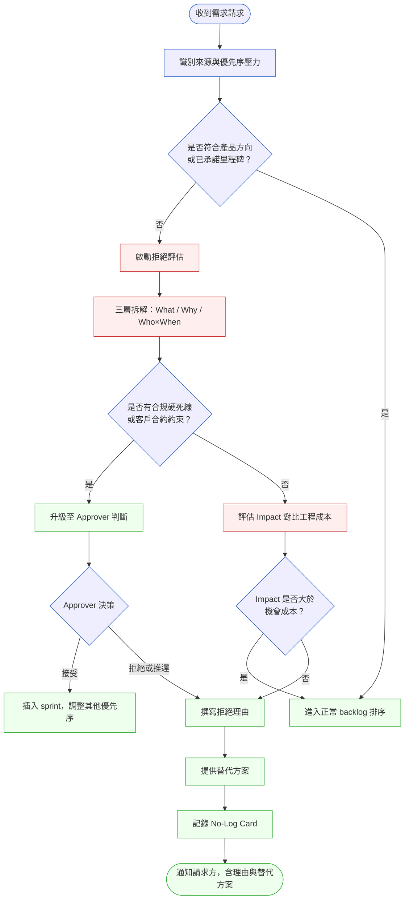
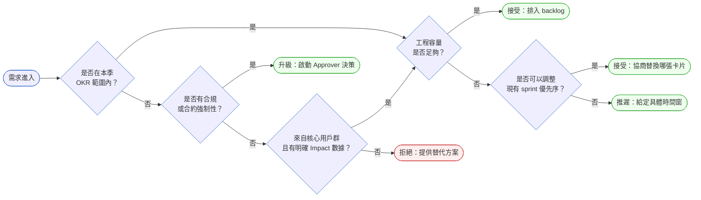

# 第 33 章 | Saying No：拒絕的技術

> **前置章節**：[Ch 5 Prioritization Frameworks：MoSCoW 之外的選擇](../part-01-foundation/ch-05-prioritization.md)
> **前置章節**：[Ch 2 Stakeholder Mapping：誰在乎這件事？誰說了算？](../part-01-foundation/ch-02-stakeholder-mapping.md)
> **前置章節**：[Ch 27 Escalation Protocol：衝突升級的觸發條件與路徑](../part-04-collaboration/ch-27-escalation-protocol.md)
> **下游章節**：[Ch 34 North Star Metric：選對唯一重要的指標](../part-06-metrics/ch-34-north-star.md)
> **下游章節**：[Ch 28 Executive Communication：向上匯報與 QBR](../part-04-collaboration/ch-28-executive-communication.md)
> **SA/SD 對照**：[SA/SD 第 3 章 專案啟動、可行性研究與利害關係人分析](../../book/part-01-foundations/ch-03-project-initiation.md) ⸺ SA 視角關注技術可行性評估與系統邊界確認；本章關注 PM 在需求湧入時如何建立拒絕的判準與溝通語言。
> **SA/SD 對照**：[SA/SD 第 33 章 架構決策紀錄（ADR）與架構知識管理](../../book/part-06-engineering/ch-33-adr-architecture-knowledge.md) ⸺ SA 用 ADR（Architecture Decision Record，架構決策紀錄）記錄決策理由與後果；PM 用本章的拒絕記錄卡（No-Log Card，拒絕／推遲決策記錄卡）讓「不做」也有可追溯的決策脈絡。

---

## §33.1 冷觀察

89 張。

MedNow 的 PM Jonathan 把游標停在 Jira 的滾輪上，第三次數了一遍 backlog 的卡片數，確認自己沒看錯。第七個月的 sprint planning 還有四十分鐘開始，而其中 34 張卡片，標著同一個來源：「南星醫院 IT 需求」。

南星是 MedNow 當年度最大的醫院客戶，合約金額佔 ARR（Annual Recurring Revenue，年度經常性收入）的 22%。IT 主管林副處長每兩週發一份 email，主旨永遠是「補充需求」四個字，正文是 3 到 5 條功能項目，每條末尾都跟著一句「請儘速評估」。

七個月來，Jonathan 從來沒有回覆過一次「不行」。

不是沒想過。第二個月，林副處長要在電子病歷模組加「自訂欄位批次匯入」，工程師估三週，Jonathan 報上去，對方回「三週太長，能不能兩週？」他說好——沒問業務影響，沒問使用頻率，沒問醫院會有多少人用。那功能上線三個月後的數據回顧顯示：月活躍用戶數，2 人。

第四個月，林副處長要把報表輸出從 PDF 改成同時支援 Excel 與 Word。Jonathan 本想說「這個優先序低」，但對方在信裡補了一句：「這是醫策會審核必要格式，不做會影響醫院評鑑。」Jonathan 沒去查醫策會評鑑的實際條文，直接把卡片丟進 sprint。功能做完，QA 發現 Word 匯出在某些欄位有 encoding（編碼）問題，修了兩週；同一時間，核心的藥品交互作用警示模組因為工程資源被佔走，延期三週。

第七個月的 sprint planning，工程主管謝博閔站在白板前，只說了一句：「我們這個月能做的 story point 是 42 點。backlog 前 10 張加起來 87 點。你要我怎麼排？」

Jonathan 盯著那 89 張卡片看了三十秒。沒有答案。

散會後，CTO 林恩蒂把他留下來，問了一個問題：「七個月裡，你有沒有在任何一個時間點，說過一次『不行，這個我們現在不做』？」

Jonathan 搖頭。

林恩蒂沉默了幾秒：「那個 backlog 不是需求堆積問題，是決策缺位問題。每一張卡片，都是一次你沒有做的決定。」

---

## §33.2 真問題

把 Jonathan 的困境拆開來看，表面上是 backlog 管理問題，實際上是決策責任沒有著落的問題。

### 三層拆解

### ��表面需求（What）

Jonathan 的 backlog 上每一張卡片，表面上都是功能請求：匯入功能、報表格式、排程提醒、查詢介面。每一張看起來都有道理，每一張來自南星醫院的需求都有「22% ARR」的隱性壓力在背後。

問題不在需求是否合理，而在於這些需求從來沒有被轉換成一個共同問題：「我們在解決誰的什麼問題，代價是什麼？」

### ��業務目標（Why）

往上拆一層，南星醫院的需求混雜了三種不同的業務意圖：

- **合規驅動**：部分需求（如報表格式）確實連結到法規或評鑑要求，具有硬死線與強制性。
- **操作效率**：部分需求（如批次匯入）是 IT 部門為了節省日常操作時間，屬於效率改善，而非功能缺失。
- **個人習慣**：部分需求（如查詢介面的排列順序偏好）是林副處長個人工作流程的映射，不代表全院用戶的痛點。

三種意圖混在一起，Jonathan 沒有分層，就全部照單全收。照單全收的結果是：真正緊急的合規需求被稀釋在大量低優先序工作裡，工程資源分散，沒有一件事做到足夠好。

**Outputs / Outcomes / Impact 的斷裂**

從交付物的角度看，Jonathan 交付了大量的 Outputs（產出）——功能做完了，卡片移到 Done 欄了。但 Outcomes（成效）呢？林副處長要的「自訂欄位批次匯入」上線後，月活躍用戶 2 人，代表使用者行為根本沒有改變。Impact（影響）呢？藥品交互作用警示模組因為資源被佔用而延期，那才是 MedNow 用於醫院採購決策的核心差異化功能。

Jonathan 衡量的是 Outputs，但犧牲掉的是 Outcomes 與 Impact。

### ��決策瓶頸（Who × When）

真正的問題是：誰有責任說「這個需求我們現在不做」？

Jonathan 以為這個責任在他，但他沒有拿到足夠的授權與框架去執行。林副處長以為他的每一封 email 都是「客戶需求」，等同業務承諾。CTO 林恩蒂以為 PM 會自動過濾，沒有建立明確的拒絕機制。

結果就是：每個人都以為別人在守門，沒有人真的在守。

**DACI 分析**

DACI（Driver / Approver / Contributor / Informed，推動者／核准者／貢獻者／知會者）是一套釐清決策角色的框架。套用到 MedNow：

| 角色 | 全稱 | 應有職責 | MedNow 的實際狀態 |
|---|---|---|---|
| **D** Driver | Jonathan（PM） | 推動每一個需求請求進入評估流程 | 沒有評估流程，直接收單 |
| **A** Approver | CTO 林恩蒂 | 對於超出工程容量或偏離產品方向的請求做最終決策 | 從未被點名為 Approver |
| **C** Contributor | 工程主管謝博閔 | 提供工期估算與技術風險輸入 | 只被動提供估算，從未參與優先序判斷 |
| **I** Informed | 南星醫院林副處長 | 接收「哪些需求被接受、哪些被推遲、為什麼」的決策結果 | 從未被通知拒絕，因為從未被拒絕過 |

決策瓶頸的核心是：Driver 在工作，但 Approver 缺位。在沒有明確 Approver 的情況下，PM 無法拒絕任何來自高 ARR 客戶的需求，因為拒絕的後果超出了他單人的授權範圍。

---

## §33.3 決策框架

拒絕不是「說不」這個動作，而是一套可以被記錄、被追溯、被溝通的決策流程。以下框架不直接給你「該不該做」的答案——那取決於你的 OKR 與資源狀況——而是給你一組可以反覆套用的判斷節點，讓你在現場自己推導出答案。

### 圖 A — 拒絕決策工作流程



這個流程有三個關鍵節點值得注意：

**節點 1：識別優先序壓力的來源**。來自高 ARR 客戶的需求會帶有隱性壓力，這個壓力本身不是決策依據，需要被明確命名，而不是默默吸收。

**節點 2：合規硬死線的升級機制**。有合規或合約約束的需求不能由 PM 單人決策，必須升級到 Approver（通常是 CTO 或產品負責人），這樣的升級是流程設計，不是 PM 的失敗。

**節點 3：No-Log Card 記錄**。每一個被拒絕或推遲的需求都需要留下記錄，讓三個月後的任何人都能重建當時的決策脈絡。

### 圖 B — 需求分類決策樹



每一條分支都有終點。這棵樹的設計原則是：**不存在「待確認」的葉節點**，每一個請求必須落在一個可以被溝通的狀態。注意這棵樹不會替你判斷「OKR 範圍」或「Impact」的邊界在哪——那是你要先和團隊對齊的前提；樹只保證你不會把一個需求懸在半空中。

### 需求請求評估決策表

| 情境 / 觸發條件 | 推薦做法 | PM 關注點 | 常見錯誤 |
|---|---|---|---|
| 高 ARR 客戶提出功能請求，無明確業務理由 | 要求客戶提供使用場景與受影響用戶數，再進行評估 | 分離「客戶關係壓力」與「功能價值」兩件事 | 直接接受，沒有評估流程 |
| 需求聲稱有合規強制性，未提供文件 | 要求客戶提供具體法規條款或評鑑指引 | 合規聲明需要可查證的依據，不能只靠對方口頭說 | 無條件相信「評鑑必要」說法，沒有查證 |
| 工程容量不足，需求無法在本季交付 | 給定具體推遲時間窗（如「下季 Q3 第 2 個 sprint」），而非模糊的「之後」 | 「之後」等同承諾，但沒有時間點；具體時間窗才能被追蹤 | 說「我們會考慮」，讓對方誤以為已被接受 |
| 需求與現有 roadmap 方向衝突 | 明確指出衝突點，說明接受此需求的機會成本（哪個功能會被延後） | 讓請求方理解取捨，而非單方面承受後果 | 接受需求但不通知機會成本，導致其他承諾無法兌現 |
| 需求評估後影響面極小（如用戶數 ≤ 5 人） | 拒絕，但提供 workaround（替代解法）或第三方工具建議 | 用數據說話，避免讓拒絕看起來像個人偏好 | 拒絕但無替代方案，讓客戶感覺被放棄 |

### If-Then 框架：拒絕溝通

拒絕時的溝通語言，比拒絕決策本身更容易出錯。以下是可直接套用的語言結構：

- **If** 功能不在本季範圍，工程容量已鎖定 → **Then** 說明本季已承諾的功能名稱與業務目標，給出具體重新評估的季度或時間窗，並說明若業務壓力緊急可討論替換哪個現有優先項目
- **If** 需求影響面不足以支撐工程成本（受影響用戶數過低） → **Then** 引用具體數據（用戶數、工程週數），說明比例無法支撐排入，並提供替代方案或第三方工具建議
- **If** 需求與產品方向根本衝突，超出 PM 單人可確認的層級 → **Then** 明確說明現階段產品邊界與方向，告知需升級內部對齊，承諾在具體時間點給出確定回覆
- **If** 需求有合規強制性聲明但缺乏文件依據 → **Then** 要求提供具體法規條款或評鑑指引，暫緩評估直到依據可查證
- **If** 高 ARR 客戶提出功能請求但無明確業務理由 → **Then** 要求提供使用場景與受影響用戶數，將客戶關係壓力與功能價值評估分開處理
- **If** 需求已被記錄但超過承諾重新評估時間點仍無進展 → **Then** 主動回報進度或推遲原因，避免對方誤以為已被接受或已被遺忘

---

## §33.4 踩坑清單

以下五個反模式，在 MedNow 的案例裡至少出現了三個，在多數 PM 早期職涯裡全部出現過。

**反模式：「你好我好大家好」式接受**

現象：所有需求都被記錄進 backlog，沒有任何需求被當場拒絕或推遲。backlog 持續膨脹，工程師開始問「這些東西我們到底哪一天才做得完？」

根因：PM 把「收到並記錄」等同「承諾評估」，把「評估」等同「接受」。對方感知到的是隱性承諾，PM 感知到的是「我只是先放進去」。

> 修正方向：backlog 不是無限倉庫，是有界限的工作承諾清單。每次加入新卡片，就有一張舊卡片的優先序被排擠；把這個取捨說出來，而不是讓它靜默發生。

---

**反模式：假拒絕（用時間換迴避）**

現象：對高壓需求回覆「我們之後再看看」「下個季度再評估」，沒有具體時間點，沒有評估標準，對方以為這是「在考慮中」，PM 以為這是「拒絕了」。

根因：「之後」是最廉價的延遲機制，不需要說明理由，不需要面對對方的反應。但它製造了一個未結案的承諾，半年後會以更高的成本回來。

> 修正方向：若不打算在下一個評估周期認真考慮這個需求，就直接說「目前的評估結果是不做，理由是 X」。若真的打算未來評估，給一個具體的觸發條件（「當用戶數超過 N」「當 Q3 容量確認後」）。

---

**反模式：沒有授權就拒絕高 ARR 客戶**

現象：PM 單人決定拒絕一個來自大客戶的需求，沒有事先取得 CTO 或業務負責人的對齊。事後客戶向業務投訴，業務推翻 PM 的決定，工程師進退兩難。

根因：拒絕高 ARR 客戶是一個帶有業務風險的決策，超出 PM 的單人授權邊界。這不是 PM 應該獨自承擔的決策，而是需要 Approver 在場的決策。

> 修正方向：建立升級觸發條件：「來自 Top 5 客戶的需求，且評估結果是拒絕或推遲超過一個季度，必須取得 CTO 或業務負責人確認後才能回覆。」這不是逃避責任，是確保決策有足夠的組織授權。

---

**反模式：拒絕但無替代方案**

現象：需求被拒絕，PM 只說「這個現在不做」，沒有提供任何替代路徑。對方感受到的是被放棄，而非被服務。

根因：把拒絕當作終點，而非把拒絕當作引導對方找到真正解法的起點。大多數需求請求背後有一個真實痛點；拒絕的是解法，不是痛點。

> 修正方向：在評估流程裡加入「替代方案搜尋」步驟：這個痛點有沒有現有功能可以 workaround？有沒有第三方工具？有沒有更低成本的解法？拒絕一個需求，同時提供一條替代路徑，對方感受到的是「PM 在幫我解決問題」而不是「PM 在拒絕我」。

---

**反模式：拒絕之後沒有記錄**

現象：口頭說了「這個不做」，沒有書面記錄。三個月後，對方再次提出同一需求，說「你上次說會考慮的」；或者新的 PM 接手，完全不知道這個需求被評估過、被拒絕過、理由是什麼。

根因：「說了」等同「做了」的錯覺。在決策密集的產品工作中，口頭決策的半衰期通常不超過兩個月。

> 修正方向：每一個被拒絕或推遲的需求，都寫一張 No-Log Card：是什麼需求、誰提的、評估日期、決策結果、理由、替代方案。這一頁文件在三個月後就能回答 90% 的「當初為什麼這樣決定」。

---

## §33.5 交付清單 ⸺ 一頁式 No-Log Card

本章交付一份核心工件：

- **一頁式 No-Log Card 模板**（§33.5 空白模板）——記錄每一個被拒絕或推遲的需求請求。
- **拒絕型範例**（§33.5.1）——展示「決策＝拒絕」如何填寫。
- **推遲型範例**（§33.5.2）——展示「決策＝推遲」時，「重新評估條件」欄如何填寫。

### §33.5 No-Log Card 空白模板

**使用順序建議**：第一次填寫時，不要從上往下硬填。建議的順序是「基本資訊 → 需求摘要 → 評估結果」先把骨架立起來（你是誰、對方要什麼、你決定怎麼處理），再回頭補「拒絕／推遲理由」與「機會成本」這兩欄需要查數據的部分，最後寫「替代方案」與「重新評估條件」收尾。理由是：先確定決策方向，才知道後面要查什麼數據來支撐；倒過來寫容易陷在細節裡，反而忘了卡片是為了被三個月後的人讀懂而存在。

以下是空白模板：

````markdown
# No-Log Card — 需求拒絕 / 推遲記錄
> 版本:v0.1 | 撰寫日期:YYYY-MM-DD | 擁有人:{PM 姓名}

### 基本資訊
- 需求 ID：{JIRA-XXXX 或內部編號}
- 請求日期：{YYYY-MM-DD}
- 請求來源：{姓名 / 角色 / 公司（如適用）}
- 記錄 PM：{PM 姓名}
- 決策日期：{YYYY-MM-DD}

### 需求摘要
- 請求描述：{一句話說清楚他們要什麼}
<!-- 為什麼這欄：三個月後的人需要能不看原始需求就重建場景；
     寫不清楚代表當時也沒有真正理解這個需求在解決什麼問題。 -->
- 請求背後的業務痛點：{Why 層，用戶 / 客戶真正在解決的問題}

### 評估結果
- 決策：[ ] 拒絕  [ ] 推遲至 {時間窗}  [ ] 升級至 Approver
- Approver（如升級）：{姓名 / 角色}

### 拒絕 / 推遲理由
<!-- 為什麼這欄：理由必須是可查證的事實（數據、OKR、工程容量），
     不能是「我們覺得不重要」；後者三個月後沒有人能辯護。 -->
- 主要理由：[ ] 不在本季 OKR  [ ] 工程容量不足  [ ] 影響用戶數過低
            [ ] 與產品方向衝突  [ ] 缺乏合規依據  [ ] 其他：{說明}
- 補充說明：{具體數據或 context，如「受影響用戶數 N 人，工程估算 X 週」}

### 機會成本說明
- 若接受此需求，以下工作將受影響：{列出被排擠的 1–2 個項目}
<!-- 為什麼這欄：讓請求方理解這不是拒絕 vs 接受，而是取捨；
     看見機會成本，對方比較容易接受推遲。 -->

### 替代方案
- 建議做法：{現有功能 workaround / 第三方工具 / 調整使用流程}
- 提供給請求方：[ ] 已告知  [ ] 待告知

### 重新評估條件（若推遲）
<!-- 為什麼這欄：推遲與拒絕的差別，全在這一欄；
     沒有可觸發的條件與時間點，「推遲」就退化成「假拒絕」。 -->
- 觸發條件：{如「Q3 容量確認後」「用戶數超過 N」「合規文件提供後」}
- 預計評估時間：{YYYY-QX 或具體月份}
````

把它存在 `docs/decisions/no-log/`，跟程式碼同 repo，跟 README 同層。

No-Log Card 的設計邏輯：記錄「不做」和記錄「做」一樣重要，因為三個月後被問「為什麼沒有這個功能」時，你需要的答案不在記憶裡，而在文件裡。

### §33.5.1 範例（拒絕型）：MedNow 拒絕南星醫院批次修改需求

MedNow 第七個月補填的第一張 No-Log Card，記錄的是與「自訂欄位批次匯入」同月、由南星醫院 IT 提出的「用藥記錄批次修改介面」。此例展示「決策＝拒絕」的完整形式。

````markdown
# No-Log Card — 需求拒絕 / 推遲記錄
> 版本:v0.1 | 撰寫日期:2026-04-22 | 擁有人:Jonathan Chen（MedNow PM）

### 基本資訊
- 需求 ID：JIRA-MED-0892
- 請求日期：2026-04-15
- 請求來源：林副處長 / 南星醫院 IT 部門
<!-- 為什麼這欄：來源角色直接影響後續溝通路徑；
     IT 部門需求不等於全院醫護需求，兩者的 Approver 不同。 -->
- 記錄 PM：Jonathan Chen
- 決策日期：2026-04-22

### 需求摘要
- 請求描述：在用藥記錄模組加入批次修改介面，讓 IT 能一次更新多筆歷史記錄的用藥劑量欄位
- 請求背後的業務痛點：IT 部門每月需手動修正約 200 筆資料轉換錯誤，
  每次操作需點擊 7–9 步，估計每月耗費 IT 人員 4 小時

### 評估結果
- 決策：[x] 拒絕  [ ] 推遲  [ ] 升級

### 拒絕 / 推遲理由
- 主要理由：[x] 不在本季 OKR  [x] 影響用戶數過低  [x] 與產品方向衝突
- 補充說明：受影響用戶為南星醫院 IT 人員約 3 名，工程估算需 2.5 週。
  Q2 OKR 核心是「用藥安全警示覆蓋率提升至 90%」，工程容量剩餘 28 SP，
  藥品交互作用警示模組 Phase 2 需要 24 SP。接受此需求將導致警示模組再延期 3 週。
<!-- 為什麼這欄：「影響用戶 3 人 vs 工程成本 2.5 週」這個比例
     在任何 stakeholder 面前都是可辯護的數字；口頭說「優先序問題」則沒有防禦力。 -->

### 機會成本說明
- 若接受此需求，以下工作將受影響：
  1. 用藥安全警示模組 Phase 2（JIRA-MED-0854）將從 4/30 延至 5/21
  2. Q2 OKR「用藥安全警示覆蓋率 90%」可能無法在 Q2 達成
<!-- 為什麼這欄：讓林副處長看到這不是 PM 不想做，
     而是做了這個就有其他承諾無法兌現，選擇權交回給他。 -->

### 替代方案
- 建議做法：IT 部門可使用現有的「批次匯入 CSV」功能（自 v2.3 起已支援），
  搭配 MedNow 提供的資料清洗腳本範本，可在不等待新功能的情況下解決資料修正需求。
  文件連結：[內部知識庫 KB-0341]
- 提供給請求方：[x] 已告知（2026-04-22 email，副本 CTO 林恩蒂）

### 重新評估條件（若推遲）
- 觸發條件：不適用（本次決策為拒絕）
- 預計評估時間：不適用；若南星醫院提升此需求的業務依據（如合規文件），可循新需求重啟評估
````

這張卡花了 Jonathan 二十分鐘。三個月後，當林副處長的主管提出質疑時，Jonathan 打開這張卡，念出機會成本那一欄，對話在五分鐘內結束。

### §33.5.2 範例（推遲型）：MedNow 推遲南星醫院報表排程需求

同一批補填中的第二張卡，展示「決策＝推遲」的完整形式。與拒絕型最大的差別在於：「重新評估條件」欄不再是「不適用」，而是必須填入**可觸發的條件與時間點**——這正是「推遲」與「假拒絕」的分水嶺。

````markdown
# No-Log Card — 需求拒絕 / 推遲記錄
> 版本:v0.1 | 撰寫日期:2026-04-22 | 擁有人:Jonathan Chen（MedNow PM）

### 基本資訊
- 需求 ID：JIRA-MED-0905
- 請求日期：2026-04-18
- 請求來源：林副處長 / 南星醫院 IT 部門
<!-- 為什麼這欄：來源是 IT 部門，不等於全院科室主任的需求；
     受益者（12 個科室主任）與請求者（IT）不同，評估 Impact 時必須區分。 -->
- 記錄 PM：Jonathan Chen
- 決策日期：2026-04-22

### 需求摘要
- 請求描述：報表模組加入「自動排程寄送」功能，讓系統每月 1 號自動產生用藥統計報表並 email 給科室主任
- 請求背後的業務痛點：目前需 IT 手動於每月初匯出報表並轉寄 12 個科室，
  約耗費 2 小時，且偶有漏寄；自動化後可省去人工並降低漏寄風險

### 評估結果
- 決策：[ ] 拒絕  [x] 推遲至 2026-Q3  [ ] 升級

### 拒絕 / 推遲理由
- 主要理由：[x] 不在本季 OKR  [x] 工程容量不足
- 補充說明：需求本身與產品方向一致（報表自動化在 roadmap 內），且受益者為 12 個科室主任，
  Impact 高於批次修改需求。但 Q2 工程容量已被用藥安全警示模組佔滿（剩餘 28 SP，
  警示模組 Phase 2 需 24 SP），本季無餘裕。此為「值得做但本季排不下」，故推遲而非拒絕。
<!-- 為什麼這欄：推遲型必須說清楚「為什麼值得做卻現在不做」，
     否則對方無法區分這次推遲和上次的「我們之後再看看」。 -->

### 機會成本說明
- 若硬插本季，以下工作將受影響：
  1. 用藥安全警示模組 Phase 2 將延期，危及 Q2 OKR
- 因此選擇保留警示模組優先序，將本需求排入 Q3 第一個 sprint 候選

### 替代方案
- 建議做法：在自動排程上線前，IT 可改用「報表訂閱清單 + 一鍵群發」現有功能
  （v2.6 起支援多收件人），可將每月手動工時從 2 小時降至約 20 分鐘，先緩解漏寄風險。
- 提供給請求方：[x] 已告知（2026-04-22 email，副本 CTO 林恩蒂）

### 重新評估條件（若推遲）
<!-- 為什麼這欄：這一欄是「推遲」與「假拒絕」的唯一分水嶺；
     若沒有明確觸發條件，三個月後對方再追問時你仍然沒有答案。 -->
- 觸發條件：Q3 工程容量規劃確認後（預計 2026-06 月底 Q3 planning），
  且用藥安全警示模組 Phase 2 已上線；屆時本需求作為 Q3 backlog 第一順位候選重新排序。
- 預計評估時間：2026-Q3 第一個 sprint planning（約 2026-07 月初）
````

兩張卡擺在一起，讀者就能看清三條決策路徑的形貌：**拒絕**（重新評估條件填「不適用」，理由聚焦在 Impact 不足）、**推遲**（重新評估條件填可觸發的條件與時間，理由聚焦在「值得做但排不下」）、以及**升級**（評估結果勾「升級至 Approver」，把決策權與理由一併交給 CTO）。同一張模板，承載三種「不是現在做」的答案，每一種都留下了可追溯的脈絡。

---

## §33.6 Recap

讀完本章，應該已經能做到：

- [ ] 把每一個需求請求拆成三層：表面需求（What）→ 業務目標（Why）→ 決策瓶頸（Who × When），在開口之前先完成拆解。
- [ ] 識別高 ARR 客戶需求裡的三種意圖（合規驅動 / 操作效率 / 個人習慣），分層評估而非全部照單全收。
- [ ] 用 DACI 確認每一個拒絕決策的 Approver 是誰，超出單人授權邊界的決策主動升級，不獨自承擔。
- [ ] 拒絕時提供三個要素：承認收到 + 說明理由（數據或資源事實）+ 給出下一步（具體時間窗或替代方案）。
- [ ] 每一個被拒絕或推遲的需求填一張 No-Log Card，分清「拒絕／推遲／升級」三種路徑，讓三個月後的任何人都能重建當時的決策脈絡。

回到開場那 89 張卡片——它們之所以堆到失控，不是因為需求太多，而是因為沒有一張卡片承載過一次「不做」的決定。你現在手上有了模板、有了判斷節點、也有了三種決策路徑的填法。先挑一件事做：找出 backlog 裡上個月加進來的最新一張卡，回頭把當時的評估理由補成一張 No-Log Card。做完這一張，你會發現後面每一張都更快——因為你其實一直都在腦子裡評估，只是這次，你終於把它寫了下來，也終於敢把「不行」說出口。

---

## Cross-References

- **前置章節**：[Ch 5 Prioritization Frameworks：MoSCoW 之外的選擇](../part-01-foundation/ch-05-prioritization.md) ⸺ 本章的拒絕決策依賴優先序框架作為判準基礎
- **前置章節**：[Ch 2 Stakeholder Mapping：誰在乎這件事？誰說了算？](../part-01-foundation/ch-02-stakeholder-mapping.md) ⸺ 識別需求來源的組織層級，是評估「誰需要被通知」的前提
- **前置章節**：[Ch 27 Escalation Protocol：衝突升級的觸發條件與路徑](../part-04-collaboration/ch-27-escalation-protocol.md) ⸺ 本章的升級機制與 Ch 27 的衝突升級路徑是同一套組織決策管道的兩個切面
- **下游章節**：[Ch 34 North Star Metric：選對唯一重要的指標](../part-06-metrics/ch-34-north-star.md) ⸺ 拒絕的理由最終要能回溯到北極星指標；沒有指標就沒有可辯護的拒絕
- **下游章節**：[Ch 28 Executive Communication：向上匯報與 QBR](../part-04-collaboration/ch-28-executive-communication.md) ⸺ No-Log Card 的摘要版本在 QBR 中是「我們決定不做什麼」的最重要佐證
- **SA/SD 對照**：[SA/SD 第 3 章 專案啟動、可行性研究與利害關係人分析](../../book/part-01-foundations/ch-03-project-initiation.md) ⸺ SA 在可行性研究階段評估「做不做」；PM 的拒絕決策在產品交付週期中持續發生，兩者都需要可追溯的記錄
- **SA/SD 對照**：[SA/SD 第 33 章 架構決策紀錄（ADR）與架構知識管理](../../book/part-06-engineering/ch-33-adr-architecture-knowledge.md) ⸺ ADR 記錄「為什麼這樣設計」；No-Log Card 記錄「為什麼這件事不做」，兩者合起來才是完整的決策知識庫
