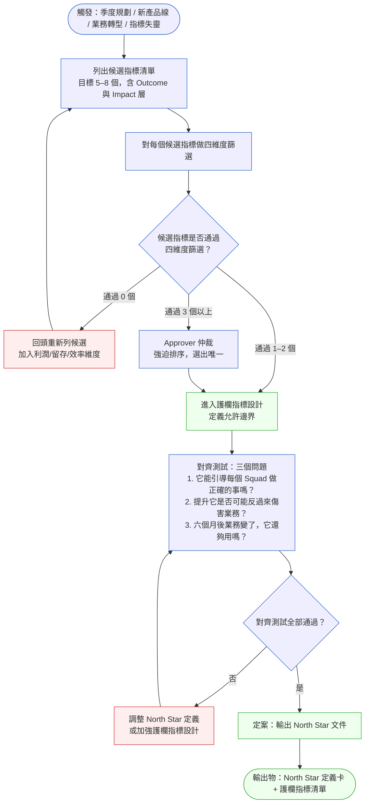
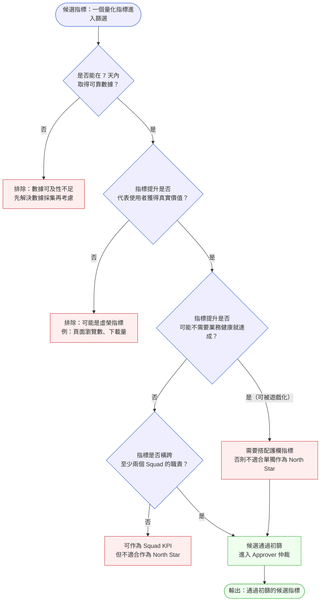

# 第 34 章 | North Star Metric：選對唯一重要的指標

> **前置閱讀**：[Ch 33 — Saying No：拒絕的技術](../part-05-decisions/ch-33-saying-no.md)
> **下游章節**：[Ch 35 — Experimentation & A/B Testing：決策有多可信？](./ch-35-experimentation.md)
> **延伸閱讀**：[Ch 26 — PM × Data：指標的定義與所有權](../part-04-collaboration/ch-26-pm-data.md)
> **SA/SD 對照**：[SA/SD 第 30 章 — SRE、SLO、Chaos Engineering](../../book/part-05-quality/ch-30-sre-slo-chaos.md)
> ⸺ SA 視角從服務等級目標（Service Level Objective，SLO）出發，關注系統可靠性與工程目標的量化；本章關注哪一個業務指標能代表產品整體健康，以及如何讓它成為組織決策的單一引力點。

---

## §34.1 冷觀察

Q3 結算那天上午，CartFlow 的全員週報截圖在 #general 頻道傳開了。

GMV（Gross Merchandise Value，平台總交易額）成長 35%，超標整整十個百分點。三個 Squad 的指標全數達成綠燈，PM 們把各自 OKR 的完成度截圖往頻道裡貼，一排拍手與火箭的表情符號蓋了過去。成長 Squad 的 Fiona 貼了一張促銷活動轉換漏斗圖，配文「九週連跑，沒讓任何一個流量浪費」；物流 Squad 的 Tina 貼了訂單履行時間的折線，最後一週壓進了 18 小時；商品 Squad 的 Jay 補了一句「品類擴展奏效，GMV 是我們三家一起堆出來的」。CPO Vera 在頻道裡回了一句：「Great work, team. Q4 let's keep this momentum.」

那天沒有人覺得有什麼不對。每個 Squad 都做到了自己答應過的事，每一條指標都往對的方向走，週報上沒有一格是紅的。

兩週後，財務長 David 走進 Vera 的辦公室，把門關上。那場會談沒有別人在場，但結果在 Q3 財報出來的那個早上就攤在所有人面前——CartFlow 的 GMV 確實漲了 35%，但稅前淨利潤是負的。Q3 每賣出去一塊錢，公司平均倒貼 0.08 元。漲得越快，虧得越多。

分析師 Ada 把數字一層層翻出來。退貨率 42%，比同期電商行業平均值高出 23 個百分點。「加購送折扣券」的促銷在 Q3 連跑了九週，每單折讓平均 18.7 元；免費隔日達把物流成本在季末推到 GMV 的 17.3%，比年初漲了 6 個百分點。每一筆數字單獨看都解釋得通：成長 Squad 用 GMV 做北極星，促銷是把 GMV 往上推最快的工具，所以促銷一波接一波；物流 Squad 用「訂單履行時間」做 KPI，免費隔日達是壓低履行時間最直接的手段。每個人都在認真地把自己負責的那條線拉高。

問題是，沒有任何一個指標在追蹤退貨率。沒有任何一個 Squad 的 OKR 跟利潤掛鉤。三條被拉得很漂亮的線，合起來指向的是虧損，而組織裡沒有任何一個位置看得到這件事。

Q3 結算復盤會議上，Ada 把那張「GMV vs. 淨利潤」的剪刀圖投出來。安靜了幾秒之後，有人問了一句：「GMV 到底是我們認真選出來的 North Star，還是因為它最好達成、所以大家就一直拿它當靶？」Fiona 說當初進公司時 GMV 就已經是公司在追的數字了；Jay 說他一直以為利潤是財務在管的、不在產品的責任範圍；Tina 說她從沒覺得物流成本算進過任何人的指標。三個 Squad PM 對「我們的北極星是什麼、它為什麼是它」給出了三個不一樣的答案——而且沒有一個答案能說出是誰、在什麼時候、在哪場會議上拍板過它。

沒有人答得出來。

---

## §34.2 真問題

### 表面需求（What）

CartFlow 的問題，第一眼看起來是「North Star 選錯了」——把 GMV 當作北極星，沒把利潤算進去，自然會被 GMV 帶著往虧錢的方向衝。

直觀解法也很順手：把 North Star 換成「淨利潤」或「毛利率」，或者把退貨率加進來當作護欄。換一個指標，把漏掉的維度補上，問題不就解了嗎？

這個方向不能說錯，但它治的是症狀。如果真正的病因沒被處理，把 GMV 換成毛利率之後，同樣的故事會在下一個季度換一個指標重演——下次也許是「為了壓毛利率而砍掉所有獲客投入，結果新客枯竭」。指標換了，但讓指標失控的那個機制還在。

### 業務目標（Why）

把它拆開來看。CartFlow 的 GMV 之所以能在業務已經出問題的狀況下繼續被當作北極星，根本原因不是「這個指標的數學性質不好」，而是**「選指標」這件事在 CartFlow 從來沒有被當成一個正式的決策做過**。GMV 不是被選出來的，它是被「沿用」下來的——公司早期它是合理的，後來業務變了，它沒跟著變，因為從來沒有一個流程負責讓它跟著變。

要看清這一點，先把 CartFlow 在量的東西拆成三層：

| 層次 | CartFlow 的現況 | 真正在量什麼 |
|---|---|---|
| **產出（Outputs）** | 促銷活動次數、功能上線數、A/B 實驗量 | 團隊做了多少事 |
| **成果（Outcomes）** | GMV ↑ 35%、訂單履行時間 ↓、NPS ↑ | 各 Squad 引發的使用者行為改變 |
| **影響（Impact）** | 淨利潤為負、退貨率 42%、物流成本 17.3% GMV | 業務整體是否真的健康 |

這個拆法之所以有效，不在於它把三個詞放進了同一張表，而在於它替每一種失敗提供了一個可以落腳的位置。大多數指標問題並不是「這個指標本身錯了」——GMV 確實在量一件真實的事；問題在於它被放進了錯誤的層次。但「放錯層次」這個診斷，只有在三層結構存在之後才能被說出口：沒有 Outcome 與 Impact 的區分，組織裡唯一可以說的話就是「這個指標不好，換一個」，治的永遠是症狀。CartFlow 最後能說出「GMV 是 Outcome，卻被當成 Impact 用」，正是因為這張表替那個錯位創造了一個名字；在此之前，Fiona、Jay、Tina 三個人連爭論都找不到起點。這個三層結構同時也還原了價值在產品組織裡實際流動的方向：團隊做了什麼事（Outputs）會改變使用者行為（Outcomes），改變了的使用者行為再換算成業務能不能活下去（Impact）。每一層都是下一層的前提，方向是單向的。能在哪一層精確地指出斷點，才能決定要修的是工具、行為，還是業務邏輯本身——而不是把所有問題都歸結成「北極星選錯了」。

三層之間的關係是有方向的：團隊用 Outputs（做事）去換取 Outcomes（使用者行為改變），再用 Outcomes 去換取 Impact（業務健康）。北極星的作用，是把整個組織的注意力釘在最接近 Impact、同時又能被團隊日常行動驅動的那一層。

CartFlow 的三個 Squad 都把自己那格 Outcomes 推到了極致——促銷確實把 GMV 推高了、隔日達確實把履行時間壓低了。但 Impact 層的指標沒有任何人在看。關鍵的誤判在這裡：**GMV 是一個 Outcome 指標，不是 Impact 指標**。它告訴你平台上流動了多少錢，卻沒告訴你公司是在賺錢還是在賠錢中流動這些錢。一個健康的業務 GMV 會漲，一個正在用補貼買成長、即將失血而死的業務 GMV 也會漲——GMV 對這兩種情況一視同仁。把 GMV 當北極星，等於是讓整個組織盯著一個分不清死活的指標全速前進。

這正是把 Outcome 誤認為 Impact 的典型陷阱：選了一個「會動、好看、容易推」的指標，卻沒問它動起來的時候，業務到底是在變好還是在變壞。當一個指標可以在業務惡化的同時持續上漲，它就喪失了當北極星的資格——因為它無法在組織快要撞牆時亮起紅燈。

### 決策瓶頸（Who × When）

那為什麼這個誤判沒有被任何人攔下來？因為 CartFlow 有兩個並列的、誰都沒去填的決策空白。

**第一個空白：North Star 從未被正式定義，所以也從來沒有一個拍板的時刻。**

GMV 成為北極星，不是因為有人在某場會議上說「這是 CartFlow 現階段最重要的業務指標，我們以它為準」，而是因為「GMV 最容易量、最容易達成、最容易在週報上呈現」。這種靠慣性沿用的「預設最大值」指標，在公司早期搶規模時通常沒問題；但當業務開始需要從規模轉向盈利，它的危險才會浮現——而沒有任何一個正式的拍板時刻，就沒有任何一個自然的時機去問「它還適合嗎」。

所以這裡要把瓶頸講到非常具體，不能停在「應該有人拍板」這種模糊話：**這個拍板的人是 CPO Vera，拍板的場合是每季度規劃啟動會（Quarterly Planning Kickoff），時機是在各 Squad 把 OKR 寫進系統之前。** North Star 的定義是整個 PM team 排優先順序的依據，它必須在 Squad 開始設計自己的 key results 之前就定案、且由一個具名的人負責確認它本季是否仍然有效——因為一旦 Squad 的 OKR 寫完、Sprint 開跑，北極星的慣性就會大到沒有人想動它。它絕不能在 Slack 頻道的拍手表情符號裡默默成形，也不能由「大家都這麼用」來代替決策。Vera 在 Q3 之前從未在任何一場季度規劃會上被要求對「我們的 North Star 是 GMV，這在本季仍然成立」簽字——這個簽字動作的缺席，就是第一個空白。

**第二個空白：護欄指標（Guard Rail Metrics）缺席，而且它本該和 North Star 在同一場會議上一起定案。**

退貨率、毛利率、物流成本佔比這些指標，需要在 North Star 被拍板的同一個時刻一起被定案為護欄。護欄指標的用途不是「跟 North Star 競爭誰才是第一」，而是當組織全力推動 North Star 時，替它畫出「不准用這種方式達成」的邊界。即使 CartFlow 想保留 GMV 當北極星，只要在同一場季度規劃會上把「退貨率不得超過 22%、物流成本不得超過 12% GMV」釘成帶門檻的護欄，Q3 的故事就會在退貨率爬到 25% 的某個星期被某個人收到的警報打斷，而不是拖到財報才被財務長關起門來談。

所以決策瓶頸可以一句話收緊：**North Star 是什麼、護欄有哪些，必須由 CPO 在每季規劃啟動會上、在 Squad OKR 落地之前一次拍板，並具名為它的有效性負責。** 這個動作沒做，任何 Squad 的努力都是在黑暗裡射箭——射得越準，越可能整齊地射向錯誤的方向。

> §34.2 的收束：CartFlow 想改善的本來是業務的健康成長（Impact），但從來沒有一個具名的人、在一個固定的時機點，明確定義過「成長」的邊界在哪裡。每個 Squad 量的都是自己能推動的 Outcomes，沒有護欄在旁邊提醒「這樣做已經超出健康範圍」，也沒有 CPO 在季度起點拍板過北極星本季是否還算數——這才是 GMV 一路成長、利潤一路為負、卻沒有任何一個警報響起的根本原因。

---

## §34.3 決策框架

把上面兩個空白翻譯成可執行的動作，會得到一條從「列候選」到「定案輸出」的單向收斂路徑。這一節給的不是「你的 North Star 應該是哪個指標」——那要看你的業務階段，沒有人能隔空替你回答——而是一套讓你自己判斷、並且能在會議室裡擋下錯誤候選的篩子。

### 圖 A — North Star 選擇工作流程



讀這張圖時，請把它當成一條只能往下走、不能橫向擴張的漏斗。最常見的失敗不是「走錯方向」，而是「在某一格停下來開始擴大討論」——比方在「列候選清單」那格越列越多、列到十五個還在加，或在「Approver 仲裁」那格把仲裁變成「兩個都很重要那就都留著」。每一格的設計意圖都是收斂：候選清單限定 5–8 個是為了逼你一開始就排除明顯的虛榮指標；四維度篩選是把「感覺重要」翻譯成可比較的分數；Approver 仲裁那一格之所以畫成必經節點，是因為當有三個以上候選都通過篩選時，光靠數據分不出高下，這時候需要的不是再多一輪分析，而是一個有權力的人替組織做出「這個比那個重要」的價值判斷。CartFlow 缺的就是這一格——它從第一格直接跳到了「沿用 GMV」，中間所有篩子都沒裝上。最後那一格特別關鍵：對齊測試的第二個問題「提升它是否可能反過來傷害業務」，正是 GMV 在 Q3 沒被問過的那一句。

### 圖 B — North Star 候選指標篩選決策樹



這棵樹的每個問題都是一把獨立的篩子，要一個一個過、不能跳。把 GMV 丟進這棵樹試走一遍，會看得很清楚它該在哪裡被攔下來：第一關「7 天內能否取得可靠數據」，GMV 過——數據天天都有；第二關「提升是否代表使用者獲得真實價值」，GMV 勉強過——平台上有交易發生確實對應某種價值；但走到第三關「指標提升是否可能不需要業務健康就達成」，GMV 應該在這裡被亮紅燈——虧本促銷可以毫不費力地把 GMV 推高，這就是「不需要業務健康就能達成」的教科書定義。樹在這一關不會直接把 GMV 踢掉，而是把它導向 R3「需要搭配護欄指標」。換句話說，這棵樹給你的判斷不是「GMV 不能用」，而是「GMV 如果要用，就絕對不能裸著用，必須配護欄」。CartFlow 的錯不在選了 GMV，而在於讓 GMV 裸奔了整個 Q3。第四關「是否橫跨至少兩個 Squad」則是另一種用途：它幫你把「該當 Squad KPI 的指標」和「該當全公司北極星的指標」分開——只影響單一團隊的指標再重要，也不該被拱上北極星的位子。

### 四維度篩選矩陣

候選指標進入正式評估前，用以下四個維度打分（每維度 1–3 分）。這張表的價值在於把「我覺得這個指標比較好」這種模糊直覺，變成桌面上可以逐格爭論的分數——當兩個 PM 對某個指標意見不合，吵的應該是「它在抗遊戲性上到底幾分」，而不是「我就是覺得它好」。

| 維度 | 評估問題 | 3 分（強） | 2 分（中） | 1 分（弱） |
|---|---|---|---|---|
| **可感知性** | 指標提升時，使用者能感受到更好的體驗？ | 使用者 7 天內直接感知到行為改變 | 使用者間接感知，需 14–30 天觀察 | 後台數字，使用者完全無感 |
| **可驅動性** | PM 和工程師的日常決策能影響這個指標？ | 單次 Sprint 能明確推動指標 3%+ | 需多季度投入才能影響 | 受外部因素主導，內部努力影響有限 |
| **抗遊戲性** | 在不真正改善業務的情況下，能把指標做高嗎？ | 不易被短期操弄，操弄成本高 | 可操弄但需較大資源投入 | 促銷、刷量、捆綁訂閱都能推高 |
| **健康代理性** | 指標持續提升，代表業務在健康成長？ | 強相關，能排除業務衰退情境 | 中等相關，需搭配護欄 | 高 GMV 可能同時伴隨高退貨、高虧損 |

**評分門檻**：總分 ≥ 9 才推薦作為 North Star 候選。

**常見指標評分參考表**（供工作坊快速定位）：

| 指標 | 可感知性 | 可驅動性 | 抗遊戲性 | 健康代理性 | 總分 | 建議 |
|---|---|---|---|---|---|---|
| GMV | 2 | 3 | 1 | 1 | 7 | 需強護欄；抗遊戲性過低，單獨裸跑高風險 |
| DAU | 1 | 3 | 1 | 1 | 6 | 典型虛榮指標；推送轟炸也能推高 |
| 14 日留存率 | 2 | 2 | 3 | 3 | 10 | 推薦；難以被短期操弄，預測長期健康 |
| 活躍付費用戶數（APU） | 2 | 2 | 2 | 3 | 9 | 推薦；搭配退貨率護欄可防止套利行為 |
| NPS | 3 | 1 | 2 | 2 | 8 | 可感知性強但可驅動性弱；適合作為護欄 |
| 毛利率 | 1 | 1 | 3 | 3 | 8 | 健康代理性強但可驅動性差；適合財務護欄 |
| 月活躍用戶（MAU） | 1 | 3 | 1 | 1 | 6 | 與 DAU 相同問題；可被無效流量充數 |
| 功能採用率 | 2 | 3 | 2 | 2 | 9 | 臨界值；適合功能導向產品，需搭配留存護欄 |
| LTV（客戶終身價值） | 1 | 1 | 3 | 3 | 8 | 健康代理性強但滯後 90+ 天；適合輔助指標 |

關鍵不是把四個維度全拉到滿分——很少有指標四項都是 3 分。關鍵是看「弱在哪一維」並判斷那個弱點能不能被護欄補上。可感知性或可驅動性偏弱，通常代表這個指標不適合當北極星（推不動或使用者無感）；但抗遊戲性偏弱不一定要淘汰它，因為遊戲化的風險可以靠護欄指標關起來。把 CartFlow 的 GMV 拉進來打分：可驅動性 3 分（促銷馬上能推高）、可感知性 2 分（使用者對「平台總交易額」其實無感）、健康代理性 1 分（能在虧損下持續成長）、抗遊戲性 1 分（促銷就能輕易遊戲化）——總分 7 分，沒到 9 分門檻。這個分數結構在告訴你一件很具體的事：GMV 的問題集中在右半邊兩個維度（健康代理性和抗遊戲性都拿了最低分），這正是「會動但分不清死活」的指標特徵。如果非要用它，護欄就必須剛好補在這兩個弱點上——這也正是 §34.5.1 那張重建卡為什麼把退貨率和促銷折讓設成護欄的原因。

### DACI：North Star 定義的決策分工

North Star 定義不是 PM 能獨立完成的決策——它涉及公司層級的優先排序，必須有一個具名的拍板者。這裡用 DACI（Driver、Approver、Contributor、Informed，責任分工模型）把「誰負責什麼」釘死。

| DACI 角色 | 全稱 | 指派對象 | 具體責任 |
|---|---|---|---|
| **D** Driver | 推動決策進行 | 產品負責人 PM Lead 或 Head of Product | 主持 North Star 工作坊；彙整候選清單；推動篩選與仲裁流程；每週彙整指標週報 |
| **A** Approver | 最終拍板 | CPO 或 CEO（視公司規模）| 在候選 ≥ 2 個時強制排序；在工作坊結束時確認唯一定義；每季確認 North Star 仍有效 |
| **C** Contributor | 提供輸入 | 各 Squad PM、資料分析師、財務 BP | 在各自業務域提供「為什麼這個指標適合 / 不適合」的數據與觀察；護欄觸發時提供診斷資料 |
| **I** Informed | 被通知結果 | 工程 leads、設計 leads、銷售負責人 | North Star 定案後通知，用於後續 OKR 設計與 Sprint 規劃 |

讀這張表時，請把全部注意力放在 A 這一格。整套流程裡只有 Approver 是不可省略、也不可由委員會代替的角色——Driver 可以換人主持、Contributor 可以多可以少，但只要 Approver 缺席或被寫成「Leadership Team」這種沒有臉孔的集體，整個流程就會在最後一哩失效。**Approver 空白是這套框架最常見的失敗模式**：North Star 工作坊熱熱鬧鬧開完、候選列得很完整、四維度也打了分，但散會時沒有一個具名的人說出「就是它」，結果就是「我們討論出了三個候選，大家回去繼續做自己的」。CartFlow 的整個 Q3 就活在這個空白裡——沒有人是 GMV 這個北極星的 Approver，所以也沒有人有義務在它失靈時站出來改它。把 A 填上一個真實姓名（不是頭銜、不是團隊），是這張表唯一真正要你做到的事。

#### Driver-Approver 衝突處理路徑

DACI 運作順暢時，Driver 推動、Approver 拍板，兩者方向一致。但現實中會出現摩擦：一個推動 North Star 的實驗正在讓 APU 上升，同時某條護欄接近門檻，Driver 認為應該繼續，Approver 認為應該暫停。這種衝突如果沒有明確的解決路徑，往往演變成私下的政治拉鋸，拖到數字已經超界才收場。

下表給出四種常見衝突場景的標準處理路徑：

| 衝突場景 | Driver 立場 | Approver 立場 | 處理路徑 |
|---|---|---|---|
| 實驗讓 North Star ↑，但護欄指標觸警告 | 繼續實驗，護欄可接受 | 暫停，守護欄優先 | **Approver 決定**：護欄是邊界，不是參考值；暫停實驗，Driver 7 天內提出護欄修正方案或替代實驗 |
| North Star 連續 3 週下滑，Driver 認為是正常季節波動 | 等待，下季回升 | 觸發診斷評審 | **Approver 觸發評審**：但 Driver 有義務在 48 小時內提交「是否為季節因素」的數據支撐 |
| Driver 認為 North Star 定義已過時，建議更換 | 需要更換 | 維持現狀 | **召開專項評估會**：Driver 提交四維度重新評分 + 業務轉型依據；Approver 在 2 週內給出決定 |
| 護欄門檻被認為設定過嚴，阻礙 North Star 推進 | 放寬護欄 | 維持門檻 | **數據驅動談判**：Driver 提交「門檻放寬至 X 的業務影響模擬」；Approver 做最終裁定，禁止口頭放寬 |

這四行的共同邏輯是：衝突時預設 Approver 優先，但 Driver 有權要求數據驅動的重新評估。任何口頭「這次讓一下」的妥協都不算數，必須走正式流程並更新定義卡。

#### 治理節奏

North Star 不是定完就不管的文件。以下節奏確保它持續有效：

| 週期 | 誰負責 | 做什麼 |
|---|---|---|
| **每週** | Driver | 彙整 North Star 週報（含護欄指標）；護欄觸警告時 24 小時內發起診斷 |
| **每月** | Contributor（各 Squad PM） | 向 Driver 提交「我的 KPI 和 North Star 因果鏈健康度」觀察 |
| **每季** | Approver | 季度規劃啟動會上正式確認 North Star 仍有效；更新護欄門檻（如有調整） |
| **每年** | Approver + Driver | 年度北極星複檢：業務轉型是否讓現有 North Star 失去代理能力？ |

治理節奏的設計重點：讓「它還適合嗎」這個問題在每季規劃之前自動被問到，而不是等到財報異常才回頭找原因。

### 決策表：情境 × 推薦做法

不同的觸發情境需要不同的動作。下表把現場最常見的五種情境攤開，每一行的「常見錯誤」欄都對應一種真實會在組織裡發生的滑坡，讀的時候建議先看那一欄、再回頭看推薦做法。

| 情境 / 觸發條件 | 推薦做法 | PM 關注點 | 常見錯誤 |
|---|---|---|---|
| 公司從未正式定義 North Star，各團隊追各自 KPI | 辦 90 分鐘 North Star 工作坊，限定 CPO 到場，散會前輸出唯一指標定義 | CPO 是否願意說「這個比那個重要」；工作坊不能以「兩個都重要」結束 | 工作坊記錄三個「候選 North Star」，下季度繼續各跑各的 |
| North Star 定義了，但某個 Squad 的 KPI 跟 North Star 方向衝突 | 把衝突攤開來看：Squad KPI 是否只是達成 North Star 的路徑指標？如果是，讓它成為衛星指標不必入 North Star | 區分「路徑指標（促成 North Star 的手段）」與「North Star 本身」 | Squad PM 堅持「我的 KPI 也很重要」，結果 North Star 又多了一個 |
| North Star 達成了，但某個護欄指標快撞上限 | 暫停推動 North Star 的相關實驗，先確認護欄指標能否在可接受範圍回穩 | 護欄指標的用途是「不能用這種方式達成 North Star」；觸碰護欄要停，不是跟護欄談判 | 把護欄指標當作次級 KPI，提升 North Star 時用「這次護欄讓一下」合理化行動 |
| North Star 持續下滑，但每個 Squad 的 Outcomes 都在漲 | 回頭檢查 North Star 與 Squad 指標之間的因果鏈是否斷裂 | 找「哪一段鏈接斷了」，而不是「哪個 Squad 沒努力」 | 用「外部環境不好」解釋 North Star 下滑，繼續讓各 Squad 追 Outcomes |
| 業務轉型或新產品線進入，現有 North Star 不再適用 | 啟動 North Star 重新定義流程，明確宣告舊 North Star 的有效期限 | 舊 North Star 的惰性很大，需要 Approver 正式宣告失效，不能讓它自然凋零 | North Star 沒有正式更新，但 Squad 已默默開始追新的指標，形成隱性的多 North Star 狀態 |

這五行有一個共同的暗線：失敗幾乎都不是「沒選指標」，而是「選了之後沒有人有權力替它做艱難的取捨」。第二、三、五行的常見錯誤都是同一種——當 North Star 要求某個 Squad 讓步、或要求暫停一個正在賺 Outcome 的實驗、或要求宣告一個用慣了的指標失效時，沒有人願意當那個喊停的人，於是組織用「也很重要」「讓一下」「外部環境不好」把該做的取捨稀釋掉。北極星的全部威力，就在它能在這種時刻給組織一個明確的「誰讓步」的答案；而能行使這個威力的，永遠是那個具名的 Approver。

### §34.3.5 North Star 更換作戰手冊

**什麼情況下換**：業務轉型（從規模優先轉向盈利優先）、新產品線 GMV 超過總 GMV 25%、或 North Star 在連續三個季度未能預測業務方向時，觸發更換評估。

換 North Star 不是一個會議的事，它是一條 8–12 週的過渡路徑。

**更換時間線**：

```
第 0 週    Approver 宣告：現有 North Star 進入過渡期，正式評估新候選
第 1–2 週  Driver 主持四維度重新評分工作坊，產出新候選 1–2 個
第 3–4 週  Shadow Tracking：新舊 North Star 並行追蹤，確認數據可靠性
           （此期間所有決策仍以舊 North Star 為準）
第 5–6 週  Approver 根據 Shadow Tracking 數據拍板新 North Star
第 7–8 週  OKR 級聯更新：各 Squad 在 Approver 授權下啟動期中 OKR 修正
           （只修改與新 North Star 直接衝突的 key results）
第 9 週起  新 North Star 正式生效；舊指標轉為護欄或輔助參考指標
```

**OKR 級聯更新的三個原則**：

1. **只改衝突項**：不是把所有 OKR 都重寫，而是找出與新 North Star 直接衝突的 key results，加上限制條件（如把「GMV 成長 20%」改為「GMV 成長 15%，且 APU 同步成長 10%」）。
2. **Approver 授權期中修正**：期中修正需要 Approver 明確授權，不能由 Squad PM 自行調整，否則每個 Squad 都會「順便」更新自己的 OKR。
3. **溝通在 Sprint 前完成**：OKR 修正必須在下一個 Sprint 規劃之前到位，否則工程師會繼續根據舊方向排工作。

**Shadow Tracking 的數據要求**：新 North Star 要能在過渡期間穩定取得 T+1 數據（24 小時延遲），若數據管道尚未就緒，Shadow Tracking 的結束時間必須等到管道穩定後再起算——不能用 T+5 的數據做實時決策依據。

### If-Then 框架：North Star 健康度快速評估

在季度規劃前，用這份評分矩陣替你的 North Star 做一次體檢。每一項都是是非題，目的是把「感覺還行」變成一個能在五分鐘內算出來的分數。

| 檢查項目 | Yes = 1 | No = 0 |
|---|---|---|
| North Star 有唯一文字定義（一句話，不含「以及」「同時」） | 1 | 0 |
| North Star 有計算公式（分子 / 分母 + 更新週期） | 1 | 0 |
| North Star 有指定 Approver（具體姓名，非「Leadership Team」） | 1 | 0 |
| 至少有 2 個護欄指標，且每個護欄有「不得超過 / 低於」的門檻值 | 1 | 0 |
| 每個 Squad 的 KPI 能對應到 North Star 的哪一層（路徑或直接貢獻） | 1 | 0 |
| North Star 在過去 90 天內被 Approver 確認仍然有效 | 1 | 0 |

每一檔分數都對應一個具體的下一步動作，不是給你一個評語：

- **If** 得分為 6（全部通過）→ **Then** North Star 框架健全，季度規劃可以直接推進，把這份矩陣存檔當作本季的基準。
- **If** 得分為 4–5（有一到兩個空白）→ **Then** 先把缺的那一兩格補齊（多半是半天的工作，最常見的是護欄缺門檻或 Approver 未具名），補完再開規劃會；多 Squad 並行優化時這種程度的空白足以孵出 CartFlow 式的靜默劣化。
- **If** 得分 ≤ 3（North Star 尚未真正建立或已失效）→ **Then** 不要急著規劃下一季，優先召開定義工作坊把北極星重新拍板，其他規劃一律暫緩；CartFlow 在 Q3 之前若做這份體檢大約只有 2 分——有 GMV 看似有定義，但 Approver、護欄門檻、90 天確認三格全空。
- **If** North Star 超過 12 個月未被 Approver 正式確認有效 → **Then** 主動發起年度北極星複檢，不要等到 OKR 評審才發現指標已與業務方向脫鉤。

這份矩陣的設計重點是：得分高低本身不是結論，得分對應的動作才是。它要回答的不是「我的 North Star 好不好」，而是「我現在該做什麼」。

### §34.3.6 North Star 失靈診斷

North Star 選好了、護欄也設了，但三個月後你發現數字不對——不是因為業務差，而是因為 North Star 本身出了問題。以下四種失靈模式給出可操作的診斷路徑。

| 失靈模式 | 症狀 | 根因 | 診斷步驟 |
|---|---|---|---|
| **指標脫鉤**：North Star ↑，業務 ↓ | GMV 漲 20%，但利潤繼續為負 | Outcome 誤認為 Impact；指標無法代理真實業務健康 | 1. 拉 North Star 與業務健康指標的 90 天相關係數；2. 若相關係數 < 0.5，觸發四維度重新評分；3. Approver 決定是否換指標或加護欄 |
| **落後指標**：業務 ↑，North Star 才慢慢 ↑ | 新品類上線後訂單量暴漲，但 APU 要 45 天後才反映 | 指標本身的統計視窗過長（如 14 日/30 日視窗導致滯後） | 1. 評估縮短統計視窗（14 日改 7 日）是否可行；2. 加入前置指標（Leading Indicator）作為周度監控；3. 向 Approver 說明滯後原因，調整觸發條件的等待時間 |
| **護欄失效**：North Star ↑，護欄指標也超界 | APU 漲、退貨率也衝破緊急門檻 | 護欄門檻設定過寬，或 Squad 找到了護欄的漏洞 | 1. 立即觸發 Approver 緊急介入；2. 暫停相關實驗；3. Driver 在 72 小時內提交護欄失效分析，決定是調整門檻還是增加護欄維度 |
| **可驅動性崩潰**：North Star 無法被推動 | 團隊全力衝，North Star 紋風不動超過 8 週 | 指標受外部因素主導（市場飽和、競品替代、季節性），內部努力無法影響 | 1. 拆解 North Star 的因果鏈，找出哪一段斷裂；2. 評估是否需要新增前置指標讓 Sprint 可以追蹤；3. 若連前置指標也無法驅動，重新觸發 North Star 更換評估 |

**危機情境的快速決策**：當遇到季中突發事件（監管禁令、供應鏈中斷、競品爆發式搶佔市場），North Star 可能在 48 小時內失去意義。此時的決策路徑：

1. **第一個 24 小時**：Approver 宣告 North Star 進入「暫停評估」狀態，暫停所有以 North Star 為依據的實驗
2. **第 2–3 天**：Driver 提交「危機下的臨時指標方案」（通常是切換到更具防禦性的護欄指標，如現金流或留存率）
3. **第 1–2 週**：評估危機是否永久改變業務邏輯，決定是臨時暫停還是正式啟動 North Star 更換流程

危機中不需要完美的新 North Star——需要的是讓組織知道「此刻我們在守什麼」，避免各 Squad 各自解讀、在混亂中用不同的判準做資源決策。

---

## §34.4 踩坑清單

**反模式：虛榮指標冒充 North Star**

現象：選了 DAU（日活躍用戶數）、頁面瀏覽數、App 安裝量作為 North Star，每週呈現漂亮的成長曲線，但對業務成果的預測能力接近零。

根因：虛榮指標（Vanity Metrics）容易達成、容易呈現，對 PM 的短期績效友好，所以特別誘人。但它們缺乏「健康代理性」——DAU 高可以是因為產品好用，也可以是因為推送通知太煩、使用者每天被迫打開 App 又立刻關掉。在實務中這會導致一種最昂貴的損失：團隊把一整個季度的工程資源砸在「拉高 DAU」上，曲線真的漲了、週報真的好看了，但留存、付費、營收紋風不動——等到管理層終於發現北極星和錢之間沒有因果關係，往往已經燒掉了好幾個 Sprint 的人力，而這段時間真正該做的留存或變現工作完全沒人碰。比起 CartFlow 那種「衝太猛而虧錢」，虛榮指標的代價是「忙了一整季，業務原地踏步」。

> 修正方向：用四維度篩選矩陣的「健康代理性」這一維做反向壓力測試——問自己「在這個指標持續成長的同時，業務有沒有可能正在惡化？」如果答案是「有可能」，就必須加護欄指標，或重新考慮它根本不該當北極星。

---

**反模式：North Star 工作坊結束有兩個候選**

現象：工作坊花了兩小時，列出七個候選，討論到最後剩兩個，CPO 說「這兩個都很重要，就都追吧」，結果是零個 North Star。

根因：North Star 的核心功能是排他性——當兩個 Squad 方向衝突時，它告訴你誰讓步。一旦有兩個北極星，衝突時誰都不必讓步，它就喪失了存在的意義。實務後果是這樣展開的：兩個並列的北極星在風平浪靜時相安無事，但只要遇到資源要二選一的時刻（一個工程團隊只能先做 A 或先做 B），兩派 PM 各自舉著「我這個也是公司北極星」開始角力，決策卡住，最後升級到 CPO 桌上——於是 CPO 每一次資源衝突都得親自仲裁一遍。當初為了避免「說某個指標比較重要」的尷尬而留下兩個北極星，代價是 CPO 整季被捲進本來該由北極星自動解決的瑣碎仲裁裡。

> 修正方向：工作坊在進入決策環節前就明確告知 Approver：「散會前必須輸出一個指標定義，不接受並列」。如果 CPO 堅持兩個都重要，把其中一個降格為護欄指標——它依然會被追蹤、違反時依然觸發行動，但它不是優先排序的依據。

---

**反模式：North Star 定了，護欄指標沒有門檻值**

現象：North Star 定義文件的護欄欄填了「退貨率」「物流成本佔比」，但沒填任何數字邊界。Squad 在優化 North Star 時，每次觸碰護欄都用「這個情況比較特殊」過關。

根因：護欄沒有明確的「不得超過」數字，就成了一個每次都能重新談判的參考值，而不是真正的護欄。沒有門檻的護欄等於沒有護欄——它只在事後復盤時被拿出來當作「我們其實有列」的證據。CartFlow 的退貨率在衝到 42% 之前，幾乎肯定有六到八個星期是在 25%、30%、35% 緩慢爬升的，每一週都有人「特殊處理」了一次，但因為從沒設過「超過 25% 就要評審」的門檻，這條緩慢失血的曲線沒有在任何一週觸發過任何人的動作，一路爬到財報才爆出來。沒有門檻的護欄，把「本來可以早八週發現」變成了「等到虧損兌現才發現」。

> 修正方向：每個護欄指標設三個邊界：正常範圍（可接受）、警告門檻（需要 Driver 評估是否暫停實驗）、緊急門檻（Approver 必須介入）。門檻要在業務健康時就定義好，不能等危機發生後再回頭追討一個「早知道」的數字。

---

**反模式：North Star 換了，但 Squad 的 OKR 沒有跟著更新**

現象：公司在 Q1 把 North Star 從 GMV 改成「活躍付費用戶數（Active Paying Users）」，但各 Squad 的 Q1 OKR 早在 Q4 末就規劃完成，全是 GMV 相關的 key results，沒有人去調。

根因：North Star 更換需要級聯更新到每個 Squad 的 OKR——這是一件有時間成本的苦工，在正規規劃週期之外發生時特別容易被跳過。實務後果是「名義北極星」與「實際北極星」並存：牆上掛的、CEO 報告裡寫的是 APU，但真正驅動每個 Squad 每天做什麼決定的，還是那些沒改的 GMV key results。團隊嘴上追新北極星、手上做舊北極星的事，整整一季的努力流向和宣稱的方向背道而馳，而且因為「文件上明明寫了新指標」，這種脫鉤特別難被察覺——通常要到季末對不上帳才暴露。

> 修正方向：North Star 更換時，Approver 必須同時授權一次 OKR 的期中修正機會——哪怕只是把 GMV 類 key results 補上一個限制（「GMV 成長 20%，且毛利率不低於 12%」），也遠比讓舊 OKR 繼續驅動錯誤方向有效。更換流程詳見 §34.3.5。

---

**反模式：拿 North Star 當 CEO 報告的 KPI，而不是決策工具**

現象：每月 Business Review 都展示 North Star 的走勢圖，圖畫得漂亮，但從來沒有人用「North Star 下滑」這個信號觸發任何決策——不暫停實驗、不召開衝突評審、不重排優先順序。

根因：North Star 被當成「展示健康度的指標」而不是「觸發決策的指標」，在組織裡變成儀式性而非功能性的存在。漲了大家拍手，跌了大家說「下個月會回來的」。實務後果是組織養出一種對北極星的鈍感：因為它從沒真的觸發過任何痛苦的動作，所有人逐漸學會把它當背景噪音——於是當它真的開始持續下滑、真的在預警一場危機時，沒有人會把它當一回事，反應速度和它根本不存在時一模一樣。一個從不觸發行動的北極星，最終訓練出一個對它免疫的組織。

> 修正方向：在 North Star 定義文件裡明確寫出觸發條件——下滑超過多少，Driver PM 必須在幾小時內發起評審、Approver 必須在幾天內做出決定。把北極星的下滑從「觀察事件」變成「決策觸發器」。

---

## §34.5 交付清單 ⸺ 一頁式 North Star 定義卡模板

本章的核心交付物是一張**一頁式 North Star 定義卡**，它要在一頁之內回答四個問題：我們追什麼（基本定義）、不准用什麼方式追（護欄指標）、誰拍板誰負責（DACI）、什麼狀況下要動（觸發條件）。配套產出包括：（1）四維度篩選矩陣的打分記錄；（2）North Star 健康度評分矩陣的本季得分；（3）Squad 對應關係表，讓每個團隊看得到自己的 KPI 接在北極星的哪一層。下面是空白模板。

````markdown
### North Star 定義卡（North Star Definition Card）
> 版本:v0.1 | 撰寫日期:YYYY-MM-DD | 擁有人:{名字}

### 基本定義
- North Star 名稱：{中文名稱}（{英文名稱}）
- 一句話定義：{描述這個指標衡量什麼，禁止「增加」「提升」等模糊動詞，必須是可量化的狀態描述}
- 計算公式：{分子} / {分母} × {倍率}（或其他計算方式）
- 數據來源：{資料表 / 系統名稱 / 事件名稱}
- 更新頻率：{每日 / 每週}
- 數據延遲：{T+1 / T+3 / T+5；若超過 T+3 需說明前置指標用於每日監控}
- 有效期限：{本定義適用至 YYYY-QX 季度末，之後需重新評估}

### 護欄指標
| 護欄指標名稱 | 正常範圍 | 警告門檻 | 緊急門檻 | 負責 Driver |
|---|---|---|---|---|
| {護欄 1} | {下限} ～ {上限} | {觸發警告值} | {觸發緊急值} | {PM 姓名} |
| {護欄 2} | {下限} ～ {上限} | {觸發警告值} | {觸發緊急值} | {PM 姓名} |
| {護欄 3（選填）} | {下限} ～ {上限} | {觸發警告值} | {觸發緊急值} | {PM 姓名} |

### 決策分工（DACI）
- Driver（推動定義與追蹤）：{PM 姓名 + 職稱}
- Approver（最終拍板）：{姓名 + 職稱，禁止填「Leadership Team」}
- Contributor（提供輸入）：{角色列表}
- Informed（定案後通知）：{角色列表}

### 觸發條件
- 警告觸發：North Star 連續 {N} 天下滑超過 {X}%，Driver 於 {M} 小時內發起診斷評審
- 緊急觸發：North Star 單週下滑超過 {Y}%，或護欄指標觸達緊急門檻，Approver 介入
- 重新定義觸發：業務轉型 / 新產品線 / North Star 在 {N} 個月內持續滯漲
- 危機觸發：外部事件（監管、供應鏈、競品）導致 North Star 在 48 小時內失去意義，啟動 §34.3.6 危機路徑

### Squad 對應關係
| Squad 名稱 | 對 North Star 的貢獻路徑 | 主要 KPI | 衝突護欄 |
|---|---|---|---|
| {Squad A} | {說明如何驅動 North Star} | {Squad KPI 名稱} | {可能與哪個護欄衝突} |
| {Squad B} | {說明如何驅動 North Star} | {Squad KPI 名稱} | {可能與哪個護欄衝突} |
````

把它存在 `docs/product/metrics/`，跟程式碼同 repo，跟 README 同層。

這張卡的設計意圖是讓任何新加入的 PM 在 20 分鐘內就能搞懂公司在追什麼、誰負責、什麼狀況下要動。填寫時最容易卡關的是「觸發條件」欄——如果你填不出觸發數字，那代表這個 North Star 還沒準備好成為決策工具，它目前還只是報告用的裝飾品。

### §34.5.1 範例：CartFlow North Star 重建卡

CartFlow Q3 財報出來後，Vera 召集 PM team 和財務 BP，在兩天內補建了這張卡。之前的 GMV 北極星沒有任何護欄，促銷和物流補貼把 GMV 推高的同時，沒有任何機制告訴任何人「我們已經在用虧錢的方式成長了」。

````markdown
### North Star 定義卡 — CartFlow Q4 2025 起
> 版本:v0.1 | 撰寫日期:2026-02-15 | 擁有人:Rita Wu（Head of Product）

### 基本定義
<!-- 為什麼這欄：「活躍」的定義（14 天內有付款行為）直接影響計算結果；
     如果沒有明確時窗，不同 Squad 計算出來的數字會不一致。 -->
- North Star 名稱：活躍付費用戶數（Active Paying Users，APU）
- 一句話定義：過去 14 天內完成至少一筆有效訂單（退貨後仍有效）的不重複使用者數
- 計算公式：DISTINCT user_id（過去 14 天內 order.status = 'completed'）
- 數據來源：orders.events（event_type = 'order_completed'，含 returned 扣除邏輯）
- 更新頻率：每日（T+1 更新，每日上午 9:00 推送至 #metric-north-star）
- 數據延遲：T+1；若物流系統延遲導致 T+2，使用前日數據並標注延遲旗標
- 有效期限：本定義適用至 2026-Q2 末；Q2 規劃前重新評估是否調整為「30 天 LTV」

### 護欄指標
<!-- 為什麼這欄：護欄是「不得用這種方式達成 North Star 的底線」；
     CartFlow Q3 的退貨率 42% 和物流成本 17.3% 都是無護欄下的結果。 -->
| 護欄指標名稱 | 正常範圍 | 警告門檻 | 緊急門檻 | 負責 Driver |
|---|---|---|---|---|
| 退貨率（Return Rate） | ≤ 22% | > 25% | > 30% | 商品 Squad PM（Jay Lin） |
| 物流成本佔 GMV 比 | ≤ 12% | > 14% | > 16% | 物流 Squad PM（Tina Hsu） |
| 促銷折讓佔 GMV 比 | ≤ 8% | > 10% | > 13% | 成長 Squad PM（Fiona Chen） |

### 決策分工（DACI）
<!-- 為什麼這欄：Approver 必須是一個人，能在 North Star 定義有爭議時強制拍板；
     Vera（CPO）在 Q3 事故後明確表示這個角色由她擔任。 -->
- Driver：Head of Product（Rita Wu） — 每週一彙整 APU 週報；護欄觸發時 24 小時內發起評審
- Approver：CPO（Vera Chang）— 每季規劃啟動會上確認 North Star 與護欄門檻是否仍有效
- Contributor：各 Squad PM（Fiona / Jay / Tina）、財務 BP（David Liang）、資料分析師（Ada Lin）
- Informed：工程 leads（各 Squad）、CMO、Supply Chain Lead

### 觸發條件
- 警告觸發：APU 連續 5 天同比下滑超過 3%，或任一護欄指標超過警告門檻，Rita 於 24 小時內召集診斷評審
- 緊急觸發：APU 單週下滑超過 8%，或任一護欄指標超過緊急門檻，Vera 介入，相關促銷 / 物流實驗暫停
- 重新定義觸發：進入 2026-Q3 或新品類 GMV 超過總 GMV 25%（需評估是否分品類設 North Star）
- 危機觸發：監管或供應鏈事件在 48 小時內導致 APU 定義失效，Vera 宣告暫停並啟動臨時指標方案

### Squad 對應關係
| Squad 名稱 | 對 North Star 的貢獻路徑 | 主要 KPI | 衝突護欄 |
|---|---|---|---|
| 成長 Squad | 新用戶註冊 → 首單完成率 → 進入 APU | 14 日首購率（First Purchase Rate） | 促銷折讓不得超過 8% GMV |
| 商品 Squad | 品類擴展 → 回購率 → APU 留存 | 品類 GMV 佔比 + 退貨率 | 退貨率不得超過 22% |
| 物流 Squad | 履行時間 → NPS → 回購意願 → APU | 訂單 On-Time Delivery Rate | 物流成本佔比不得超過 12% GMV |
````

這張卡如果在 Q3 開始前就存在，退貨率在突破 25% 的那一週 Jay 就會收到警告、被要求評審是否暫停促銷；促銷折讓超過 10% 時 Fiona 就得在 Vera 面前解釋。北極星從 GMV 換成 APU，等於把組織盯的那個數字從「平台流了多少錢」改成「有多少人真的願意付錢回來」——後者裸著用也比 GMV 安全得多，再加上三條帶門檻的護欄，CartFlow 就不必再等到財報出來、才知道自己一直在用虧錢的方式成長。

---

## §34.6 Recap

讀完本章，應該已經能做到：

- [ ] 用四維度篩選矩陣（可感知性 / 可驅動性 / 抗遊戲性 / 健康代理性）評估一個候選指標是否適合作為 North Star，並參照常見指標評分表快速定位候選
- [ ] 主持 North Star 定義工作坊，輸出唯一指標定義（含公式、有效期限、Approver 姓名）
- [ ] 為 North Star 設計 2–3 個護欄指標，每個護欄有明確的警告與緊急門檻
- [ ] 對現有 North Star 做對齊測試，確認每個 Squad 的 KPI 能追溯到 North Star 的哪一層貢獻路徑
- [ ] 用 North Star 健康度評分矩陣在季度規劃前快速定位空白，決定是否可以推進
- [ ] 識別 Driver-Approver 衝突情境，使用標準化路徑解決分歧，而非口頭妥協
- [ ] 執行 North Star 更換的 8–12 週作戰手冊，包含 Shadow Tracking 和 OKR 級聯更新
- [ ] 用四種失靈模式診斷 North Star 是否仍有代理能力，並在危機中啟動 48 小時臨時指標方案

回到開場那個沒人答得出來的問題——「GMV 是我們選的，還是它只是最好達成？」——本章其實只在做一件事：讓這個問題在下一次有答案。North Star 不是週報上最好看的那個數字，它是當兩個 Squad 方向衝突時，組織能回答「誰讓步」的那個依據。只要 Approver 願意在季度起點具名拍板、護欄指標設好門檻、每個 Squad 都知道自己的 KPI 如何貢獻，北極星就會在組織快撞牆時替你亮起那盞 CartFlow 等到財報才看到的紅燈。明天就打開那張定義卡，把 Approver 那一格填上一個真實的名字——這一個動作，比再多開一場對齊會議都更能讓你的組織停止在黑暗裡射箭。

---

## Cross-References

- **前章**：[Ch 33 — Saying No：拒絕的技術](../part-05-decisions/ch-33-saying-no.md) ⸺ 拒絕需求需要有判準，North Star 是讓拒絕有依據的最強工具
- **下一章**：[Ch 35 — Experimentation & A/B Testing：決策有多可信？](./ch-35-experimentation.md) ⸺ A/B 測試的設計必須回答「這個實驗對 North Star 的影響是什麼」
- **強連結**：[Ch 26 — PM × Data：指標的定義與所有權](../part-04-collaboration/ch-26-pm-data.md) ⸺ 第 26 章關注 Impact 指標的所有權機制；本章關注如何先選出那個 Impact 指標
- **SA/SD 強連結**：[SA/SD 第 30 章 — SRE、SLO、Chaos Engineering](../../book/part-05-quality/ch-30-sre-slo-chaos.md) ⸺ SA 用 SLO 定義系統可靠性的底線；本章用護欄指標定義業務健康的底線，兩者在「什麼是不可妥協的邊界」上互補
- **SA/SD 延伸**：[SA/SD 第 4 章 — 需求工程基礎](../../book/part-01-foundations/ch-04-requirements-engineering.md) ⸺ SA 關注需求的可實作性驗證；本章關注需求背後的業務指標是否能被驗證——兩者都在問「這個目標有辦法被量嗎」
