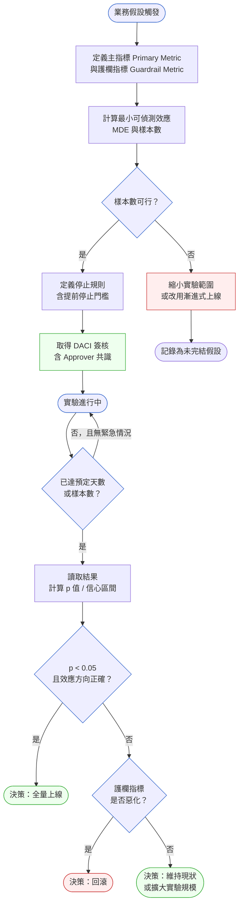
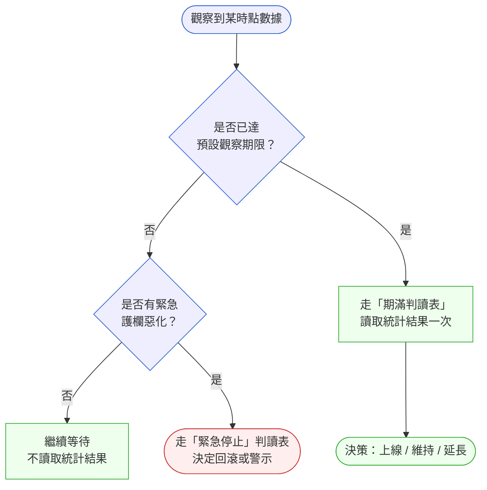

# 第 35 章 | Experimentation & A/B Testing：決策有多可信？

> **前置閱讀**：[Ch 34　North Star Metric：選對唯一重要的指標](./ch-34-north-star.md)
> **下游章節**：[Ch 36　Product Analytics：看懂數字、不被數字騙](./ch-36-product-analytics.md)
> **延伸閱讀**：[Ch 26　PM × Data：指標的定義與所有權](../part-04-collaboration/ch-26-pm-data.md)
> **SA/SD 對照**：[SA/SD 第 30 章　SRE、SLO、Chaos Engineering](../../book/part-05-quality/ch-30-sre-slo-chaos.md)
> ⸺ SA 視角關注系統可靠性的可量測性；本章關注業務假設的可驗證性，以及數據何時足以支撐決策。

---

## §35.1 冷觀察

那是第五天，林玟在開會前盯著同一張儀表板，心裡算的是另一筆帳。

她是 ShopFlow（虛構中型電商）的 PM。兩週前，她替這個結帳頁改版實驗（A/B Test，對照實驗）寫過樣本數計算：每天結帳人次只有 3,200，兩組要各收到 22,400 筆，才能在 95% 信心水準（Confidence Level）下分辨「新設計比舊版好」這件事是真的、還是噪音。換算下來，需要整整 14 天。今天是第五天。儀表板上 A 組轉換率（Conversion Rate）4.2%、B 組 3.8%，差距 0.4 個百分點——林玟知道這個數字現在還什麼都不能證明，因為它落在隨機波動的範圍裡。她預期的劇本是：再等九天，數據累積到足夠分辨真偽，然後給出一個能被工程信任的結論。

劇本在開會前五分鐘被改寫了。CEO 把一則 Slack 訊息丟進 PM 群組：

> 「A 贏了，全量上吧，別浪費時間。」

林玟盯著那則訊息看了幾秒。她知道 0.4% 不顯著，她知道再等九天才有答案，她也知道——自己手上沒有任何一份文件，可以把「再等九天」這件事，從「PM 的個人謹慎」變成「團隊事先約定好的規則」。CEO 有組織權威，有善意的業務直覺，唯獨沒有實驗設計知識；而她有實驗設計知識，卻沒有一張白紙黑字、雙方都簽過字的「停止規則」可以拿出來擋。

她沒有拒絕。

四個小時後，B 組流量切到零，A 版全量上線。Engineering（工程團隊）在那天下午更新了 feature flag（功能旗標）。

第三天，轉換率回到了兩組共有的基準值（Baseline）：4.0%。第一週結束，Weekly Active Buyer（週活躍買家）沒有任何移動。到了第九天，Customer Success（客戶成功團隊）回報有零星用戶抱怨結帳頁「感覺怪怪的」，但說不清楚哪裡不對。

林玟拉出實驗期間的每日轉換率時序圖。第五天那個數據點，像一顆孤立的山峰——那個週末正好遇上一批折扣通知推送（Push Notification）。推送的受眾分組和實驗的分組有部分重疊，A 組分到的推送比例偏高。換句話說，第五天那 0.4% 不是設計效果，是外部干擾噪音的一個尖峰。

「我們讓一個不顯著的信號，終止了一個正在運行的實驗。」

她把這句話寫進了後驗報告。沒有人在下一季的規劃會議上提到它。Roadmap（產品路線圖）繼續推進，那個結帳頁的設計問題，其實到現在都還沒有真正被回答——只是被一個假答案蓋住了。

---

## §35.2 真問題

把它拆開來看。表面上，這是一場「實驗被高層提前叫停」的事故；但只盯著 CEO 那則 Slack 訊息，會錯過真正的斷裂點。

### 表面需求（What）：實驗在問什麼

ShopFlow 想知道「新結帳頁設計是否比舊版好」。實驗是工具，轉換率是指標，這個提問看起來合理。但「好」這個字從來沒有被定義成可操作的標準：好多少才值得上線？提升 0.1% 算好嗎？還是要 0.5%？在實驗開始前沒有人回答這個問題，於是當第五天出現 0.4% 的差異時，「這算不算贏」就變成了一場各說各話的即興判斷——而即興判斷裡，組織權威最大的人說了算。

這個問題有標準答案：實驗設計的第一步，就是事先聲明一個 **MDE（最小可偵測效應，Minimum Detectable Effect）**——低於這個門檻的提升，即使統計上顯著，也不值得為它承擔發布風險。沒有 MDE 的實驗，門檻就會在壓力下變成當下權威最大的人說出口的那個數字。MDE 必須在實驗開始前設定，而不是在某個漂亮的數據點出現後才反推出來：一旦你已經看到結果，任何事後設定的門檻都是對數據的迎合，而不是對假設的驗證。§35.3 的決策框架會說明如何計算 MDE 和對應的樣本數；在這裡，它的角色是讓「好多少才值得」從一個模糊的業務直覺，變成一個在沒有壓力的那一天就已經寫死的數字。

### 業務目標（Why）：Output、Outcome、Impact 三層的混淆

真正的業務目標是提升結帳完成率，最終帶動 GMV（Gross Merchandise Value，商品交易總額）。這裡藏著一個 PM 最常踩的認知斷層——把交付的三個層次混為一談：

- **Output（產出）**：新結帳頁設計被實作、被部署、被上線。這是「我們做了什麼」。
- **Outcome（成效）**：用戶的結帳行為真的改變了嗎？放棄結帳的人變少了嗎？這是「用戶因此有什麼不同」。
- **Impact（影響）**：GMV、留存率（Retention）、回購率有沒有因此移動？這是「對生意的最終意義」。

第五天的全量決策，發生在 Output 剛完成、Outcome 還沒被驗證、Impact 連觀察的機會都還沒有的時候。林玟的問題不是做了錯誤的設計，而是讓一個 Output（功能上線）被誤認為 Outcome（行為改變被驗證）。實驗存在的全部意義，就是把「我們做了」翻譯成「我們確認了它有效」——而提前停止，恰好抽掉了這層翻譯。

這也是本章為什麼緊接在 [Ch 34 North Star](./ch-34-north-star.md) 之後：實驗的主指標若沒有對齊 North Star，就會發生「實驗贏了、North Star 沒動」的弔詭；而實驗結束後的長期觀察，則銜接到 [Ch 36 Product Analytics](./ch-36-product-analytics.md)——實驗只看一個短窗口，Impact 要靠長期指標監控才看得見。

### 決策瓶頸（Who × When）：缺了一個節點的決策鏈

ShopFlow 真正的問題，可以收斂成一句話：**誰有權在什麼時候，用什麼理由終止實驗？**

沒有人在實驗開始前定義這個邊界。當 CEO 看到第五天數據時，他有足夠的組織權威，也有善意的業務判斷，但沒有實驗設計知識來辨認那 0.4% 是不是噪音。林玟有實驗設計知識，但沒有一份雙方都認可的「停止規則」文件，能把她的專業判斷變成一條團隊規則。於是決策鏈裡缺了一個節點——明確的 Approver（核准者）與提前約定好的終止門檻。CEO 的 Slack 訊息，落在了沒有任何防護的空白地帶。

用 DACI（Driver / Approver / Contributor / Informed，決策分工框架）來看，這個決策本來應該長這樣：

| 角色 | 人 | 說明 |
|---|---|---|
| Driver（推動者） | PM（林玟） | 負責推動實驗設計與執行 |
| Approver（核准者） | PM + 資料科學負責人共同 | 必須兩人都同意才能提前終止 |
| Contributor（貢獻者） | Engineering、Data、Design | 提供實作、數據、視覺意見 |
| Informed（被通知者） | CEO、CMO | 結果出爐後通知，不在過程中介入 |

關鍵在於：CEO 應該坐在 **Informed** 的位置，而不是事實上的 Approver。但這個結構在實驗啟動前根本不存在，所以當壓力來時，角色自動坍縮——Informed 漂移成 Approver，Driver 退位成壓力傳遞者。這正是同公司另一起事故（[Ch 17　Release Planning：上線不等於交付](../part-03-planning/ch-17-release-planning.md)，CASE-ECM-107）裡反覆出現的同一個病根：DACI 倒置。

統計顯著性（Statistical Significance，統計上的可信度）這個術語，在 ShopFlow 這個層級的對話裡從來沒有出現過。不是因為沒人懂，而是因為沒有任何工件（Artifact，可交付的文件產物）把它翻譯成一句 CEO 能聽懂的決策語言。本章其餘部分，要做的就是補上這個翻譯層。

---

## §35.3 決策框架

這一節不告訴你「該不該停止某個實驗」——那永遠取決於你的流量、你的風險、你的業務階段。它要給你的是一套判斷的順序：先問什麼、後問什麼，以及在每個分岔點上，哪個訊號才是該看的訊號。

### 圖 A — 實驗設計工作流程



這張圖把實驗從「業務假設」一路推到「決策」，但真正容易在時間壓力下被跳過的，是三個節點：

**定義護欄指標（Guardrail Metric，護欄指標）**。主指標是轉換率，護欄指標可能是退款率、頁面載入時間、或客服接觸率。一個實驗完全可能同時讓主指標上升、讓護欄指標惡化——例如新結帳頁讓更多人按下確認，卻也讓更多人事後因為「按錯了」而退款。只看主指標，會做出一個帳面贏、實際輸的全量決策。護欄指標的作用，是在你慶祝主指標勝出之前，先問一句「我們有沒有在別的地方流血」。

**取得 DACI 簽核**。這個步驟很多團隊在時間壓力下跳過，覺得「先跑起來再說，誰停得了再討論」。跳過的代價，就是第五天那則 Slack 訊息——當沒有人事先約定 Approver 是誰，組織裡權威最大的人就會自動成為 Approver，無論他有沒有實驗設計知識。

**已達預定天數才讀取**。注意箭頭上的條件是「已達預定天數或樣本數」，不是「達到某個好看的數字」。這條線是整張圖最反直覺的地方：在實驗跑完之前，「偷看」結果本身就會破壞結論的可信度（詳見 §35.4 的 Peeking Problem）。

### 圖 B — 實驗終止決策樹（兩條主幹）

很多團隊的終止決策一團亂，是因為把兩個本質不同的問題混在一起問了：「我現在能不能停？」其實要先拆成「**現在是不是緊急狀況**」和「**觀察期到了沒**」兩條互不相干的主幹。下面這張圖刻意只保留兩條主幹，細節判斷另用表格展開（見下方判讀表），避免一張圖塞進七層深度、誰都跟不下去。



這張簡化圖的核心訊息只有一個：**在期限到達之前，唯一能讓你停止的理由是「緊急護欄惡化」，而不是「主指標看起來很好或很差」。** ShopFlow 的錯誤，就是走了一條圖上根本不存在的捷徑——期限沒到（Q1 否）、護欄沒惡化（B1 否），本該走到「繼續等待」，卻因為主指標「看起來贏了」而跳去全量上線。

兩條主幹各自要問的細節，整理成下面這張**實驗終止判讀表**，每欄都附上欄位含意，降低看圖時的認知負荷：

| 主幹 | 判讀問題 | 欄位含意 | 結論 |
|---|---|---|---|
| 緊急停止（期限未到） | 護欄惡化幅度是否超過門檻（如 −10%）？ | 「門檻」= 設計階段就寫死的可容忍劣化上限 | 超過 → 立即回滾至對照組；未超過 → 發警示、記錄、但不停止 |
| 緊急停止（期限未到） | 是否出現嚴重 UX 缺陷（流程中斷、付款失敗）？ | 與統計無關的「功能性事故」 | 是 → 立即停止，不需等統計 |
| 期滿判讀 | p 值 < 0.05 且效應方向正確？ | p 值回答「這差異是不是隨機的」 | 否 → 看 Power 是否足夠決定延長或關閉 |
| 期滿判讀 | 效應大小是否超過預設 MDE？ | MDE = 值得行動的最小效應 | 否但有業務意義 → 分區段擴大實驗；否且無意義 → 維持現狀 |
| 期滿判讀 | 統計功效（Power）是否仍足夠繼續？ | Power = 真有效果時能偵測出來的機率 | 足夠 → 延長觀察並更新樣本估算；不足 → 記錄假設未獲驗證 |

把決策樹拆成「兩條主幹 + 一張判讀表」之後，看圖的人不必在腦中同時追蹤七個分支；他只需要先回答一個是非題（期限到了沒），再翻對應那半張表。

### 決策表 — 實驗設計選型

不同情境下，「該怎麼設計實驗」的答案不同。這張表教你在啟動前先對號入座：

| 情境 / 觸發條件 | 推薦做法 | PM 關注點 | 常見錯誤 |
|---|---|---|---|
| 每日流量 < 1,000 | 不跑標準 A/B；改用 Bayesian A/B（貝氏 A/B）或多週期累積觀察 | 樣本數不足的偽陽性風險 | 跑 5 天就宣稱顯著 |
| 外部事件（促銷、節日）在實驗期間出現 | 暫停實驗，重新計算排除污染期後的樣本數 | 事件是否影響兩組不均勻 | 把節日轉換率高峰算進實驗效果 |
| CEO / 高層要求提前看結果 | 提供護欄指標現況（是否惡化）；明確說明統計信心水準仍不足 | 政治壓力 vs 數據完整性的邊界 | 用「趨勢看起來不錯」代替統計聲明 |
| 多個變體同時測試（A/B/C/D） | 多重比較校正（Bonferroni 或 FDR）；或序列測試 | p 值膨脹風險 | 跑 4 組卻用單一 p < 0.05 門檻 |
| 主指標和護欄指標方向衝突 | 停止並召開決策會議；不單方面決定 | 哪個指標優先的業務邏輯 | 只回報主指標，忽略護欄惡化 |
| 實驗結果沒有顯著差異 | 記錄假設為「未被驗證」，不等於「已被否定」 | 統計功效（Power）是否足夠 | 把「不顯著」說成「沒有效果」 |

特別要說明第三列——「高層要求提前看結果」。這不是要 PM 跟 CEO 對抗，而是要 PM 換一種語言回應。錯誤的回應是「再等等，現在還不準」（聽起來像拖延）；正確的回應是「目前護欄指標全部正常，沒有需要緊急停止的理由；主指標的差異還在隨機波動範圍內，預計 X 月 X 日達到可判讀的信心水準，屆時我第一時間發結論給你」。後者把「不能停」翻譯成了 CEO 聽得懂、也接受得了的決策語言。

### If-Then 框架：實驗設計四問

在實驗啟動前，用以下四個條件建立約束，把未來可能發生的爭執提前在沒有壓力時談清楚：

- **If** 主指標在觀察期未到時看起來很好 → **Then** 不讀取統計結果；如有護欄指標監控則只看護欄
- **If** 護欄指標惡化幅度超過預設門檻（如 −10%） → **Then** 立即停止並回滾，無論主指標表現如何
- **If** 預定期限到達後 p 值仍不顯著且統計功效（Power）仍足夠 → **Then** 延長觀察期
- **If** 預定期限到達後 p 值仍不顯著且流量不足 → **Then** 記錄假設未獲驗證並關閉實驗
- **If** 實驗結果顯著但效應大小小於 MDE → **Then** 召開決策會議；業務判斷效應足夠則全量，否則維持現狀並更新假設

這四個問題的答案要在實驗開始前就填寫，並附在實驗設計文件上。一個經驗法則：**如果你填不出這四題的答案，代表假設還不夠清晰，這個實驗根本還不該啟動。** 填不出答案的實驗，遲早會在第五天遇上一則 Slack 訊息。

---

## §35.4 踩坑清單

**反模式：Peeking Problem（盲目窺視）**

現象：每天打開儀表板看 p 值，看到 p < 0.05 就宣告勝出並停止實驗，通常發生在第 3–7 天。

根因：多次測試會膨脹偽陽性率（False Positive Rate）。直覺上我們以為「每天看一眼又不會改變數據」，但統計上，每多看一次、每多一次「達標就停」的機會，整體誤判的機率就往上疊一層。如果你每天都測一次，那麼即使兩組之間沒有任何真實差異，20 天裡平均也會有 1 天隨機出現 p < 0.05。這正是 ShopFlow 第五天發生的事——他們不是運氣不好撞到那一天，而是「每天都在看、看到就停」這個行為本身，註定會撞到某一天。

> 修正方向：在實驗設計時明確只在「期限到期」時讀取一次；若確實需要中期監控，使用 Sequential Testing（序列測試）設計，它在數學上允許提前停止，但已經把偽陽性率校正回來了——而不是靠肉眼看儀表板偷停。

---

**反模式：No-Guardrail Launch（只看勝出、不看副作用）**

現象：主指標轉換率上升 0.4%，宣告勝出並全量上線；兩週後客服量增加 15%，才發現新設計讓部分用戶操作困惑，按了確認卻不知道自己買了什麼。

根因：實驗設計時只設定了主指標，沒有同時監控客服接觸率、退款率、頁面停留時間等護欄指標。主指標的上升是真的，但它是用「製造了困惑」換來的——這種「贏了轉換、輸了體驗」的交易，在只看一個數字時完全隱形。

> 修正方向：每個實驗在設計時必須同時列出至少兩個護欄指標；全量決策的條件是主指標勝出 **AND** 護欄指標無惡化，兩個條件要同時成立，缺一不可。把「AND」寫進決策卡，而不是讓它停留在某個人的腦袋裡。

---

**反模式：Business-as-Usual Pollution（實驗期間有其他介入）**

現象：A/B 實驗進行中，Marketing（行銷團隊）同期推了一批 coupon（折價券）；Push Notification 的受眾分組與實驗組有重疊；結果兩組受到的外部刺激根本不均等。ShopFlow 第五天那顆「山峰」，正是這麼來的——A 組剛好分到比較多推送。

根因：實驗設計與其他業務活動之間缺乏協調機制。各部門各自按自己的節奏行動，沒有人知道「現在有一個實驗正在跑、請不要在這群用戶身上做別的動作」這件事，因為根本沒有「實驗凍結期（Experiment Freeze Window）」這個概念。

> 修正方向：建立實驗日曆（Experiment Calendar），所有在實驗期間會影響目標用戶的行銷活動，都需要在啟動前通知實驗負責人；若重疊無法避免，則需要重新計算受污染樣本的排除策略，把被污染的那段時間或那群用戶從分析中剔除。

---

**反模式：HARKing（Hypothesizing After Results are Known，結果出來後才補假設）**

現象：實驗整體結果不顯著，但有人發現某個子族群（如 iOS 用戶）在 A 組有正向趨勢，於是把這個發現重新包裝成「我們的實驗發現 iOS 用戶更偏好新設計」，當成成果上報。

根因：子族群分析（Subgroup Analysis）是探索性的，不是驗證性的。你切的子族群越多，純靠運氣在某一個子族群裡看到「好像有效」的機率就越高。用事後撈到的子族群當結論，等同於從數據裡釣魚——撒網夠多次，總會撈到一條看起來像答案的魚。

> 修正方向：子族群分析的結果只能作為「下一個實驗的假設」，不能作為「當前實驗的結論」。在分析報告中明確把每一條發現標記為「探索性發現（Exploratory）」或「驗證性結果（Confirmatory）」，讓讀報告的人一眼分得出哪些已經被驗證、哪些只是有待驗證的線索。

---

**反模式：Statistical Significance ≠ Business Significance（把 p 值當業務決策）**

現象：p = 0.04，達到統計顯著，但轉換率實際只提升 0.06%。PM 宣告實驗成功，要求工程投入 3 週做全量上線；結果上線後的業務影響幾乎看不見，等於用 3 週工程資源換了一個量不出來的收益。

根因：統計顯著性只回答一個問題——「這個差異是隨機造成的嗎？」它**不**回答「這個差異值得我們行動嗎？」。而且有個陷阱：當流量足夠大時，任何微小到沒有business意義的差異都可能達到統計顯著。p 值小，不代表效應大。

> 修正方向：在實驗設計階段就定義「最小業務意義效應（Minimum Business-Meaningful Effect）」，例如「轉換率至少提升 0.5% 才值得承擔上線後的維護成本」。結果解讀時必須同時看效應大小（Effect Size）和統計顯著性——前者問「值不值得做」，後者問「是不是真的」，兩者都過關才行動。

---

## §35.5 交付清單 ⸺ 一頁式實驗設計卡模板

本章的核心交付物有三份，串起實驗從設計到收尾的全程：

- [ ] **實驗設計卡（Experiment Design Card）**：單頁文件，涵蓋假設、主指標、護欄指標、樣本數計算、停止規則、DACI——本章主交付物
- [ ] **停止規則備忘錄（Stop Rules Memo）**：供 CEO / 高層在實驗期間查閱，說明何種條件可提前停止、何種不行
- [ ] **結果解讀報告（Experiment Readout）**：期限到期後的標準化報告，含 p 值、信心區間、效應大小、護欄指標狀態、決策結論

下面是實驗設計卡的**空白模板**。它存在的理由很簡單：第五天那則 Slack 訊息之所以能改寫整個結局，是因為當時沒有任何一份文件，能把「成功的定義」「誰能喊停」「何時讀取」這三件事，在同一張紙上固定下來。這張卡的價值不在填寫本身，而在填寫的過程會強迫 PM、資料科學、Engineering、以及最終的 Approver，在實驗啟動的第一天就對「什麼叫做成功」達成共識——而不是把這場爭執留到第五天、留到壓力最大、最沒空講道理的那一刻。

````markdown
=====================================================
實驗設計卡 — Experiment Design Card
{公司} | {實驗名稱}
=====================================================
> 版本:v0.1 | 撰寫日期:YYYY-MM-DD | 擁有人:{名字}

【一、假設陳述（Hypothesis）】
假設：如果 {做出某項改變 X}，
     則 {某主指標 Y} 將 {上升 / 下降 / 改變}，
     因為 {使用者行為層面的因果機制 Z}。
（用「如果 X，則 Y，因為 Z」格式；填不出 Z 代表假設還不清晰。）

【二、主指標（Primary Metric）】
指標：{單一指標名稱與精確定義，禁止「提升體驗」等模糊敘述}
基準值：{過去 N 天的平均值}
MDE（最小可偵測效應）：{值得行動的最小效應大小}

【三、護欄指標（Guardrail Metrics，至少兩個）】
- {護欄 1}（門檻：{可容忍的劣化上限}）
- {護欄 2}（門檻：{可容忍的劣化上限}）
- {護欄 3（選填）}（門檻：{…}）

【四、樣本數與時長（Sample Size & Duration）】
每日合格流量：{N}
分組比例：A {x}% / B {y}%
達到 {95}% 信心水準所需：每組 {M} 筆
預計實驗天數：{D} 天（{起日} 至 {訖日}）

【五、停止規則（Stop Rules）】
✅ 可提前停止（緊急停止）條件：
   - {護欄指標惡化超過門檻，且持續 N 個連續日曆天}
   - {發現嚴重 UX 缺陷（如流程中斷）}
❌ 不可提前終止的情況：
   - 主指標在觀察期限前「看起來很好」
   - 主指標在觀察期限前「看起來不如預期」
   - 任何高層要求（須走 Approver 流程，不得單方拍板）

【六、DACI】
Driver:      {PM 姓名}
Approver:    {姓名 + 職稱，須為具名個人，禁止填「Leadership」}
Contributor: {Engineering / Design / Data 等}
Informed:    {CEO / CMO 等，於期限到期後收到結果摘要}

【七、預計讀取時間（Readout Time）】
{YYYY-MM-DD HH:MM（時區）}，由 Driver 發出 Readout 給 Informed 名單
=====================================================
````

把它存在 `docs/experiments/`，跟程式碼同 repo，跟 README 同層。

填這張卡時最容易卡關的是【五、停止規則】——如果一個團隊填不出「什麼條件下可以提前停、什麼條件下不行」，那代表他們從沒在沒有壓力的時候談過這件事，於是只能在壓力最大的第五天臨場決定。這張卡的設計意圖，就是把那場本該在第一天發生的對話，逼到第一天。

### §35.5.1 範例：ShopFlow 結帳頁改版實驗設計卡

ShopFlow 在第五天被 CEO 叫停的根本原因，是實驗開始時沒有一張讓所有人都看得懂的設計卡。以下是林玟在事後覆盤中重新補寫的版本——如果這張卡在第一天就存在，那則 Slack 訊息的結局可能不同。

````markdown
=====================================================
實驗設計卡 — Experiment Design Card
ShopFlow | 結帳頁折扣資訊位置 A/B 測試
=====================================================
> 版本:v0.1 | 撰寫日期:2026-02-15 | 擁有人:林玟（PM）

【一、假設陳述】
<!-- 為什麼這欄：逼作者用「如果 X，則 Y，因為 Z」格式寫假設；
     沒有明確假設，實驗結果無論如何都可以被事後解釋成支持任何結論。 -->
假設：如果將折扣資訊移至確認按鈕旁，
     則結帳完成率（Checkout Completion Rate）將提升，
     因為用戶在最終確認前可直接看到儲蓄金額，減少放棄結帳的猶豫。

【二、主指標（Primary Metric）】
指標：結帳完成率（已進入結帳頁 → 訂單成立）
基準值：4.0%（過去 30 天平均）
預期提升：≥ 0.5 percentage point（MDE）
<!-- 為什麼這欄：MDE（最小可偵測效應）決定了樣本數需求；
     不寫 MDE 就無法計算需要多少天，導致實驗時長「憑感覺」。 -->

【三、護欄指標（Guardrail Metrics）】
- 退款率（≤ 基準值 + 10%，即 ≤ 2.2%）
- 客服接觸率（≤ 基準值 + 15%）
- 頁面 LCP（≤ 2.5 秒，不惡化）
<!-- 為什麼這欄：護欄指標惡化代表「我們贏了轉換率，但傷了用戶」；
     全量決策需要主指標勝出 AND 護欄無惡化，缺一不可。 -->

【四、樣本數與時長】
每日結帳人次：~3,200 人
分組：A（新設計）50% / B（現況）50%
每組每日：~1,600 人
達到 95% 信心水準所需：每組 22,400 人
預計實驗天數：14 天（2026-05-12 至 2026-05-26）

【五、停止規則（Stop Rules）】
<!-- 為什麼這欄：這欄是本卡最重要的欄位；
     沒有停止規則，任何有組織權威的人都可以在任何時間點以任何理由終止實驗。 -->
✅ 可提前停止（緊急停止）條件：
   - 任何護欄指標惡化超過門檻，且持續 2 個連續日曆天
   - 發現嚴重 UX 缺陷（如結帳流程中斷）

❌ 不可提前終止的情況：
   - 主指標在觀察期限前「看起來很好」
   - 主指標在觀察期限前「看起來不如預期」
   - 任何高層要求（需走 Approver 流程）

【六、DACI】
Driver:   林玟（PM）
Approver: 林玟（PM）+ 數據科學團隊（共同決定，任一方否決均需討論）
Contributor: Engineering、Design、Data
Informed:  CEO、CMO（期限到期後收到結果摘要）

【七、預計讀取時間】
2026-05-26 上午 10:00（Asia/Taipei）
由 Driver 發出 Readout 給 Informed 名單

=====================================================
````

這張卡的價值不在於填寫它，而在於填寫時必須強迫所有關係人在「什麼叫做成功」這個問題上取得共識——在第一天，而不是第五天。

---

## §35.6 Recap

讀完本章，面對下一個 A/B 實驗，應該已經能做到：

- [ ] 在啟動前定義主指標、護欄指標、MDE，以及預計觀察天數
- [ ] 用四問 If-Then 框架建立停止規則，並讓所有 Approver 在啟動前確認
- [ ] 區分統計顯著性（p 值）與業務顯著性（效應大小）——兩個都要達標才決策
- [ ] 識別 Peeking Problem，並知道在觀察期結束前不讀取統計結論
- [ ] 把子族群的「有趣發現」標記為探索性假設，進入下一輪驗證，而不是當前實驗的結論

從這五件事中先挑一件做，建議是**寫停止規則**。停止規則解決的不是統計問題，而是組織問題——它把「誰可以在什麼時候用什麼理由停止實驗」從一個靠信任維持的默契，變成一份白紙黑字的共識。一旦它存在，第五天那則 Slack 訊息就不再是一道無解的難題，而只是一個你早就準備好答案、可以有禮貌且有數據支撐地回覆的問題。下一個實驗，先把這張卡填到能簽字為止——你不會再讓一個不顯著的信號，終止一個正在運行的實驗。

---

## Cross-References

- **上一章**：[Ch 34　North Star Metric：選對唯一重要的指標](./ch-34-north-star.md) ⸺ 本章的實驗主指標必須與 North Star Metric 對齊，否則會出現「實驗贏了、North Star 沒動」的弔詭
- **下一章**：[Ch 36　Product Analytics：看懂數字、不被數字騙](./ch-36-product-analytics.md) ⸺ 實驗只看一個短窗口的 Outcome，Impact（GMV、留存）要靠 Analytics 的長期指標監控才看得見；本章的「實驗→指標→分析」三段在此銜接
- **強連結**：[Ch 26　PM × Data：指標的定義與所有權](../part-04-collaboration/ch-26-pm-data.md) ⸺ 主指標與護欄指標的定義、口徑與所有權，需要 PM × Data 的協作來鎖定
- **強連結**：[Ch 28　Executive Communication：向上匯報與 QBR](../part-04-collaboration/ch-28-executive-communication.md) ⸺ 如何把「實驗還不能停」翻譯成 CEO 聽得懂、也接受得了的決策語言
- **同公司案例**：[Ch 17　Release Planning：上線不等於交付](../part-03-planning/ch-17-release-planning.md) ⸺ 同為 ShopFlow，同一個 DACI 倒置病根（Informed 漂移成 Approver），一個發生在實驗終止、一個發生在上線決策
- **SA/SD 對照**：[SA/SD 第 30 章　SRE、SLO、Chaos Engineering](../../book/part-05-quality/ch-30-sre-slo-chaos.md) ⸺ SA 用 SLO 和錯誤預算框架量化系統可靠性；PM 用顯著性門檻和護欄指標框架量化業務假設的可信度，兩者都是「在不確定環境中做出可信決策」的工程

<!-- PROPOSED-REFS
glossary:
  - anchor: statistical-significance
    name: 統計顯著性（Statistical Significance）
    body: |
      在假設檢定中，若 p 值低於預設顯著水準（通常為 0.05），
      稱差異達到統計顯著性。注意：統計顯著性不等於業務顯著性。
  - anchor: minimum-detectable-effect
    name: 最小可偵測效應（MDE，Minimum Detectable Effect）
    body: |
      實驗設計時預設的最小業務意義效應大小，用於計算所需樣本數。
      MDE 越小，需要的樣本量越大、觀察期越長。
  - anchor: guardrail-metric
    name: 護欄指標（Guardrail Metric）
    body: |
      A/B 實驗中除主指標外同步監控的指標，用於確保主指標改善
      不以犧牲其他業務健康指標為代價。護欄指標惡化可觸發緊急停止。
  - anchor: peeking-problem
    name: Peeking Problem（盲目窺視問題）
    body: |
      在 A/B 實驗進行中頻繁查看 p 值，並在看到顯著結果時提前停止，
      導致偽陽性率大幅膨脹的統計偏誤。
  - anchor: statistical-power
    name: 統計功效（Statistical Power）
    body: |
      當真實效應存在時，實驗能正確偵測出該效應（拒絕虛無假設）的機率，
      通常設計目標為 0.8。功效不足時「不顯著」不代表「沒有效果」。
cases:
  - id: CASE-ECM-113
    title: "ShopFlow 的提前判決：CEO 看到 A/B 早期數據就要求停止實驗"
    domain: ecommerce
    chapters: [pm-ch-35]
    related_cases: [CASE-ECM-107]
    summary: |
      虛構電商 ShopFlow：A/B 測試設計需要兩週達到統計顯著性，
      第五天 CEO 看到 A 組轉換率較高，要求立即全量上線。
      上線後效果消失，因為第五天的差異只是隨機波動（加上推送通知的受眾污染）。
-->
