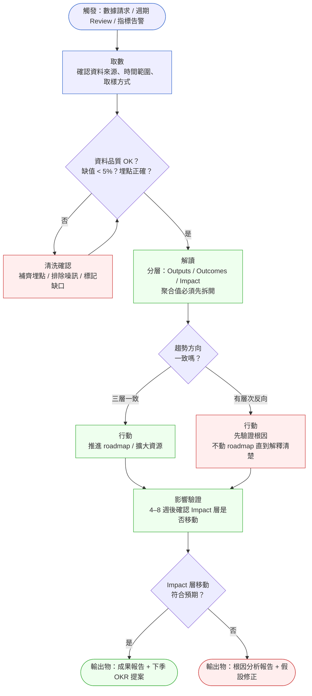
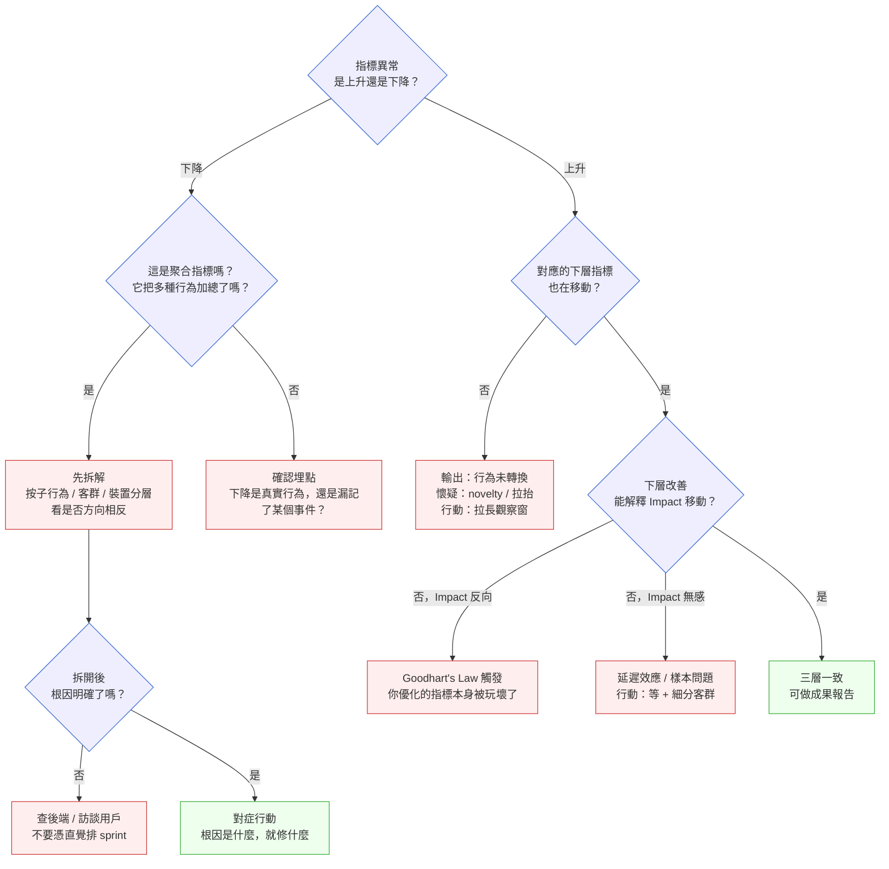

# 第 36 章 | Product Analytics：看懂數字、不被數字騙

> **前置閱讀**：[Ch 34 North Star Metric：選對唯一重要的指標](./ch-34-north-star.md)
> **前置閱讀**：[Ch 35 Experimentation & A/B Testing：決策有多可信？](./ch-35-experimentation.md)
> **下游章節**：[Ch 37 Retention & Churn：留存的真正驅動力](./ch-37-retention-churn.md)
> **下游章節**：[Ch 38 Post-Launch Review：上線後的 PM 責任](./ch-38-post-launch-review.md)
> **SA/SD 對照**：[SA/SD Ch 29 可觀測性](../../book/part-05-quality/ch-29-observability-otel.md)
> ⸺ SA 視角關注系統層面的 trace、metric、log 埋點設計；本章關注業務指標的解讀責任，以及 PM 如何不被一個看起來合理的數字帶往錯誤的決策方向。

---

## §36.1 冷觀察

週三早上的產品 Review，Formly 的會議室投了一張漏斗圖（Funnel Chart）。

Formly 是一個 B2B 表單建構平台，核心轉換路徑只有一條：使用者進到表單編輯器、設定欄位、按「送出發佈」。這條路徑的轉換率（Conversion Rate）一直是團隊的命脈指標，掛在儀表板正中央。過去一年它都穩定在 72% 上下。

但這一週的圖，最後一格塌了下去。「填表 → 送出」的轉換率從 72% 掉到了 54%。十八個百分點，三週之內。

負責這條路徑的 PM 林思妤把游標停在那一格上，沒有立刻說話。會議室裡有人先開口：「送出按鈕的位置上個月改過，會不會是新版面讓人找不到？」另一個聲音附和：「對，新的編輯器留白太多，按鈕被推到摺疊線下面了。」

這個解釋聽起來很順。版面剛改過、轉換率剛掉、按鈕變得不明顯——因果關係像是自己連好了。林思妤點頭，當場把「重新設計送出流程」排進了下一個 sprint，標題寫著「修復轉換率下降」。

> 「等一下。」資深工程師周明翰在白板邊上問了一句，「那 18% 掉的人，是『沒按送出』，還是『按了送出但沒成功』？」

沉默。

漏斗圖只畫到「送出事件觸發次數」這一格。它告訴你有多少人到了這一步、多少人通過，但它沒有區分「使用者選擇不送出」和「使用者按了卻被系統擋下來」。這兩件事在圖上長得一模一樣——都是一個沒有往下走的使用者。

周明翰調出後端日誌（Backend Log）。過去三週，表單送出的 API 回傳了大量 422 驗證錯誤（Validation Error），集中在一個三週前上線的新欄位型別。那個型別在某些瀏覽器下會讓「送出」請求被伺服器擋下，使用者點了按鈕，畫面卡住，然後離開。

那 18% 不是「找不到按鈕」。是「按了，送不出去」。

林思妤排進 sprint 的那行字——「重新設計送出流程」——會花掉三個 sprint，動到整個編輯器的版面，而真正的 bug 是後端一段二十行的驗證邏輯。漏斗圖上那一格的數字完全正確，但它指向的方向，差了十萬八千里。

---

## §36.2 真問題

把 Formly 的這一幕拆開來看，林思妤的問題不是「不會看漏斗」，也不是「Mixpanel（Amplitude 的競品分析工具）用得不熟」。漏斗圖她看得很準，數字也沒算錯。真正的問題藏在數字和決策之間那一段——她把一個「現象」直接當成了「原因」，中間少了一步。

### 表面需求（What）

會議上要回答的問題很簡單：轉換率為什麼掉？掉了就要修。修就要排 sprint。於是「轉換率下降」這個現象，在十分鐘內變成了「重設計送出流程」這個行動。

這是大多數 PM 在指標亮紅燈時走的捷徑——看到一條線往下，腦中立刻浮現一個聽起來合理的解釋，然後把那個解釋當成已經查證過的事實。版面剛改過，所以是版面的問題；這個推論的問題不在於它不可能對，而在於它從來沒有被驗證過就被當成結論。捷徑省下的是查證的時間，付出的代價是三個 sprint 修錯了東西。

### 業務目標（Why）

Formly 的收入模型，是按「成功發佈的表單數量」階梯計費的訂閱制。一個使用者建好表單卻送不出去，對業務的傷害不只是少一次轉換——那是一個原本願意付費、卻被系統擋在門外的客戶。

所以真正要保護的業務目標，不是「漏斗圖好看」，而是「想發佈表單的人都能順利發佈」。這兩件事在大多數時候是同一件事，但在這三週裡它們分了岔：漏斗圖告訴你「轉換率掉了」，業務真相卻是「一批付費意願最強的使用者——那些已經把表單建好、走到最後一步的人——正在被一個 bug 拒之門外」。漏斗圖把這群最寶貴的使用者，和「逛了一圈不想用的人」畫成了同一格。

把問題放進三層框架，斷裂點就清楚了：

| 層次 | Formly 這次的樣子 | 斷裂點 |
|---|---|---|
| **Outputs（我們做了什麼）** | 上線了新欄位型別、改了編輯器版面 | 有交付，但沒人追是哪個交付造成了後果 |
| **Outcomes（使用者行為變了嗎）** | 「填表 → 送出」轉換率 72% → 54% | 量到了下降，但沒拆「不送」與「送不出」 |
| **Impact（業務指標動了嗎）** | 成功發佈表單數、付費轉換、續約 | 等到月底對帳才會發現，已經太晚 |

林思妤量的是 Outcomes 層的一個聚合數字（轉換率），而這個數字把兩種完全不同的使用者行為混在了一起。**一個聚合指標下降，可能來自完全相反的根因；不拆開，任何歸因都是猜的。** Outcomes 層的「轉換率」是一個結果，不是一個原因——它告訴你「出事了」，但它不告訴你「為什麼」。

### 決策瓶頸（Who × When）

「轉換率下降的原因是什麼」這個判斷，在 Formly 的會議上是誰拍板的？

表面上是林思妤。但真正讓「版面問題」這個假設變成 sprint 任務的，是會議室裡那種「聽起來合理就先做」的氛圍——沒有人被指定要在行動排程之前，先給出「我們已經驗證過根因」的證據。

用 DACI 視角看這個決策：

| 角色 | Formly 的實際狀況 |
|---|---|
| **Driver（推動決策）** | PM 林思妤，她決定排不排、排什麼 |
| **Approver（最終拍板）** | 林思妤自己——這正是危險點，根因假設沒有經過第二雙眼睛 |
| **Contributor（提供輸入）** | 工程師周明翰，但他是事後才被問到，不是流程裡的必經關卡 |
| **Informed（被通知）** | 設計團隊，準備接「重設計」的需求 |

瓶頸在於：**從「現象」到「行動」之間，沒有一道「根因必須被驗證」的關卡。** Driver 和 Approver 是同一個人，意味著林思妤的第一個假設，沒有任何機制逼她去證偽。如果不是周明翰剛好在場、剛好問了那一句，那個錯誤的 sprint 就會直接開工。

§36.2 的收束是：Formly 真正要建立的，不是更好的漏斗工具，而是**一道規則——在「轉換率下降」變成「重設計」之前，必須先回答「這條線量的到底是哪一層、它把什麼東西混在一起了」。** 我們原本想保護的是 Impact（付費發佈），量的卻是一個會騙人的 Outcomes 聚合值；補上中間「拆開驗證」這一步，才是這次的真問題。

---

## §36.3 決策框架

數字會騙人，不是因為它錯，而是因為它被讀得太快。下面這套框架的目的，不是給你一個「正確答案」，而是給你一條在數字面前慢下來的路徑——讓你在按下「排 sprint」之前，先確認自己看的是哪一層、它有沒有把不同的東西混在一起。

### 圖 A — Product Analytics PM 工作流程



這張流程圖的價值，不在於它列出了五個步驟，而在於它把「解讀」和「行動」中間插了一道強制的閘門。Formly 那天出事，就是因為團隊從「取數」（看到漏斗掉了）直接跳到了「行動」（排重設計），完全跳過了中間。下面三個約束，是這張圖裡最容易被省略、卻最不該省略的部分。

第一，**「解讀」步驟必須強制分層，而且聚合值要先拆開。** Outputs 不能代替 Outcomes，Outcomes 不能代替 Impact——這是大原則。但 Formly 的教訓更細一層：就算你正確地看著 Outcomes（轉換率），如果這個 Outcomes 是一個聚合值，它本身可能就把兩種相反的行為混在了一起。「沒按送出」和「按了送不出」在漏斗上是同一格。所以解讀的第一個動作不是問「這條線往哪走」，而是問「這條線是由哪些子行為加總出來的，把它們拆開會不會方向相反」。一個下降的轉換率，可能是 UI 問題，也可能是後端 bug，也可能只是某個客群的季節性流失——在拆開之前，三種可能性的權重是一樣的。

第二，**「清洗確認」是 PM 的責任閘門，不是丟給資料工程師的工序。** 進入解讀之前，PM 要親自確認三件事：資料來源是否一致（前端事件埋點和後端 API 日誌，對「送出成功」的定義一樣嗎）、觀察窗口有沒有被外部事件污染（這三週有沒有撞到節假日、行銷活動、競品上線）、埋點覆蓋率夠不夠（我們有沒有記錄「送出失敗」這個事件，還是只記錄了「送出成功」）。Formly 的根因之所以差點被漏掉，正是因為漏斗只埋了「送出成功」，沒埋「送出嘗試但失敗」——埋點的缺口，直接決定了你能不能看見真相。這三件事任何一件沒做，後面的解讀都是沙上建築。

第三，**「影響驗證」是一個獨立步驟，不是行動的附屬。** 行動落地之後，要給 Impact 層足夠的時間移動——通常是 4 到 8 週，視指標的延遲性而定。續約率不會在一週內反映一個修復的效果；如果只看修復後第一週的轉換率回升就宣告勝利，可能會把「Novelty 反彈」誤當成「問題解決」。這個步驟有兩種合法輸出：「Impact 如期移動，寫成果報告」或「Impact 沒動，寫根因分析報告」——後者一樣是有價值的產出，不是失敗。

### 圖 B — 數字解讀決策樹

當一個指標出現異常，下面這棵決策樹幫你判斷「現在站在哪個分支」，以及「對應的下一步是查證、是等待、還是行動」。它不會告訴你答案是什麼，但它會擋住你跳過查證直接行動的衝動。



這棵樹有兩條主幹，對應兩種最常見的誤判。

**下降分支（左側）是 Formly 踩到的那條。** 一個指標下降時，第一個問題不是「為什麼降」，而是「這是不是一個聚合指標」。轉換率是聚合的——它把「主動不送」和「想送送不出」加在一起。漏斗圖看不出差別。所以正確的下一步是「拆解」（B1）：按子行為拆（成功 vs 422 失敗）、按客群拆（哪些方案的使用者）、按裝置拆（哪些瀏覽器）。Formly 如果先做這一步，會立刻看到下降幾乎全集中在「送出嘗試但回 422」這個子行為上，根因瞬間從「UI」變成「驗證 bug」。拆完還是不明確，就去查後端、訪談用戶（B3），而不是憑「聽起來合理」排 sprint。這條分支的核心紀律只有一句：**下降的聚合指標，拆開之前不准歸因。**

**上升分支（右側）對應另一種陷阱：數字漂亮但意義空洞。** 假設 Formly 哪天「送出量」突然暴漲——下層的「成功發佈表單數」有沒有跟著漲？如果沒漲（Q4 否），可能是有人在刷送出按鈕，或新功能的 novelty effect 把使用頻率短暫拉高，這時要拉長觀察窗（B5），不能立刻歡呼。如果下層跟著漲了（Q4 是），再問 Q3：這個改善能解釋 Impact（續約、營收）的移動嗎？這裡有兩個關鍵分支需要分清楚：

- **「Impact 反向」(B6) 是真正的警報。** Outcomes 改善了，但業務往反方向走，代表你優化的那個 Outcomes 指標本身就是被玩壞的代理指標——這是 Goodhart's Law（古德哈特定律：當一個指標成為目標，它就不再是個好指標）的典型現場。舉一個非 Formly 的例子：某團隊把「客服首次回應時間」當 OKR，回應時間確實降了，但他們是靠自動發一句「我們已收到，稍後處理」做到的，客戶滿意度反而崩了——指標達標，Impact 反向。遇到這種狀況，正確動作是停下來重新定義指標，而不是加速優化它。
- **「Impact 無感」(B7) 是延遲效應，不是失敗。** 使用者行為改變需要時間才會反映到業務數字上。續約是按月發生的，你下個禮拜不會看到它動。這時正確動作是等，並且細分客群看有沒有被平均值掩蓋的差異，而不是急著重做功能。

把這兩種分支分清楚，是這棵樹最值錢的地方：**「該等」和「該重做」長得很像，但做錯一個就是浪費一個季度。**

### 決策表 — 數字解讀情境指引

下面這張表把現場最常見的六種觸發情境攤開，每一行對應一個「你大概率會走錯」的時刻。讀的時候對照自己手上的數字，找到最像的那一行。

| 情境 / 觸發條件 | 推薦做法 | PM 關注點 | 常見錯誤 |
|---|---|---|---|
| 聚合指標下降（如轉換率） | 先按子行為 / 裝置 / 客群拆開，看是否方向相反 | 下降是均勻的，還是集中在某個子群？ | 看到下降就憑「聽起來合理」的假設排 sprint |
| 漏斗某一格塌陷 | 確認該格埋的是「成功」還是「嘗試」，補埋失敗事件 | 流失的人是「不做」還是「做了被擋」 | 把「送不出去」當成「不想送」 |
| Outputs 向上、Outcomes 持平 | 做使用者行為路徑分析，找 drop-off 點 | 功能有沒有被用到正確的地方 | 以交付完成為由推進後續 roadmap |
| Outcomes 向上、Impact 無感 | 拉長觀察窗（≥ 4 週），細分客群查差異 | 是否有客群分層效果被平均值掩蓋 | 立刻歸因「上線功能有效」 |
| 單一指標亮眼、其他沉默 | 問「這個指標是否被人為優化過」，排除 Goodhart | 是否有推播、激勵等拉抬行為 | 拿單一亮眼指標做成果匯報 |
| 不同資料源數字不一致 | 先對齊資料定義，再做解讀 | 同一 metric 不同工具算法是否一致 | 選對自己有利的那個數字 |

### If-Then 框架：排行動前的自我檢查清單

在任何一次「因為某個數字，所以要做某件事」的決策之前，拿這個框架對照一遍。它的作用是在你的直覺和你的 sprint backlog 之間，插一道閘門。

- **If** 指標是聚合值（轉換率、平均值、整體 rate） → **Then** 歸因之前必須先拆解（按子行為 / 客群 / 裝置）；拆解後若各層方向相反，原本的整體解讀作廢
- **If** 一個漏斗格子塌陷 → **Then** 先確認這格埋的是「成功」還是「嘗試」；若只埋了成功，先補埋失敗事件，再談根因
- **If** 根因只是「聽起來合理」（版面剛改 → 一定是版面） → **Then** 這是假設，不是結論——排 sprint 前先驗證；驗證成本通常遠低於做錯一個 sprint 的成本
- **If** 只有 Outputs 向上 → **Then** 只能說「功能交付」，不能說「功能成功」
- **If** Outcomes 向上且 Impact 無感 → **Then** 先判斷是延遲效應還是樣本問題，再決定等或重做
- **If** 任何一層反向 → **Then** 報告前要有可驗證的假設——不是「還在分析中」，而是「初步假設 X，正用 Y 驗證」
- **If** 資料缺口 > 5%（埋點缺失、取樣問題） → **Then** 不做結論，標記「資料不完整，觀察中」

這個框架不是要讓 PM 永遠找不到行動的理由——根因明確的時候，就該果斷修。它的目的，是讓「現象」和「行動」之間有一道門檻，讓你在把一個假設寫進 sprint backlog 之前，先逼自己問一句：「我這個歸因，是查證過的，還是聽起來合理的？」Formly 那三個本來會被浪費的 sprint，差別就在這一句話。

---

## §36.4 踩坑清單

**反模式：聽起來合理就動手（Plausible-Cause Trap）**

現象：指標一掉，腦中第一個浮現的解釋——「版面剛改過、所以是版面問題」——被當成已查證的結論，直接排進 sprint。

根因：因果關係看起來自己連好了，但那只是時間上的巧合（版面改動和轉換率下降剛好同期）。PM 會掉進這個坑，是因為「給出一個解釋」能立刻緩解會議室裡「不知道為什麼」的焦慮，而驗證根因要花時間、要等工程師查日誌，當下顯得拖沓。代價是：Formly 差點花三個 sprint 重設計 UI，而真正的 bug 是後端二十行驗證邏輯。

> 修正方向：規定任何「指標異常 → 排 sprint」的決策，必須在 backlog 卡片上附一欄「根因驗證證據」。空著就不准進 sprint。驗證一個假設的成本（查一次日誌、看一次分層數據），幾乎永遠低於做錯一個 sprint 的成本。

---

**反模式：聚合指標掩蓋相反行為（Aggregation Masking）**

現象：「填表 → 送出」轉換率掉了 18%，看起來是一個整體性的問題。但拆開之後，「主動不送」的比例完全沒變，掉的全是「按了送出但回 422 的人」。

根因：聚合指標把多種行為加總成一個數字，方向相反的子群會在平均裡互相抵消或被混為一談。PM 容易中招，是因為儀表板預設呈現的就是聚合值，拆解要額外動手，而聚合值「看起來已經是答案了」。後果是歸因方向整個錯掉——把後端 bug 當成 UI 問題。

> 修正方向：任何聚合指標出現異常，第一個動作是拆解，不是歸因。預設拆三個維度：子行為（成功 / 各類失敗）、客群（方案別）、裝置 / 瀏覽器。拆完方向若相反，原本的整體解讀直接作廢重來。

---

**反模式：漏斗只埋成功、不埋失敗（Funnel Blind Spot）**

現象：漏斗圖每一格都只記「成功通過」的人數。一個使用者「按了送出但被系統擋下」，在圖上和「根本沒按送出」長得一模一樣——都只是一個沒往下走的點。

根因：埋點設計時只考慮了 happy path（順利路徑），沒有為「嘗試但失敗」單獨埋一個事件。這個缺口平常看不出來，到了要查根因時才發現，圖上根本沒有區分這兩件事的資訊。

> 修正方向：核心轉換漏斗的每一格，除了「成功事件」，都要對應一個「嘗試但失敗事件」（含失敗原因碼）。埋點規格在功能上線前由 PM 審一遍，確認失敗路徑也有被記錄。看不見失敗，就永遠在猜。

---

**反模式：第一週定生死（Novelty Effect 誤判）**

現象：修復或新功能上線第一週，指標暴衝或暴回，立刻宣告成功並寫進 OKR。三週後數字回落，但 OKR 已經 close。

根因：Novelty Effect（新奇效應）沒有被算進觀察設計。使用者會因為「新東西」而短暫改變使用頻率，這個效應在 SaaS 產品通常持續一到兩週。PM 中招，是因為早一週宣告成功，能早一週向上交代。

> 修正方向：任何修復 / 新功能的評估觀察期設為 4 週，第一週數字只當「起始快照」，不做成功失敗判斷。4 週後的 steady state（穩態）才是真正的基準線。

---

**反模式：數字治理缺席（Data Governance by Assumption）**

現象：前端 Mixpanel 算出的「送出成功數」和後端 DB 查出的數字差了一截，沒有人知道哪個對。報告時 PM 選了比較好看的那個。

根因：沒有指標定義文件，每個工具對「成功」的定義各自為政（前端記的是「按鈕被點」，後端記的是「API 回 200」）。公司小的時候沒人在意，到了要做重要決策時才發現數字之間不能互信。

> 修正方向：每個核心指標要有一份「指標定義卡」：定義、計算方式、資料來源、負責人。不用長，但必須在指標被放進 OKR 或被拿來排 sprint 之前就存在。

---

## §36.5 交付清單 ⸺ 一頁式 Analytics Review 報告模板

Formly 那一幕的根本問題，是「現象」到「行動」中間缺了一道強制拆解的關卡。下面這份模板，就是把那道關卡做成一頁紙——它強制你在寫下任何行動之前，先三層並排、先拆開聚合值、先寫下根因假設和驗證方式。它設計成可以印出來，在 Review 會議前由 PM 填好，作為討論的起點，而不是會後補的紀錄。

````markdown
# Analytics Review ── {功能名稱 / 指標名稱}
> 版本:v0.1 | 撰寫日期:YYYY-MM-DD | 擁有人:{名字}
### 觀察期間：{YYYY-MM-DD} ～ {YYYY-MM-DD}
### 填表人：{PM 姓名}  |  填表日期：{date}

---

### 1. Outputs 層（我們做了什麼）
{交付清單，逐條列出，標上線日期}
- {交付項 1}（上線：{date}）
- 完成率：{X%}

### 2. Outcomes 層（使用者行為變了嗎）
| 指標名稱 | 基準值（期初） | 觀測值（期末） | 變化 | 資料來源 |
|---|---|---|---|---|
| {主轉換率} | {X%} | {X%} | ↑/↓/→ | {tool} |
| {↑ 拆解：成功子行為} | | | | |
| {↑ 拆解：失敗子行為} | | | | |

### 3. 聚合值拆解（若 2 含聚合指標，必填）
- [ ] 已按子行為拆 → 各子群方向：{一致 / 相反}
- [ ] 已按客群拆 → 差異最大客群：{X}
- [ ] 已按裝置 / 瀏覽器拆 → 異常集中在：{X}

### 4. Impact 層（業務指標動了嗎）
| 指標名稱 | 基準值 | 觀測值 | 變化 | 備註（延遲？樣本夠？）|
|---|---|---|---|---|
| {續約率 / MRR / NPS} | | | | |

### 5. 根因假設（不准空白；不准只寫「分析中」）
反向 / 異常層次：{Outcomes / Impact}
假設原因（一句話，可驗證）：{X}
驗證方式（什麼指標 / 什麼窗口）：{X}
驗證負責人（DACI Driver）：{X}    驗證截止：{date}

### 6. 下一步行動（每條附根因證據連結）
- {行動 1}：負責人 {X}，完成日 {date}，根因依據 {link}
- {行動 2}：負責人 {X}，完成日 {date}，根因依據 {link}
````

把它存在 `docs/analytics-review/`，跟程式碼同 repo，跟 README 同層。

### §36.5.1 範例：Formly 漏斗錯讀事件 Review（CASE-SAS-113）

周明翰在會議上問完那句話之後，林思妤把已經排進去的「重設計送出流程」從 sprint 拉了出來，要求先補一份 Analytics Review，作為「下次再遇到指標下降」的標準動作。這份是她補交的版本——重點不在它好看，而在第 3 節的拆解，當場把根因從「UI」翻成了「後端 bug」。

````markdown
# Analytics Review ── 「填表 → 送出」轉換率下降事件
> 版本:v0.1 | 撰寫日期:2026-02-15 | 擁有人:林思妤（PM）
### 觀察期間：2026-05-12 ～ 2026-06-01
### 填表人：林思妤  |  填表日期：2026-06-02
<!-- 為什麼這欄：觀察期必須涵蓋新欄位型別上線（5/13）的前後，
     否則無法判斷下降是否與該次上線同期。 -->

---

### 1. Outputs 層
- 新欄位型別「條件式必填」上線（2026-05-13）
- 編輯器版面調整：送出按鈕位移（2026-05-13，同批上線）
- 完成率：100%

### 2. Outcomes 層
<!-- 為什麼這欄：主轉換率是聚合值，單看它無法歸因；
     第 3 節的拆解才是真正能下結論的地方。 -->
| 指標名稱 | 基準值（4 週均） | 觀測值（近 3 週） | 變化 | 資料來源 |
|---|---|---|---|---|
| 「填表 → 送出」轉換率 | 72% | 54% | ↓ | Mixpanel 漏斗 |
| 送出成功事件 | 基準 | -18pt | ↓ | 前端埋點 |
| 送出嘗試但回 422（新埋） | 未追蹤 | 占流失 16/18pt | ↑ | 後端 API 日誌 |

### 3. 聚合值拆解
- [x] 已按子行為拆 → 「主動不送」幾乎不變；流失幾乎全來自「送出回 422」
- [x] 已按客群拆 → 各方案均勻，非客群問題
- [x] 已按瀏覽器拆 → 422 集中在 Safari + 舊版 Chrome
<!-- 為什麼這欄：這三個 checkbox 是整份報告的轉折點；
     拆完才看見根因是後端驗證，不是 UI。 -->

### 4. Impact 層
| 指標名稱 | 基準值 | 觀測值 | 變化 | 備註 |
|---|---|---|---|---|
| 成功發佈表單數 | 基準 | -14% | ↓ | 與 422 流失量級吻合 |
| 付費轉換 | 基準 | 待月底對帳 | ? | 延遲效應，尚不可判斷 |

### 5. 根因假設
反向 / 異常層次：Outcomes（轉換率 ↓，但根因在送出失敗，非送出意願）
假設原因：5/13 上線的「條件式必填」欄位在 Safari / 舊 Chrome 下，
          前端送出 payload 缺欄位，被後端驗證擋下回 422。
驗證方式：1) 在受影響瀏覽器重現 422；2) 比對 422 量與轉換率缺口是否吻合。
驗證負責人：周明翰（工程，DACI Driver 之 Contributor）  驗證截止：2026-06-04

### 6. 下一步行動
- 修復條件式必填欄位的跨瀏覽器 payload bug：周明翰，2026-06-05，依據 422 日誌
- 取消原排程的「重設計送出流程」三 sprint 任務：林思妤，即刻
- 補埋「送出失敗（含原因碼）」事件，永久監控：林思妤 + 工程，2026-06-10
````

這份補交的 Review，最值錢的不是任何一個數字，而是第 3 節那三個被勾起來的 checkbox。在拆解之前，72% → 54% 這個下降可以支撐「重設計 UI」的結論；拆解之後，同一個下降只能指向「後端驗證 bug」一個方向。三層並排逼出的，不是更多資料，而是一個被省略掉的問題——「這條線量的到底是什麼」。三個 sprint 的浪費，就停在這一頁紙上。

---

## §36.6 Recap

讀完本章，你應該已經能做到：

- [ ] 在指標異常時，先判斷它是不是聚合值，並在歸因之前強制按子行為 / 客群 / 裝置拆解——因為一個下降的聚合指標，可能來自完全相反的根因，不拆開的任何歸因都只是猜測。
- [ ] 用圖 A 的工作流程（取數 → 清洗確認 → 解讀 → 行動 → 影響驗證），在「解讀」和「行動」之間插一道強制閘門，這道閘門正是 Formly 那天被跳過、差點賠掉三個 sprint 的地方。
- [ ] 用圖 B 的決策樹分清「該等」和「該重做」——延遲效應與 Goodhart 反向長得很像，但做錯一個就是浪費一個季度。
- [ ] 識別五個 PM 特定的數字解讀反模式，尤其是「聽起來合理就動手」和「聚合指標掩蓋相反行為」這兩個最常見、代價最高的坑。
- [ ] 填出一份有根因假設和驗證計畫的 Analytics Review，讓數字不只是被報告，而是被追究到「這條線量的是什麼」為止。

如果先挑一件事做，從「在下次指標亮紅燈時，動手前先填一次三層並排表」開始——哪怕只拆兩個子行為，你都會在那一刻看見：你以為的原因，和數據真正指向的原因，中間有一段距離。把這段距離留在一頁紙上、留在排 sprint 之前，你就已經是那個會在數字面前慢下來、不被數字騙的 PM 了。

---

## Cross-References

- **前置章節**：[Ch 34 North Star Metric：選對唯一重要的指標](./ch-34-north-star.md) ⸺ North Star 的選擇決定了 Impact 層追蹤什麼
- **前置章節**：[Ch 35 Experimentation & A/B Testing：決策有多可信？](./ch-35-experimentation.md) ⸺ Outcomes 的因果推論需要實驗設計支撐
- **下一章**：[Ch 37 Retention & Churn：留存的真正驅動力](./ch-37-retention-churn.md) ⸺ 留存指標同樣是聚合值，同樣需要拆解，兩章高度相關
- **強連結**：[Ch 38 Post-Launch Review：上線後的 PM 責任](./ch-38-post-launch-review.md) ⸺ Analytics Review 模板是 Post-Launch Review 的輸入
- **強連結**：[Ch 26 PM × Data：指標的定義與所有權](../part-04-collaboration/ch-26-pm-data.md) ⸺ 指標定義卡的所有權歸屬與協作模式
- **SA/SD 對照**：[SA/SD Ch 29 可觀測性](../../book/part-05-quality/ch-29-observability-otel.md) ⸺ SA 視角關注 trace/metric/log 的埋點技術實作；本章關注埋點背後的業務指標解讀責任，特別是「失敗路徑有沒有被埋點」這道關卡
- **SA/SD 對照**：[SA/SD Ch 36 治理架構](../../book/part-06-engineering/ch-36-governance-architecture.md) ⸺ SA 視角關注治理的複雜度管理；本章關注指標治理（Data Governance）如何支撐 PM 的決策品質
