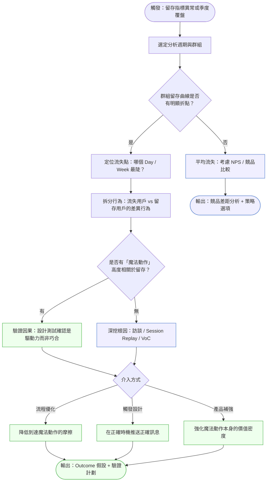
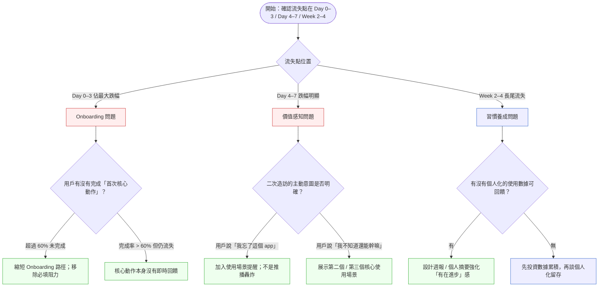

# 第 37 章 | Retention & Churn：留存的真正驅動力

> **前置閱讀**：[Ch 34 North Star Metric：選對唯一重要的指標](./ch-34-north-star.md) — 確認你的留存指標是否真的指向北極星，而非替代指標
> **前置閱讀**：[Ch 36 Product Analytics：看懂數字、不被數字騙](./ch-36-product-analytics.md) — 本章的群組分析建立在漏斗與分段基礎上
> **下游章節**：[Ch 38 Post-Launch Review：上線後的 PM 責任](./ch-38-post-launch-review.md) — 留存介入後的覆盤流程
> **SA/SD 對照**：[SA/SD 第 31 章 資料架構](../../book/part-05-quality/ch-31-data-architecture.md) — SA 視角關注留存數據的管線設計與事件模型；本章關注 PM 如何解讀群組曲線、定位流失點、做出介入決策。

---

## §37.1 冷觀察

季度指標彙報的前一天下午，QuickBuy 的 PM 把 dashboard 截圖貼進 Slack。

月回購率 28%。高於行業中位數。CPO 在底下回了一個讚。

第二天早上，Growth 端的 data analyst 送了一份附件到信箱，主旨沒有驚嘆號，只有一行字：「我覺得你應該在報告之前先看一下這張圖。」

那張圖是 7 天新用戶留存曲線。橫軸是第幾天，縱軸是「仍然活躍的比例」。第一天是 100%，第三天跌到 41%，第七天剩 12%。

PM 回去查了計算方式。月回購率的分母是「曾經消費過的用戶」，一個三個月前買過東西、上個月再次購買的用戶，就算一筆。但 7 天留存的分母是「本週期新註冊用戶」，而這批人正在以每天 15-20% 的速度流失，流光了就不算進回購率。

兩個指標都沒有錯。但兩個指標看到的是完全不同的群體。

報告如期召開。CPO 看到月回購率的時候點頭，接著看到下面補充的 7 天留存，停了三秒。「這兩個數字怎麼可以同時成立？」

PM 沒有立刻答得上來。

那個沉默持續了大約七秒。工程 Lead 看著天花板。Growth 端的 analyst 把視線移向窗外。

接下來的四十分鐘，整個 Q3 roadmap 的留存相關功能優先順序全部重排。原本排在第 6 個 sprint 的「新用戶引導重設計」，被搬到 Q3 第 1 週。原本排在第 2 個 sprint 的「老用戶個人化推薦」，暫緩。

CPO 在結束前說了一句話：「我們花了三個月優化不會流失的人。」

那七秒的沉默，是整個故事的核心。不是技術債，不是估算失準，也不是優先順序排法的問題。是指標選錯了，選了一個讓每個人都能睡好覺的數字，而不是能讓人看見問題的數字。

---

## §37.2 真問題

把 QuickBuy 的狀況拆開來看，有三層。

### 表面需求（What）

「留存率偏低，需要介入。」

這是從 CPO 報告後的緊急結論。工程團隊收到任務：「請提升 7 天留存」。接下來的 sprint planning 出現了通知優化、推播改版、新用戶 onboarding tour 等項目。

這些都是輸出（Outputs）：功能做了、頁面改了、流程重排了。

但輸出不等於成果。

### 業務目標（Why）

真正在處理的問題是：**用戶在第一週內沒有完成「理解產品價值」的動作**，所以在沒有損失感的情況下離開了。

這是一個 Outcome 問題，而不是 Output 問題。如果新用戶在第三天以前沒有完成第一次「有感的成功體驗」，所有推播和引導都只是干擾噪音。

QuickBuy 的數據顯示，完成了「加入購物車 → 比較商品 → 下單」這個完整流程的新用戶，7 天留存是 54%。沒有完成這個流程只是瀏覽的用戶，7 天留存是 8%。

問題不在推播頻率，在於用戶有沒有在第一次造訪時體驗到完整的產品迴路（purchase loop）。

從 Outcomes 到 Impact 的邏輯是：
- **Outcome**：新用戶在第 3 天前完成首次完整購物流程的比例（目標從 21% 提升到 40%）
- **Impact**：7 天留存從 12% 提升到 25%，季度 LTV 增加 18%

但在問題被拆清楚之前，團隊量的是 Outputs（功能上線數、推播打開率）。那些數字都在成長，留存卻沒有動。

### 決策瓶頸（Who × When）

表面需求清楚了、業務目標確認了，剩下的問題是：誰必須決定？什麼時候必須定案？

QuickBuy 的情況是這樣：「新用戶引導重設計」需要 Design、Engineering、Growth、Data 四個職能同時動。但沒有人被明確指定為 Driver，也沒有人被指定為 Approver。

每個職能各自做了判斷。Design 認為要先完成 UX 研究再動手。Engineering 認為要先確認 Outcome 目標再排期。Growth 認為要先跑 A/B test 再決定方向。Data 認為要先定義指標 schema 再談其他。

沒有人做錯，但四個職能形成了循環等待。

決策瓶頸是：PM 沒有被授權說「現在先行動，後面補驗證」。或者說：PM 沒有意識到自己可以這樣說。

但「現在先行動」不是無條件的授權。PM 有理由打破循環等待，必須同時滿足兩個條件：其一，Outcome 假設已經可量測，且回滾路徑存在——也就是說，做錯了的代價是有界的，不是不可逆的損傷；其二，等待本身帶來可計算的成本，例如每多等一週，就有一批新用戶在尚未體驗過完整購物迴路的情況下流失，這個損失不會因為「驗證更充分」而消失。兩個條件都成立，PM 才有充分理由說「先行動，後補驗證」；任何一個條件不滿足，預設的選擇就是等。這個判斷讓下面的 DACI 框架有了具體的邊界：Driver 角色不是跳過驗證的免責牌，而是在「等待的代價超過出錯的代價」這個判斷成立時，代表團隊出手啟動的責任。

DACI 在這裡的作用是把循環等待顯形：

| 角色 | 誰 | 留存介入決策的責任 |
|---|---|---|
| **Driver** | PM | 把「完成首次購物迴路」定為可量測的 Outcome，設定驗證節點 |
| **Approver** | CPO | 決定是否重排 Q3 優先順序（這一步在報告後已完成） |
| **Contributor** | Design / Engineering / Growth / Data | 各自提供可行性輸入，但不能成為決策守門人 |
| **Informed** | Sales / Customer Support | 上線後通知，不需要事前介入 |

決策已經在報告上被推動了。但如果沒有人在報告之前就做過這個拆解，那七秒的沉默就會發生在執行過程的每一個交叉口。

---

## §37.3 決策框架

### 圖 A — 留存分析工作流程



流程的觸發點不應該等到季度報告。健康的留存監控應該有週級警報：如果特定群組的 Day-3 留存跌破閾值，PM 應在當週接收到信號。

QuickBuy 的案例就是典型的「季度才看」問題：7 天留存已經在低位維持了超過六週，但因為月回購率掩蓋了信號，沒有人提早介入。

### 圖 B — 留存干預決策樹



決策樹的核心邏輯是：**流失點的位置決定了根因假設的方向**。Day 0–3 的流失幾乎都是 Onboarding 問題，在這裡加推播只會讓問題更快惡化。Week 2–4 的長尾流失才是習慣養成問題，那時候推播才有意義。

但決策樹只走到「方向」這一步，還沒收斂到「該量什麼」。流失點位置一旦確認，下一個決策節點不是「做什麼介入」，而是「先鎖定哪個 Outcome 指標來驗證根因」——介入若沒有對應的量測標的，就無從判斷做對了沒有。下表把這條判斷鏈一次攤開，供快速診斷：

### 流失點 → 根因假設 → Outcome 指標 對照表

| 流失點位置 | 對應根因假設 | 該鎖定的 Outcome 指標 | 量測窗口 |
|---|---|---|---|
| **Day 0–3 佔最大跌幅** | Onboarding 摩擦：用戶未完成首次核心動作 | Activation Rate（首次核心動作完成率） | 介入後 Day-7 讀取 |
| **Day 4–7 跌幅明顯** | 價值感知缺口：完成首次動作但找不到二次造訪理由 | Triggered Return Rate（正確場景觸發的回訪率） | 介入後 Day-7 至 Day-14 |
| **Week 2–4 長尾流失** | 習慣養成缺口：前兩週行為與留存用戶相似但未形成週期 | Week-2 / Week-4 Activity Rate（週活躍率） | 介入後第 4 週讀取 |
| **特定流量來源整段偏低** | 用戶意圖與產品定位不匹配 | 各來源群組 Day-7 留存率（Cohort Retention） | 下一獲客週期讀取 |

這張表的用法是：先用圖 B 定出流失點落在哪一段，再橫向讀到「該鎖定的 Outcome 指標」——這一格就是介入方案的驗證標的。流失點位置確認後，第一件該做的事不是排功能，而是把這個 Outcome 指標的基準值量出來。

### 留存干預決策表

| 情境 / 觸發條件 | 推薦做法 | PM 關注點 | 常見錯誤 |
|---|---|---|---|
| Day-1 留存 < 30%（新用戶大量首日流失） | 做 Session Replay 分析；找第一次離開的頁面 | 用戶有沒有完成「第一個有意義的動作」 | 立刻推播促銷，以為是動機問題而非流程問題 |
| Day-7 留存平台期穩定在 15% 以下 | 訪談流失用戶；問「最後一次使用是什麼情境」 | 產品有沒有觸達用戶的自然使用場景 | 優化 UI 細節，忽略使用場景不匹配的根本問題 |
| 高獲客期留存曲線突然惡化 | 拆分流量來源群組；確認新用戶意圖是否匹配 | 廣告帶來的用戶期待 vs 產品實際提供的不一致 | 歸咎到功能不夠、繼續加功能 |
| 留存曲線折點出現在 Week 2–3 | 分析「上週有使用 / 本週沒有」的行為差異 | 有無自然觸發點讓用戶主動回來 | 把 Week 2 流失與 Day 3 流失用同一套介入方法處理 |
| 老用戶群回購率高但新用戶留存持續低 | 切開群組獨立追蹤；不要混合計算 | 確認北極星指標是否包含新用戶留存 | 用老用戶的健康掩蓋新用戶的崩潰（QuickBuy 的原始問題） |
| 留存改善但 NPS 未動 | 確認量的是「使用頻率」還是「感知價值」 | Outcome 是行為改變，不只是回訪次數 | 把回訪次數的成長當作留存問題已解決 |

### If-Then 框架：留存干預介入方向

留存干預的決策可以用一個條件 × 行動的矩陣快速過濾方向：

**前提條件：已確認流失點（Day N 或 Week N）**

- **If** 流失用戶中，未完成首次核心動作的比例 > 50% → **Then** 優先修 Onboarding 流程，而非觸發與推播（量：首次核心動作完成率 Activation Rate）
- **If** 流失用戶中，已完成首次核心動作但未回訪 → **Then** 問「第二次來的理由是什麼」，設計 Trigger（量：在正確場景觸發的回訪率 Triggered Return Rate）
- **If** 流失用戶分布在 Week 2–4，前兩週行為與留存用戶相似 → **Then** 留存問題是習慣養成，優先設計週回饋（進度感、個人化摘要）（量：第 2 週 / 第 4 週 Activity Rate）
- **If** 不同流量來源的留存曲線差異 > 20% → **Then** 先解決「誰在進來」的問題，而非「進來後怎麼做」（量：各來源群組的 Day-7 留存率 Group Cohort Analysis）

這個框架的核心是：**每一個 If-Then 都對應一個可量測的 Outcome**。沒有 Outcome 定義的介入，不是決策，是猜測。

---

## §37.4 踩坑清單

**反模式：用聚合指標掩蓋群組差異**

現象：月活率、月回購率、整體 DAU 看起來健康，但新用戶和老用戶混在同一個分母。新用戶的大量流失被老用戶的穩定使用稀釋，指標沒有異常，問題也就沒有被看見。

根因：報告的壓力讓人傾向找讓人放心的數字。聚合指標容易達成，群組拆解容易讓人不舒服。

> 修正方向：把新用戶群組（前 30 天）和熟客群組（30 天以上）的留存曲線永遠獨立追蹤。任何一個「整體留存」的呈現，都應該附帶群組分解。

---

**反模式：把 Activation 問題當成 Retention 問題處理**

現象：7 天留存很低，PM 設計了精心的 Day 5 推播和 Day 7 折扣。轉換率略有提升，但 Day-1 和 Day-3 的流失率沒有改變，下一個週期的 7 天留存依然沒動。

根因：用戶在第一天就決定要不要回來了。Day 5 的介入是在第一天的放棄決定後才出手，成本高、效果差。

> 修正方向：先看 Activation Rate（首次完成核心動作的比例）。如果 Activation Rate 低於 40%，Retention 的問題是 Activation 沒有解決，而不是 Retention 本身的問題。先修 Day 0–1 的體驗，再談 Day 5–7 的觸發。

---

**反模式：把「有用到」等同於「有感受到價值」**

現象：Session 數量、頁面瀏覽數都在成長，但留存依然低。用戶在用，但在流失。

根因：工具型使用（完成任務就離開）和價值型使用（感受到獨特的東西，主動想回來）是兩件事。前者量的是 Output，後者才是 Outcome。

> 修正方向：加入質性訪談，問流失用戶「什麼情況下你會想回來」。如果用戶說「想回來但不知道什麼時候該來」，是 Trigger 問題。如果說「我覺得這個產品跟 X 差不多」，是差異化問題，不是留存介入能解決的。

---

**反模式：所有留存問題都用推播解決**

現象：留存下滑，先開推播，再加折扣，再加提醒。短期數字有反彈，但三個月後曲線又回到原位。更糟的是，用戶開始關閉通知。

根因：推播是在補產品本身不夠吸引人的缺口。短期有效，長期是透支信任額度。每一次推播打擾都在消耗「下一次推播被打開的機率」。

> 修正方向：推播的設計原則是「在用戶有需要的時機出現」，而不是「在用戶快要流失前出現」。兩者在時間軸上可能相近，但意圖完全不同。前者強化使用場景，後者是恐慌反應。

---

**反模式：留存目標只設平均值，不設群組分類目標**

現象：「本季 7 天留存目標：25%」。工程和 Growth 都在優化，但誰都不清楚要優化哪個群組、優化到多少才算達標。

根因：平均值目標讓所有人都有合理的解釋空間，也讓所有人都能說自己在「做留存」。

> 修正方向：目標設定改成群組型：「自然搜尋來的新用戶 Day-7 留存目標從 12% → 22%；廣告來源新用戶目標從 8% → 15%。」目標越具體，負責人就越清楚自己在量什麼。

---

## §37.5 交付清單 ⸺ 一頁式 留存分析卡 模板

這份卡的用途是把「留存率低」這個觀察，拆解為可以獨立執行的假設與介入方案。填完一張卡，DACI 裡每個角色都知道自己下一步要做什麼。

````markdown
# 留存分析卡（Retention Analysis Card）
> 版本:v0.1 | 撰寫日期:YYYY-MM-DD | 擁有人:{名字}

### 1. 分析週期與群組定義
群組：{新用戶 / 特定來源 / 特定行為段}
週期：{YYYY-MM-DD} 至 {YYYY-MM-DD}
樣本數：{N}

### 2. 留存曲線關鍵數值
<!-- 為什麼這欄：日留存的三個關鍵點（Day 1 / Day 3 / Day 7）決定了干預方向；
     只看 Day-7 會漏掉 Day 1–3 陡降的 Onboarding 問題。 -->
Day-1 留存：
Day-7 留存：
最陡下降點：Day {N} → Day {N+1}，跌幅  vs 未完成者 {%}
因果驗證狀態：{待驗 / A/B測試中 / 已驗證}

### 5. 根因假設（可複選）
[ ] Onboarding 摩擦過高（首次核心動作完成率低）
[ ] 使用場景不觸發（用戶不知道什麼時候該來）
[ ] 感知價值不清晰（用戶不知道為什麼要回來）
[ ] 習慣養成缺口（前兩週行為沒有建立週期）
[ ] 用戶意圖與產品定位不匹配（流量來源問題）

### 6. 介入方案
<!-- 為什麼這欄：每個介入必須對應一個 Outcome 假設和可量測指標；
     沒有量測計劃的介入方案不能排進 sprint。 -->
介入類型：{流程優化 / 觸發設計 / 產品補強}
預期 Outcome：{指標名稱} 從 {current} → {target}
量測節點：{介入後第 N 天確認}
負責人 / Driver：{姓名或角色}

### 7. DACI
Driver：{PM 姓名}
Approver：{CPO / Head of Growth}
Contributor：{Design / Engineering / Data}
Informed：{Sales / Support}
````

空白模板的核心是把「留存低」這個觀察，分解為可以獨立執行的假設。六個欄位各自有責任：第 2 欄確認測量粒度，第 3 欄定位問題位置，第 4 欄找到行為差異，第 5 欄提出假設，第 6 欄設計介入並綁定 Outcome。

把它存在 `docs/product/retention/`，跟程式碼同 repo，跟 README 同層。

---

### §37.5.1 範例：QuickBuy 新用戶 7 天留存危機分析

QuickBuy 的 PM 在 CPO 報告後的隔天，補完了第一份留存分析卡。這份卡讓原本「留存低要怎麼辦」的模糊討論，變成了四個隊伍可以各自行動的具體任務。

````markdown
# 留存分析卡（Retention Analysis Card）
> 版本:v0.1 | 撰寫日期:2026-02-15 | 擁有人:PM Serena Wu

### 1. 分析週期與群組定義
群組：2026-Q1 新用戶（首次購買日在 2026-01-01 至 2026-03-31）
週期：2026-01-01 至 2026-04-07（含 7 天追蹤期）
樣本數：11,240 位新用戶

### 2. 留存曲線關鍵數值
<!-- 為什麼這欄：Day-1 到 Day-3 的跌幅代表 Onboarding 問題，
     Day-3 到 Day-7 的跌幅代表使用場景觸發問題；兩者方向不同。 -->
Day-1 留存：64%
Day-3 留存：41%
Day-7 留存：12%
Week-4 留存：9%
最陡下降點：Day 1 → Day 3，3 天內跌 23 個百分點

### 3. 流失點定位
<!-- 為什麼這欄：Day 1–3 是 Onboarding 窗口，用戶還在評估「這值得留下嗎」；
     在這個窗口內流失的修法跟 Week 2 流失完全不同。 -->
主要流失區間：Day 1–3（佔 7 天內總流失的 67%）
流失用戶行為特徵：首次造訪僅完成瀏覽，未完成「加入購物車 → 比較 → 下單」迴路
留存用戶行為特徵：83% 在第一次造訪時完成了首次購物迴路

### 4. 魔法動作（Magic Moment）
<!-- 為什麼這欄：「完成首次購物迴路」不是功能需求，是留存預測器；
     Activation Rate 從 21% 提升到 40% 是此季最重要的 OKR 子目標。 -->
候選魔法動作：在首次造訪時完成「加入購物車 → 比較商品 → 下單」完整迴路
相關留存率：完成者 54% vs 未完成者 8%（差距 46 個百分點）
因果驗證狀態：A/B 測試中（縮短比較流程的新版 vs 現有版，2026-04-15 讀取）

### 5. 根因假設（可複選）
[x] Onboarding 摩擦過高（首次購物迴路完成率僅 21%，主要阻力在「比較商品」步驟，用戶需要 4.2 次點擊才能完成比較）
[ ] 使用場景不觸發
[ ] 感知價值不清晰
[ ] 習慣養成缺口
[ ] 用戶意圖與產品定位不匹配

### 6. 介入方案
<!-- 為什麼這欄：介入方案要對應到可量測的 Outcome，而不是功能交付；
     「比較流程縮短為 2 步」是 Output，「Activation Rate 提升到 40%」才是 Outcome。 -->
介入類型：流程優化（縮短比較商品步驟，從 4 步降至 2 步）
預期 Outcome：Activation Rate（首次購物迴路完成率）從 21% → 40%
量測節點：介入後 Day-7（2026-04-22）看首次迴路完成率；Day-14 確認 7 天留存是否反映
負責人 / Driver：PM Serena Wu

### 7. DACI
Driver：PM Serena Wu（推動迴路優化排入 Q2 Sprint 1）
Approver：CPO Jay Lin（已在 Q3 報告後口頭確認重排優先順序）
Contributor：Design（比較流程 UX 重設計）、Engineering（前端流程實作）、Data（漏斗分析）
Informed：Customer Support（告知引導邏輯異動、更新 FAQ）
````

這份分析卡在 A/B 測試讀取後證實了假設：縮短比較步驟的實驗組 Activation Rate 達到 38%，7 天留存從 12% 提升到 21%。數字還沒到目標，但方向已確認。下一步是量測 Week-4 留存，確認改善是否持續。

---

## §37.6 Recap

讀完本章，你應該已經能做到：

- [ ] 把留存數據按群組（新用戶 vs 熟客、不同流量來源）獨立切割，不用聚合數字掩蓋結構性問題
- [ ] 用流失點位置（Day 0–3 / Day 4–7 / Week 2–4）判斷根因假設的方向，而不是直接跳到介入方案
- [ ] 找到「魔法動作」——留存用戶與流失用戶行為差異最顯著的那個關鍵節點
- [ ] 為每一個介入方案綁定可量測的 Outcome，讓干預行動有收斂條件
- [ ] 完成一份留存分析卡，讓 DACI 裡的每個角色清楚自己的輸入責任

如果先挑一件做，建議是**把新用戶群組的 Day-1、Day-3、Day-7 留存率獨立拉出來看**——這個動作不需要任何工程投入，卻往往是讓問題第一次浮出水面的那個時刻。數字看得見，決策才能開始。

---

## Cross-References

- **前一章**：[Ch 36 Product Analytics：看懂數字、不被數字騙](./ch-36-product-analytics.md) — 漏斗與分段分析是留存群組拆解的基礎
- **下一章**：[Ch 38 Post-Launch Review：上線後的 PM 責任](./ch-38-post-launch-review.md) — 留存介入後的假設驗證與覆盤流程
- **強連結**：[Ch 34 North Star Metric：選對唯一重要的指標](./ch-34-north-star.md) — 留存指標必須與北極星一致，否則優化方向會偏
- **強連結**：[Ch 35 Experimentation & A/B Testing：決策有多可信？](./ch-35-experimentation.md) — 留存介入的因果驗證方法
- **強連結**：[Ch 9 VoC Loop：持續性客戶回饋管理](../part-02-discovery/ch-09-voc-feedback-loop.md) — 流失用戶訪談的系統化執行
- **SA/SD 對照**：[SA/SD 第 31 章 資料架構](../../book/part-05-quality/ch-31-data-architecture.md) — 留存事件管線的資料模型設計；SA 關注事件收集與 schema，PM 關注群組定義與指標口徑對齊
- **SA/SD 對照**：[SA/SD 第 29 章 可觀測性](../../book/part-05-quality/ch-29-observability-otel.md) — 系統可觀測性與產品行為追蹤的交叉點；工程監控與用戶行為監控共享部分基礎設施

<!-- PROPOSED-REFS
glossary:
  - anchor: retention-curve
    name: 留存曲線（Retention Curve）
    body: |
      以時間為橫軸、某群組仍活躍用戶比例為縱軸的折線圖。
      通常分為 Day-1 / Day-3 / Day-7 / Week-4 等關鍵節點。
      留存曲線的折點位置是定位流失根因的起點。
  - anchor: magic-moment
    name: 魔法動作（Magic Action / Magic Moment）
    body: |
      與留存高度相關的特定用戶行為動作。
      留存用戶與流失用戶在此動作上的完成率差距顯著，
      常被用來作為 Activation Rate 的代理指標。
  - anchor: activation-rate
    name: Activation Rate（首次核心動作完成率）
    body: |
      新用戶在特定時間窗口內完成「首次核心動作」的比例。
      核心動作通常是魔法動作或能觸發即時回饋的產品迴路。
      Activation Rate 低於 40% 通常代表 Onboarding 是留存問題的前置瓶頸。
  - anchor: cohort-analysis
    name: 群組分析（Cohort Analysis）
    body: |
      按照用戶的特定屬性（如首次使用日期、來源渠道、行為段）
      分組後獨立追蹤各組的行為與指標變化。
      避免聚合指標掩蓋不同用戶群體之間的結構性差異。
cases:
  - id: CASE-ECM-114
    title: "QuickBuy 留存假象：回購率良好，但 7 天留存持續崩潰"
    domain: ecommerce
    chapters: [ch-37]
    summary: |
      虛構電商 QuickBuy：月回購率穩定在 28%，PM 認為留存健康。
      但 7 天留存（新用戶第一週是否再訪）只有 12%，
      代表大量新用戶在第一週就流失。回購率掩蓋了真正的問題。
      根因是首次購物迴路完成率僅 21%，縮短比較步驟後
      Activation Rate 提升至 38%，7 天留存改善至 21%。
-->
