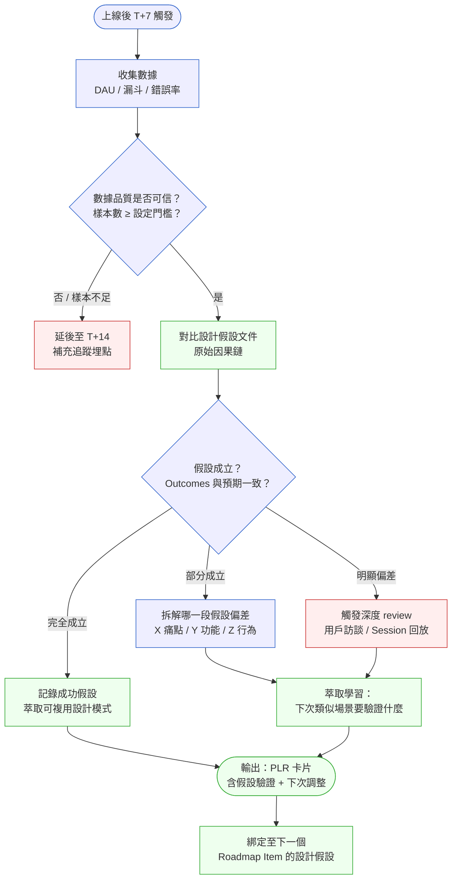
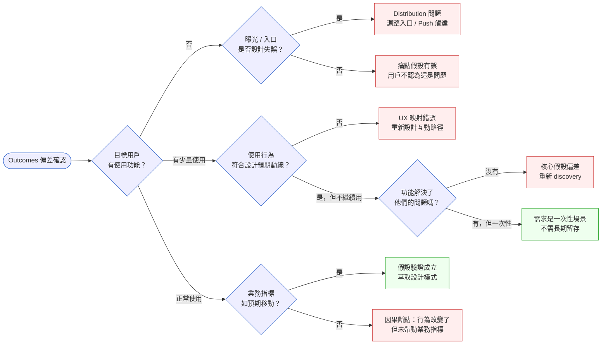
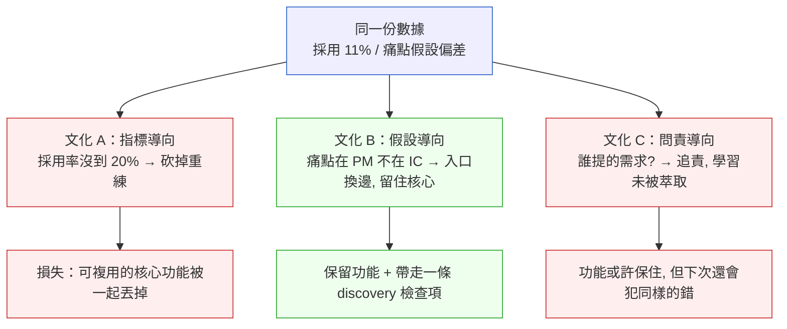

# 第 38 章 | Post-Launch Review：上線後的 PM 責任

> **前置閱讀**：[Ch 34 North Star Metric：選對唯一重要的指標](./ch-34-north-star.md)、[Ch 36 Product Analytics：看懂數字、不被數字騙](./ch-36-product-analytics.md)、[Ch 37 Retention & Churn：留存的真正驅動力](./ch-37-retention-churn.md)
> **下游章節**：[Ch 39 AI 功能的產品決策：怎麼決定做不做](../part-07-ai-era/ch-39-ai-feature-decisions.md)
> **SA/SD 對照**：[SA/SD Ch 30 SRE、SLO、Chaos Engineering](../../book/part-05-quality/ch-30-sre-slo-chaos.md)
> ⸺ SA 視角的 post-launch 聚焦於系統穩定性（SLO 達標、error budget 消耗）；本章聚焦於產品假設（Product Hypothesis）的驗證——功能上線了，使用者行為有沒有如預期改變？

---

## §38.1 冷觀察

季度末的 Taskline 全員會上，CPO 把投影筆的紅點停在螢幕中央，沒有先說話。

投影片有三個功能，各有一張折線圖。三張圖長得幾乎一模一樣：上線第一週有小幅躍升，第三週回落，第六週幾乎貼著基線，像三條被同一隻手畫出來的曲線。

「我們做了三次 post-launch review，」他終於開口，「每次都有報告，每次都有數字。」他把紅點在三張圖之間來回劃了兩趟。「誰能告訴我，這三張圖差在哪裡？」

會議室二十幾個人，沒有一個人舉手。負責那三個功能的三位 PM 互相看了一眼，又各自低頭看自己的筆電。

「差別是沒有差別。」CPO 自己回答了，「你們做的 review，只看了指標有沒有達標。沒有一個人回去翻當初的設計假設——我們以為用戶會怎麼做、為什麼他們應該用這個功能。三份報告，三套不同的數字，講的卻是同一個故事，而沒有人發現。」

那個沉默持續了大概十秒。十秒在一個全員會議上，長得像一場小型事故。

把時間倒回三個月前。Taskline 的 PM 團隊每次上線後都認真填報告，沒有人偷懶。他們看日活躍用戶（Daily Active Users，DAU）、看功能採用率（Feature Adoption Rate）、看淨推薦值（Net Promoter Score，NPS）。數字沒有特別難看，沒有任何紅燈，所以——沒有人觸發問題。

但有一個問題從來沒人問：「我們最初假設用戶在 {某個場景} 下會採取 {某個行為}，這個假設對了嗎？」

第一個功能的設計假設是「多人協作任務的負責人會想要一鍵重新分配」。上線後的指標顯示採用率 12%——比目標低，但落在「可接受範圍」內，於是被歸檔為「達標」。沒有人回頭看的是，那 12% 裡有 9% 是管理者帳號，不是第一線執行者（Individual Contributor，IC），而設計假設裡的受益者恰恰是 IC。換句話說，這個功能服務到了一群它本來不打算服務的人，而那群本該被服務的人，根本沒打開過它。指標是綠的，假設是錯的。

第二個功能，類似的故事——只是換了一個名字、換了一條曲線。第三個功能，連結構都一模一樣：目標用戶沒來，來的是另一群人，而報告只記錄了「來了多少人」。

三次 review，三份 PDF，沒有一份問的是：「我們當初的假設錯在哪裡？」三份報告各自看起來都很專業，合在一起卻拼出一個團隊正在重複犯同一個錯、而且把它記錄了三遍卻沒讀懂的事實。

CPO 的那十秒沉默，等的就是這個問題。而那十秒之所以難堪，不是因為功能失敗——功能失敗很常見——是因為團隊有完整的流程、完整的數據、完整的報告，卻在最該學到東西的地方，什麼都沒學到。

---

## §38.2 真問題

把 Taskline 的困境拆開來看，浮現的不是執行問題，是定義問題。他們不是不會做 review，是把 review 的目的定義錯了。而錯誤的定義，會讓再勤奮的執行都導向同一個盲點。

這裡先把後面會反覆用到的一個責任結構提前點出來，因為它正是 Taskline 真正缺的東西：**沒有人被指派「對假設負責」**。這不是流程末端的小遺漏，而是讓三次失敗得以連續發生的結構性空洞——我們會在本段最後回到它，但請先記住：問題的急迫性，從一開始就藏在「沒人負責」這四個字裡。

### 表面需求（What）

PM 的上線後 review 停在「確認指標有沒有紅燈」。這是產出（Output）審查——我們發布了什麼、數字有沒有達到門檻。Taskline 三次都做到了這一層，而且做得很標準：報告格式統一、指標定義清楚、圖表漂亮。問題不在於做得不夠好，而在於做的是錯的那一層。

### 業務目標（Why）

Post-launch review 真正的目的，是驗證**假設**，不是核對數字。

每個功能上線前，PM 心裡（或文件裡）有一條因果鏈：

> 「因為用戶有 {痛點 X}，我們做了 {功能 Y}，預期他們會改變 {行為 Z}，帶來 {業務指標變動 W}。」

這條因果鏈裡有三個可以被驗偽（Falsifiable）的假設：痛點是否真實存在且夠嚴重、功能設計是否對應到痛點、行為改變是否能驅動業務指標。三個假設環環相扣，任何一個斷掉，最終指標就不會動——但只看最終指標，你永遠不知道是哪一環斷的。

Taskline 的 review 只看 W（最終指標），沒有追蹤 Z（行為改變），更沒有問 X（原始痛點假設）是否成立。於是當 W 沒動，團隊唯一能做的反應是「再做一個功能試試看」——這正是他們連犯三次的機制。

這就是 **Outputs / Outcomes / Impact 的混淆**：

| 層次 | Taskline 的狀況 | 應該看的問題 |
|------|----------------|-------------|
| **Outputs（產出）** | 功能如期上線 ✓ | 我們做了什麼、做完了嗎？ |
| **Outcomes（成效）** | 用戶行為是否如預期改變？ ✗ 未追蹤 | 真正被服務到的是哪些人、他們怎麼用？ |
| **Impact（影響）** | 業務指標移動了嗎？部分看了 | 指標移動的原因是功能，還是外部因素？ |

review 的深度停在 Outputs，就永遠不會學到有效的東西。它會告訴你「事情做完了」，卻不會告訴你「事情有沒有用」。

業界的數字對比能讓這個落差更具體。Taskline 第一個功能的採用率 12%，乍看像個「中性偏低」的數字；但拆開 Outcomes 後發現，目標客群（IC）的真實採用率只有約 3%（12% 中扣掉 9% 的管理者帳號），距離 20% 的設計目標差了近七倍——這個差距在只看總採用率時完全被掩蓋。第二個功能更典型：總採用率 18%，看似比第一個好，但行為指標「任務移交後 7 日內關閉率」只從基準 41% 升到 43%，幾乎沒動；團隊原本預期的是升到 55% 以上。從 41% 到 43% 與從 41% 到 55%，在「採用率達標」的報告裡長得一模一樣，卻是「假設成立」與「假設崩塌」的天壤之別。第三個功能則是另一種陷阱：NPS 從 32 微升到 34（看似正向），但把 NPS 按使用該功能與否交叉拆開，重度使用者的 NPS 反而從 38 掉到 29——功能正在傷害最該被取悅的那群人，而總體 NPS 的小幅上升把它藏了起來。三個功能，三組「看起來還行」的總體數字，背後是三個已經崩掉但沒被看見的假設。

### 決策瓶頸（Who × When）

現在回到開頭埋下的那個結構性空洞。問題不只是「review 做得不夠深」，而是沒有人被賦予**對假設負責**的角色——而這個角色的缺席，比 review 不夠深更致命，因為它讓「不夠深」變成了一個無人需要負責的默認狀態。

三個功能的決策責任分配（DACI：Driver / Approver / Contributor / Informed）在設計階段都有定義，但在 post-launch 階段，DACI 被預設為「不適用」——因為功能已經上線了，還需要誰「核可」什麼？

這個盲點很常見：大多數團隊的 DACI 只活在功能開發週期裡，上線後就消失。沒有 Driver 負責把 review 的結論推進到下一次決策，Approver 不存在，Contributor 各自回到下一個衝刺（Sprint）。

結果就是：**review 變成一個儀式，學習沒有流向任何決策**。儀式的特徵是它在乎「有沒有做」勝過「做出了什麼」——三份 PDF 證明儀式完成了，但沒有任何一個下游決策因為這三份 PDF 而改變。

後來 Taskline 做的改動很簡單：每次 post-launch review 結束後，必須有一個人的名字對應到「這個結論會怎麼影響下一張 roadmap card」。不必是大改動，但必須有名字、有到期日（due date）。一個有名字的結論才會被追，一個被追的結論才會變成下一次的設計輸入。

否則就是 §38.1 那三份 PDF 的命運——寫完了，跟下一個功能沒有任何關係。

---

## §38.3 決策框架

這一段的目的不是給你「Taskline 應該怎麼做」的答案，而是給你五組可以套到自己團隊上的判斷工具：一個流程圖告訴你 review 怎麼走、一棵決策樹幫你定位假設斷在哪、一個假設寫作診所教你寫出可驗偽的假設、一套資料品質閘門幫你識別埋點地雷、以及一張矩陣幫你決定要花多大力氣。

### 圖 A｜上線後覆盤工作流程



**圖 A 怎麼讀、什麼情況下用它。** 圖 A 是一條「主動脈」——它回答的問題是「一次完整的 post-launch review 應該照什麼順序走」。當你手上是一個剛上線、還沒被診斷過的功能，從圖 A 的頂端 T+7 觸發點開始，照著流程一路走下來，它會強迫你在進入「假設成立嗎」這個判斷之前，先通過兩道閘門：數據可信嗎（節點 C）、有沒有對照原始假設文件（節點 E）。這兩道閘門正是 Taskline 三次都跳過的地方。

這個流程的關鍵轉折在 **E（對比設計假設文件）**——很多團隊跳過這一步，直接從 B 跳到 F，只問「數字對不對」而不問「假設對不對」。沒有 E，F 的判斷就失去了參照系：你會知道採用率是 12%，但不知道 12% 相對於什麼算好或壞，於是只能憑感覺判斷「還行」或「不行」。E 這一步把「憑感覺」換成「對照刻度」。

另一個容易被忽略的設計是節點 C 的「延後」分支（指向 D）。延後不是失敗，是對統計顯著性（Statistical Significance）的尊重——這一點與 [Ch 35 Experimentation & A/B Testing](./ch-35-experimentation.md) 的樣本量框架直接對接。T+7 是最常用的第一次 review 觸發點，但並非固定規則：在用戶數少（< 1,000 月活躍用戶，MAU）或功能觸發率低的場合，樣本不足會讓 T+7 的數據毫無意義，照著它做決定等於擲骰子。延至 T+14 是常見做法，但門檻設定本身應該在功能設計階段就定好、寫進 PLR 卡片的「觸發條件」欄位，而不是 review 當天臨時拍腦袋。一句話總結：**圖 A 適合「我要完整跑一遍 review」時，當作不漏步驟的檢查清單。**

### 圖 B｜假設偏差診斷決策樹



**圖 B 怎麼讀、什麼情況下用它。** 如果說圖 A 是「跑完整個流程」，圖 B 就是「流程跑到節點 H、發現假設有偏差之後，鑽進去找出偏差到底在哪一層」的放大鏡。**什麼情況下用圖 A、什麼情況下用圖 B？** 一句話：**圖 A 決定「要不要深查」，圖 B 決定「深查的方向往哪走」。** 當你還在問「這個功能整體算不算成功」，用圖 A；當你已經確認「不成功，但不知道為什麼」，切換到圖 B。

圖 B 採用左右流向（LR）而非上下（TD），是刻意的：它要讀者從最左邊那個唯一的入口「Outcomes 偏差確認」出發，像撥電話樹一樣一層層往右收斂。讀法是**從左到右、每次只回答一個是非題**，不要試圖一眼看完整張圖——它的十二個終點不是要你記住，而是要你在診斷當下，順著手上的數據走到其中一個。

具體怎麼走：第一個分岔 P1 問「目標用戶有沒有在用」，這一刀先把「沒人用」和「有人用但沒效果」分開——這是 Taskline 最該先問卻最晚才問的問題。往左走（沒人用）會通到 R1（曝光/入口問題，這是最便宜的修法）或 R2（痛點假設根本錯了，這是最貴的領悟）。往中間走（有少量使用）會通到 R3（互動動線設計錯）或 R4（核心假設偏差）。往右走（正常使用但指標沒動）通到 R7，也就是「因果斷點」——行為改變了，卻沒帶動業務指標，這通常意味著你的因果鏈裡漏了一個中間變數。

特別注意 R5（需求是一次性場景）——這是全圖唯一一個「綠色終點」中代表「不需補救」的路徑。這不是失敗，是一個值得歸檔的設計洞察。不是所有功能的目標都是長期留存；有些功能就是為了解決一個用戶在特定生命週期中只需要做一次的事（例如資料遷移、帳號設定）。如果設計假設從一開始就是如此，那 review 的結論是「符合預期」，不是「留存率低」——把 R5 誤判成 R4 而重啟 discovery，是最浪費資源的一種「勤奮」。

### 假設寫作診所

一個 PLR 好不好，品質在 review 當天才看得出來；但那天品質高不高，其實在功能上線前就決定了——決定在「假設有沒有被寫成可驗偽的句子」。

好的假設句有四個組成部分，缺一不可：

> 我們假設 **{用戶類型 + 動機}**，當面對 **{具體場景或觸發條件}** 時，會採取 **{可觀察的離散行為}**，因為 **{驅動機制}**，最終帶來 **{可測量的指標變動}**。

五個從模糊到可驗偽的梯度範例如下，讓對比的落差說話：

| 等級 | 假設句範例 | 問題所在 |
|------|-----------|---------|
| ❌ 等級 1（無從驗偽） | 「提升用戶滿意度」 | 沒有用戶類型、沒有行為、沒有可測指標 |
| ❌ 等級 2（方向正確但模糊） | 「PM 用戶會覺得 Bulk Reassign 更方便」 | 「更方便」無法被埋點，review 時憑感覺判斷 |
| ⚠ 等級 3（有行為、缺機制） | 「IC 用戶會使用 Bulk Reassign 批次移交任務」 | 行為可追蹤，但沒有「為什麼」，偏差時找不到修法方向 |
| ⚠ 等級 4（有機制、缺指標量化） | 「IC 在跨 sprint 交接場景下會使用 Bulk Reassign，因為減少逐一操作的摩擦」 | 行為與機制都在，但「結果如何」沒定義，只知道用了沒有、不知道有沒有用 |
| ✅ 等級 5（可驗偽） | 「IC 用戶（定義：非管理者角色）在 sprint 結束前 3 天內，會至少使用一次 Bulk Reassign，帶來 7 日任務關閉率從 41% 提升至 55%，因為批次操作降低了逐一移交的時間成本」 | 每個名詞有埋點、有時間條件、有目標值、有機制解釋 |

**寫好之後，用這個三步驟自我檢查：**

1. **可埋點性**：假設句裡的每個名詞，系統裡對應的 event 或 property 是否已存在或可建立？
2. **可觀察性**：行為發不發生，可以不依賴用戶自我回報、只靠 log 確認嗎？
3. **可歸因性**：如果指標移動，有辦法排除外部因素（季節性、競品動作、行銷活動）嗎？

三步驟有任何一步打 X，這個假設在 review 當天就會讓你陷入「感覺上好像還行」的困境——而 Taskline 的三份 PDF，每一份都卡在這裡。

### 數據品質閘門：PLR 前的三道埋點檢查

樣本不足是最容易看見的數據問題，但不是最常見的。以下三個「埋點原罪」在 PLR 開始之前就應該被攔截，否則再好的假設框架都建立在沙上。

**原罪一：同一個動作觸發多次 event**

現象：用戶點擊按鈕一次，但因為 event 放在 `useEffect` 或頁面重渲染路徑上，同一個 session 裡產生 3 次相同的 event。採用率看起來很高，其實是計數膨脹。

診斷方式：抽取 5–10 個已知用戶的 session，對照 log 手動確認每個 event 的觸發次數是否與預期一致。

修正時機：在埋點驗收（QA）階段，不是 review 當天。

**原罪二：關鍵 property 缺失**

現象：event 有觸發，但缺少分群用的 property（例如 `user_role`、`plan_type`、`days_since_signup`），導致 review 時只能看總量，無法拆解目標用戶行為。Taskline 第一個功能的「管理者 vs IC」問題，根本原因就是 event 裡沒有 `user_role` property，review 時才發現拆不了。

診斷方式：在功能設計階段，建立「PLR 需要哪些拆分維度」清單，逐一確認對應的 property 是否在 event schema 裡。

修正時機：上線前，不是 review 後發現再補（補 property 需要重新埋點部署，中間這段數據就永遠沒了）。

**原罪三：event 定義後設（post-hoc）**

現象：功能上線後才定義「採用」的判斷條件，例如「用過三次以上才算真正採用」。這個閾值是用看到數字之後的直覺決定的，而不是設計假設時的邏輯推導。事後定義等於選一個能讓數字好看的標準。

診斷方式：在 PLR 卡片的「觸發條件」欄位裡，要求 PM 在上線前填寫「採用」的操作型定義（operational definition），並且簽名確認。Review 時不允許更改定義。

修正時機：功能規格定稿時，不是 review 前一天。

> **交叉檢查提醒**：這三道閘門的來源在 [Ch 26 PM × Data：指標的定義與所有權](../part-04-collaboration/ch-26-pm-data.md)——PLR 數據品質的前置工作，本質是 PM 與 Data 工程師在功能上線前的協作品質。

### 決策表｜PLR 情境與 PM 行動選擇

| 情境 / 觸發條件 | 推薦做法 | PM 關注點 | 常見錯誤 |
|----------------|---------|----------|---------|
| 功能上線後採用率 < 目標 30% 以上 | 先確認曝光是否足夠，再問行為假設 | 入口能見度、觸達路徑 | 直接改功能設計，跳過 distribution 診斷 |
| 指標達標但 NPS 下降 | 追蹤哪個用戶群 NPS 下降、與功能使用交叉分析 | 功能可能對特定群體造成干擾 | 認為指標達標就是成功，忽略 NPS 信號 |
| 行為改變符合預期，但業務指標無動靜 | 驗證行為→業務的因果鏈是否成立 | 可能中間有其他阻斷因素（定價、競品） | 重新做 feature 而非驗證因果假設 |
| 用戶反饋正向但使用頻率低 | 確認是一次性場景還是設計有 activation 障礙 | 區分 "nice to have" 和 "use once and done" | 把一次性場景的 retention 低視為問題 |
| Review 結論「下次要注意 X」但無行動人 | 結論必須綁定一個 roadmap item + 負責人 | DACI 的 Driver 在 review 後是否存在 | 結論停在文件裡，沒有流進下一個決策 |
| 樣本不足、數據無統計意義 | 延後 review 至樣本達標，同時補追蹤埋點 | 設計階段即設定 review 觸發門檻 | 用不足樣本的數據做出 pivot 決定 |

### If-Then 框架：假設驗證行動矩陣

按**假設偏差程度**和**業務影響幅度**判斷 post-launch 的後續行動力道：

- **If** 假設大體成立且業務影響低 → **Then** 歸檔成功案例，萃取設計模式
- **If** 假設大體成立且業務影響中 → **Then** 小幅 iteration，優化 activation
- **If** 假設大體成立且業務影響高 → **Then** 公開宣傳成果，綁定下一個大功能設計
- **If** 假設局部偏差且業務影響中 → **Then** 針對偏差點做用戶訪談，設計 patch
- **If** 假設局部偏差且業務影響高 → **Then** 觸發緊急 discovery，暫停下一個同類假設的功能
- **If** 假設明顯錯誤且業務影響低 → **Then** 決定是否值得補救（ROI 評估）
- **If** 假設明顯錯誤且業務影響中 → **Then** 回到 discovery 階段，重設假設
- **If** 假設明顯錯誤且業務影響高 → **Then** 上升至 CPO / 產品委員會，重新評估策略方向

這個矩陣的核心是：**偏差程度決定學習深度，業務影響決定行動速度**。兩個維度不互相替代。假設大體成立但業務影響高，代表有更高的放大機會；假設明顯錯誤但業務影響低，代表可以用低成本做更深的實驗，不必驚動利害關係人（Stakeholder）。

### PM 流程決策卡｜你的團隊該在哪一層做 review

不是每個團隊、每個功能都需要走完整流程。下面這張 3×3 卡片幫你快速定位：用「觸發時機」對上「分析深度」，再讀出「所需角色」，就知道這次 review 該動用多少人、做多深。

| 觸發時機 ＼ 維度 | 分析深度 | 所需角色 |
|----------------|---------|---------|
| **T+7 例行覆盤**（每個功能都做） | 對照假設文件 + 看三層指標是否有紅燈 | Driver（PM）一人即可，數據由 Analyst 預先備好 |
| **偏差 > 20% 觸發**（指標或假設明顯偏離） | 圖 B 診斷 + Session 回放抽樣 | Driver + Contributor（設計師 / 工程師） |
| **策略級信號觸發**（NPS 反轉、營收受影響、跨功能重複錯誤） | 完整圖 A + 用戶訪談 + ROI 重估 | Driver + Approver（Group PM / CPO）+ 全 DACI |

讀這張卡的方式是「由上往下升級」：絕大多數功能停在第一列（一個人、半天、對照假設即可）；只有當第一列發現偏差超過門檻，才升級到第二列；只有當偏差觸及策略層（像 Taskline 那種「同一個錯重複三次」），才升到第三列、把 Approver 拉進來。用這張卡，你不會把每個小功能都搞成全員會議，也不會把一個策略級的信號用一份單人 PDF 草草帶過。

### DACI 在 Post-Launch Review 的角色分配

很多團隊的 DACI 只活在 sprint 規劃裡。post-launch review 需要一套**專屬的決策責任分配**：

| 角色 | 全稱 | Post-Launch 的具體責任 |
|------|------|----------------------|
| **D** Driver（推動者） | 推動 review 進行 | PM（本章的主體）；負責召集、彙整假設文件、主持討論 |
| **A** Approver（核可者） | 最終決定後續行動 | Group PM 或 CPO；決定是否觸發 pivot、配置資源做 follow-up |
| **C** Contributor（貢獻者） | 提供數據與觀察輸入 | 工程師（技術指標）、設計師（UX 流量觀察）、Data Analyst（漏斗分析） |
| **I** Informed（被告知者） | 被通知 review 結論 | Sales、CS、Marketing；需知道功能的實際表現以調整對外說法 |

這裡最容易被省略的是 **A**——Approver 在 review 後如果沒有明確的「拍板人」，結論就只是一個觀察，不是一個決策。

**DACI 規模變體**

以上是六角色結構，適合 20–60 人產品團隊。以下是兩個常見的縮放版本：

- **5 人新創（角色合併）**：PM 同時扮演 Driver + Approver；工程師兼任 Contributor；沒有獨立 Analyst，數據由 PM 自行拉。整個 review 可以壓在 30 分鐘 Slack 對話裡完成——只要假設句和 PLR 卡片的「原始設計假設」欄位是填的，流程精神不變。注意：當 PM 同時是 Driver 和 Approver 時，「確認偏誤」（Confirmation Bias）風險升高，建議找一位工程師或設計師充當「唱反調者」（Devil's Advocate）做壓力測試。
- **200 人大型組織（角色細化）**：Driver = PM；Approver = 跨部門產品委員會（Product Council）；Contributor 細分為 Data Science（統計顯著性驗證）、UX Research（定性信號）、Engineering（技術指標）；Informed 擴大至 Legal（資料合規）、Finance（收入影響）。這種規模下，PLR 不是一場會議，而是一份非同步文件＋72小時評論窗口＋決策會議，見下節「異步 PLR 變體」。

---

## §38.4 踩坑清單

下面六個反模式，每一個都配一個「修正方向」與一段「換成最佳實踐長什麼樣」。看反模式是為了認出自己正在做的事，看最佳實踐是為了知道對岸長什麼樣。

**反模式一：只看最終指標，跳過假設驗證**

現象：review 報告裡只有數字達標 / 未達標，沒有對比設計假設文件。PM 知道功能採用率是 18%，卻不知道當初假設是 25% 還是 15%。

根因：設計假設沒有被寫成正式文件，或寫了但沒有版控、在 review 前找不到。假設驗證無從發生。

> 修正方向：把「設計假設書寫」列為功能規格的必填欄位，格式是「我們假設 {用戶類型} 在 {場景} 下會 {行為}，帶來 {指標變動}」。上線後的 review 只需要對著這句話逐一核對。

**換成最佳實踐長什麼樣**：在規格定稿那一刻，假設句就已經是文件裡的第一行，而且帶版本號（因為假設會隨 discovery 修正）。Review 當天，PM 打開的不是一張空白報告，而是那句假設加上三欄空白：「假設說會發生 → 實際發生了 → 差距與解讀」。整場 review 從「我們來看看數字」變成「我們來核對這句話」——前者沒有終點，後者半小時就能收斂。一個成熟團隊的標誌是：任何人都能在 30 秒內調出任一已上線功能的原始假設句，不需要去翻三個月前的 Slack 對話。

---

**反模式二：等數字「夠難看」才啟動深度 review**

現象：指標勉強過線就不追查，只有指標大幅低於目標才觸發問題討論。Taskline 的案例剛好屬於這種：12% 採用率在容忍範圍內，沒有人問為什麼不是 30%。

根因：review 的觸發條件只有「紅燈」，沒有「假設偏差程度」的維度。紅燈設定本身可能就低得沒有意義。

> 修正方向：觸發深度 review 的條件改為「與設計假設的偏差 > 20%」，不論指標是否達到門檻。偏差方向包括「比預期好太多」——那也是一個沒被理解的假設。

**換成最佳實踐長什麼樣**：觸發條件變成雙軌——「絕對紅燈」（低於最低可接受線）和「相對偏差」（與假設預期差距 > 20%）任一觸發即啟動診斷。關鍵是把「比預期好太多」也納入觸發：一個採用率衝到預期三倍的功能，代表你嚴重低估了某個需求，那是一個可以放大的金礦，但只有去查才挖得到。成熟團隊對「超預期」和「低於預期」一樣好奇，因為兩者都意味著「我們對用戶的理解有一塊是錯的」——而錯誤的方向不重要，被忽略才致命。

---

**反模式三：Review 結論停在「下次要改進 X」**

現象：每次 review 末尾都有一段「學到的教訓」，但下次上線新功能，同樣的教訓再次出現。Taskline 三個功能的共同問題是「入口設計沒有考慮到用戶的操作動線」——這個問題被記錄了三次，沒有被解決一次。

根因：教訓沒有綁定下一個決策點。沒有人的 OKR / sprint goal 裡包含「實踐上一次 PLR 的學習」。

> 修正方向：每次 PLR 結論必須包含「這個學習影響哪一個已在 roadmap 上的 item，由誰負責、在什麼時間點驗證已被採用」。沒有 due date 和負責人的教訓等於沒有教訓。

**換成最佳實踐長什麼樣**：每條學習都帶一個「下游掛鉤」——一個明確的 roadmap item ID、一個負責人、一個驗證時間點。下一次 review 開場的第一件事，是回看上一次的學習掛鉤有沒有被執行（「上次說要在 X 功能驗證的事，做了嗎？結果如何？」）。這把 review 從一連串孤立事件串成一條學習鏈：第 N 次的結論是第 N+1 次的開場議題。當學習有了被追蹤的義務，「重複犯同一個錯」會在第二次就被攔下，而不是攢到第三次上全員會議。

---

**反模式四：把 post-launch review 當事後問責**

現象：review 變成「找誰的問題」的場合。PM 傾向只呈現正面數據，工程師擔心技術決策被質疑，設計師回避 UX 路徑的爭議。結果是沒有人說真話。

根因：review 的心理安全（Psychological Safety）沒有被建立。會議的主持框架太接近「績效評核」而不是「學習對話」。

> 修正方向：明確宣告 PLR 的目的是「理解假設對不對」，不是「確認誰做對做錯」。成功指標改為「從這次 review 萃取出幾個可以影響下次設計的洞察」，而不是「功能有沒有達標」。主持人在開場時說清楚這個框架。

**換成最佳實踐長什麼樣**：主持人開場第一句話就把框架定錨——「今天我們不是來判斷誰對誰錯，是來判斷我們對用戶的哪個假設錯了」。語言上把主詞從「你/你的功能」換成「我們/我們的假設」，責任就從個人轉移到團隊的共同認知。最健康的 review，是 PM 主動先講出自己假設裡最弱的一環（「我當時其實不太確定 IC 會不會用，但沒有去驗」），這種示範會讓房間裡其他人也敢說真話。一個把 review 做成學習對話的團隊，工程師會主動說「這個埋點當初設計得不夠細，下次我多埋兩個」——而在問責文化裡，這句話永遠不會被說出口。

**跨職能衝突的特殊情境**：當 review 挖出「埋點遺漏」時，工程師有時會防衛性地解釋設計決策；當 UX 假設偏差時，設計師有時會把問題歸因到需求不清。這兩種反應不是惡意，是自然的自我保護。PM 的任務不是裁判，而是把對話框架從「誰的錯」拉回到「假設是在哪一層斷的」——圖 B 的診斷樹在這裡有額外的價值：當討論有了結構性的診斷工具，就比較難滑向人身攻擊，因為每個人都在回答同一個是非題，而不是在為自己的決策辯護。

---

**反模式五：忽略「假設成立但一次性需求」的正當性**

現象：某個功能留存率低，PM 立刻認定是失敗，開始規劃改版。但原始設計假設是幫助用戶完成一個遷移動作——本來就是用一次就結束。

根因：沒有在設計階段區分「留存型功能」和「任務完成型功能」，導致用同一套 review 標準去評量兩種不同目的的功能。

> 修正方向：在功能規格中加入「功能類型」欄位：留存型（用戶應該反覆回來）/ 任務型（用戶應該完成後不再需要）/ 觸達型（促使用戶去做另一件事）。三種類型的 review 指標設定完全不同。

**換成最佳實踐長什麼樣**：功能類型在規格階段就決定，而且直接綁定該功能的成功指標——留存型看回訪曲線，任務型看「完成率與完成時間」，觸達型看「是否成功把用戶導向下一個動作」。Review 時用對應類型的指標去評，不會拿留存率去問一個本該用完即走的遷移工具。成熟團隊甚至會在 roadmap 上用三種顏色標記功能類型，讓所有人一眼就知道某個功能該用哪把尺去量——這樣就不會發生「為一個任務型功能的低留存率開緊急會議」這種把資源花在錯誤焦慮上的事。

---

**反模式六：假設明顯失敗，但沒有明確的退出決策**

現象：PLR 結論是「核心假設根本錯了，功能對目標用戶毫無價值」，但沒有人說出「這個功能要下架」。功能繼續佔用 support 資源、佔用文件空間、佔用新用戶的認知頻寬，形成「殭屍功能」。

根因：產品文化裡，「上線」是一個有慶祝儀式的時刻，而「退出」是一個沒有清晰流程的尷尬狀態。沒有退出 SOP，就沒有人願意第一個說出口。

> 修正方向：每次 PLR 的行動決策欄位裡，明確保留「功能退出」選項，並為它建立標準化流程。退出不是失敗，是一個需要被正式承認的產品決策。

**換成最佳實踐長什麼樣**：

當 PLR 結論是「假設明顯錯誤 + 業務影響可接受」，啟動功能退出清單：

1. **可回復性評估**：這個功能的核心假設是否可以用低成本的 patch 修正，還是假設根本上已不成立？前者做 pivot，後者才考慮退出。
2. **影響範圍確認**：退出前確認有多少用戶在使用，是否有依賴（API 呼叫、第三方整合、CS 知識庫提及）。
3. **退出溝通模板**：對內（Sales、CS、行銷）說明功能退出的原因和時間線；對外（如果功能有公開說明頁）準備簡短的「功能下架」說明，避免用戶在使用時突然發現功能消失。
4. **後設學習歸檔**：把「這個假設為什麼是錯的」寫進 PLR 卡片的「學習萃取」欄位，並打標籤標記為「已驗偽假設」，讓未來做類似功能的 PM 能搜尋到，不必重新發現同一個錯誤。
5. **責任免除聲明**：在 PLR 卡片上由 Approver 簽核退出決定。退出是一個需要 Approver 拍板的決策，不是 PM 單方面可以宣布的動作。

退出流程最重要的文化效果：當「退出」有了 SOP，它就從一個讓人不舒服的個人失敗，變成一個團隊集體學習的完成動作。Taskline 的 CPO 後來說的一句話值得記住：「我們不害怕功能失敗，我們害怕不知道它是怎麼失敗的。」PLR 的退出流程，就是把「怎麼失敗的」記錄下來的那個動作。

---

## §38.5 交付清單 ⸺ 一頁式 Post-Launch Review 卡片（PLR Card）模板

PLR Card 的設計原則是「一張卡，四個問題」：我們做了什麼（Output）、用戶行為改變了嗎（Outcome）、業務指標動了嗎（Impact）、原始假設對了嗎（Hypothesis）。少了任何一個問題，review 就停在某一層。

````markdown
### Post-Launch Review Card
> 版本:v0.1 | 撰寫日期:YYYY-MM-DD | 擁有人:{名字}

功能名稱：{feature name}
上線日期：{YYYY-MM-DD}
Review 日期：{YYYY-MM-DD}，T+{N} 天
<!-- 為什麼這欄：T+N 不是隨手填的日期，是你對「樣本要多久才夠」的承諾；
     在低流量功能上太早做 review，等於用半張票根判斷整場電影。 -->
PM：{name}
DACI Driver：{name}
DACI Approver：{name}
<!-- 為什麼這欄：Approver 欄空著，這份 review 就只是觀察不是決策；
     沒有拍板人的結論，三個月後還是會躺在原地。 -->

---

### 1. 原始設計假設
<!-- 為什麼這欄：沒有這一欄，整份 review 就只是「看數字」而非「驗假設」；
     多數學習斷點發生在找不到假設文件的那一刻。 -->
我們假設：{用戶類型} 在 {使用場景} 下會 {預期行為}，
帶來 {業務指標} 的 {方向與幅度} 變動。

功能類型：□ 留存型  □ 任務完成型  □ 觸達型
<!-- 為什麼這欄：類型決定你該用哪把尺量；用留存率去評一個用完即走的
     任務型功能，會把「符合預期」誤判成「失敗」。 -->

---

### 2. 數據彙整（T+{N} 天）

| 指標 | 設計目標 | 實際值 | 偏差 % |
|------|---------|--------|--------|
| Feature adoption rate | {X}% | {Y}% | {Z}% |
| {關鍵行為指標} | {target} | {actual} | {delta}% |
| {業務指標} | {target} | {actual} | {delta}% |

樣本數：{N} 個用戶 / {N} 個 session
<!-- 為什麼這欄：樣本數是這整張卡的可信度底座；樣本不足時上面那三行
     偏差 % 全是雜訊，據此做 pivot 等於擲骰子決定產品方向。 -->
數據可信度：□ 高（達統計顯著）  □ 中（趨勢可參考）  □ 低（延後 review）

埋點品質確認：□ event 計數無重複觸發  □ 關鍵 property 完整  □ 採用定義為上線前設定
<!-- 為什麼這欄：三個埋點原罪的自我審查；任何一項打 X，
     數據彙整那一區的數字可信度直接降一級。 -->

---

### 3. 假設驗證結論

| 假設層次 | 假設描述 | 驗證結果 | 偏差描述 |
|---------|---------|---------|---------|
| 痛點存在 | {assumption} | □ 成立 □ 偏差 □ 未驗證 | {note} |
| 功能對應 | {assumption} | □ 成立 □ 偏差 □ 未驗證 | {note} |
| 行為→指標 | {assumption} | □ 成立 □ 偏差 □ 未驗證 | {note} |
<!-- 為什麼這欄：三層各自可成立或偏差；只有拆開，重做時才知道從哪一層
     起手，不會把資源花在對的功能、錯的層次上。 -->

---

### 4. 學習萃取與下次調整
<!-- 為什麼這欄：這一欄的填寫品質直接決定 review 有沒有流向下一個決策；
     空白或「下次更注意 UX」這種填法等於沒填。 -->

萃取的設計洞察（具體，可複用）：
- {insight 1}
- {insight 2}

下次調整行動：
- 影響的 Roadmap Item：{item name or ticket ID}
- 調整方向：{concrete change}
- 負責人：{name}
- 驗證時間點：{date or milestone}
<!-- 為什麼這欄：沒有負責人和驗證時間點的學習，下次 review 還會重新發現
     一次；這四行是把「教訓」變成「下游掛鉤」的唯一機制。 -->

---

### 5. 行動決策（Approver 簽核）
□ 維持現有功能，繼續觀察
□ 小幅 iteration：{說明}
□ 觸發深度 discovery，暫停後續同類功能
□ 功能退出，記錄假設失敗原因：{原因摘要}
  退出時間線：{date}  影響用戶數：{N}  對外溝通方式：{說明}

Approver 簽核：{name}  日期：{YYYY-MM-DD}
````

把它存在 `docs/product/plr-cards/`，跟程式碼同 repo，跟 README 同層。

> **常見填寫錯誤（sidebar）**
> - 假設寫得太籠統：「提升用戶滿意度」「讓功能更好用」——這種句子無法被驗偽，review 當天無從核對。
> - 假設寫到可驗偽：「新用戶（註冊 < 30 天）在建立協作任務時，會主動邀請團隊成員，使 7 日內團隊任務數提升 15%」——每個名詞都能對應到一個埋點。
> - 洞察寫成決心：「下次要更注意用戶研究」——沒有人會帶走一句決心。
> - 洞察寫成可複用判斷：「『任務交接』的真實操作者是 PM 而非 IC，下次同類功能 discovery 要先確認操作主體」——下一個 PM 能直接抄。

### §38.5.1 範例：Taskline 「多人任務重新分配」功能第三週覆盤

三個功能重複掉入同一個坑之後，Taskline 的 PM 團隊在第四個功能上線時，第一次使用了完整的假設驗證格式。下面是那張 PLR Card 的填好版本——也是讓他們第一次說出「我們假設錯了，但我們知道錯在哪裡」的文件。

````markdown
### Post-Launch Review Card
> 版本:v0.1 | 撰寫日期:2026-03-22 | 擁有人:Cynthia W. (PM)

功能名稱：Task Reassignment Bulk Action
上線日期：2026-03-15
Review 日期：2026-03-22，T+7 天
PM：Cynthia W.
DACI Driver：Cynthia W.
DACI Approver：Leon (Group PM)

---

### 1. 原始設計假設
<!-- 為什麼這欄：這是整個 review 的支柱；沒有它，後面的數字比較都是在看一面
     沒有刻度的尺——知道數字高低，但不知道相對於什麼。 -->
我們假設：IC（Individual Contributor）用戶 在「跨 sprint 任務交接」場景 下
會主動使用 Bulk Reassign 功能來批次移交任務，
帶來「IC 任務關閉率（7 日內）」提升 15%。

功能類型：☑ 留存型  □ 任務完成型  □ 觸達型

---

### 2. 數據彙整（T+7 天）

| 指標 | 設計目標 | 實際值 | 偏差 % |
|------|---------|--------|--------|
| Feature adoption rate | 20% | 11% | -45% |
| Bulk action 使用次數/用戶/週 | 1.5 次 | 0.3 次 | -80% |
| IC 任務關閉率（7 日內） | +15% | +2% | -87% |

樣本數：1,840 個活躍用戶，7 天
數據可信度：☑ 高（達統計顯著）  □ 中  □ 低

埋點品質確認：☑ event 計數無重複觸發  ☑ 關鍵 property 完整  ☑ 採用定義為上線前設定

---

### 3. 假設驗證結論

| 假設層次 | 假設描述 | 驗證結果 | 偏差描述 |
|---------|---------|---------|---------|
| 痛點存在 | IC 有跨 sprint 任務交接的痛點 | □ 成立 ☑ 偏差 □ 未驗證 | Session replay 顯示 IC 幾乎不做跨 sprint 規劃；主要做此操作的是 PM 角色 |
| 功能對應 | Bulk Reassign 對應此痛點 | □ 成立 ☑ 偏差 □ 未驗證 | 功能設計假設用戶能清楚看到「待交接任務清單」，但 IC 沒有建立這個心智模型 |
| 行為→指標 | 批次交接→任務關閉率提升 | □ 成立 ☑ 偏差 □ 未驗證 | 即使少數 IC 有用，行為未帶動關閉率——關閉率瓶頸在 assignee 接收端，不在移交端 |

---

### 4. 學習萃取與下次調整

萃取的設計洞察（具體，可複用）：
- 「任務交接」的真實用戶是 PM，不是 IC——下次類似功能要在 discovery 階段確認操作主體
- Bulk action 的前提是用戶已有「清單管理心智模型」；對沒有此模型的用戶，先給單一操作再漸進引導

下次調整行動：
- 影響的 Roadmap Item：Sprint Handover Dashboard（Q3 規劃中）
- 調整方向：把 Bulk Reassign 的主要入口從 IC view 移到 PM view；
  Discovery 階段增加「操作主體驗證」檢查清單項目
- 負責人：Cynthia W.
- 驗證時間點：Sprint Handover Dashboard 上線後 T+14 review

---

### 5. 行動決策（Approver 簽核）
□ 維持現有功能，繼續觀察
☑ 小幅 iteration：入口調整至 PM view，不重做核心功能
□ 觸發深度 discovery
□ 功能退出

Approver 簽核：Leon  日期：2026-03-23
````

這張 PLR Card 沒有讓那個功能起死回生——Bulk Reassign 最終只做了入口調整，沒有大改。但它做到了一件之前三次 review 都沒做到的事：下一個功能的 discovery checklist 裡，多了一個問題——「這個場景的操作主體，我們真的確認過了嗎？」

#### 如果結論不同會怎樣（decision fork）

同一份數據——採用率 11%、行為偏差 -80%、痛點假設偏差——放進三種不同組織文化，會長出三種不同的決策。值得花三十秒看一下，因為決定結論的往往不只是數字，還有讀數字的那雙手。



Taskline 走的是文化 B——這不是因為他們的數據比較好，是因為那張 PLR Card 逼他們先問「假設錯在哪一層」，才問「要不要砍」。換一種文化，同一份數據會通往「砍掉重練」或「追究是誰提的」，兩條路都會丟掉那條本來可以帶走的 discovery 學習。卡片改變的不只是結論，是讀數字的順序。

### 異步 PLR 變體（分散式與高速交付團隊）

以上的 PLR 流程預設「一個同步會議」的情境。但有兩種常見情況讓同步會議變成障礙：遠端跨時區團隊（Async First），以及每週甚至每天在交付功能的高速組織。以下是適配方案。

**48 小時異步 PLR 週期**

取代一場 60 分鐘會議，改為三個異步節點：

1. **T+7 Day 0（Driver 發布）**：PM 獨立完成 PLR 卡片的欄位 1–3（假設、數據、假設驗證），在 Slack / Notion 裡 @全體 Contributor，設定 24 小時回覆窗口。
2. **T+7 Day 1（Contributor 異步評論）**：每位 Contributor 在各自負責的區塊留 comment：工程師確認技術指標、設計師補充 session replay 觀察、Analyst 標記任何統計疑慮。不需要所有人同時在線。最低法定人數（quorum）：Driver + 至少一位 Contributor 有留評論，才能進入下一步。
3. **T+7 Day 2（Approver 決策）**：Approver 讀完卡片和所有評論，在欄位 5 簽核決策。如果決策是「觸發深度 review」，才需要安排同步會議（但可以是 30 分鐘，不是 60 分鐘）。

**何時異步 PLR 不夠用**

以下情況需要升回同步模式：假設明顯失敗（三層假設全部偏差）、涉及功能退出決定、或多個 Contributor 意見有分歧（留言超過 5 條但沒有收斂）。異步模式適合「確認學習」，不適合「解決分歧」。

**高速交付組織的 PLR 節奏設計**

每週交付功能的團隊，如果每個功能都做完整 PLR，會快速淪為行政負擔。建議分層：

| 功能規模 | PLR 深度 | 時間預算 |
|---------|---------|---------|
| 微調（文案、顏色、小 UX 改動） | 無正式 PLR，只記錄一行假設驗證在 changelog | 5 分鐘 |
| 中型功能（新流程、新入口） | 標準 PLR 卡片，異步完成 | 2 小時（非同步分散） |
| 策略功能（新核心功能、付費牆改動） | 完整 PLR + 同步會議 + 季度 OKR 對齊 | 半天 |

### PLR 如何流入季度規劃

PLR 學習如果只停在功能層次，最多能讓下一個功能少犯一個錯。但如果有三個 PLR 指向同一個假設偏差模式，那是一個值得改變 OKR 方向的信號。

**從功能 PLR 到季度 OKR 的三步橋接：**

1. **月度學習同步（Monthly Learning Sync）**：每月最後一個週四，PM 團隊把當月所有 PLR 卡片的「學習萃取」欄位集中回顧，尋找跨功能的重複模式。單一功能的假設偏差是雜訊，三個功能指向同樣偏差是訊號。
2. **模式升級為 OKR 調整輸入**：當一個假設偏差模式出現超過兩次，它進入季度規劃的討論議程。例如，三個 Taskline 功能都偏差在「操作主體是 PM 而非 IC」，這個模式應該直接修改下一季的 OKR：從「提升 IC 採用率」改為「深化 PM 工作流整合」。
3. **PLR 學習進入 OKR Confidence 評分**：每個 OKR 設定時，附上「我們對這個假設的信心程度（1–5）」以及「信心來源（哪些 PLR 驗證了前提假設）」。這讓季度規劃從「大家覺得哪個方向比較好」變成「哪個方向有最多假設驗證作為支撐」。

**什麼情況下 PLR 發現需要改 OKR 而非只調功能：**

- 多個功能驗偽了同一個用戶假設（例如：連續三個功能發現目標用戶不存在這個痛點）
- PLR 數據顯示市場假設已過時（例如：競品已提供同等功能，因此我們的差異化假設不再成立）
- NPS 持續下降但無法被單一功能歸因（通常是策略方向問題，不是執行問題）

---

## §38.6 Recap

讀完本章，你應該已經能做到：

- [ ] 在每個功能規格裡寫下可被驗偽的設計假設（「{用戶} 在 {場景} 下會 {行為}，帶來 {指標變動}」），讓 post-launch review 有參照系
- [ ] 用 Outputs / Outcomes / Impact 三層框架診斷 review 的深度是否足夠，不把 output 達標誤認為交付成功
- [ ] 套用假設偏差診斷決策樹（圖 B），找到偏差發生在哪一個假設層次（痛點 / 功能映射 / 行為→業務因果）
- [ ] 在上線前完成三道埋點品質閘門，不讓數據原罪污染 review 結論
- [ ] 用 PM 流程決策卡判斷這次 review 該動用多少人、做多深，不把小功能搞成全員會議，也不把策略信號草草帶過
- [ ] 為每次 PLR 結論綁定具體的 roadmap item、負責人、驗證時間點，讓學習流入下一個決策而不是停在文件
- [ ] 區分留存型、任務完成型、觸達型功能，避免用錯誤的 review 標準判定功能成敗
- [ ] 當假設明顯失敗時，啟動功能退出 SOP 而非讓殭屍功能繼續佔用資源
- [ ] 在分散式或高速交付環境下，採用 48 小時異步 PLR 週期替代同步會議
- [ ] 把三次以上指向同一方向的 PLR 學習升級為季度 OKR 調整輸入

如果先挑一項做，建議是 ⸺ 把「原始設計假設」變成功能規格的必填欄位，理由是：它是其餘所有判斷的參照系，沒有它，再好的決策樹和矩陣都沒有刻度可對。

回到 §38.1 那場全員會議——三次 review 都填了報告，卻重複了同一個設計錯誤。問題從來不是「有沒有做 review」，而是「review 問的是不是那個會讓你學到東西的問題」。PLR Card 把這個問題變成一張卡上的必填欄位，從此讓遺忘假設變得更難。下一次你的功能上線，你已經知道該翻開哪一頁、該對著哪一句話核對——那十秒沉默，不會再輪到你的團隊。

---

## Cross-References

- **前置知識**：[Ch 34 North Star Metric：選對唯一重要的指標](./ch-34-north-star.md) ⸺ 本章的「業務指標變動」假設必須對齊團隊的 North Star，否則驗證的是一個與公司方向無關的數字
- **前一章**：[Ch 37 Retention & Churn：留存的真正驅動力](./ch-37-retention-churn.md) ⸺ 留存率是 post-launch review 最常用的 Outcome 指標，本章說明如何把它放回假設框架中解讀
- **下一章**：[Ch 39 AI 功能的產品決策：怎麼決定做不做](../part-07-ai-era/ch-39-ai-feature-decisions.md) ⸺ AI 功能的假設驗證有更高的不確定性，PLR 框架需要搭配 eval 指標使用
- **強連結**：[Ch 35 Experimentation & A/B Testing：決策有多可信？](./ch-35-experimentation.md) ⸺ 有 A/B test 的功能，PLR 的數據可信度更高；本章的「樣本門檻」與「統計顯著性」判斷邏輯直接對接 Ch 35 的框架，是讀懂圖 A 節點 C 的前提
- **強連結**：[Ch 36 Product Analytics：看懂數字、不被數字騙](./ch-36-product-analytics.md) ⸺ PLR 第 2 區的數據彙整與交叉分析（如 NPS 按使用群拆解）依賴 Ch 36 的分析能力
- **強連結**：[Ch 17 Release Planning：上線不等於交付](../part-03-planning/ch-17-release-planning.md) ⸺ 設計假設文件最好在 release planning 階段就寫定，而不是上線後才回溯
- **強連結**：[Ch 26 PM × Data：指標的定義與所有權](../part-04-collaboration/ch-26-pm-data.md) ⸺ PLR 的數據品質取決於埋點設計與指標定義，追溯到 PM × Data 的協作前置工作
- **SA/SD 對照**：[SA/SD Ch 30 SRE、SLO、Chaos Engineering](../../book/part-05-quality/ch-30-sre-slo-chaos.md) ⸺ SA 的 post-launch 看 error budget 消耗與 SLO 達標；本章看的是使用者行為假設是否成立。兩個視角應在 review 時並行，不互相替代
