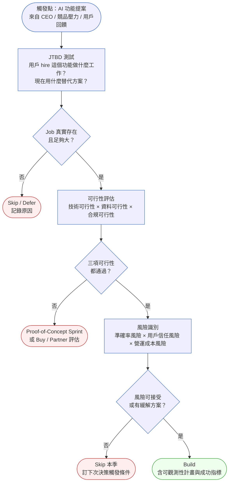
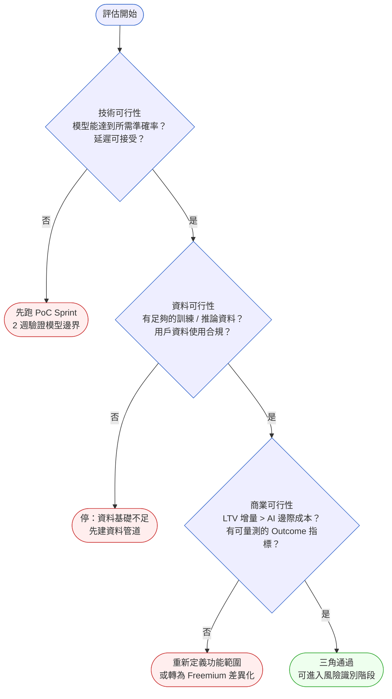
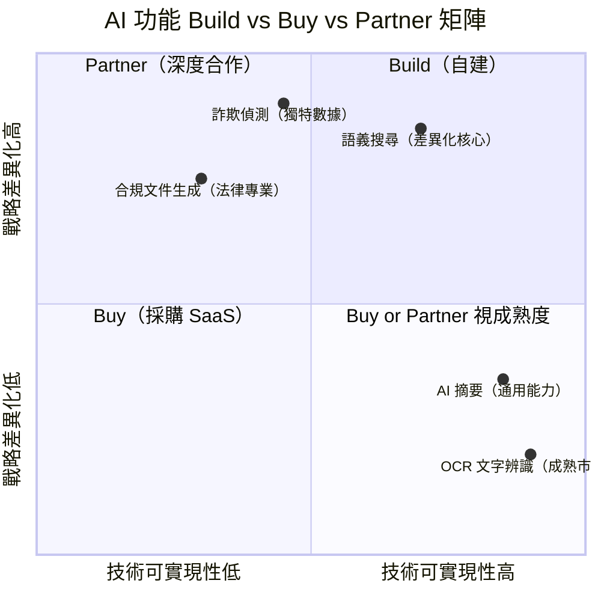

# 第 39 章 | AI 功能的產品決策：怎麼決定做不做

> **前置閱讀**：[Ch 10 Jobs-to-be-Done：需求背後的需求](../part-02-discovery/ch-10-jtbd.md)
> **前置閱讀**：[Ch 29 Build vs Buy vs Partner：邊界決策框架](../part-05-decisions/ch-29-build-buy-partner.md)
> **下游章節**：[Ch 40 LLM-Powered Products：PM 的技術理解底線](./ch-40-llm-product-pm.md)
> **下游章節**：[Ch 41 AI Ethics & Trust：負責任的 PM 判斷](./ch-41-ai-ethics-trust.md)
> **SA/SD 對照**：[SA/SD 第 37 章 AI-Native 架構](../../book/part-07-ai-era/ch-37-ai-native-architecture.md)
> ⸺ SA 視角關注 AI 元件的技術邊界與可觀測性；本章關注 AI 功能的 PM 決策觸發條件與商業正當性。

---

## §39.1 冷觀察

2025 年 Q1，Notewise 上線「AI 摘要」三週後，PM 林映涵在 Slack 頻道裡看到一條訊息：

> 「使用率數字出來了。DAU 開啟 AI 摘要的比例：2.1%。」

沒有人回應那條訊息。

Notewise 是一款多租戶筆記 SaaS（CASE-SAS-103），主要客群是中型企業的知識型工作者。2024 年底，GPT-4o 上線的消息讓競品紛紛推出「AI 功能」，Notewise 的 CEO 在一次全員會議上說了一句話：「我們也要有 AI。」兩週後，林映涵的 roadmap 被清空了一個 sprint，騰出空間給「AI 摘要功能」。

開發過程很順。三個工程師花了六週，接上 OpenAI API，做出一個可以對長筆記產生三段式摘要的介面。設計師做了一個乾淨的 UI，QA 測試了三種長度的筆記，PM 寫了上線公告，市場把「AI 摘要」放進了 Product Hunt 的貼文。

上線那天，官方 Twitter 轉發量是歷史第三名。

三個月後，DAU 使用率 2.1%，付費轉換率比前一季**低了 0.4 個百分點**。

事後訪談裡，有個用戶說了一句話，林映涵把它存在備忘錄裡：

> 「我的問題不是讀不懂筆記。是找不到筆記。」

那條訊息下面，林映涵什麼都沒回。

---

## §39.2 真問題

把它拆開來看，Notewise 的 AI 摘要不是執行出了錯，而是決策本身就沒有紮根。

### 表面需求（What）

「我們要有 AI 功能。」這是 CEO 說的話，也是林映涵聽到的需求。對應的 Output 很清楚：一個能夠摘要筆記的 AI 介面，接上 LLM API，用戶點擊即可使用。

這條需求完成了。

### 業務目標（Why）

Notewise 在 2024 年面臨的真正業務壓力是：試用轉付費的轉換率從 18% 滑落到 14%。流失訪談裡出現最多的詞是「太亂了」——工作區裡有幾百份筆記，找不到想要的。

換句話說，想移動的 Outcome 是「提高轉換率」，想改善的 Impact 是「降低因組織混亂導致的早期流失」。

AI 摘要解決的是什麼問題？**讀懂筆記**。

但掉落的用戶流失的原因是**找不到筆記**。

Outputs 完成了，Outcomes 沒有動，Impact 反而稍微惡化。這不是工程問題，也不是設計問題。這是決策時沒有做 [Jobs-to-be-Done（JTBD）](../part-02-discovery/ch-10-jtbd.md) 測試——沒有確認「AI 摘要」是否對應到用戶真正在 hire 的工作（Job）。

### 決策瓶頸（Who × When）

這件事裡，最關鍵的問題不是「AI 摘要好不好」，而是：**誰有責任在開始開發之前確認這個功能對應真實的 Job？什麼時候應該做這個確認？**

在 Notewise 的這次決策裡，沒有人明確擁有「功能正當性驗證」這個步驟。CEO 提出方向，PM 直接排入 roadmap，沒有一個正式的決策閘門（decision gate）去回答「這個功能對應的 Job 是什麼？用戶現在卡住的是哪個步驟？」。

用 DACI 模型拆解這個應有的決策過程：

| 角色 | 人 | 責任 |
|------|-----|------|
| **D Driver** | PM（林映涵） | 推動 JTBD 測試與可行性評估，確保決策有根據再排入 sprint |
| **A Approver** | CEO / 產品委員會 | 基於評估結果拍板：Build、Skip，或先做 Discovery Sprint |
| **C Contributor** | Engineering、Design、Data | 提供技術可行性、設計方向、歷史數據輸入 |
| **I Informed** | Marketing、Sales、Customer Success | 上線後才需要知道結果，不參與 Build/Skip 決策 |

問題在於，這次決策直接跳過了 D 的職責——JTBD 測試從未發生，Driver 直接成了「功能協調者」，而不是「決策驗證者」。

這才是真正在處理的問題：**AI 功能的吸引力，讓決策流程跳過了最基本的需求驗證閘門。**

---

## §39.3 決策框架

### 圖 A ── AI 功能決策工作流程



這張圖有四個關鍵閘門。每一個閘門的「否」出口都是正當的決策，不是失敗。Skip 是一個完整的決策結果，不是拖延。

---

### §39.3.1 AI 功能的 JTBD 訪談方法

AI 功能的 JTBD 訪談有一個特殊挑戰：**用戶通常不知道 AI 能做什麼，所以無法自發說出「AI 相關的 Job」。** 直接問「你希望 AI 幫你做什麼？」等同於問用戶一個他沒有參考系的問題，得到的答案偏向科幻場景或對竟品的模仿。

解法是**先給錨點，再問 Job**：

**Step 1：展示 3–5 個可比較的 AI 功能示範影片（各 60–90 秒）**

選不同方向的示範：語義搜尋、自動摘要、智慧標籤、語音轉文字。目的不是讓用戶選功能，而是讓他們有足夠的技術具象感，能夠開始想像自己的工作場景。

**Step 2：問「哪一個讓你想到你工作中卡住的地方？」**

不要問「你喜歡哪個？」——那是偏好調查，不是 JTBD 訪談。問「卡住的地方」，引導用戶說出替代方案和工作流痛點。

**Step 3：追問 Job 的前後情境**

- 「那個卡住的時刻，通常在什麼情況下發生？」
- 「你現在怎麼解決這個問題？」（**現有替代方案是最重要的問題**）
- 「如果這個問題消失了，你的工作會有什麼不同？」

**Step 4：確認 Job 的大小**

- 「這種情況多常發生？」（頻率）
- 「上次發生是什麼時候？」（真實性驗證——如果說不出上一次，Job 可能不夠真實）
- 「你有多認真試著解決它？」（意願強度）

**常見陷阱**：如果用戶說「AI 摘要聽起來很方便」，追問「你上一次需要摘要一篇文件是什麼時候？你怎麼做的？」才能判斷這是真實的 Job 還是禮貌性的附和。

---

### §39.3.2 Failure Mode 嚴重度分級框架

準確率要求不能憑感覺設定。**Failure Mode 的業務嚴重度決定所需準確率，不是反過來。**

| 嚴重度等級 | 定義 | 用戶處境 | 最低準確率要求 | 典型場景 |
|---|---|---|---|---|
| **Silent（靜默錯誤）** | 用戶未察覺錯誤發生 | AI 輸出被用戶直接信任並行動 | ≥ 95% | 自動填寫表單、財務彙整、合規摘要 |
| **Obvious（可見錯誤）** | 用戶察覺錯誤，有替代方案 | 用戶回到原始資料確認，重新操作 | ≥ 85% | 文件摘要、會議記錄、電子郵件草稿 |
| **Cosmetic（表面錯誤）** | 錯誤影響觀感但不影響決策 | 用戶修改後繼續使用 | ≥ 75% | 標題建議、標籤推薦、格式轉換 |

**如何判斷你的功能屬於哪個等級？**

問一個問題：「如果 AI 給出錯誤答案，用戶在採取行動之前，有沒有辦法發現？」

- **沒有辦法發現** → Silent 等級，需要 95%+ 準確率或強制人工確認閘門
- **通常會發現** → Obvious 等級，需要 85%+ 準確率和明確的「AI 生成」標示
- **不影響決策** → Cosmetic 等級，75%+ 準確率可接受，但需要持續監控準確率趨勢

**Notewise 案例應用**：AI 摘要遺漏「明天 9 點的會議決議」，用戶拿著錯誤摘要去開會——這是 Obvious 等級（用戶通常會在會議前翻原文確認），所以準確率門檻是 85%，而非隨意設定的 80%。PoC 的 81% 在閾值邊緣，需要進一步驗證，不能直接宣布「技術可行」。

---

### §39.3.3 成本建模速查框架

AI 功能的邊際成本計算不需要等工程師，PM 用三個數字就能做出初步估算：

**基本公式**

```
月度 P50 AI 成本 = API 單位成本（vendor docs）× P50 每用戶月均使用量（analytics）× MAU
月度 P90 AI 成本 ≈ P50 × 3（早期採用期的經驗法則；每月重新評估）
```

**P90 倍數說明**：在功能上線初期，重度用戶（Top 10%）的使用量通常是中位用戶的 3–6 倍。用 P50 × 3 作為 P90 估算是保守的起始點；上線後四週取實際 P90 數字替換。

**LTV 合理性閘門**

```
月度 AI 成本 × 12 ÷ 客戶 LTV（月數）≤ 可接受成本佔比
```

例：Notewise Enterprise 方案 LTV 為 24 個月 × $200/月 = $4,800。如果 AI 摘要年度成本為 $480/客戶，佔 LTV 的 10%，在 SaaS 標準下接近上限，需要限流設計或將 AI 功能設為 Add-on。

**常見 AI API 成本單位換算參考**

| 功能類型 | 計費單位 | P50 估算起點 |
|---|---|---|
| 文字摘要（GPT-4o 級） | $0.002–0.005 / 1K tokens | 每次操作約 1–3K tokens |
| 語義搜尋（embedding） | $0.0001 / 1K tokens | 每次查詢約 0.1K tokens |
| 語音轉文字（Whisper 級） | $0.006 / 分鐘 | 按錄音長度計 |

**注意**：以上數字為 2025 年 mid-market 參考範圍，以各廠商最新定價頁為準。不要在決策卡裡寫死數字，寫來源和計算日期。

---

### §39.3.4 Outcome 指標選擇指引（依產品類型）

「我們要量什麼？」是決策卡最常填不出來的欄位。以下依產品類型提供起始選項——這不是唯一答案，而是避免 PM 用通用 KPI（DAU、PV）替代真正與 Job 連結的指標。

| 產品類型 | AI 功能方向 | 推薦 Outcome 指標 | 不建議的替代指標（為什麼錯） |
|---|---|---|---|
| 知識管理工具 | 摘要、整理 | 14 日留存率；筆記被「引用」到其他文件的比率 | AI 功能使用次數（頻繁使用不等於留存） |
| 搜尋 / 探索型產品 | 語義搜尋、推薦 | 查詢後 30 秒內的點擊率；查詢重新輸入率（越低越好） | 搜尋次數（次數高可能代表功能失敗，用戶找不到） |
| 寫作 / 創作工具 | 草稿生成、潤稿 | AI 輔助內容的「發佈率」（用戶寫完後真的發出去）| 草稿生成次數（生成後刪除等同無效） |
| 分析 / BI 工具 | AI 洞察、自動圖表 | 「基於 AI 洞察做決策」的自我回報率（問卷）；洞察被分享出去的比率 | Dashboard 瀏覽量（沒有行動的分析無商業價值） |
| 客服 / 溝通工具 | 自動回覆草稿 | 客服接受 AI 草稿且未修改的比率；平均處理時間縮短 | AI 草稿生成次數 |

**選指標的三個問題**：
1. 這個指標能分辨「AI 功能幫到忙」和「用戶只是偶然點進來」嗎？
2. 這個指標會因為 Job 被完成而上升嗎？
3. 這個指標和 North Star Metric 有因果連結（不只是相關）嗎？

三個都是「是」才算選好了。

---

### 圖 B ── AI 功能可行性三角決策樹



三角裡缺一角就進 Skip 或 Defer 流程，不是因為工程師說不行，而是因為 PM 無法定義 Outcome 指標。

---

### §39.3.5 Build vs. Buy vs. Partner：AI 功能的邊界決策

Ch 29 提供了通用的三邊決策框架；AI 功能有一個額外維度需要考量：**技術成熟度曲線的位置**。



**決策規則**：

| 象限 | 條件 | 推薦路徑 | 典型例子 |
|---|---|---|---|
| **Build** | 高戰略差異化 + 技術可達成 | 自建，視為核心競爭力 | 獨特數據集上的推薦系統 |
| **Partner** | 高戰略差異化 + 技術門檻高 | 找有互補能力的夥伴，共同開發 | 醫療 AI 診斷（需要臨床數據夥伴） |
| **Buy** | 低差異化 + 市場已有成熟方案 | 採購 SaaS API，快速整合 | OCR、語音轉文字、通用翻譯 |
| **Watch** | 低差異化 + 技術不穩定 | 等待技術成熟，不優先投資 | 多模態推理（2024 年仍在快速演進） |

**Notewise 應用**：AI 摘要屬於「低差異化 + 技術成熟」→ Buy 路徑。直接整合 OpenAI API 是對的；錯在沒有先做 JTBD 測試確認 Job 是否存在。技術路徑選對了，決策次序顛倒了。

---

### AI 功能決策表

| 情境 / 觸發條件 | 推薦做法 | PM 關注點 | 常見錯誤 |
|---|---|---|---|
| CEO 說「我們要有 AI」，無具體場景 | 先做 JTBD 訪談（3–5 人），確認 Job | 訪談中找「現在用什麼替代品？」而非「你想不想要 AI 功能？」 | 直接排入 sprint，把 CEO 的話當需求 |
| 競品推出類似 AI 功能 | 分析競品的 Outcome 數據（App Store 評論、留存訊號），而非複製功能清單 | 競品的用戶和你的用戶 Job 一樣嗎？ | 假設競品做了就代表用戶需要 |
| 用戶訪談中有人說「希望有 AI」 | 追問 Job：「你希望 AI 幫你做什麼工作？現在卡在哪？」 | 用戶說的是 Output 還是 Job？ | 把「希望有 AI」當作驗證好的需求 |
| LLM API 成本高於預估 | 分析 P90 使用情境，考慮限流或分層定價 | 邊際成本是否影響 LTV？ | 以為成本會隨規模下降而不計算 |
| 準確率低於可接受閾值 | 依 Failure Mode 嚴重度分級定義所需準確率（見 §39.3.2） | 用戶對「AI 犯錯」的容忍度因場景而異 | 以準確率 80% 代表「可接受」 |
| 上線後使用率低 | 做質性訪談，問「你知道這功能嗎？」「試過嗎？為什麼沒繼續用？」 | 區分「不知道」vs「試過但不合用」vs「合用但習慣未建立」 | 僅看 DAU 數字，直接砍功能 |

### If-Then 框架：AI 功能評分矩陣決策

在進入正式 sprint 規劃前，用這個矩陣對功能做快速評分。每個維度 1–3 分，總分低於 9 的功能進 Discovery Sprint 而非 Build Sprint。

| 評估維度 | 評分標準 | 1 分 | 2 分 | 3 分 |
|---|---|---|---|---|
| **Job 真實性** | 有多少用戶訪談/行為數據支持這個 Job？ | 無訪談，僅假設 | 1–2 筆訪談，偏向意願調查 | ≥3 筆訪談，明確描述現有替代方案 |
| **技術可行性** | PoC 或現有模型能達到業務需求的準確率？ | 無 PoC，未知 | PoC 完成但準確率邊緣 | PoC 通過，準確率有 buffer |
| **Outcome 可測性** | 有可追蹤的 Outcome 指標，且與 [North Star Metric（北極星指標）](../part-06-metrics/ch-34-north-star.md) 連結？ | 只有 Output 指標（使用次數）| 有 Outcome 指標但與 North Star Metric 無直接連結 | Outcome 指標明確，和轉換率 / 留存直接連結 |
| **成本合理性** | 在目標規模下，AI 邊際成本是否可接受？ | 未計算 | 估算過但誤差大 | 計算過 P50/P90 成本，有定價或限流方案 |

- **If** 總分 ≥ 10 → **Then** 直接進 Build Sprint，含可觀測性計畫。
- **If** 總分 7–9 → **Then** 先跑 2 週 Discovery Sprint，補足最低分維度。
- **If** 總分 ≤ 6 → **Then** Skip 本季，明訂下次評估觸發條件（通常是訪談數量或競品 Outcome 數據）。
- **If** 任一單一維度得 1 分（不論總分）→ **Then** 將該維度列為 Discovery Sprint 首要任務，未補足前不進 Build Sprint。

Notewise 的 AI 摘要功能，套這個矩陣會得到：Job 真實性 1 分、技術可行性 2 分、Outcome 可測性 1 分、成本合理性 1 分，總分 5 分。正確路徑是先做 Discovery Sprint，而不是直接 Build。

---

## §39.4 踩坑清單

### 反模式：競品跟進（Competitive Copycat）

**現象**：看到競品推出 AI 功能，兩週內就排入 sprint。

**根因**：把「競品做了」當作需求驗證，跳過 JTBD 測試。競品的用戶群和你的可能在同一個市場，但 Job 可能完全不同。

> **修正方向**：先挖競品的 App Store 評論、Reddit 討論、用戶 Twitter，看用戶對那個功能的真實反應——特別是負面評論，那裡藏著 Job 未被滿足的線索。如果競品用戶也在抱怨同一個問題，代表需求是真的；如果用戶只是在讚美「感覺很科技」，那個 Job 可能沒有你以為的那麼大。

---

### 反模式：Job 假設偏誤（Job Assumption Bias）

**現象**：訪談設計直接問「如果我們加入 AI 功能，你會用嗎？」，用戶點頭，PM 記錄為「需求驗證通過」。

**根因**：用戶在沒有技術參考框架的情況下，無法對「AI 功能」做出有意義的判斷。他們回答的是「AI」這個詞帶來的聯想，不是自己的真實 Job。

> **修正方向**：使用 §39.3.1 的 AI JTBD 訪談方法——先展示 3–5 個具體的 AI 功能示範影片，讓用戶有技術錨點，再問「哪一個讓你想到你工作中卡住的地方？」這樣收到的是場景，不是期望值。

---

### 反模式：準確率滿足感（Accuracy Theater）

**現象**：PoC 達到 80% 準確率，PM 在會議上宣佈「技術可行」，然後直接排入 Build Sprint。

**根因**：準確率是技術指標，不是業務指標。對於不同的 AI 功能，「錯一次」的代價完全不同——AI 摘要錯了，用戶最多重讀原文；AI 醫療建議錯了，代價無法接受。PM 需要先確認 Failure Mode 嚴重度（見 §39.3.2），才能判斷 80% 是否足夠。

> **修正方向**：在 PoC 評估裡加入一欄：「如果這個功能犯錯，用戶會怎樣（用 §39.3.2 的分級定義）？」依照嚴重度等級設定準確率門檻，而不是用一個固定的閾值。

---

### 反模式：Output 慶典（Output Celebration）

**現象**：AI 功能上線後，PM 在週報裡匯報「功能已上線、X 萬次呼叫」，沒有追蹤 Outcome。

**根因**：Output 指標（API 呼叫次數、頁面瀏覽）比 Outcome 指標（轉換率、留存率、JTBD 完成率）容易取得。在 AI 功能的早期，Outcome 訊號通常需要幾週才能浮現，容易被月會節奏的 Output 數字淹沒。

> **修正方向**：在功能上線計畫裡，預先定義兩個指標：一個 Output 指標（作為使用信號）和一個 Outcome 指標（作為決策指標）。如果四週後 Outcome 指標沒有移動，啟動質性訪談，不要等到季度 review 才發現問題。

---

### 反模式：AI 免責牌（AI Disclaimer Shield）

**現象**：「反正是 AI 生成的，使用者知道不準確」，用這句話為低品質的輸出辯護。

**根因**：Disclaimer 降低的是法律風險，不是用戶體驗損耗。用戶在碰到幾次低品質 AI 輸出後，會形成「AI 功能不可信」的心智模型，這個印象一旦形成，很難靠後續改善抹除。

> **修正方向**：在功能設計早期定義「可接受的最差輸出」（Minimum Acceptable Quality），而不是在上線後用 Disclaimer 收尾。如果無法定義 MAQ，這個功能還沒有準備好上線。

---

### 反模式：一次決策定終身（One-Shot Build）

**現象**：Sprint 規劃時決定 Build，之後沒有設定任何「持續決策」觸發點，功能做完就算交付完成。

**根因**：PM 把 Build/Skip 當作一次性的閘門，而不是持續更新的判斷。AI 功能的技術成本、準確率、用戶行為都在快速變化，六個月前成立的 Build 決策，可能因為 LLM 成本上漲或用戶行為改變而失去正當性。

> **修正方向**：在 Build 決策旁邊訂一個「下次評估日期」和「評估觸發條件」。例如：「上線後 8 週，如果 14 日留存率未達 +3 個百分點目標，啟動 Skip or Pivot 評估；如果 P90 成本超過預估 50%，立即觸發定價或限流評估。」這樣 Build 決策才是活的，不是一次定案。

---

## §39.5 交付清單 ⸺ 一頁式 AI 功能決策卡模板

這張卡的用途是在 AI 功能進入 Sprint 前，讓 PM 和 Approver 共同確認「我們有沒有足夠的根據往下走」。一張填完的卡，等於一次結構化的 Go/No-go 決策記錄。

````markdown
# AI 功能決策卡
> 版本:v0.1 | 撰寫日期:YYYY-MM-DD | 擁有人:{名字}
功能名稱：{功能名稱}   PM：{姓名}

─────────────────────────────────────────────────
1. JTBD 測試
─────────────────────────────────────────────────
用戶的 Job：{用戶在做什麼工作時會 hire 這個功能？}
現有替代方案：{用戶現在用什麼方法完成這個 Job？}
訪談方法：[ ] 直接訪談  [ ] AI 示範影片 + 場景追問（建議用於 AI 功能）
訪談數量：{N} 筆    訪談日期：{YYYY-MM-DD}
Job 驗證結論：[ ] 真實存在且夠大  [ ] 存在但不夠大  [ ] 無法確認

─────────────────────────────────────────────────
2. 可行性評估（含成本建模）
─────────────────────────────────────────────────
技術可行性：[ ] 通過  [ ] 需要 PoC   說明：{說明}
資料可行性：[ ] 通過  [ ] 需要補建   說明：{說明}
合規 / 隱私：[ ] 通過  [ ] 需要 Legal review  說明：{說明}

成本建模（見 §39.3.3 公式）：
  API 單位成本：{$X / 單位}   來源：{vendor 定價頁 + 日期}
  P50 月均使用量（每用戶）：{N 次}   來源：{數據來源}
  月度 P50 成本（@MAU）：{$X}
  月度 P90 估算（P50 × 3）：{$X}
  LTV 成本佔比：{X%}（目標 < {Y%}）
  Build vs Buy 路徑：[ ] Build  [ ] Buy  [ ] Partner  理由：{理由}

─────────────────────────────────────────────────
3. 風險識別
─────────────────────────────────────────────────
Failure Mode：{如果功能犯錯，用戶會發生什麼？}
嚴重度等級：[ ] Cosmetic（≥75%）  [ ] Obvious（≥85%）  [ ] Silent（≥95%）
準確率要求：{X%}  現有 PoC 準確率：{Y%}  差距：{Z%}
信任風險：[ ] 低（犯錯無重大後果）[ ] 中  [ ] 高（需 MAQ 閘門）
MAQ（Minimum Acceptable Quality）：{定義最差可接受輸出的具體描述}
營運成本風險：[ ] 可接受  [ ] 需定價方案  [ ] 需限流設計

─────────────────────────────────────────────────
4. Outcome 指標定義
─────────────────────────────────────────────────
產品類型：[ ] 知識管理  [ ] 搜尋/探索  [ ] 寫作/創作  [ ] 分析/BI  [ ] 其他
目標 Outcome：{你想改善的用戶行為是什麼？}
衡量指標：{指標名稱}（參考 §39.3.4 依產品類型建議）
目標值：{數字}  基準線：{現況數字}  時間框：{N 週}
North Star Metric 連結：{這個指標如何影響 North Star Metric？}

─────────────────────────────────────────────────
5. 評分矩陣
─────────────────────────────────────────────────
Job 真實性：{1/2/3}  技術可行性：{1/2/3}
Outcome 可測性：{1/2/3}  成本合理性：{1/2/3}
總分：{N}/12

─────────────────────────────────────────────────
6. 決策
─────────────────────────────────────────────────
決策：[ ] Build Sprint  [ ] Discovery Sprint  [ ] Skip / Defer
批准者（Approver）：{姓名}  批准日期：{YYYY-MM-DD}
DACI：D={姓名}  A={姓名}  C={名單}  I={名單}

─────────────────────────────────────────────────
7. 再評估觸發計畫（Build Sprint 專用）
─────────────────────────────────────────────────
定期複查日期：上線後第 {4} 週、第 {8} 週
觸發條件（任一成立即啟動 Pivot 評估）：
  [ ] Outcome 指標 < 目標值 {X%} at 第 {8} 週
  [ ] P90 AI 成本超過預估 {50%}
  [ ] 競品重大功能更新（定義：{條件}）
  [ ] Failure Mode 發生頻率 > {Z%}（監控方式：{方式}）
再評估決策負責人：{姓名}
````

把它存在 `docs/product-decisions/ai-features/`，跟程式碼同 repo，跟 README 同層。

這張卡設計成一頁可列印、一次決策會議可填完的格式。第 1–3 段在 Build 決策前填完；第 4–6 段在決策會議現場填完並取得 Approver 簽核；第 7 段在 Build Sprint 啟動時填完，確保決策不是一次性閘門。如果任何一段填不完，說明決策還沒有準備好。

### §39.5.1 範例：Notewise AI 摘要功能決策重演

如果 Notewise 在 2024 年 Q4 決定開發 AI 摘要前，林映涵用了這張卡，決策結果會不同。以下是重演版本，扣回 §39.1 的場景：

````markdown
# AI 功能決策卡
<!-- 為什麼有這張卡：Notewise 的教訓是決策在沒有驗證的情況下開始；
     這張卡的每一段都是一個「往下走前必須能填出答案」的閘門。 -->
> 版本:v0.1 | 撰寫日期:2024-11-15 | 擁有人:林映涵（PM）
功能名稱：AI 摘要   PM：林映涵

─────────────────────────────────────────────────
1. JTBD 測試
─────────────────────────────────────────────────
用戶的 Job：整理一天結束後的工作筆記，把重點帶進明天的會議
<!-- 為什麼這欄：這是 Job 的核心；填不出這句，後面所有設計決策都在猜。 -->
現有替代方案：手動複製關鍵段落到新筆記；用 Ctrl+F 搜尋關鍵字
訪談方法：[x] AI 示範影片 + 場景追問
  （展示影片：語義搜尋、自動摘要、智慧標籤各一段）
訪談數量：3 筆    訪談日期：2024-11-10
Job 驗證結論：[ ] 真實存在且夠大  [x] 存在但不夠大  [ ] 無法確認

備註：展示三段影片後，受訪者第一個提到的場景是「找不到筆記」（語義搜尋影片）。
      AI 摘要影片沒有引發強烈場景回憶。
      三位受訪者中，兩位說「最大的問題是找不到三週前的筆記」，
      一位說「讀摘要沒用，我需要直接搜到那一段原文」。
      AI 摘要 Job 存在，但不是最痛的 Job。
→ 建議方向：語義搜尋 PoC 優先；AI 摘要延後。

─────────────────────────────────────────────────
2. 可行性評估（含成本建模）
─────────────────────────────────────────────────
技術可行性：[x] 通過   說明：GPT-4o API 已驗證，延遲 P90 < 3s
資料可行性：[x] 通過   說明：用戶授權使用筆記內容已在 ToS 中
合規 / 隱私：[ ] 通過  [x] 需要 Legal review
  說明：企業客戶（Enterprise tier）有資料不出境要求，需確認

成本建模：
  API 單位成本：$0.005 / 1K tokens（GPT-4o，2024-11 定價頁）
  P50 月均使用量：每用戶 20 次摘要 × 2K tokens / 次 = 40K tokens
  月度 P50 成本（@2,000 MAU）：$0.005 × 40K × 2,000 = $400
  月度 P90 估算（P50 × 3）：$1,200
  Enterprise LTV：24 個月 × $200/月 = $4,800 / 客戶
  年度 AI 成本 / 客戶：$1,200 × 12 / 2,000 客戶 = $7.2
  LTV 成本佔比：$7.2 / $4,800 = 0.15%（低，但需 Enterprise 限流確認）
  Build vs Buy 路徑：[x] Buy（AI 摘要屬通用能力，戰略差異化低）

─────────────────────────────────────────────────
3. 風險識別
─────────────────────────────────────────────────
Failure Mode：摘要遺漏關鍵決議，用戶在會議中用錯資訊，造成信任損失
嚴重度等級：[ ] Cosmetic  [x] Obvious（用戶通常在會議前翻原文確認）
準確率要求：85%（Obvious 等級標準）  現有 PoC 準確率：81%  差距：4%
<!-- 為什麼這欄：81% 接近但未達 85% 門檻；上線前需再跑一輪 PoC 改善。 -->
信任風險：[ ] 低  [x] 中（遺漏關鍵資訊有業務後果）  [ ] 高
MAQ：「每段摘要不得遺漏含時間或人名的行動項目；
     可接受的最差輸出：摘要措辭不精確，但關鍵決議和行動項目完整。」
營運成本風險：[x] 需限流設計（Enterprise 用量無上限時成本不可控）

─────────────────────────────────────────────────
4. Outcome 指標定義
─────────────────────────────────────────────────
產品類型：[x] 知識管理
目標 Outcome：試用期第 2 週的知識型工作者留存率提升
衡量指標：14 日留存率（知識管理工具首選指標，見 §39.3.4）
目標值：+3 個百分點   基準線：32%   時間框：上線後 8 週
North Star Metric 連結：14 日留存 → 付費轉換率（Notewise North Star Metric）

─────────────────────────────────────────────────
5. 評分矩陣
─────────────────────────────────────────────────
Job 真實性：1（僅 3 筆訪談，Job 不是最痛點）
技術可行性：2（技術通過，但準確率未達 Obvious 等級 85% 門檻）
Outcome 可測性：3（指標明確，與 North Star Metric 直連）
成本合理性：2（P90 成本可接受，但需限流方案才確認）
總分：8/12

─────────────────────────────────────────────────
6. 決策
─────────────────────────────────────────────────
決策：[ ] Build Sprint  [x] Discovery Sprint  [ ] Skip / Defer
<!-- 為什麼這欄：8 分進 Discovery Sprint，不是 Skip；目標是補足 Job 真實性
     和準確率兩個弱項，Discovery Sprint 2 週後重新評分。 -->
批准者（Approver）：張宇（CTO）  批准日期：2024-11-18
DACI：D=林映涵（PM）  A=張宇（CTO）  C=工程師、設計師、Legal
      I=CEO、Marketing、Sales

─────────────────────────────────────────────────
7. 再評估觸發計畫（假設 Discovery Sprint 後進入 Build）
─────────────────────────────────────────────────
定期複查日期：上線後第 4 週、第 8 週
觸發條件（任一成立即啟動 Pivot 評估）：
  [x] 14 日留存率 < +3 個百分點 at 第 8 週
  [x] P90 AI 成本超過預估 50%（> $1,800/月）
  [x] Failure Mode（遺漏行動項目）頻率 > 5%（監控：用戶標記「摘要有誤」按鈕）
再評估決策負責人：林映涵（PM）
````

如果那個週五林映涵帶著這張卡進決策會議：AI 摘要功能會先進 Discovery Sprint；JTBD 訪談顯示語義搜尋是更大的 Job；2024 Q4 的 sprint 容量可能轉向語義搜尋 PoC。三個月後的數字，可能不一樣。

---

## §39.6 Recap

讀完本章，應該已經能做到：

- [ ] 在 AI 功能提案進入 sprint 前，完成 JTBD 測試——使用 AI 示範影片給用戶技術錨點，再問「哪個讓你想到你工作中卡住的地方」，而不是直接問「你想不想要 AI 功能」
- [ ] 依 Failure Mode 嚴重度（Cosmetic / Obvious / Silent）決定所需準確率，而不是用固定閾值評判技術可行性
- [ ] 用 §39.3.3 的三步公式估算 P50/P90 AI 成本，並和客戶 LTV 做合理性比對，在決策前算清楚
- [ ] 依產品類型選擇正確的 Outcome 指標（知識管理用 14 日留存；搜尋用查詢重新輸入率；寫作用發佈率），而不是用 DAU 或 API 呼叫次數替代
- [ ] 用 Build vs. Buy vs. Partner 矩陣（戰略差異化 × 技術可達性）決定 AI 功能的技術路徑，在決策卡裡記錄理由
- [ ] 在 Build 決策旁邊同時填完第 7 段——定義 Outcome 指標觸發條件、成本超額觸發條件、Failure Mode 頻率觸發條件，讓決策保持活的
- [ ] 用 DACI 明確指派「誰是 Approver」，確保 AI 功能的商業正當性由有決策權的人確認，而不是在 CEO 的一句話後默默消化

Notewise 的教訓不是「AI 功能做不得」，而是「沒有根的決策，做任何功能都會得到一樣的結果」。用這張決策卡跑一次，填不出來的欄位，就是你現在最需要補的那塊。

---

## Cross-References

- **前置章節**：[Ch 10 Jobs-to-be-Done：需求背後的需求](../part-02-discovery/ch-10-jtbd.md) ⸺ JTBD 框架的完整方法論基礎，本章的 JTBD 測試閘門建立在這章上
- **前置章節**：[Ch 29 Build vs Buy vs Partner：邊界決策框架](../part-05-decisions/ch-29-build-buy-partner.md) ⸺ §39.3.5 的 AI 功能三邊決策矩陣是這章的 AI 延伸版
- **下游章節**：[Ch 40 LLM-Powered Products：PM 的技術理解底線](./ch-40-llm-product-pm.md) ⸺ 通過 Build 決策後，PM 需要理解的 LLM 技術邊界
- **下游章節**：[Ch 41 AI Ethics & Trust：負責任的 PM 判斷](./ch-41-ai-ethics-trust.md) ⸺ 風險識別中信任風險和 Failure Mode 的倫理延伸
- **指標章節**：[Ch 34 North Star Metric：選對唯一重要的指標](../part-06-metrics/ch-34-north-star.md) ⸺ Outcome 指標與 North Star 連結的方法論
- **SA/SD 對照**：[SA/SD 第 37 章 AI-Native 架構](../../book/part-07-ai-era/ch-37-ai-native-architecture.md) ⸺ SA 視角關注 AI 元件的技術邊界（準確率 SLO、延遲預算、觀測性）；本章關注技術可行性背後的 PM 決策觸發條件
- **SA/SD 對照**：[SA/SD 第 45 章 AI 系統的 Eval、Drift 與 Red Team](../../book/part-07-ai-era/ch-45-ai-eval-drift-redteam.md) ⸺ SA 設計 AI 評估管道；PM 在本章定義的準確率要求和 MAQ，是那個管道的業務輸入

<!-- PROPOSED-REFS
cases:
  - id: CASE-SAS-103
    title: "Notewise 的 AI 功能泡沫：GPT 包裝上線後的沉默"
    domain: saas
    chapters: [ch-39]
    summary: |
      虛構筆記 SaaS Notewise：PM 林映涵在 GPT-4o 上線熱潮中快速推出「AI 摘要」，
      3 個月後 DAU 使用率 2%，付費轉換無改善。
      事後訪談發現：使用者的痛點是「找到筆記」，不是「讀懂筆記」。
      本章用此案例展示 JTBD 測試缺失、Output vs Outcome 混淆、以及
      AI 功能決策流程跳過驗證閘門的後果。
-->
