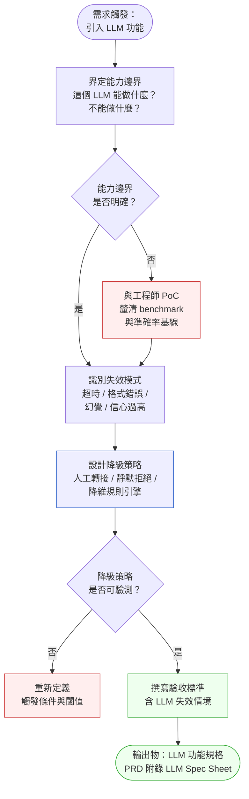
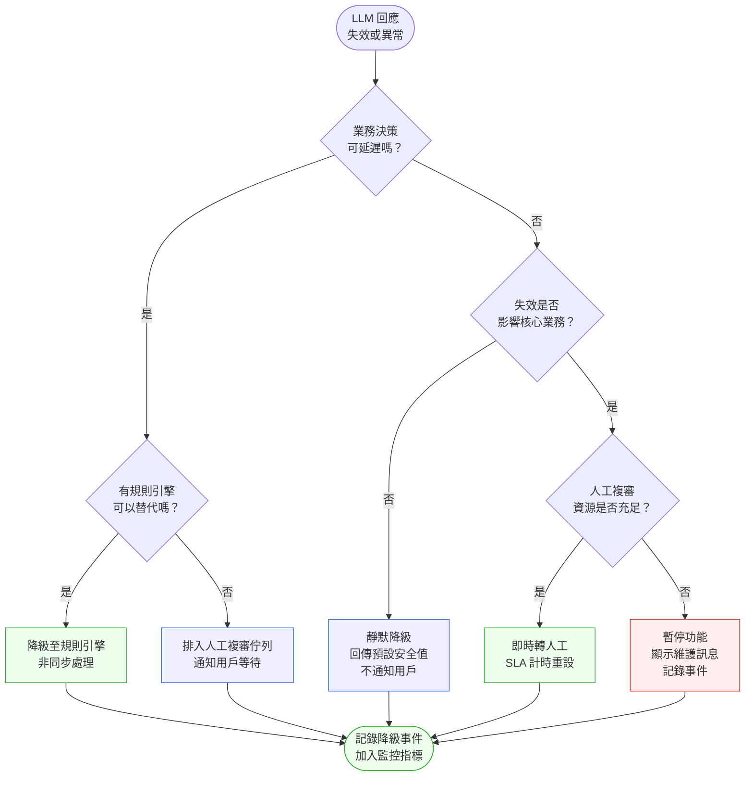

# 第 40 章 | LLM-Powered Products：PM 的技術理解底線

> **前置閱讀**：[Ch 39　AI 功能的產品決策：怎麼決定做不做](./ch-39-ai-feature-decisions.md)
> **下游章節**：[Ch 41　AI Ethics & Trust：負責任的 PM 判斷](./ch-41-ai-ethics-trust.md)
> **SA/SD 對照**：[SA/SD Ch 37 AI-Native 架構](../../book/part-07-ai-era/ch-37-ai-native-architecture.md)
> ⸺ SA 視角關注 LLM 的系統整合邊界與可靠性設計；本章關注 PM 面對非確定性系統時，哪些技術邊界必須親自理解，才能做出正確的 roadmap 決策與驗收判斷。

---

## §40.1 冷觀察

季度結束前兩週，FastLend 的 sprint review 氣氛異常安靜。

那個功能叫「AI 智能審批」。PM Vivian 在兩個月前把它列為本季最重要的里程碑：用 LLM 分析申請人的收入結構、消費模式、還款紀錄，給出核准建議，目標是把人工複審時間從 4 小時壓到 15 分鐘。工程師花了六週，串接了外部 LLM API、設計了 prompt 模板、上了 staging 環境測試。Vivian 在每次 stand-up 都看到進度更新，心裡有底。

上線那天，審批量正常。第二天，客服收到一批客訴：「你們系統說我通過了，我已經接受貸款條件，但後來又說要重新審查？」

調查結果讓人沉默。LLM API 的 upstream provider 那天從上午 10 點到下午 2 點斷斷續續超時，回應延遲超過 30 秒。工程師的 timeout 設定是 35 秒，剛好沒觸發例外。LLM 回傳了格式不完整的 JSON，解析層以靜默方式忽略失敗、預設填入「核准」。200 筆申請在那四個小時裡被錯誤批准。損失 320 萬元。

事後那場 post-mortem，技術主管問了一個問題，現場沒有人答得上來：

> 「PM 在規格裡有沒有定義，LLM 回應異常時應該怎麼辦？」

Vivian 翻了 PRD（Product Requirements Document，產品需求文件）。沒有降級策略。沒有異常處理描述。驗收標準只有「AI 審批時間 ≤ 15 分鐘」，沒有定義「LLM 不可用時，系統應該做什麼」。

那份 PRD 寫了 12 頁。裡面有 UI mockup、業務流程圖、KPI 目標。但在 LLM 這個最不確定的環節，沒有任何一行字說清楚：它壞掉的時候，誰負責，怎麼辦。

工程師沒有惡意。他們依照規格實作。規格裡沒有，他們就沒有做。

這不是技術失誤。這是 PM 的技術理解底線出了問題。

---

## §40.2 真問題

### 表面需求（What）

Vivian 要的是「把 LLM 加進審批流程、加快速度、降低人力成本」。

這是一個產品功能需求，看起來清晰，但在這個需求底下，有一層沒有被打開的假設：LLM 是可靠的。或者更精確地說：PM 沒有意識到，LLM 的可靠性與傳統 API 服務有本質差異。

傳統微服務掛掉，通常有明確的錯誤碼。LLM 掛掉的方式更多樣——超時、半截回應、格式正確但語義錯誤、信心度低但語氣篤定。如果 PM 在定義需求時，沒有把「LLM 的失效模式」當作設計輸入，整個規格就建立在一個脆弱的假設上。

### 業務目標（Why）

FastLend 真正想要的不是「AI 審批」，而是三件事的組合：
- **Speed**：壓縮審批週期，提升轉換率
- **Cost**：降低人工複審比例
- **Risk**：維持壞帳率在可接受範圍

問題在於，Vivian 的 PRD 和 OKR（Objectives and Key Results，目標與關鍵結果）只量了前兩個。壞帳率這個 Impact 指標，被設計成「季度後才評估」。

這是 Outputs / Outcomes / Impact 三角的典型斷裂：

| 層次 | FastLend 的量測 | 實際問題 |
|---|---|---|
| **Outputs** | AI 審批功能上線、審批時間 ≤ 15 分鐘 | 有量，但只量到功能存在 |
| **Outcomes** | 人工複審比例下降 | 有量，但沒有定義「AI 失效」如何計入 |
| **Impact** | 壞帳率、客訴率、信用損失 | 未納入本季 OKR，季後才看 |

事故發生後，Vivian 沒有辦法第一時間回答「影響有多大」，因為她沒有預先定義「AI 給出的核准算 Output 還是 Outcome」，也沒有定義「LLM 錯誤核准是計入 Outcome 失效還是系統故障」。

### 決策瓶頸（Who × When）

這個案子真正的決策瓶頸不是技術，而是責任邊界：**誰負責定義 LLM 的驗收標準？**

這個問題在上線前從來沒有被正式提出。工程師以為 PM 定義；PM 以為工程師處理；QA 按照 PM 的驗收標準測試（沒有 LLM 失效情境）。

DACI（Driver 推動者／Approver 核可者／Contributor 貢獻者／Informed 知會者，責任分配框架）結構應該是這樣的：

| 角色 | DACI | 負責事項 | FastLend 實際狀況 |
|---|---|---|---|
| PM（Vivian） | **Driver + Approver** | 定義 LLM 失效情境與降級策略 | 沒有定義，視為工程細節 |
| 工程師 | **Contributor** | 實作降級邏輯 | 等待規格，未主動提出 |
| QA | **Contributor** | 測試降級路徑 | 無測試案例，因為沒有規格 |
| 風控主管 | **Informed → 應為 Approver** | 確認異常核准的業務影響 | 未被納入設計評審 |

問題的核心在於：PM 不理解 LLM 系統的失效模式，所以不知道自己應該在規格裡定義什麼。理解底線的缺口，直接造成了決策責任的真空。

**本章要回答的是：PM 面對 LLM-powered 產品，哪幾件事必須親自理解、親自定義，不能交給工程師「自行處理」。**

---

## §40.3 決策框架

### 圖 A — LLM 產品規格工作流程

PM 處理 LLM 功能規格時，有一個固定的推進順序：先界定能力邊界，再識別失效模式，然後才能設計降級策略，最後定出可執行的驗收標準。跳過任何一步，後面的設計就會空懸。



### LLM 規格的四個必填欄位

工作流程的每個節點，對應 PM 規格文件裡必須填寫的四個欄位。現場常用的記憶方式是「**能力—失效—降級—驗收**」，缺一不可。

**① 能力邊界（Capability Boundary）**

LLM 不是全知的。PM 必須在規格裡明確寫出這個功能的 LLM 所做的事的範疇，以及它不該做的事。這個邊界決定了 prompt 設計的責任，也決定了工程師要測試哪些邊界情境。

FastLend 的 LLM 負責「給出核准建議」，但規格沒有寫清楚：LLM 的輸出是建議還是決定？人工是否必須確認？這個邊界不清，直接導致系統把「半截 JSON」當成有效輸出處理。

**② 失效模式（Failure Modes）**

LLM 的失效和傳統服務不同。PM 需要了解六種主要失效型態，並在規格裡逐一確認哪些是可接受的、哪些必須觸發降級：

| 失效類型 | 描述 | 對業務的影響 | 決策責任層 |
|---|---|---|---|
| **超時（Latency Spike）** | 回應時間超過預設閾值 | 用戶等待、SLA 違反 | PM 定義閾值，工程師實作 |
| **格式錯誤（Malformed Output）** | 回傳 JSON 不完整或結構異常 | 解析失敗、靜默錯誤 | PM 定義可接受率，QA 測試 |
| **幻覺（Hallucination）** | 輸出語義正確但事實錯誤 | 錯誤決策、合規風險 | PM 定義驗證層範圍 |
| **信心過度（Overconfidence）** | 低準確率情境仍給出高確定性語氣 | 下游系統誤判為高品質輸出 | PM 定義信心閾值 |
| **輸出漂移（Output Drift）** | 模型版本更新後輸出分布改變 | 舊行為靜默失效 | PM 定義 benchmark 通過標準 |
| **Token 限速（Rate Limiting）** | API 呼叫頻率超過配額上限 | 批量任務中斷、SLA 衝擊 | PM 定義批量處理容量上限 |

FastLend 事故的根本失效是「格式錯誤 + 靜默錯誤」的組合，但 PM 規格沒有定義格式錯誤時應該做什麼。注意「輸出漂移」和「Token 限速」是兩種常被遺漏的失效型態——前者是漸進式的，等發現時影響範圍已大；後者在上線初期流量低時不明顯，爆量時才暴露。

**③ 降級策略（Fallback Strategy）**

降級策略必須是可執行的，不是概念性的。規格裡需要寫明：觸發條件（什麼情況觸發）、降級行為（系統做什麼）、用戶感知（用戶看到什麼）。

**④ 驗收標準（Acceptance Criteria，含失效情境）**

傳統 AC 測試「功能正常運作」。LLM 的 AC 還必須測試「功能失效時系統行為是否符合預期」。這是 PM 最容易遺漏的部分，因為它需要 PM 先完成前三步，才能定義出第四步。

### 圖 B — 降級策略選擇決策樹

降級策略不是一刀切的。在不同的業務脈絡下，應對 LLM 失效的方式也不同。決策樹幫助 PM 根據業務風險等級和時效性要求，選擇合適的降級路徑：



### 決策表：情境 × 推薦做法 × PM 關注點

| 情境 / 觸發條件 | 推薦做法 | PM 關注點 | 常見錯誤 |
|---|---|---|---|
| LLM API 回應超時（> N 秒） | 定義明確 timeout 閾值，觸發降級流程 | N 值由業務 SLA 決定，不是工程師預設值 | 讓工程師自行設定 timeout，PM 不管 |
| LLM 輸出格式解析失敗 | 解析失敗必須顯式記錄，不能靜默忽略 | 錯誤必須可觀測、可回溯 | 工程師以「try-catch 靜默」處理，PRD 沒有要求 |
| LLM 給出的信心分數低於閾值 | 定義信心閾值，低於閾值強制走人工路徑 | 閾值由 PM 和風控共同決定，不是技術決定 | 信心分數只記 log，不影響流程路由 |
| 外部 LLM provider 服務中斷 | 預先設計降級至規則引擎或暫停功能 | 服務中斷的業務影響範圍要在上線前量化 | 假設外部服務 99.9% 不會中斷，沒有降級設計 |
| 用戶輸入觸發 LLM 幻覺 | 設定輸出驗證層，對業務關鍵欄位做後處理檢核 | 哪些欄位是「業務關鍵」由 PM 定義 | 假設 LLM 輸出不需要驗證，直接入庫 |
| LLM 版本更新導致輸出漂移 | 建立基線 benchmark，每次版本更新前跑迴歸測試 | benchmark 的通過標準由 PM 定義 | 只測新版「有沒有更好」，沒測「有沒有壞掉舊行為」 |
| Token 配額觸發限速 | 設計批量處理的 rate 限制與佇列策略 | 高峰流量的 token 消耗量要在上線前估算 | 上線前只測平均流量，沒有壓力測試 |

### If-Then 框架：PM 的 LLM 規格決策路徑

在起草 LLM 功能規格時，按照以下 If-Then 結構依序確認每個條件：

- **If** LLM 輸出直接影響不可撤回的業務決策（如批准貸款、觸發支付） → **Then** 必須定義「人工確認閘道（Human-in-the-Loop gate）」，且降級策略必須包含「失效時強制轉人工」路徑
- **If** LLM 使用的是外部 API（非自部署） → **Then** PRD 必須包含「外部服務 SLA 低於 X% 時的業務影響量化」，且必須有 circuit-breaker（斷路器：偵測下游故障後自動熔斷、停止呼叫）設計（或顯式寫明不做的理由）
- **If** LLM 的輸出格式是結構化資料（JSON / 表格） → **Then** 解析失敗必須觸發告警，不能靜默處理，且驗收標準必須包含「解析失敗率 ≤ Y%」的指標
- **If** 業務場景涉及合規敏感決策（信用、醫療、法律） → **Then** 必須有風控或合規主管的 DACI Approver 角色，且上線前必須有 legal review 記錄
- **If** LLM 輸出有「幻覺風險」（自由文字生成、推論性輸出） → **Then** 必須定義輸出驗證層的覆蓋範圍，且幻覺發生時的 fallback 行為需要在規格中描述
- **If** 功能上線後計畫升級 LLM 版本 → **Then** 必須在上線前建立 benchmark 基線，並在升版流程中加入迴歸測試閘道（PM 定義通過標準，工程師執行測試）

### 閾值設定的實務方法

一個常見的困境是：PM 知道要定義 timeout、信心閾值、降級頻率告警，但不知道「這些數字怎麼算出來」。以下是三種現場可用的方法：

**方法 1：從業務 SLA 反推**

適用於 timeout 設定。計算方式如下：

```
用戶可接受的總等待時間 = X 秒
後端處理時間（非 LLM 部分）= Y 秒
LLM timeout 上限 = X - Y - 緩衝（5 秒）
```

FastLend 的案例：用戶可接受等待 30 秒，後端非 LLM 處理約 5 秒，緩衝 5 秒 → LLM timeout = 20 秒。這個數字不是工程師隨意設定的，是業務 SLA 推導出來的。

**方法 2：Shadow Mode 測試校準信心閾值**

在功能正式上線前，先以「影子模式」運行 LLM（對用戶無感知，只記 log），收集真實輸入的信心分數分布。和風控主管對照「信心分數 ≥ 0.75 的案例，人工複核後實際準確率是多少」，找到可接受的準確率對應的信心閾值，再寫進規格。

這個做法需要 PM 在 sprint planning 時明確把「shadow mode 測試」排入迭代，不是上線前最後一週才做。可以參考 [Ch 35 Experimentation](../part-06-metrics/ch-35-experimentation.md) 的 A/B 框架，把信心閾值校準當作一個受控實驗來設計。

**方法 3：風險矩陣反推告警閾值**

降級觸發頻率的告警閾值，可以從「人工容量 × 可接受的人工佔比」反推。例如：人工團隊每小時可處理 60 筆，希望 AI 降級不超過總量的 20%，則告警閾值 = 60 × 20% = 12 筆/小時。超過這個頻率，代表 LLM 不穩定程度已超出人工容量的緩衝，需要工程師介入。

### 成本與可靠性的取捨框架

LLM 功能的規格決策，常常會碰到 token 成本與 fallback 頻率的拉扯。以下的 2×2 矩陣幫助 PM 在規格階段就決定取捨方向：

| | **高 Fallback 頻率（> 20% 請求降級）** | **低 Fallback 頻率（< 5% 請求降級）** |
|---|---|---|
| **高 Token 成本（> $0.01/請求）** | 雙重高風險：成本高且系統不穩，需要重新評估 LLM 選型或功能邊界 | 成本高但穩定：適合高單價、低頻業務（如信用審批），需要 ROI 計算支撐 |
| **低 Token 成本（< $0.001/請求）** | 成本低但不穩定：可以接受，但需要足夠的人工容量做緩衝，且告警要靈敏 | 理想狀態：適合高頻低風險場景（如搜尋摘要、推薦文案） |

取捨方向確定後，寫進規格的「業務限制」欄位，讓工程師知道哪個方向是不可跨越的紅線。

---

## §40.4 踩坑清單

**反模式：把 LLM 當作可靠微服務**

現象：PRD 裡把 LLM 功能描述成「呼叫 AI API，取得結果，返回用戶」，驗收標準只測正常流程。

根因：PM 的服務可靠性心理模型來自傳統 REST API。傳統 API 掛掉有明確 HTTP error code，LLM 的失效更多元——部分回應、格式錯誤、語義偏移、信心虛高——這些都需要 PM 主動理解並在規格中定義。

> 修正方向：在 PRD 的 LLM 功能區塊加入「失效情境表」，列出至少四種失效型態及對應的系統行為。這一頁不需要很長，但必須存在。

---

**反模式：把降級策略視為工程實作細節**

現象：sprint planning 時 PM 說「降級邏輯你們工程師自己判斷就好」，結果每個人對「降級」的定義不同。

根因：PM 認為降級是技術決定，但降級策略的選擇本質上是業務優先順序決定：要速度還是要準確？要用戶體驗還是要安全性？這些取捨只有 PM 有足夠的業務脈絡去決定。

> 修正方向：降級策略的決定者（Approver）寫在 DACI 裡，PM 佔這個位置。工程師提供選項，PM 選擇並寫入 PRD，QA 據此設計測試案例。

---

**反模式：驗收標準只測「有做到」，不測「壞掉時怎麼辦」**

現象：AC 寫「AI 給出核准建議的時間 ≤ 15 秒」，但沒有寫「LLM 超時 35 秒時，系統應顯示什麼訊息並做什麼」。

根因：PM 在 sprint 壓力下，傾向於定義成功路徑的 AC，把失效路徑的測試留給工程師「自由發揮」。LLM 系統的失效路徑比成功路徑更需要被明確定義，因為它的失效不是二元的（成功/失敗），而是連續的（部分失效、延遲失效、靜默失效）。

> 修正方向：每一條成功路徑的 AC，配一條對應的失效路徑 AC。格式參考：「**當** LLM API 回應時間超過 X 秒，**則** 系統應顯示 Y 訊息，並將申請記入人工佇列，**且** 此事件應記錄於監控系統。」

---

**反模式：OKR 只量到 Outputs，Impact 是「季後再說」**

現象：成功指標定義為「AI 審批功能上線」「人工複審比例降低 30%」，但壞帳率、異常核准率等 Impact 指標被推遲到季度後才追蹤。

根因：Outputs 好量，Impact 難量。PM 在 OKR 壓力下傾向選擇好量的指標，但 LLM-powered 產品的 Impact 風險（錯誤決策、合規事件、信任損失）往往是滯後的，等到季後才看時，損失已經發生。

> 修正方向：LLM 功能的 OKR 必須包含至少一個 Impact 層級的早期預警指標，例如「異常核准率」「LLM 降級觸發頻率」，並設定告警閾值，上線第一週就開始監控。

---

**反模式：風控 / 合規主管在 DACI 裡缺席**

現象：PM 主導 LLM 審批功能的設計評審，參與者只有 PM + 工程師 + 設計師，風控主管是「上線後會通知他」的 Informed。

根因：PM 把 LLM 引入業務流程視為技術升級，沒有意識到這是一個業務決策變更——決策者從人變成了模型，風險承擔結構也隨之改變。

> 修正方向：凡是 LLM 輸出直接影響業務決策的功能，風控或合規主管必須是 DACI 中的 Approver 或 Contributor，且必須在規格評審階段就參與，不是上線前的最後關口。

---

**反模式：沒有為現有 LLM 功能補寫失效地圖**

現象：新功能嚴格照 LLM Spec Sheet 流程走，但六個月前上線的 AI 推薦功能、AI 摘要功能從來沒有過失效定義——直到某天輸出開始漂移，才發現沒有 baseline 可以對比。

根因：PM 把技術債框架只套用在程式碼上，沒有延伸到「規格債」。LLM 功能的規格缺口，和程式碼技術債一樣會累積利息。

> 修正方向：每季安排一次「LLM 功能稽核」，對照 LLM Spec Sheet 模板，逐一檢查現有 LLM 功能是否有完整的失效定義和監控指標。優先補寫「直接影響業務決策」的功能，其次是「用戶感知明顯」的功能。稽核結果列入 sprint backlog，和技術債一起排優先序。

---

## §40.5 交付清單 ⸺ 一頁式 LLM Spec Sheet

本章交付物：

- [ ] **LLM Spec Sheet 模板**（功能規格附錄）——四個必填欄位的空白結構
- [ ] **填好範例 + 欄位註解**——FastLend 事故後的補寫版本（§40.5.1）
- [ ] **DACI 責任歸屬**——降級策略 Approver 在模板中明確指派，不留空
- [ ] **監控指標清單**——上線第一週必須開始量測的指標與告警規則（§40.5.2）

### LLM 功能規格附錄：LLM Spec Sheet 模板

每個包含 LLM 的功能，在 PRD 末尾附加一頁 LLM Spec Sheet。這一頁的作用是把「LLM 能力邊界 → 失效模式 → 降級策略 → 驗收標準」四個必填欄位結構化，讓工程師和 QA 有共同的執行依據。填寫這份表單是 PM 在 LLM 功能上線前必須親手完成的動作——它讓失效地圖在規格階段就存在，而不是事故之後才補寫。

````markdown
# LLM Spec Sheet — {功能名稱}
> 版本:v0.1 | 撰寫日期:YYYY-MM-DD | 擁有人:{PM 姓名}

### 1. 能力邊界（Capability Boundary）

**LLM 負責的輸出**：
{描述 LLM 輸出的內容與格式}

**LLM 不負責決定**：
{列出哪些業務決策不能只憑 LLM 輸出}

**輸出格式定義**：
{JSON schema / 結構化欄位描述}

---

### 2. 失效模式與觸發條件

| 失效類型 | 觸發條件 | 可接受/不可接受 |
|---|---|---|
| 超時 | 回應時間 > {N} 秒 | 不可接受，觸發降級 |
| 格式錯誤 | 解析失敗率 > {Y}% | 不可接受，觸發告警 |
| 幻覺 | 輸出驗證層偵測到異常 | 不可接受，轉人工 |
| 信心不足 | 信心分數 < {Z} | 可接受，加旗標後轉人工 |
| 輸出漂移 | 版本更新後 benchmark 準確率下降 > {W}% | 不可接受，阻擋升版 |
| Token 限速 | 每分鐘請求超過 {Q} 次 | 可接受，排入佇列 |

---

### 3. 降級策略（Fallback Strategy）

| 觸發條件 | 降級行為 | 用戶感知 | 業務影響 |
|---|---|---|---|
| {條件 A} | {系統行為} | {用戶看到什麼} | {量化影響} |
| {條件 B} | {系統行為} | {用戶看到什麼} | {量化影響} |

**降級決定者（DACI Approver）**：{姓名/角色}

---

### 4. 驗收標準（Acceptance Criteria，含失效情境）

#### 正常路徑 AC
- [ ] {成功情境描述}

#### 失效路徑 AC
- [ ] 當 {失效觸發條件}，系統應 {預期行為}，且 {可觀測結果}

#### 監控指標
- LLM 回應成功率目標：≥ {X}%
- 降級觸發頻率告警閾值：> {Y}/小時
- 異常核准率早期預警閾值：> {Z}%

---

**DACI**
- Driver：{PM 姓名}
- Approver：{風控/合規主管}
- Contributors：{工程師、QA}
- Informed：{上線後通知的 stakeholders}
````

把它存在 `docs/llm-spec/`，跟程式碼同 repo，跟 README 同層。

---

### §40.5.1 範例：FastLend AI 智能審批事故後的規格補寫

FastLend 事故發生後，Vivian 重新補寫了 LLM Spec Sheet。以下是補寫版本的關鍵欄位：

````markdown
# LLM Spec Sheet — AI 智能審批功能 <!-- 欄位註解：功能名稱要對應 PRD 的功能 ID -->
> 版本:v0.1 | 撰寫日期:2026-02-15 | 擁有人:Vivian Chen（PM）

### 1. 能力邊界

**LLM 負責的輸出**：
基於申請人的收入結構、消費模式、還款紀錄，輸出「核准建議」(approve/reject/manual_review)
及信心分數 (0.0–1.0)。
<!-- 欄位註解：LLM 只輸出建議，不直接觸發核准動作——這條邊界是事故後加的 -->

**LLM 不負責決定**：
最終核准動作必須由後端業務規則引擎確認。LLM 輸出的 approve 不等於系統核准。
<!-- 欄位註解：這是人工確認閘道的 PM 定義，工程師據此設計兩層架構 -->

**輸出格式定義**：
{"decision": "approve|reject|manual_review", "confidence": 0.0-1.0, "reason": "string"}
<!-- 欄位註解：格式必須在規格裡固定，解析失敗必須顯式觸發告警 -->

---

### 2. 失效模式與觸發條件

| 失效類型 | 觸發條件 | 可接受/不可接受 |
|---|---|---|
| 超時 | 回應時間 > 20 秒 | 不可接受，觸發降級 |
| 格式錯誤 | JSON 解析失敗 | 不可接受，觸發告警 + 轉人工 |
| 幻覺 | decision 欄位缺失或非法值 | 不可接受，強制 manual_review |
| 信心不足 | confidence < 0.75 | 可接受，路由至人工複審 |
| 輸出漂移 | 版本升級後 benchmark 準確率下降 > 3% | 不可接受，阻擋升版直到 PM 重新審查 |
| Token 限速 | 超過 100 請求/分鐘 | 可接受，自動排入佇列，SLA 延長至 60 分鐘 |
<!-- 欄位註解：20 秒 timeout 是與風控主管 Aaron 討論後定的，原因是業務 SLA 是 30 分鐘，人工接手需要 10 分鐘緩衝 -->

---

### 3. 降級策略

| 觸發條件 | 降級行為 | 用戶感知 | 業務影響 |
|---|---|---|---|
| 超時 > 20 秒 | 轉入人工複審佇列，SLA 重設 | 「您的申請正在進行人工審核，預計 30 分鐘內完成」 | 每小時最多影響 50 筆，人工容量 60 筆/小時 |
| JSON 解析失敗 | 強制 manual_review，記錄錯誤事件 | 同上 | 告警閾值 > 5 次/小時通知工程師 |
| confidence < 0.75 | 附上旗標轉人工，保留 AI 輸出供參考 | 「您的申請需要人工確認，稍後通知您結果」 | 預計佔總量 15%，在人工容量範圍內 |
<!-- 欄位註解：業務影響欄位是事故後補的，需要與風控主管 Aaron 每週確認容量是否足夠 -->

**降級決定者（DACI Approver）**：Aaron Chen（風控主管）
<!-- 欄位註解：事故前這裡是空的。現在明確寫名字，不是「待確認」 -->

---

### 4. 驗收標準（含失效情境）

#### 正常路徑 AC
- [ ] LLM 在 20 秒內回傳格式正確的 JSON，confidence ≥ 0.75，決策流程正常執行

#### 失效路徑 AC
- [ ] 當 LLM 回應超過 20 秒，系統應將申請移入人工佇列，用戶收到等待通知，事件記錄於監控
- [ ] 當 JSON 解析失敗，系統應觸發告警（PagerDuty），強制 manual_review，不得靜默忽略
- [ ] 當 confidence < 0.75，系統應路由至人工複審，原始 LLM 輸出保存供複審人員參考

#### 監控指標
- LLM 回應成功率目標：≥ 99%
- 降級觸發頻率告警閾值：> 10 次/小時
- 異常核准率早期預警閾值：> 0.5%（即時監控，不等季後）
<!-- 欄位註解：0.5% 閾值是 Aaron 定的，對應壞帳率容忍上限 -->
````

補寫的這一頁，是 FastLend 在事故後的最重要制度改變。Vivian 花了兩個小時重新填寫，工程師花了一週重構降級邏輯。代價是 320 萬元的損失換來的教訓——但這一頁從此成為 FastLend 所有 LLM 功能的上線前必審文件。

---

### §40.5.2 監控指標清單：上線後第一週必看

LLM 功能的監控不是工程師的事，PM 需要知道「看什麼」和「看到什麼數字要反應」。以下是最小可行的監控清單，適合在上線後第一週每天過一次：

**核心健康指標（每日必看）**

| 指標名稱 | 定義 | 健康閾值 | 告警閾值 | 對應行動 |
|---|---|---|---|---|
| LLM 請求成功率 | 格式正確回應 / 總請求數 | ≥ 99% | < 95% | 通知工程師，準備降級 |
| 平均回應延遲（P95） | 95th percentile 回應時間 | < 15 秒 | > 20 秒 | 檢查 upstream provider 狀況 |
| 降級觸發頻率 | 每小時觸發 fallback 的次數 | < 5 次/小時 | > 10 次/小時 | 評估人工容量是否足夠 |
| 信心分數分布 | 低信心（< 0.75）請求佔比 | < 20% | > 35% | 審查 prompt 品質或輸入資料品質 |

**業務影響指標（每週必看）**

| 指標名稱 | 定義 | 健康閾值 | 告警閾值 | 對應行動 |
|---|---|---|---|---|
| 異常決策率 | 被人工複核推翻的 AI 決策佔比 | < 1% | > 3% | 觸發 LLM 品質審查，考慮暫停功能 |
| 人工接手率 | 轉入人工複審的請求佔比 | < 20% | > 40% | 評估 LLM 是否仍有業務價值 |
| 用戶投訴率 | 與 AI 決策相關的客訴 / 總請求 | < 0.1% | > 0.5% | 立即調查，考慮回滾 |

**版本更新前的 Benchmark 檢查清單**

當 LLM provider 通知版本升級，或計畫切換 prompt 版本時，上線前需要跑完以下確認：

- [ ] 使用至少 500 筆歷史請求（含正常 + 邊界案例）跑新版本
- [ ] 新版本的決策分布與舊版本差異 ≤ 3%
- [ ] 新版本的 P95 回應延遲不比舊版本差
- [ ] 低信心請求佔比沒有顯著上升（判斷標準：± 5%）
- [ ] PM 和風控主管確認 benchmark 結果，簽名後才切版

**事件日誌 Schema（工程師參考）**

```json
{
  "event_type": "llm_request",
  "timestamp": "2026-02-15T10:23:45Z",
  "feature_id": "ai-credit-approval",
  "request_id": "req_abc123",
  "latency_ms": 1823,
  "llm_status": "success|timeout|malformed|rate_limited",
  "confidence": 0.82,
  "decision": "approve|reject|manual_review",
  "fallback_triggered": false,
  "fallback_reason": null,
  "model_version": "gpt-4o-2026-01"
}
```

這個 schema 需要 PM 在 PRD 附錄中定義，不能只是口頭告知工程師「記一下 log」。欄位定義決定了你之後能問哪些問題——`fallback_triggered` 和 `fallback_reason` 是事後分析降級原因的關鍵欄位，FastLend 事故時沒有這兩個欄位，調查花了三倍時間。

---

## §40.6 Recap

讀完本章，應該已經能做到：

- [ ] 在 PRD 的 LLM 功能區塊加入「能力邊界 → 失效模式 → 降級策略 → 驗收標準」四個必填欄位，並知道每個欄位的決策責任歸屬。
- [ ] 區分 LLM 的六種失效型態（超時、格式錯誤、幻覺、信心過高、輸出漂移、Token 限速），並為每種型態定義業務上的「可接受/不可接受」標準。
- [ ] 把降級策略的 Approver 寫進 DACI，不留空、不寫「待確認」。
- [ ] 用「業務 SLA 反推法」或「Shadow Mode 校準法」計算 timeout 和信心閾值，而不是讓工程師隨意設定。
- [ ] 在 OKR 裡加入至少一個 Impact 層級的早期預警指標，上線第一週就開始監控。
- [ ] 對照 LLM Spec Sheet 模板，稽核現有 LLM 功能是否有遺漏——包括三個月前上線的、從來沒有補過失效定義的那些功能。

如果先挑一項做，建議是填寫一份 LLM Spec Sheet 的「失效路徑 AC」，理由是：這一欄最難、最容易被跳過，但它的缺席是 LLM 事故最常見的根因。把它填好，你和工程師就有了同一份失效地圖，其他三欄會跟著清晰起來。

LLM 的非確定性無法消除，但「壞掉的時候誰負責、怎麼辦」這個問題，從現在起，有能力在規格裡親手寫清楚——這正是 PM 面對 AI 產品時，那條不能再交給別人的技術理解底線。

---

## Cross-References

- **前一章**：[Ch 39　AI 功能的產品決策：怎麼決定做不做](./ch-39-ai-feature-decisions.md) ⸺ 決定要做 AI 功能之後，本章接著回答「規格怎麼寫才不會出事」。
- **下一章**：[Ch 41　AI Ethics & Trust：負責任的 PM 判斷](./ch-41-ai-ethics-trust.md) ⸺ 技術規格之外，PM 還需要面對倫理與信任的判斷框架。
- **SA/SD 對照**：[SA/SD Ch 37 AI-Native 架構](../../book/part-07-ai-era/ch-37-ai-native-architecture.md) ⸺ SA 視角關注 LLM 的系統整合邊界（circuit-breaker、retry、幂等）；本章關注 PM 層面的規格責任邊界。
- **SA/SD 對照**：[SA/SD Ch 45 AI 系統的 Eval、Drift 與 Red Team](../../book/part-07-ai-era/ch-45-ai-eval-drift-redteam.md) ⸺ SA 設計評估管線；PM 需要定義評估標準的業務閾值與 OKR 連結。
- **強連結**：[Ch 35　Experimentation & A/B Testing：決策有多可信？](../part-06-metrics/ch-35-experimentation.md) ⸺ Shadow Mode 信心閾值校準的實驗設計基礎；Outputs / Outcomes / Impact 三角的 metrics 設計參考。

<!-- PROPOSED-REFS
cases:
  - id: CASE-FIN-107
    title: "FastLend LLM 審批事故：沒有降級策略的 AI 信用評估"
    domain: fintech
    chapters: [ch-40]
    summary: |
      虛構 Fintech FastLend：PM 把 LLM 引入信用評估流程，
      沒有定義模型失效時的降級策略。某天 LLM API 不穩定，
      導致 200 筆申請被錯誤批准，損失 320 萬元。
      已在 pm-playbook/_refs/case-registry.yaml 中登記。
-->
