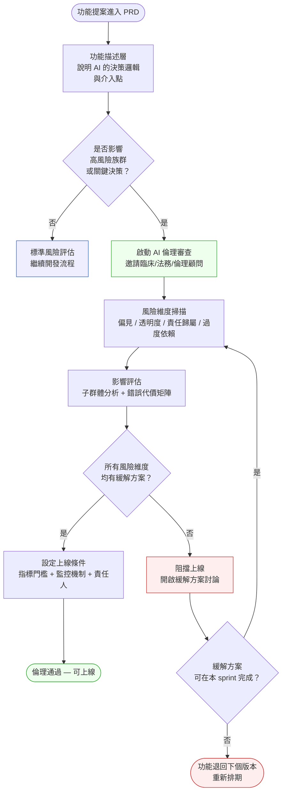
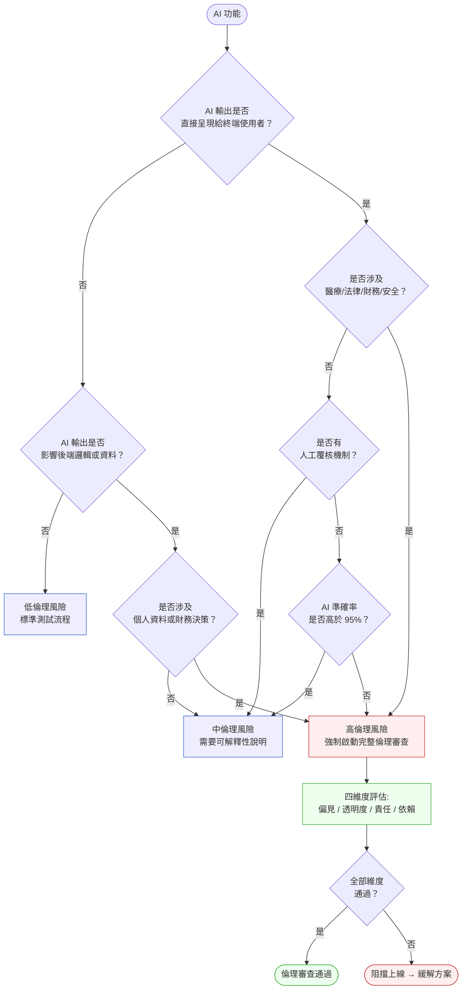

# 第 41 章 | AI Ethics & Trust：負責任的 PM 判斷

> **前置閱讀**：[Ch 39 AI 功能的產品決策：怎麼決定做不做](./ch-39-ai-feature-decisions.md)
> **前置閱讀**：[Ch 40 LLM-Powered Products：PM 的技術理解底線](./ch-40-llm-product-pm.md)
> **下游章節**：[Ch 42 Data Privacy & Compliance：PM 的法規責任邊界](./ch-42-privacy-compliance.md)
> **SA/SD 對照**：[SA/SD Ch 28 Compliance by Design — AI 合規架構](../../book/part-05-quality/ch-28-compliance.md)
> ⸺ SA 視角關注合規的架構實作（資料流、稽核 log、同意管理）；本章關注上線決策的倫理責任邊界，以及當工程可行但倫理有疑慮時，PM 如何做出可辯護的判斷。

---

## §41.1 冷觀察

Legal 在上線前 72 小時出現了。

MedFlow 是一家虛構的醫療資訊平台，服務台灣三十七家區域醫院的護理記錄與排班系統。2025 年第三季，PM 林彥廷把一個 AI 輔助護理交班功能排進了 Sprint 21 的上線計畫。這個功能的邏輯不複雜：系統讀取護理師填寫的交班紀錄，用 LLM（大型語言模型）自動摘要出「高風險病患」清單，並在下一班護理師登入時推送到主畫面頂部。

工程師在 staging 跑了兩個禮拜，準確率看起來不錯——手動比對的 200 筆記錄裡，AI 判定的高風險清單和資深護理師的判斷符合率達到 87%。產品委員會通過了。QA 簽核了。架構師確認無 PII（個人可識別資訊）傳出邊界。

Sprint 21 上線前兩天，Legal 顧問傳了一封信。

信裡沒有說「不行上線」，只問了三個問題：

> 「如果護理師因為信任 AI 摘要而跳過自己的判斷，發生漏看的情形，誰負責？」
>
> 「這個功能有告訴護理師『這是 AI 生成的建議，不是醫囑』嗎？」
>
> 「13% 的誤判中，有沒有特定病患群體被系統性低估？」

林彥廷沒有答得出來。不是因為他不聰明，是因為在整個三個月的開發週期裡，這三個問題從來沒有出現在任何一個 ticket、任何一次 design review、任何一份 PRD 裡。

Sprint 21 在上線前 48 小時緊急煞車。工程端已完成，CI/CD pipeline 已跑完，feature flag（功能開關）指著 `ready`——但 PM 手上沒有任何一個框架，能告訴他「哪些條件達成，這個功能才算倫理上可以上線」。技術上一切就緒，倫理上一片空白。

那封信他讀了四遍。第一遍覺得是 Legal 找麻煩，第四遍才意識到：真正讓他冷汗直流的，不是這三個問題太難回答，而是這三個問題在過去三個月裡，從來不曾被任何人問出口。

---

## §41.2 真問題

把 MedFlow 這個案例拆開來看，林彥廷面對的不是「技術問題」，也不是「Legal 太晚介入」。

### 表面需求（What）

開發 AI 摘要功能，提升護理交班效率，減少人工查詢病歷的時間。

業務目標成立，技術可行性成立，使用者研究也顯示護理師確實有「交班資訊太散、重要資訊容易遺漏」的痛點。整個決策路徑在表面需求的層次是完整的。

但是，**表面需求的完整性和倫理上的可上線性是兩件事**。

### 業務目標（Why）

把三個層次對齊來看：

| 層次 | MedFlow 的樣子 | 斷裂點 |
|---|---|---|
| **Outputs** | AI 摘要功能上線、高風險清單推送率達 95% | 開發完成，測試通過 |
| **Outcomes** | 護理師在交班時的漏看率降低 | 從未設定追蹤指標 |
| **Impact** | 病患安全事故減少、醫院對 MedFlow 的信任度提升 | 如果功能造成反效果，直接衝擊合約續約 |

林彥廷量的是 Outputs——準確率 87%、功能完成、QA 通過。但業務目標層（Outcomes 和 Impact）從未被轉譯成可量測的上線條件。

「準確率 87%」是一個數字。但沒有人問過：那 13% 的誤判，有多少發生在 ICU？有多少是老年病患？有多少是跨科轉介的邊界案例？

在醫療情境下，**錯誤不是均勻分布的，它們系統性地集中在脆弱族群**。一個 87% 的整體準確率，可能在某個子群體只有 61%。

### 決策瓶頸（Who × When）

這才是真正的癥結。

| 問題 | 現狀 | 應有狀態 |
|---|---|---|
| 誰是 Approver（A）？ | 「產品委員會通過」⸺ 集體通過等於沒人負責 | 明確點名一個 Approver 對倫理風險判斷拍板 |
| 何時觸發倫理審查？ | Legal 在 T-72 小時才出現 | 倫理評估應在 PRD 批准前完成 |
| PM 的判斷邊界在哪裡？ | 林彥廷以為「達到 87% 準確率就夠了」 | 精準度標準應由臨床顧問、Legal、PM 共同設定 |

MedFlow 的 DACI 失位並不是特例，而是 AI 功能在大多數組織裡的系統性常態。三個結構性原因反覆製造出同一個結果：第一，準確率、延遲、F1-score 是具體可讀的數字，倫理判斷是抽象且充滿爭議的——在 sprint 壓力下，團隊自然用可量測的指標替代了真正需要被回答的問題；第二，「倫理」這個詞在組織裡沒有天然的票主，PM 的職責是出貨，Legal 的職責是合規，Engineering 的職責是品質，三方都不覺得自己是倫理評估的負責人，結果就是每個人都以為別人已經處理了；第三，組織的速度偏見把所有非工程審查都視為障礙而非閘門，倫理評估於是被持續遞延到最後一刻——恰好是代價最高的時間點。當你在自己的組織裡看到同樣的三個訊號，不需要等到 Legal 信件出現才知道問題在哪裡。

DACI（Driver 推動者 / Approver 拍板者 / Contributor 貢獻者 / Informed 知會者，一種決策角色分工框架）在這個案例裡完全失位：

- **Driver（D）**：林彥廷在推動功能，但他的 driver 角色從未包含「倫理上線條件的定義」
- **Approver（A）**：「產品委員會」集體通過，實際上沒有人對倫理面向有單點責任
- **Contributor（C）**：工程師、設計師、QA 都參與了，但臨床護理顧問和倫理專家從未被邀請
- **Informed（I）**：Legal 顧問應該是 C 甚至 A，但被當成 I，在最後才被通知

**這章要處理的真問題是：PM 在 AI 功能的上線決策中，需要一個「倫理判斷」的操作框架，而不只是技術驗收清單。**

---

## §41.3 決策框架

### 圖 A — AI 倫理審查工作流程



工作流程有三個關鍵轉折點值得說明：

**第一轉折：高風險觸發點**。不是所有 AI 功能都需要完整倫理審查。觸發點判斷的維度是「AI 的輸出是否會直接影響對人的決策」以及「使用者是否有足夠資訊判斷 AI 的可信度」。一個用 LLM 生成搜尋關鍵字建議的功能，風險類別不同於一個推薦高風險病患的功能。

**第二轉折：子群體分析**。整體準確率是必要條件，不是充分條件。評估時需要額外問：「表現最差的子群體是誰？他們是不是系統中最脆弱的族群？」如果是，整體準確率的意義就大幅縮水。

**第三轉折：緩解方案可行性**。如果風險有緩解方案但無法在當前 sprint 完成，推遲上線比帶著已知風險上線更容易被 Stakeholder 接受——前提是 PM 能清楚說明「哪個條件達成了就可以上線」。

---

### 圖 B — AI 功能倫理風險分類決策樹



---

### AI 倫理四維度評估表

實務上，倫理審查常因為太抽象而流於形式。把它拆成四個可操作的維度：

| 風險維度 | 評估問題 | 推薦做法 | PM 關注點 | 常見錯誤 |
|---|---|---|---|---|
| **偏見（Bias）** | 哪些子群體的準確率顯著低於整體？這些子群體是否是服務對象中最脆弱的？ | 強制跑子群體分析，以最差表現組別設定通過門檻 | 報告整體數字前，先看分群數字 | 只看 aggregate 準確率，未做分層分析 |
| **透明度（Transparency）** | 使用者知道「這是 AI 生成的」嗎？使用者能看到 AI 的信心程度嗎？ | UI 中明確標注 AI 來源；提供 confidence score 或不確定性提示 | 設計審查中核查 AI 標注的可見性 | 把 AI 輸出呈現得與人工輸入一樣，無差異化標注 |
| **責任歸屬（Accountability）** | 如果 AI 輸出導致錯誤決策，責任鏈是否清楚？ | 明確記錄「AI 建議 vs 人工決策」的每一次分歧；設置稽核 log | 確認 Legal 已對責任歸屬出具書面確認 | 假設「系統記錄了操作」等同於「責任鏈清楚了」 |
| **過度依賴（Over-reliance）** | 使用者是否有可能因為 AI 的存在而降低自己的判斷門檻？ | 定期追蹤「AI 建議被接受且未覆核」的比率；設置過高依賴告警 | 與 UX 設計師合作設計「摩擦點」，防止盲目點擊接受 | 把高 AI 接受率解讀為「功能好用」，而非「使用者過度依賴」 |

---

### If-Then 框架：AI 上線條件判斷

上線條件不應該是模糊的「大家覺得 OK 了」，而是有明確觸發條件的判斷鏈：

- **If** 功能屬於高倫理風險類別，且子群體分析已完成且最差子群體準確率 ≥ 臨床顧問設定的門檻 → **Then** 通過倫理風險技術門檻，進入下一項審查
- **If** UI 中已有 AI 來源標注且通過使用者理解測試 → **Then** 通過透明度門檻
- **If** 責任歸屬 Legal 書面確認已存檔 → **Then** 通過法務門檻
- **If** 過度依賴監控機制已上線（非上線後再補）→ **Then** 通過監控門檻，以上四項全部通過即可正式上線
- **If** 所有條件中有任一未達成，且未達成條件有明確緩解方案且時間表已確認 → **Then** 帶條件上線（限定範圍灰度放量，依下方「灰度放量決策表」逐階放行）並明確下一個審查時間點
- **If** 任一未達成條件無明確緩解方案或時間表未確認 → **Then** 退回開發，重排期，不帶已知倫理風險上線

這個框架最重要的是把「倫理 ready」從模糊感受轉換成可驗證的清單。PM 的責任不是判斷 AI 的技術品質，而是確保上線條件被定義、被驗證、有人負責。

#### 灰度放量（Gradual Rollout）決策表

「帶條件上線」最容易被濫用成「先上了再說」。要避免這點，灰度放量必須同時定義三件事：**範圍怎麼限定、用什麼指標監控、什麼條件就停**。以 MedFlow 為例，把抽象的「限定範圍放量」拆成可執行的階梯：

| 放量階段 | 範圍限定 | 監控指標（綠燈門檻） | 停止條件（紅燈，立即回滾） | 進入下一階段條件 |
|---|---|---|---|---|
| **階段 0：影子模式** | AI 產生清單但不推送給護理師，僅記錄供比對 | AI 清單 vs 護理長實際標記的符合率 | 符合率 < 75% | 影子運行 1 週且符合率 ≥ 80% |
| **階段 1：單點試用** | 限定 1 家醫院、1 個科室（非 ICU、非急診等高風險科） | 漏看回報數、護理師覆核率、誤判申訴數 | 出現任一漏看事故，或覆核率 < 50% | 監控 2 週且零新增風險事件 |
| **階段 2：科室擴大** | 同醫院擴至 3–5 個一般科室（仍排除 ICU/急診/兒科） | 子群體（跨科轉介）準確率、過度依賴告警次數 | 子群體準確率週環比下降 > 5% | 監控 2 週且子群體門檻維持 ≥ 80% |
| **階段 3：跨院全量** | 全部 37 家醫院、全科室 | 全量四維度指標 + 各院合規回報 | 任一醫院觸發倫理複審門檻 | — |

這張表的核心不是階段數，而是**每個階段都有「進不去」和「退回來」的明文條件**。沒有停止條件的灰度放量，本質上還是全量上線，只是慢一點。範圍限定的原則也很明確：**先放在錯誤代價最低的場景**——一般科室的漏看代價遠低於 ICU，所以高風險科室永遠是最後才開放，而非最先。

---

### AI 倫理審查 DACI 配置

每個 AI 功能的倫理審查應有獨立 DACI，不依附在一般功能審查流程裡：

| 角色 | 高風險功能（醫療/財務/安全） | 中風險功能 | 低風險功能 |
|---|---|---|---|
| **Driver（D）** | PM | PM | PM |
| **Approver（A）** | 臨床/法務顧問 + PM 聯簽 | PM | PM |
| **Contributor（C）** | 工程師、設計師、臨床顧問、Legal、倫理專家 | 工程師、設計師、Legal | 工程師 |
| **Informed（I）** | 業務、客服、醫院合規窗口 | 業務、客服 | 業務 |

DACI 裡最容易被省略的是 Contributor 中的「領域專家」——在 MedFlow 案例裡，臨床護理顧問從未出現在任何決策節點。他們是唯一知道「87% 對護理場景意味著什麼」的人。

---

## §41.4 踩坑清單

**反模式一：用技術指標代替倫理判斷**

現象：PM 在 PRD 裡把「準確率 ≥ 85%」列為上線條件，QA 通過後直接上線，沒有其他倫理審查節點。

根因：技術指標是可量化的，倫理審查是模糊的。在開發流程壓力下，PM 傾向於用清楚的數字取代複雜的判斷。但「技術上可行」和「倫理上可上線」是兩個正交的維度。

> 修正方向：把技術指標和倫理條件分開列管。技術指標在 QA 環節驗收；倫理條件在 PRD 階段就應該被定義，由 PM 主導確認，而非等到 QA 後再補。

---

**反模式二：把 Legal 當成最後一道防線**

現象：開發週期的最後兩週才邀請 Legal 審查，Legal 提出問題導致緊急煞車或倉促妥協。

根因：PM 把 Legal 的角色理解為「審查完成品」，而非「共同定義可上線條件」。這讓 Legal 的輸入永遠是事後的、批評式的，而非事前的、建設性的。

> 修正方向：Legal 的第一次介入應在 PRD 定稿之前，而非功能完工之後。PM 的工作是讓 Legal 從「守門人」變成「共同設計者」——讓他們的問題在 PRD 裡被回答，不是在上線前夕被追問。

---

**反模式三：「使用者可以選擇忽略 AI」就免除了透明度責任**

現象：設計上 AI 建議旁邊有一個小小的「×」可以關閉，PM 認為這樣就已經做到「使用者有選擇」。但 AI 標注設計得和普通資訊一樣，沒有明確說明這是 AI 生成的。

根因：透明度被實作成「技術上存在關閉按鈕」，而非「使用者真正理解他們在使用 AI 建議」。兩者之間差了一個使用者理解測試。

> 修正方向：透明度的驗收標準不是「UI 元素存在」，而是「使用者在操作路徑中能否準確說出這是 AI 生成的建議，而非人工確認的資訊」。在上線前跑 5–8 個使用者的快速理解測試，成本比事後修復低很多。

---

**反模式四：倫理審查只做一次，上線後不再追蹤**

現象：功能上線時通過了倫理審查，但六個月後模型行為因為訓練資料分布偏移而改變，或使用者的使用模式讓過度依賴問題逐漸浮現，卻沒有持續監控。

根因：把倫理審查當成「一次性批准」而非「持續監控承諾」。AI 系統的行為會隨時間變化，初始審查通過不等於永遠沒問題。

> 修正方向：上線條件裡應包含「持續監控指標」和「觸發重新審查的條件」。例如：「當子群體準確率下降超過 5% 時，自動觸發倫理複審」。PM 的責任包含確保這些監控機制在上線當天就已經啟動。

---

**反模式五：把倫理框架當成阻礙速度的官僚程序**

現象：工程師或業務壓縮開發時間，PM 在壓力下把倫理審查縮水為一頁 checklist，主要問題不問，只走形式。

根因：把倫理審查定位為「流程負擔」，而非「降低後期成本的投資」。MedFlow 的 Sprint 21 緊急煞車的成本——工程人天、士氣、Legal 溝通——遠高於在 PRD 階段多花一個禮拜做倫理審查。

> 修正方向：用「倫理負債」的語言和 Stakeholder 溝通。省略倫理審查不是「省了時間」，是把未處理的風險推後累積。在高風險功能裡，倫理負債的利率比技術負債高。

---

## §41.5 交付清單 ⸺ 一頁式 AI 功能倫理審查卡

這張卡是把「我們有想過倫理問題」轉換成可審計紀錄的工具。在 PRD 定稿前填完它，可以把 Legal 從最後防線拉成早期貢獻者；在功能上線後補填，則是把過去三個月的隱形風險第一次攤在陽光下。建議存放在 `docs/ai-ethics/` 目錄，與 PRD 文件同層。

````markdown
# AI 功能倫理審查卡 (AI Ethics Review Card)
> 版本:v0.1 | 撰寫日期:YYYY-MM-DD | 擁有人:{名字}

功能名稱：{功能名稱}
PRD 連結：{填入內部 PRD 文件連結，供審查者回溯需求脈絡}
審查日期：{YYYY-MM-DD}
審查觸發：{高風險 / 中風險 / 例行}

--- 1. 功能描述 ---
AI 介入點：{AI 在哪個步驟生成輸出}
<!-- 為什麼這欄：說清楚 AI 介入點才能定義「AI 建議」和「人工決策」的邊界；
     沒有這一欄，後面所有討論都是在霧裡打架。 -->
使用者看到什麼：{使用者看到的 AI 輸出形式}
標注是否存在：{是 / 否 / 說明}

--- 2. 風險維度評估 ---
【偏見 Bias】
  子群體分析完成：{是 / 否}
  最差子群體：{群體描述}
  最差子群體準確率：（{設定者}）

【透明度 Transparency】
  AI 來源標注可見：{是 / 否}
  使用者理解測試：{是 / 否 / N人測試，X%通過}
<!-- 為什麼這欄：「標注存在」和「使用者看懂了」是兩件事；
     沒跑過理解測試的透明度設計，可能只是設計師自己覺得清楚。 -->

【責任歸屬 Accountability】
  AI 建議 vs 人工決策 log：{有 / 無 / 說明}
  Legal 書面確認：{是 / 否 / 日期}
  責任鏈文件位置：{連結}

【過度依賴 Over-reliance】
  摩擦點設計：{說明}
  高依賴率告警門檻：{%}
  監控負責人：{姓名 / 角色}

--- 3. 上線條件 ---
技術門檻：{準確率等技術指標}
倫理門檻：{以上四維度全部通過}
持續監控觸發條件：{觸發重新審查的條件}
<!-- 為什麼這欄：上線條件沒有持續監控承諾，等於三個月後倫理審查自動失效；
     AI 系統的行為會漂移，初始審查只是起點。 -->

--- 4. DACI ---
Driver：{PM 姓名}
Approver：{明確點名，不能是「委員會」}
Contributors：{工程師、設計師、Legal、領域專家姓名}
Informed：{業務、客服、合規窗口}

--- 5. 審查結論 ---
結論：{通過 / 帶條件通過 / 阻擋}
條件（如適用）：{具體條件}
下一審查時間點：{YYYY-MM-DD 或觸發條件}
````

把它存在 `docs/ai-ethics/`，跟程式碼同 repo，跟 README 同層。

這張卡的設計邏輯是把「倫理上可上線」從感受轉換成可勾選的條件。六個欄位裡，最容易被省略的是「持續監控觸發條件」——因為填卡的時候功能還沒上線，沒有人想著三個月後的事。但這一欄決定了倫理審查是一次性的還是持續的承諾。

### §41.5.1 範例：MedFlow 護理交班 AI 輔助功能的補填審查卡

MedFlow 案例的教訓在於，林彥廷在 Sprint 21 緊急煞車後，補填了一張本該在 PRD 階段就存在的審查卡。第一張補填的卡揭示了開發三個月期間從未被問過的問題。

````markdown
# AI 功能倫理審查卡 (AI Ethics Review Card)
> 版本:v0.1 | 撰寫日期:2026-02-15 | 擁有人:林彥廷（PM）

功能名稱：護理交班 AI 摘要 — 高風險病患推送
<!-- 為什麼這欄：功能名稱包含「高風險病患」，觸發詞已說明需要高風險分類審查；
     如果只寫「護理輔助功能」，可能在分類環節被誤判為中風險。 -->
PRD 連結：MedFlow 內部 PRD「護理交班 AI 輔助 v2」（內部文件，此處略去實際連結）
審查日期：2025-09-12（Sprint 21 上線前 72 小時補填）
審查觸發：高風險（直接影響護理師對病患的判斷）

--- 1. 功能描述 ---
AI 介入點：護理師送出交班紀錄後，系統自動從文字中提取高風險標記，
           生成「本班高風險病患」清單並推送至下一班主畫面頂部
<!-- 為什麼這欄：這個介入點意味著 AI 輸出在護理師最忙的交班時刻優先呈現；
     使用者在高壓下更容易直接採用 AI 建議而跳過自己的判斷。 -->
使用者看到什麼：主畫面頂部卡片，標題「本班需關注病患」，列出 2–5 位病患姓名與主要風險標記
標注是否存在：否（目前設計無 AI 來源標注）

--- 2. 風險維度評估 ---
【偏見 Bias】
  子群體分析完成：否（上線前未執行）
  最差子群體：未知（緊急補填後分析顯示：跨科轉介病患 F1-score（精確率與召回率的調和平均，衡量分類品質）= 0.61）
  最差子群體準確率：61%
  通過門檻（由誰設定）：臨床護理顧問設定 ≥ 80%（此條件上線前未存在）

【透明度 Transparency】
  AI 來源標注可見：否
  使用者理解測試：否（未進行）
<!-- 為什麼這欄：訪談三位護理師後，兩位以為清單是護理長人工審核的；
     沒有標注的 AI 輸出在權威情境下會被當成更可信的來源。 -->

【責任歸屬 Accountability】
  AI 建議 vs 人工決策 log：有（系統記錄操作），但未記錄「護理師是否覆核了 AI 清單」
  Legal 書面確認：否（T-72 小時的那封信是第一次溝通）
  責任鏈文件位置：尚未建立

【過度依賴 Over-reliance】
  摩擦點設計：無（目前設計直接呈現清單，無覆核引導）
  高依賴率告警門檻：未設定
  監控負責人：未指定
<!-- 為什麼這欄：交班場景的時間壓力讓摩擦點設計尤為關鍵；
     沒有摩擦點的 AI 建議在忙碌環境裡幾乎等於人工指令。 -->

--- 3. 上線條件 ---
技術門檻：整體 F1-score ≥ 0.85（原始條件）
倫理門檻：
  - 子群體最差組 F1-score ≥ 0.80（新增，臨床顧問設定）
  - AI 來源標注可見且使用者理解測試 ≥ 80% 通過
  - Legal 責任鏈書面確認完成
  - 摩擦點設計通過護理師可用性測試
持續監控觸發條件：子群體準確率週環比下降 > 5% 觸發重新審查
<!-- 為什麼這欄：模型上線後訓練分布會隨醫院病患結構變化而偏移；
     沒有這一條，三個月後審查卡的四維度評估結果就失效了。 -->

--- 4. DACI ---
Driver：林彥廷（PM）
Approver：陳醫師（臨床護理顧問）+ Legal 顧問 王律師（聯簽）
Contributors：工程師陳小明、設計師吳雨晴、護理師代表黃美玲、Legal 王律師
Informed：各醫院合規窗口、護理部主任

--- 5. 審查結論 ---
結論：阻擋（帶條件版本最快 Sprint 22 上線）
條件：上述倫理門檻全部達成方可上線
下一審查時間點：Sprint 22 PRD 更新後重新審查（預計 2025-09-26）
````

林彥廷在補填完審查卡之後說了一句話：「如果三個月前有人給我這張卡，Legal 那封信一個問題都不會出現。」補填的成本是兩天、一次緊急會議、工程師的士氣。預填的成本是一個下午。

---

## §41.6 Recap

讀完本章，你應該已經能做到：

- [ ] 在 PRD 定稿前識別 AI 功能的倫理風險分類（高/中/低），而非等到功能完工後再問問題
- [ ] 用四維度框架（偏見、透明度、責任歸屬、過度依賴）把「倫理審查」從感受轉換成可驗證的條件
- [ ] 為 AI 功能的上線決策設定明確的 DACI，確保 Approver 不是「委員會」而是有名有姓的人
- [ ] 把子群體分析納入技術驗收流程，在整體準確率之外追蹤最脆弱族群的表現
- [ ] 設計持續監控觸發條件，讓倫理審查成為持續承諾而非一次性批准

如果先挑一項做，建議是在下一個 AI 功能的 PRD 裡加入「倫理風險分類」欄位並設定 Approver——單這一步就能讓 Legal 從最後防線變成早期貢獻者，把緊急煞車的風險大幅前移。

---

## Cross-References

- **前一章**：[Ch 40 LLM-Powered Products：PM 的技術理解底線](./ch-40-llm-product-pm.md) ⸺ 理解 LLM 的技術特性是倫理判斷的前提
- **下一章**：[Ch 42 Data Privacy & Compliance：PM 的法規責任邊界](./ch-42-privacy-compliance.md) ⸺ 倫理框架與法規合規的交叉地帶，從「應不應該做」到「法律上允不允許做」
- **強連結**：[Ch 39 AI 功能的產品決策：怎麼決定做不做](./ch-39-ai-feature-decisions.md) ⸺ 「要不要做 AI 功能」的決策框架；本章處理「決定做了之後怎麼倫理上線」
- **SA/SD 對照**：[SA/SD Ch 28 Compliance by Design — AI 合規架構](../../book/part-05-quality/ch-28-compliance.md) ⸺ SA 視角關注合規的架構實作；PM 視角關注上線決策的倫理責任邊界
- **SA/SD 延伸**：[SA/SD Ch 45 AI 系統的 Eval、Drift 與 Red Team](../../book/part-07-ai-era/ch-45-ai-eval-drift-redteam.md) ⸺ 技術層面的 AI 系統品質評估，對應本章「持續監控觸發條件」的工程實作

<!-- PROPOSED-REFS
cases:
  - id: CASE-HCR-105
    title: "MedFlow — 護理交班 AI 摘要功能緊急煞車事件"
    domain: healthcare
    chapters: [pm-ch-41]
    anonymized: true
    summary: |
      虛構醫療資訊平台 MedFlow，服務 37 家區域醫院護理記錄與排班系統。
      PM 林彥廷在 2025 Q3 開發「護理交班 AI 摘要」功能，LLM 自動從交班
      紀錄中提取高風險病患清單並推送給下一班護理師。功能通過 QA（整體準確率
      87%）、產品委員會批准，但在上線前 72 小時 Legal 顧問提出三個問題後
      緊急煞車：責任歸屬不明、無 AI 來源標注、未進行子群體分析（跨科轉介
      病患準確率僅 61%）。用於展示 PM 在 AI 功能上線決策中缺乏倫理審查框架
      時，技術指標達標與倫理可上線性的斷裂，以及倫理審查延後的代價。
-->
