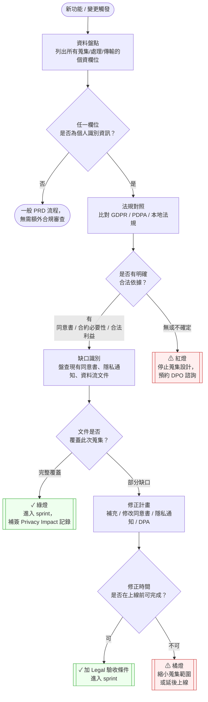
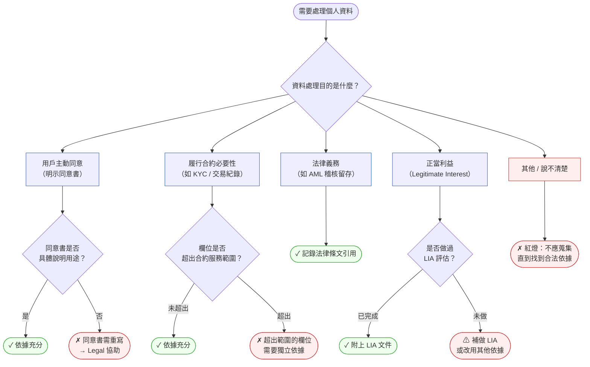

# 第 42 章 | Data Privacy & Compliance：PM 的法規責任邊界

> **前置閱讀**：[Ch 40 — LLM-Powered Products：PM 的技術理解底線](./ch-40-llm-product-pm.md) ⸺ AI 功能蒐集與處理資料的技術前提
> **前置閱讀**：[Ch 41 — AI Ethics & Trust：負責任的 PM 判斷](./ch-41-ai-ethics-trust.md) ⸺ 倫理判斷與法規責任的交界
> **下游章節**：[Ch 43 — The Augmented PM：AI 工具重組後的角色定義](./ch-43-augmented-pm.md) ⸺ AI 工具如何重組 PM 對資料與合規的責任邊界
> **SA/SD 對照**：[SA/SD Ch 28 — Compliance by Design](../../book/part-05-quality/ch-28-compliance.md) ⸺ SA 視角關注「系統如何不違法」；本章關注「PM 在什麼時間點必須發現問題、做決定、扛責任」。

---

## §42.1 冷觀察

稽核通知在週四下午四點半寄到的時候，Jason 正站在會議室白板前，講到 onboarding 轉換率這一季漲了六個百分點。

ClearPay（虛構 Fintech）的這場 sprint review 開得很順——直到坐在後排的 QA 工程師把手機橫過來，螢幕推到 Jason 面前。投影片還停在那張漂亮的漏斗圖上，手機螢幕上卻是另一封信：GDPR 稽核機關來函，標題一行字，正文三段。針對 ClearPay 用戶 onboarding 流程蒐集的個人資料，要求提供合規說明，並點名兩項初步疑慮——「資料蒐集目的不明確」、「超出服務必要範圍」。

會議室安靜了大概三秒。Jason 的第一反應脫口而出：「這個……Legal 那邊有看過設計吧？」

沒有人回答。因為答案是沒有。

那份設計從未送 Legal 審查。原因很單純：九個月前他做 OKR「加速用戶啟用率」時，順手在 onboarding 表單加了三個欄位——生日、職業、月收入範圍——理由是「以後做個人化推薦可能會用到」。推薦功能後來排不進 roadmap，砍了。欄位沒人記得砍。資料一筆一筆，收了九個月。

那場 sprint review 沒有開完。會議室清場，十分鐘後改成緊急應變會議，CTO、Legal Counsel、DPO（資料保護長，Data Protection Officer）魚貫進來，沒有人坐下。

接下來的七十二小時，Jason 只需要說清楚三件事：這些欄位蒐集了什麼、為什麼蒐集、資料現在在哪。第一件他答得出來。第二件他知道當初的念頭，卻寫不出任何一條合法依據。第三件——資料現在散落在哪幾張表、哪幾份備份、有沒有同步到分析平台——他完全答不上來。那一直是工程師的事，他從沒覺得自己需要過問。

最終處置：系統連夜下架三個欄位，已蒐集的資料必須在期限內刪除，法律諮詢費與罰款合計超過 15 萬歐元。Jason 不是 DPO，不是 Legal，也不是 CTO。他只是一個想讓 onboarding 轉換率好看一點的 PM。

但稽核報告上那一行字，他到收到帳單那天才真正讀懂它的重量：

「蒐集行為發生於產品設計階段，PM 為功能設計責任人。」

---

## §42.2 真問題

### 表面需求（What）

表面上，Jason 的問題是「某些欄位不該放在表單裡」。很多人到這一層就停了——下架欄位、刪資料、關案。

這樣的處置讓問題從法規層消失，卻讓同一套決策邏輯原封不動地留在所有後續功能裡。下一個 PM、下一個 sprint，會再犯一次。

### 業務目標（Why）

把它拆開來看。Jason 加這幾個欄位時，追的是「個人化推薦」的未來成果（Outcome）。那個 Outcome 沒有時程、沒有 ticket、沒有人批准，只有 PM 腦子裡一句「以後可能用到」。

「以後可能用到」不是業務目標，是資料囤積的慣用藉口。GDPR 的核心原則之一「[資料最小化（Data Minimisation）](../../book/annex-f-glossary.md#data-minimisation)」說的正是這件事：蒐集行為必須有當下就能說清楚的、具體的目的，不能拿預期中的未來用途當依據。

把 Outputs / Outcomes / Impact 三層對應到本案：

| 層次 | ClearPay 案例的對應 | 被混淆的地方 |
|---|---|---|
| **Outputs（產出）** | 新增三個欄位進 onboarding 表單 | 這個 PM 清楚 |
| **Outcomes（成果）** | 個人化推薦點擊率提升（預期中） | 功能從未交付，Outcome 從未測量 |
| **Impact（影響）** | 啟用率提升 → 付費轉換率提升 | OKR 上的數字，從未連接到資料蒐集行為 |

PM 追的是 Impact（啟用率），以為 Outcomes 會連帶改善，於是用了一個沒有 Outcome 連結的 Output 去推它。法規不在乎這個 Output 有沒有帶來 Outcome，它只問一句：蒐集這筆資料的依據是什麼。

### 決策瓶頸（Who × When）

真正的問題是：**在 ClearPay，沒有任何一個機制要求 PM 在加入資料蒐集之前，先說清楚法規依據。**

這是一個流程空白，不是 Jason 個人的知識缺口。他不知道自己需要問，沒有人告訴他要問，沒有 checklist 提醒他，也沒有任何審查者（Reviewer）在 PRD 審查時把這件事攔下來。

用 DACI 框架拆解（Driver 推動者 / Approver 決策者 / Contributor 提供輸入者 / Informed 被通知者）：

| 角色 | 這件事本來應該是誰 | 實際上是誰 |
|---|---|---|
| **Driver（推動者）** | PM | Jason 確實推動了，但方向錯誤 |
| **Approver（決策者）** | DPO / Legal | 從未被納入這條 PRD 的審查流程 |
| **Contributor（提供輸入者）** | Engineering、Design | 有輸入，但沒有人問過法規層 |
| **Informed（被通知者）** | CTO | 事後才知道 |

這個 DACI 缺了 Approver 的輸入。不是因為 DPO 不存在，而是 PM 不知道何時該找 DPO。

決策瓶頸的核心因此是：**PM 必須知道哪一類決策需要觸發合規審查，而這個判斷標準必須外顯化、可操作。** 不能依賴「覺得好像要問一下 Legal」這種隱性直覺——直覺會在趕 OKR 的那一週靜悄悄關機。

---

## §42.3 決策框架

這一節不告訴你「哪些資料可以蒐集」——那是 Legal 的答案，而且會隨地區與法規版本變動。它教的是**怎麼判斷「這件事該不該由你現在就拉 DPO 進來」**。判斷對了，答案自然會由對的人給你。

### 圖 A — PM 合規審查工作流程



這個流程的關鍵在「資料盤點」這一步。PM 常常跳過它，直接畫 UI 或寫 user story，把資料蒐集當成實作細節丟給工程師。結果是工程師照著設計做，資料收了，PRD 裡卻沒有留下任何「為什麼蒐集」的文字。記住：稽查機關問的第一個問題，永遠是「你為什麼需要這筆資料」。

### 圖 B — 合規依據判斷樹



LIA 是「[正當利益評估（Legitimate Interest Assessment）](../../book/annex-f-glossary.md#legitimate-interest-assessment)」的縮寫，是 GDPR 第 6(1)(f) 條下主張正當利益時必須提供的文件。PM 不需要自己寫 LIA，但需要知道「正當利益」不是一句能擋住稽查的咒語——它背後要有文件支持。

### 合規觸發清單 — 可貼進 PRD 模板的一頁卡

以下條件任一成立，即在 sprint 排期**前**（而非排期後）觸發合規審查。可直接印出貼在工位或加進 PRD 模板第一頁：

| # | 觸發條件 | 立即行動 |
|---|---|---|
| T-1 | PRD 中出現可直接或間接識別個人的欄位（姓名、Email、IP、設備 ID、行為軌跡等） | 完成資料盤點 → 進圖 A 流程 |
| T-2 | 需要將任何資料傳輸到第三方（含 SaaS 工具、AI API、分析平台） | 確認 DPA 存在且覆蓋此次傳輸（見廠商稽核三問） |
| T-3 | 功能使用現有用戶資料的新用途（如交易資料用於 AI 推薦） | 確認原始同意書是否涵蓋；若無，啟動同意書更新 |
| T-4 | 功能上線地區包含 EU / UK / 台灣 / 中國大陸 / 加州任一市場 | 對照地區法規表（見下節）；將合規確認加入 DoD |
| T-5 | 功能包含自動化決策（信用評分、風險等級、貸款核准等） | 確認是否需要提供用戶「拒絕自動決策」的管道（GDPR 第 22 條） |

這份清單的目的是讓 PM 知道「何時要找 DPO」，而不是讓 PM 自己判斷「這合不合法」。前者是 PM 的責任，後者永遠不是。

### 地區法規速覽 — PM 的一句話對照表

進入新市場時，先查這張表找到適用法規，再讓 Legal 補充細節。每一條只寫對 PM 最直接的行動意涵：

| 法規 | 適用市場 | PM 最需要知道的一句話 | 與 GDPR 最大差異 |
|---|---|---|---|
| **GDPR** | 歐盟 / 英國 / EEA | 有合法依據才能蒐集；刪除請求須在 30 日內回應 | 基準線，其他法規多數以此為參照 |
| **台灣個資法（PDPA）** | 台灣 | 特定目的之外不得使用；跨境傳輸須主管機關核准或簽訂協議 | 無 DPO 強制要求，但「特定目的」限制更嚴格 |
| **CCPA / CPRA** | 美國加州 | 用戶有「知情權」和「退出資料銷售權」；需在隱私政策揭露蒐集類別 | 以「銷售資料」行為為核心觸發點，側重用戶選擇退出而非選擇加入 |
| **PIPL** | 中國大陸 | 境外傳輸需通過安全評估或認證；敏感個資要求單獨同意 | 資料本地化要求更嚴格；境外接收方須簽訂標準合同 |
| **LGPD** | 巴西 | 架構與 GDPR 相近；同意必須「自由、知情、明確、毫無疑問」 | 法規成熟度較低，執行力度仍在建立中，但法律文本已有效 |

當市場適用法規出現衝突時（如一個市場要求最短保留期、另一個要求最長保留期），正確做法是：列出衝突點 → 請 Legal 判斷取交集還是取聯集 → 把決定記錄在合規卡備註欄。PM 不判斷法律衝突，但 PM 負責把衝突點說清楚交出去。

### 決策表 — 資料蒐集場景 × 合規動作

這張表讓 PM 在面對新功能時，能先對號入座找到「現在該觸發什麼動作」：

| 情境 / 觸發條件 | 合法依據類型 | PM 的具體動作 | 常見錯誤 |
|---|---|---|---|
| 新增 onboarding 表單欄位（非交易必要） | 明示同意 | 確認同意書覆蓋這個欄位的用途；若沒有，交 Legal 修改後才進 sprint | 直接寫進 user story，讓工程師「自己想辦法」 |
| 整合第三方資料提供商 | 合約必要性 / 正當利益 | 確認 DPA（資料處理協議，Data Processing Agreement）已簽署，傳輸欄位清單已列明 | 以為「有合作合約」等同「資料可以傳」 |
| 使用用戶行為資料訓練內部 AI 模型 | 正當利益（須 LIA）/ 明示同意 | 觸發 LIA 評估流程，或在用戶同意書中明確列出 AI 訓練用途 | 把「使用服務即同意」的條款當成 AI 訓練的許可 |
| 保留已離開用戶的資料 | 法律義務（若適用）/ 否則需刪除 | 確認每類資料的保留期限，並確保刪除 job 有 ticket | 以為「沒人問就沒事」，資料無限期留存 |
| 擴展服務到新地區 | 視地區而定 | 在 roadmap 添加「法規適用性確認」里程碑，不能在上線後補做 | 把法規差異當成上線後的「小修正」 |
| AI 功能存取現有用戶個資 | 視原始同意書範圍 | 確認原始用途是否涵蓋 AI 處理；大多數情況下需更新隱私通知 | 以為舊資料已獲同意，AI 功能自動合規 |

### 資料留存期限決策表

留存期限是最常被跳過的欄位，卻是稽查時最容易被抓的漏洞。以下是一個起點參照，所有欄位的實際期限仍需 Legal 確認：

| 資料類型 | GDPR 原則 | 常見業界慣例 | PM 的驗收動作 |
|---|---|---|---|
| 交易紀錄 | 依合約期限 + 法律義務 | 7 年（稅務 / AML 合規） | 確認刪除 job 有 ticket，且測試過執行路徑 |
| 用戶行為日誌（分析用） | 目的達成即刪除 | 13 個月（Google Analytics 預設） | 確認日誌系統有自動清除機制，且有人 own 這個設定 |
| KYC 文件（身分證、護照掃描） | 法律義務期限後刪除 | 5–7 年（依 AML 法規） | 確認有刪除排程，且刪除事件有稽查日誌 |
| 客服對話紀錄 | 合理期限後刪除 | 1–3 年 | 確認平台（Zendesk 等）有保留期限設定 |
| 行銷 opt-in 名單 | 用戶撤回同意即刪除 | N/A | 確認撤回同意的觸發路徑能連動刪除分析平台資料 |
| 帳號刪除後的衍生資料 | 30 日內完成完整刪除 | 30–90 日（依備份週期） | 「刪帳號」的 AC 要包含：備份、日誌、第三方通知三個面向 |

這張表的正確用法：在 PRD 的資料盤點欄填好每一列的保留期限，然後在 sprint 的 Acceptance Criteria 加一條「刪除 job 已存在且測試通過」。不是 PM 寫這個 job，是 PM 確保它被定義。

### 廠商合規稽核三問

PM 在整合第三方服務（Mixpanel、Segment、Amplitude、OpenAI API 等）前，需要拿到這三個問題的答案，才能讓 DPA 審查有意義：

1. **DPA 覆蓋範圍**：你們的 DPA 是否明確涵蓋 EU/UK 資料主體？（如果回答「我們的標準條款覆蓋所有用戶」，追問：條款版本號和生效日期？）
2. **次處理方（Sub-processor）揭露**：你們的次處理方名單上次更新是什麼時候？我們有通知義務嗎？（部分 SaaS 工具把資料轉給 AWS / GCP 等，這些都是次處理方）
3. **資料在哪裡處理**：實際資料落在哪個雲端 Region？是否能限制在 EU / 特定地區？

這三個問題的答案不是 PM 自己判斷合不合格，而是整理清楚後給 Legal / DPO 審核。PM 的工作是問出答案並記錄，不是判斷合法性。

---

## §42.4 踩坑清單

**反模式：「以後可能用到」式資料囤積**

現象：PM 在設計表單或 API 時，加入「目前不用但未來可能需要」的欄位或資料點，理由通常是「先蒐集，以後省得麻煩」。

根因：PM 對資料成本的認知停在儲存（Storage）費用，沒有計入法規成本。蒐集了就需要管理、保護、說明依據、按時限刪除；每一項都是隱藏的合規負債。

> 修正方向：在 PRD 加一行問題：「如果現在就要說清楚這個欄位的蒐集依據，能說清楚嗎？」說不清楚的欄位，先不蒐集，等功能設計確定後再回來評估。

---

**反模式：把 Legal Review 當成上線前的最後一關**

現象：Legal review 被排在使用者驗收測試（UAT）之後、上線前幾天。工程師做完了，設計完了，PM 才送去給 Legal 看一眼。Legal 的意見如果是「需要修改」，就是 72 小時緊急危機。

根因：PM 把 Legal 當成「審查部門」，而不是「設計輸入者」。合規問題在設計階段修正的成本是決策改一行；在上線前修正的成本是重做 + 延期 + 法律諮詢費。

> 修正方向：把「DPO / Legal 確認合規依據」排在 sprint 開始前的就緒標準（Definition of Ready），而非 sprint 結束後的驗收標準（Definition of Done）。這是順序問題，不是多做一件事。

---

**反模式：以為「用戶點了同意就合規了」**

現象：在 onboarding 加一個「我同意使用條款與隱私政策」的勾選框（checkbox），認為這樣所有資料蒐集都有依據了。

根因：GDPR 和台灣個資法對「同意」都有具體要求：必須是自由給予的、具體的、知情的、明確的。一個蓋住所有行為的概括同意條款，在稽查時站不住腳，尤其是當資料用於 AI 訓練、行為分析等用戶未能預見的用途時。

> 修正方向：同意書的修改不是 PM 的工作，但「這個功能的同意書是否夠具體」是 PM 需要問 Legal 的問題。上線前的驗收條件（Acceptance Criteria）可以加一條：「Legal 確認同意書覆蓋此功能所有資料用途。」

---

**反模式：地區擴展時忽略法規差異**

現象：產品在台灣上線後，PM 接到「要進歐洲市場」的 roadmap 目標，開始排在地化（Localization）sprint，翻譯 UI、處理貨幣，但沒有加進任何法規適用性評估的工作項目。GDPR 的要求在上線後才被發現。

根因：PM 的地區擴展 checklist 有語言、貨幣、時區、稅務，但沒有「資料法規」這一行。它被分類在「技術事項」，沒人注意到它也是「PM 需要推動確認」的事項。

> 修正方向：在地區擴展的 Epic 模板裡，加入一個固定子任務：「確認目標市場的個資法規清單，並與 Legal / DPO 確認合規間隙（Compliance Gap）」。這個子任務的負責人（Owner）是 PM，不是 Legal。

---

**反模式：資料刪除不在 roadmap 裡**

現象：用戶帳號刪除功能上線了，但「刪帳號」只刪了帳號本身，備份資料、日誌裡的個資、第三方 API 傳出去的資料，沒有人追。稽查機關問起「刪除請求的完整執行紀錄」時，PM 才發現刪除流程根本不完整。

根因：「被遺忘權（Right to Erasure）」不只是前端 UI 的刪除按鈕，它是一個需要跨越多個系統、多個第三方的流程。PM 把它當成工程師的工作，工程師把它當成 PM 的需求，最後沒有人把它定義清楚。

> 修正方向：「刪除帳號」的 user story 需要一個子任務（sub-task）：「定義完整資料刪除範圍，包含備份保留期、第三方通知機制、刪除完成稽查日誌」。這個子任務需要 PM × Engineering × Legal 三方確認範圍。

---

**反模式：中途發現合規缺口，不知道怎麼辦**

現象：Sprint 第 3 天，工程師在 code review 時發現 API 把用戶資料傳給第三方但沒有 DPA，或者 PM 收到 Legal 的 Slack 說「這個功能可能有問題」。Sprint 只剩 7 天，既不想暫停，又不確定繼續做是否合法。

根因：合規問題往往在設計後期才浮出，但 PM 沒有一套「緊急分流」邏輯，只能靠直覺或等 DPO 排程回覆。

> 修正方向：發現合規缺口時，用這個三步驟分流框架：
>
> 1. **定性缺口嚴重程度**（請 DPO 在 24 小時內給一個初判）：是「可邊做邊修」（如同意書措辭不夠精確）、還是「必須停止蒐集才能繼續」（如完全無合法依據）？
> 2. **確認修正動作是否在 sprint 週期內可完成**：若 DPA 簽署需要兩週，而 sprint 還有一週，就需要縮小蒐集範圍（只傳匿名化資料）或拆出「無 DPA 的傳輸部分」推遲上線。
> 3. **書面記錄決策**：不管最終決定是繼續、縮小還是暫停，把決定理由、DPO 的初判、風險承擔者（通常是 DPO + CTO 聯署）全部寫進合規卡的備註欄。
>
> PM 的工作不是自己判斷「這個缺口嚴不嚴重」，而是讓對的人在對的時間給出判斷，並把判斷記錄下來。

---

## §42.5 交付清單 ⸺ 一頁式資料蒐集合規確認卡

本章交付一張可立即套用的工件：

- **資料蒐集合規確認卡**（空白模板，見下方）——每一個涉及個資的功能，在進入 sprint 前填妥一張。
- **§42.5.1 失敗案例範例**——以 ClearPay 事件回填，示範這張卡會在哪個欄位把問題攔下來。
- **§42.5.2 通過案例範例**——以 KYC 文件上傳功能示範，讓 PM 看見所有欄位都合規時，這張卡長什麼樣子。

這張卡的目的不是法律文件，是 PM 和 DPO / Legal 之間的對話記錄。它讓稽查機關在問「為什麼蒐集」時，PM 能在五分鐘內找到答案，而不是翻遍 Slack 紀錄和 Confluence 頁面。

````markdown
# 資料蒐集合規確認卡 — {功能名稱}
> 版本:v0.1 | 撰寫日期:YYYY-MM-DD | 擁有人:{名字}

### 基本資訊
- 功能 / Sprint：{功能名稱} / {Sprint ID}
- PM 負責人：{姓名}
- DPO / Legal 確認人：{姓名}（尚未確認者留空，但此欄空白不得進入 sprint）
- 確認日期：{YYYY-MM-DD}

### 資料盤點
| 欄位名稱 | 資料類型 | 蒐集目的 | 保留期限 | 傳輸至第三方？ |
|---------|---------|---------|---------|--------------|
| {欄位} | {PII/敏感/非PII} | {具體用途，一句話} | {N 個月/年} | {是/否，若是請列廠商} |

### 合法依據
- [ ] 明示同意（同意書版本：{v?}，涵蓋此功能確認：{是/待確認}）
- [ ] 合約必要性（對應合約條款：{條款編號}）
- [ ] 法律義務（法規條文：{條文名稱}）
- [ ] 正當利益（LIA 文件連結：{URL}）

### 廠商 DPA 確認（有第三方傳輸時填寫）
| 廠商名稱 | DPA 狀態 | EU/UK 覆蓋？ | 次處理方已揭露？ | 資料 Region |
|---------|---------|------------|--------------|------------|
| {廠商} | 已簽署/待簽署 | 是/否 | 是/否/不確定 | {Region} |

### 缺口與修正計畫
| 缺口描述 | 修正動作 | Owner | 預計完成日 | 狀態 |
|---------|---------|-------|-----------|------|
| {描述} | {具體動作} | {人名} | {日期} | 待處理/進行中/完成 |

### 上線條件（Definition of Done 補充條件）
- [ ] 所有欄位已有合法依據，DPO 書面確認
- [ ] 隱私通知 / 同意書已更新
- [ ] 刪除流程已定義並驗證（若適用）
- [ ] 第三方 DPA 已簽署（若有資料傳輸）
- [ ] 保留期限已設定，刪除 job 已測試（若有保留期限）

### 備註
{任何額外說明，包含未解決的問題、待確認的法律解釋、衝突法規的處理方式等}
````

把它存在 `docs/compliance/data-collection/`，跟程式碼同 repo，跟 README 同層。

### §42.5.1 失敗案例：ClearPay GDPR 補課事件後的重填

回到開場那位在 sprint review 上被推了一支手機的 Jason。事件落幕後，他的第一個任務是回頭補填這張卡——不是為了那場已經發生的稽查，而是為了指出「如果當時有這張卡，它會在哪一格亮紅燈」。每一個 `[ ]` 都是一個當初沒有人問、現在逼出答案的決策點。

````markdown
# 資料蒐集合規確認卡 — ClearPay Onboarding 欄位補充
> 版本:v0.1 | 撰寫日期:2026-02-15 | 擁有人:Jason W.（PM）

### 基本資訊
- 功能 / Sprint：用戶 Onboarding 個人化資料蒐集 / Sprint 2025-Q1-03
- PM 負責人：Jason W.
- DPO / Legal 確認人：（本欄當時為空 — 這是問題的根源）
<!-- 為什麼這欄沒打勾會吃虧：DPO 確認人空白，即代表這張卡根本不該進入 sprint。
     這一格空白本身，就是稽查時最先被指出的程序缺口；它讓「沒人審過」變成白紙黑字。 -->
- 確認日期：2025-02-14（事後補填，原始 sprint 無此文件）

### 資料盤點
| 欄位名稱 | 資料類型 | 蒐集目的 | 保留期限 | 傳輸至第三方？ |
|---------|---------|---------|---------|--------------|
| 生日 | PII | 個人化推薦（功能尚未交付） | 無定義 | 否 |
| 職業 | PII | 個人化推薦（功能尚未交付） | 無定義 | 否 |
| 月收入範圍 | 敏感 PII | 個人化推薦（功能尚未交付） | 無定義 | 否 |
<!-- 為什麼「保留期限：無定義」會吃虧：沒有期限，等於承諾「永久持有」，
     直接違反資料最小化與儲存限制原則。光是這一格的空白，就是一筆持續累積的合規負債。 -->
<!-- 為什麼「蒐集目的：功能尚未交付」會吃虧：目的欄寫不出「功能已上線」，
     代表蒐集行為超前於用途——這個矛盾在填卡當下 PM 自己就會看見，不必等稽查機關來指。 -->

### 合法依據
- [ ] 明示同意（同意書版本：v1.0，涵蓋此功能確認：**未確認** — v1.0 未提及個人化推薦）
<!-- 為什麼沒打勾會吃虧：同意書 v1.0 從未提到個人化推薦，
     用戶當初的「同意」根本沒涵蓋這三個欄位，這個勾打不下去就是依據不成立。 -->
- [ ] 合約必要性（不適用，上述欄位非支付服務必要）
- [ ] 法律義務（不適用）
- [ ] 正當利益（**未做 LIA 評估**）
<!-- 為什麼沒打勾會吃虧：沒有 LIA，就不能主張正當利益；
     四個依據選項全部打叉，等於白紙黑字證明這些欄位根本不該上線。 -->

### 廠商 DPA 確認
（本案無第三方傳輸，不適用——已確認，留此記錄）

### 缺口與修正計畫
| 缺口描述 | 修正動作 | Owner | 預計完成日 | 狀態 |
|---------|---------|-------|-----------|------|
| 三個欄位無合法依據 | 下架欄位，刪除已蒐集資料 | Jason / Engineering | 2025-09-01（稽查要求期限） | 完成 |
| 同意書未涵蓋個人化用途 | Legal 重寫同意書 v2.0 | Legal Counsel | 2025-09-15 | 完成 |
| 已蒐集資料刪除確認 | Engineering 執行刪除 job，DPO 稽核確認 | CTO / DPO | 2025-09-30 | 完成 |

### 上線條件（事後確認）
- [x] 三個問題欄位已下架（2025-09-01）
- [x] 隱私通知已更新至 v2.0（2025-09-15）
- [x] 刪除流程已執行，DPO 書面確認完成（2025-09-30）
- [ ] 第三方 DPA（本案無第三方傳輸，不適用——已確認，留此記錄）
<!-- 為什麼這欄保持未勾：刻意不打勾並標注「不適用」，
     是為了留下「已評估過第三方傳輸、結論是沒有」的痕跡，而非默默跳過這一格。 -->

### 備註
本卡為事後補填，用於記錄事件根因分析。
原始 sprint 未執行任何合規確認流程。
罰款與法律諮詢費合計 EUR 150,000+。
本案已作為 ClearPay 內部 Privacy-by-Default 流程改造的起點。
````

填完這一張，Jason 不用再口頭跟 DPO 解釋「文件不齊」——空格自己會說話。他後來說，這張卡最難填的不是「缺口與修正計畫」，而是「合法依據」那四個勾——因為他這才意識到，當初加欄位的時候，他根本沒想過要回答這個問題。

### §42.5.2 通過案例：KYC 文件上傳功能的合規確認卡

這張卡示範一個**通過**的案例：ClearPay 事件後，團隊在重建 onboarding 流程時新增了 KYC（Know Your Customer）文件上傳功能。這次，合規確認卡在 sprint 開始前一週就填好，Legal 和 DPO 都有確認簽名。這是所有勾都打得下去的時候，卡長什麼樣子。

````markdown
# 資料蒐集合規確認卡 — KYC 文件上傳功能
> 版本:v1.0 | 撰寫日期:2026-01-10 | 擁有人:Maya T.（PM）

### 基本資訊
- 功能 / Sprint：KYC 身份驗證文件上傳 / Sprint 2026-Q1-02
- PM 負責人：Maya T.
- DPO / Legal 確認人：Dr. Chen（DPO），Sarah L.（Legal Counsel）
- 確認日期：2026-01-09（sprint 開始前 5 個工作日）
<!-- 這欄有人名代表什麼：DPO 和 Legal 都在 sprint 開始前確認了；
     這是「Definition of Ready 一個條件通過」的直接證明。 -->

### 資料盤點
| 欄位名稱 | 資料類型 | 蒐集目的 | 保留期限 | 傳輸至第三方？ |
|---------|---------|---------|---------|--------------|
| 身份證正面影像 | 敏感 PII（身份資料） | AML/KYC 法規要求之客戶身份驗證 | 7 年（依金融機構反洗錢法規） | 是 — Jumio（KYC 驗證商） |
| 身份證背面影像 | 敏感 PII | 同上 | 7 年 | 是 — Jumio |
| 護照號碼（提取值） | 敏感 PII | 客戶身份識別紀錄 | 7 年 | 否（僅保留提取值，影像不留） |
| 人臉比對影像（臨時） | 生物辨識資料 | 即時身份驗證（驗證完成後即刪除） | 驗證完成後 24 小時內刪除 | 是 — Jumio（比對完成後不留） |
<!-- 保留期限有具體數字代表什麼：「7 年」是 AML 法規的明確要求，不是「以後再想」；
     「24 小時內刪除」是 PM 和 Engineering 已談好並有 ticket 追蹤的刪除排程。 -->

### 合法依據
- [x] 明示同意（同意書版本：v3.1，涵蓋此功能確認：是 — v3.1 明確說明身份驗證目的及 Jumio 作為次處理方）
- [x] 合約必要性（對應合約條款：服務條款 §4.2「帳戶開立與 KYC 驗證」——開立支付帳戶必須完成身份驗證）
- [x] 法律義務（台灣洗錢防制法第 7 條、EU AMLD5 — 法規要求強制 KYC，Legal 已確認引用條文）
<!-- 三個依據都打勾代表什麼：KYC 是同時符合多項合法依據的典型場景；
     法律義務是最強的依據，意味著即使用戶撤回同意，這筆資料仍可在法律要求期間內保留。 -->
- [ ] 正當利益（不適用 — 法律義務依據更強，無需主張正當利益）

### 廠商 DPA 確認
| 廠商名稱 | DPA 狀態 | EU/UK 覆蓋？ | 次處理方已揭露？ | 資料 Region |
|---------|---------|------------|--------------|------------|
| Jumio（KYC 驗證商） | 已簽署（2026-01-08，Legal 存檔） | 是（涵蓋 GDPR / UK GDPR） | 是（AWS EU-WEST-1 列於次處理方清單） | EU-WEST-1（愛爾蘭） |
<!-- 廠商欄填滿代表什麼：PM 已跑完廠商稽核三問，DPA 存在、EU 覆蓋、次處理方清楚，
     這個功能的第三方傳輸合規面已通過；Legal 不需要在上線前再追一遍。 -->

### 缺口與修正計畫
| 缺口描述 | 修正動作 | Owner | 預計完成日 | 狀態 |
|---------|---------|-------|-----------|------|
| 生物辨識資料（人臉）需要在台灣個資法下的特定目的說明 | 更新隱私通知，明確說明人臉比對為「即時驗證，24h 刪除，不用於其他用途」 | Maya T. + Legal | 2026-01-12 | 完成 |
<!-- 有缺口但狀態「完成」代表什麼：發現缺口不等於不合規；
     關鍵是缺口在進 sprint 前已修正。這是「流程正確運作」的例子，不是問題。 -->

### 上線條件（Definition of Done 補充條件）
- [x] 所有欄位已有合法依據，DPO（Dr. Chen）書面確認（Confluence 頁面連結：{URL}）
- [x] 隱私通知已更新至 v3.1，說明人臉比對即時刪除機制（2026-01-12）
- [x] 刪除排程：人臉比對影像 24h 自動刪除（ticket #CLP-4421，Engineering 已測試通過）
- [x] 7 年保留期刪除 job 已建立（ticket #CLP-4389，以法律義務為由保留，DPO 確認）
- [x] Jumio DPA 已簽署，存檔於 Legal 資料夾（2026-01-08）

### 備註
本功能為 ClearPay Privacy-by-Default 流程改造後的第一個正式上線功能。
台灣市場與 EU 市場共用同一套 KYC 流程；生物辨識資料的 24h 刪除規則同時滿足台灣個資法敏感個資要求和 GDPR 資料最小化原則。
下一個評估點：KYC 驗證商 Jumio 的次處理方清單更新通知，設定半年一次的 DPA 覆蓋確認（下次確認日期：2026-07-10，Owner: Maya T.）
````

對比 §42.5.1，這張卡的核心差異不是「沒有缺口」，而是「所有缺口在進 sprint 前都有了答案」。它也多了一個「廠商 DPA 確認」欄——KYC 功能涉及 Jumio 這個第三方，PM 在 sprint 排期前就把廠商稽核三問都問完了，Legal 不需要在上線前再追。最後一行備註裡那個「下次確認日期」，是這張卡和 §42.5.1 最根本的差距：合規不是上線前過一次關，而是一個有 owner、有排程的持續活動。

---

## §42.6 Recap

讀完本章，應該已經能做到：

- 在 PRD 撰寫時，認出「任一欄位是否為個人識別資訊」，並用圖 A 的流程判斷該不該觸發合規審查
- 分辨四種合法依據（同意、合約必要性、法律義務、正當利益），並判斷何時該找 DPO、何時不該自己下判斷
- 把「DPO / Legal 確認合規依據」前移到就緒標準（Definition of Ready），而不是塞在驗收標準（Definition of Done）的最後
- 用資料蒐集合規確認卡，讓「為什麼蒐集」在 sprint 開始前就有書面答案
- 認出六個 PM 合規反模式，並說出對應的修正方向（含「中途發現缺口」的緊急分流三步驟）
- 在進入新市場時，用地區法規速覽表快速找到適用法規，再交 Legal 補充細節
- 在整合第三方廠商前，用廠商稽核三問確認 DPA 覆蓋範圍，而不是「有合約就好」

### 隱私健康度指標 — 把合規變成季度 PM KPI

合規不是上線前過一次關就結束的活動。下面四個指標可以追蹤團隊的合規健康度，每季度 sprint planning 時回顧一次：

| 指標 | 說明 | 健康目標 | Owner |
|---|---|---|---|
| **欄位留存期限覆蓋率** | 系統中有留存期限定義的個資欄位 / 全部個資欄位 | ≥ 90% | PM + Engineering |
| **DPA 有效覆蓋率** | 有效 DPA（未過期、覆蓋當前傳輸範圍）的廠商數 / 全部接收個資的廠商數 | 100% | PM |
| **刪除請求回應時間** | 用戶提出刪除請求到完整確認刪除的中位數天數 | ≤ 25 天（GDPR 要求 30 天） | Engineering + PM |
| **合規卡覆蓋率** | 本季上線且有合規確認卡的功能數 / 本季所有涉及個資的上線功能數 | 100% | PM |

這四個數字不是為了對 Legal 交差，而是讓 PM 在 OKR 對齊會議上能說出「我們的合規健康度是多少、哪個指標在劣化、下季要修什麼」。隱私不是技術問題，它是 PM 的產品品質指標之一。

---

如果只先做一件事，就把資料蒐集合規確認卡貼進現有的 PRD 模板，然後拿手邊正在做的一個功能填一遍。它的邊際成本幾乎是零，但在填到「合法依據」那四個勾的時候，會馬上看見哪一格是空的——那一格空白，就是下一個合規工作的起點，而拿著這張卡的 PM 已經知道怎麼把它補上。

---

## Cross-References

- **SA/SD 對照**：[SA/SD Ch 28 — Compliance by Design](../../book/part-05-quality/ch-28-compliance.md) ⸺ SA 從架構層設計合規機制；PM 從決策時序確保觸發點不被跳過。兩個視角互補：SA 蓋房子時不留後門，PM 確保鑰匙交給對的人。
- **SA/SD 對照**：[SA/SD Ch 27 — 安全設計](../../book/part-05-quality/ch-27-security-by-design.md) ⸺ 安全設計與隱私設計的交集：資料最小化同時是安全原則和隱私原則，PM 在這裡做的決策直接影響兩個面向。
- **前置章節**：[PM Ch 41 — AI Ethics & Trust：負責任的 PM 判斷](./ch-41-ai-ethics-trust.md) ⸺ 倫理判斷與法規責任常在同一個決策點交會，本章是其中「法規責任邊界」的具體展開。
- **延伸補章**：[SA/SD 附錄 E — 標準對照](../../book/annex-e-standards.md) ⸺ GDPR、台灣個資法、ISO 29100 的條文對照，PM 不需要背條文，但需要知道在哪裡查。
- **下一章**：[PM Ch 43 — The Augmented PM：AI 工具重組後的角色定義](./ch-43-augmented-pm.md) ⸺ 當 AI 工具大量處理個資，本章的合規觸發框架是「哪些判斷不能讓渡給工具」的直接應用場景。AI 合規工具（如自動化合規 checklist 產生器）可以減少遺漏，但 PM 仍是填卡和決策的責任人——使用 AI 工具不等於轉移責任。

---

<!-- PROPOSED-REFS
glossary:
  - anchor: data-minimisation
    name: 資料最小化（Data Minimisation）
    body: |
      GDPR 第 5(1)(c) 條原則：個人資料的蒐集應「適當、相關，且限於所需」。
      蒐集目的必須在蒐集時明確說明，不得以未來可能的用途作為依據。
  - anchor: legitimate-interest-assessment
    name: 正當利益評估（Legitimate Interest Assessment, LIA）
    body: |
      主張 GDPR 第 6(1)(f) 正當利益作為合法依據時，需完成的評估文件。
      需說明：1) 正當利益的具體內容；2) 處理行為的必要性；3) 對資料主體的影響評估。
      PM 不需自己完成 LIA，但需知道何時需要觸發此評估。
  - anchor: data-processing-agreement
    name: 資料處理協議（Data Processing Agreement, DPA）
    body: |
      資料控制者（Controller）與資料處理者（Processor）之間的合約，規範處理範圍、目的、安全措施等。
      GDPR 第 28 條要求，凡委託第三方處理個資，必須簽署 DPA。
-->
