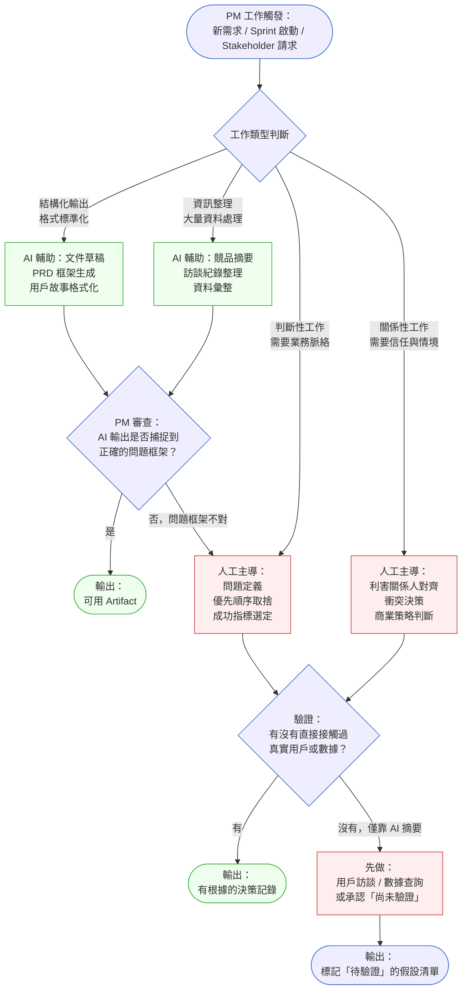
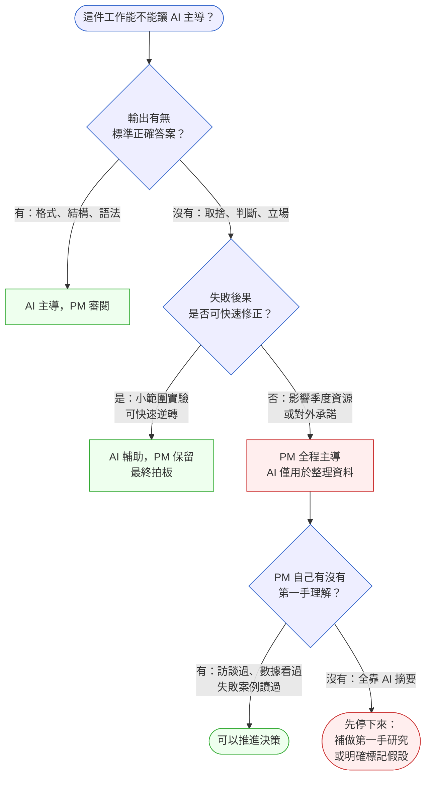

# 第 43 章 | The Augmented PM：AI 工具重組後的角色定義

> **前置閱讀**：[Ch 42　Data Privacy & Compliance：PM 的法規責任邊界](./ch-42-privacy-compliance.md) ⸺ 使用 AI 工具前須先理解資料主權邊界。
> **前置閱讀**：[Ch 40　LLM-Powered Products：PM 的技術理解底線](./ch-40-llm-product-pm.md) ⸺ 理解 LLM 的能力邊界，再判斷哪些工作可以外包給它。
> **下游章節**：無（本章為 PM Playbook Part VII 末章，亦可銜接 [Ch 1　Problem Discovery](../part-01-foundation/ch-01-problem-discovery.md) 重新出發）。
> **SA/SD 對照**：[SA/SD 第 44 章｜AI Coding Agent / Pair Programming](../../book/part-07-ai-era/ch-44-coding-agent.md) ⸺ SA/RD 視角聚焦 AI 工具對程式碼品質與架構決策的影響；本章聚焦 PM 如何判斷自身哪些判斷力不能讓渡給 AI。

---

## §43.1 冷觀察

季度 PRD Review，產品總監打開第三份文件，翻到「背景與動機」那一頁，抬起頭問了一句：

> 「這個功能是解決誰的問題？你自己的理解是什麼？」

Notewise 的 PM Ricky 停頓了三秒。三秒之後說出的答案，和文件裡寫的沒有差別。

產品總監把文件闔起來。「我在問你的理解，不是文件的理解。」

那三秒是一個節點。在那之前的六個月，Ricky 每一份 PRD 都借助 AI 工具生成第一版草稿，補充使用者故事，整理競品分析。速度快了三倍。每一次 sprint planning，Engineering 稱讚他的 spec 寫得清楚。Design 說背景脈絡充分。

但那三秒揭露了一件事：Ricky 處理的是 AI 輸出的優化，不是問題本身的理解。他知道功能的「什麼」，但對「為什麼在這個時間點、對這群用戶、這件事比其他事重要」的答案，是被 AI 生成出來的，不是他自己釐清過的。

Notewise 是一款 SaaS 協作筆記工具（CASE-SAS-115），在競爭激烈的工作流程市場裡，每個季度的功能取捨都牽涉用戶留存曲線與企業客戶的續約信心。這個 PRD 談的是一個 AI 自動摘要功能——市場上已有三個競品做過類似嘗試，兩個被用戶抱怨「摘要不如自己讀」，一個轉型成付費附加模組才撐起來。

這些背景，Ricky 的 AI 工具都摘到了。Ricky 自己有沒有真正讀過那兩個失敗案例、理解它們失敗在哪一個具體決策點——不清楚。

三秒沉默之後，那份 PRD 被退回重做。工程師在兩週後問：「上次說的方向還算嗎？」沒有人能確定地回答。

Sprint 爆掉，不是因為技術估算錯誤，而是因為功能邊界從未真正被釐清過。功能邊界沒被釐清，是因為 PM 對問題本身的理解，外包出去了。

---

## §43.2 真問題

### 表面需求（What）

Ricky 遇到的表面問題，看起來是「AI 工具用太多，導致產出品質下降」。但這個診斷是錯的——Notewise 的工程師在那六個月沒有抱怨 spec 品質。問題不在文件，問題在文件背後的判斷力是否存在。

### 業務目標（Why）

把它拆開來看：Ricky 使用 AI 工具的原始動機是速度——在高競爭的 SaaS 市場，每週 sprint 都需要新功能進入 backlog，PRD 是輸出瓶頸，AI 降低了這個瓶頸。

但 PRD 不只是輸出物（Output）。它是一個決策紀錄：為什麼是這個功能？為什麼是現在？它記錄的 Outcome 期待是什麼？它試圖移動的 Impact 指標是什麼？

| 層次 | Notewise 的問題 | 被 AI 取代的程度 |
|---|---|---|
| **Outputs** | 功能規格、使用者故事、驗收標準 | 高：AI 可以生成結構完整的輸出 |
| **Outcomes** | 用戶留存率改善、session 深度增加 | 中：AI 可以列出指標，但 PM 必須判斷哪個才是對的 |
| **Impact** | 企業客戶續約率、市場差異化 | 低：需要對商業脈絡與競爭格局有第一手判斷 |

Ricky 的問題不是速度和品質的取捨，而是他把 Outcomes 與 Impact 層次的判斷也一起外包了——他以為 AI 幫他「整理」，但其實那是讓 AI 幫他「定義問題」。

定義問題是 PM 不能外包的核心責任。

### 決策瓶頸（Who × When）

Notewise 那個 AI 自動摘要功能，在 PRD 退回重做之前，已有三個決策點沒有被明確決定：

1. **功能邊界**：自動摘要是幫誰摘要？個人用戶還是團隊共用文件？這兩個場景的技術實作差異極大。
2. **成功指標**：留存率改善是 six-month retention，還是 feature adoption rate？沒有定，代表上線後沒有判斷標準。
3. **競品對照**：失敗的競品究竟錯在哪一個具體決策——是 UX 流程、模型選型，還是定價策略？這件事需要 PM 自己讀過、理解過，才有資格在下一個設計評審中拍板。

這三個決策瓶頸，**都是 Ricky 的責任**，也都是 AI 工具給不了答案的地方——不是因為技術限制，而是因為這些決策依賴 Ricky 對 Notewise 用戶的直接接觸、對 Notewise 商業情境的第一手理解。

DACI 在這裡的問題不是分工不清，而是 Driver（Ricky）以為 AI 在幫他驅動問題釐清，實際上沒有人在驅動：

| 角色 | 人 | 狀況 |
|---|---|---|
| **D** Driver | Ricky | 委外給 AI，本人未全程介入 |
| **A** Approver | 產品總監 | 問了關鍵問題，才發現問題沒被定義清楚 |
| **C** Contributor | Engineering / Design | 配合 spec 工作，從未被問及「為什麼這樣定」 |
| **I** Informed | 業務、CS | 季後才知道功能方向，太晚提出疑慮 |

問題的根因，是 PM 把「生成工具」誤認為「思考工具」。AI 工具可以加速輸出的生成，但它無法替代 PM 與利害關係人的第一手接觸、替代 PM 對失敗案例的主動理解、替代 PM 在模糊情境中做出有立場的取捨。

---

## §43.3 決策框架

### 圖 A — Augmented PM：AI 工具分類 → 決策哪些外包 → 哪些保留人工



這張流程圖的核心判斷點只有兩個：**工作類型**（結構化輸出 vs. 判斷性工作）和**驗證來源**（有沒有直接接觸）。在 Notewise 的案例中，Ricky 跳過了第二個判斷點——AI 摘要的競品分析被當作「有讀過」，但沒有被問「你自己是否真的理解了失敗原因」。

### 圖 B — PM 判斷力保留決策樹



這棵決策樹給出的是一個可操作的自問清單，不是工具推薦清單。工具會更替，但判斷邏輯不會。

### AI 工具分類決策表

| 工作類型 | 觸發情境 | AI 適合的介入程度 | PM 必須保留的 | 常見錯誤 |
|---|---|---|---|---|
| **文件生成** | PRD 起草、用戶故事寫作、會議紀錄 | 高：讓 AI 產生初版結構 | 問題定義段落必須自己寫 | 直接採用 AI 的「背景與動機」，未驗證問題框架 |
| **資訊蒐集** | 競品分析、用戶訪談摘要、數據彙整 | 高：摘要與結構化 | 「為什麼失敗」的因果判斷 | 把 AI 的摘要當作「讀過」，跳過自己的詮釋 |
| **優先順序決策** | Backlog grooming、季度規劃 | 低：AI 可提供框架但不可排序 | 取捨背後的商業立場 | 用 AI 建議的「impact × effort」矩陣直接排序，沒有加入 stakeholder 政治與策略考量 |
| **成功指標定義** | PRD 指標欄位、OKR 設計 | 低：AI 可列出指標選項 | 判斷哪個指標代表真正的 Outcome | 選了 AI 建議的指標，但沒有確認指標是否可量測、是否有資料來源 |
| **Stakeholder 溝通** | 向上匯報、跨部門對齊、拒絕需求 | 極低：AI 可提供話術框架 | 立場與判斷的真實性 | 用 AI 生成的「溝通話術」代替自己的立場，對方追問時無法展開 |
| **失敗案例分析** | 競品失敗、自家功能失敗回顧 | 低：AI 可彙整資訊 | 理解失敗的具體決策節點 | 把 AI 的「原因分析」當作結論，沒有追問「那個決策當時的情境是什麼」 |

### If-Then 框架：判斷 AI 工具介入程度

- **If** 工作輸出是「格式化文件」或「資訊整理」 → **Then** 讓 AI 主導生成，PM 花時間審閱問題框架是否正確（重點：花在「問題框架」，不是「文字潤飾」）
- **If** 工作需要「因果判斷」或「取捨立場」 → **Then** PM 先自己釐清，再用 AI 整理成可溝通的格式（重點：AI 是最後一步的格式化，不是第一步的思考）
- **If** 你無法在沒有 AI 輸出的情況下解釋「為什麼做這個決策」 → **Then** 這個決策還沒完成（重點：能不能把 AI 的輸出放下，用自己的話說清楚）
- **If** deadline 壓力讓你跳過「直接接觸」（訪談、數據查閱） → **Then** 在文件中明確標記「以下為未驗證假設」，並排定驗證時間點（重點：標記假設比假裝已知更有利於後續決策）

這個框架的核心原則很簡單：**AI 工具是外包執行，不是外包判斷**。PM 的不可替代性，在於判斷力，而判斷力只從第一手接觸中生長。

---

## §43.4 踩坑清單

### 反模式 1 — PRD 代筆陷阱

現象：PM 讓 AI 從頭生成 PRD，自己只修改格式與語氣。文件結構完整，閱讀流暢，但「背景與動機」段落缺乏 PM 自己的詮釋。

根因：把「寫作速度」等同於「思考完成」。AI 填滿了格式，讓 PM 感覺已完成，但問題框架沒有被 PM 自己過一遍。

> 修正方向：把「背景與動機」列為不得使用 AI 生成的段落。這段必須是 PM 自己用口語說出來再整理成文字，而非反過來從文字去推論自己是否理解。

---

### 反模式 2 — 摘要即理解

現象：PM 把 AI 生成的競品分析、用戶訪談摘要視為「已讀完」。在評審中被問到細節時，無法展開解釋。

根因：信任 AI 的資訊處理能力，混淆了「資訊被整理過」與「判斷力被建立」。資訊整理降低了讀取成本，但沒有替代理解過程。

> 修正方向：對每一份 AI 摘要，加一個自問步驟：「如果沒有這份摘要，我能不能描述這件事的核心衝突？」如果答案是否，代表還需要直接閱讀原始資料。

---

### 反模式 3 — 指標選擇外包

現象：PM 用 AI 生成「建議的成功指標」清單，直接選一個放進 PRD。上線後發現指標可以達成但 Outcome 沒有改善，因為指標本身選錯了。

根因：指標的選擇依賴對「什麼叫成功」的業務判斷，而這個判斷需要對用戶、商業模型、競爭格局有第一手理解。AI 無法知道哪個指標對 Notewise 的這個季度最重要。

> 修正方向：在 PRD 的指標欄位旁邊加一個不公開的自問欄：「為什麼這個指標，而不是另一個？」這個問題必須是 PM 自己回答的，答案在文件之外，但答不出來代表指標選擇未完成。

---

### 反模式 4 — 話術取代立場

現象：PM 用 AI 生成的「溝通話術」向 stakeholder 表達立場，對方追問時換一套 AI 話術，溝通陷入迴圈。

根因：沒有立場的溝通只能依賴話術。話術在被追問兩層後就會露餡，因為 AI 給的框架沒有根植在這個具體決策的歷史與政治脈絡中。

> 修正方向：把 AI 生成的溝通框架當作「有哪些溝通維度需要覆蓋」的 checklist，但每個維度的實質內容必須是 PM 自己的判斷。在進入重要溝通前，先用一句話說清楚「我的立場是什麼、為什麼」。

---

### 反模式 5 — 假設透明度缺失

現象：PM 在 deadline 壓力下，沒有做第一手研究，靠 AI 生成的「市場假設」推進決策。文件裡看不出哪些是驗證過的事實、哪些是未驗證的假設。

根因：AI 生成的內容看起來有據有引，難以區分事實與推測。PM 在壓力下選擇「看起來完整」勝過「誠實標記不確定性」。

> 修正方向：建立一個簡單的文件慣例：在 PRD 的假設清單欄位中，把「AI 生成但未驗證」的項目用角色標記區分。讓 Engineering 和 Design 知道哪些假設還需要驗證，比讓他們在開發中途發現假設有問題，成本低得多。

---

## §43.5 交付清單 ⸺ 一頁式 AI 工具介入邊界卡

每次開始一個新功能的 PRD 或決策之前，用這張卡確認哪些工作可以讓 AI 主導、哪些必須 PM 親自完成。目的不是限制 AI 工具的使用，而是讓 PM 對自己的判斷責任保持清醒。

````markdown
# AI 工具介入邊界卡 — {功能名稱} / {日期}
> 版本:v0.1 | 撰寫日期:YYYY-MM-DD | 擁有人:{名字}

### 1. 問題框架（PM 必須自行完成，不得 AI 生成）

- 一句話問題：{誰、做不到什麼、代價是什麼}
- 為什麼是現在：{這個時間點的外部或內部觸發是什麼}
- 為什麼比其他事重要：{和 backlog 裡的其他候選功能相比，這個更重要的理由}

### 2. 第一手接觸確認

- [ ] 用戶訪談（或近期 session 資料查閱）已完成
- [ ] 相關競品失敗案例已直接閱讀（非僅靠 AI 摘要）
- [ ] 成功指標已確認可量測（資料來源確認）

### 3. AI 工具使用範圍（本功能）

| 工作項目 | AI 主導 | AI 輔助 | PM 主導 |
|---|---|---|---|
| PRD 框架生成 | | | |
| 用戶故事格式化 | | | |
| 競品資訊整理 | | | |
| 問題定義段落 | | | |
| 優先順序決策 | | | |
| 成功指標選定 | | | |
| Stakeholder 溝通立場 | | | |

### 4. 未驗證假設清單

| 假設內容 | 來源（AI 生成 / 訪談 / 數據） | 驗證方式 | 驗證期限 |
|---|---|---|---|
| | | | |

### 5. 核心判斷備忘（PM 親筆）

- 這個功能如果失敗，最可能的失敗點是：{PM 自己的判斷}
- 我在做這個決定時最不確定的一件事是：{誠實說出來}
````

把它存在 `docs/product/ai-boundary-cards/`，跟程式碼同 repo，跟 README 同層。

### §43.5.1 範例：Notewise AI 自動摘要功能 PRD 啟動

Ricky 的 PRD 被退回之後，他重新填了一張卡。第一次填的時候，「第一手接觸確認」那三個 checkbox 全部是空的。

````markdown
# AI 工具介入邊界卡 — AI 自動摘要功能 / 2026-05-14
> 版本:v0.1 | 撰寫日期:2026-02-15 | 擁有人:Ricky（PM, Notewise）

### 1. 問題框架（PM 必須自行完成，不得 AI 生成）

<!-- 為什麼這欄：沒有這句話，後面所有決策都可能在錯誤的問題上打轉；
     這句話必須是 PM 自己說得出來的，不是從 AI 輸出中篩選出來的。 -->
- 一句話問題：Notewise 企業用戶在多人協作文件超過 50 頁後，
  找不到當初討論的決策脈絡，導致會議重工率升高，
  PM 估算每個 team 每週浪費 3–4 小時。
- 為什麼是現在：兩個企業客戶在 CS 訪談中提到這個痛點；
  競品 Flowdocs 在 Q1 推出類似功能但用戶反饋差（原因待查）。
- 為什麼比其他事重要：目前 backlog 其他候選功能主要影響 new user onboarding；
  這個功能的潛在影響是企業客戶 Q3 續約決策，商業優先級更高。

### 2. 第一手接觸確認

<!-- 為什麼這欄：假設沒有被接觸過的事實支撐，後面的決策只是在複述 AI 的推測；
     填這欄的過程本身就是確認 PM 有沒有做過功課。 -->
- [x] 用戶訪談（或近期 session 資料查閱）已完成
      → 完成 3 次 CS 轉介企業用戶訪談，核心痛點：搜尋不準確 + 決策脈絡斷裂
- [x] 相關競品失敗案例已直接閱讀（非僅靠 AI 摘要）
      → 閱讀 Flowdocs 用戶論壇 23 則反饋，失敗點：摘要粒度太粗（段落級而非決策級）
- [ ] 成功指標已確認可量測（資料來源確認）
      → 待確認：「會議重工率」目前沒有直接量測方式，改用 proxy：搜尋後編輯次數

### 3. AI 工具使用範圍（本功能）

| 工作項目 | AI 主導 | AI 輔助 | PM 主導 |
|---|---|---|---|
| PRD 框架生成 | ✓ | | |
| 用戶故事格式化 | ✓ | | |
| 競品資訊整理 | | ✓（PM 審閱原始資料）| |
| 問題定義段落 | | | ✓ |
| 優先順序決策 | | | ✓ |
| 成功指標選定 | | ✓（列選項）| ✓（最終選定）|
| Stakeholder 溝通立場 | | | ✓ |

### 4. 未驗證假設清單

<!-- 為什麼這欄：讓 Engineering 和 Design 知道哪些是已知、哪些是假設，
     比在開發中途發現「原來那是假設」的成本低很多。 -->
| 假設內容 | 來源 | 驗證方式 | 驗證期限 |
|---|---|---|---|
| 企業用戶每週重工 3–4 小時 | CS 訪談（2 人樣本） | 追加 5 人訪談或 session 時長分析 | 2026-05-28 |
| Flowdocs 失敗因為粒度太粗 | 用戶論壇自行閱讀 | 工程評估摘要粒度可行性 | Sprint Planning 前 |
| proxy 指標可代表原始痛點 | PM 判斷 | A/B 測試設計驗證 | 功能上線後 4 週 |

### 5. 核心判斷備忘（PM 親筆）

- 這個功能如果失敗，最可能的失敗點是：
  AI 摘要的粒度——太粗沒用，太細干擾閱讀流，
  這個邊界目前沒有很好的數據，需要快速原型測試。
- 我在做這個決定時最不確定的一件事是：
  「搜尋後編輯次數」這個 proxy 指標，
  有沒有辦法真正反映「決策脈絡斷裂」這個原始問題。
````

把不確定的事情寫進文件，比把不確定的事情藏在 AI 輸出後面，更容易讓團隊在對的地方提出疑問。

---

## §43.6 Recap

讀完本章，你應該已經能做到：

- [ ] 在開始新功能 PRD 之前，快速判斷哪些工作適合 AI 主導、哪些必須 PM 親自完成
- [ ] 識別「摘要即理解」的陷阱，確認 AI 整理的資訊背後有 PM 自己的因果判斷
- [ ] 用「能不能放下 AI 輸出，用自己的話說清楚這個決策」作為完成度的檢查標準
- [ ] 在 PRD 的假設清單中，明確標記「AI 生成但未驗證」的假設，給團隊清晰的風險地圖
- [ ] 把 AI 工具介入邊界卡當作 PRD 啟動的前置動作，而不是事後的自查清單

如果先挑一件做，建議是「問題框架段落不讓 AI 生成」⸺ 強迫自己用口語把問題說出來再整理成文字，這個動作本身就是判斷力的訓練，也是讓 AI 幫不到你的地方，恰好是你最值得投入的地方。

---

## Cross-References

- **前一章**：[Ch 42　Data Privacy & Compliance：PM 的法規責任邊界](./ch-42-privacy-compliance.md) ⸺ AI 工具的使用涉及資料處理邊界，需先理解合規限制
- **強連結**：[Ch 40　LLM-Powered Products：PM 的技術理解底線](./ch-40-llm-product-pm.md) ⸺ 理解 LLM 能力邊界是判斷「外包給 AI」安全程度的前提
- **強連結**：[Ch 11　Writing Specs That Engineers Trust：規格的可執行性](../part-02-discovery/ch-11-executable-specs.md) ⸺ Spec 品質的根基是問題理解，本章是其 AI 時代的延伸
- **強連結**：[Ch 1　Problem Discovery：從需求洪流到有效問題](../part-01-foundation/ch-01-problem-discovery.md) ⸺ 問題定義是 PM 不可外包的核心，Augmented PM 概念在此章找到起點
- **SA/SD 對照**：[SA/SD 第 44 章｜AI Coding Agent / Pair Programming](../../book/part-07-ai-era/ch-44-coding-agent.md) ⸺ SA/RD 視角探討 AI 工具如何影響程式碼品質與架構決策；本章從 PM 角色探討同一問題的另一面：當 AI 工具讓「執行更快」，如何確保「判斷更準」
- **SA/SD 對照**：[SA/SD 第 51 章｜人類不能外包的邊界](../../book/part-09-human-engineer/ch-51-human-judgment-boundary.md) ⸺ 從工程師角度談人類判斷力的不可替代性，與本章的 PM 視角構成對照
